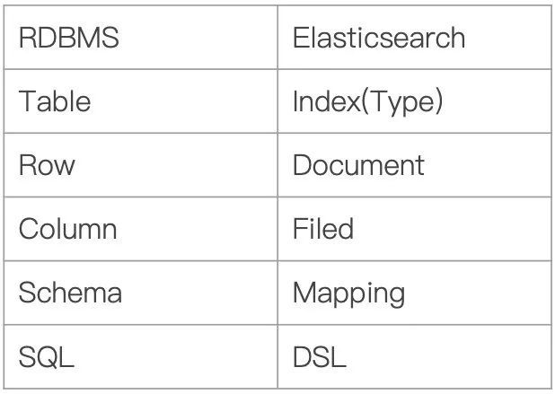
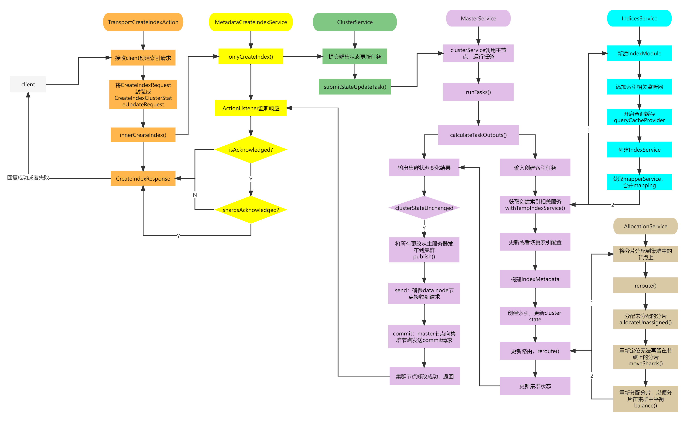
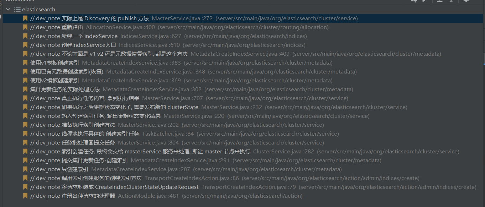

# █ ElasticSearch

# 〇. 背景知识

Elasticsearch也使用Java开发并使用`Lucene`作为其核心来实现所有索引和搜索的功能，但是它的目的是通过简单的 RESTful API 来隐藏`Lucene`的复杂性，从而让全文搜索变得简单。

- 分词技术
- 倒排索引
- 文件IO优化
- B树与B+树

es是基于Apache Lucene的开源分布式（全文）搜索引擎，，提供简单的RESTful API来隐藏Lucene的复杂性。

es除了全文搜索引擎之外，还可以这样描述它：
 1、分布式的实时文件存储，每个字段都被索引并可被搜索
 2、分布式的实时分析搜索引擎
 3、可以扩展到成百上千台服务器，处理PB级结构化或非结构化数据。

在讲解Elasticsearch的架构之前，首先我们得了解一下Elasticsearch的一些常见术语。

- **Index**：Elasticsearch的Index相当于数据库的Table
- **Type**：这个在新的Elasticsearch版本已经废除（在以前的Elasticsearch版本，一个Index下支持多个Type--有点类似于[消息队列](https://cloud.tencent.com/product/cmq?from=10680)一个topic下多个group的概念）
- **Document**：Document相当于数据库的一行记录
- **Field**：相当于数据库的Column的概念
- **Mapping**：相当于数据库的Schema的概念
- **DSL**：相当于数据库的SQL（给我们读取Elasticsearch数据的API）



ES 与关系数据库不完全正确类比

| 关系数据库         | ElasticSearch   |
| ------------------ | --------------- |
| 数据库（database） | 索引（indices） |
| 表（tables）       | types           |
| 行（rows）         | documents       |
| 字段（columns）    | fields          |


# 一. 安装与部署

上手Elasticsearch非常容易。它提供了许多合理的缺省值，并对初学者隐藏了复杂的搜索引擎理论。它开箱即用（安装即可
使用），只需很少的学习既可在生产环境中使用。

直接官网下载, 解压后通过脚本启动

> <安装路径>/bin/elasticsearch.bat

访问端口默认 `9200`

可通过 `curl` 命令与es服务器进行交互


# 二. 基本配置

主要配置文件 `config/elasticsearch.yml`


# 三. 基本操作

ElasticSearch 通过 Restful API 对外提供访问接口, 可以通过任意 http client 进行读写访问, 比如 `curl` 或各种语言提供的 httpClient

## 插入数据

使用 `put` 请求插入数据, 有则修改, 无则创建

```sh

```


## 

# 四. 工作原理

## 索引创建流程

https://blog.csdn.net/dkjhl/article/details/124584412







没找到关于 shard-started 聚合相关的代码, 

但是在那个提交 clusteState 更新任务的地方, 我打断点之后发现 shard-started 的任务出现的次数, 跟主分片/复分片的数量有关, 如果索引创建时要求的多, 就会多几个 shard-started 的任务


