# █ Maven 笔记

by [luojbin](https://github.com/luojbin/)

# 一. 简介

## 1. 什么是 maven

Maven 是一个项目管理工具, 包含了以下内容:

- 一个项目对象模型,  project object model
- 一组标准集合, 
- 一个项目生命周期, project lifecycle
- 一个依赖管理系统, dependency management system
- 以及定义在生命周期各阶段(phase)的插件(plugin)和目标(goal) 

当你使用 maven 的时候, 你要用一个明确定义的项目对象模型, 然后 maven 可以应用横切的逻辑, 这些逻辑来自一组共享的或者自定义的插件

## 2. 约定优于配置

"约定优于配置" 是一个简单的概念, 系统, 类库, 框架都应该设定一些合理的默认值, 而不要求用户提供一些非必须的配置. 

maven 默认情况下规定了项目的几个关键目录, 只要用户将相应的文件放在这下路径下, maven 就能正常工作. 而且 maven 最有价值的"约定"是它默认的项目生命周期, 以及一组构建和装配软件的通用插件.

只要遵循 maven 的这些约定, 用户几乎不需要添加配置, maven 就可以将剩下的事情完成.

约定优于配置的"副作用"是牺牲了一定的自由度, 但这是值得的, 遵循一定的约定, 会让软件开发和技术交流变得更加容易. 

如果确实需要对项目进行更多的自定义设置, maven 也允许用户修改相关的配置.

## 3. 插件的重用

maven 的核心其实不做什么事情, 主要完成 pom 的解析和仓库的管理, 实现依赖/插件的下载工作. 

而具体的构建工作, 则是由插件来实现. 如果某个插件的新版本引入了新的功能特性, 那么用户可以通过更换这个插件的版本, 来获取到新的特性, 而完全不需要对自己项目代码做任何修改

## 4. 使用 maven

### 4.1.基本概念

在使用 maven 之前, 需要先了解几个概念

- **仓库 repository**

  存储 maven 在项目构建过程中需要使用的一些构件, 包括依赖, 插件等, 有远程仓库和本地仓库

  maven 在构建过程中会先从本地获取需要的构件, 如果本地没有找到, 则会从远程仓库获取

- **坐标 coordinate**

  从仓库中定位一个构件需要提供的信息, 包括 `GroupId-组织`,  `ArtifactId-项目`, `Packaging-打包类型`, `Version-版本号` 

  在声明自己项目的时候, 使用如下格式声明坐标

  ```xml
  <groupId>com.loyofo</groupId>
  <artifactId>mutilmvn</artifactId>
  <packaging>pom</packaging>
  <version>1.0-SNAPSHOT</version>
  ```

  而在引用依赖的时候, 则是使用如下格式, 注意其中的 `packaging` 换成了 `type`

  ```xml
  <dependency>
      <groupId>junit</groupId>
      <artifactId>junit</artifactId>
      <!-- type 默认为 jar, 可省略 -->
      <type>jar</type>
      <version>3.8.1</version>
  </dependency>
  ```

  其中的 `packaging`, 或者说 `type`,  默认为`jar`, 这也是依赖真正要用的部分, 因此 maven 坐标通常也会称为 `GAV` 坐标.

  xml 格式比较冗长, 有的地方也会有缩略写法, 如 gradle, 缩略格式将 GAPV 按顺序排列, 用冒号 `:` 分隔,  如下:

  > groupId: artifactId: packing: version

- **插件 plugin**

  maven 依靠插件来完成项目构建工作, 这些插件可以通过坐标从仓库中获取. 如下所示

  ```xml
  <plugin>
      <groupId>org.apache.tomcat.maven</groupId>
      <artifactId>tomcat7-maven-plugin</artifactId>
      <version>2.2</version>
  </plugin>
  ```

- **目标 goal**

  目标, 即一个插件需要完成的某个工作任务. maven 对项目的构建工作, 就是通过执行一个个插件目标来完成的, 

  目标是插件提供的, 某个插件的某个目标, 可以用如下格式来确定

  > plugin: goal

- **生命周期阶段 phase**

  生命周期中的某个阶段, 通常会跟某个插件目标绑定在一起, 执行这个阶段的时候, 就是执行这个插件的目标

- **生命周期 lifeCycle**

  项目构建的全过程, 称为 maven 项目的生命周期, 由一个个的生命周期阶段组成, 

  当生命周期阶段依次执行时, 就会完成一个个的插件目标, 完成 编译-测试-打包-发布 的一系列工作

- **项目对象模型 pom**

  项目描述的模型, 记录了项目的坐标, 许可信息, 开发者信息, 依赖, 插件, profile 等内容, 

  修改 `pom.xml` 的内容, 可以指导 maven 如何去完成构建工作.

### 4.1. 运行 maven

#### 1)通过插件目标执行

maven 的具体工作其实是一个个的插件目标, 如果想让 maven 执行某个工作, 可以直接通过命令执行插件目标

> mvn 插件: 目标

#### 2) 通过生命周期(阶段)执行

maven 的生命周期是一个插件目标的序列, 当我们指定让 maven 执行到生命周期中的某一个阶段时, maven 将会按照生命周期的顺序, 依次完成前导的各个阶段, 即完成了一系列的插件目标, 然后在完成指定阶段所绑定的插件目标后结束.

> mvn 生命周期阶段

#### 3) 带参数执行

有时候需要修改构建工作, 比如修改参数, 或指定 profile, 可以在命令中加入参数来实现

其中 `-D` 表示修改参数, `-P` 表示激活指定的配置文件

> mvn 命令 -D参数 -P配置profile

#### 4) Ide 工具

##### a. eclipse + m2e

eclipse 集成了 m2e 插件, 通过右键的 `maven build...` , 设置命令后执行

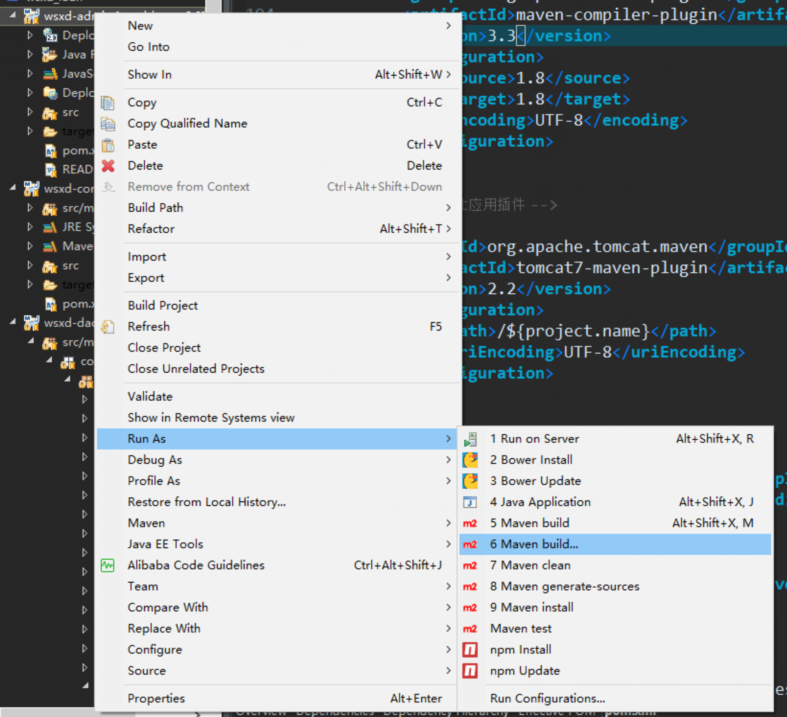

##### b. idea + maven support

idea 自带了一个 maven support 的插件, 默认显示在界面右侧边栏, 可以快速执行某个生命周期阶段, 切换profile, 或是运行某个插件, 也可以自己输入命令执行

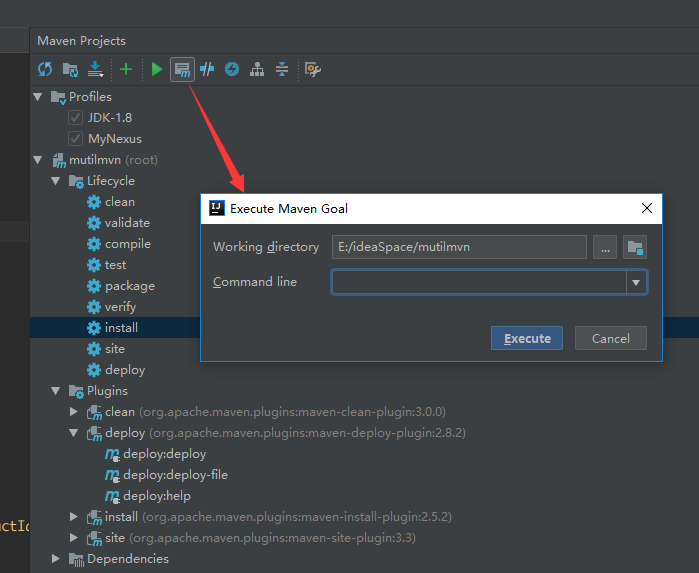

### 4.3. 使用 Maven Help 插件

maven help 插件有四个目标:

- **help: active-profiles**

  列出当前构建中的有效 profile, 并指出该 profile 是在什么地方定义的

- **help: effective-pom**

  显示当前构建的实际 pom, 包含活动的 profile

- **help: effective-settings**

  显示项目的实际 settings, 包括全局 settings, 和用户 settings

- **help: describe**

  描述插件的属性, 相当于插件的帮助文档, 不需要在项目目录下运行, 但需要`-Dplugin`指定要查询的插件

  使用插件的前缀查询 

  > mvn help:describe -Dplugin=**help**

  使用插件的坐标查询, 其中 version 是可选的

  > mvn help:describe -Dplugin=**Gid:Aid:Ver** 

  如果需要更详细的介绍, 可以添加 `-Dfull` 参数

  > mvn help:describe -Dplugin=help **-Dfull**

  也可以查看插件某个目标的介绍, 使用 `-Dmojo` 参数传入

  > mvn help:describe -Dplugin=compiler **-Dmojo=compile** -Dfull

## 5. 项目对象模型


### 5.1. pom 的内容

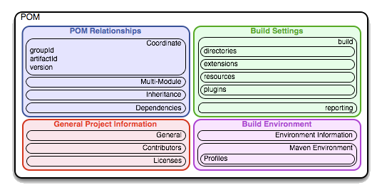

pom 包含四类描述和配置

- 项目总体信息

  包含一个项目的名称, url, 发起组织, 项目开发者和贡献者, 许可证等

- 构建设置

  可以在这一部分自定义 maven 的构建行为, 可以更改源码和测试代码的位置, 添加插件, 绑定插件到生命周期, 自定义站点生成参数等

- 构建环境

  构建环境包含了一些能在不同使用环境中激活的 profile, 比如在开发环境和生产环境使用不同的数据库配置信息等

- pom 关系

  一个项目很少孤立存在, 它会以来与其他项目, 可能从父项目继承 pom 设置, 要定义自身的坐标, 还可能包含子模块

### 5.2. 超级 pom

maven 定义了一个超级 pom, 所有项目都会从超级 pom 中继承设置, 超级 pom 中的设置, 就是maven的"约定"部分, 遵循约定有利于项目的分享和交流, 如非必要不应修改相关配置. 

- 超级 pom 中定义了默认的中央仓库, 但关闭了 SNAPSHOT , 用户可以从中央仓库获取依赖, 但不能获取到 SNAPSHOT 的开发中版本.
- 如果想使用 maven 私服, 或者其他的第三方仓库, 可以在 `settings.xml` 或是项目的 `pom.xml` 中自定义仓库设置.
- 中央仓库也包含插件, 同样关闭了 SNAPSHOT 版本. 为了兼容旧项目, 超级 pom 声明了旧版的插件版本, 且默认不更新. 如果确定需要使用新版本的插件, 请在自己的项目 `pom.xml` 中声明 
- `build` 元素设置了 maven 标准目录

### 5.3. 有效 pom

所有 maven 项目的 pom 都继承自超级 pom, 同时还会从`settings.xml` , `父项目 pom`,  `profile` 中获取设置, 最终得到一个混合了各个 pom 设置的有效 pom, 如果想查看项目最终有效的 pom, 可以运行 help 插件的目标获取

> mvn help: effective-pom

### 5.4. 自定义 pom

可以在 pom 中进行各种构建设置, 典型的 pom 结构如下

[pom支持的完整内容](http://maven.apache.org/ref/3.5.4/maven-model/maven.html)

```xml
<project>
    <!-- 当前pom的版本, 一般为4.0.0 -->
    <modelVersion/>

    <!-- 声明当前项目所属的父项目 -->
    <parent>
        <groupId/>
        <artifactId/>
        <version/>
        <relativePath/>
    </parent>

    <!-- 声明当前项目的坐标 -->
    <groupId/>
    <artifactId/>
    <version/>
    <packaging/>

    <!-- 声明当前项目的描述 -->
    <name/>
    <description/>
    <url/>

    <!-- 声明发布的相关信息, 发布到什么地方 -->
    <distributionManagement/>
    
    <!-- 声明当前模块包含哪些子模块 -->
    <modules>
    	<module/>
    </modules>

    <!-- 自定义变量 -->
    <properties>
        <key>value</key>
    </properties>

    <!-- 声明依赖, 但并未真正加载, 要用的话需要在 dependencies 中添加 -->
    <dependencyManagement>
        <dependencies>
            <dependency/>
        </dependencies>
    </dependencyManagement>

    <!-- 添加依赖, 如果在 dependencies 中有声明, 则可以只写 Gid 和 Aid -->
    <dependencies>
        <dependency/>
    </dependencies>

    <!-- 添加仓库 -->
    <repositories>
        <repository/>
    </repositories>

    <!-- 添加插件仓库 -->
    <pluginRepositories>
        <pluginRepository/>
    </pluginRepositories>

    <!-- 构建设置 -->
    <build>
        <!-- 添加资源目录 -->
        <resources>
            <resource/>
        </resources>

        <!-- 添加测试资源目录 -->
        <testResources>
            <testResource/>
        </testResources>
		
        <!-- 构建后文件的位置和文件名 -->
        <directory/>
        <finalName/>
        
        <!-- 资源过滤器, 可以替换资源目录中文件中的变量 -->
        <filters/>
        
        <!-- 声明插件, 但未真正加载, 需要在 plugins 中添加 -->
        <pluginManagement>
            <plugins>
                <plugin/>
            </plugins>
        </pluginManagement>

        <!-- 添加插件, 如果在 pluginManagement 中有声明, 可以只写 Gid 和 Aid -->
        <plugins>
            <plugin/>
        </plugins>
    </build>

    <!-- 添加 profiles -->
    <profiles>
        <profile/>
    </profiles>
</project>
```

### 5.5. 项目版本号

maven 建议采用以下格式定义版本号

> <主版本号>. <次版本号>. <增量版本号>-<限定版本号>

如 `1.3.5`, `1.0.2-alpha`

当按照这个格式声明项目版本时, 则可以在以后引用依赖时使用"依赖版本界限"对依赖版本进行限制.

如果不符合这个规则, 则会使用字符串比较.

**SNAPSHOT - 快照**

对于 SNAPSHOT 的开发版本, maven 会在发u这个组件时将该符号展开成时间戳, 即发布了该项目的一个快照版本.

**LATEST,  RELEASE**

LATEST: 表示某个特定构件的最新发布版本(如果启用了 snapshot 库则是最新快照版本)

RELEASE: 表示仓库中最后一个非快照的版本

不建议在项目中使用这种不确定的版本, 可能在版本变换时会出现意想不到的问题. 

### 5.6. 属性引用

pom 里面可以使用 `${...}` 来引用一个属性, 在构建时会将有效的值替换到引用处, 可以在有效 pom 中看到

#### 1) 声明属性变量

通常会使用 `properties` 元素来声明一些变量, 就可以在 pom 中其他地方进行引用

> &LT;KEY> VALUE &LT;/KEY>

```xml
<properties>
    <spring.version>4.3.3.RELEASE</spring.version>
</properties>
```

#### 2) 预设属性变量

除了用户自己定义的属性变量, maven 也有几个预设的属性

- env

  `${env.xxx}` 属性暴露了操作系统或者 shell 的环境变量, 比如 ${env.PATH} 会被替换成系统的 PATH 变量

- project

  `${project.xxx}` 变量暴露了当前 pom, 可以使用 `.` 路径来引用 pom 中定义的属性值

  如 `${project.groupId}` 引用了当前项目的 GroupId

- settings

  `${settings.xxx}` 暴露了 maven settings 的信息, 可以引用在 `setting.xml` 中定义的属性值

#### 3) 引用属性变量

使用 `${...}` 对已声明的属性进行引用, 将会在构建时替换成真实值

```xml
<dependency>
    <groupId>org.springframework</groupId>
    <artifactId>spring-webmvc</artifactId>
    <version>${spring.version}</version>
</dependency>
```

# 二. 依赖管理

## 1. 添加依赖

在 `pom.xml` 中的 `dependencies` 下添加 `dependency`,  指定想要的依赖包的坐标, maven 就会为项目添加该依赖

```xml
<dependencies>
    <dependency>
        <groupId>junit</groupId>
        <artifactId>junit</artifactId>
        <version>3.8.1</version>
        <!-- type 默认为 jar, 可省略 -->
        <type>jar</type>
    </dependency>
</dependencies>
```

添加完依赖后, 需要让 maven 加载新的依赖, eclipse-update, idea-reimport

> mvn dependency: resolve

### 1.1. 传递性依赖

在实际项目中, 我们项目依赖的构件, 可以也依赖于其他的一些构件. maven 支持传递性依赖, 我们只需要在 pom.xml 中添加我们直接依赖的库, maven 获取到这些构件后 (同时也会获取该构件的pom, 根据这个pom获取它的依赖), 会进一步地获取被这些构件依赖的构件并加入我们的项目中.

如果想要了解项目的依赖树, 可以通过命令获取:

> mvn dependency: tree

如果有多个不同构件, 依赖了同一个构件的不同版本, maven 会根据**就近原则**, 获取依赖层次最低的那个版本. 如果需要使用其他版本, 则可以在我们自己的 `pom.xml` 中指定需要使用的版本 (改变了该构件在依赖树中的层次).

如果想了解完整的依赖踪迹, 包含那些因为依赖冲突或其他原因被拒绝引入的构件, 可以打开 maven 的调试标记 `-X` 执行

> mvn install -X

### 1.2. 可选依赖

如果有这么一个接口项目, 声明了一套 API 接口, 并可以选择使用多个不同的实现. 

用户在使用时, 可能只是需要其中一个, 而不希望同时引入两套实现, 这种时候可以使用可选依赖.

> &lt;optional> true &lt;/optional>

```xml
<dependencies>
    <dependency>
        <groupId>org.springframework</groupId>
        <artifactId>spring-tx</artifactId>
        <version>${spring.version}</version>
        <!-- 声明这是个可选依赖 -->
        <optional>true</optional>
    </dependency>
</dependencies>
```

当在一个项目中将依赖声明为可选依赖后, maven 在组织传递性依赖的时候将不会引入该依赖, 而必须在主项目的 pom 中显式引入要使用的可选依赖.

还有另外一种方式是创建一系列的多个子项目, 每个子项目引用一个特定的实现, 而不是在一个项目中声明可选依赖. 这样最终用户只需要选择合适的子项目, 而不需要在引用项目的同时声明该项目需要的可选依赖. 

### 1.3. 检查直接依赖

可能会存在一种情况, 项目代码中引用了一个传递性依赖, 但并没有在项目 pom 中显式的声明引入. 这会存在一种风险, 如果带来这个传递性依赖升级后去掉了这个传递性依赖, 那么这个传递性依赖将从项目的依赖树中移除, 这个时候, 由于缺少依赖, 项目将构建失败.

为了避免这种情况, 建议总是声明对直接依赖的引用. 

使用 maven 的 dependency 插件对项目进行分析, 可以找到未声明的依赖

> mvn dependency: analyze

## 2. 依赖版本管理

### 2.1. 版本属性变量

实际项目中, 可能会有多个相关的构件, 使用相同的版本号, 若我们为每个构件单独指定版本号, 麻烦而且不便修改. 借助 pom 属性引用, 可以先声明一个属性变量, 然后依赖版本中引用这个属性. 这样可以实现插件版本的统一管理, 而且需要替换版本时也更加方便.

```xml
<!-- 声明属性 -->
<properties>
    <spring.version>4.3.3.RELEASE</spring.version>
</properties>

<!-- 多个依赖引用同一个属性 -->
<dependencies>
    <dependency>
        <groupId>org.springframework</groupId>
        <artifactId>spring-tx</artifactId>
        <version>${spring.version}</version>
    </dependency>

    <dependency>
        <groupId>org.springframework</groupId>
        <artifactId>spring-web</artifactId>
        <version>${spring.version}</version>
    </dependency>

    <dependency>
        <groupId>org.springframework</groupId>
        <artifactId>spring-webmvc</artifactId>
        <version>${spring.version}</version>
    </dependency>
</dependencies>
```

### 2.2. 多模块依赖管理

对于多模块项目, 可以统一在父项目中使用 `dependencyManagement` 元素声明依赖版本, 而子模块只需要指定依赖的  Gid 和 Aid, 不需关心版本的问题.

`dependencyManagement` 元素只负责声明依赖, 但并未真正引用依赖, 子模块在需要引用依赖时, 需要在`dependencies` 元素中指定 Gid 和 Aid

- 在父项目 pom 中使用 `dependencyManagement` 元素声明

  ```xml
  <dependencyManagement>
      <dependencies>
          <dependency>
              <groupId>javax.servlet.jsp</groupId>
              <artifactId>jsp-api</artifactId>
              <version>2.2.1-b03</version>
              <scope>provided</scope>
          </dependency>
  
          <dependency>
              <groupId>javax.servlet</groupId>
              <artifactId>javax.servlet-api</artifactId>
              <scope>provided</scope>
              <version>${servlet-api.version}</version>
          </dependency>
  
          <!-- spring -->
          <dependency>
              <groupId>org.springframework</groupId>
              <artifactId>spring-beans</artifactId>
              <version>${spring.version}</version>
          </dependency>
  
          <dependency>
              <groupId>org.springframework</groupId>
              <artifactId>spring-jdbc</artifactId>
              <version>${spring.version}</version>
          </dependency>
      </dependencies>
  </dependencyManagement>
  ```

-  在子项目中使用依赖, 版本号从父项目中继承, 如果注明则覆盖父项目中的设置

  ```xml
  <dependencies>
      <dependency>
          <groupId>javax.servlet.jsp</groupId>
          <artifactId>jsp-api</artifactId>
          <scope>provided</scope>
      </dependency>
  
      <dependency>
          <groupId>javax.servlet</groupId>
          <artifactId>javax.servlet-api</artifactId>
          <scope>provided</scope>
      </dependency>
  
      <!-- spring -->
      <dependency>
          <groupId>org.springframework</groupId>
          <artifactId>spring-beans</artifactId>
      </dependency>
  
      <dependency>
          <groupId>org.springframework</groupId>
          <artifactId>spring-jdbc</artifactId>
      </dependency>
  </dependencies>
  ```

- 若父模块使用 `dependencies` 元素引入的依赖, 子模块中不需添加任何声明, 都能通过继承而引入. 因此可以在父模块中统一引入所有子模块都会使用的依赖, 比如 junit

### 2.3. 版本界限

也可以不指定特定的某一个版本, 而是给出一个范围

`(a,b)` 开区间, 不包含两端

`[a,b]` 闭区间, 包含两端

`[a,b)` 半开半闭, 包含一侧

其中版本起止不一定要提供两个参数, 可以省略其中一个

**注意:** 

通常我们使用的版本声明, 如`<version>3.8.1</version>`, 其真实含义是: "允许任何版本, 最好是3.8.1", 如果有依赖冲突或其他情况, 可能会使用其他的版本.

但如果使用 `<version>[3.8.1]</version>`, 用 `[]` 将版本号括起来, 则是指定必须使用 3.8.1, 如果出现版本冲突, 则会提示构建失败.

## 3. 范围控制

可以在添加依赖时通过 `scope` 元素指定依赖的作用范围, 如:

```xml
<dependency>
    <groupId>junit</groupId>
    <artifactId>junit</artifactId>
    <type>pom</type>
    <!-- 测试范围依赖 -->
    <scope>test</scope>
</dependency>
```

- **compile**

  编译并打包, 默认使用, 会被添加到 classpath 中参与编译与打包

- **test**

  只在测试编译和测试运行时会包含在 classpath 中, 不参与打包

  只对测试有效, `src/test/java` 中可以使用, 而在 `src/main/java` 中不可用

- **provided**

  开发时需要, 但不加入build path, 通常是外部容器提供的, 打包时不需要包含进 war 中, 如 servlet-api

- **runtime**

  runtime 依赖在运行和测试系统的时候不要, 但在编译的时候不需要

  比如在编译时之需要 jdbc api, 而在运行时才需要 jdbc 驱动实现

- **system**

  与 provided 类似, 但是必须显示提供一个对于本地系统中 jar 文件的路径, 这么做是为了允许给予本地对象编译, 而这些对象是系统类库的一部分, 这样的构件应该是一直可用的, maven 也不会再仓库中去寻找它. 

  如果一个依赖的范围设置成 system, 你必须同时提供一个 systemPath 元素, 该范围不建议使用.

对于传递性依赖, 其有效范围如下;

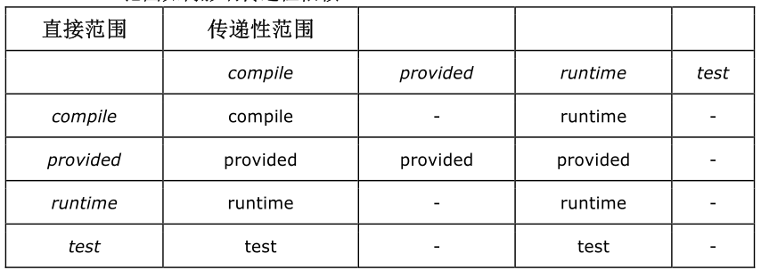

## 4. 排除与替换

有时候需要排除一个传递性依赖, 比如想要使用另外一个依赖, 来替代这个传递性依赖.

可以使用 `exclusions` 元素排除传递性依赖

```xml
<dependency>
    <groupId>com.test</groupId>
    <artifactId>project-a</artifactId>
    <version>1.0.1</version>
    <!-- 排除传递性依赖 -->
    <exclusions>
        <exclusion>
            <groupId>com.test</groupId>
            <artifactId>project-b</artifactId>
        </exclusion>
    </exclusions>
</dependency>
```

如果需要替换被排除的依赖, 只需要显式引用一个提供相同 api 的依赖即可, 但不需要提供额外的标记表明这是被排除依赖的一个替代

```xml
<!-- 引入另外一个依赖, 替换被排除的依赖 -->
<dependency>
    <groupId>com.test</groupId>
    <artifactId>project-c</artifactId>
    <version>1.0.1</version>
</dependency>
```

# 三. 生命周期

## 1. 概述

maven 的生命周期包含了一些有序的命名阶段, 有的阶段抽象了编译过程, 有的阶段抽象了打包过程. 当让 maven 构建一个项目的时候, 其实是让它一步步通过哪些预定义的有序的阶段, 并且运行所有注册到某个特定阶段的目标.

一个构建生命周期, 是一组精心组织的有序的阶段, 它的存在使得所有注册的目标有序运行.

## 2. 预设生命周期

### 2.1. clean

`clean` 是 maven 中最简单的生命周期, 包括了三个生命周期阶段

| 阶段       | 说明 | 默认行为    |
| ---------- | ---- | ----------- |
| pre-clean  |      | 无          |
| clean      |      | clean:clean |
| post-clean |      | 无          |

其中第二步的 clean 阶段, 绑定了 clean 插件的 clean 目标 (clean:clean), 也是 clean 生命周期中最关键的一步操作.

但若单独执行 `clean:clean` , 则不会完整执行 clean (生命周期) 中的三个阶段, 只会执行其中的 clean(阶段) 

### 2.2. default

大部分 maven 用户会对默认生命周期比较熟悉, 它是一个软件应用程序构建过程的总体模型, 具体阶段如下

| 生命周期阶段              | 描述                                     |
| :------------------------ | :--------------------------------------- |
| `validate`                | 验证项目是正确的，必要信息可用           |
| `initialize`              | 初始化构建状态，设置属性或创建目录       |
| `generate-sources`        | 生成包含在编译中的任何源代码             |
| `process-sources`         | 处理源代码，例如过滤任何值               |
| `generate-resources`      | 生成包含在包中的资源                     |
| `process-resources`       | 处理资源文件, 并复制到目标目录           |
| `compile`                 | 编译项目的源代码                         |
| `process-classes`         | 处理class文件, 进行字节码增强            |
| `generate-test-sources`   | 生成测试源代码                           |
| `process-test-sources`    | 处理测试源代码，例如过滤任何值           |
| `generate-test-resources` | 生成测试资源                             |
| `process-test-resources`  | 处理测试资源文件, 并复制到测试目录       |
| `test-compile`            | 编译测试源代码                           |
| `process-test-classes`    | 处理测试class文件, 进行字节码增强        |
| `test`                    | 执行单元测试                             |
| `prepare-package`         | 准备打包                                 |
| `package`                 | 打包: 将处理完的文件和资源打包成指定格式 |
| `pre-integration-test`    | 集成测试执行前所需的操作, 如设置环境     |
| `integration-test`        | 集成测试: 将包部署到可运行集成测试的环境 |
| `post-integration-test`   | 集成测试执行后所需的操作, 如清理环境     |
| `verify`                  | 校验: 检查包是否符合要求。               |
| `install`                 | 将包安装到本地仓库                       |
| `deploy`                  | 部署: 将最包发布到远程仓库               |

通过使用默认生命周期中的阶段命令, 可以执行从开始到指定阶段的一系列阶段, 比如:

> mvn compile, mvn test, mvn package, mvn install, mvn deploy

默认生命周期中, 根据打包类型的不同, 绑定的不同的插件和goal, 具体参考[官方文档: 不同打包类型的生命周期](https://maven.apache.org/ref/3.8.1/maven-core/default-bindings.html)

如果想修改默认绑定的goal 的执行情况, 可以用相同的id, 对 execution 重新配置或直接跳过

### 2.3. site

maven 不仅能从一个项目构建出软件构件, 它还能为一个或者一组项目生成项目文档和报告

项目文档和站点生成有一个专有的生命周期, 包括四个阶段

| 阶段        | 说明 | 默认行为    |
| ----------- | ---- | ----------- |
| pre-site    |      | 无          |
| site        |      | site:site   |
| post-site   |      | 无          |
| site-deploy |      | site:deploy |

打包类通常不会影响这个生命周期, 因为打包类型主要和构建的创建有关, 而和站点的生成没有太大关系

可以通过以下命令触发 site 生命周期

> mvn site

## 3. 不同打包类型的生命周期 

根据打包类型的不同, 绑定到生命周期的目标也不相同. 

`jar` 项目会使用 `jar: jar` 来打包, 而 `war` 项目会使用 `war: war` , `pom` 项目不需要编译, 使用 `site: attach-descriptor`  打包.

maven 还能使用其他的一些打包类型, 许多打包类型依赖于特定的插件来实现, 还可以使用自定义的打包类型并自定义生命周期.

在此不一一赘述.

# 四. 插件管理

## 1. 添加插件

maven 插件分成两类

- `build plugins`构造类插件, 在项目的构造阶段执行, 在 `<build>` 元素下配置
- `reporting plugins`报告类插件, 在 `site` 生命周期中执行. 在`<reporting>` 元素下配置

类似于添加依赖, 通过 GAV 来指定插件, 其中对于maven官方插件, 可以省略 GroupId

```xml
<build>
    <plugins>
        <plugin>
            <groupId>org.apache.maven.plugins</groupId>
            <artifactId>maven-clean-plugin</artifactId>
            <version>3.0.0</version>
        </plugin>
    </plugins>
</build>
```

## 2. 插件版本控制

与控制依赖版本类似, 可以通过引用属性和 `pluginManagement` 对项目中的插件版本进行统一管理.

注意 `pluginManagement` 元素需要放在 `build` 元素之下

```xml
<build>
    <pluginManagement>
        <plugins>
            <plugin>
                <artifactId>maven-clean-plugin</artifactId>
                <version>3.0.0</version>
            </plugin>
            <plugin>
                <artifactId>maven-resources-plugin</artifactId>
                <version>3.0.2</version>
            </plugin>
            <plugin>
                <artifactId>maven-compiler-plugin</artifactId>
                <version>3.7.0</version>
            </plugin>
            <plugin>
                <artifactId>maven-surefire-plugin</artifactId>
                <version>2.20.1</version>
            </plugin>
            <plugin>
                <artifactId>maven-war-plugin</artifactId>
                <version>3.2.0</version>
            </plugin>
            <plugin>
                <artifactId>maven-install-plugin</artifactId>
                <version>2.5.2</version>
            </plugin>
        </plugins>
    </pluginManagement>
</build>
```

## 3. 配置插件

### 3.1. 绑定到生命周期阶段

### 3.2. 使用`configuration`

插件的配置可以通过`<configuration>` 元素进行配置

```xml
<configuration>
  <myString>a string</myString>
  <myBoolean>true</myBoolean>
  <myInteger>10</myInteger>
  <myURL>http://maven.apache.org</myURL>
</configuration>
```

某些插件还支持使用声明的属性, 以便通过 `<properties>`元素或命令行参数进行配置, 详细设置属性参见文档

- 使用 properties 进行属性配置

  ```xml
  <properties>
    <maven.compiler.source>8</maven.compiler.source>
    <maven.compiler.target>8</maven.compiler.target>
  </properties>
  ```

- 使用命令行参数

  ```shell
  mvn clean package -Dmaven.compiler.source=8 -Dmaven.compiler.target=8
  ```

#### 1) 简单类型参数

对于简单类型的参数, 直接写在对应属性的元素下即可

```xml
<configuration>
  <myString>a string</myString>
  <myBoolean>true</myBoolean>
  <myInteger>10</myInteger>
  <myDouble>1.0</myDouble>
  <myFile>c:\temp</myFile>
  <myURL>http://maven.apache.org</myURL>
</configuration>
```

#### 2) 复杂对象

对象类型的参数, 也可以很直观的进行配置

```xml
<configuration>
  <person>
    <firstName>Jason</firstName>
    <lastName>van Zyl</lastName>
  </person>
</configuration>
```

但要遵守以下的规则

- 内部元素的标签名与目标对象的私有字段名相同, 即上述 person 对象要有一个 firstName 的私有字段

- 使用的对象, 必须与插件goal的配置对象在同一个包里

- 如果使用的对象是插件配置对象不同包, 则需要用 `implementation ` 属性指定完整的路径名

  ```xml
  <configuration>
    <person implementation="com.mycompany.mojo.query.SuperPerson">
      <firstName>Jason</firstName>
      <lastName>van Zyl</lastName>
    </person>
  </configuration>
  ```

#### 3) list

与数组类似, 直接列出目标元素即可, 注意集合标签名带`s`, list内元素名不带`s`

```xml
<configuration>
    <animals>
        <animal>cat</animal>
        <animal>dog</animal>
        <animal>aardvark</animal>
    </animals>
</configuration>
```

另外, maven 根据以下规则推断list元素的类型

- 如果 xml标签使用了 `implementation` 属性, 以此为list元素的类型
- 如果 xml 标签中包含了`.`, 将标签名作为完整类名去查找目标类型
- 尝试将 xml 标签的首字母大写, 在goal配置类所在包中寻找合适的类
- 如果list的元素没有子元素, 假设该元素为 `String`
- 如果上述规则都不满足, 则配置失败 

#### 4) map

对于 map,  以`key`为标签名, 以`value`为内容, 如下所示

```xml
<configuration>
    <myMap>
        <key1>value1</key1>
        <key2>value2</key2>
    </myMap>
</configuration>
```

#### 5) properties

如果配置目标是 properties, 则要用 `<property>` 以及下级的 `<key>`, `<value>` 元素

```xml
<configuration>
    <myProperties>
        <property>
            <name>propertyName1</name>
            <value>propertyValue1</value>
        </property>
        <property>
            <name>propertyName2</name>
            <value>propertyValue2</value>
        </property>
    </myProperties>
</configuration>
```

### 3.3. 覆盖默认行为

### 3.4. 常用插件配置


#### 3.2. 设置编译级别

maven 默认编译版本为 1.5, 如果需要使用更高版本, 应该显式配置 compile 插件, 并声明使用 1.8 的编译版本

```xml
<plugin>
    <groupId>org.apache.maven.plugins</groupId>
    <artifactId>maven-compiler-plugin</artifactId>
    <version>3.3</version>
    <configuration>
        <source>1.8</source>
        <target>1.8</target>
        <encoding>UTF-8</encoding>
    </configuration>
</plugin>
```

也可以在 maven 的 `setting.xml` 中设置, 这样使用该 maven 的所有项目都会使用 1.8 , 不需在项目 pom 中声明

```xml
<profiles>
    <profile>     
        <id>JDK-1.8</id>       
        <activation>       
            <activeByDefault>true</activeByDefault>       
            <jdk>1.8</jdk>       
        </activation>       
        <properties>       
            <maven.compiler.source>1.8</maven.compiler.source>       
            <maven.compiler.target>1.8</maven.compiler.target>       
            <maven.compiler.compilerVersion>1.8</maven.compiler.compilerVersion>       
        </properties>       
    </profile> 
</profiles>
```

#### 3.3. 资源目录与过滤

大部分生命周期, 将 `resources: resources` 目标绑定到 `process-resources` 阶段, 

这个目标会将资源目录 `src/main/resources` 的文件, 复制到输出目录 `traget/classes` , 如果设置了过滤规则, 这个目标还会将资源文件中的某些内容做出处理, 替换掉其中的一些变量值

比如`resources` 下有一个 `jdbc.xml`, 记录了数据库URL 和登录信息, 内容如下:

```xml
<bean id = "dataSource" class="com.zaxxer.hikari.HikariDataSource" destroy-method="close">  
    <property name="jdbcUrl" value="${jdbc.mysql.url}" />  
    <property name="username" value="${jdbc.mysql.username}" />  
    <property name="password" value="${jdbc.mysql.password}" />  
</bean> 
```

其中的数据库具体信息, 都用一个 `${...}` 表达式表示.

而则在另外一个`properties` 文件中, 定义了这些变量具体的值

```properties
jdbc.mysql.url=jdbc:mysql://192.168.3.224:3306/demo
jdbc.mysql.username=root
jdbc.mysql.password=123456
```

maven 的资源过滤, 可以在构建过程中, 自动读取`properties` 文件中的值, 并填入到 `jdbc.xml` 文件中的对应位置.

maven 默认不会进行资源过滤, 需要在项目`pom.xml` 中进行如下配置才能实现资源过滤 :

1. 定义过滤器
2. 定义资源目录, 并显示声明需要过滤, 可以定义多个资源目录, 并单独声明是否需要过滤

```xml
<build>
    <!-- 定义过滤器, 即需要的属性值的来源 -->
    <filters>
        <filter>../conf.properties</filter>
    </filters>

    <!-- 定义资源目录 -->
    <resources>
        <resource>
            <directory>src/main/resources</directory>
            <!-- 包含目录下, 以及下级目录的所有文件 -->
            <includes>
                <include>**/*</include>
            </includes>
            <!-- 该资源目录是否使用资源过滤 -->
            <filtering>true</filtering>
            <!-- 可以为每个资源目录单独设置输出目录 -->
            <targetPath>target/conf</targetPath>
        </resource>
        
        <!-- 可以为每个资源目录单独设置输出目录 -->
        <resource>
            <directory>src/main/img</directory>
            <targetPath>target/img</targetPath>
        </resource>
        <resource>
            <directory>src/main/xml</directory>
            <targetPath>target/xml</targetPath>
        </resource>
    </resources>
</build>	
```

#### 3.4. 跳过单元测试

默认情况下, 构建时会执行单元测试, 如果希望不经测试直接构建, 可以设置跳过单元测试

```xml
<plugin>
    <artifactId>maven-surefire-plugin</artifactId>
    <configuration>
        <skip>true</skip>
    </configuration>
</plugin>
```

#### 3.5. 忽略失败的测试

默认情况下, 测试失败后会中止构建过程, 如果希望测试失败后不影响构建, 可以将失败的测试忽略

```xml
<plugin>
    <artifactId>maven-surefire-plugin</artifactId>
    <configuration>
        <testFailureIgnore>true</testFailureIgnore>
    </configuration>
</plugin>
```

自定义插件前缀

我们知道可以使用 `mvn 插件名:goal名` 来执行某个插件的 goal, maven会根据插件的 `artifactId` 推断这个插件名

- 官方插件, `maven-{prifix}-plugin`, 取中间一段, maven 不允许第三方插件使用这个格式
- 第三方插件, `{prefix}-maven-plugin`, 取前面一段

如果按上述规则有冲突的插件, 或者希望自定义插件前缀, 可以在插件的配置中指定

```xml
<plugin>
    <artifactId>maven-plugin-plugin</artifactId>
    <version>2.3</version>
    <configuration>
        ...
        <goalPrefix>自定义的插件前缀</goalPrefix>
    </configuration>
</plugin>
```

## 4. 配置构造类插件

### `<executions>` 元素

在一个 `<executions>` 元素下, 可以有多个 `<execution>` 元素, 其中每个元素都对当前插件的一个 goal 进行配置, 包括条件, 选项参数, 绑定的阶段等. 

`execution` 的执行时机有以下几种情况

- 通过`<phase>` 显示指定了绑定的阶段, 将在该生命周期阶段执行
- 未使用`<phase>` 指定绑定阶段, 但插件的 goal 有默认阶段, 将在默认的阶段执行
- 未绑定执行阶段, 也无默认执行阶段, 则只能通过 `mvn 插件名:goal名` 来执行

虽然在同一个pom同一个插件下的 execution 要求id唯一, 但对于继承树中, 允许exection id 相同

当id 相同时, 定义在不同 pom 或 profile 中的 execution 将被合并;

- 可以通过相同的id, 对默认生命周期绑定的goal 进行配置

- 如果需要直接指定某个 execution, 使用以下格式

  > mvn 插件名:goal名@id

### `<dependencies>` 元素

maven 插件也有它的依赖, 如果希望替换插件依赖的版本, 可以在插件的 `dependencies` 元素中指定

```xml
<plugin>
    <groupId>org.apache.maven.plugins</groupId>
    <artifactId>maven-antrun-plugin</artifactId>
    <version>1.2</version>
    ...
    <dependencies>
        <dependency>
            <groupId>org.apache.ant</groupId>
            <artifactId>ant</artifactId>
            <version>1.7.1</version>
        </dependency>
        <dependency>
            <groupId>org.apache.ant</groupId>
            <artifactId>ant-launcher</artifactId>
            <version>1.7.1</version>
        </dependency>
    </dependencies>
</plugin>
```

### `<inherited>` 标签

默认情况下, 父pom 中的插件配置会被子项目继承, 如果不希望子项目继承父pom中定义的插件, 可以用 `inherited` 标签关闭

```xml
<plugin>
    <groupId>org.apache.maven.plugins</groupId>
    <artifactId>maven-antrun-plugin</artifactId>
    <version>1.2</version>
    <inherited>false</inherited>
    ...
</plugin>
```

## 5. 配置报告类插件

### `<reporting>` 与 `<build>`

使用 `site` 生命周期时, 只会使用 `reporting` 元素中声明的插件配置, 忽略 `build` 元素内的配置

使用 `mvn 插件名:goal名` 时, maven 会现在 `reporting` 元素内查询相关配置, 如果找不到才会在 `build` 中寻找

### `<reportSets>`

使用 `reportSets` 来指定要生成的报告

```xml
<plugin>
    <groupId>org.apache.maven.plugins</groupId>
    <artifactId>maven-project-info-reports-plugin</artifactId>
    <version>2.1.2</version>
    <reportSets>
        <reportSet>
            <reports>
                <report>project-team</report>
            </reports>
        </reportSet>
    </reportSets>
</plugin>
```

如果要生成所有报告, 使用 `<report/>` 自关闭标签

```xml
<reportSets>
    <reportSet>
        <reports/>
    </reportSet>
</reportSets>
```

### `<inherited>`

与 `build` 中定义的插件类似, 父 pom 中定义的报告类插件会被继承, 可以通过`inherited`来关闭继承

## 常用插件


### maven-dependency-plugin


# 五.  多模块项目

## 1. 项目间关系

项目之间有三种关系

- **依赖**

  A项目的正常构建需要B项目, 称为依赖: 

  使用 `depenency` 元素声明依赖 

- **聚合**

  将多个项目聚集起来作为一个大项目, 项目之间可以没有直接关系

  从上往下声明, 上级项目使用 `modules` 元素声明所包含的小项目

- **继承**

  定义一个父 pom, 子项目可以从这个 pom 中继承相应的配置内容, 可以简化子项目 pom 的配置

  从下往上声明, 子项目使用 `parent` 元素声明父项目, 从什么地方继承配置

聚合与继承是两个不同的概念, 没有必然的联系, 但在实际的多模块项目中, 往往同时存在聚合与继承.

## 2. 聚合

聚合工程, 通常会包含多个待构建的项目, 打包类型往往是 pom, 而不是 `jar`, `war` 之类具体的构件.

聚合工程的存在只是为了将很多项目归类在一起, 成为一个构建. 

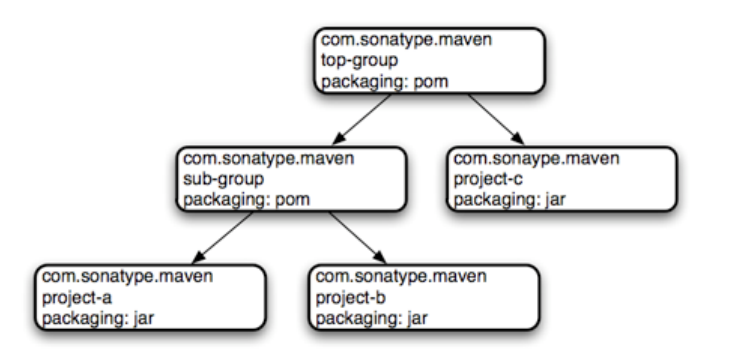

- 如图所示, `top-group` 是一个聚合工程, 打包类型为 `pom`, 包含了 `sub-group` 和 `project-c` 两个工程, 而 `sub-group` 又是一个聚合工程, 包含了 `project-a` 和 `project-b` 两个工程.
- 当构建 `top-group` 的时候, maven 会检查其中的 `modules` 元素, 如果有包含其他模块, 则会获取相应的 pom.xml, 以完成完整的构建工作.

聚合工程最大的意义在于简化多工程的构建工作, 当需要将相关的多个工程(不一定直接依赖), 一起构建时, 一种做法是按照一定的顺序完成每一个工程的构建, 如果构建的顺序不正确, 则会构建失败.

而聚合工程正是为了解决这种问题而存在, 使用聚合工程, 将多个项目作为这个聚合工程的模块, 然后执行整个聚合工程的构建. maven 会自动分析模块之间的关系, 确保按照正常的顺序完成构建.

当 maven 执行一个包含子模块的项目时, maven 首先会载入父 pom, 然后定位所有子模块 pom, 将所有的 pom 放入一个称为 `maven 反应炉` 的东西中, 分析模块之间的依赖关系, 根据依赖关系, 决定各个模块的编译顺序. 如果发现一个子模块需要依赖于其他子模块, 则会将该模块的构建顺序延后, 直到需要的模块都构建完成. 

通常建议将需要先构建的子模块写在前面, 需要依赖其他子模块的写在后面.

要使用聚合工程, 需要将打包类型设为 `pom`, 并使用 `modules` 指定要聚合的模块

```xml
<project>   
    <groupId>com.sonatype.maven</groupId>
    <artifactId>top-group</artifactId>
    <!-- 聚合工程通常都是 pom -->
    <packaging>pom</packaging>
    <version>1.0</version>
    
    <!-- 将需要聚合的工程放在 modules 元素之下 -->
    <modules>
        <module>sub-group</module>
        <module>project-c</module>
    </modules>
    ...
</project>  
```

## 3. 继承

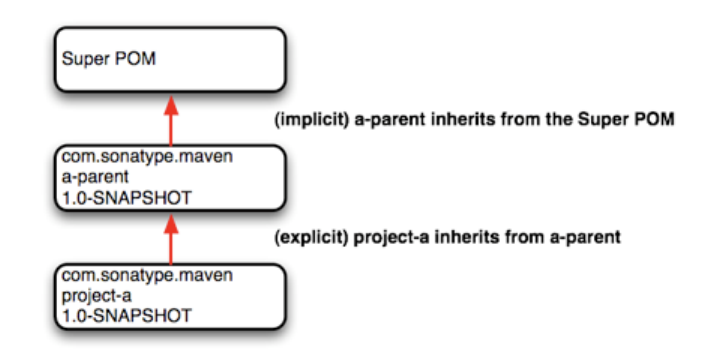

有些情况下, 会想要一个项目从父 pom 中继承一些值, 比如在构建一个大型系统时, 不希望在每个小工程下重复地引入相同的依赖元素. 通过定义`<parent>` 元素使用继承, 就可以避免这种重复.

使用 `parent` 标签声明父级项目的坐标, 子模块的 pom 将会从父级 pom 继承一些内容, 如项目坐标, 依赖及插件的声明和引入等. 

在父 pom 已经声明的信息, 在子 pom 中可以省略, 也可以声明新值以覆盖父 pom 中的值.

如果一个项目没有指定父 pom, 则会从超级 pom 中继承配置.

maven 假设父 pom 在本地仓库可用, 或者在当前项目的上级目录中 (../pom.xml), 如果两个位置都不可用, 则需要使用 `relativePath` 元素告诉 maven 要从哪里获取

```xml
<parent>
    <artifactId>mutilmvn</artifactId>
    <groupId>com.loyofo</groupId>
    <version>1.0-SNAPSHOT</version>
    <relativePath>../top-group/pom.xml</relativePath>
</parent>
<!-- 继承了父pom, 可以继承 Gid 和 Version -->
<artifactId>mvn-service</artifactId>
```

# 六. profile

## 1. 可移植构建

### 1.1. 构建的可移植性

构建的可移植性是指, 将一个项目在不同环境中构建的难易程度, 可以分成以下几种情况:

1. **不可移植** : 只在一个特定环境中可完成构建工作, 不常见, 也不建议
2. **环境可移植** : 针对不同的环境做出特定的行为和配置, 可以在已定义的几个特定环境中完成构建工作
3. **组织可移植** : 需要用到组织内部的依赖, 如组织内的maven仓库, 离开了这个环境将无法完成构建工作
4. **广泛可移植** : 可以从公开途径获取完整依赖, 不需任何额外操作就可完成构建, 对开源项目而言非常重要

通常人们更喜欢广泛可移植的项目, 但是很多商业项目有自己私有的依赖和仓库, 因此只能达到组织可移植.

### 1.2. profile 的作用

使用 profile, 可以针对不同的环境自定义不同的构建, 使得构建操作可以在不同环境间移植.

比如一个产品, 可能需要运行在开发环境/测试环境/预生产环境/生产环境等, 针对不同的环境, 需要修改相应的配置, 比如要连接不同环境的数据库, 使用不用的用户名和密码等.

在构建产品的时候, 指定需要使用的 profile, 则可以很方便地构建出针对不同环境的可运行的产品.

除了手动指定 profile, maven 还可以根据l特定的条件自动激活或关闭某些 profile.

## 2. 使用 profile

### 2.1. 什么是 profile 

maven 的 profile 是一组可选的配置, 可以用来设置或者覆盖配置的默认值, 有了 profile , 就可以为不同的环境定制构建.

- **使用规则**
  - `profile` 元素可以有多个, 需要定义在 `profiles` 元素中, 且必须包含 `id`, 通过 `-P<id>` 指定激活
  - profile 相当于一个可选的 `pom.xml` , 几乎支持 `pom.xml` 中的所有元素, 且要遵循在 `pom.xml` 中的嵌套层次
  - `activation` 元素规定了该 profile 的激活规则

如下例子, 在 profile 中设置了 compiler 插件的一些设置, 通过 `mvn install -Pjdk8` 将激活这个 profile 后, 会覆盖 compiler 的默认设置.

```xml
<project>
    ...
    <!-- profile 需要放在 profiles 元素中, 可以有多个 -->
    <profiles>
        <profile>
            <!-- 必须有id -->
            <id>jdk8</id>
            <!-- 支持 pom.xml 中绝大部分元素, 并要遵循嵌套层次 -->
            <build>
                <plugins>
                    <plugin>
                        <groupId>org.apache.maven.plugins</groupId>
                        <artifactId>maven-compiler-plugin</artifactId>
                        <version>3.3</version>
                        <configuration>
                            <source>1.8</source>
                            <target>1.8</target>
                            <encoding>UTF-8</encoding>
                        </configuration>
                    </plugin>
                </plugins>
            </build>
            <!-- 支持 pom.xml 中绝大部分元素, 并要遵循嵌套层次 -->
        </profile>
        
        <profile>
			<id>dev</id>
			<properties>
				<deploy.env>dev</deploy.env>
			</properties>
            <!-- 默认激活该 profile -->
			<activation>
				<activeByDefault>true</activeByDefault>
			</activation>
		</profile>
    </profiles>
</project>
```

### 2.2. 激活 profile

1. 通过命令指定激活

   最简单的激活方式, 在命令中指定要激活的 profile, 可以同时激活多个profile，多个id之间使用逗号分隔 

   > mvn 命令 -P 配置id, 配置id2

   如果需要禁用默认激活的profile, 可以在 id 前加上感叹号 `!`

   > mvn 命令 -P !配置id, !配置id2

2. 根据系统环境激活

   通过配置 `activation` 元素, 可以设置一些与系统环境相关的条件, 当满足所有条件的时候, 就会激活该 profile

   ```xml
   <profile>
       <id>jdk8</id>
   	...
       <activation>
           <activeByDefault>false</activeByDefault>
           <!-- 表示当 jdk 版本为 1.8 时被激活, 形如 1.8.0_xxx -->
           <jdk>jdk1.8</jdk>
       </activation>
   </profile>
   ```

3. 根据属性激活

   可以设置 `属性存在` 的时候激活

   ```xml
   <profile>
       <id>jdk8</id>
   	...
       <activation>
           <property>
               <name>test</name>
           </property>
       </activation>
   </profile>
   ```

   可以设置 `属性不存在` 的时候激活, 注意在属性名前添加感叹号 `!`

   ```xml
   <profile>
       <id>test</id>
       ...
       <activation>
           <property>
               <name>!test</name>
           </property>
       </activation>
   </profile>
   ```

   可以在 `属性存在且等于特定值` 时激活

   ```xml
   <profile>
       <id>test</id>
       <activation>
           <property>
               <name>test</name>
               <value>ok</value>
           </property>
       </activation>
   </profile>
   ```

4. 查看激活的 profile

   > mvn help:active-profiles

   help 插件的 `active-profiles` 目标能够查看当前构建激活了哪些 profile, 以及各个 profile 是在哪里被定义的

## 3. 其他 profile

### 3.1. 外部 profile

maven 支持外部 profile. 使用一个单独的文件 `profiles.xml` , 但为了保证可移植性, maven 限制了外部 profile 可配置的内容, 

只有不直接关系到项目构建的内容才能通过外部 profile 配置, 其他与项目构建关系密切的内容, 都必须在`pom.xml` 中设置.

外部的 `profiles.xml` , 以及用户 `settings.xml` , 只支持`<repositories>` `<pluginRepositories>`  `<properties>` 

该文件的顶级元素就是 `profiles`, 将该文件与 `pom.xml` 放在同一目录下即可, 格式如下

```xml
<profilesXml>
    <profiles>
        <profile>
            <id/>
            <activation>...</activation>
            <properties>...</properties>
            <repositories>...</repositories>
            <pluginRepositories>...</pluginRepositories>
        </profile>
    </profiles>
    <activeProfiles></activeProfiles>
</profilesXml>
```

### 3.2. settings profile

有时候我们需要做出一些更广泛适用的配置, 比如为组织内所有成员项目添加内部仓库, 或修改默认 jdk 版本等, 如果每个项目都要设置一遍, 会显得太过繁琐, 重复工作太多. 这种时候我们可以选择使用 `settings.xml` 来实现我们的需求.

`settings.xml` 有两个位置, `~/.m2/settings.xml`, 以及 `${m2_home}/conf/settings.xml` , 前者为用户设置, 后者为 maven 的全局设置, 如果两者设置冲突, 用户设置将会覆盖全局设置.

`settings.xml` 作为外部设置, 也被限制了可用的配置项, 只支持`<repositories>` `<pluginRepositories>`  `<properties>` 

### 3.3. 激活外部的 profile

外部定义的 pofile, 除了可以采用与内部 profile 相同的激活方式, 还可以在外部文件中通过 `<activeProfiles>` 元素激活

```xml
<profilesXml>
    <profiles>
        <profile>
            ...
        </profile>
    </profiles>
    <activeProfiles>
        <activeProfile>profile1</activeProfile>
        <activeProfile>profile2</activeProfile>
    </activeProfiles>
</profilesXml>
```

## 4. 典型案例

### 4.1. 设置 maven 私服

maven 私服设置往往是全局通用的, 一般在 `settings.xml` 中设置

```xml
<settings>
    <servers>
        <!--配置权限,使用默认用户-->
        <server>
            <id>maven-public</id>
            <username>admin</username>
            <password>admin123</password>
        </server>
        <server>
            <id>maven-snapshots</id>
            <username>admin</username>
            <password>admin123</password>
        </server>
    </servers>
    
    <profiles>
        <profile>
            <id>MyNexus</id>
            <activation>
                <activeByDefault>false</activeByDefault>
                <jdk>1.8</jdk>
            </activation>
            <repositories>
                <!-- 私有库地址-->
                <repository>
                    <id>maven-public</id>
                    <url>http://192.168.3.227:8081/nexus/content/groups/public/</url>
                    <releases>
                        <enabled>true</enabled>
                    </releases>
                    <snapshots>
                        <enabled>true</enabled>
                    </snapshots>
                </repository>
            </repositories>
            <!--插件库-->
            <pluginRepositories>
                <pluginRepository>
                    <id>maven-public</id>
                    <url>http://192.168.3.227:8081/nexus/content/groups/public/</url>
                    <releases>
                        <enabled>true</enabled>
                    </releases>
                    <snapshots>
                        <enabled>true</enabled>
                    </snapshots>
                </pluginRepository>
            </pluginRepositories>
        </profile>
    </profiles>

    <!--激活profile-->
    <activeProfiles>
        <activeProfile>MyNexus</activeProfile>
    </activeProfiles> 
</settings>
```

### 4.2. 结合资源过滤切换环境

```xml
<build>
    <!-- 定义过滤器, 在 conf 目录下创建多个 conf-${deploy.env}.properties, 
	其中的 ${deploy.env} 由 profile 控制, 通过切换 profile 达到切换 properties 文件的效果  -->
    <filters>
        <filter>conf/conf-${deploy.env}.properties</filter>
    </filters>

    <!-- 添加资源目录并设置过滤 -->
    <resources>
        <resource>
            <directory>src/main/resources</directory>
            <includes>
                <include>**/*</include>
            </includes>
            <filtering>true</filtering>
        </resource>
    </resources>
</build>

<!-- 不同的 profile 定义了不同的 ${deploy.env} 属性, 与 filters 中定义的共同组成 properties 文件名  -->
<profiles>
    <profile>
        <id>dev</id>
        <properties>
            <deploy.env>dev</deploy.env>
        </properties>
        <activation>
            <activeByDefault>true</activeByDefault>
        </activation>
    </profile>
    <profile>
        <id>product</id>
        <properties>
            <deploy.env>product</deploy.env>
        </properties>
    </profile>
</profiles>
```

# 七. 详细配置说明

`settings.xml` 文件指定了 maven 各种行为的具体配置, 该文件的配置全局有效, 应该不应分享给其他开发者, 或与某个特定项目进行关联.

文件内配置了本地仓库的路径, 可选的远程仓库服务器及认证信息

可能有在以下两个路径存放

- ${maven.home}/conf/settings.xml 全局配置文件
- ${user.home}/.m2/settings.xml 用户配置文件

如果两个文件都存在, 则合并其内容, 如果有冲突的配置, 以用户配置为准(覆盖全局配置). 为了便于创建用户配置文件, 可以将全局配置文件复制到用户配置路径下再进行修改.

配置文件内可以使用系统参数或环境变量占位符, 形如`${xxx.yyy}`, 但不能使用在 profile 中定义的属性. 

```xml
<settings xmlns="http://maven.apache.org/SETTINGS/1.0.0"
          xmlns:xsi="http://www.w3.org/2001/XMLSchema-instance"
          xsi:schemaLocation="http://maven.apache.org/SETTINGS/1.0.0
                              https://maven.apache.org/xsd/settings-1.0.0.xsd">
    <localRepository/>
    <interactiveMode/>
    <offline/>
    <pluginGroups/>
    <servers/>
    <mirrors/>
    <proxies/>
    <profiles/>
    <activeProfiles/>
</settings>
```

## 1. 具体配置内容

### 1.1. 简单元素

- **localRepository** 本地仓库路径, 默认为  `${user.home}/.m2/repository`

- **interactiveMode** 交互模式, maven 将与用户输入进行交互, 默认 `true`

- **offline** 离线模式, 不从远程仓库下载资源, 默认 `false`

- **pluginGroups** 插件组id, 如果项目中使用插件且未指定groupId, 则maven 尝试匹配这里指定的 groupId 以便找到需要的插件. 默认为空, 且自动包含`org.apache.maven.plugins` 和 `org.codehaus.mojo`.

  ```xml
  <settings>
    ...
    <pluginGroups>
      <pluginGroup>org.eclipse.jetty</pluginGroup>
    </pluginGroups>
    ...
  </settings>
  ```

### 1.2. Servers 服务器认证信息

**servers** 服务器配置信息. 如组件/插件服务器的认证信息

虽然服务器位置信息可以通过项目的 pom 文件中` repositories` 或 `distributionManagement` 元素配置的, 但诸如用户名和密码等敏感信息, 不应该随着项目的 pom 文件一同发布, 而应该写在构建组件时所在机器的 `settings.xml` 中.

```xml
<settings>
  ...
  <servers>
    <server>
      <id>server001</id>
      <username>my_login</username>
      <password>my_password</password>
      <privateKey>${user.home}/.ssh/id_dsa</privateKey>
      <passphrase>some_passphrase</passphrase>
      <filePermissions>664</filePermissions>
      <directoryPermissions>775</directoryPermissions>
      <configuration></configuration>
    </server>
  </servers>
  ...
</settings>
```

- id 对应在  repository/mirror 元素中定义的远程仓库服务器id
- username, password 若远程仓库有认证要求, 需要提供用户名和密码
- privateKey, passphrase 远程仓库的认证私钥和密码
- filePermissions, directoryPermissions 通过deployment操作发布的文件或目录, 将拥有这里指定的权限, 采用 unix 类系统的三位数字权限表示, 如 755, 664
- configuration ?

### 1.3. Mirrors 镜像服务器

远程仓库的镜像服务器, 将在 repository 中定义的仓库请求, 都映射到镜像服务器请求

```xml
<settings>
  ...
  <mirrors>
    <mirror>
      <id>planetmirror.com</id>
      <name>PlanetMirror Australia</name>
      <url>http://downloads.planetmirror.com/pub/maven2</url>
      <mirrorOf>central</mirrorOf>
    </mirror>
  </mirrors>
  ...
</settings>
```

- id 当前镜像服务器的id标识, 并在连接服务器时从servers元素中获取相应的认证凭据
- name, 对镜像服务器的描述
- url 镜像服务器的地址.获取组件时, maven将优先从镜像地址获取, 而不从原来的仓库地址获取
- mirrorOf 指示当前镜像服务器需要映射哪个仓库.

### 1.4. Proxies 代理

```xml
<settings>
  ...
  <proxies>
    <proxy>
      <id>myproxy</id>
      <active>true</active>
      <protocol>http</protocol>
      <host>proxy.somewhere.com</host>
      <port>8080</port>
      <username>proxyuser</username>
      <password>somepassword</password>
      <nonProxyHosts>*.google.com|ibiblio.org</nonProxyHosts>
    </proxy>
  </proxies>
  ...
</settings>
```

- id 代理服务器id
- active 是否激活当前代理服务器. 可以同时定义多个代理服务器, 但只能激活一个
- protocol, host, port 代理服务器的访问协议,地址以及端口号
- username, password 连接代理服务器的认证信息
- nonProxyHosts 例外名单, 记录不需使用代理的地址, 使用 `|` 或 `,` 分割

### 1.5. Profiles 配置

Profiles 节点中包含了许多能在 pom 中使用的内容, 激活后的 profile 配置会应用到项目中.

可用来配置一些跨项目的配置, 使用时只需要在项目中声明要激活的 profile 即可.

`settings.xml` 中激活的 profile, 优先级高于独立的 `profile.xml` 或是 `pom.xml` 中的相同配置. 

主要包括以下四类关于构建的内容, 而不是具体的项目内容

#### 1) Activation 激活条件

指定了该profile 在什么情况下被激活. 只有给定的所有条件均满足时, 该 profile 才会生效.

```xml
<settings>
    ...
    <profiles>
        <profile>
            <id>test</id>
            <!-- 激活条件 -->
            <activation>
                <activeByDefault>false</activeByDefault>
                <!-- 指定jdk版本前缀 -->
                <jdk>1.5</jdk>
                <!-- 指定操作系统 -->
                <os>
                    <name>Windows XP</name>
                    <family>Windows</family>
                    <arch>x86</arch>
                    <version>5.1.2600</version>
                </os>
                <!-- 指定属性值 -->
                <property>
                    <name>mavenVersion</name>
                    <value>2.0.3</value>
                </property>
                <!-- 指定文件存在 -->
                <file>
                    <exists>${basedir}/file2.properties</exists>
                    <missing>${basedir}/file1.properties</missing>
                </file>
            </activation>
            ...
        </profile>
    </profiles>
    ...
</settings>
```

不要求同时限定所有可选条件, 只需要根据实际情况指定需要的条件即可.

- activeByDefaule 是否激活. 未给出该条件时相当于 false
- jdk maven自动检测当前jdk版本是否符合给定的前缀
- os maven自动检测当前操作系统是否满足要求
- property 在项目的pom中是否有给定的属性
- file 指定文件是否存在

profile 还可以通过 `settings.xml` 的 `activeProfiles` 元素激活, 也可以在maven 命令中 `-P xxx` 参数激活

#### 2) properties 属性

maven 的 properties 是一种占位符变量, 可以在 pom.xml 中的以 `${xxx}` 的格式引用该变量, 构建项目的时候, 会将占位符变量替换成真实值. 属性有以下5种类型

- **env.X**, 当前系统环境变量
- **project.X.Y** `.` 用来分隔层级, `project.X.Y` 指示项目的 pom.xml 中相应位置的值 
- **settings.X.Y** `.` 用来分隔层级, `setting.X.Y` 指示 settings.xml 中相应位置的值 
- java 系统属性, 会通过 `java.lang.System.getProperties()` 方法获取相应的值
- 其他属性, 用户可以在`<prooerties>` 元素下自由定义需要的属性

#### 3) repositories 远程仓库

远程仓库列表, maven 将从这些远程仓库中下载组件到本地仓库, 再从本地仓库中获取依赖/插件来构建项目.

```xml
<settings>
  ...
  <profiles>
    <profile>
      ...
      <repositories>
        <repository>
          <id>codehausSnapshots</id>
          <name>Codehaus Snapshots</name>
          <!-- 正式版本策略 -->
          <releases>
            <enabled>false</enabled>
            <updatePolicy>always</updatePolicy>
            <checksumPolicy>warn</checksumPolicy>
          </releases>
          <!-- 快照版本策略 -->
          <snapshots>
            <enabled>true</enabled>
            <updatePolicy>never</updatePolicy>
            <checksumPolicy>fail</checksumPolicy>
          </snapshots>
          <!-- 仓库地址 -->
          <url>http://snapshots.maven.codehaus.org/maven2</url>
          <layout>default</layout>
        </repository>
      </repositories>
      <pluginRepositories>
        ...
      </pluginRepositories>
      ...
    </profile>
  </profiles>
  ...
</settings>
```

- **releases, snapshots** 针对正式版本和快照版本的制定不同策略, 比如是否下载快照版本
- **enabled** 是否允许使用该类型的组件(正式版/快照版)
- **updatePolicy** 检查更新策略, maven 将本地仓库和远程仓库中的组件时间戳进行对比, 默认daily 每天
- **checksumPolicy** 校验策略. 当将组件发布到远程仓库时, 也会同步发布校验文件
- **layout**  仓库布局, maven 2.x 以上是 default, 1.x 是 legacy

#### 4) pluginRepositories 插件仓库

maven 的仓库中包含两类组件, 一类被作为其他组件的依赖, 另一类则是与构建工作有关的插件. 有时候可能需要从独立的仓库中下载插件, 此时可指定独立的插件仓库.

插件仓库的配置项与普通仓库一致, 不再赘述

### 1.6. Active Profiles 要激活的配置

指定需要激活的 profile, 忽略 profile 本身的激活条件

```xml
<settings>
  ...
  <activeProfiles>
    <activeProfile>env-test</activeProfile>
  </activeProfiles>
</settings>
```

# 仓库顺序

 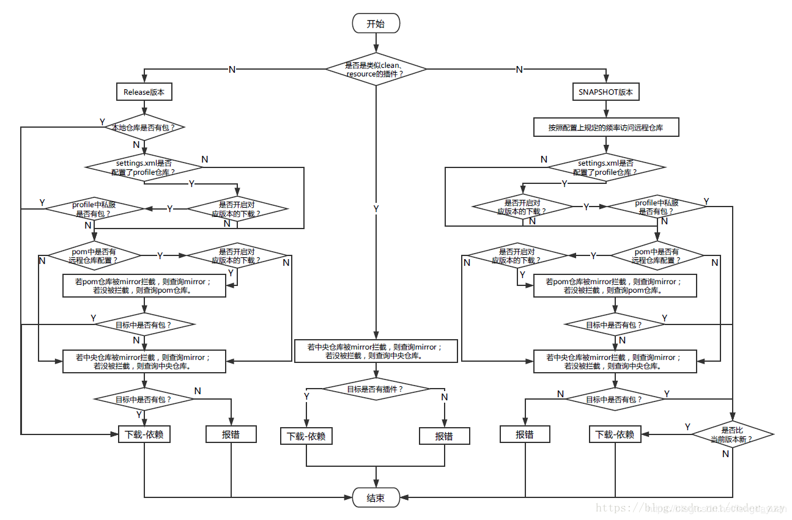 

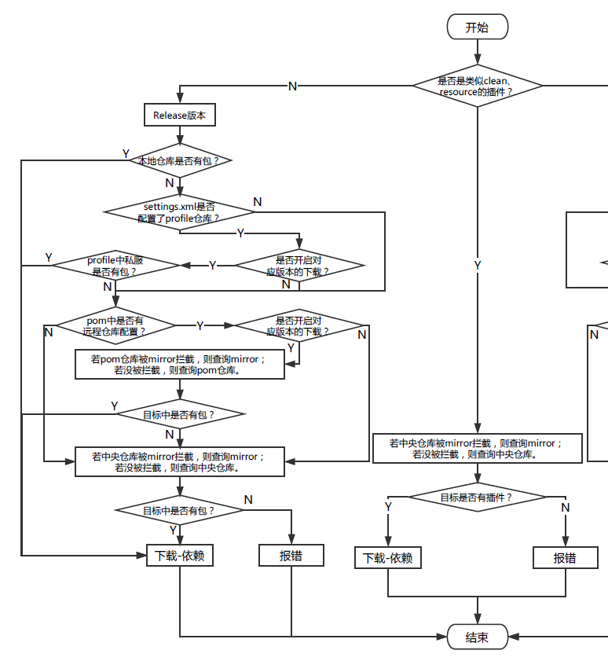

本地仓库 > profile激活的仓库(其中settings>pom) >  pom 中声明的仓库 > 中央仓库

其中若声明的仓库有镜像, 则被镜像拦截

https://www.jb51.net/article/148094.htm

https://blog.csdn.net/fengdayuan/article/details/93089136


本地

mirror_setting_profile_repo > **setting_profile_repo** > global_setting_profile_repo 

mirror_pom_profile_repo > **pom_profile_repo** >

mirror_pom_repo > **pom_repo**

mirror_central > global_set_alimaven > **central**


## 猜想

> 本地仓库 > GSET_prof_repo > USET_prof_repo > pom_prof_repo > pom_repo > central

**本地仓库**

**GSET_prof_repo**: UMir_GSET_prof_repo,  GMir_GSET_prof_repo, GSET_prof_repo

**USET_prof_repo**: UMir_USET_prof_repo, GMir_USET_prof_repo, USET_prof_repo

**pom_prof_repo**: UMir_pom_prof_repo, GMir_pom_prof_repo, pom_prof_repo

**pom_repo**: UMir_pom_repo, GMir_pom_repo, pom_repo

**central**: UMir_central, GMir_central, central


### 可用仓库测试

| 仓库名          | 地址                                                 | 结果       |
| --------------- | ---------------------------------------------------- | ---------- |
| http_ali_nexus  | http://maven.aliyun.com/nexus/content/groups/public  | ok         |
| http_aliyun     | http://maven.aliyun.com/repository/public            | ok         |
| http_spring     | http://repo.spring.io/libs-release                   | **denied** |
| https_ali_nexus | https://maven.aliyun.com/nexus/content/groups/public | ok         |
| https_aliyun    | https://maven.aliyun.com/repository/public           | ok         |
| https_spring    | https://repo.spring.io/libs-release                  | 可用但好慢 |


### 理想顺序

本地 > 阿里云 > spring > central

https://maven.apache.org/plugins/maven-compiler-plugin/compile-mojo.html

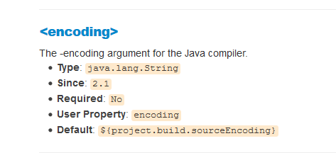

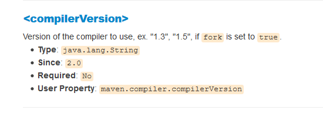

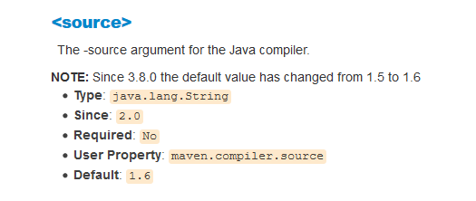

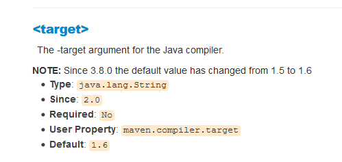


证书已全部添加

无额外参数时能否下载成功? **失败, 依旧找不到证书**

指定证书路径? **失败, 依旧提示找不到证书**

```shell
-Djavax.net.ssl.trustStore=D:\Java\jdk1.8.0_181\jre\lib\security\cacerts
-Djavax.net.ssl.trustAnchors=D:\Java\jdk1.8.0_181\jre\lib\security\cacerts
```

在 runner 忽略证书校验, **有效, 能够正常下载jar包, 但无法下载源码**

```shell
-Dmaven.wagon.http.ssl.insecure=true
-Dmaven.wagon.http.ssl.allowall=true
```

在 importer 忽略证书校验, **有效, 能够正常下载源码**


忽略 ignore.validity.dates , 无效果, 不知道起什么作用

```shell
-Dmaven.wagon.http.ssl.ignore.validity.dates=true
```


## 结论

添加参数

```shell
-Dmaven.wagon.http.ssl.insecure=true
-Dmaven.wagon.http.ssl.allowall=true
```

现有无法下载源码是因为 .lastupdated 文件记录了最近一次的失败, 不重复尝试

实际上是可以下载的, **删除目录下的 .last updated 文件再重新下载**


`_remote.repositories`文件说明

```shell
#NOTE: This is a Maven Resolver internal implementation file, its format can be changed without prior notice.
#Thu Feb 27 22:24:50 CST 2020
aopalliance-1.0-sources.jar>aliyun=
aopalliance-1.0.pom>aliyun=
aopalliance-1.0.pom>aliyun_mirror=
aopalliance-1.0.jar>aliyun_mirror=
aopalliance-1.0.jar>aliyun=
```

##### 新增文件

maven从远程仓库(仓库A)获取jar后, 会在这个文件中记录jar的来源仓库, 增加一条记录, 

形如 `xx文件>来源仓库A=`

##### 替换远程库后校验

每次构建项目时, maven会检查当前使用的仓库是什么, 比如当前使用 仓库B

如果本地的jar不是从仓库B获取的, 则会尝试从仓库B获取jar包. 

若仓库B的jar 与本地仓库的一致, 则在该文件中增加一条, `xx文件>来源仓库B=`

​	表示仓库A和仓库B中的这个文件是一样的.

若仓库B的jar 与本地仓库的不一致, 则替换该jar 文件, 并清除`xx文件>来源仓库A=`的记录, 仅记录 `xx文件>来源仓库B=`

如果是本地添加的jar, 则简单记录 `xx文件>=`

### 综上, 对于常见的问题, 可以采用以下方式解决

#### 本地有jar, 但新的远程仓库没有, maven报错

修改 `_remote.repositories`文件, 

手动增加`xx文件>新仓库=`, 假装新仓库中也有该文件

或手动增加 `xx文件>=`, 假装是从本地安装的

#### 手动添加jar包到本地仓库

1. 将 jar 包按正确的 GAV 路径复制到本地仓库中

2. 添加空的 pom 文件, 指定 gav, 不需要添加任何依赖

   ```xml
   <?xml version="1.0" encoding="UTF-8"?>
   <project xsi:schemaLocation="http://maven.apache.org/POM/4.0.0 http://maven.apache.org/xsd/maven-4.0.0.xsd" xmlns="http://maven.apache.org/POM/4.0.0"
       xmlns:xsi="http://www.w3.org/2001/XMLSchema-instance">
     <modelVersion>4.0.0</modelVersion>
     <groupId>snakeyaml</groupId>
     <artifactId>gateway-client</artifactId>
     <version>4.1.3</version>
     <description>POM was created by Sonatype Nexus</description>
   </project>
   ```

   