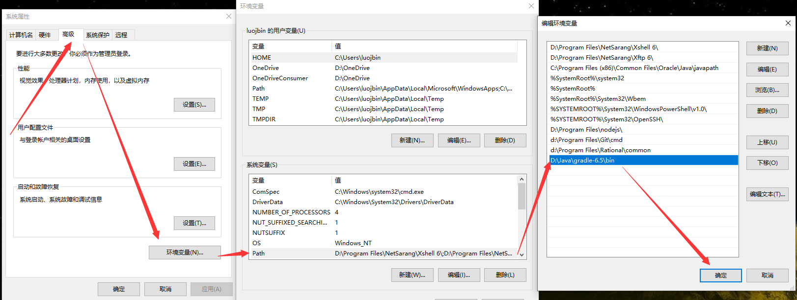
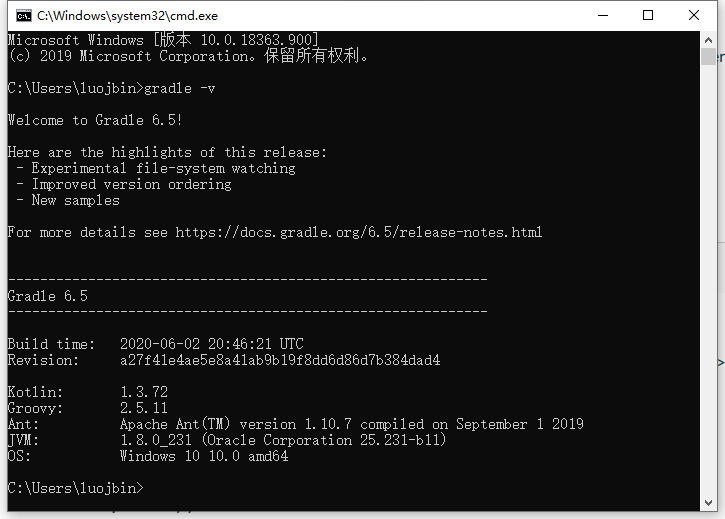
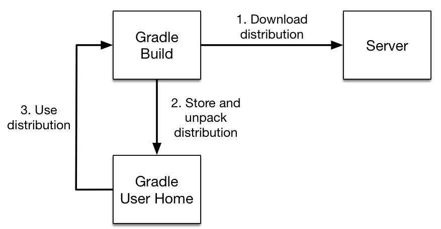
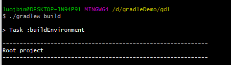
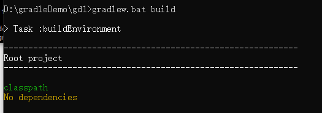
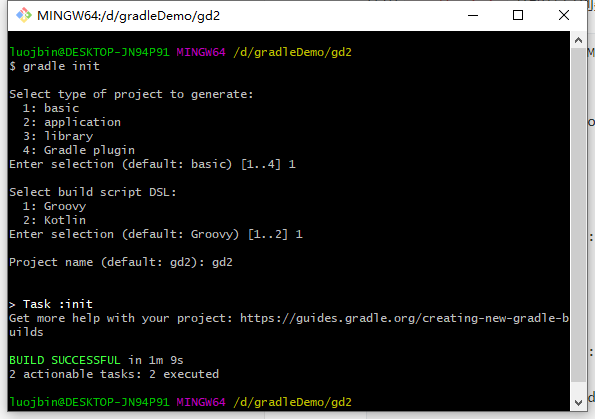

# █ Gradle

Spring Boot 从 2.3 开始, 将构建工具从 Maven 换成了 Gradle, spring 给出的原因, 是 maven 在自定义构建方面不够灵活, 构建整个 springboot 项目需要一个小时左右, 而使用 gradle 后只需要9分钟就能完成构建, 效率比maven 要高出不少. 因此, 我们也来追随一下大佬们的脚步, 了解一下 gradle

maven 相关功能的替代实现

| 功能点          | maven方案                                                | gradle方案                                        |
| --------------- | -------------------------------------------------------- | ------------------------------------------------- |
| **配置相关**    |                                                          |                                                   |
| 通用设置        | `settings.xml`                                           |                                                   |
| 远程仓库配置    | 远程库`repository`, 镜像`mirror`                         |                                                   |
| 本地仓库配置    | `localRepository`                                        |                                                   |
| **项目相关**    |                                                          |                                                   |
| 项目构建设置    | `pom.profile`                                            | `settings.gradle` <br />`build.gradle`            |
| 构建流程        | 预设生命周期                                             | task 依赖                                         |
| 项目声明        | GAV声明                                                  | GAV声明                                           |
| 项目关系        | 继承`parent`, <br />聚合`modules`, <br />依赖`depenency` | 聚合`include` <br />依赖`dependencies`            |
| 变量配置        | `properties`声明, `${..}`引用                            |                                                   |
| 资源过滤及替换  | `filters`                                                |                                                   |
| **依赖相关**    |                                                          |                                                   |
| jar包路径       | `dependency`下指定`gav`                                  | `dependency`下指定`gav`                           |
| 作用范围        | `scope`: compile, test, provided, runtime, system        | 依赖前声明, compile, testComile…                  |
| 版本界限        | 开闭区间                                                 |                                                   |
| 依赖冲突        | 根据最短路径决定                                         | 使用最新                                          |
| 可选依赖        | `optional`                                               |                                                   |
| 排除依赖        | `dependency`.`exclusions`                                | `compile(gav){excluse}`                           |
| 多模块依赖管理  | 父项目`dependencyManagement`                             | `allprojects`<br />`subprojects`<br />`configure` |
| 多模块插件管理  |                                                          | plugins.apply false                               |
| **插件/扩展类** |                                                          |                                                   |
|                 |                                                          |                                                   |
|                 |                                                          |                                                   |
|                 |                                                          |                                                   |
|                 |                                                          |                                                   |

# 一. 安装与配置

## 1. 安装


### 1.1. Windows 安装 Gradle

1. 下载 二进制包, 解压放到合适的位置

2. 配置环境变量

   添加 `gradle-${version}/bin` 到 `path`

   

3. 校验安装成功

   ```shell
   # 命令行输入, 查看版本信息
   gradle -v
   ```

   

### 1.2. IDEA 配置 Gradle

## 2. 全局配置

### 2.1. 远程仓库

gradle 支持多种仓库类型, 包括 Maven, Ivy, 

在 `~/.gradle` 目录中添加 `init.gradle` 配置文件, 添加以下内容, 指定远程仓库使用阿里云镜像服务

```groovy
allprojects {
  repositories {
    maven {
      url "https://maven.aliyun.com/repository/public"
    }
    google {
      url "https://maven.aliyun.com/repository/google"
    }
  }

  buildscript {
    repositories {
      maven {
        url "https://maven.aliyun.com/repository/public"
      }
      google {
        url "https://maven.aliyun.com/repository/google"
      }
    }
  }
}
```


### 2.2. 本地仓库

### 2.3. 编码及编译版本

## 3. 基本概念

task

### 3.2. Gradle Wrapper

Gradle Wrapper 是 gradle 提供的一个工具, 可以在项目配置中指定要采用的 Gradle 版本, 以保证构建环境一致.

gradle 项目在构建时会检查 wrapper 配置, 检查与当前使用的 gradle 版本是否一致, 若不一致则会自动下载指定版本的 gradle, 使用该版本完成项目构建. 



Gradle 都内置了一个叫 `wrapper` 的 task, 可以通过这个任务为项目创建 wrapper. wrpaer 目录结构如下所示

```shell
.
├── build.gradle
├── settings.gradle
├── gradle
│   └── wrapper
│       ├── gradle-wrapper.jar	# wrapper主文件, 用来下载指定的gradle发行版
│       └── gradle-wrapper.properties # wrapper配置文件, 用来指定需要的gradle发行版
├── gradlew	# shell脚本, 通过wrapper获取gradle并构建项目
└── gradlew.bat # bat脚本, 通过wrapper获取gradle并构建项目
```

只要有`gradlew`脚本及`gradle-wrapper.jar`, 就可以构建 gradle 项目而不需要在本地自行安装 gradle, 方便团队协作.

如果需要团队协作, 通常建议将这个 jar 包也添加到版本控制系统中.理论上团队中只有有一个人安装了 gradle 并创建了 wrapper, 那么团队中其他人都无需安装gradle 都能正确构建gradle 项目.

在`项目/gradle/wrapper` 目录下有一个 `gradle-wrapper.properties` 文件, 记录了 wrapper 相关信息

```properties
# gradle 文件存放路径
distributionBase=GRADLE_USER_HOME
distributionPath=wrapper/dists
# gradle版本及路径, 默认为bin包, 版本与创建 wrapper 的 gradle 一样
distributionUrl=https\://services.gradle.org/distributions/gradle-6.5-bin.zip
# gradle zip包存放路径
zipStoreBase=GRADLE_USER_HOME
zipStorePath=wrapper/dists
```

可以在创建 wrapper 的时候通过参数指定不同的配置, 如

```shell
$ gradle wrapper --gradle-version 6.5 --distribution-type all
```

 有三种方式为项目添加 wrapper

1. 新建项目, 为项目添加 wrapper

   ```shell
   # 在项目目录下运行 wrapper task 即可
   gradle wrapper
   ```

2. 已有项目, 使用已有的 wrapper 构建项目

   使用 wrapper 构建项目, 与使用安装版 gradle 几乎没有任何区别. 为了保证构建的可移植性, 建议使用 wrapper.

   使用 wrapper 进行构建, 只需要根据当前操作系统选择合适的脚本, 执行 `build` 命令即可

   - Unix-based

     

   - windows

     

3. 已有项目, 更新 wrapper 到新版本

   ```shell
   # 通过 gradlew 脚本运行 wrapper task, 指定新的版本
   $ ./gradlew wrapper --gradle-version 6.5
   ```

4. 自定义 wrapper

   与其他 task 一样, 可以在项目的 `build.gradle` 中修改 task 的行为

   ```groovy
   tasks.named('wrapper') {
       distributionType = Wrapper.DistributionType.ALL
   }
   ```

5. 其他操作

   1. 使用 HTTPS+用户验证, 从指定服务器下载 gradle
   2. 验证 gradle wrapper 完整与安全

## 4. 文件目录

Gradle 使用两个关键的目录来管理项目构建工作:

### 用户目录

用户目录用来存储 gradle 的全局配置和初始化脚本, 也会存放缓存和日志文件, 大概结构如下

```
~/.gradle
├── caches 				// 全局缓存目录,未在项目脚本中指定的都在这里
│   ├── 4.8 				// 特定版本的缓存, 为了支持增量构建
│   ├── 4.9 		
│   ├── ⋮
│   ├── jars-3 			// 共享缓存, 用来存放依赖
│   └── modules-2 	// 共享缓存, 用来存放依赖
├── daemon 				// daemon 守护进程的注册表和日志
│   ├── ⋮
│   ├── 4.8
│   └── 4.9
├── init.d 				// 全局适用的初始化脚本
│   └── my-setup.gradle
├── wrapper				// wrapper 下载的不同版本 gradle
│   └── dists 	
│       ├── ⋮
│       ├── gradle-4.8-bin
│       ├── gradle-4.9-all
│       └── gradle-4.9-bin
└── gradle.properties // 全局的配置参数
```

在 gradle 4.10 以上的版本, gradle 会自动清理用户目录中的内容, 当守护线程停止或结束时, 会在后台执行清理操作. 如果使用了 `--no-daemon` 参数, 则会在构建工作完成之后前台执行, 并提供一个进度指示器.

### 项目目录

项目目录用来存储项目构建相关的内容, 结构如下

```
项目根目录
├── .gradle 			// 项目级的 gradle 目录
│   ├── 4.8 			// 项目级的缓存目录
│   ├── 4.9
│   └── ⋮
├── build 				// 存放构建产物的目录
├── gradle				// 项目的构建目录, gradle 在这里生成所有构建产物
│   └── wrapper   // 包含 wapper 相关的配置和 jar
├── build.gradle or build.gradle.kts 				// 项目构建脚本
├── gradle.properties 											// 项目级的 gradle 配置参数
├── gradlew 																// 使用 gradle wrapper 的构建脚本, shell版
├── gradlew.bat 														// 使用 gradle wrapper 的构建脚本, 批处理版
└── settings.gradle or settings.gradle.kts 	// 项目设置文件
```


# 二. 依赖相关

# 三. 项目创建

## 1. 命令模式

使用 `gradle init` 开始项目创建向导, 根据需要选择



目录结构如下所示

```shell
├── src					# 项目文件
├── gradle/wrapper		# wrapper相关文件
├── gradlew  			# wrapper脚本, unix-based
├── gradlew.bat  		# wrapper脚本, windows
├── build.gradle  		# 项目构建配置
└── settings.gradle 	# 多模块构建配置
```

## 2. IDEA 创建项目


项目文件结构同上

# 四. 构建脚本

gradle 支持 groovy 和 kotlin 两种脚本语言来定制项目的构建过程. 声明task后, 通过依次执行不同的 task 以完成不同的构建任务. 

为了方便使用, gradle 通过 plugin 提供了大量预设的 task, 免去开发人员重复定义类似的 task. 

要想定制自己的构建脚本, 需要先了解一下脚本的编写语法. gradle 支持 groovy 和 kotlin 两种脚本语言, groovy 更加普及, 因此下面仅介绍基于 groovy 来编写 gradle 构建脚本. 

先学习一下 groovy 语法基础, 详见 Groovy 基础


## 3. 创建构建 task

一个完整的项目构建通常需要完成很多个任务task, 每个任务完成一些特定的操作

gradle 内置了许多常用的任务

```groovy
// task 任务名(type:类型, group:分组, description:描述){具体配置参数}
task copy(type: Copy, group: "Custom", description: "Copies files") {
    from "src"
    into "dest"
}
```

## 4. 应用插件 plugin

在`build.gradle`文件顶部添加 `plugins{}` 以声明要使用的插件

```groovy
plugins {
    id "base"
}
```

然后再声明该插件提供的 task, 默认放在 `build/distributions` 目录下

```groovy
task zip(type: Zip, group: "Archive", description: "Archives sources in a zip file") {
    from "src"
    archiveFileName = "basic-demo-1.0.zip"
}
```

## 5. 使用 build Scan

可以使用在线的 `build scan` 工具来检查构建脚本是否正确, 需要再构建时将相关信息发送到 gradle.com. 如果有保密要求, 可以使用 企业版

# 四. java 项目

gradle 使用"约定大于配置"的方式构建Java项目, 为此沿用了maven 的项目结构, 并兼容 maven 仓库. 

在 `build.gradle`引入 `java plugin` 和 `application plugin`, 并指定程序入口 main 类

```groovy
// 引入 Java 表示是一个java项目, application 表示是一个可执行程序
plugins {
    id 'java'
    id 'application'
}
// 指定入口, main 函数所在类
application {
    mainClassName = 'com.loyofo.gd3.application.App'
}
```


# 五. 多模块项目

创建项目, 在`settings.gradle` 文件中添加项目配置根项目名

```groovy
// 根项目名
rootProject.name = 'creating-multi-project-builds'
```

在根项目的`build.gradle` 添加通过配置, 子项目的 `build.gradle` 只添加专用配置

### 共用配置

 ```groovy
// 为所有项目(根项目及子项目)指定仓库
allprojects {
    repositories {
        jcenter() 
    }
}

// 为所有子项目指定版本
subprojects {
    version = '1.0'
}
 ```

`allprojects{}` 声明适用于根项目及所有子项目的配置, `subprojects{}` 可以声明仅适用于子项目而不含根项目的配置

### 部分共用配置

```groovy
configure(subprojects.findAll { it.name == 'greeter' || it.name == 'greeting-library' }) { 
    apply plugin: 'groovy'
    dependencies {
        testCompile 'org.spockframework:spock-core:1.0-groovy-2.4', {
            exclude module: 'groovy-all'
        }
    }
}
```

`configure`可以为指定的几个子项目添加共用的配置, 而不是应用到全部子项目, 也不需要在每个用到的项目中重复添加相同的配置. 


在`settings.gradle` 中, 使用`include` 包括子项目

```groovy
include 'greeting-library'
```

如果一个子项目依赖另一个子项目, 则在消费方使用 `dependencies` 声明依赖

```groovy
dependencies {
    compile project(':greeting-library') 
}
```

`project(项目GAV)` 表示该依赖是另一个子项目, 而不是从远程仓库获取的, gav 不完整时, 需要保留前置的冒号`:`

### 运行 task

可以在项目根目录运行任意子项目`build.gradle` 中配置的 task, 只需要为task 添加项目GAV前缀

也可以进入到子项目的目录, 再调用项目根目录的 `gradlew` 脚本

```shell
# 在根目录运行子项目的 task
$ ./gradlew :greeter:test

# 在子项目目录调用上级的 gradlew 脚本, 执行子项目的 task
$ ../gradlew test
```

如果在根目录未指定子项目, 直接运行task, 则 gradle 会运行所有项目中的同名 task

### task 依赖

```groovy
// 为已有task 添加前置任务(多个前置任务的时候怎么决定先后? )
build.dependsOn 'asciidoctor'

// 为当前 task 添加前置的已有任务

```

### 增量构建

可以根据需要只构建被改动的地方, 而不需要像 maven 等工具一样先 clean 一遍再全量构建

### 


