# █ idea 功能特性

# 一. 视图与界面

## 新窗口中打开文件

在 project 工具窗中, 选中文件, `shift+enter`

## 自定义快捷键

自定义快捷键, 通过快捷键执行操作

自定义命令缩写别名, 可以通过别名, 在 `Search Everything` 中快速查找

## 自定义浮窗菜单

`quick list`

允许自定义快捷菜单, 设置热键后可以快速调出

## 收藏夹

在包含大量文件的项目中, 找到某个特定文件会很麻烦, idea 提供了收藏夹, 以便快速定位到目标文件. 

默认会有一个与项目同名的收藏列表, 可以添加自己的列表. 书签和断点也会自动加入到收藏夹中. 


## 切换器

默认快捷键 `CTRL+TAB`, 与其他软件不一致, 去掉

与 `CTRL+E` 的最近访问类似, 但只显示当前打开的文件, 并会自动隐藏

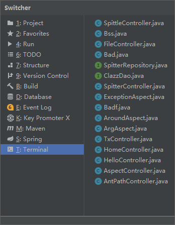

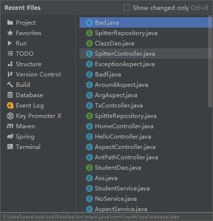

## 快速切换菜单

快速切换 快捷键/主题/代码风格 等, 默认 ``CTRL+` `` , 自定义修改为 `CTRL+SHIFT+S`

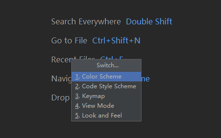

## 文件对比

打开一个文件A, 然后 view-compare with 选中文件B, 即可高亮对比两个文件的区别

或者在项目结构树中选中文件, `CTRL+D`, 选择要对比的文件

或者在项目结构树中选中两个文件, `CTRL+D`, 直接打开对比框

# 二. 编辑器功能

## 文件编码

默认使用系统编码, windows 为 GBK

- 为没有内置编码声明的文件/目录设置编码

  在设置中指定新建文件时采用的编码, 默认情况下, 控制台输出也采用该处指定的编码. 

- 为内置编码声明的文件设置编码

  在文件内的编码声明处, `ALT+/`打开默认补全浮窗, 选择需要的编码.

- 为控制台输出信息设置编码. 

  默认采用设置中指定的文件编码, 也可以在自定义 vm 参数中指定编码.

- 为已有文件修改编码

  为文件修改编码时,可以选择以不同的编码重新加载文件, 或是以不同的编码重新保存文件.

  若选择的编码需要修改文件, 则该编码前面会有黄色或红色的警告图标.

## 草稿

创建各种临时的草稿文件, 可以测试各种代码, 草稿是跨项目的, 你可以从不同的项目访问.

- **代码草稿** `Scratch File`

  提供完整的代码功能, 语法高亮, 可以运行/调试等, 通过菜单或`CTRL+ALT+SHIFT+INSERT` 创建

- **文本草稿**  `Scratch Buffer`

  纯文本文件, 可以用来作为备注, 或者任务列表等临时记录信息. 通过 `CTRL+ALT+A` 查找命令的方式创建.

  以`buffer1~5.txt` 命名, 默认只保留最近的5个. 如果希望保留某个文件, 可以为其重命名

## 快捷信息

- **查看声明** `CTRL+SHIFT+I`

  在变量/类名上使用, 显示其声明语句

- **查看目标类型** `CTRL+SHIFT+P`

  在变量上使用, 显示其声明的类型, 在表达式上使用, 显示其返回值的类型

  双击时显示其静态分析结果, 可以在不运行代码的情况下产看是否为null, 实际对象类型, 值, 大小等

- **查看参数列表** `CTRL+P`

- **查看javadoc** `CTRL+Q`


## 多光标编辑

- 按着 `ALT`, 按着鼠标左键上下拖动, 在多行插入光标, 以便同时编辑多行

  按着 `ALT`, 按着鼠标左键沿对角线拖动, 在多行插入光标, 并选中多列内容

- 按着 `ALT+SHIFT`, 鼠标点击多个地方, 在多处放置光标

- 按着 `ALT+SHIFT`, 鼠标点击多个地方并拖动/双击, 在多处放置光标, 且选中多处内容

- 多次按 `ALT+J`, 按顺序将选中多个相同语素, 在多处放置光标

- 按下 `CTRL+ALT+SHIFT+J`, 选中文件中所有相同语素, 在多处放置光标

- `双击CTRL`, 第二次按着不放, 按方向键上/下, 在多行放置光标, 左右移动则选中内容

- 按下`ALT+SHIFT+INSERT` 开启列选模式, 按着鼠标拖动选择矩形区域, 放置多个光标

## 查找/替换

### 文件内查找/替换

`CTRL+F` `CTRL+R`

### 全局查找/替换

`CTRL+SHIFT+F` `CTRL+SHIFT+R`

### 多行查找

- 搜索框内点击换行箭头, 或 `ctrl+shift+enter`, 可以换行, 在多行结构中进行搜索
- 使用结构搜索
- 搜索框旁边的漏斗, 可以选择搜索范围

### 结构化搜索

## 代码补全

### 1. 基础补全

根据输入, 提示所有匹配的内容, 默认自动提示, 也可以通过`ALT+/` 调出, 

第一次按键, 只提示当前类可见, 且名称与输入匹配的内容, 不考虑类型.

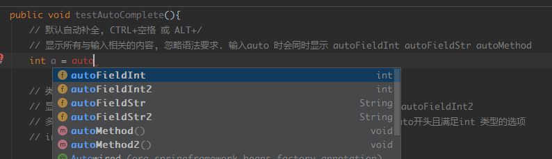

第二次按键, 会查找间接匹配的内容, 如某些类名与输入不匹配, 但类中的常量与输入匹配的内容

第三次按键, 会在当前项目内查找暂不可见的内容(可以后续修改为public变为可见)

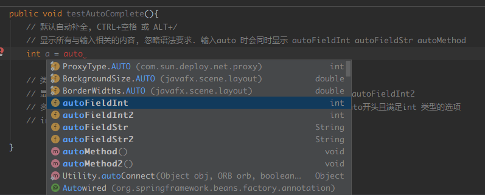

### 2. 智能补全

根据输入, 提示类型满足当前语法的内容, 可以在以下能推断所需类型的地方使用

- 赋值语句的右侧
- 变量初始化
- return 语句
- 方法参数列
- new 语句
- 链式调用表达式

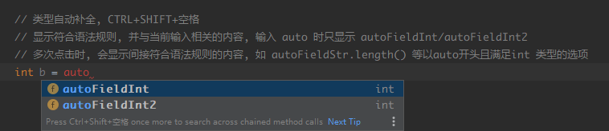

多次按键, 会查找间接符合的记录

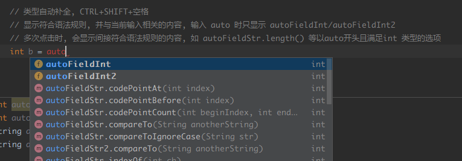

### 3. 语句补全

补全当前语句中需要的括号/引号/分号等

### 4. 嬉皮士补全(上下文补全)

根据输入, 在当前文件中遍历查找已有的语素

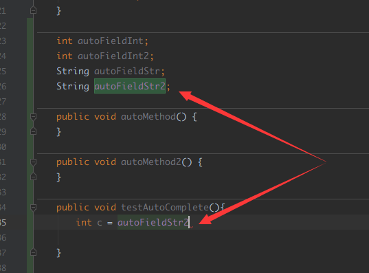

### 5. 后缀式自动完成

对于`sth`, 可以通过`sth.自定义后缀` 触发自动完成.

具体可用配置详见 `Settings | Editor | General | Postfix Completion`

```java
// 用户输入
List<String> list = new ArrayList<>();
list.for

// 自动完成, 将.for扩展成for循环结构
List<String> list = new ArrayList<>();
for (String s : list) {}
```

### 6. 其他特性

- 自动显示 基础补全的建议

- 显示建议列表时, 自动显示对应条目的 java doc

- 建议列表可按字母顺序排列, 默认按使用关联性/使用频率排列

- 是否限制大小写匹配

- 方法参数列提示, 有重载方法时, 显示全部可能的参数列, 可以通过 `CTRL+P` 调出该参数列提示气泡

  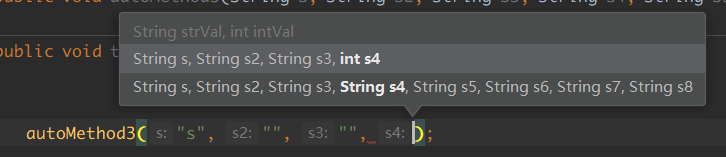

  - 完整的方法签名, 依赖上面的"方法参数列提示"选项

    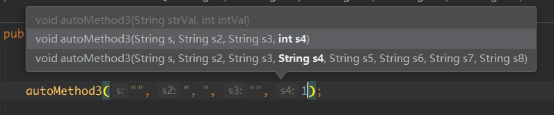

- 自动完成时显示参数名提示, 

  显示参数名称, 按 tab 跳到下一个参数处. 若开启了"方法参数列提示", 会显示该参数类型

  若有重载方法时, 此时显示参数列为应用提示时选择的方法

  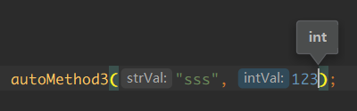

- 使用其他符号应用提示. 如空格, 圆点, 括号等. 该选项可能会在不需要的时候应用自动完成, 默认关闭. 开启时提示框会自动获取焦点, 以便应用其他特性

- 反转布尔值. 当提示中有boolean 类型的结果时, 如果按下`!`, 会应用该提示的反转结果, 即在前面加`!`. 

  ```java
  // 原始输入, 提示 isOk() 方法
  boolean a = isO
  
  // 输入!反转结果
  boolean a = !isOk();
  ```

  但因为输入时自动显示的提示框不会自动获取焦点(或者开启上面的用其他符号应用提示, 会自动获取焦点), 此时按下的 `!` 不能应用反转结果, 需要先按一下方向键使得焦点落到提示列表中才能生效. 又因为`!` 需要按shift 才能输入, 此功能并不实用.

  - 未获取焦点, 输入 `!` 不能反转结果

    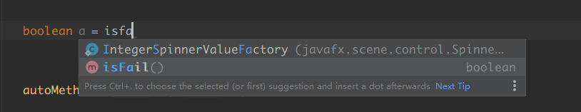

  - 获取了焦点, 输入 `!` 反转结果

    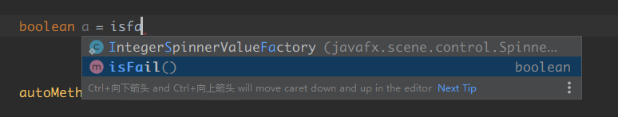

## 自动生成

`ALT+INSERT` 调出生成菜单, 选择需要生成的内容. 生成的代码将会插入到光标当前位置, 可以在生成代码后再试用代码重排功能整理. 

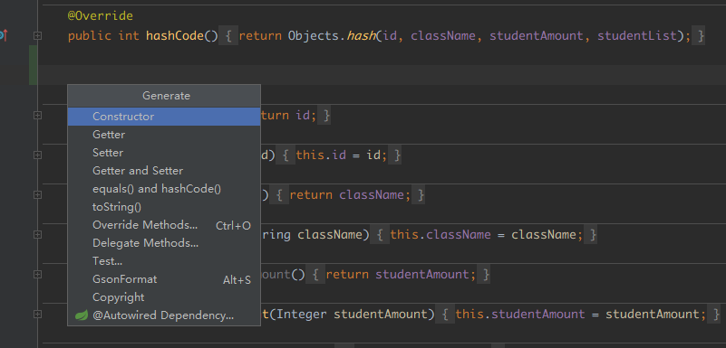

### 1. 基础方法

可以生成以下常用的基本方法

- 构造器
- getter / setter
- equals / hashCode
- toString

### 2. 重写/实现方法

`ALT+INSERT` 中选择 `implement methodes`, 或直接 `CTRL+I`, 弹框提示需要实现的方法. 

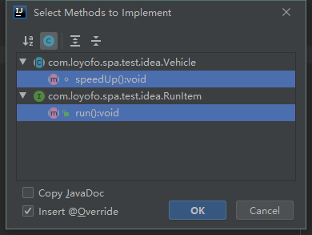

`ALT+INSERT` 中选择 `override methodes`, 或直接 `CTRL+O`, 弹框提示需要重写的方法. 

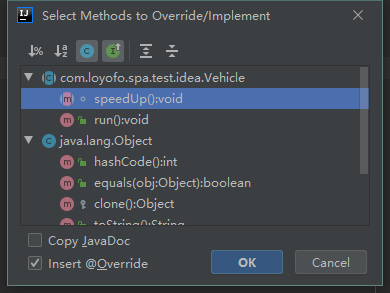

默认会添加 `@Override` 注解, 还能根据需要选择是否将父类的文档复制到当前类中. 

如下图所示, 重写/实现的接口/类/方法前会有相应的图标显示, 鼠标悬停可以看到相关的信息, 点击则可以跳转到目标位置

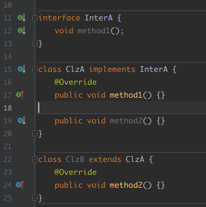

### 3. 委托方法

可以快速创建委托方法, 将方法调用委托给当前类的某个域, 或是某个方法返回的对象

- 先选择受托对象, 实例域/静态域/getXXX的方法

  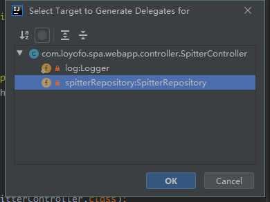

- 需要的受托方法, 根据上一步选择, 列出受对象的所有实例方法/静态方法, 选择需要的方法以创建委托方法

  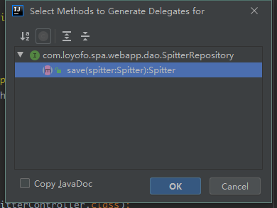

- 创建委托方法, 方法签名与受托方法一样, 而方法体中则是调用受托对象完成该方法

  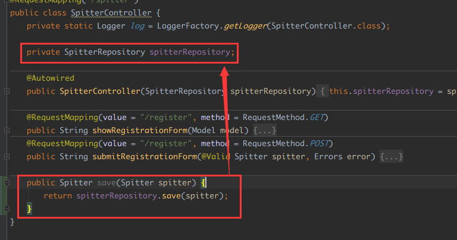

### 4. 测试方法

### 5. 调用对象所有 setter

`GenerateAllSetter` 插件提供, 在变量上 `alt+enter`, 菜单中选择添加所有 setter

### 6. 自定义方法模板

idea 允许用户自定义方法模板, 使用 `Velocity` 模板语言进行定义, 并提供了一些预设的变量. 

在实现方法时, idea 默认方法体仅提供返回类型的初始值, 而重写方法则简单调用超类的方法. 在很多时候这是不够的, 为了提醒我们不要忘记编写方法体, 我们希望能在自动生成的重写/实现方法中添加 `TODO` 标记. 

可以在 `File and Code Templates` 中进行编辑`Implement method body`/`Overridden method body`

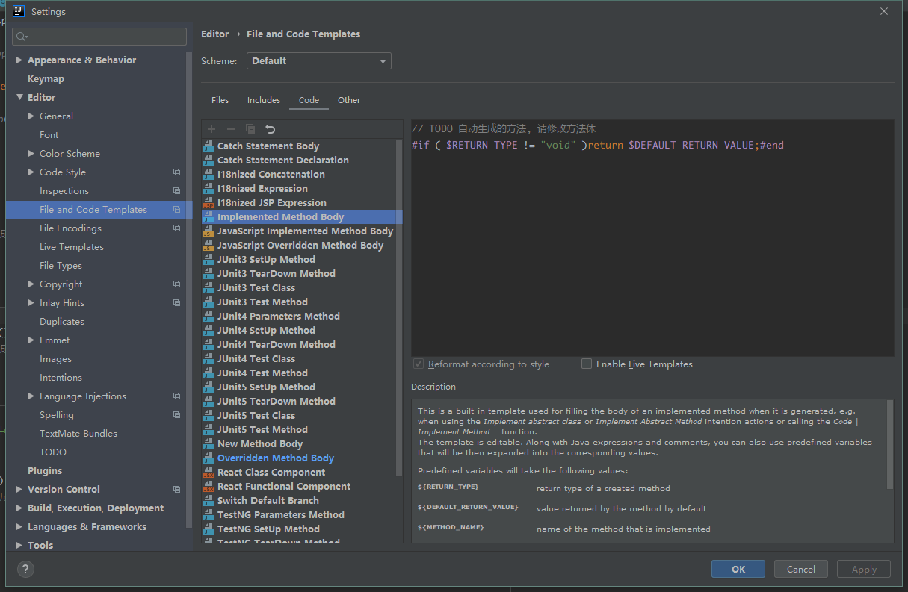

另一种办法是利用`live Template` 实现创建方法模板. 如用`test` 关键字创建 Junit 的测试方法模板

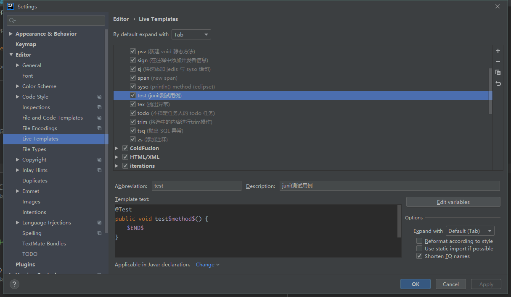

### 7. json转实体类

`GsonFormat` 插件提供, 可以根据已有的 json 数据, 自动生成合适的实体类. 

默认快捷键`ALT+S`, 也可以在`ALT+INSERT` 浮窗中选择. 

## live template

### 1. 自定义模板

idea 提供了大量的预设模板, 也允许用户添加自定义模板. 

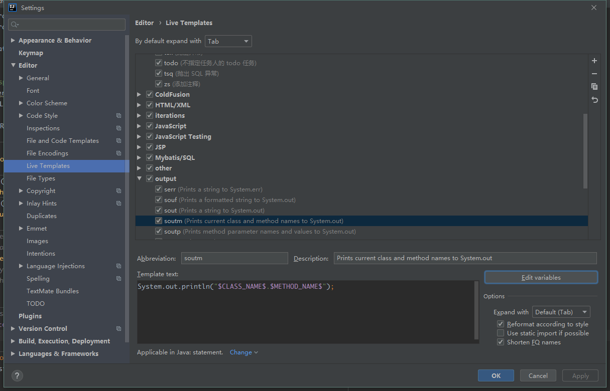

- 模板缩写与描述

  当模板定义的缩写与用户当前输入一致时, 该模板会出现在自动完成的提示列表中, 后面展示模板描述

  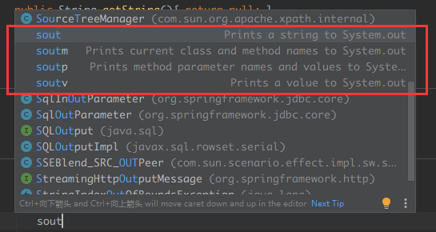

- 模板内容

  定义模板的完整内容, 按需要设置变量占位符

- 模板变量

  使用 `$xxx$` 作为变量占位符, idea 提供了一些固定的预设变量, 非预设变量则可以在 `Edit variables` 对话框中进行设置, idea 提供了一些函数, 以便从上下文中获取相应的值. 如果未能从函数取到值, 则采用默认值. 

  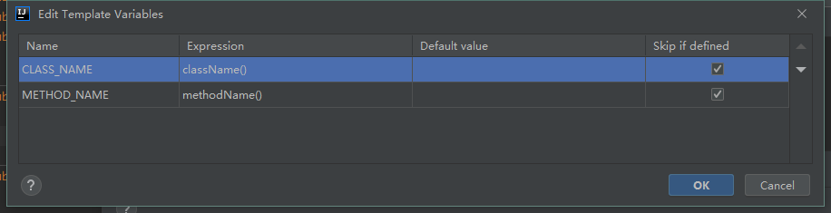

  如果不对变量进行预定义, 或者预定义内容无法生效, 则需要用户手动输入变量内容, 变量所在位置会用红色方框进行提示. 

  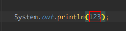

- 模板作用域

  需要指定模板的作用域, 能用在什么地方, 若不指定则无法应用

### 2. 环绕模板与环绕功能

与普通模板类似, 但关键一点在于模板内使用了预设变量 `$SELECTION$` 

```java
if($var$ != null ){
    $SELECTION$
}
```

定义环绕模板后, 可以通过调用环绕功能 `CTRL+ALT+T` 或调用 liveTemplate `CTRL+ALT+J` 选择合适的环绕模板.

- 环绕功能 `CTRL+ALT+T` 除了自定义的环绕LiveTemplate外, 还提供了预设的 if/while/try-catch 等环绕块, 其中 catch块内的语句可以在 ` Editor|File and Code Templates|code|catch statement body` 中编辑.

  环绕功能还提供了自定义折叠块的注释, 

- liveTemplate `CTRL+ALT+J` 则只会显示自定义的环绕LiveTemplate.

### 3. 预设变量

idea 提供了以下预设变量, 在自定义模板中使用, 会提供一些特定的功能. 

| 预设变量    | 描述                                 |
| ----------- | ------------------------------------ |
| $SELECTION$ | 创建环绕模板时必须, 指代被选中的内容 |
| $END$       | 输入其他变量后光标最后位置           |

### 4. 预设函数

idea 提供的函数可以在定义变量的时候使用, 在上下文环境中获取合适的值. 详见 [官方文档-预设函数](https://www.jetbrains.com/help/idea/2019.2/template-variables.html#predefined_functions)

## 注入语言支持

idea 允许在某种代码使用其他语言的片段, 提供必要的语法检查和高亮, 比如在 java 开发中, 可以用字符串编辑 sql, html, 正则表达式等.

### 临时注入

在代码段中, 通过 `ALT+ENTER` 打开 `Inject language or reference`, 选择注入语言开启临时注入支持. 

这种注入是临时的, 编辑其他代码段的时候会自动取消注入. 

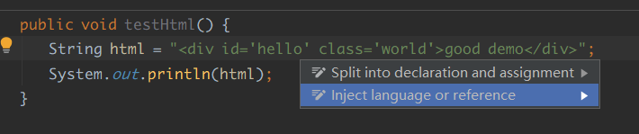

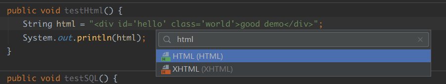

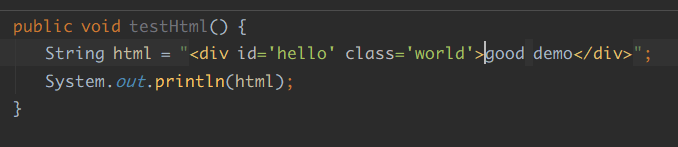

`ALT+ENTER|Edit XXX Fragment` 可以打开一个独立的编辑器窗口, 以该语言的原生语法进行编辑, 不需要考虑在 java 中的转义, 如正则表达式

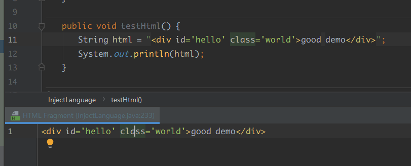

### 注释标记注入

可以在目标字符串上添加一个单行注释, 指明该字符串需要注入语言支持. 

> // language=注入语言名称

有时候, 在代码中编写的注入语言只是一个片段, 并不满足语言规则, 可能会提示错误. 在这种情况下, 可以在注释中通过前缀`prefix` 和后缀`suffix` 来补全语言结构

> // language=注入语言名称 prefix=前缀 suffix=后缀

如下所示, 通过前缀和后缀补充的部分, 不会添加到 java 代码的字符串中, 只能在独立的语言编辑窗口看见

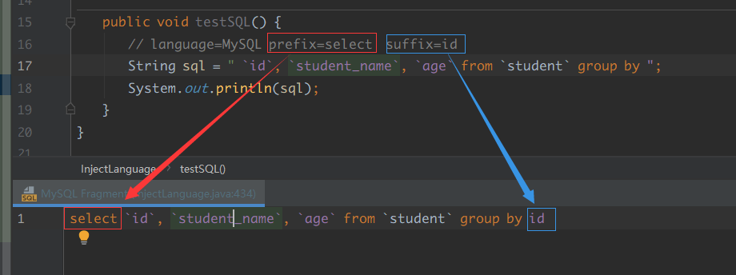

### 注解标记注入

可以使用 jetbrain 提供的外部注解 `@Language`, 效果与注释标记相同. 

### 1) Emmet 表达式

编写 html/xml 文件时, idea 支持使用 emmet 语法编写: `输入Emmet表达式 + Tab`

### 2) 正则表达式

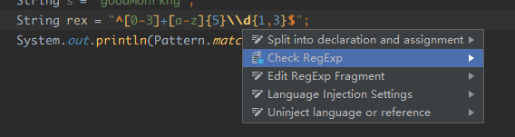

使用正则表达式时, idea 提供两个方便的的工具

#### 测试工具

Check RegExp: 提供测试工具, 输入被测字符, 测试是否正确

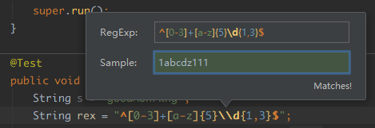

#### 原生编辑器

Edit RegExp Fragment: 原生正则表达式编辑器, 不需考虑在 java 中的转义

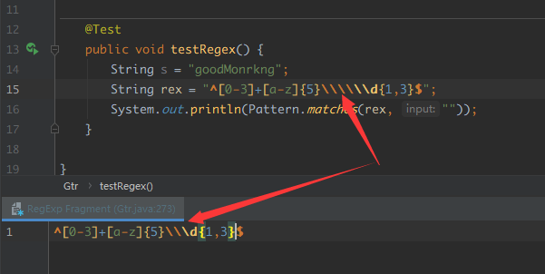

idea 还在多处支持使用正则表达式, 如查找/替换工具, 自定义todo等

#### 分组替换

idea 支持在查找/替换工具中使用表达式组, 正则表达式中, `()` 视为一个组, 可以使用`$n` 进行引用, 其中`$0`为整个正则表达式, `$1`及后续表示对应序号的组, 可以按原字符串的一部分进行替换

```html
<!-- 测试1 这是1 -->
<!-- 测试2 这是2 -->
<!-- 测试3 这是3 -->
<!-- 测试4 这是4 -->
<!-- 测试5 这是5 -->
```

使用 `(测试\d) (这是\d)` 进行查找, 并替换为 `<$2-$1>`

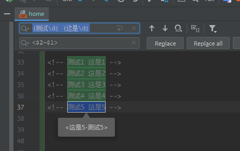

会将原字符串中匹配到第一个分组的部分, 放到`$1`的位置, 匹配到第二个分组的部分, 放到`$2` 的位置

```html
<!-- <这是1-测试1> -->
<!-- <这是2-测试2> -->
<!-- <这是3-测试3> -->
<!-- <这是4-测试4> -->
<!-- <这是5-测试5> -->
```


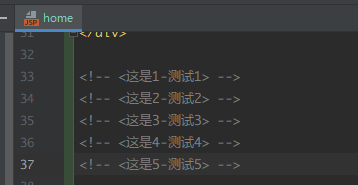

#### 切换大小写

- `\l`, 小写一个
- `\L`, 小写全部, 直到`\E`
- `\u`, 大写一个
- `\U`, 大写全部, 直到`\E`

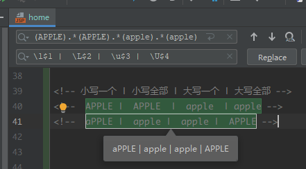

## 重构

开启重构菜单 `CTRL+ALT+SHIFT+T` , 显示当前可用的所有重构选项. 某些重构可以在修改生效前查看将要被修改的地方, 也可以排除对某些地方的修改.

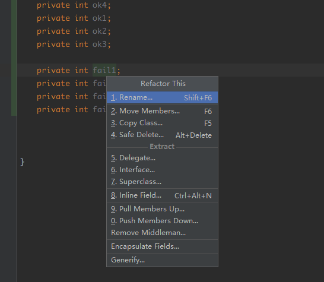


### 重命名

可以为接口/类/方法/常量/变量/参数/域等元素进行重命名, 同步更新所有引用点

### 提取

可以将选中内容, 提取为常量/变量/参数/域等

#### 提取常量

提取常量可以避免魔法值, 提高代码可读性和可维护性

1. 选中内容, 重构-提取常量 `CTRL+ALT+C`, 双击则打开重构对话框
2. 为常量命名, 是否替换文件内的全部引用点
3. 是否移动到其他类, 若勾选也会打开重构对话框

#### 提取域

添加一个成员域, 并用选中的表达式进行初始化

1. 选中内容, 重构-提取域`CTRL+ALT+F` , 双击则打开重构对话框
2. 为实例域命名, 并选择初始化位置(当前位置/声明处/构造器)

> 打开的对话框多处不可用, 又是bug?

#### 提取方法

将代码段提取到一个新建的方法中, 并将原代码段所在位置替换为方法调用.

1. 选中代码段, 重构-提取方法`CTRL+ALT+M`
2. 设置方法签名, 包括方法名, 参数列表, 返回值类型, 是否static
3. 创建方法并替换为方法调用. 
4. 如有重复代码段, 选择需要替换的地方

注意选中代码段中, "被修改且被后续代码使用"的变量应该只有一个, 该变量会作为新方法的返回值. 若有多个"被修改且被后续代码使用"的变量, 则该项重构无法完成, 给出错误提示. 

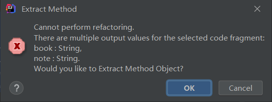

#### 提取变量

将同一方法内多次从同一方法获取到的值, 提取到一个局部变量中, 减少代码重复并增加可读性. 

1. 选中表达式, 重构-提取变量`CTRL+ALT+V`
2. `SHIFT+TAB` 可以修改变量类型, 
3. 设置变量名, 选择替换范围, 是否final

在 java 8 及后续版本, 可以将表达式提取为某个函数式接口的方法体. 在 java 8 之前的版本, 该重构会生成一个匿名内部类

类似于提取一个函数对象, 然后调用该对象的方法完成指定代码块内容. 

```java
// 重构前
System.out.println("add: " + add(a, b));

// 重构后
BiFunction<Integer, Integer, String> addFun = (a1, b1) -> "add: " + add(a1, b1);
System.out.println(addFun.apply(a, b));
```

#### 提取参数

将某个局部变量提取为方法参数, 添加到方法的参数列表中. 该操作会将选中的表达式移动到调用方法中, 以表达式结果作为实参传递到被修改的方法中. 如果不想修改调用方法, 则可以选择创建重载的委托方法. 

1. 选择局部变量/表达式, 重构-提取参数 `CTRL+ALT+P`
2. 设置参数类型和参数名, 是否创建重载的委托方法. 

#### 提取接口

有两种选项, 区别关键在于接口用什么名

- 直接创建接口, **为新建的接口指定名字**, 原文件实现新创建的接口.

  该选项创建接口后, 会提示是否需要将原类的引用点改成使用新接口进行声明.

- 将当前类重命名, 并**以原类名创建一个接口**, 当前类实现该接口, 

  该选项自动将原类的引用点改成使用接口声明.

如果在一个已经实现接口的类上提取接口, 则可以选择新接口是否需要继承原有的接口

```java
// 原代码, Teacher 实现 Person 接口
public interface Person {...}
public class Teacher implements Person {...}
```

- 新接口继承原接口, 则原类只实现新接口

  ```java
  public interface Person {...}
  // 新接口继承原 Person 接口
  public interface EarnMoney extends Person {...}
  // 原类只继承新接口, 不再继承 Person
  public class Teacher implements EarnMoney {...}
  ```

- 新接口不继承原接口, 则原类同时实现两个接口

  ```java
  public interface Person {...}
  // 新接口不继承 Person
  public interface EarnMoney {...}
  // 原类同时实现 Person 和新的 EarnMoney
  public class Teacher implements Person, EarnMoney {...}
  ```

#### 提取超类

有两种选项, 区别关键在于超类用什么名

- 直接创建超类, **为超类指定名字**, 原文件继承新创建的超类.

  该选项创建超类后, 会提示是否需要将原类的引用点改成使用超类进行声明.

- 将当前类重命名, 并**以原类名创建超类**, 当前类继承新创建的超类, 

  该选项自动将原类的引用点改成使用超类声明.

- 在选择将方法移动到超类时, 可以将方法实现上移到超类, 也可以只在超类中添加抽象的方法声明, 若添加抽象方法声明, 则超类自动成为抽象类.  

idea 可以根据选中代码创建一个新建类, 可以简化过大的类或方法, 以满足"高内聚"包括以下三种形式

#### 创建委托类

可以将`类A`中的某些实例域/方法提取到一个`委托类B`中, 并令`委托类B`作为`类A`的一个实例域. 当需要`类A`完成某些工作时, `类A`将工作转交给`委托类B`来完成 

```java
// 重构前
public class A {
    private String info;

    // 在类 A 中完成 getInfo 的具体工作
    public String getInfo() {return ("my info detail: " + info);}
}

// 重构后
public class A {
    // 类A持有类B的引用
    private final B info = new B();
    // 将工作转交给类B完成
    public String getInfo() {return info.getInfo();}
}

public class B {
    // 存储具体信息的实例域, 也被移动到B中
    String info;
    // 在新建的类B中完成 getInfo 的具体工作
    public String getInfo() {return ("my info detail: " + info);}
}
```

#### 提取方法对象

将某个复杂方法, 提取成一个方法对象类, 原方法用到的所有局部变量/实例域, 都转换为方法对象类中的实例域. 然后调用方法对象中的计算方法, 完成原方法的工作内容.

1. 选中代码块, 重构-提取方法对象
2. 默认创建为该类的内部类, 局部变量通过构造器传入, 作为方法对象的实例域

```java
// 重构前, 变量关系复杂, 难以简化
class Before {
    public double calVal(int a, String b, double c) {
        a = (int)(a + c);
        b = b + c;
        c = a + b.length();
        double result = a + b.length() + c;
        return result;
    }
}

// 重构后, 变量均为实例域, 类内所有方法都可直接访问, 无需复杂的传参
class After {
    public double calVal(int a, String b, double c) {
        // 通过构造方法对象, 由方法对象完成计算
        return new CalMethod(a,b,c).invoke();
    }
}

class CalMethod {
    // 方法对象持有原方法的局部变量作为实例域
    private int a;
    private String b;
    private double c;

    public CalMethod(int a, String b, double c) {
        this.a = a;
        this.b = b;
        this.c = c;
    }

    public double invoke() {
        a = (int) (a + c);
        b = b + c;
        c = a + b.length();
        return a + b.length() + c;
    }
}
```

#### 提取参数对象

在过长的参数列中, 提取关联的参数封装成一个对象, 提高语义性

```java
// 重构前
class MutilParam{
    // 太长的参数列, 不便维护
    public void method(int a, int b, int c, double d, double e, double f, String g){
        System.out.println(a);
        System.out.println(b);
        System.out.println(c);
        System.out.println(d);
        System.out.println(e);
        System.out.println(f);
        System.out.println(g);
    }
}

// 重构后
class MutilParam{
    // 传入新建的参数对象
    public void method(Numbers numbers, String g){
        // 通过参数对象获取值
        System.out.println(numbers.getA());
        System.out.println(numbers.getB());
        System.out.println(numbers.getC());
        System.out.println(numbers.getD());
        System.out.println(numbers.getE());
        System.out.println(numbers.getF());
        System.out.println(g);
    }
}

public class Numbers {
    private final int a, b, c;
    private final double d, e, f;

    // 构造器, 传入参数以初始化
    public Numbers(int a, int b, int c, double d, double e, double f) {...}

    // 各个实例域的 getter 方法, 略
}
```

### 移动

可以将选中内容, 如常量/变量/参数/域/方法等内容, 移动到其他类, 也可以在继承树上进行移动

### 修改签名

对于类, 可以将类转换为接口/抽象类/泛型类

对于方法, 可以修改参数/异常等, 还可以直接创建委托的重载方法.

#### 重载方法

如果是通过签名创建的重载方法, 则新签名会得到原来的方法体, 而原签名则是委托调用新签名的方法

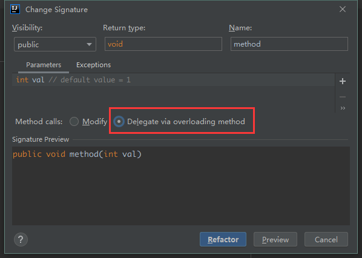

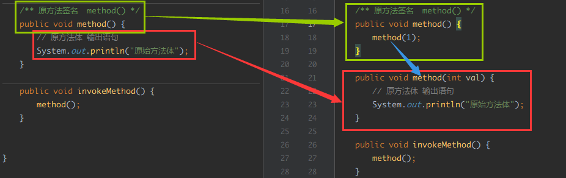

即创建新旧签名的两个重载方法, 并以新签名的方法作为本体, 被旧签名的方法所调用. 

#### 使用类型匹配的变量

> 2019.2 版本有bug, 2018.3.6 上是正常的

为方法增加参数时, 可以使用`use any var` 选项, 将在调用方法的方法体中查找合适的变量, 如果与修改方法的新参数类型一致, 则将该变量作为实参传递给修改方法.

#### 参数/异常传递

>  2019.2 版本有bug, 2018.3.6 上是正常的

为方法增加/删除参数/异常, 可以使用`传播 propagate` 功能, 将修改传播到调用方法上去. 

可以根据设置, 相应的修改调用方法的参数和异常. 

### 查找并替换重复代码

在指定范围内查找, 能否用当前方法或常量替换代码段. 

与代码检测中的查找重复代码`Analyze|Run inspection by name|duplicated code fragment`不同, 此项重构功能只查找包含 **当前方法/常量全部内容** 的代码段, 而代码检测中的重复代码则会查找所有重复代码片段

### 泛型化

对于已有的泛型类, 若使用时未指定类型参数, 则可以通过此项重构, 为泛型类指定合适的类型实参. 

若需要将一个普通类转变为泛型了, 请使用`修改签名`方法为类添加类型参数, 并手动编辑该类中需要使用类型参数的地方, 然后再用此项重构为引用点指定类型实参. 

可选配置

| 选项                                 | 说明                                                    |
| ------------------------------------ | ------------------------------------------------------- |
| Drop obsolete casts                  | 丢弃多余的类型转换声明                                  |
| Leave Object-parameterized types raw | 使以`Object`为参数的泛型类对象为raw, 即移除`Object`参数 |
| Perform exhaustive search            | 在所有节点内查找                                        |
| Generify Objects                     | 将声明为`Object`类型的转换为实际使用的类型              |
| Produce wildcard types               | 使用界限通配符                                          |
| Preserve raw arrays                  | 保留raw类型的数组, 否则将数组也泛型化. 默认启用.        |


### 类型转化

可以在重构方法形参类型时, 同步修改实参的类型

#### 反转布尔

允许在反转时为布尔变量重新命名


## 代码风格与格式化

idea 默认支持 ide 级和 项目级的代码风格配置

此外, 也支持通过 `EditorConfig` 文件, 进行目录级别的代码风格管理

### 格式化选中代码

编辑器内选中代码, CTRL+ALT+L

### 格式化文件

编辑器内不选代码, CTRL+ALT+L

编辑器内不选代码, CTRL+ALT+SHIFT+L, 弹框确认后格式化

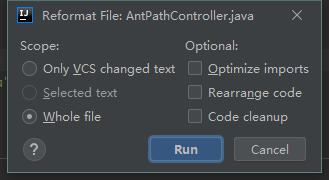

project 选中文件, CTRL+ALT+L, 弹框确认后格式化

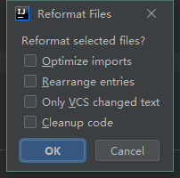

### 格式化模块/目录

project 中选中模块/目录, 按 CTRL+ALT+L, 弹框确认后格式化

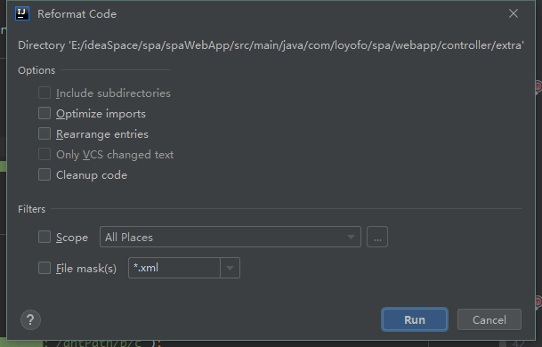

### 格式化缩进

编辑器内选中内容, CTRL+ALT+I, 自动缩进选中内容

编辑器内不选中, CTRL+ALT+I, 自动缩进当前行

### 排除scope

可以添加要排除的 scope, 指定需要排除的目录/模块/文件等, 注意scope 的作用域

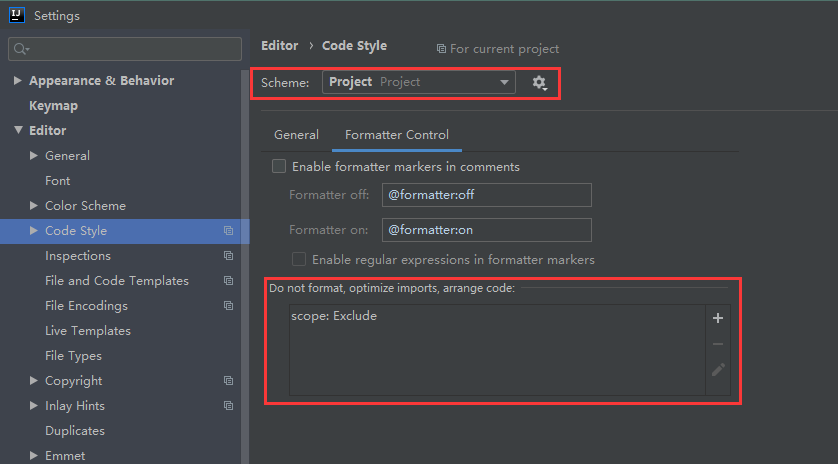

### 排除代码片段

需要在设置中启用格式化注释, 可以自定义格式化开关注释

然后在需要禁用格式化的代码片段前添加 `off`, 在代码片段后添加 `on`

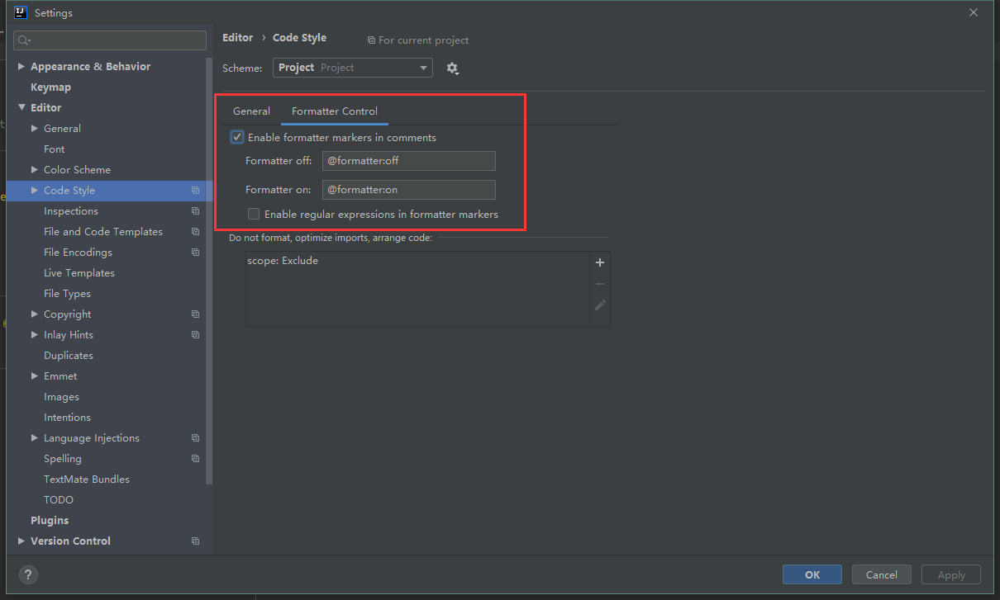

```java
// @formatter:off
     @RequestMapping("/sendMsgWithPath")
         public String  sendMsgWithPath(String msg,String author)      {...}
// @formatter:on
```

### 保留当前格式

有时候需要手动调整格式, 可以自定义需要保留哪些调整后的代码格式.

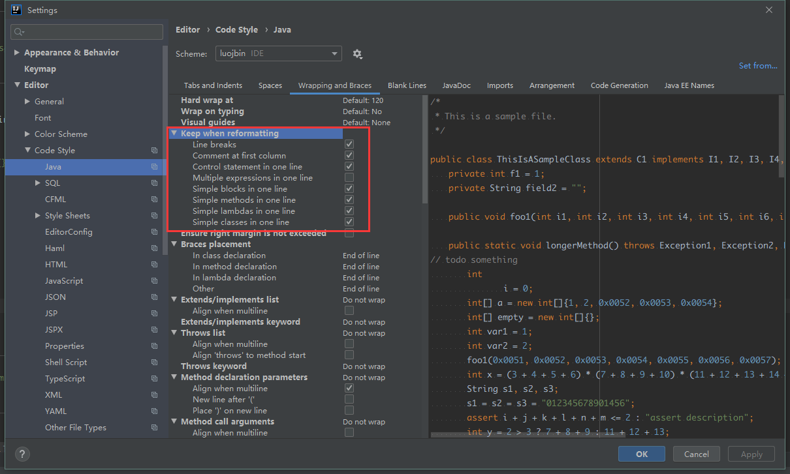

### 重排

可以指定java类中重排的规则, 将java 类中的域/构造器/方法等成员按照给定顺序排列. 

通过菜单 `Code | Rearrange Code` 进行重排. 

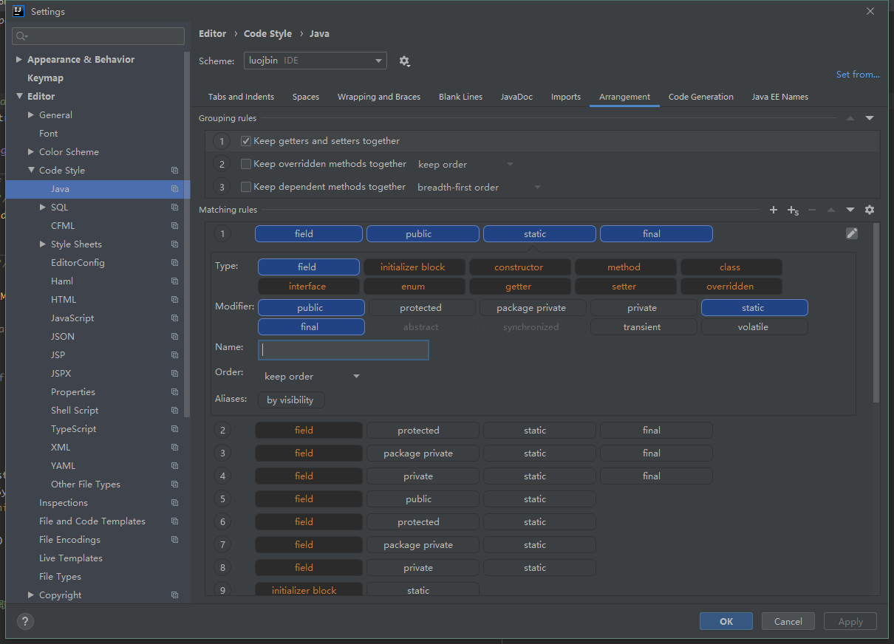

## 自动导入

### 导入的类型

默认单类型导入, 即类导入 `import 完整包名.类名`, 默认情况下, idea 自动以单类型导入的形式导入需要的包. 

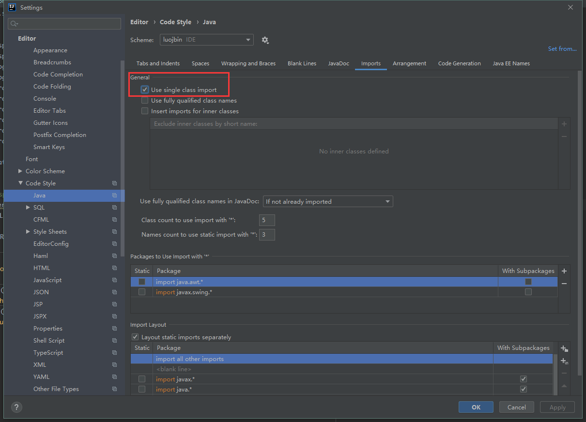

当导入同一个包内的多个类, 达到设定的阈值后, 会将多个类导入替换为包导入, `import 完整包名.*`, 称为按需类型导入. 按需导入不是导入包中所有类, 只会限制编译时查找要导入类的范围. 编译后, class文件中只有单类型导入.

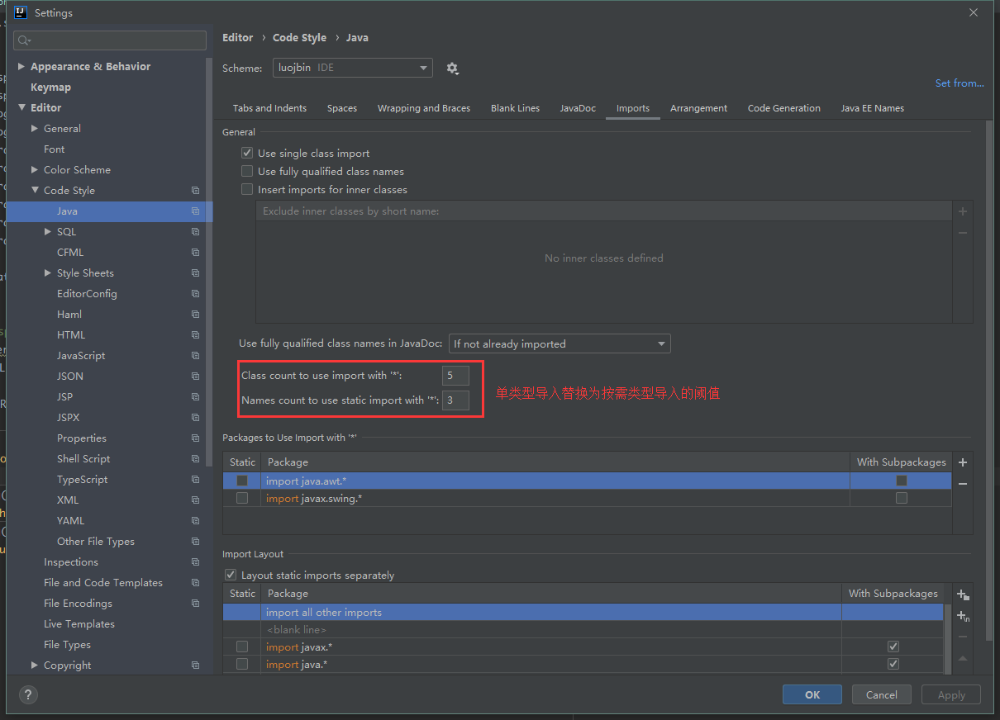

按需类型导入要在更多地方查找所需的类来编译class,因此**会减低编译速度, 但不会降低运行速度**.

如果想要禁用按需类型导入, 确保开启`Use single class import`, 并将替换为包导入的阈值调高.

如果想将单个文件改成单类型导入, 将光标放在包导入语句上, 按下`ALT+ENTER` 可以换回单类型导入

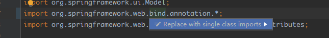

### 排除导入

idea 会根据输入的类名, 查找与之匹配的完整包名+类名, 如果某些类不常用, 可以将其排除, idea 就不会搜索相关的类,  以便消除歧义, 自动导入需要的类型.

排除设置可以是全局的, 也可以是当前项目的.

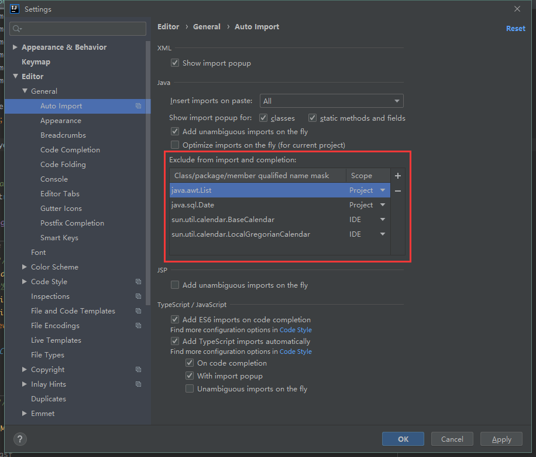

也可以在import提示框中, 在某个条目按下`方向键右→`, 选择要排除的包, 会自动弹出 `auto-import` 配置对话框

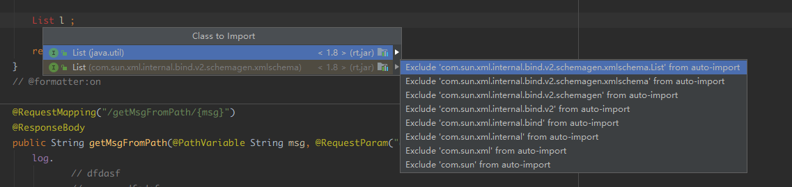

### 优化导入

idea 自动清理无用的 import, 快捷键 `ctrl+alt+o`. 可以为文件/包/目录/模块应用优化导入. 

若项目处于版本控制下, 选择目录/模块时, 会弹框提示是否只处理被修改的文件


- 自动优化, 输入的同时不断检测是否需要优化

  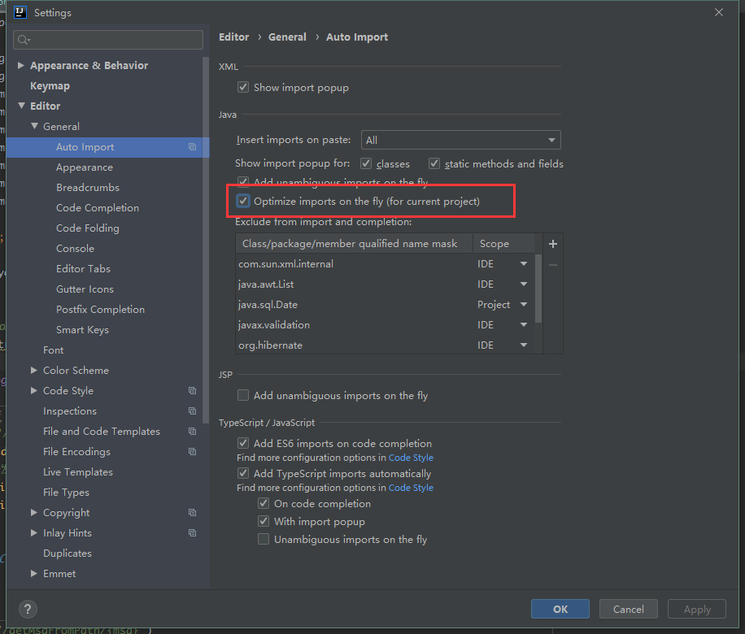

- 提交前进行优化

  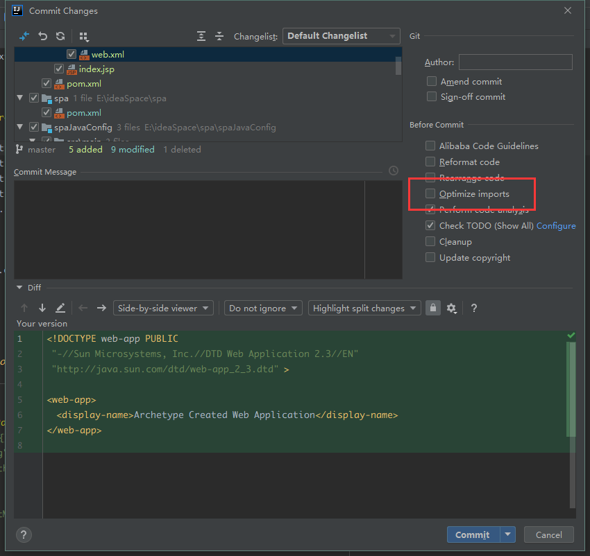

## 自定义折叠

在环绕功能中, 有两项特殊的环绕注释, 选中代码块并添加环绕注释后, 可以自定义折叠块, 从而实现代码分组.

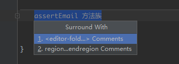

- `<editor-fold...>` NetBeans 风格
- `region...endregion`  VisualStudio 风格
- 两种注释的效果都一样, 但注意不能在同一个文件中混用, 若混用, idea只能折叠首先使用的一种风格. 

在`structure` 结构中, 也保留了折叠分组信息

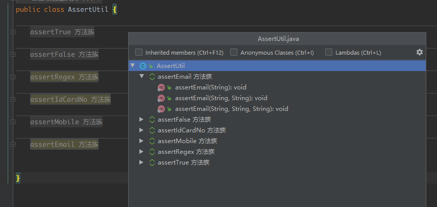

# 三. 项目管理与版本控制

## 管理SDK

idea 自带 JRE, 基于 openJDK 11. 自带的 jre 仅用于运行 idea 本身, 不提供编译器等其他工具. 开发项目时仍需要指定独立的 JDK. 

- 全局 JDK `File | Project Structure | Platform Settings | SDKs  `
- 项目 JDK `File | Project Structure | Project Settings | Project`
- 模块 JDK`File | Project Structure | Project Settings | Modules | Dependencies`

## 管理项目


## 管理模块

模块是所有项目必须的部分, 会根据项目自动创建, 可以增删项目, 分组, 排除不需要的项目

每个项目都包括一个内容根目录`content root`, 和一个模块文件`module file`

- 内容根目录是一个文件夹, 放置代码文件等
- 模块描述文件, 是`.iml` 文件, 记录项目配置等信息

### 多模块

项目中可以使用多个模块, 且每个模块都可以使用其特有的技术

- 创建新模块, 选择该模块需要的技术

- 导入已有模块, 可以将其他项目的模块, 导入至当前项目中. (通过相应的模块描述文件, `iml`, `pom` 等)

- 项目分组, 在 `Project Structure` 中, 选中多个模块, 在右键菜单中为模块设置前缀名即可

- 卸载模块, 可以在project 窗口中右键点击模块, 选择`unload` 卸载, 查找/重构等操作时会忽略该模块

  - 如果更新项目时引入了新模块, 且新模块依赖于被卸载模块, 则新模块也会被卸载, 以免带来编译错误

  - 如果新模块被已加载模块依赖, 则新模块会被加载

  - 如果新模块独立于其他模块, 则新模块会被卸载

  - 如果修改了被卸载模块的依赖, 则默认提交修改前会检查是否影响被卸载的模块

    即勾选 ` Compile affected unloaded modules`

- 查看 UML 模块依赖 图

  - 蓝色箭头: 类库依赖, 绿色箭头: 测试依赖, 红色箭头: 循环依赖
  - `ALT+滚轮`缩放, `CTRL+F`查找, `Ctrl+Alt+F7`查找引用点

- 查看 UML 包/类结构图

  - 

### 根目录

通常一个模块只有一个根目录, 但可以添加多个, 以便满足文件分散在不同位置的情况

- 添加根目录, `Project Settings | Modules | Sources | Add Content Root `

  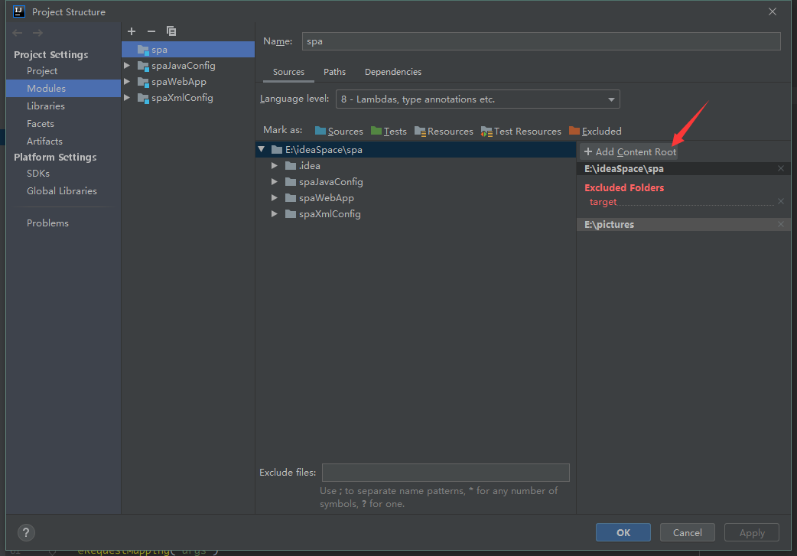

- 配置目录类型, 可以为不同的目录设置不同类型, 如 source/test/resources

- 排除文件, 可以通过文件/正则等方式排除文件和文件夹

- 默认将资源 (Resources) 复制到编译输出目录, 可以在右侧修改 resources/TestResources 的输出路径

### 依赖分析/排序

可以分析该依赖在什么地方被使用, 如果没有地方使用, idea 会建议将依赖移除, 但无法检测间接依赖, 应避免误删

可以调整依赖的顺序, 依赖顺序决定了编译器打包以及jvm查找类的顺序, 如果有需要可以手动调整顺序.

### 框架支持

idea 默认会自动检测项目使用到的技术/框架, 并给出相应的提示. 也可以手动为模块指定使用的技术/框架, 以便idea 提供支持

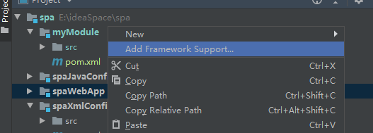

禁用框架检测, 可以完全关闭检测功能, 也可以排除某个特定的框架

### 管理依赖

可以使用 class, jar, 或是本地方法的 dll, so, jnilib 等依赖文件或目录.

- 全局依赖
- 项目依赖
- 模块依赖

## UML 建模

## 任务与上下文管理

### task

tool-task & context-open task, 可以进行task 和上下文的切换. 开启一个新任务时, idea 会关闭所有已经打开的页面, 恢复到初始视图, 并创建全新的 change list 和新的分支. 

完成开发工作后, 可以在 tool-task & context-close active task 关闭任务, 完成提交修改+合并分支+删除分支+修改任务状态等工作.

关闭任务并不会关闭上下文, 不会关闭任务相关的所有文件窗口, 需要手动切换任务.

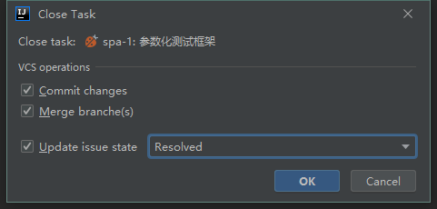

### 本地task

直接在 idea 中开启的任务就是本地任务

### 远程 task

如果关联了项目管理工具或代码托管平台, 如jira, github, gitlab, 码云等, 可以读取该平台上创建的项目任务, 并可以修改该任务的状态

### 默认任务

初始情况下, 用户没有启动任务, 此时idea 使用默认的 Default Task, 关联的 Change List 为 Default Change List.

如果有版本控制工具, 则在默认任务下提交commit时, 会以commit的信息作为任务名, 自动添加一个历史任务记录, 保留提交时的上下文状态. 以便日后切换回去. 

### 任务计时

可以在 preference 中启用任务计时, 可以统计不同任务的耗时, 以评估工作效率. 该功能默认关闭, 且不能统一设置, 只能在每一个需要的项目中手动开启. 

## 自定义 todo

自定义标签

标签过滤器

## 版本控制

合并到上一次commit: amend commit

提交重排 update project-rebase

### 解决冲突

弹框提示冲突的文件列表, 可以按照目录, 对冲突文件分组显示

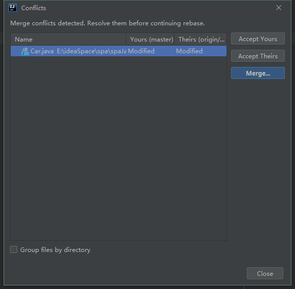

选择冲突文件列表中的一个文件, 双击打开边界窗口

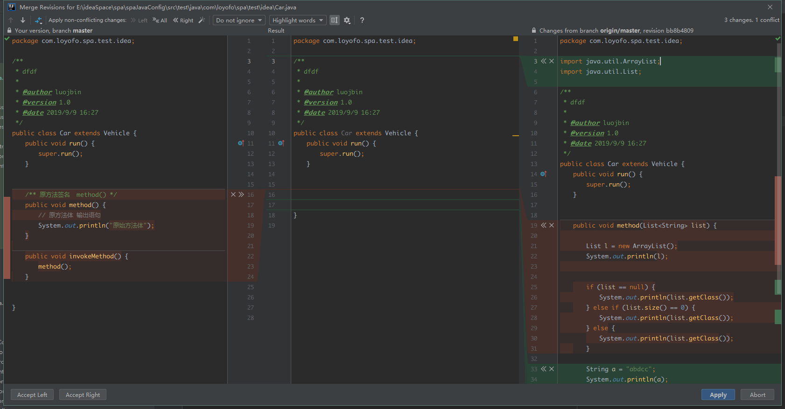

- 视图分三块, 左边我的修改, 中间最终版本, 右边远程修改
- 从左右两边, 选取需要的修改, 移到中间部分, 整理成最后要的版本, 确认即可

### 修改暂存 vcs-git-stash

### change list 按文件将修改分组

​	创建多个修改列表, 将修改的文件放到不同的修改列表中, 每次提交时只会操作一个change list中的文件

行号列+annotate, 显示该行的修改人和修改时间, 点击可查看该次提交修改的所有内容. 带星号的为最新一次修改

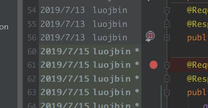


# 四. 运行/调试

## 运行配置

`Run/Debug Configurations`

直接点击main方法, 或junit 测试类前的绿色三角运行按钮, 会根据默认配置运行指定的内容, 并在运行历史中显示一条最近运行的记录. 

"Run/Debug" 下拉框中会显示两种内容, 

- 显式保存的运行配置, 点亮图标, 不限制数量, 但需要在运行对话框中点击保存按钮进行保存.

  如下图的 Tomcat Server 中的内容

- 最近运行的记录, 半透明图标, 默认只保留5个, 运行的内容超过5个时, 旧的运行记录会被丢弃

  如下图中的 junit 部分运行记录

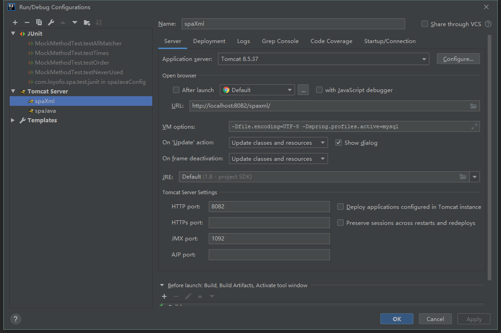

on update: debug时可用, 执行 update 操作时要应用的操作

on framedeactivation: debug 时可用, idea 失去焦点时应用的操作

before launch: 运行前要执行的操作

- 可以创建文件夹, 将多个相关的运行配置分组管理

## 模板管理

可以为不同类型的应用指定默认的运行配置, 这些配置会在后续新建运行配置时生效, 而不会影响已经存在的运行配置条目. 

## 混合配置

使用 `compound` 运行配置, 实际上是按照顺序运行指定的多个运行配置应用.

## services 工具窗口

services  允许在一个工具窗口中同时对多个应用进行操作,比如在微服务项目中, 需要同时启动或关闭多个应用. 

默认情况下, idea 将 spring boot 应用在 services 中进行管理, 如果有其他类型应用需要在 services 中管理, 可以在`templates` 节点下进行编辑

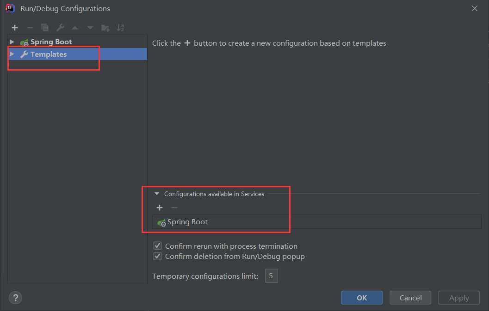

## Debug

### 断点

- 自定义断点设置, `CTRL+SHIFT+F8`, 双击打开对话框
- 域观察点, 访问实例域时挂起程序
- 不中断断点, 只计算指定的值, 不中断程序执行
- 一次性断点, 触发一次后自动移除
- 停用断点, 只留下记号, 不阻塞, 不进行任何操作

### 断点类型

- 行断点: 圆点, 到达该行就阻塞

  - 添加行断点, `CTRL+F8`, 一次性断点`CTRL+ALT+SHIFT+F8`

    对于 lambda 表达式, 可以指定为哪一部分添加断点

    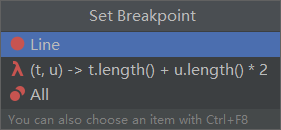

  - 移除断点, 可以设为为点击禁用, 拖走才移除断点, 避免不小心移除了添加了其他配置的断点

    还可以在移除条件断点和日志断点弹出确认对话框

- 方法断点: 菱形, 进入和结束方法时阻塞, 以便观察方法执行前后变量的情况

  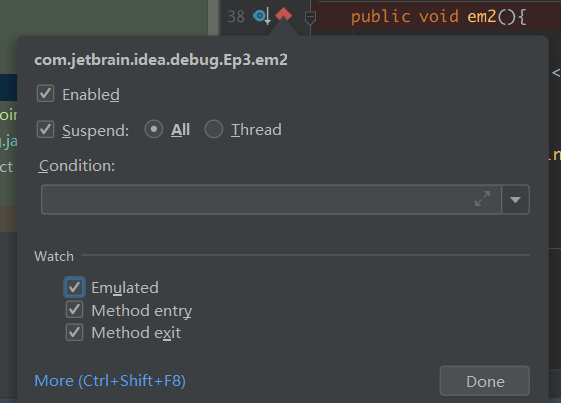

  - 默认为模拟断点, 为该方法的所有重写/实现的添加方法断点, 模拟断点不会影响性能.

    但模拟断点不支持本地方法, 也不支持没有行号信息的方法. 对于这类方法, 需要去除模拟选项

  - 添加方法断点, 在方法声明行添加断点

  - 移除断点, 可以设置拖动移除和确认移除.

- 异常断点, 全局的, 不关联某个具体的代码行, 当程序抛出指定异常及其子类时, 挂起程序

  - 添加断点, 在`CTRL+SHIFT+F8` 断点对话框中添加, 指定具体的异常类型
  - 移除断点, 在断点对话框中移除.

- 域观察点: 眼睛形状, 修改指定实例域时会阻塞程序

  - 添加断点, 在实例域上添加断点, 也可以在debug 工具窗口中, 为某个变量添加
  - 移除断点, 同上

- 断点属性

  - 命中断点时的要采取什么动作
  - 命中断点时的阻塞策略
  - 依赖其他缎带你
  - 触发断点的条件

- 其他特性

  - 右键快速编辑断点, 不需打开断点对话框`CTRL+SHIFT+F8`
  - 点击断点旁边的小灯泡, 意图推测
  - 为断点分组
  - 拖拽断点图标, 可以移动断点位置
  - 按着`CTRL` 拖拽复制断点
  - 按着`ALT`点击断点, 将其停用
  - 可以在断点对话框中为断点命名/添加描述, 以方便查找定位
  - 在断点和对话框中选中某个断点, 按`F4` 跳到所在位置.
  - 在 `favourites` 工具窗口中列出了所有断点, 双击跳转

### debug 会话

- 智能步入, 可选择进入该行代码的哪一个方法, `SHIFT+F7`
- 丢弃栈帧, 后退到上一层的状态
- 运行到光标位置, `ALT+F9`
- 标记对象 `F11` ????
- 计算表达式, 可以在某个断点处计算给定的表达式 `ALT+F8`
- 热部署, jvm 的 HotSwap 功能, 限制较多, 不支持静态域/静态方法

### 修改 debug 设置

### 远程 debug

### debug流程

- 启用要debug 的应用

- 暂停: 命中断点, 或手动暂停

- 恢复: `F9` 或点击继续按钮

- 当应用暂停时, 可以分析/测试当前的栈帧, 计算变量/对象等信息

  - 测试线程: 选择要查看的线程-查看线程的栈-查看栈帧中的变量, 可以复制栈的当前状态到剪贴板
  - 栈帧导航: 使用上下方向键, 或鼠标点击某个栈帧, idea 会显示对应的变量以及源代码
  - 导出: 导出当前应用所有线程的状态及栈轨迹, 可以复制到剪贴板或是保存为文本文件

- 栈帧分析, `variables` 面板展示该方法能访问的所有变量, 可以对其进行进一步分析

  - 计算表达式
    - 在编辑器的提示气泡中计算表达式, 鼠标指向变量, 或者选择一个表达式, idea 会显示计算结果
    - 快速计算表达式, `CTRL+ALT+F8` 快捷键冲突
    - 在独立对话框中计算表达式, `ALT+F8`, 对话框不是浮窗, 可以回到编辑器复制内容, 也可以多开
      - 对话框中可以调用方法, 只在程序因断点被阻塞时可用, 若整个程序暂停则不可用
      - 表达式计算是单层的, 如果调用的方法被其他断点挂起, 不能再次调用表达式计算器???
      - 表达式计算器中调用的方法内包含断点, 则该断点会被忽略, 即表达式计算器不会被阻塞
      - 若在其他地方设置了 debug_label, 则可以在表达式计算器内引用
      - 可以计算多行代码, 点击输入框旁的对角箭头打开多行输入模式`SHIFT+ENTER`
      - 查看表达式历史: 单行模式时`上/下`, 多行模式时`ALT+上/下`
      - 可以将单行表达式的计算结果添加到`watches`面板中 `CTRL+SHIFT+ENTER`
  - 添加/编辑/移除监控点: 可以同时显示多个表达式的结果, 并会持久化到项目里
    - 监控点默认与栈帧变量混在一起显示, 也可以在独立的`watches`面板显示
    - 新增监控点
      - 在 `watches` 面板中点击`+`, 输入表达式
      - 将`variables` 面板中的内容拖到 `watches` 面板
      - 编辑其中选中表达式, 右键菜单, `add to watches`
    - 编辑监控点, 右键菜单, `edit`
    - 删除监控点, 右键菜单, `remove`
  - 查看监控的元素, 选中某个变量/监控点, 右键菜单 `inspect`在弹出的对立窗口显示对象详情
  - 设置标签
    - 可以为变量/监控点添加label标签, 以便当成局部变量, 在计算表达式的时候进行引用
    - 选中一个监控点, 右键菜单`mark object` 或`F11`, 还可以为标签设置不同的颜色
    - 在带标签的监控点上, 右键菜单`unmark object` 或 `F11` 移除标签.
  - 从debug 工具窗口跳到源代码
    - 查看变量声明: 选择变量, 右键`jump to source` 或`F4`
    - 查看变量类型的声明: 选择变量, 右键 `jump to type source` 或`SHIFT+F4`
    - 查看对象? 

- 自定义视图, 可以自定义在 `variables` 面板中数据展示的形式

  - 自定义线程视图, 右键菜单`Customize Threads Views`, 选择需要的选项
  - 自定义数据视图, 右键菜单`Customize Data Views`, 选择需要的选项
  - 自定义类型渲染器
    - 渲染对象, 设定渲染器名称, 指定要使用的表达式, 并指定展开子节点的视图形式
    - 禁用渲染器, 去掉渲染器前面的勾即可. 停用的渲染器依旧可以通过`view as`临时使用
    - 切换类型渲染器, 通过 `view as` 切换当前要使用的渲染器

- 回到当前行(蓝色高亮行), 菜单或debug 工具上的`Show Execution Point`按钮, 或`ALT+F10`

- 逐步执行程序, 有以下方式进行

  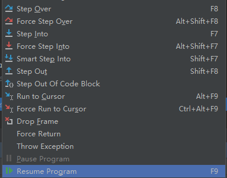

  - `Step Over/Force Step Over`

    执行当前行,  在下一行阻塞, force 忽略该行所调用方法的内部断点

  - `Step Into/ Force Step Into/ Smart Step Into`

    进入当前行的方法, 查看方法内部源代码, 默认不进入JDK等类库, 可以在设置中指定忽略的类库

    force 进入所有方法, 包括忽略的类库

    smart 若该行调用了多个方法, 可以选择要进入的方法, 不需挨个进入

  - `Step Out/Step Out Of Code Block`

    执行完当前方法并返回上一层/执行完当前代码块

  - `Run to Cursor/Force Run To Cursor`

    执行程序直到鼠标所在的行, force 表示忽略期间经过的所有断点

  - `Drop Frame`

    丢弃当前栈帧, 后退到该方法调用前的状态

  - `Force Return/Throw Exception`

    强制结束当前方法, 直接返回给定的值或抛出异常

  - `Pause/Resume`

    暂停/恢复程序运行

- 提高 debug 效率的可选配置

  - 避免使用方法/字段断点
  - 禁用 debug 工具窗口的`Watch method return values` (自动为每一行添加监控点)
  - 在设置中关闭集合类的可选视图(仅显示开发者关心的集合大小与内容, 忽略内部字段)
  - 在设置中关闭toString模式
  - 简化断点/监控点的触发条件
  - 使用过滤器
  - 使用显示更少内容的视图

- 监视debug信息

  - console 标签页显示debug信息和应用输出

  - 监视调试器的开销, 使用debug工具窗口的`OverHead` 面板

  - 分析 JVM 堆中的对象, 使用debug工具窗口的`Memory` 面板

    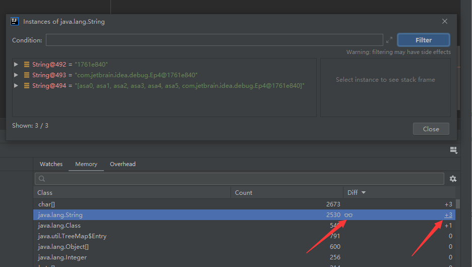

    - 出于性能考虑, 该面板需要手动刷新
    - 双击查看实例, 可以为某个类设置追踪, 会显示眼镜图标
    - 当追踪的类的实例列表发生变化, 可以点击 diff 栏查看受影响的对象

- 调试 Stream 操作

  - 在 stream 操作所在的行打断点
  - 执行到 stream 所在位置时, 点击debug工具窗口上的`Trace Current Stream Chain `按钮
  - 可以独立查看每个操作的映射情况, 也可以用`Flat Mode`将所有操作的结果整合展示

- 调试异步代码

- 行内显示变量的值, 默认开启, 变量改变时值会高亮, `Show Values Inline`

- 调试外部进程

- 


### 断点状态

- **激活断点**: 实心红色, 断点有效, 可以输出日志户执行指定计算, 阻塞程序
- **条件断点**: 实心红色带问号, 条件满足时断点有效, 可以输出日志或执行指定计算, 并阻塞流程
- **不中断断点**: 实心黄色, 断点有效, 可以输出日志或执行指定计算, 但不阻塞程序流程
- **停用断点**: 空心红色, 断点无效, 不进行任何操作, 不影响程序流程
- **一次性断点**, 实心红点, 与激活断点一致, 但触发一次后自动移除

通过黄色的不中断断点, 可以在不修改程序代码的前提下, 进行某些计算和日志打印, 对于类库或第三方应用时比较有用

### 条件断点

### 计算表达式

### 添加标签

将一个对象/变量添加到watch后, 在 watch 列表中按下 `F11`, 可以为这个变量设置label, 以便在其他地方使用这个值. 比如执行到其他断点的时候, 计算该对象/变量. 


### 自定义数据视图

在 debug 运行时, 通过 `find actions + customize data views` 方式打开

如果对默认数据的展示模式不满意, 可以定义自己的数据视图, 这对于一些没有提供合适的 tostring 方法的第三方依赖对象比较有用. 

### Drop frame

后退功能, 如果不小心错过了某个断点, 想要回去一点, 可以通过这个功能恢复到之前的状态.

被改变的外部对象和全局变量不会被恢复, 只有该帧的局部变量才会被重置. 这可能会带了一些奇怪的问题

该操作不会回到初始状态, 而是会按照方法调用栈的顺序逐渐返回上层

### 执行到某行

如果需要让程序执行到某个地方, 但不想添加断点, 可以使用"执行到某行"的功能, 可以通过以下方式

- 传统方式, 在该行添加断点, 然后恢复执行, 程序自动执行到新断点处暂停
- 鼠标点击目标行的行号
- 光标放在所在行, 通过调试面板上的`Run To Cursor ` 按钮跳转
- 光标放到所在行, 通过快捷键 `ALT+F9`

### 强制返回

在 debug 运行时, 通过 `find actions + force return` 方式打开

强制结束当前方法, 不在执行后续语句. 如果有返回值, 需要指定. 

### 增强热部署

jdk 默认的热部署, 只能修改方法体, 而对于修改方法签名/增删域等操作, 无法完成热部署. 

`Dynamic Code Evolution VM`, 是一个增强的虚拟机运行环境, 支持对方法/域修改的热部署. 

该特性依赖于 `DCEVM integration` 插件, 并需要下载指定的 jvm

### 更新应用

将应用部署到应用服务器, 如 tomcat 中时, 可以通过 update 操作, 更新应用.

# 五. 属性配置

## smart Key

CamelHumps: 光标选择单词时, 是否以驼峰进行分割, 默认关闭

如: goodApp`|`lePie, 光标放在apple中间, 启用CamelHumps时只选中 apple, 关闭时选中 goodApplePie

## 自定义文件类型

可以设置自定义文件类型, 并指定该类型文件的注释语法和高亮关键字

## 作用域

idea 允许自定义作用域, 作用域是项目文件/目录/包的一个 子集, 通过设置作用域, 可以在搜索/代码检查等操作时限制要处理的文件.

在 `Appearance & Behavior | Scopes` 中创建 scope, 本地作用域仅对当前用户有效, 相关配置存储在用户的 `workspace.xml` 中. 共享作用域则可以在团队中进行共享

- 选择需要该 scope 需要包含或排除的文件/目录, idea 会自动创建相应的表达式
- 手动编写作用域的表达式, 详见 [官方文档](https://www.jetbrains.com/help/idea/scope-language-syntax-reference.html)

可以为不同的作用域指定不同的颜色高亮, 这在大项目中更加有用, 在 `Appearance & Behavior | File Colors.` 中进行设置. 如果一个文件同时匹配多个作用域, 此时文件高亮为排在最前面的作用域的颜色

## 共享设置

很多时候, 需要在多个不同设备上共享 idea 的设置项, 有以下三种方式

- 通过 jetBrain 账户同步设置, 在同一用户的多台设备中共享
- 通过 git 仓库, 适合在团队中共享设置
- 通过导入/导出配置 zip 包

## 共享项目配置

多人合作中, 为了将项目级别的配置进行共享, 建议将项目配置也用 VCS 进行管理

idea 将所有配置文件都放置在 `.idea` 目录下, 包括了个人级别的配置和项目级别的配置. 

个人配置通常不建议进行共享, 而项目配置通常需要在团队中共享. 

- workspace.xml: 存放工作目录, 工作区信息, 
- tasks.xml: 存放用户的 task 信息

## 插件

关闭不需要的插件, 可以提高性能, 减少资源占用

如果项目依赖于某个插件, 可以在添加到 `required paugins` 列表中, 并可以指定版本

## 依赖矩阵

Analyze 菜单

## Maven/Gradle 离线

maven 默认在每次启动时会检查依赖, 如果需要, 可以将maven 设为离线工作, 只会从本地仓库中获取依赖.

点击图中的按钮, idea 会在所有maven 命令后加上 `--offline` 选项

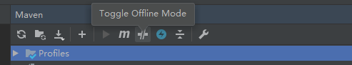

# 六. 快捷键

可以安装 `Key Promoter X` 插件, 在通过鼠标实现某项操作时, 给出对应的快捷键提示

- 添加文件/方法/域, ALT+SHIFT+F
- 添加当前打开所有文件, 右键tab-添加全部
- 添加目录到收藏夹, 在 project 中选择目录, 右键添加
- 添加外部文件, 将文件从资源管理器拖到 favourites 窗口

### 视图-窗口类

| 快捷键           | 概述              | 具体说明                                                    |
| ---------------- | ----------------- | ----------------------------------------------------------- |
| **Esc**          | 回到编辑器        | 焦点在 idea 其他工具窗口, 且有打开的文件时                  |
| F12              | 最近使用工具窗口  | 打开最近一次使用的工具窗口                                  |
| ALT+0            | message工具窗口   |                                                             |
| **ALT+1**        | project工具窗口   |                                                             |
| **ALT+2**        | favorite工具窗口  |                                                             |
| ALT+3            | Find工具窗口      |                                                             |
| ALT+4            | Run工具窗口       |                                                             |
| ALT+5            | Debug工具窗口     |                                                             |
| ALT+6            | Todo工具窗口      |                                                             |
| **ALT+7**        | Structure工具窗口 | 在工具窗口中显示当前文件的结构                              |
| **ALT+8**        | Services工具窗口  | 微服务项目可用                                              |
| **ALT+9**        | VCS工具窗口       |                                                             |
| CTRL+SHIFT+左右  | 调整工具窗扣大小  | 对两侧的工具窗口有效                                        |
| CTRL+SHIFT+上下  | 调整工具窗口大小  | 对底部的工具窗口有效                                        |
| **ALT+F1**       | Select In 浮窗    | 在浮窗中选择用什么工具/方式打开当前文件                     |
| **CTRL+F12**     | **文件结构浮窗**  | 在浮窗中显示当前文件的结构                                  |
| CTRL+ALT+F12     | 打开所在文件夹    | 打开文件所在目录, 浮窗中选择需要打开的位置                  |
| CTRL+SHIFT+F12   | 编辑器最大化      | 关闭所有工具窗口, 编辑器最大化                              |
| **ALT+右**       | 右侧创建分屏      | **自定义**, 在右边创建分屏, 标签页右移                      |
| **ALT+左**       | 取消分屏          | **自定义**, 取消分屏, 标签页合并到一组                      |
| **ALT+SHIFT+[**  | 垂直分屏          | **自定义,** 垂直切分, 在左右并排的两个窗口中都显示该文件    |
| **ALT+SHIFT+]**  | 水平分屏          | **自定义,** 水平切分, 在上下并排的两个窗口都显示该文件      |
| ~~ALT+左~~       | 激活左侧标签      | **停用**, 与系统操作不一致, 无法用鼠标手势                  |
| ~~ALT+右~~       | 激活右侧标签      | **停用**, 与系统操作不一致, 无法用鼠标手势                  |
| CTRL+TAB         | 激活右侧标签      | **自定义**, 与鼠标手势同步                                  |
| CTRL+SHIFT+TAB   | 激活左侧标签      | **自定义,** 与鼠标手势同步                                  |
| **CTRL+E**       | 最近的文件        | 双击时只显示被修改的文件                                    |
| CTRL+SHIFT+E     | 最近光标位置      | 显示代码片段, 双击时只显示被修改的                          |
| ALT+SHIFT+C      | 最近的修改        | 显示最近的修改, 如增删文件,拉取代码等. **跨项目**, 以便恢复 |
| **CTRL+D**       | 文件对比          | 比较两文件异同, 焦点在project窗口时可用. *在编辑器时为复制* |
|                  |                   |                                                             |
| F11              | 添加匿名书签      | 将某行代码加入书签, 该行显示√图标                           |
| CTRL+F11         | 添加标号书签      | 标号不可重复, 会被覆盖, 可选0-9, A-Z                        |
| SHIFT+F11        | 书签列表浮窗      | 浮窗显示当前项目的书签                                      |
| CTRL+数字        | 打开数字标号书签  | 如果书签标号为数字, 可以用该快捷键打开                      |
|                  |                   |                                                             |
| CTRL+SHIFT+S     | 快速切换浮窗      | 快速切换 快捷键/代码风格/高亮风格/视图模式 等               |
| CTRL+ALT+S       | 设置对话框        |                                                             |
| CTRL+ALT+SHIFT+S | 项目结构对话框    |                                                             |
| ALT+HOME         | 项目导航栏浮窗    | 项目结构导航栏, 可以跳转到其他文件                          |
| ALT+Q            | 当前上下文浮窗    | 显示光标所在类名或文件头, 当前视图看不见所属上下文时可用    |
|                  |                   |                                                             |
| CTRL+H           | 继承树工具窗口    | 显示当前类的继承树, 默认视图只显示class, 不显示 interface   |
| CTRL+ALT+U       | UML继承树浮窗     | 显示当前类的UML继承树, 显示 class 与 interface              |
| ALT+SHIFT+F      | 添加到收藏夹      | 添加当前文件/方法/域到收藏夹                                |
| SHIFT+ENTER      | 新窗口中打开文件  | 在project 中选中文件, 按键在新窗口打开文件                  |

### 查找-跳转类

| 快捷键            | 概述             | 具体说明                                                  |
| ----------------- | ---------------- | --------------------------------------------------------- |
| 双击 CTRL         | 运行一切         |                                                           |
| **双击 SHIFT**    | 查找一切         | `#`开头搜索设置                                           |
| CTRL+N            | 查找class        | 双击 shift 的一个标签页, 限制搜class                      |
| CTRL+SHIFT+N      | 查找file         | 双击 shift 的一个标签页, 限制搜文件/目录, 加`/`表示目录   |
| CTRL+ALT+SHIFT+N  | 查找symbol       | 双击 shift 的一个标签页, 限制搜方法/成员变量等            |
| CTRL+SHIFT+A      | 查找操作         | 查找idea提供的操作, 并显示相应的快捷键                    |
|                   |                  |                                                           |
|                   |                  |                                                           |
| **ALT+F7**        | 查找引用         | 在 find 工具窗口中显示结果                                |
| CTRL+ALT+SHIFT+F7 | 查找引用设置     | 修改"查找引用(ALT+F7)"的设置项                            |
| CTRL+ALT+F7       | 查看引用         | 在项目中查找类/方法的引用, 跳转/显示列表, 不如CTRL+B双向  |
| **CTRL+F7**       | 类内查找引用     | 在文件中查找变量/方法的引用, F3/SHIFT+F3继续查找          |
| **CTRL+SHIFT+F7** | 类内高亮引用     | 在文件中查找变量/方法的引用, 全部高亮                     |
| CTRL+F            | 查找文本         | 在文件中查找文本, F3/SHIFT+F3继续查找                     |
| **F3**            | 查找下一个       | 根据上次CTRL+F的关键词查找, 跨文件/关闭查找工具后仍有效   |
| **SHIFT+F3**      | 查找上一个       | 根据上次CTRL+F的关键词查找, 跨文件/关闭查找工具后仍有效   |
| CTRL+R            | 替换文本         |                                                           |
| CTRL+SHFT+F       | 全局查找文本     |                                                           |
| CTRL+SHIFT+R      | 全局替换文本     |                                                           |
| ALT+DOWN          | 查看搜索历史     | 焦点在搜索框时可用                                        |
|                   |                  |                                                           |
| **CTRL+G**        | 跳到某行         |                                                           |
| CTRL+SHIFT+T      | 跳到测试类       | 测试类和被测类之间跳转, 通过文件名进行关联                |
| F4                | 跳到声明         | 跳到源码声明处, 不如 CTRL+B 可双向                        |
|                   |                  |                                                           |
| **CTRL+B**        | 声明-调用跳转    | 声明和调用处跳转, 若多处调用, 浮窗显示调用列表            |
| CTRL+SHIFT+B      | 变量跳转到类型   | 直接从变量, 跳到变量所属类型. 不常用                      |
| CTRL+ALT+B        | 跳到子类         | 光标在类名, 跳到子类; 光标在方法, 跳到子类方法            |
| CTRL+U            | 跳到超类         | 光标在类名, 跳到超类; 光标在方法, 跳到超类方法            |
| CTRL+加减         | 逐渐折叠/展开    | 按一次折叠/展开一个级别                                   |
| CTRL+SHIFT+加减   | 全部折叠/展开    | 全部展开. 若光标落在某个折叠后的块中, 只会展开所在块      |
| CTRL+SHIFT+`.`    | 折叠代码块       | 折叠当前代码块                                            |
| CTRL+ALT+.        | 跳到自定义折叠块 |                                                           |
| CTRL+SHIFT+Y      | 翻译             | 插件提供                                                  |
|                   |                  |                                                           |
| **CTRL+P**        | 查看方法参数列   | 显示所有重载方法的参数列, 高亮当前使用的                  |
| **CTRL+Q**        | 查看 javadoc     |                                                           |
| CTRL+SHIFT+I      | 查看声明代码     |                                                           |
| **CTRL+SHIFT+P**  | 查看目标类型     | 显示目标类型, 如声明类型/方法返回值, 双击显示静态分析结果 |

### 任务管理

| 快捷键          | 概述           | 具体说明                             |
| --------------- | -------------- | ------------------------------------ |
| **ALT+SHIFT+N** | 开启任务       | 开启一个任务, 本地任务或远程任务     |
| ALT+SHIFT+T     | 切换任务       | 切换到一个已经打开的任务             |
| **ALT+SHIFT+W** | 关闭当前任务   | 关闭当前任务, 提交修改或修改任务状态 |
| ALT+SHIFT+S     | 保存上下文     | 在任务上下文之外, 自定义一个上下文   |
| ALT+SHIFT+L     | 载入上下文     | 载入一个任务上下文或自定义保存上下文 |
| ALT+SHIFT+X     | 清空当前上下文 | 关闭当前打开的所有文件, 恢复初始视图 |

### 重构工具

若需要撤销重构, 将焦点放到`Project` 工具窗口, 再按 `CTRL+Z` 撤销重构

| 快捷键               | 概述              | 具体说明                                         |
| -------------------- | ----------------- | ------------------------------------------------ |
| **CTRL+ALT+SHIFT+T** | 重构菜单弹框      | 在弹框中显示所有重构选项                         |
| F5                   | 复制类/方法/域    |                                                  |
| F6                   | 移动类/方法/域    |                                                  |
| **SHIFT+F6**         | 重命名            | 将类/方法/变量等重命名, 自动修改所有引用到的地方 |
| **CTRL+F6**          | 修改方法签名      | 修改方法签名, 编辑参数列等                       |
| CTRL+ALT+M           | 提取方法          |                                                  |
| CTRL+ALT+V           | 提取变量          |                                                  |
| CTRL+ALT+P           | 提取参数          |                                                  |
| CTRL+ALT+C           | 提取常量          |                                                  |
| CTRL+ALT+F           | 提取域            |                                                  |
| CTRL+ALT+N           | 内联方法/变量     | 将方法/变量内联化, 取消不必要的方法/变量声明     |
| CTRL+ALT+SHIFT+P     | 函数式方法参数    | 方法添加函数式接口参数, 选中内容通过该参数获取   |
|                      | 移动方法/域到超类 |                                                  |
|                      | 移动方法/域到子类 |                                                  |

### 运行/调试工具

| 快捷键             | 概述                 | 详细说明                                           |
| ------------------ | -------------------- | -------------------------------------------------- |
| CTRL+F9            | 编译项目             |                                                    |
| CTRL+F10           | 编译运行中项目       | 使用 update 操作, 重新编译运行中的项目             |
| CTRL+SHIFT+F9      | 编译当前文件         |                                                    |
| CTRL+SHIFT+F10     | 正常运行             | 运行鼠标所在区域的内容, 并添加到Run/Debug记录      |
| SHIFT+F10          | 正常运行上次内容     | 运行 Run/Debug 中当前选中的内容                    |
| SHIFT+ALT+F10      | RUN浮窗菜单          | 显示菜单, 从中选择需要的 run/debug 操作            |
|                    |                      |                                                    |
| ALT+F10            | 回到当前行           | 查看其它代码时, 一键回到当前阻塞位置               |
| SHIFT+F9           | Debug上次内容        | debug Run/Debug 中当前选中的内容                   |
| **F8**             | 步进                 | 执行一行. 若该行方法内有断点, 在内部断点阻塞       |
| ALT+SHIFT+F8       | 强制步进             | 执行一行. 忽略该行方法的内部断点                   |
|                    |                      |                                                    |
| **F7**             | 步入, 进入方法       | 按调用顺序进入方法. 不进入忽略代码                 |
| SHIFT+F7           | 智能步入, 进入方法   | 可以选择该行要进入的方法, 可以跳过不需要的调用     |
| ALT+SHIFT+F7       | 强制步入             | 可以进入所有方法, 包括忽略的类库                   |
| CTRL+F8            | 添加/移除断点        |                                                    |
| CTRL+SHIFT+F8      | 编辑断点             | 编辑断点状态, 条件等, 双击打开全部断点的编辑对话框 |
| SHIFT+F8           | 步出, 跳到方法调用点 |                                                    |
| **F9**             | 运行至下一断点       |                                                    |
| ALT+F9             | 运行至光标所在位置   | 若途径代码有断点, 则在图中断点阻塞                 |
| CTRL+ALT+F9        | 强制运行到光标位置   | 忽略中间经过的所有断点, 直到光标位置阻塞           |
| ALT+F8             | 计算表达式           | 弹框, 输入要计算的表达式, 计算其结果               |
| CTRL+ALT+F8        | 手动计算表达式       | 选中表达式, 计算其结果, 与显示器切换冲突           |
| 鼠标点击           | 添加/移除断点        | 红色实心圆点/红色实心菱形                          |
| ALT+鼠标点击       | 启用/禁用断点        | 红色空心圆点, 禁用断点, 但不移除                   |
| SHIFT+鼠标点击     | 添加不中断断点       | 黄色实心圆点, 添加断点, 但不阻塞                   |
| ALT+SHIFT+鼠标点击 | 添加一次性断点       | 红色实心圆点, 触发一次后自动移除                   |

### 光标移动与选择

| 快捷键                  | 概述               | 具体说明                                                 |
| ----------------------- | ------------------ | -------------------------------------------------------- |
| 左右                    | 左右移动光标(字符) | 通用                                                     |
| SHIFT+左右              | 左右扩展选区(字符) | 通用但不常用                                             |
| **CTRL+左右**           | 左右移动光标(语素) | 作用不大, 直接左右就够了                                 |
| CTRL+SHIFT+左右         | 左右扩展选区(语素) |                                                          |
| CTRL+`[`/`]`            | 左右移动光标(块)   | 移动光标至当前块的开头/结尾                              |
| CTRL+SHIFT+`[`/`]`      | 左右扩展选区(块)   | 选中当前块光标之前/之后的所有内容                        |
| CTRL+SHIFT+M            | 移动至代码块头尾   | 让光标在代码块的`{`和`}` 之间跳转; 光标在块内, 先跳到`{` |
| **CTRL+ALT+SHIFT+左右** | 左右移动元素       | 多元素并列时(多参数/运算表达式), 左右移动某个元素        |
| ALT+上下                | 上下移动光标(方法) | 在当前文件中, 移动光标到相邻的方法                       |
| CTRL+ALT+SHIFT+上下     | 上下移动光标(修改) | 在当前文件中, 修改光标到相邻的修改处                     |
| CTRL+SHIFT+退格         | 移动至上次修改     |                                                          |
| **ALT+SHIFT+上下**      | 上下移动代码行     |                                                          |
| **CTRL+SHIFT+上下**     | 上下移动代码块     |                                                          |
| **ALT+J**               | 增加选区(相同语素) | 每按一次就增加选中下一个相同语素, 到末尾后从头开始       |
| ALT+SHIFT+J             | 减少选区(相同语素) | 每按一次就取消选中最后一个相同语素, 到末尾后从头开始     |
| **CTRL+ALT+SHIFT+J**    | 全选当前语素       | 选中文件中所有相同语素                                   |
| ~~CTRL+W~~              | 扩展当前选择       | 按照字符-语素-语句-代码块-文件逐渐扩大选区, 停用         |
| CTRL+SHIFT+W            | 缩小当前选择       | 按照字符-语素-语句-代码块-文件逐渐缩小选区               |
| **F2**                  | 跳到下一个错误     |                                                          |
| SHIFT+F2                | 跳到上一个错误     |                                                          |
| **CTRL+F1**             | 查看错误描述       |                                                          |
| **ALT+ENTER**           | 查看纠错方案       |                                                          |
| ALT+SHIFT+ENTER         | 应用推荐纠错方案   |                                                          |
| CTRL+M                  | 令光标居中         | 滚动页面, 使光标所在行位于屏幕中间, 光标在头尾时无效     |
| 选中并拖动              | 移动代码块         | 移动选中的代码块到指定位置                               |
| CTRL+选中并拖动         | 复制代码块         | 复制选中的代码块到指定位置                               |

### 快捷编辑

| 快捷键                | 概述               | 具体说明                                                     |
| --------------------- | ------------------ | ------------------------------------------------------------ |
| **ALT+INSERT**        | 快速插入           | 构造器/get/set/hashcode/equals等方法                         |
| ALT+INSERT            | 快速新建           | project窗口中, 在选中位置新建文件                            |
| CTRL+ALT+INSERT       | 快速新建           | 在当前文件所在目录新建文件                                   |
| CTRL+ALT+SHIFT+INSERT | 快速草稿           | 新建草稿文件                                                 |
| CTRL+SHIFT+I          | 自动缩进           | 调整当前行的缩进, 不会影响整个文件                           |
| **CTRL+SHIFT+J**      | 合并行             | 将多行整合成一行, 省略不必要的换行                           |
| **CTRL+SHIFT+L**      | 代码格式化         |                                                              |
| **CTRL+SHIFT+O**      | import 格式化      |                                                              |
| CTRL+O                | override 重写方法  |                                                              |
| CTRL+I                | implement 实现方法 |                                                              |
| **CTRL+SHIFT+X**      | 命名风格转换       | **自定义**, 驼峰转下划线, 单个单词时为大小写, 插件提供       |
| CTRL+SHIFT+U          | 大小写转换         | idea 提供, 不够智能                                          |
| CTRL+D                | 复制整行           | **自定义**, 始终复制整行, 默认无选中时整行, 选中只有选区内容 |
| CTRL+X                | 剪切整行           | **增强**, 剪切选中内容, 无选中则是光标所在行                 |
| CTRL+C                | 复制选中           | 通用                                                         |
| CTRL+V                | 粘贴最近内容       | 通用, 会进行格式化, 注释块内会加 `*`                         |
| **CTRL+SHIFT+V**      | 剪贴板记录         | 显示在 idea 中操作的所有剪贴板记录, 选则需要粘贴的内容       |
| CTRL+ALT+SHIFT+C      | 复制引用           | 复制引用路径                                                 |
| CTRL+ALT+SHIFT+V      | 粘贴纯文本         | 只粘贴原文, 不进行格式化                                     |
| **CTRL+ALT+T**        | 环绕块             | 环绕选中区域, 在前后插入代码形成代码块                       |
| **CTRL+`**            | 后退               | **自定义**, 原为ctrl+alt+左箭头                              |
| CTRL+ALT+左右         | 前进/后退          |                                                              |
| CTRL+SHIFT+DELETE     | 删除环绕快         | 删除for/if 等块结构, 只保留内部语句                          |
| ALT+SHIFT+左右        | diff时采纳左右     | 没用                                                         |
| 退格                  | 删除一个字符       |                                                              |
| CTRL+退格             | 删除至单词开头     | 光标在中间, 删除该词前半部分; 光标在开头, 删除前一个词       |
| ALT+SHIFT+INSERT      | 列选模式           | 多列编辑模式的开关                                           |

### 自动完成

| 快捷键               | 概述               | 具体说明                                              |
| -------------------- | ------------------ | ----------------------------------------------------- |
| **CTRL+J**           | LiveTemplate提示   | 显示可用的 live template                              |
| ALT+/                | 代码提示(基础)     | 自定义, Eclipse 风格, 解决CTRL+空格与输入法冲突的问题 |
| ~~CTRL+空格~~        | 代码提示(基础)     | 与输入法快捷键冲突                                    |
| CTRL+SHIFT+空格      | 代码提示(类型)     | 只显示类型匹配的代码提示                              |
| **CTRL+SHIFT+ENTER** | 完成当前语句       | 补全当前行缺少的引号/括号/分号等, 并完成格式化        |
| ALT+SHIFT+/          | 嬉皮士补全         | 在当前文件中查找相同语素                              |
| ENTER                | 换行               | 打断当前行, 光标及后面内容都到下一行                  |
| SHIFT+ENTER          | 换行               | 光标移到下一行, 不影响前一行的内容                    |
| CTRL+ALT+ENTER       | 上方插入行         | 上方插入行, 光标落在新行                              |
| **ENTER**            | 应用代码提示       | 将选中的代码提示**插入**到光标所在位置                |
| **TAB**              | 应用代码提示       | 将选中的代码提示**替换光标所在语素**                  |
|                      |                    |                                                       |
| ~~CTRL+.~~           | 应用代码提示并加点 | 应用代码提示, 并增加.以便连续调用, 与输入法冲突       |

### 版本控制

| 快捷键           | 概述         | 具体说明    |
| ---------------- | ------------ | ----------- |
| ALT+`            | VCS操作浮窗  |             |
| CTRL+SHIFT+`     | 分支选择浮窗 |             |
| **CTRL+T**       | 拉取更新代码 | pull/update |
| **CTRL+K**       | 提交代码     | commit      |
| **CTRL+SHIFT+K** | 推送到远程库 | push        |

# 七. 扩展插件

| 插件名称                           | 说明                        |
| ---------------------------------- | --------------------------- |
| Adapter for Eclipse Code Formatter |                             |
| Alibaba Java Coding Guidelines     | 代码规范检查                |
| CheckStyle-IDEA                    | 代码格式检查                |
| GenerateAllSetter                  | 一键调用所有setter          |
| Grep Console                       | 控制台增强, 颜色高亮/过滤   |
| GsonFormatPlus                     | json 转 pojo                |
| Guice                              |                             |
| JBoss jBPM                         |                             |
| Maven Helper                       | Maven 增强, 依赖树分析      |
| MybatisCodeHelperPro               | MyBatis 支持                |
| Paste Images Into Markdown         | markdown 增强               |
| String Manipulatin                 | 字符串格式转换(驼峰/帕斯卡) |
| Translation                        | 翻译插件                    |
| Vue.js                             | 前端 vue 框架支持           |

