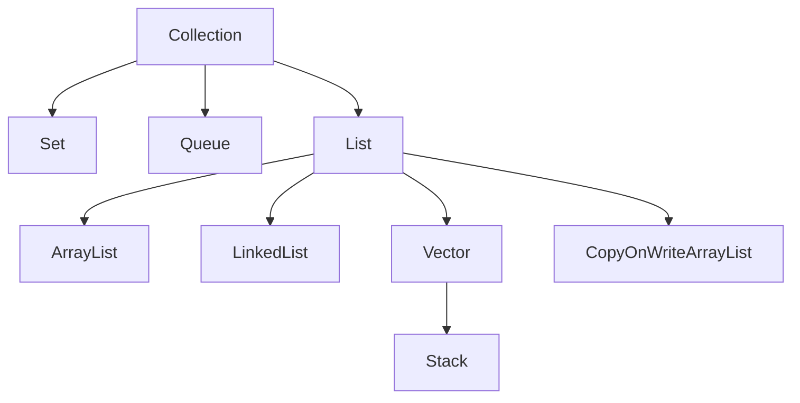

# List接口

* List
  * ArrayList 基于数组实现的动态数组
  * LinkedList 基于链表实现的双向链表
  * Vector 线程安全的动态数组
    * Stack 是一个后进先出（LIFO）的堆栈
  * CopyOnWriteArrayList 并发安全的列表，它适用于读多写少的场景

# List图示

# List总结

在Java中，List是一种有序的集合（Collection）类型，它允许存储重复元素。Java提供了多种List的实现类，每个实现类都有不同的特性和适用场景。以下是Java中常见的List实现类及其使用场景：

1. ArrayList：ArrayList是基于数组实现的动态数组，它支持快速随机访问元素。ArrayList适用于需要频繁访问和遍历元素的场景，但对于频繁插入和删除操作效率较低。它的存储和随机访问操作的时间复杂度为常数级别（O(1)），而插入和删除操作的时间复杂度为线性级别（O(n)）。

2. LinkedList：LinkedList是基于链表实现的双向链表，它支持快速的插入和删除操作。LinkedList适用于需要频繁插入和删除元素的场景，但对于随机访问的效率较低。它的插入和删除操作的时间复杂度为常数级别（O(1)），而随机访问操作的时间复杂度为线性级别（O(n)）。

3. Vector：Vector是一个线程安全的动态数组，类似于ArrayList。Vector适用于多线程环境下需要线程安全的场景。然而，由于同步的开销，Vector的性能相对较低。在单线程环境下，推荐使用ArrayList代替Vector。

4. Stack：Stack是一个后进先出（LIFO）的堆栈，它继承自Vector类。Stack适用于需要实现后进先出逻辑的场景，例如算术表达式求值、深度优先搜索等。

5. CopyOnWriteArrayList：CopyOnWriteArrayList是一个并发安全的列表，它适用于读多写少的场景。每次写操作（添加、删除等）都会创建一个底层数组的副本，因此读操作不会被阻塞。CopyOnWriteArrayList的读操作性能较高，但写操作的性能较低。

以上是Java中常见的List实现类及其使用场景。根据具体需求，选择合适的List实现类可以提高代码的效率和可靠性。同时，List接口还提供了丰富的方法用于元素的添加、删除、查找和遍历等操作。
