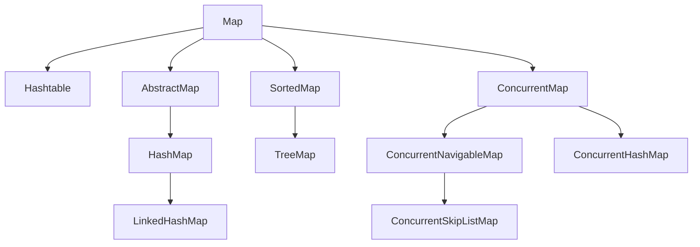

# Map接口

* Map
  * Hashtable Hashtable是一个线程安全的哈希表
  * HashMap 基于哈希表实现的无序Map
  * TreeMap 基于红黑树（自平衡二叉搜索树）实现，它按照键的自然顺序或自定义比较器进行排序
  * LinkedHashMap 使用双向链表维护了元素的插入顺序
  * ConcurrentHashMap 高效且线程安全的哈希表，用于多线程环境下的并发操作
  * ConcurrentSkipListMap 有序并发映射表（Map）。它基于跳表（Skip List）的数据结构实现，并提供了高效的并发性能。

# 集合图示

# Map总结

在Java中，Map是一种键值对（Key-Value）的数据结构，用于存储和操作具有唯一键和对应值的元素。Java提供了多种Map的实现类，每个实现类都有不同的特性和适用场景。以下是Java中常见的Map实现类及其使用场景：

1. HashMap：HashMap是基于哈希表实现的无序Map。它根据键的哈希值进行存储和查找，具有快速的插入、删除和查找操作。HashMap适用于大多数情况下的键值对存储和查询，但不保证元素的顺序。
2. LinkedHashMap：LinkedHashMap在HashMap的基础上使用双向链表维护了元素的插入顺序。它保留了元素插入的顺序，因此可以按照插入顺序或访问顺序进行遍历。LinkedHashMap适用于需要保留元素插入顺序或访问顺序的场景。
3. TreeMap：TreeMap基于红黑树（自平衡二叉搜索树）实现，它按照键的自然顺序或自定义比较器进行排序。TreeMap适用于需要按照键的排序顺序进行存储和查找的场景。它具有较高的查找效率，但插入和删除操作的性能较HashMap较低。
4. Hashtable：Hashtable是一个线程安全的哈希表，类似于HashMap。Hashtable适用于多线程环境下需要线程安全的场景。然而，由于同步的开销，Hashtable的性能相对较低。在单线程环境下，推荐使用HashMap代替Hashtable。
5. ConcurrentHashMap：ConcurrentHashMap是一个高效且线程安全的哈希表，用于多线程环境下的并发操作。它通过分割数据结构来提高并发性能，允许多个线程同时进行读操作，而写操作仅涉及到特定的段。ConcurrentHashMap适用于高并发的读写场景。
6. ConcurrentSkipListMap: 是Java中的一种实现了ConcurrentMap接口的有序并发映射表（Map）。它基于跳表（Skip List）的数据结构实现，并提供了高效的并发性能。
以上是Java中常见的Map实现类及其使用场景。根据具体需求，选择合适的Map实现类可以提高代码的效率和可靠性。同时，Map接口还提供了丰富的方法用于键值对的添加、删除、查找和遍历等操作。
