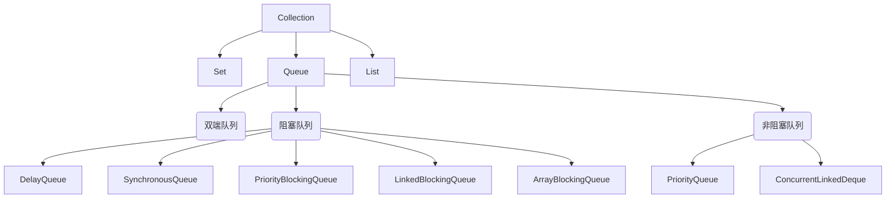

# Queue接口

* Queue
  * AbstractQueue、
    * LinkedList 一般队列
    * PriorityQueue 可排序的优先级队列，二叉堆
      * PriorityBlockingQueue 优先级的无界阻塞队列
    * ConcurrentLinkedQueue 基于链表的并发队列，线程安全
    * DelayQueue 延时队列
    * Deque 支持队列和线
      * ArrayDeque 实现了Deque，支持队列和线
      * LinkedBlockingDeque 基于链表的双向阻塞队列
      * ConcurrentLinkedDeque 基于链表的并发双端队列，它提供了线程安全的操作
    * BlockingQueue 有界阻塞队列
      * ArrayBlockingQueue 基于数组的有界阻塞队列
      * LinkedBlockingQueue 基于链表的可选有界阻塞队列
      * SynchronousQueue 没有缓冲区的阻塞队列
    * TransferQueue 链表的无界阻塞队列
      * LinkedTransferQueue 链表的无界阻塞队列

# 集合图示

# 阻塞队列

阻塞队列（Blocking Queue）是一种特殊类型的队列，在特定条件下会导致插入或删除操作阻塞（暂停）线程，直到满足特定条件为止。

阻塞队列在以下情况下会发生阻塞：

1. 当队列已满时，插入操作会阻塞，直到有空间可用。
2. 当队列为空时，删除操作会阻塞，直到有元素可用。

阻塞队列的主要目的是提供线程间的同步和协作。它可以用于解决生产者-消费者问题，其中生产者线程将数据放入队列，而消费者线程从队列中取出数据进行处理。阻塞队列的阻塞特性使得生产者和消费者能够进行有效的线程间通信，而无需手动实现线程同步和等待机制。

阻塞队列在Java中的实现通常通过内部的锁和条件变量来实现线程的阻塞和唤醒操作。常见的阻塞队列实现包括LinkedBlockingQueue、ArrayBlockingQueue和SynchronousQueue等。

使用阻塞队列可以简化多线程编程，并提供一种安全、高效的方式来实现线程间的数据共享和通信。

# 队列总结

在Java中，有几种不同的队列（Queue）实现，每种队列都具有不同的特性和适用场景。以下是几种常见的队列类型及其使用场景：

1. LinkedList：LinkedList类实现了Queue接口，可用作队列的实现。它提供了基本的队列操作，如入队（offer或add）和出队（poll或remove）。LinkedList适用于一般的队列场景，其中元素的顺序是按照添加顺序进行处理。
2. PriorityQueue：PriorityQueue类实现了Queue接口，它是一个优先级队列。它根据元素的优先级进行排序，具有较高优先级的元素在队列中排在前面。PriorityQueue适用于需要按优先级处理元素的场景，例如任务调度、事件处理等。
3. ArrayDeque：ArrayDeque类实现了Deque接口，既可以作为队列使用，也可以作为栈使用。它提供了在队列两端进行添加和删除元素的操作。ArrayDeque适用于需要同时支持队列和栈操作的场景，例如广度优先搜索（BFS）算法。
4. ConcurrentLinkedQueue：ConcurrentLinkedQueue类实现了Queue接口，它是一个基于链表的并发队列。它支持高并发环境下的线程安全操作，适用于多线程环境下的队列场景。
5. ArrayBlockingQueue：ArrayBlockingQueue类实现了BlockingQueue接口，它是一个基于数组的有界阻塞队列。它具有固定的容量，并且在队列已满或为空时会阻塞线程。ArrayBlockingQueue适用于需要限制队列容量并进行线程间同步的场景。
6. DelayQueue：DelayQueue是一个实现了Delayed接口的无界阻塞队列。其中的元素只有在指定的延迟时间过去后才能被取出。DelayQueue适用于需要延迟处理元素的场景，例如定时任务调度。
7. LinkedBlockingDeque：LinkedBlockingDeque是一个基于链表的双向阻塞队列，可以同时在队列的头部和尾部进行插入和删除操作。LinkedBlockingDeque适用于需要在两端进行高效插入和删除操作的场景，例如生产者-消费者模型。
8. LinkedTransferQueue：LinkedTransferQueue是一个基于链表的无界阻塞队列。它支持生产者和消费者之间的直接传输元素，可以在没有消费者等待的情况下将元素直接传递给消费者。LinkedTransferQueue适用于需要高效传输元素的场景，例如消息传递系统。
9. PriorityBlockingQueue：PriorityBlockingQueue是一个基于优先级的无界阻塞队列。它使用元素的自然顺序或自定义比较器来确定元素的优先级。PriorityBlockingQueue适用于需要根据优先级处理元素的场景，例如任务调度系统。
10. SynchronousQueue：SynchronousQueue是一个没有缓冲区的阻塞队列，它只允许在一个线程等待另一个线程的元素传输。当一个元素被添加到SynchronousQueue时，必须有另一个线程正在等待接收该元素；反之亦然。SynchronousQueue适用于需要严格的线程间同步的场景，例如生产者和消费者直接交互的场景。
11. ConcurrentLinkedDeque：ConcurrentLinkedDeque是一个基于链表的并发双端队列，它提供了线程安全的操作。ConcurrentLinkedDeque适用于多线程环境下需要高并发访问的双端队列场景。
12. LinkedBlockingQueue：LinkedBlockingQueue是一个基于链表的可选有界阻塞队列，可以指定队列的容量。它支持多线程并发操作，并提供阻塞功能，可以在队列为空或满时阻塞线程。LinkedBlockingQueue适用于需要限制队列容量并进行线程间同步的场景。
13. TransferQueue：TransferQueue是一个接口，它扩展了BlockingQueue接口。它提供了更高级别的操作，允许元素在生产者和消费者之间直接传递，而不仅仅是插入和删除。TransferQueue适用于需要更为灵活的生产者-消费者场景，支持直接传递元素。

这些队列类型提供了不同的特性和适用场景，可以根据具体的需求选择合适的队列类型。请注意，在Java中还有其他实现了Queue接口或其子接口的队列类，可以根据具体情况进行进一步的探索和选择。
