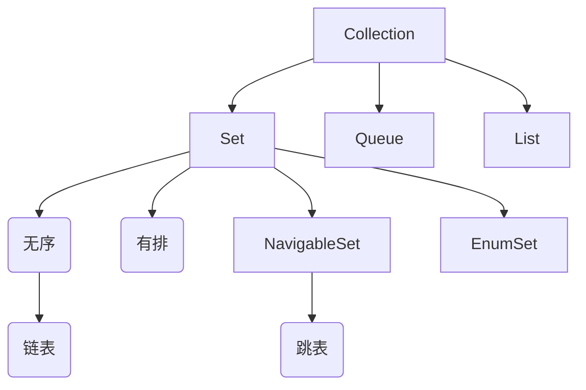

# Set接口

* Set
  * HashSet HashSet基于哈希表实现,无序
    * LinkHashSet 使用链表维护了元素的插入顺序
  * EnumSet 基于位向量实现，效率高且占用内存少
  * NavigableSet
    * ConcurrentSkipListSet 多线程下的有序集合
    * TreeSet 基于红黑树（自平衡二叉搜索树）实现有序集合，线程不安全

# 集合图示

# Set总结

在Java中，Set是一种集合（Collection）类型，它表示一组不重复的元素。Java提供了多种Set的实现类，每个实现类都有不同的特性和适用场景。以下是Java中常见的Set实现类及其使用场景：

1. HashSet：HashSet基于哈希表实现，它不保证元素的顺序，且不允许包含重复元素。HashSet适用于需要快速查找和删除元素，而不关心顺序的场景。它的存储和查询操作的时间复杂度为常数级别（O(1)）。

2. LinkedHashSet：LinkedHashSet在HashSet的基础上使用链表维护了元素的插入顺序。它保留了元素插入的顺序，并且不允许包含重复元素。LinkedHashSet适用于需要保留元素插入顺序的场景。

3. TreeSet：TreeSet基于红黑树（自平衡二叉搜索树）实现，它按照元素的自然顺序或自定义比较器进行排序。TreeSet不允许包含重复元素。TreeSet适用于需要有序集合和快速查找、插入和删除元素的场景。

4. EnumSet：EnumSet是专门用于枚举类型的集合实现。它基于位向量实现，效率高且占用内存少。EnumSet适用于存储和操作枚举类型的元素集合。

5. ConcurrentSkipListSet：它基于跳表（Skip List）的数据结构实现，并提供了高效的并发性能。
以上是Java中常见的Set实现类及其使用场景。根据具体需求，选择合适的Set实现类可以提高代码的效率和可读性。同时还可以结合Set接口提供的各种方法，进行元素的添加、删除、查找等操作。
