常用的限流方式和场景有：

* 限制总并发数（比如数据库连接池、线程池）
* 限制瞬时并发数（如nginx的limitconn模块，用来限制瞬时并发连接数，Java的Semaphore也可以实现）
* 限制时间窗口内的平均速率（如Guava的RateLimiter、nginx的limitreq模块，限制每秒的平均速率）
* 其他：比如如限制远程接口调用速率、限制MQ的消费速率。另外还可以根据网络连接数、网络流量、CPU或内存负载等来限流。

我们常说的限流，其实更多的都是指时间窗口内的平均速率，所以往往这种限流方式成了限流的代名词了。这里主要说明的也是这种时间窗口内的平均速率的限制，guava的RateLimiter解决的也是这个场景的限流。

# 限流算法

## 固定窗口计数法

这个最简单也最好理解的一个窗口平均速率限流算法，当然实际生产证也没人使用的一个算法。它是将时间划分成一个一个固定的时间段，然后时间段中绑定一个计数器，记录这个时间段内的请求数，当时间段内的请求数到达设定阈值之后，再有请求过来，就直接拒绝；当达到时间段结束点后，即在每个时间段的起始位置，清0计数器。
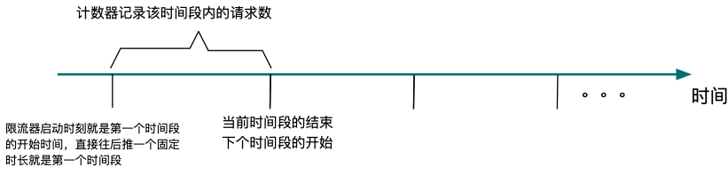
其基本实现：
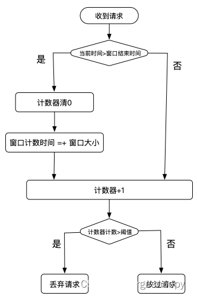
所以固定窗口计数法限流需要的记录的几个变量：

* 窗口大小。
* 限流的阈值
* 窗口结束时间：如果是在处理请求的时候去判断当前窗口是否结束，那就需要记录一下；也可以通过后台线程搞个定时器来定时开启下一个窗口，那就不需要记录这个窗口结束时间。
* 计数器

固定窗口计数法的优点就是简单，但因为简单也有一些问题，这些所有的问题的本质都是：限流器假设了流量是均匀到来的，但实际上并不是。

1. 假不可用。如下图，一个窗口内，所有的请求集中在窗口前半段到来，由于触发了阈值，所以后半段来的请求都将被拒绝，在外部卡那里后半段时间服务就是不可用的。
   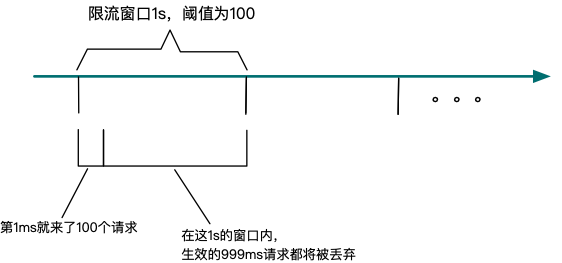
2. 突破系统的保护。我们限流的目的是为了保护后面的业务系统不被打挂。但是如果使用固定窗口，请求可能在一个很小的窗口内来了很多，如上图，1ms内就来了100个，那实际上这1ms内的qps是1000，远远大于了我们设定的1s内只能处理100个请求的限制，这种情况到底会不会有问题，就要看我们设置限流的依据是什么了。比如业务系统有100个线程来处理请求，只是处理每个请求的时间是1s，所以我设置1s内最多有100个请求(这种情况，其实是根据最大并并发量来设置限流)，那这种情况没啥问题的；但如果我只有一个线程，只是说每个请求的处理时间小于100ms，所以我设置1s内最多有100个请求，那这中情况就比较危险了，有可能在这1ms内就将系统给干挂了。
3. 某段时间内限流值的2倍流量被放过
   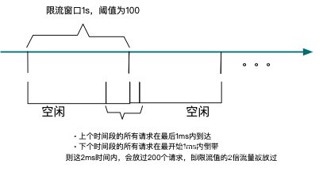

## 滑动窗口计数法

滑动窗口计数的思路是

* 将固定的限流窗口分成更小的计数窗口，每个小的窗口都一个单独的计数器
* 当请求落到这个小的窗口内时，对应的计数器+1
* 当限流窗口内的所有计数窗口的计数器总和达到限流值的时候，触发限流规则
* 当请求的当前时间已经落到限流窗口之外的时候，将整个限流窗口向右滑动。或者是定时去滑动也是ok的，每隔一个小的计数窗口滑动一次
  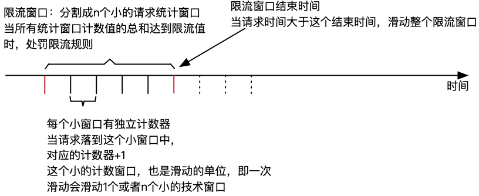
  举个例子：
  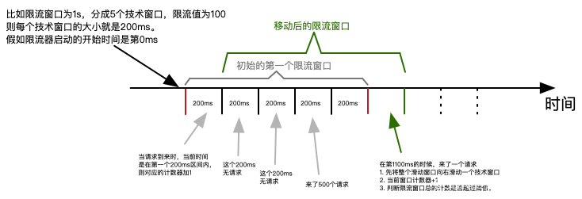
  滑动窗口通过将限流窗口细分成更小的计数窗口，更加精细化的来统计请求量，从而避免了固定窗口在窗口移动处可能存在将最大两倍于限流阈值的流量放过的问题。
  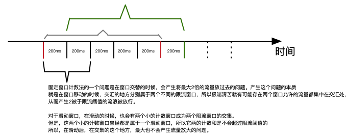
  其实当限流窗口中划分的小的计数窗口的个数为1的时候，滑动窗口就退化成了固定窗口计数了。

Tcp的限流就是基于滑动窗口来做的。

落到具体的实现，滑动窗口计数器需要保存的数据：

* 限流窗口的结束时间(或者开始时间)
* 限流窗口的大小
* 限流阈值
* 限流窗口被分割成的计数窗口的个数
* 每个计数窗口关联的计数器

为了方便，有的时候还会记录下，当前计数窗口的索引。实现这个的时候一定要注意，限流窗口是一个时间窗口，而时间是会不停的向前流失的。

# 漏桶算法

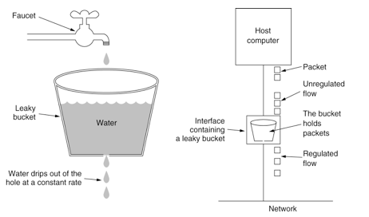
我们常说的使用mq的一个作用就是削峰填谷、平滑流量，其实mq在这个地方充当的其实就是一个漏桶。

漏桶算法在限流方面的作用主要就是流量整形。对于外部进来的流量大小不可预知，但是漏桶的流出速率是一个可控制的恒定的均匀的速率，从而达到流量整形的目的。

所以实现漏桶算法就是一个队列：

* 流量达到就是入队，当队列满了，就直接丢弃。
* 出队是一个可控制的稳定的速率出队，出队后的流量交给业务系统处理。所以这里出队的速率是根据业务系统的处理能力来设定的。

对应到具体的实现上，其实也可以记录下一次可出队的时间来实现。比如限流限制成1s只能访问5次，那么当请求到达时间为T1，就记录下T1+200ms，当再次有请求到达的时候，比较当前时间和记录下时间，只有当前时间大于记录下的时间，可直接访问，否则阻塞等待直到记录下的下次可访问时间，最后修改这个下次可访问时间为当前时间+200ms。

漏桶算法可实现限流的目的，达到系统不被压垮的目的，但是对于突发流量来说，漏桶算法是缓存在漏桶中的，超过漏桶的容量的请求就会被丢弃。这对应对突发流量的应对能力相对弱一些

# 令牌桶算法

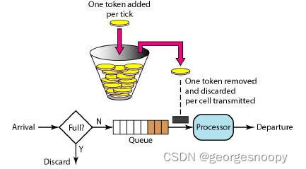
以恒定速率往令牌桶中添加令牌，在请求到达的时候，先去令牌桶中获取一个令牌，如果令牌桶为空，获取不到令牌，则说明触发了限流规则，阻塞等，图中的queue就是阻塞等待队列。如果获取到了令牌，就交给业务系统去处理。

令牌桶这里达到限流的目的是通过令牌桶容量和生产令牌的速率来控制的，令牌桶的生产速率就是正常的限流值，比如1s内访问5次，那么令牌产生的速率就是1s生产5个；而令牌桶是用来处理一定的突发流量的，所以桶的容量需要保证极端情况下，不压垮系统就好了。

具体的实现上：相比于漏桶算法的实现，多一个令牌桶的容量。

* 下次可获得令牌的时间，即令牌生产速率(在RateLimiter实现中，这个变量也不完全就是令牌的生产速率，因为应对突发流浪也会影响这个值)。这个跟漏桶算法中的流出速率控制道理是差不多的。
  其实这里记录时间的好处，主要一个好处就是避免了固定窗口算法中记录请求的访问次数。
* 令牌桶容量
* 令牌桶当前令牌数

# guava单机限流RateLimiter

参考：https://mp.weixin.qq.com/s/GOBmSOvWqpmLp2rijZ6q4w

RateLimiter是基于令牌桶算法实现的一个限流组件，其代码看起来很简单，一共就两个类：抽象父类RateLimiter和实际的SmoothRateLimiter。其中SmoothWarmingUP和SmmothBursty是SmoothRateLimiter的两个内部类。但实际真的要看懂也需要花点时间的，这里其实主要就是算法上的考虑不好看懂。
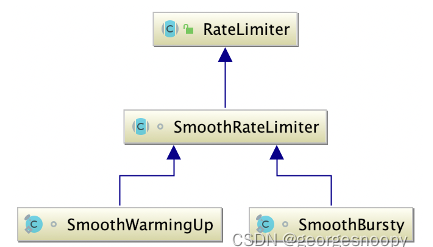
RateLimiter提供了两种限流模式：

* 普通的限流SmoothBursty
* 带预热的限流。即在指定预热期，允许放过的流量逐渐增加。预热期结束后，允许放过的流量就等于设定的限流值。这个目的是为了解决软件重启等情况，由于缓存等还没有初始化化、jvm还是解释执行等，能够承受的流量比稳定运行后更小，防止在服务刚刚启动就被大流量打挂了，所以RateLimiter提供了一个预热器。

基本使用也非常简单：
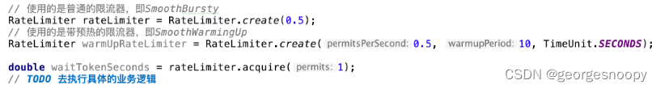

当然也提供了非阻塞的tryAcquire()方法

有了上面令牌桶算法的背景，再看RateLimiter就比价容易了，其中保存的属性：

* stableIntervalMicros：令牌产生的稳定速率，只是这里的速率是转换成了两个令牌生产之间的时间间隔(毫秒)。之所以是稳定速率，是因为SmoothWarmUp，在预热阶段产生令牌的速率会低于这个值。RateLimiter初始化的时候，传入的permitsPerSecond表示的是每秒产生的产生的令牌个数，也就是说令牌的生产速率的时间单位就给固定了，那么stableIntervalMicros = 1s/permitsPerSecond。

速率(单位时间生产个数) = 时间段内总个数/时间长度 = 时间内长度/生产两个令牌的时间间隔 可以来表示生效速率。反过来使用两个令牌生产间隔其实也就可以表示速率。

* maxPermits：令牌桶的容量，即令牌桶中最大的令牌数。对于无预热的限流器，maxPermits = 1s/stableIntervalMicros。之所以要这么计算，是因为初始化RateLimiter时，传入的permitsPerSecond是个double，用小数来表达限流窗口不是1s的情况。

而对于有预热的限流器，预热期间，就是1s/stableIntervalMicros的一半。预热结束就是1s/stableIntervalMicros。

所以这个maxPermits的最大值，其实就是初始化RateLimiter的时候设置的限流阈值做了整数转换。

* storedPermits：令牌桶中当前拥有令牌的个数。
* nextFreeTicketMicros：下次无需等待就能直接获取token的时间。它的值的计算包含两部分：

按照正常速率生产令牌，下一次能够直接获得令牌的。比如令牌的生产速率是每秒100个，如果在T1时刻将令牌桶token清空了，那么下次无需等待就能获得令牌的时间就是T1之后的100ms处。
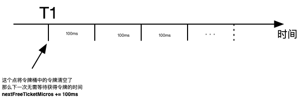

* 预支的令牌生产的时间。RateLimiter为了支持一定的流量突发，当一次调用acquire()的时候，如果当前令牌桶中没有足够的令牌，也不会阻塞当前acquire()请求，而是直接返回，然后将预支的那些令牌的生产时间累加到nextFreeTicketMicros，然后下次调用acquire()的时候就会阻塞更久。

比如：当前令牌桶中的令牌数storedPermits=2，但是acquire(5)的时候不会立马阻塞，而是将超支的3个令牌的生产时间转义到下次调用acquire()的时候。

即nextFreeTicketMicros += 3*100ms。

> RateLimiter的设计哲学：它允许瞬间的流量波峰超过QPS，但瞬间过后的请求将会等待较长的时间来缓解上次的波峰，以使得平均的QPS等于预定值。

这4个参数是SmoothBursty和SmoothWarmUp共有的，且维护逻辑也都是一样的。
SmoothBursty自己的属性

* maxBurstSeconds：这个是影响maxPermits，在计算maxPermits的时候，实际是maxBurstSeconds * permitsPerSecond，如果maxBurstSeconds大于1，那其实就允许令牌桶中多余初始化RateLimiter时指定的阈值，以应对一定的突发流量。在guava 30.1版本中，这个值还是写死的1.0.

SmoothWarmUp自己的属性：

* armupPeriodMicros：预热期时间长度，这个是初始化RateLimiter传入的。
* thresholdPermits：预热期内令牌桶内最大的令牌数。
  * 其值=0.5 * warmupPeriodMicros/stableIntervalMicros
* coldFactor：预热期令牌生产速率的减缓因子。正常情况下，令牌的生产间隔就是stableIntervalMicros = 1s/permitsPerSecond，而在预热期，令牌的生产速率=coldFactor * stableIntervalMicros。
  * 在guava 30.1版本中，这个值还是写死的3.0。
  * 所以，对于限流阈值设置成1s内100个，那么stableIntervalMicros=100ms，但是在预热期令牌生产速率=3*100ms=300ms.
* slope：
  * 其值=(stableIntervalMicros * coldFactor - stableIntervalMicros) / (maxPermits - thresholdPermits)
