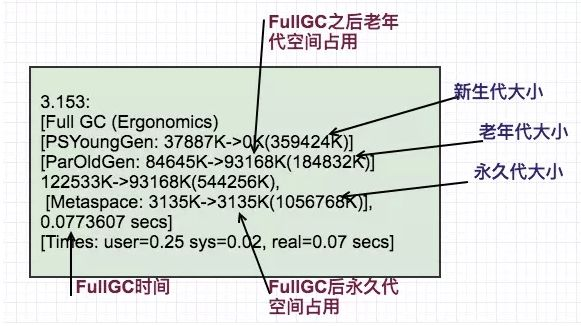
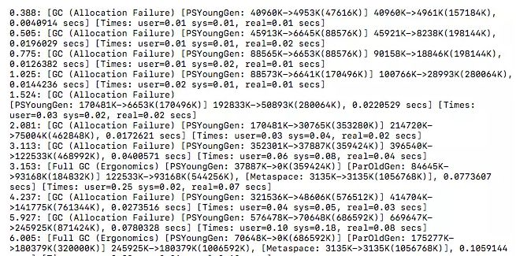

# █ JVM 概述

## 内存模型

按照 JVM 规范, 内存概念模型可以分成以下几个区域

- **程序计数器**

  可看作当前程序执行的字节码的行号指示器, 通过这个计数器来决定下一条要执行的字节码指令

  由于处理器每次只能处理一个线程的一个指令, 为了线程切换后能恢复到正确的执行位置, 每个线程都有自己的一个程序计数器

- **虚拟机栈**

  记录程序执行过程中, 每个线程的方法调用信息

  每次调用一个方法, 都会创建一个栈帧(存储局部变量, 操作数栈, 动态链接, 方法出入口信息等)

  方法执行完成后, 该栈帧就会从虚拟机栈中弹出, 弹出后的栈顶就回到了上一层的方法栈帧

- **本地方法栈**

  与虚拟机栈类似, 虚拟机栈记录java方法的调用信息, 本地方法栈记录 native 方法的调用信息

- **堆**

  存放对象实例, 几乎所有的对象实例都存放在堆中

  堆也是垃圾收集器 GC 管理的主要区域, 从内存回收角度来说, 堆可以进一步细分

  - 新生代
    - Eden 空间
    - 2块Survivor 空间
  - 老生代

- **方法区/元空间**

  存储已加载的类信息, 常量, 静态变量, JIT 产物等数据

  常量池应该属于方法区, 但是某些虚拟机实现也会将字符串常量池放到了堆中

  在 Java7 的 hotSpot 虚拟机的实现中, 方法区也可以称为**永久代**, 但其他虚拟机可能没有永久代的概念

  在 Java8 中, 方法区(永久代) 改成了元空间, 作用与原来的

## 对象生命周期与GC

### 对象生命周期

- 新建对象, 一般出现在新生代 Eden 区, eden放不下时尝试触发 YGC, 试图腾出空间, 如果 YGC 后扔放不下, 大对象直接进入老年代
- 每次 YGC 时, 对象从eden或激活的 Survivor 空间中移动到另一块 Survivor 区, 若对象太多, 会有部分对象进入老年代
- 对象有一个计数器, 记录其经历的 YGC 次数, 当达到设定阈值时, 该对象也会进入老年代(默认15, 即 YGC 14次后)
- 当需要将对象移交到老生代时, 若老生代空间不够, 则会触发 FGC, 此时 jvm 处于一个 stop the world 的状态, 所有用户线程都被暂停, 若 FGC 时间太长, 则用户会感觉到系统卡顿
- 若 FGC 后仍不能腾出空间, 则抛出 OOM 错误

### 判断对象存活

为了判断对象是否可回收, jvm 中有一种称为 GC Roots 的特殊对象, 包括

- 类的静态属性引用的对象
- 常量引用的对象
- 虚拟机栈中引用的对象
- 本地方法栈中引用的对象

GC Root 一般不会被回收, 于是可以以这类固定的对象为基础, 判断其他对象与 GC Roots 之间有没有直接或间接的引用关系, 如果发现一个对象失去与GC Roots 之间的联系, 就可以将其标记为"可回收"的.

### 垃圾回收算法

#### 标记-清除算法

- 从 GC Roots 出发, 标记所有被引用的对象, 然后删除未被引用的对象
- 缺点: 造成大量空间碎片, 当需要大块连续空间时, 容易触发Full GC

#### 标记-整理算法

- 从 GC Roots 出发, 标记所有被引用的对象, 将其集中到一块区域中, 形成连续的已使用空间, 比腾出连续的空闲空间

#### 标记-复制算法

- 为了并行的执行标记和整理操作, 划分了两块内存空间, 一般情况下只激活其中一块. 
- 找到存活对象之后, 将其移动到另一块空间, 最后激活新空间, 并将原空间清空
- YGC 新生代回收时的主流算法


### 垃圾回收器

#### Serial

- 新生代的默认回收器
- 标记-复制算法, 会 STW

#### CMS

- Java 8 及以前老生代的默认回收器
- 标记-清除 + 标记-整理
  - 默认采用"标记-清除算法", 会造成空间碎片, 分成4步进行gc
    - 初始标记: STW
    - 并发标记
    - 重新标记: STW
    - 并发清除
  - 可以要求 jvm 在执行 n 次 FGC 后进行碎片整理

#### G1

- Java 9 开始成为默认垃圾回收器, 涵盖新生代和老生代的 GC
- 将内存分成多块大小相同的区域region, 并可以分成4类
  - eden: 新生代的伊甸园
  - survior: 新生代的存活区
  - old: 老年代
  - humongous: 特殊的老年代, 大对象专区

#### ZGC

- 下一代的垃圾回收器, 


### GC日志

#### 开启GC日志收集

#### GC日志结构


# █ JVM 监控与处理

## 实时监控

jconsole

virtualVM

## 快照

dump

# █ 性能调优

## 性能调优

性能调优包含多个层次，比如：架构调优、代码调优、JVM调优、数据库调优、操作系统调优等。

架构调优和代码调优是JVM调优的基础，其中架构调优是对系统影响最大的。

性能调优基本上按照以下步骤进行：

1. 明确优化目标
2. 发现性能瓶颈
3. 性能调优
4. 通过监控及数据统计工具获得数据
5. 确认是否达到目标

## 何时进行JVM调优

当出现 GC 时, jvm 处于 stw 的状态, 若 GC 频繁发生或时间过长, 用户就会感受到系统卡顿, JVM优化的目的就是减少STW执行的时间（避免卡顿），避免频繁full gc

遇到以下情况，就需要考虑进行JVM调优了：

- **内存不足**:
  - Heap内存（老年代）持续上涨达到设置的最大内存值；
  - 应用出现OutOfMemory 等内存异常； 
  - 应用中有使用本地缓存且占用大量内存空间； 
- **响应缓慢**:
  - 系统吞吐量与响应性能不高或下降。 
  - GC频繁或停顿过长

## JVM调优的基本原则

JVM调优是一个手段，但并不一定所有问题都可以通过JVM进行调优解决，因此，在进行JVM调优时，我们要遵循一些原则：

- **大多数的Java应用不需要进行JVM优化**； 
  - 大多数导致GC问题的原因是代码层面的问题导致的（代码层面）；
  - 减少创建对象的数量（代码层面）； 
  - 减少使用全局变量和大对象（代码层面）； 
  - 优先架构调优和代码调优，JVM优化是不得已的手段（代码、架构层面）； 
  - 分析GC情况优化代码比优化JVM参数更好（代码层面）；  
- 上线之前，应先考虑将机器的JVM参数设置到最优； 
  - 比如将 Xms 和 Xmx 设成一样, 避免堆空间的扩容/回缩带来的开销

通过以上原则，我们发现，其实**最有效的优化手段是架构和代码层面的优化**，而JVM优化则是最后不得已的手段，也可以说是对服务器配置的最后一次“压榨”。

## JVM调优目标

调优的最终目的都是为了**令应用程序使用最小的硬件消耗来承载更大的吞吐**。jvm调优主要是针对垃圾收集器的收集性能优化，令运行在虚拟机上的应用能够使用更少的内存以及延迟获取更大的吞吐量。

- 延迟：GC低停顿和GC低频率； 
- 低内存占用； 
- 高吞吐量; 

其中，任何一个属性性能的提高，几乎都是以牺牲其他属性性能的损为代价的，不可兼得。具体根据在业务中的重要性确定。

## JVM调优量化目标

下面展示了一些JVM调优的量化目标参考实例：

- Heap 内存使用率 <= 70%; 
- Old generation内存使用率<= 70%; 
- avgpause <= 1秒; 
- Full gc 次数0 或 avg pause interval >= 24小时 ; 

注意：不同应用的JVM调优量化目标是不一样的。

## JVM调优的步骤

一般情况下，JVM调优可通过以下步骤进行：

- 分析GC日志及dump文件，判断是否需要优化，确定瓶颈问题点； 
- 确定JVM调优量化目标； 
- 确定JVM调优参数（根据历史JVM参数来调整）； 
- 依次调优内存、延迟、吞吐量等指标； 
- 对比观察调优前后的差异； 
- 不断的分析和调整，直到找到合适的JVM参数配置； 
- 找到最合适的参数，将这些参数应用到所有服务器，并进行后续跟踪。 

以上操作步骤中，某些步骤是需要多次不断迭代完成的。一般是从满足程序的内存使用需求开始的，之后是时间延迟的要求，最后才是吞吐量的要求，要基于这个步骤来不断优化，每一个步骤都是进行下一步的基础，不可逆行之。

## JVM参数

JVM调优最重要的工具就是JVM参数了。先来了解一下JVM参数相关内容。

`-XX` 参数被称为不稳定参数，此类参数的设置很容易引起JVM 性能上的差异，使JVM存在极大的不稳定性。如果此类参数设置合理将大大提高JVM的性能及稳定性。

不稳定参数语法规则包含以下内容。

布尔类型参数值：

- -XX:+ '+'表示启用该选项 
- -XX:- '-'表示关闭该选项

```shell

```

数字类型参数值：

- `-XX:option=numValue`

  给选项设置一个数字类型值，可跟随单位，例如：'m'或'M'表示兆字节;'k'或'K'千字节;'g'或'G'千兆字节。32K与32768是相同大小的。 

字符串类型参数值：

- `-XX:var=strValue`

  给选项设置一个字符串类型值，通常用于指定一个文件、路径或一系列命令列表。例如：

  ```shell
  -XX:HeapDumpPath=./dump.core 
  ```

## JVM参数解析及调优

比如以下参数示例：

```shell
-Xmx4g –Xms4g –Xmn1200m –Xss512k 

-XX:NewRatio=4 -XX:SurvivorRatio=8 -XX:PermSize=100m -XX:MaxPermSize=256m -XX:MaxTenuringThreshold=15
```

上面为Java7及以前版本的示例，在Java8中永久代的参数-XX:PermSize和-XX：MaxPermSize已经失效。这在前面章节中已经讲到。

参数解析：

- `-Xmx4g`：堆内存最大值为4GB。 
- `-Xms4g`：初始化堆内存大小为4GB。 
- `-Xmn1200m`：设置年轻代大小为1200MB。增大年轻代后，将会减小年老代大小。此值对系统性能影响较大，Sun官方推荐配置为整个堆的3/8。 
- `-Xss512k`：设置每个线程的堆栈大小。JDK5.0以后每个线程堆栈大小为1MB，以前每个线程堆栈大小为256K。应根据应用线程所需内存大小进行调整。在相同物理内存下，减小这个值能生成更多的线程。但是操作系统对一个进程内的线程数还是有限制的，不能无限生成，经验值在3000~5000左右。 
- `-XX:NewRatio=4`：设置年轻代（包括Eden和两个Survivor区）与年老代的比值（除去持久代）。设置为4，则年轻代与年老代所占比值为1：4，年轻代占整个堆栈的1/5 
- `-XX:SurvivorRatio=8`：设置年轻代中Eden区与Survivor区的大小比值。设置为8，则两个Survivor区与一个Eden区的比值为2:8，一个Survivor区占整个年轻代的1/10 
- `-XX:PermSize=100m`：初始化永久代大小为100MB。 
- `-XX:MaxPermSize=256m`：设置持久代大小为256MB。 
- `-XX:MaxTenuringThreshold=15`：设置垃圾最大年龄。如果设置为0的话，则年轻代对象不经过Survivor区，直接进入年老代。对于年老代比较多的应用，可以提高效率。如果将此值设置为一个较大值，则年轻代对象会在Survivor区进行多次复制，这样可以增加对象再年轻代的存活时间，增加在年轻代即被回收的概论。 

新生代、老生代、永久代的参数，如果不进行指定，虚拟机会自动选择合适的值，同时也会基于系统的开销自动调整。

可调优参数：

`-Xms`：初始化堆内存大小，默认为物理内存的1/64(小于1GB)。

`-Xmx`：堆内存最大值。默认(MaxHeapFreeRatio参数可以调整)空余堆内存大于70%时，JVM会减少堆直到-Xms的最小限制。

`-Xmn`：新生代大小，包括Eden区与2个Survivor区。

`-XX:SurvivorRatio=1`：Eden区与一个Survivor区比值为1:1。

`-XX:MaxDirectMemorySize=1G`：直接内存。报java.lang.OutOfMemoryError: Direct buffer memory异常可以上调这个值。

`-XX:+DisableExplicitGC`：禁止运行期显式地调用System.gc()来触发fulll GC。

注意: Java RMI的定时GC触发机制可通过配置-Dsun.rmi.dgc.server.gcInterval=86400来控制触发的时间。

`-XX:CMSInitiatingOccupancyFraction=60`：老年代内存回收阈值，默认值为68。

`-XX:ConcGCThreads=4`：CMS垃圾回收器并行线程线，推荐值为CPU核心数。

`-XX:ParallelGCThreads=8`：新生代并行收集器的线程数。

`-XX:MaxTenuringThreshold=10`：设置垃圾最大年龄。如果设置为0的话，则年轻代对象不经过Survivor区，直接进入年老代。对于年老代比较多的应用，可以提高效率。如果将此值设置为一个较大值，则年轻代对象会在Survivor区进行多次复制，这样可以增加对象再年轻代的存活时间，增加在年轻代即被回收的概论。

`-XX:CMSFullGCsBeforeCompaction=4`：指定进行多少次fullGC之后，进行tenured区 内存空间压缩。

`-XX:CMSMaxAbortablePrecleanTime=500`：当abortable-preclean预清理阶段执行达到这个时间时就会结束。

在设置的时候，如果关注性能开销的话，应尽量把永久代的初始值与最大值设置为同一值，因为永久代的大小调整需要进行FullGC才能实现。

## 内存优化示例

当JVM运行稳定之后，触发了FullGC我们一般会拿到如下信息:



以上gc日志中，在发生fullGC之时，整个应用的堆占用以及GC时间。为了更加精确需多次收集，计算平均值。或者是采用耗时最长的一次FullGC来进行估算。上图中，老年代空间占用在93168kb（约93MB），以此定为老年代空间的活跃数据。则其他堆空间的分配，基于以下规则来进行。

- java heap：参数-Xms和-Xmx，建议扩大至3-4倍FullGC后的老年代空间占用。 
- 永久代：-XX:PermSize和-XX:MaxPermSize，建议扩大至1.2-1.5倍FullGc后的永久带空间占用。 
- 新生代：-Xmn，建议扩大至1-1.5倍FullGC之后的老年代空间占用。 
- 老年代：2-3倍FullGC后的老年代空间占用。 

基于以上规则，则对参数定义如下：

```shell
java -Xms373m -Xmx373m -Xmn140m -XX:PermSize=5m -XX:MaxPermSize=5m
```

## 延迟优化示例

对延迟性优化，首先需要了解延迟性需求及可调优的指标有哪些。

- 应用程序可接受的平均停滞时间: 此时间与测量的Minor 
- GC持续时间进行比较。可接受的Minor GC频率：Minor 
- GC的频率与可容忍的值进行比较。 
- 可接受的最大停顿时间:最大停顿时间与最差情况下FullGC的持续时间进行比较。 
- 可接受的最大停顿发生的频率：基本就是FullGC的频率。 

其中，平均停滞时间和最大停顿时间，对用户体验最为重要。对于上面的指标，相关数据采集包括：MinorGC的持续时间、统计MinorGC的次数、FullGC的最差持续时间、最差情况下，FullGC的频率。



如上图，Minor GC的平均持续时间0.069秒，MinorGC的频率为0.389秒一次。

新生代空间越大，Minor GC的GC时间越长，频率越低。如果想减少其持续时长，就需要减少其空间大小。如果想减小其频率，就需要加大其空间大小。

这里以减少了新生代空间10%的大小，来减小延迟时间。在此过程中，应该保持老年代和持代的大小不变化。调优后的参数如下变化:

```text
java -Xms359m -Xmx359m -Xmn126m -XX:PermSize=5m -XX:MaxPermSize=5m
```

## 吞吐量调优

吞吐量调优主要是基于应用程序的吞吐量要求而来的，应用程序应该有一个综合的吞吐指标，这个指标基于整个应用的需求和测试而衍生出来的。

评估当前吞吐量和目标差距是否巨大，如果在20%左右，可以修改参数，加大内存，再次从头调试，如果巨大就需要从整个应用层面来考虑，设计以及目标是否一致了，重新评估吞吐目标。

对于垃圾收集器来说，提升吞吐量的性能调优的目标就是尽可能避免或者很少发生FullGC或者Stop-The-World压缩式垃圾收集（CMS），因为这两种方式都会造成应用程序吞吐降低。尽量在MinorGC 阶段回收更多的对象，避免对象提升过快到老年代。

## 调优工具

借助GCViewer日志分析工具，可以非常直观地分析出待调优点。可从以下几方面来分析：

Memory,分析Totalheap、Tenuredheap、Youngheap内存占用率及其他指标，理论上内存占用率越小越好；

Pause，分析Gc pause、Fullgc pause、Total pause三个大项中各指标，理论上GC次数越少越好，GC时长越小越好；

原文链接：《[JVM性能调优详解](https://link.zhihu.com/?target=https%3A//www.choupangxia.com/2019/11/11/interview-jvm-gc-08/)》

本文参考：

（1）[https://blog.csdn.net/jisuanjiguoba/article/details/80176223](https://link.zhihu.com/?target=https%3A//blog.csdn.net/jisuanjiguoba/article/details/80176223)（2）[https://juejin.im/post/59f02f406fb9a0451869f01c](https://link.zhihu.com/?target=https%3A//juejin.im/post/59f02f406fb9a0451869f01c)

《面试官》系列文章：

- 《[JVM之内存结构详解](https://link.zhihu.com/?target=http%3A//www.choupangxia.com/2019/10/18/jvm%e4%b9%8b%e5%86%85%e5%ad%98%e7%bb%93%e6%9e%84%e8%af%a6%e8%a7%a3/)》 
- 《[面试官，不要再问我“Java GC垃圾回收机制”了](https://link.zhihu.com/?target=https%3A//www.choupangxia.com/2019/10/20/interview-jvm-gc-01/)》 
- 《[面试官，Java8 JVM内存结构变了，永久代到元空间](https://link.zhihu.com/?target=https%3A//www.choupangxia.com/2019/10/22/interview-jvm-gc-02/)》 
- 《[面试官，不要再问我“Java 垃圾收集器”了](https://link.zhihu.com/?target=https%3A//www.choupangxia.com/2019/10/25/interview-jvm-gc-03/)》 
- 《[Java虚拟机类加载器及双亲委派机制](https://link.zhihu.com/?target=https%3A//www.choupangxia.com/2019/10/29/interview-jvm-gc-04/)》 
- 《[Java内存模型(JMM)详解](https://link.zhihu.com/?target=https%3A//www.choupangxia.com/2019/10/29/interview-jvm-gc-05/)》 
- 《[Java内存模型相关原则详解](https://link.zhihu.com/?target=https%3A//www.choupangxia.com/2019/11/06/interview-jvm-gc-06/)》 
- 《[JVM性能调优详解](https://link.zhihu.com/?target=https%3A//www.choupangxia.com/2019/11/11/interview-jvm-gc-08/)》 