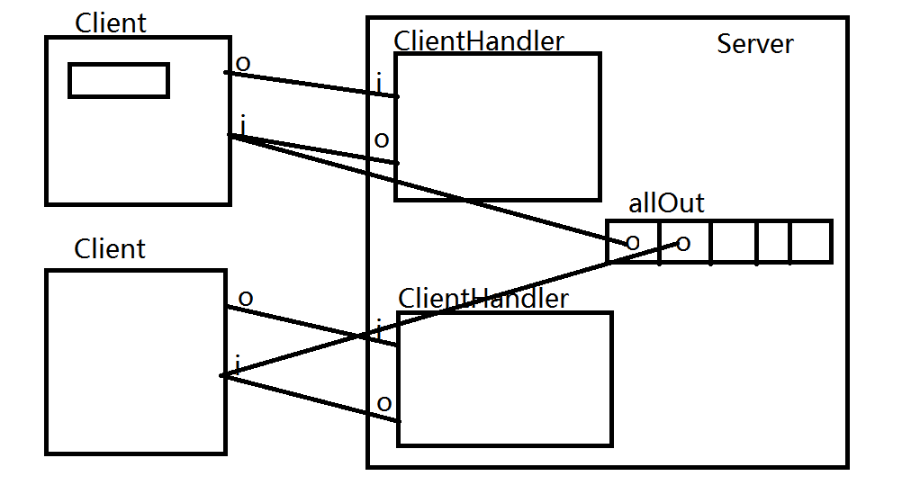

## Demo



### 客户端

```java
public class Client {
    public static void main(String[] args) {
        try {
            new Client().start();
        } catch (Exception e) {
            System.out.println("客户端启动失败");
            e.printStackTrace();
        }
    }

    // Socket, 即客户端socket, 封装了TCP通讯协议
    private Socket socket;

    /** 构造方法，用来初始化客户端 */
    public Client() throws IOException {
        /*
         * 实例化Socket的过程就是连接远端计算机的过程，这里需要传入两个参数
         * 参数1:服务端的IP地址信息, 通过IP可以找到服务端的计算机
         * 参数2:服务端的端口, 通过端口可以连接到运行在服务端计算机上的 服务端应用程序。
         */
        System.out.println("正在连接服务端...");
        socket = new Socket("localhost", 8088);
        System.out.println("已连接服务端!");
    }

    /** 客户端开始工作的方法 */
    public void start() {
        try {
            //新开一个线程, 用来处理服务端消息
            new Thread(new ServerHandler()).start();

            // 当前线程处理用户在客户端的输入信息, 发送给服务端
            // 从 socket 获取一个输出流，通过该输出流写出的数据, 会发送到服务端
            OutputStream out = socket.getOutputStream();
            OutputStreamWriter osw = new OutputStreamWriter(out, StandardCharsets.UTF_8);
            PrintWriter pw = new PrintWriter(osw, true);

            Scanner scanner = new Scanner(System.in);
            String nickName = scanner.nextLine();
            pw.println(nickName);
            long last = System.currentTimeMillis();

            // 无限循环, 持续地将用户输入内容发送给服务端
            while (true) {
                String message = scanner.nextLine();
                if (System.currentTimeMillis() - last >= 1000) {
                    pw.println(message);
                    last = System.currentTimeMillis();
                } else {
                    System.out.println("说话速度过快");
                }
            }
        } catch (Exception e) {
            e.printStackTrace();
        }
    }

    /** 该线程用来循环读取服务端发送过来的 每一条消息并输出到控制台。 */
    private class ServerHandler implements Runnable {
        @Override
        public void run() {
            try {
                InputStream in = socket.getInputStream();
                InputStreamReader isr = new InputStreamReader(in, StandardCharsets.UTF_8);
                BufferedReader br = new BufferedReader(isr);

                //读取服务端发送过来的消息并输出到控制台
                String message;
                while ((message = br.readLine()) != null) {
                    System.out.println(message);
                }
            } catch (Exception e) {
            }
        }
    }
}
```


### 服务端

```java
public class Server {
    public static void main(String[] args) {
        try {
            new Server().start();
        } catch (Exception e) {
            System.out.println("服务端启动失败!");
            e.printStackTrace();
        }
    }

    private ServerSocket server;
    private List<PrintWriter> allOut;

    /** 构造方法，初始化服务端 */
    public Server() throws IOException {
        // 申请并监听端口，当客户端通过该端口与服务端连接，ServerSocket 会创建一个Socket
        server = new ServerSocket(8088);
        allOut = new ArrayList<>();
    }

    public void start() {
        try {
            // 监听端口，等待客户端连接
            while (true) {
                System.out.println("等待客户端连接...");
                Socket socket = server.accept();
                System.out.println("一个客户端连接了!");
                //启动一个线程用来与该客户端交互
                new Thread(new ClientHandler(socket)).start();
            }
        } catch (Exception e) {
            e.printStackTrace();
        }
    }

    /** 该线程用来与指定的客户端进行交互 */
    private class ClientHandler implements Runnable {
        //当前线程通过这个Socket与指定客户端交互
        private Socket socket;
        //当前客户端的地址信息
        private String host;

        public ClientHandler(Socket socket) {
            this.socket = socket;
            InetAddress address = socket.getInetAddress();
            host = address.getHostAddress();
        }

        @Override
        public void run() {
            PrintWriter pw = null;
            try {
                System.out.println(host + "上线了!");
                // 从 socket 获取一个输入流，可以读取到远端计算机发送过来的数据
                InputStream in = socket.getInputStream();
                InputStreamReader isr = new InputStreamReader(in, "UTF_8");
                BufferedReader br = new BufferedReader(isr);

                // 从 socket 获取输出流，以便将消息发送给客户端
                OutputStream out = socket.getOutputStream();
                OutputStreamWriter osw = new OutputStreamWriter(out, "UTF_8");
                pw = new PrintWriter(osw, true);

                // 将该客户端的输出流存入集合, 以便后续发送广播消息
                synchronized (allOut) {
                    allOut.add(pw);
                }

                // 在客户端断开连接时, br.readLine()结果也不相同:
                // linux的客户端断开连接时, 该方法会返回 null值。
                // windows的客户端断开连接时, 该方法会 直接抛出异常。
                String message;
                while ((message = br.readLine()) != null) {
                    synchronized (allOut) {
                        for (PrintWriter o : allOut) {
                            o.println(host + "说:" + message);
                        }
                    }
                }
            } catch (Exception e) {
            } finally {
                //处理客户端断开连接后的操作 将该客户端的输出流从共享集合中删除
                synchronized (allOut) {
                    allOut.remove(pw);
                }
                try {
                    socket.close();
                } catch (Exception e) {
                    e.printStackTrace();
                }
                System.out.println(host + "下线了!");
            }
        }
    }
}
```


