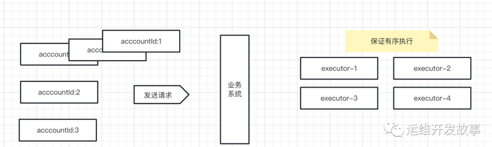

# KeyAffinityExecutor产生的原因
有一批量的数据，可以按照一个固定的 key 分组并发，但是要保证组内并行的处理。 比如：商城中，不同的用户可以并发下单，但是一个用户只能进行顺序的下单。
在全局并发的场景下保证局部有序，保证最小事务单元操作的原子性。



针对上面的场景我们可以通过 KeyAffinityExecutor (KeyAffinityExecutor 是一个可以按照指定的Key亲和顺序消费的执行器) 来解决这个问题，我们下面一起来了解下 KeyAffinityExecutor。

# 基本使用
## 导入依赖
```xml
<dependency>
  <groupId>com.github.phantomthief</groupId>
  <artifactId>more-lambdas</artifactId>
  <version>0.1.55</version>
</dependency>
```
## 创建线程池
```java
public class KeyAffinityExecutorTest {

    @Test
    public void submitTaskKeyAffinityExecutor() {
        //线程池
        KeyAffinityExecutor keyAffinityExecutor = KeyAffinityExecutor
                .newSerializingExecutor(2, 200, "测试-%d");

        //需要下单的信息
        List<Order> orders = new ArrayList<>();
        orders.add(new Order(1, "iPhone 16 Max"));
        orders.add(new Order(1, "Thinking In Java"));
        orders.add(new Order(1, "MengNiu Milk"));
        orders.add(new Order(2, "Thinking In Java"));
        orders.add(new Order(3, "HUAWEI 100P"));
        orders.add(new Order(4, "XIAOMI 20"));
        orders.add(new Order(5, "OPPO 98"));
        orders.add(new Order(6, "HP EC80"));
        orders.add(new Order(7, "BBK 100P"));
        orders.add(new Order(8, "TCL 1380"));
        orders.add(new Order(9, "CHANGHONG 32"));

        orders.forEach(order -> keyAffinityExecutor.submit(order.getAccountId(), () -> {
            System.out.println(Thread.currentThread() + " accountId:" + order.getAccountId() +
                    ", skuNo:" + order.getSkuNo() + " checkout success!");
            return null;
        }));

        try {
            Thread.sleep(1000L);
        } catch (InterruptedException e) {
            throw new RuntimeException(e);
        }

        Assert.assertTrue(true);
    }
    @Data
    @AllArgsConstructor
    public static class Order {
        long accountId;

        String skuNo;
    }
}
```
输出结果如下：
```
Thread[测试-0,5,main] accountId:1, skuNo:iPhone 16 Max checkout success!
Thread[测试-1,5,main] accountId:2, skuNo:Thinking In Java checkout success!
Thread[测试-1,5,main] accountId:3, skuNo:HUAWEI 100P checkout success!
Thread[测试-1,5,main] accountId:4, skuNo:XIAOMI 20 checkout success!
Thread[测试-0,5,main] accountId:1, skuNo:Thinking In Java checkout success!
Thread[测试-1,5,main] accountId:6, skuNo:HP EC80 checkout success!
Thread[测试-0,5,main] accountId:1, skuNo:MengNiu Milk checkout success!
Thread[测试-1,5,main] accountId:8, skuNo:TCL 1380 checkout success!
Thread[测试-0,5,main] accountId:5, skuNo:OPPO 98 checkout success!
Thread[测试-0,5,main] accountId:7, skuNo:BBK 100P checkout success!
Thread[测试-0,5,main] accountId:9, skuNo:CHANGHONG 32 checkout success!
```
结论：对于 acccountId = 1 有三条数据都是在同一个线程下面执行，线程ID：测试-0 所以可以保证局部有序。

# 实现原理

1. 选择执行的线程池， 这里我们可以看到，如果当前 key 存在线程池就直接返回，如果不存在就创建，或者选择一个任务比较少的线程池，这里可以保证任务分发的均匀性。
```java
//通过 key 选出一个执行线程
@Nonnull
public V select(K key) {
    int thisCount = count.getAsInt();
    tryCheckCount(thisCount);
    KeyRef keyRef = mapping.compute(key, (k, v) -> {
        // 如果不存在就创建一个
        if (v == null) {
            if (usingRandom.test(thisCount)) {
                do {
                    try {
                        v = new KeyRef(all.get(ThreadLocalRandom.current().nextInt(all.size())));
                    } catch (IndexOutOfBoundsException e) {
                        // ignore
                    }
                } while (v == null);
            } else {
                v = all.stream()
                        .min(comparingInt(ValueRef::concurrency))
                        .map(KeyRef::new)
                        .orElseThrow(IllegalStateException::new);
            }
        }
        v.incrConcurrency();
        return v;
    });
    return keyRef.ref();
}
```
2. 执行线程池的初始化, 这里的本质是创建只有一个线程的线程池。这样就可以保证，任务被路由到同一个 key 下面，那么就可以保证顺序执行。
```java
static Supplier<ExecutorService> executor(String threadName, int queueBufferSize) {
        return new Supplier<ExecutorService>() {

            // ThreadFactory
            private final ThreadFactory threadFactory = new ThreadFactoryBuilder()
                    .setNameFormat(threadName)
                    .build();

            @Override
            public ExecutorService get() {
                LinkedBlockingQueue<Runnable> queue;
                if (queueBufferSize > 0) {
                    // blockingQueue
                    queue = new LinkedBlockingQueue<Runnable>(queueBufferSize) {

                        @Override
                        public boolean offer(Runnable e) {
                            try {
                                //让 offer 方法阻塞，
                                //为什么这么做可以看 ThreadPoolExecutor 1347 行
                                put(e);
                                return true;
                            } catch (InterruptedException ie) {
                                Thread.currentThread().interrupt();
                            }
                            return false;
                        }
                    };
                } else {
                    queue = new LinkedBlockingQueue<>();
                }
                //创建一个线程的线程池
                return new ThreadPoolExecutor(1, 1, 0L, MILLISECONDS, queue, threadFactory);
            }
        };
    }
```
3. 最后任务执行完毕，回收线程。
```java
//当每一个key执行完之后回收处理这个key的线程池.
public void finishCall(K key) {
//如果执行完毕后返回 null
mapping.computeIfPresent(key, (k, v) -> {
    if (v.decrConcurrency()) {
        return null;
    } else {
        return v;
    }
});
}
```
总结，这里其实我们也可以通过只有一个线程的线程数组实现，来实现按照唯一key，进行 hash 路由。
