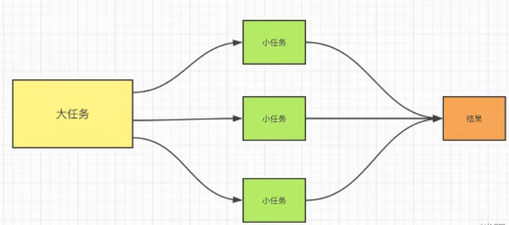
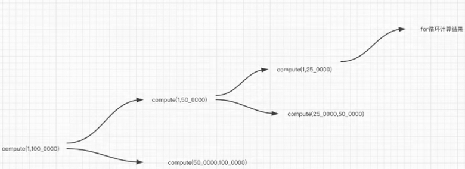

# List<Runnable>的并行任务

以下是一个简单的 Java 多线程并行处理的示例代码：

```java
import java.util.ArrayList;
import java.util.List;

public class ParallelProcessingDemo {

    public static void main(String[] args) {
        // 创建一个任务列表
        List<Runnable> tasks = new ArrayList<>();
        tasks.add(new Task("Task 1"));
        tasks.add(new Task("Task 2"));
        tasks.add(new Task("Task 3"));
        tasks.add(new Task("Task 4"));

        // 创建线程列表
        List<Thread> threads = new ArrayList<>();

        // 启动线程并开始执行任务
        for (Runnable task : tasks) {
            Thread thread = new Thread(task);
            thread.start();
            threads.add(thread);
        }

        // 等待所有线程执行完毕
        for (Thread thread : threads) {
            try {
                thread.join();
            } catch (InterruptedException e) {
                e.printStackTrace();
            }
        }

        System.out.println("All tasks completed.");
    }

    static class Task implements Runnable {
        private final String name;

        public Task(String name) {
            this.name = name;
        }

        @Override
        public void run() {
            System.out.println("Executing " + name + " in thread " + Thread.currentThread().getName());
            // 执行任务逻辑
            try {
                Thread.sleep(2000);
            } catch (InterruptedException e) {
                e.printStackTrace();
            }
            System.out.println("Completed " + name + " in thread " + Thread.currentThread().getName());
        }
    }
}
```

在上述示例中，我们创建了一个 `ParallelProcessingDemo` 类，其中包含一个 `Task` 内部类实现了 `Runnable` 接口。`Task` 类代表要并行处理的任务。

在 `main` 方法中，我们创建了一个任务列表 `tasks`，其中包含了四个任务。然后，我们创建了一个线程列表 `threads`，用于存储线程对象。

接下来，我们使用 `for` 循环遍历任务列表，并为每个任务创建一个线程对象。我们启动线程并将其加入到线程列表中。

最后，我们使用另一个 `for` 循环等待所有线程执行完毕，通过调用 `join` 方法实现。最后打印出所有任务完成的消息。

运行该示例代码，你将看到任务以并行方式在多个线程中执行。

请注意，在实际应用中，你可能需要根据具体需求进行更复杂的线程管理和任务处理。上述示例提供了一个基本的框架，你可以根据自己的业务逻辑和需求进行进一步的定制和扩展。

# java8~CompletableFuture
CompletableFuture是Java 8引入的一个类，用于处理异步编程和并发操作。它提供了一种简洁而强大的方式来处理异步任务的结果和操作。

在实际项目中，CompletableFuture可以用于以下情况：

1. 异步任务的执行和组合：CompletableFuture 可以用于执行异步任务，并在任务完成后获取其结果。你可以使用 `CompletableFuture.supplyAsync()`、`CompletableFuture.runAsync()` 等方法创建一个 CompletableFuture 对象，并在其中定义任务的逻辑。你还可以使用 `thenApply()`、`thenAccept()`、`thenRun()` 等方法将多个 CompletableFuture 对象组合起来，实现任务的串行或并行执行。

2. 异步任务的转换和处理：CompletableFuture 提供了一系列的方法，如 `thenApply()`、`thenCompose()`、`thenCombine()` 等，用于对异步任务的结果进行转换和处理。这些方法可以帮助你在任务完成后对结果进行进一步的操作，例如将结果映射为另一种类型、组合多个任务的结果等。

3. 异常处理和超时控制：CompletableFuture 具有异常处理的能力，你可以使用 `exceptionally()`、`handle()` 等方法来处理异步任务中可能出现的异常情况。此外，你还可以使用 `completeOnTimeout()`、`orTimeout()` 等方法设置任务的超时时间，以便在任务执行超过指定时间后进行相应的处理。

4. 并发任务的等待和组合：CompletableFuture 支持等待多个 CompletableFuture 完成后再执行下一步操作。你可以使用 `allOf()` 方法等待多个任务全部完成，或者使用 `anyOf()` 方法等待任意一个任务完成。这种能力可以用于在多个并发任务完成后进行下一步的处理，如数据聚合、结果合并等。

5. 异步任务的并行执行：CompletableFuture 可以很方便地实现异步任务的并行执行。你可以创建多个 CompletableFuture 对象，并通过 `CompletableFuture.allOf()` 方法等待它们全部完成。这样可以提高任务的执行效率，特别是在处理大量数据或需要并行执行多个独立任务的场景中。

总之，CompletableFuture 是一个强大的工具，可以简化异步编程和并发操作，并提供了丰富的方法来处理异步任务的结果和异常。在实际项目中，你可以根据具体需求和场景灵活应用 CompletableFuture，以实现高效、可靠的异步编程。

程并行处理的示例代码：

```java
import java.util.ArrayList;
import java.util.List;
import java.util.concurrent.CompletableFuture;
import java.util.concurrent.ExecutorService;
import java.util.concurrent.Executors;
import java.util.concurrent.TimeUnit;

public class ParallelProcessingDemo {

    public static void main(String[] args) throws Exception {
        // 创建一个任务列表
        List<Runnable> tasks = new ArrayList<>();
        tasks.add(() -> performTask("Task 1"));
        tasks.add(() -> performTask("Task 2"));
        tasks.add(() -> performTask("Task 3"));
        tasks.add(() -> performTask("Task 4"));

        // 创建线程池
        ExecutorService executorService = Executors.newFixedThreadPool(tasks.size());

        // 使用 CompletableFuture 来提交任务并获取结果
        List<CompletableFuture<Void>> futures = new ArrayList<>();
        for (Runnable task : tasks) {
            CompletableFuture<Void> future = CompletableFuture.runAsync(task, executorService);
            futures.add(future);
        }

        // 等待所有任务完成
        CompletableFuture.allOf(futures.toArray(new CompletableFuture[0])).get();

        // 关闭线程池
        executorService.shutdown();
        executorService.awaitTermination(1, TimeUnit.MINUTES);

        System.out.println("All tasks completed.");
    }

    private static void performTask(String taskName) {
        System.out.println("Executing " + taskName + " in thread " + Thread.currentThread().getName());
        // 执行任务逻辑
        try {
            Thread.sleep(2000);
        } catch (InterruptedException e) {
            e.printStackTrace();
        }
        System.out.println("Completed " + taskName + " in thread " + Thread.currentThread().getName());
    }
}
```

在上述代码中，我们使用了 `ExecutorService` 来创建一个线程池，并使用 `CompletableFuture` 来提交任务和获取结果。

首先，我们创建了一个任务列表 `tasks`，其中包含了四个任务。然后，我们创建了一个固定大小的线程池 `executorService`，大小与任务列表中的任务数量相同。

接下来，我们使用 `CompletableFuture` 的 `runAsync` 方法将每个任务提交给线程池执行，并将返回的 `CompletableFuture` 添加到 `futures` 列表中。

使用 `CompletableFuture.allOf` 方法，我们等待所有任务的完成。这里，我们将 `futures` 列表转换为 `CompletableFuture` 数组，并传递给 `allOf` 方法。通过调用 `get` 方法，我们可以阻塞等待所有任务的完成。

最后，我们关闭线程池并等待所有线程的终止，然后打印出所有任务完成的消息。

这种方式利用了 Java 8 提供的函数式编程特性，可以更清晰、简洁地实现多线程并行处理，同时还能获得任务的执行结果。

请注意，在实际应用中，你可以根据需要调整线程池的大小和其他配置，以及使用 `CompletableFuture` 的其他方法来处理异常、处理任务结果等。

使用 `ExecutorService` 和 `CompletableFuture` 可以更好

地控制和管理多线程并行处理，同时提供了更强大的功能和灵活性。

## ForkJion框架

ForkJoin 是 JDK 1.7 后发布的多线程并发处理框架，功能上和 JUC 类似，JUC 更多时候是使用单个类完成操作，ForkJoin 使用多个类同时完成某项工作，处理上比 JUC 更加丰富，实际开发中使用的场景并不是很多，互联网公司真正有高并发需求的情况才会使用。

本质上是对线程池的一种的补充，对线程池功能的一种扩展，基于线程池的，它的**核心思想就是将一个大型的任务拆分成很多个小任务，分别执行，最终将小任务的结果进行汇总，生成最终的结果**。



> 本质就是把一个线程的任务拆分成多个小任务，然后由多个线程并发执行，最终将结果进行汇总。

比如 A B 两个线程同时还执行，A 的任务比较多，B 的任务相对较少，B 先执行完毕，这时候 B 去帮助 A 完成任务（将 A 的一部分任务拿过来替 A 执行，执行完毕之后再把结果进行汇总），从而提高效率。

## ForkJoin 框架，核心是两个类

* ForkJoinTask （描述任务）
* ForkJoinPool（线程池）提供多线程并发工作窃取

使用 ForkJoinTask 最重要的就是要搞清楚如何拆分任务，这里用的是递归思想。
1、需要创建一个 ForkJoinTask 任务，ForkJoinTask 是一个抽象类，不能直接创建 ForkJoinTask 的实例化对象，开发者需要自定义一个类，
继承 ForkJoinTask 的子类 RecursiveTask ，Recursive 就是递归的意思，该类就提供了实现递归的功能。


```java
import java.util.concurrent.RecursiveTask;

/**
 * 10亿求和
 */
public class ForkJoinDemo extends RecursiveTask<Long> {

    private Long start;
    private Long end;
    private Long temp = 100_0000L;

    public ForkJoinDemo(Long start, Long end) {
        this.start = start;
        this.end = end;
    }

    @Override
    protected Long compute() {
        if((end-start)<temp){
            Long sum = 0L;
            for (Long i = start; i <= end; i++) {
                sum += i;
            }
            return sum;
        }else{
            Long avg = (start+end)/2;
            ForkJoinDemo task1 = new ForkJoinDemo(start,avg);
            task1.fork();
            ForkJoinDemo task2 = new ForkJoinDemo(avg,end);
            task2.fork();
            return task1.join()+task2.join();
        }
    }
}
```

测试上面的代码

```java
import java.util.concurrent.ExecutionException;
import java.util.concurrent.ForkJoinPool;
import java.util.concurrent.ForkJoinTask;

public class Test {
    public static void main(String[] args) {
        Long startTime = System.currentTimeMillis();
        ForkJoinPool forkJoinPool = new ForkJoinPool();
        ForkJoinTask<Long> task = new ForkJoinDemo(0L,10_0000_0000L);
        forkJoinPool.execute(task);
        Long sum = 0L;
        try {
            sum = task.get();
        } catch (InterruptedException e) {
            e.printStackTrace();
        } catch (ExecutionException e) {
            e.printStackTrace();
        }
        Long endTime = System.currentTimeMillis();
        System.out.println(sum+"，供耗时"+(endTime-startTime));
    }
}
```

是的，你可以使用 ForkJoinPool 来处理一个大的 List 对象，并一次返回所有处理结果。这里提供一个示例，假设你有一个需要处理的 List 对象，其中的元素是 `String` 类型，你需要将所有字符串转换为大写并返回结果。示例代码如下：

```
import java.util.ArrayList;
import java.util.List;
import java.util.concurrent.ForkJoinPool;
import java.util.concurrent.RecursiveTask;

public class UppercaseTask extends RecursiveTask<List<String>> {
    private static final int THRESHOLD = 10;
    private List<String> list;
    private int start;
    private int end;

    public UppercaseTask(List<String> list, int start, int end) {
        this.list = list;
        this.start = start;
        this.end = end;
    }

    @Override
    protected List<String> compute() {
        if (end - start <= THRESHOLD) {
            List<String> results = new ArrayList<>(end - start + 1);
            for (int i = start; i <= end; i++) {
                String str = list.get(i).toUpperCase();
                results.add(str);
            }
            return results;
        } else {
            int mid = start + (end - start) / 2;
            UppercaseTask leftTask = new UppercaseTask(list, start, mid);
            UppercaseTask rightTask = new UppercaseTask(list, mid + 1, end);
            leftTask.fork();
            rightTask.fork();
            List<String> leftResult = leftTask.join();
            List<String> rightResult = rightTask.join();
            leftResult.addAll(rightResult);
            return leftResult;
        }
    }

    public static void main(String[] args) {
        List<String> list = new ArrayList<>();
        for (int i = 0; i < 100; i++) {
            list.add("String_" + i);
        }

        ForkJoinPool forkJoinPool = ForkJoinPool.commonPool();
        UppercaseTask uppercaseTask = new UppercaseTask(list, 0, list.size() - 1);
        List<String> results = forkJoinPool.invoke(uppercaseTask);
        System.out.println(results);
    }
}
```

上述代码中，我们定义了一个 `UppercaseTask` 类，继承 `RecursiveTask` 类，任务是将指定范围内的 List 中的所有 String 转换为大写。如果任务量小于 THRESHOLD，就顺序处理，否则就将任务划分为两个子任务，分别处理子任务中的 List，最后将子任务的处理结果合并。

在 main() 方法中，我们创建了一个 List 对象，填充一些字符串，然后创建一个 ForkJoinPool 对象，调用 invoke() 方法执行 `UppercaseTask` 对象，得到处理结果，返回的是一个 List 对象，其中包含了所有元素转换为大写后的值。这里需要注意的是，最好在主线程中创建 ForkJoinPool 实例，避免在 ForkJoinPool 中出现线程的上下文切换，从而提高效率。
