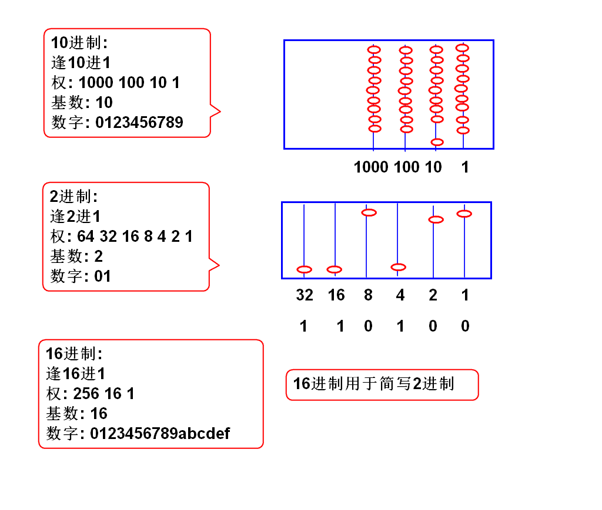
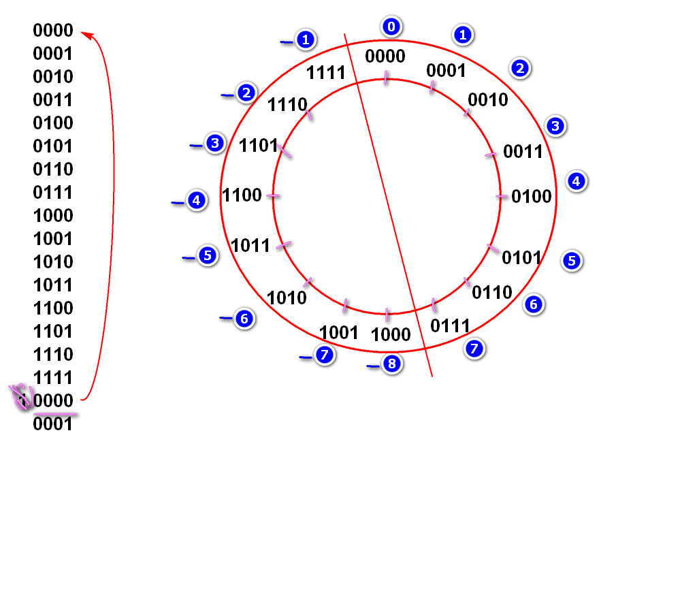

新手程序员在程序开发过程中, 常常会碰到各种各样的乱码问题, 这都是因为对于字符编码理解不清导致的, 这里简单总结一下.

# 二进制

## 2进制在哪里?

计算机内部 **只有** 2进制数据!

```java
// 变量i是2进制数据!!!
int i = 50;
// 输出i的实际上2进制数据
System.out.println(Integer.toBinaryString(i));
// 输出方法调用了 Integer.toString()将2进制转换为10进制, 然后再输出
System.out.println(i);// "50"
```

Java编程语言, 编程语言利用算法支持10进制, 使用用户感受上可以使用10进制!

显示2进制数据

```java
int i = 50;// Integer.parseInt();
System.out.println(Integer.toBinaryString(i));
```

- Java 如何接收10进制数据:  Integer.parseInt();

  - 将10进制字符串转换为2进制int
- Java 如何输出10进制数据:  Integer.toString();

  - 将2进制int转换为10进制字符串

  Scanner in = new Scanner(System.in);
  int n = in.nextInt();// 底层调用了 Integer.parseInt();

## 什么是2进制

逢2进1的计数规则



## 16进制

```java
// 0111_1111 1111_1111 1111_1111 1111_1111
// 7    f    f    f    f    f    f    f
int max = 0x7fffffff;
System.out.println(max);
System.out.println(Integer.toBinaryString(max));
long m = 0x7fffffffffffffffL;
System.out.println(m);
System.out.println(Long.toBinaryString(m));

// 1000_0000 0000_0000 0000_0000 0000_0000
// 8    0    0    0    0    0    0    0
int min = 0x80000000;
System.out.println(min);
System.out.println(Integer.toBinaryString(min));

int n = Integer.MAX_VALUE;
int k = Integer.MIN_VALUE;
int x = k - n;
System.out.println(x);
```

16进制用于简写2进制

4位2进制可以简写为一位16进制数字


经典面试题:

int i = 0x32; //0011 0010
System.out.println(i);
如上代码输出结果(  ) 
答案: 50

int i = 0xac;  
System.out.println(i);
如上代码输出结果(  ) 
答案:  
## 补码

计算机处理 **有符号数(负数)** 问题的算法.

补码算法: 4位数补码

规则:

1. 总的位数是4位数
2. 如果计算结果超过4位自动溢出舍弃



经典面试题目:

int n = 0xffffffff;
System.out.println(n);
如上代码输出结果是:( )
A.2147483647 B.-2147483648 C.-2147483647 D.-1
答案: D


判断对错: 正数相加溢出结果是负数?
答案: 错!


System.out.println(~8+1);
输出结果是(  )
答案: -8

System.out.println(~8);
输出结果是(  )
答案: -9

System.out.println(~-8);
输出结果是(  )
答案: 7 
##　2进制运算符

`~`  取反(非)
`&`  与运算
`|`  或运算
`>>>` 逻辑右移动运算
`>>`  数学右移动运算
`<<`  左移动运算

`&`  与运算

0 & 0 = 0
0 & 1 = 0
1 & 0 = 0
1 & 1 = 1

n = 01001001 01110111 10101010 01010101
m = 00000000 00000000 00000000 00111111
 &---------------------------------------
k =	00000000 00000000 00000000 00010101

int n = '中';
int m = 0x3f;
int k = n&m;
println(Integer.toBinaryString(n));
println(Integer.toBinaryString(m));
println(Integer.toBinaryString(k));
`|`  或运算(逻辑+)

0 | 0 = 0
0 | 1 = 1
1 | 0 = 1
1 | 1 = 1

n = 00000000 00000000 00000000 00101101
m = 00000000 00000000 00000000 10000000
 | ----------------------------------------
k = 00000000 00000000 00000000 10101101

int n = 0x2d;
int m = 0x80;
int k = n | m;
println(Integer.toBinaryString(n));
println(Integer.toBinaryString(m));
println(Integer.toBinaryString(k));
`>>>` 逻辑右移动运算

n =       00100010 01111010 10101010 10111011
m = n>>>1 000100010 01111010 10101010 1011101 
k = n>>>2 0000100010 01111010 10101010 101110

int n = 0x227aaabb;
int m = n>>>1;
int k = n>>>2;
int j = n>>>6;
//按照2进制输出


```java
int c = '中';
int m = 0x3f;
int b3 = (c & m)|0x80;
System.out.println(Integer.toBinaryString(c));
System.out.println(Integer.toBinaryString(m));
System.out.println(Integer.toBinaryString(b3));
int b2 = ((c>>>6) & m)|0x80;
System.out.println(Integer.toBinaryString(b2));

int b1 = (c>>>12) | 0xe0;
System.out.println(Integer.toBinaryString(b1));

// JDK 提供了 utf-8 到char的解码
byte[] bytes={(byte)b1,(byte)b2,(byte)b3};
String s = new String(bytes, "utf-8");
System.out.println(s); // "中"

// 将utf-8 b1 b2 b3 解码为 unicode字符 
int ch =(b3&0x3f) | ((b2&0x3f)<<6) | ((b1&0xf)<<12);
System.out.println((char)ch);
```
## 移位运算的数学意义

移动小数点运算:

124238.  小数点向右移动
1242380. 小数点向右移动 1次, 数值*10
12423800. 小数点向右移动 2次, 数值*10*10

假设小数点位置不变

  124238. 数字向左移动
 1242380. 数字向左移动 1次, 数值*10
12423800. 数字向左移动 2次, 数值*10*10
2进制数字移动, 与10进制数字移动规律相同: 2进制数值向左移动一次, 数值*2

n    = 00000000 00000000 00000000 00110010. = 50
n<<1 = 0000000 00000000 00000000 001100100. = 100
n<<2 = 000000 00000000 00000000 0011001000. = 200
案例:

int n = 50;
int m = n<<1;
println(m); //100
`>>` 数学右移位计算:

1. 相当于将原数据进行除法, 结果向小方向取整数.
2. `>>` 数学移位: 正数高位补0, 负数高位补1, 有数学意义
3. `>>>` 逻辑移位: 高位补0, 负时候没有数学意义

案例:

n    = 11111111 11111111 11111111 11110111  -9
n>>1 = 111111111 11111111 11111111 1111011  -5
n>>>1= 011111111 11111111 11111111 1111011  很大
案例:

...
> 一般情况下单纯的将数字向右移动, 请使用 `>>>`

面试题:

优化 n*8 的计算为 (   )
答案: n<<3

优化 n*16 的计算为 (   )
答案: n<<4
## 作业

1. 实现utf-8编码算法:

   public byte[] utf8(char ch){}
2. 实现utf-8编码算法:

   public byte[] utf8(String ch){}

> 必须使用String的解码算法建议编码是否正确

# 一. 二进制编码

## 1. 数值的二进制存储

## 2. 位运算

## 3. unicode 与 UTF-8

# █ 各种编码详解

## ASCII

最基本的编码, 占用空间一字节, 共8位, 最高位始终为0, 剩余有效位数7位.

0-31号, 共32个, 为控制码, 控制打印机等设备的行为

31-127, 共96个, 为具体字符编码, 包括数字, 英文字母, 常见标点符号.


## ISO-8859-1

字符集
作用：扩展ASCII，表示西欧、希腊语等。
位数：8位，
范围：从00到FF，兼容ASCII字符集。

## ANSI

ANSI 原意是指美国国家标准学会(American National Standard Institute), 他们制定了最初的 ASCII 编码.

但由于各国都有计算机使用要求, 就都在 ASCII 基础上进行了扩展, 形成了各种语言的字符集. 这些在 ASCII 基础上扩展而来的字符集, 统称为 ANSI 字符集. 注意 ANSI 字符集不是具体的某一个字符集, 而是一系列的字符集族.

在 Windows 系统中, 通常指的是系统默认的本地化编码, 不同语言版本的windows 系统环境下, ANSI 指代的具体字符集也不同. 如简体中文版里指的是 **GBK**, 繁体中文版指的是 **BIG5**, 日文韩文等系统还有其他字符集.

## GB系列

包括 GB2312, GBK, GB18030 等

### GB2312

中国对 ASCII 扩展而来的简体中文字符集.  变长字符集, 用1-2个字节来确定一个字符

前 128 个编码兼容 ASCII, 后续的汉字编码收录了常见的中文字符. 总共收录7445个符号，包括6763个汉字.

- 单字节时, 最高位为0, 即小于等于127, 则这个字节独立表示一个字符, 与 ASCII 兼容;
- 双字节时, 以2个首位为1的字节, 共16位确定一个字符. 高字节在 A1-F7 之间,  低字节在 A1-FE 之间.

可以结合"区位码"来理解, GB2312 对收录的字符进行分区, 从01-94共94个区(0x5E), 每个区有94个位(0x5E), 即区位码的范围为 0101-5E5E, 又因与 ASCII 有冲突, 约定高低字节均加上0xA0作为偏移量, 即得到 GB2312 的实际编码区域落在 A1A1-FEFE, 部分区未被使用, 某些分区内有部分位点作为隔离带, 未定义具体字符.

GB2312 除了定义汉字, 还将英文字母和数字定义了一遍, 这些新的字母数字字符需要用2个字节来表示, 即为全角字符, 原来 ASCII 的字母和数字, 就是半角字符.

### GBK

GB2312 的扩展, 也是 Windows 简体中文版的 ANSI 真正的字符集. 共收入21886个汉字和图形符号, 增加了繁体字, 中日韩统一汉字以及一些符号..

由于 GB2312 高低字节都偏移0xA0, 低字节首位也是1, 浪费了许多码位, 实际上只要第一个字节的首位为1, 就可以表示是一个汉字编码的一部分, 与后续一个字节共同确定一个字符.

因此, GBK 就是在这些空闲码位上, 高字节添加了 81-9F 为新增的区, 低字节添加了 40-9F 为新增的位, 然后在这些新增的区位中定义了较少用的汉字和符号(特别的, 低字节7F不使用).

- 单字节同 ASCII
- 双字节时, 总体编码范围为 8140-FEFE 之间，高字节在 81-FE 之间，低字节在 40-FE 之间，剔除 XX7F 一条线

### GB18030

中国还有很多少数民族有自己的语言和文字, GBK 还是不够用, 继续扩展出了 GB18030, 共收录7万多个字符, 而且持续增加中.

我们知道 GBK 编码规则, 高字节大于81, 低字节大于40, 低字节还有小于40的部分可以用. 于是约定了4字节表示法, 如果第二字节不是 GBK 有效编码, 就再加上后面两个字节, 用四个字节来确定一个字符.

- 单字节同 ASCII
- 双字节同 GBK
- 四字节第一三字节从81-FE，第二四字节从30-39

## UNICODE

由于不同国家和地区, 出于自己的需要, 各自扩展了 ASCII , 彼此之间互不兼容, 不利于国际间的交流.

为了解决这个问题, 提出了 unicode, unicode 只是字符集编号, 但不涉及具体在文件中如何存储.

常用的 unicode 标准为 UCS-2, 使用2个字节共16位来给全球字符编号,

后续提出了 UCS-4, 使用4字节共32位来给全球字符编号

### UTF

UCS Transfer Format

直接将字符以unicode编码存储, 需要占用2个字节共16位, 故称为 UTF-16.

但涉及到一个问题. 由于unicode 需要两个字节来存储, 而不同的系统对于高低字节的读取顺序不一样, 因此需要约定读取顺序,

UNICODE 规范中约定, 在每个按照 unicode 编码的文件中, 需要添加一个编码顺序的字符, 称为 "零宽度非换行空格", 其十六进制表示为 `FEFF`, 正好是两个字节.

- FF 比 FE 按顺序递增, 为正序, 大头方式, 高字节在前, 低字节在后
- FF 比 FE 按顺序递增, 为逆序, 小头方式, 低字节在前, 高字节在后

比如汉字"中", unicode 编码为 4E2D, 用不同的方式保存到文本文件中, 编码结果如下表所示.


| 编码方式              | 编码标记 | 正文(HEX) | 正文(BIN)                                |
| --------------------- | -------- | --------- | ---------------------------------------- |
| unicode little endian | FF FE    | 2D 4E     | 00101101, 01001110                       |
| unicode big endian    | FE FF    | 4E 2D     | 01001110, 00101101                       |
| UTF-8                 | -        | E4 B8 AD  | 1110**0100**, 10**111000**, 10**101101** |
| UTF-8 with BOM        | EF BB BF | E4 B8 AD  | 1110**0100**, 10**111000**, 10**101101** |
| GB系列                |          | D6 D0     | 1101 0110, 1101 0000                     |

# █ 开发中的乱码问题

由于有多种编码的存在, 如果数据收发双发的编码设置不一致, 就会出现乱码问题.

要解决乱码问题, 就需要为数据传输的全过程中统一编码方案.

为了更好的支持跨平台和国际化, 建议将所有地方都统一成 UTF-8 编码方式.

## 文本文件的编码

## 系统的默认编码

linux 默认 utf-8, windows 简体中文版默认 GBK

## 开发中的编码设置

#### 项目文件乱码

eclipse, 将项目编码, 以及新增文件编码, 都设置为 UTF-8 需要为文件

idea, 将项目编码, 以及新增文件编码, 都设置为 UTF-8

#### idea部分插件乱码

#### tomcat输出控制台乱码

#### jvm 输出

#### get 请求参数乱码

tomcat, 将 URIEncoding 设置为 UTF-8

#### post 请求参数乱码

web.xml, 添加 encoding 的 filter

#### http 返回值乱码

spring, 将字符串返回编码设置为 UTF-8

数据库
