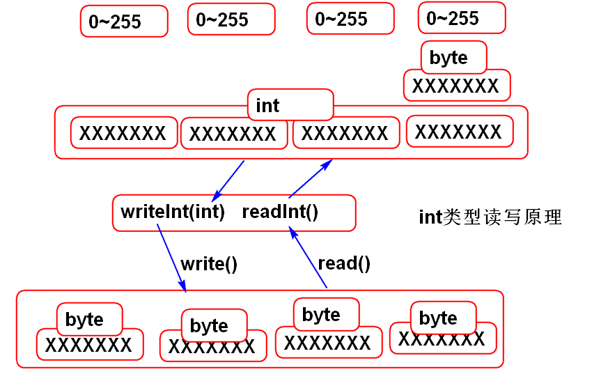

# 文件操作

## File

Java 程序中创建`File`对象来代表文件夹、文件, 利用`File`对象提供方法操作文件夹、文件

| 方法              | 描述                                                         |
| ----------------- | ------------------------------------------------------------ |
| exists()          | 判断文件是否存在                                             |
| isDirectory()     | 判断是否文件夹                                               |
| isFile()          | 判断是否文件                                                 |
| length()          | 获取文件长度                                                 |
| lastModified()    | 获取最后修改时间                                             |
| canRead()         | 判断是否可读                                                 |
| canWrite()        | 判断是否可写                                                 |
| isHidden()        | 判断是否隐藏文件                                             |
| mkdir()           | 创建文件夹                                                   |
| mkdirs()          | 创建一系列父子文件夹                                         |
| createNewFile()   | 创建新文件                                                   |
| delete()          | 删除文件或空文件夹, 但不能删除非空文件夹. 非空文件夹要递归删除 |
| renameTo(newName) | 将名字改名为file2对应的名字                                  |
| listFiles()       | 查询文件夹的内容列表返回值是File类型的数组，有的是文件, 有的是文件夹 |

### 递归删除文件夹的内容

```java
public static void main(String[] args) {
    File file = new File("abc");
    boolean b=delete(file);
    System.out.println(b); 
}
// 删除一个包含文件的文件夹 
public static boolean delete(File dir){
    if(! dir.exists()){
        return false;
    }
    File[] files=dir.listFiles();
    for(File file:files){
        if(file.isDirectory()){
            delete(file);
        }else{
            file.delete();
        }
    }
    return dir.delete();
}
```

### 递归统计文件夹的大小

```java
public static void main(String[] args) {
    File dir = new File("abc");
    long n = count(dir);
    System.out.println(n); 
}
//统计dir对应的文件夹中文件的总大小
public static long count(File dir){
    if(!dir.exists()){
        return 0;
    }
    if(dir.isFile()){
        return dir.length();
    }
    File[] files=dir.listFiles();
    long sum = 0;
    for(File file:files){
        if(file.isDirectory()){
            long l = count(file);
            sum += l;
        }else{
            //统计一个文件
            sum += file.length();	
        }
    }
    return sum;
}
```

### 有条件列目录

```java
/**
 * 设置文件的过滤条件
 * File： 文件
 * Filter: 过滤器
 */
public class Demo14 {
	public static void main(String[] args) {
		//FileFilter 是一个接口
		//new FileFilter(){} 创建匿名内部类
		FileFilter filter = new FileFilter(){
			//accept 方法是在FileFilter中定义的抽象方法。
			//accept: 接受，测试文件是否被接受
			public boolean accept(File file){
				//接受一个文件的名是以.txt
				//为结尾的。
				String name=file.getName();
				return name.endsWith(".txt"); 
			}
		};
		
		File file1 = new File("abc/demo1.txt");
		File file2 = new File("abc/test.dat");
		//检查 file1 使用以 .txt 为结尾
		System.out.println(filter.accept(file1));//true
		//检查 file2 使用以 .txt 为结尾
		System.out.println(filter.accept(file2));//false
		
		//listFiles 重载方法，与filter配合
		//可以过滤文件夹内容列表，列出满足
		//条件的文件
		
		File dir=new File("abc");
		//满足过滤条件的全部文件（或文件夹）
		File[] files=dir.listFiles(filter);
		for(File file:files){
			System.out.println(file.getName());
		}
		//有过滤条件的列目录方法
		//listFiles(过滤条件);
	}
}

```

### FileFilter

函数式接口, `accept()` 判断是否满足条件

`dir.listFiles(filter)` 可以获取文件夹下满足条件的文件

```java
public static void main(String[] args) {
    FileFilter filter = new FileFilter(){
        public boolean accept(File file){
            //接受一个文件的名是以.txt 为结尾的。
            String name=file.getName();
            return name.endsWith(".txt"); 
        }
    };

    File file1 = new File("abc/demo1.txt");
    File file2 = new File("abc/test.dat");
    //检查 file1 使用以 .txt 为结尾
    System.out.println(filter.accept(file1));//true
    //检查 file2 使用以 .txt 为结尾
    System.out.println(filter.accept(file2));//false

    //listFiles 重载方法，与filter配合 可以过滤文件夹内容列表，列出满足 条件的文件

    File dir=new File("abc");
    //满足过滤条件的全部文件（或文件夹）
    File[] files=dir.listFiles(filter);
    for(File file:files){
        System.out.println(file.getName());
    }
    //有过滤条件的列目录方法 listFiles(过滤条件);
}
```

## RandomAccessFile

`RandomAccessFile` 可以从文件的任意一个位置开始访问文件的内容, 提供 byte 级别的读写操作。

### byte读写

1. RAF打开文件方式：

   - `r` 以只读方式创建对象,
   - `rw` 以读写方式创建对象, 如果文件不存在, 则在磁盘上自动创建文件
   - `rws`
   - `rwd`

2. RAF 通过指针来控制读写的位置, 可以从文件的任何位置读写文件, 打开文件时默认为0

   - 获取当前指针位置 `getFilePointer()`
   - 设置指针位置 `seek(目标位置)`

3. 基本的读写方法, 一次操作一个byte, 读写指针会自动移动

   - `read()`  读取一个byte
   - `write()` 写出一个byte

4. 文件读写完毕以后需要 `close()`关闭文件

```java
public static void main(String[] args) throws Exception {
    String file = "abc/demo.txt";
    // 以读写方式创建RAF对象, 指针初始位置为 0
    RandomAccessFile raf = new RandomAccessFile(file, "rw");
    System.out.println(raf.getFilePointer());

    // 将数据写到文件中, 每写一个byte, 指针移动一个位置
    for (int i = 0; i <= 10; i++) {
        raf.write(i);
        System.out.println(raf.getFilePointer());
    }
    // 检查文件的长度
    System.out.println(raf.length());

    // 移动指针到5, 读取后面的内容
    raf.seek(5);
    int b;
    System.out.println(raf.getFilePointer());
    // 到达文件末尾时, read()返回-1
    while ((b = raf.read()) != -1) {
        System.out.println(b);
    }

    // 读写操作完成后, 需要close()关闭文件
    raf.close();
}
```

### 基本类型读写

在基本读写方法之上，RAF 还提供了Java8种基本类型的读写方法, 会读取相应数量的byte, 并转换为指定类型, 底层是 `read()` 和`write()` 方法。

- `readInt`/`writeInt`  每次读写4个byte
- `readDouble`/`writeDouble`  每次读写8个byte

- …

```java
public static void main(String[] args) throws Exception{
    String file = "abc/integer.dat";
    RandomAccessFile raf = new RandomAccessFile(file, "rw");
    //将int数据126712 拆分为4个byte写到文件中，文件指针连续移动4次
    raf.writeInt(126712); 
    long p = raf.getFilePointer();
    System.out.println(p);
    
    //读取一个整数: 连续读取4个byte，拼接为一个int数据, 文件指针连续移动4次
    raf.seek(0);
    int n = raf.readInt();
    p = raf.getFilePointer();
    System.out.println(p);//4
    System.out.println(n);//126712
    raf.close();
}
```

以 int 为例, 基本类型的读写原理如图所示



### String的读写

Java中, String 存储的是 char 数据，不能直接IO，需要先进行编码，编码为byte数据再进行读写。常见的编码方案是 UTF-8.

- 内存中的字符串是`char`数据，不是`byte`类型
- 写出字符串：
  - 先用`str.getBytes(编码方式)`需要将字符串按要求进行编码, 转为 `byte[]` 数据
  - 然后`raf.write(byte[])`写到文件中
- 读取字符串
  - 读取`raf.read(buf)`读取指定长度的 byte[] 数据
  - 使用 `new String(byte[], 编码格式` 构造字符串
- 注意读写编码一致
  - 文字信息必须经过编码才能写到文件中。
  - 读取文件时候需要进行解码处理。 
  - 如果编码和解码的规则不一致就会出现乱码问题
  - 如果用 raf 写入不同类型数据时, 使用了不同的编码格式, 用 TXT 工具打开文件时可能会乱码

```java
public static void main(String[] args) throws Exception{
    String file = "abc/utf8.txt";
    RandomAccessFile raf = new RandomAccessFile(file, "rw");

    // 对字符串进行UTF-8编码, 再写入文件
    String str = "你好ABC";
    byte[] bytes = str.getBytes("UTF-8");
    raf.write(bytes);
    System.out.println(bytes.length);//9
    System.out.println(raf.getFilePointer());//9

    // 从头读取
    raf.seek(0);
    byte[] buf = new byte[(int) raf.length()];
    // read(bytes) 从文件中连续读取byte数据, 将读取结果填充到 byte数组中
    raf.read(buf);
    // buf 中是按照UTF-8编码的字符数据,解码：
    String s = new String(buf, "UTF-8");
    System.out.println(s);

    raf.close();
}
```

# IO Stream

RAF 提供了文件随机读写功能，但是没有提供复杂数据的读写功能。 Java 提供了另外一套可以灵活扩展的API： IO流。

IO流按照功能可以分为两大类： 

- **节点流**: 节点流是流最原始的数据源，提供流最基本的功能。
- **处理流**: 也称为高级流/过滤流，处理流是在其他流的基础之上扩展出更高级的功能。处理流的核心特点是必须依赖于另外一个流，是对另外的流进行扩展。

IO流在节点流基础之上提供了丰富的的扩展功能，利用这些扩展流可以大大简化IO程序的开发。 


## 1. 节点流

### 输入流与输出流

流按照数据流向分为输入流和输入流：


- `InputStream` 代表输入流
  - 包含核心方法 `read()`
  - 关闭方法 `close()`
- `OutputStream` 输出流
  - 包含核心方法 `write()`
  - 关闭方法 `close()`

这两个流是抽象类，不能直接使用。在实际工作中使用其实现类

### 文件输出流

文件输出流节点流，是以文件为目标数据源的节点流，是基本的流，只提供了基本的输出方法`write()`

利用文件节点流打开一个文件, 

- 文件不存在时, 自动创建文件
- 文件存在时, 将文件替换为新文件
- 文件不能写时, 出现异常

如果希望在已有文件上进行编辑, 需要在构造`FileOutputStream`对象时指定`append`模式为`true`

```java
public static void main(String[] args) 
    throws Exception {
    String file="abc/fos.dat";
    // 使用追加模式, 在已有文件的后面追加内容
    // FileOutputStream out = new FileOutputStream(file, true);
    FileOutputStream out = new FileOutputStream(file);
    // 测试基本的 byte 数据写出方法
    // 将byte写到文件中有效范围（0~255）
    out.write(65);
    out.write(66);
    //关闭文件
    out.close();
}
```

### 文件输入流

文件输入节点流，是文件作为数据来源的节点流，也是基础节点流，提供了基本的文件读取功能。

```java
public static void main(String[] args) 
    throws Exception {
    String file="abc/fos.dat";
    //用文件节点输入流打开文件, 如果文件不能打开或者文件不存在就抛出异常
    FileInputStream in = new FileInputStream(file);
    //测试基本的节点流读取方法, 每次从文件中读取一个byte(0~255)
    int b1 = in.read();
    int b2 = in.read();
    System.out.println(b1);
    System.out.println(b2);
    in.close();
}
```

### 复制文件

将文件输入流与文件输出流连接起来，就可以实现文件的复制功能：

```java
public static void main(String[] args) throws Exception{
    // 用节点流打开 原始输入文件 和 目标输出文件
    FileInputStream in = new FileInputStream("d:/TETRIS.zip");
    FileOutputStream out = new FileOutputStream("d:/TETRIS_new.zip");

    //从in里读取每个byte写到out流中
    int b;
    while((b = in.read()) != -1){
        //b代表原始文件中的每个byte
        out.write(b); 
    }
    //关闭节点流
    in.close(); 
    out.close();
    System.out.println("成功！");
}
```

上述例子每次只操作一个 byte, 效率很低, 利用缓存读写方法可以大大改善性能.

为了避免最后一次复制多余的byte必须使用 `out.write(buf, 0, n)` 方法。

```java
public static void main(String[] args)  throws Exception{
    //打开输入文件/输出文件
    FileInputStream in = new FileInputStream("d:/TETRIS.zip");
    FileOutputStream out = new FileOutputStream("d:/TETRIS_new.zip");
    
    byte[] buf=new byte[1024*8];//1K byte
    //从输入流in中读取尽可能多的byte填充到缓存 buf 中，返回读取个数 1024
    //int n = in.read(buf);//1024
    //int n = in.read(buf);//1024
    //...
    //n = in.read(buf); // 1 ~ 1024
    //n = in.read(buf); // -1
    int n;
    while((n = in.read(buf))!=-1){
        //将buf中从0开始的连续 n 个 byte 写到文件流out中
        out.write(buf, 0, n);
    }
    in.close();
    out.close();
    System.out.println("OK!");
}
```

## 2. 处理流

### 缓冲流

Java提供了使用简便的高级扩展流： 缓冲流

1. 缓冲流必须依赖一个基础流，如：节点流
2. 缓冲流可以在不改变原有算法逻辑情况下，为流提供缓冲区，可以加快系统IO性能。

```java
public static void main(String[] args) throws Exception{
    //打开原始输入文件, 套上缓冲流
    FileInputStream fis = new FileInputStream("d:/TETRIS.zip");
    BufferedInputStream in = new BufferedInputStream(fis);

    //打开目标的输出文件, 套上缓冲流
    FileOutputStream fos = new FileOutputStream("d:/TETRIS_new.zip");
    BufferedOutputStream out = new BufferedOutputStream(fos); 
    //从in里读取每个byte写到out流中
    int b;
    while((b=in.read())!=-1){
        //b代表原始文件中的每个byte
        out.write(b); 
    }
    //关闭in，out即可
    in.close(); 
    out.close();
    System.out.println("成功！");
}
```

### 清空缓存的问题

有时候, 写出文件的时候会丢失最后的部分内容, 原因在于部分缓存还未来得及写入文件. 

可以使用 `flush()`清空缓存，将数据立即写的文件中。输出缓冲流的 `close()` 已经包含了`flush()`.

```java
public static void main(String[] args) throws Exception{
    String file="abc/test.txt";
    FileOutputStream fos = new FileOutputStream(file);	
    BufferedOutputStream out = new BufferedOutputStream(fos);
    // 缓存流将数据写到缓存中, 当缓存满了的时候, 再成批（8K）的写到文件中
    out.write(65);
    out.write(66);
    out.write(66);
    // 将缓存清空, 数据写到文件中
    // 清空缓存, 文件不关闭可以继续写文件
    out.flush();
    out.write(67); 
    // 关闭方法包含清空缓存的功能
    // out.close();
    // out.write(67); //不能再写文件了
}
```

## 3. 字符流

Java提供了字符处理流，字符处理流都是高级流，都需要依赖低级的字节流，字符流在低级流基础上扩展出字符的编码和解码功能，利用字符流可以简便的处理文本文件。

> 注意：字符流只能处理文本文件！！

字符输出流 `OutputStreamWriter`：

```java
public static void main(String[] args) throws Exception {
    String file = "abc/osw.txt";
    FileOutputStream fos = new FileOutputStream(file);
    BufferedOutputStream bos = new BufferedOutputStream(fos);
    OutputStreamWriter writer = new OutputStreamWriter(bos, "utf-8");
    //将字符输出到文件
    //将30000（田）编码为UTF-8的byte数据, 并且将byte写到文件中。
    writer.write(30000); 
    writer.write("田地");
    char[] chs = {'你','好','J','A','V','A'};
    writer.write(chs);
    writer.write(chs,2,4);
    //关闭高级流就可以关闭文件了
    writer.close();
}
```

字符输入流 `InputStreamReader`：

```java
public static void main(String[] args) throws Exception{
    String file="abc/osw.txt";
    FileInputStream fis= new FileInputStream(file);
    BufferedInputStream bis= new BufferedInputStream(fis);
    InputStreamReader reader = new InputStreamReader(bis, "utf-8");
    //读取字符,返回0~65535之间的字符
    int c;
    while((c = reader.read())!=-1){
        char ch = (char)c;
        System.out.println(ch); 
    }
    reader.close();
}
```

## 4. 高级字符流

### PrintWriter

PrintWriter 是高级流, 提供了整行的写入方法`println`,  是最常用的流之一, 经常用于写文本文件。

注意指定编码格式.

```java
public static void main(String[] args) throws Exception{
    FileOutputStream fos = new FileOutputStream("abc/pw.txt");
    BufferedOutputStream bos= new BufferedOutputStream(fos);
    OutputStreamWriter osw = new OutputStreamWriter(bos, "utf-8");
    // true 自动清理缓存功能，每个println方法之后会执行一个 flush方法
    PrintWriter out=new PrintWriter(osw, true);
    out.println("Hello World!");
    out.close();
}
```

### BufferedReader 

`BufferedReader` 是高级流，提供了整行的读取方法`readLine`，是最常用的文本文件读取流。

```java
public static void main(String[] args) throws Exception{
    FileInputStream fis = new FileInputStream("abc/day07.md");
    BufferedInputStream bis = new BufferedInputStream(fis);
    InputStreamReader isr = new InputStreamReader(bis,"UTF-8");
    BufferedReader in = new BufferedReader(isr);
    String str;
    while((str=in.readLine())!=null){
        System.out.println(str);
    }
    in.close();
}	
```

# 序列化与反序列化

## 对象输出流 

对象输出流：是高级流，必须依赖其他字节流。

对象写到文件中编码为byte数据写到文件中的过程称为“对象序列化” 反之称为对象反序列化。

Java利用序列化接口自动支持了对象序列化和反序列化，我们需要做的只是实现这个接口。

## Serializable 接口

实现 `Serializable` 接口, 不需要序列化的字段, 使用关键字 `transient` 修饰

```java
public class Person implements Serializable {
    // 序列化版本号，可以保证对象序列化、反序列化的稳定。减少更改类对序列化的影响。
    private static final long serialVersionUID = -44741053724L;
    String name;
    String sex;
    int age;
    // 不需要序列化
    transient Person friend;

    public Person(String name, String sex, int age) {
        super();
        this.name = name;
        this.sex = sex;
        this.age = age;
    }
}
```

## 序列化

使用 `ObjectOutputStream` 序列化

```java
public static void main(String[] args) throws Exception{
    Person p1 = new Person("张三", 10);
    Person p2 = new Person("李四", 10);
    p1.friend = p2;
    //将对象写到文件中
    FileOutputStream fos = new FileOutputStreams("abc/obj.dat");
    BufferedOutputStream bos = new BufferedOutputStream(fos);
    //对象输出流
    ObjectOutputStream oos = new ObjectOutputStream(bos);
    //将对象写到文件中
    oos.writeObject(p1);
    oos.writeObject(p2);
    //关闭高级流就会自动关闭全部流
    oos.close();		
}
```

## 反序列化

使用 `ObjectInputStream` 反序列化

```java
public static void main(String[] args) throws  Exception{
    FileInputStream fis = new FileInputStream("abc/obj.dat");
    BufferedInputStream bis = new BufferedInputStream(fis);
    ObjectInputStream ois = new ObjectInputStream(bis);
    //读取对象
    //从文件读取一系列byte数据拼接为对象
    Person p1 = (Person)ois.readObject();
    Person p2 = (Person)ois.readObject();
    System.out.println(p1);
    System.out.println(p2);
    ois.close();
}
```

# NIO


