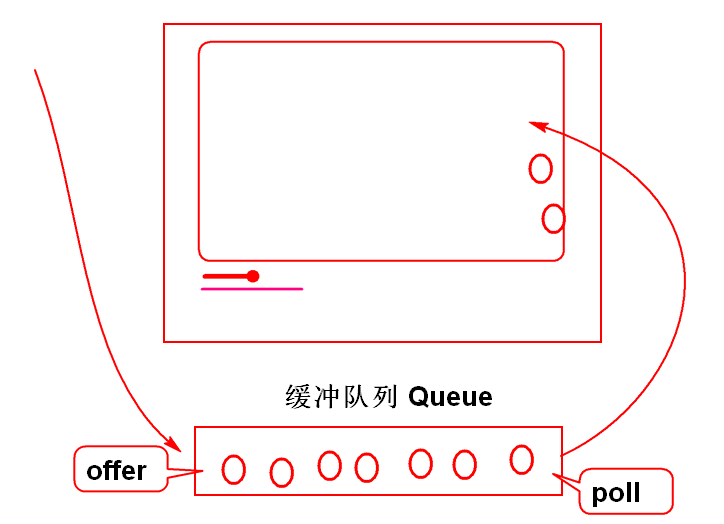
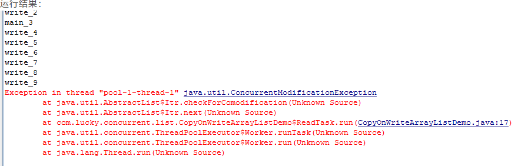
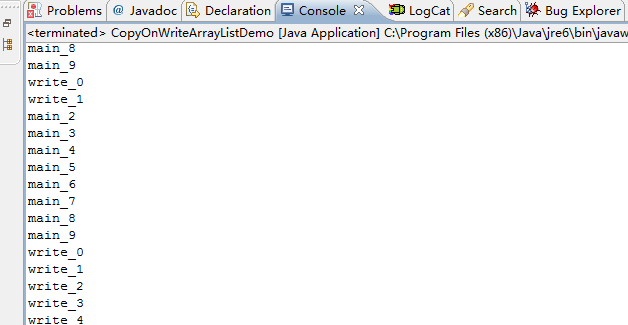

# █ Collection

## 1. 集合框架

集合的父类型接口

1. 定义了所有集合的通用方法
   - add 将元素添加到集合中
2. 有两个子接口
   - List 表示有序集合
   - Set 表示无序集合
3. Collection 是接口，使用时候必须使用具体实现类

案例：

```java
Collection col=new ArrayList();
        col.add("Tom");
        col.add("Jerry");
        System.o
```

## 2. Map 映射表

Map是专门面向查找而设计的数据结构，其特点是将数据按照 Key-Value 键值对存储起来，通过key来查找Value。 map中的 key
不可以重复，value可以重复。

Map接口定义了通用的方法：

1. `put(key,Value)` 将数据添加到 map, 若key 相同则替换 value, 并返回旧的 value
2. `get(key)` 从map中 查找 value, 未找到则返回 `null`
3. `containsKey(key)` 检查map中是否包含指定的key

```java
public static void main(String[]args){
        Map<String, String> map=new HashMap<>();
        //向map添加被查找的数据, 当Key相同时候，map 中的val被替换, 并返回旧值
        System.out.println(map.put("key-1","val-A"));
        System.out.println(map);
        System.out.println(map.put("key-1","val-A2"));
        System.out.println(map);
        System.out.println(map.put("key-2","val-B"));
        System.out.println(map);
        System.out.println();

        //调用get方法，利用关键字查找员工信息, key对应的Value不存在时候返回null
        System.out.println(map.get("key-1")); // val-A2
        System.out.println(map.get("key-3")); // null
        System.out.println();

        //containsKey检查 map 中是否包含指定的key
        System.out.println(map.containsKey("key-1")); // true
        System.out.println(map.containsKey("key-3")); // false
        }
```

map的查找性能非常好：

```java
public static void main(String[]args){
        List<Integer> list=new ArrayList<>();
        Map<Integer, Integer> map=new HashMap<>();
        // 填充数据
        for(int i=0;i< 800000;i++){
        list.add(i);
        map.put(i,i);
        }

        // 分别获取 list/map 中的 第799999个值
        long t1=System.nanoTime();
        int idx=list.indexOf(799999);
        long t2=System.nanoTime();
        int n=map.get(799999);
        long t3=System.nanoTime();
        System.out.println(idx);
        System.out.println(n);
        System.out.println((t2-t1)+","+(t3-t2)); // 6791800,31800
        }
```

### 2.2. Hash 与 HashMap

`Object`类规定了 `hashCode()`, 所有子类都会继承. 该方法要求返回一个散列值, 默认与内存位置有关.

当需要对对象进行散列操作时, 会获取这个 hashCode, 进行二次运算(比如求余), 根据结果将对象分到不同的组中去.


作为散列表Key的类型必须实现`hashCode()`和`equals()`：

```java
public class Demo09 {
    public static void main(String[] args) {
        //key对象类型如果不重写equals hashCode
        //将对象map集合产生严重影响，照成map
        //工作异常
        Map<Key, String> map = new HashMap<Key, String>();
        //没有重新hashCode和equals会出现重复添加
        map.put(new Key(1, "老师"), "范传奇，王克晶，李洪鹤");
        map.put(new Key(1, "老师"), "范老师，王老师，李老师");
        System.out.println(map);
        //没有重新hashCode和equals会出现查询失败
        String val = map.get(new Key(1, "老师"));
        System.out.println(val);
    }
}

class Key {
    int id;
    String name;

    public Key(int id, String name) {
        super();
        this.id = id;
        this.name = name;
    }

    @Override
    public int hashCode() {
        final int prime = 31;
        int result = 1;
        result = prime * result + id;
        return result;
    }

    @Override
    public boolean equals(Object obj) {
        if (this == obj)
            return true;
        if (obj == null)
            return false;
        if (getClass() != obj.getClass())
            return false;
        Key other = (Key) obj;
        if (id != other.id)
            return false;
        return true;
    }

    public String toString() {
        return "Key [id=" + id + ", name=" + name + "]";
    }
}
```

### 2.3 TreeMap可排序的Map

定义：TreeMap是基于红黑树的Map接口的实现，具有排序功能，可以对Map中的键值对进行排序，按照key进行排序，或者按照value进行排序。
TreeMap的key的排序方式有两种：

1. 自然排序：TreeMap的所有key必须实现Comparable接口，而且所有的key应该是同一个类的对象，否则会抛出ClassCastException异常。
2. 定制排序：创建TreeMap时，传入一个Comparator对象，该对象负责对TreeMap中的所有key进行排序。如果使用定制排序，则不需要实现Comparable接口。

```java
class Person implements Comparable<Person> {
    private String name;
    private int age;

    public Person(String name, int age) {
        super();
        this.name = name;
        this.age = age;
    }

    @Override
    public String toString() {
        return "Person [name=" + name + ", age=" + age + "]";
    }

    @Override
    public int compareTo(Person o) {
        return this.age - o.age; // 排序方式：升序
    }
  
    @Test
    public void testSort() {
        TreeMap<Person, String> treeMap = new TreeMap();
        treeMap.put(new Person("zzl", 40), "zzl");
        treeMap.put(new Person("zhz", 14), "zhz");
        treeMap.forEach((i, o) -> {
            System.out.println(i);
        });

    }
}
```

## 3 List 列表

### 常用方法

- add
- addAll
- get
- remove
- removeAll
- contains
- containsAll
- subList

### 2.1. ArrayList
* 底层是一个数组, 可以实现自动扩容, 通过下标访问元素, 随机访问速度很快
* 但如果需要在中间编辑或插入元素, 需要移动数组中的大量元素, 随机插入/删除性能较低

### 2.2. LinkedList
* 底层是链表, 根据需要增删节点,
* 随机读取性能较差: 通过下标访问元素时, 需要一个一个节点地遍历过去, 如果要找的节点在列表中部, 查找性能不如 ArrayList 高
* 随机写入性能较好: 由于链表的特性, 在链表中间插入/删除元素时, 只需要修改相邻节点, 不需要像ArrayList那样移动大量元素, 随机写入的性能

### 数组与list互转

## 4. Set 去重集合

HashSet

底层其实是一个 HashMap,

## 5. Queue 队列

Java提供了`Queue`接口，由`LinkedList`实现，用于处理**先进先出**的业务问题，如视频缓存队列

操作方法：

1. `offer` 将数据插入队列
2. `peek` 检查队列头部元素
3. `poll` 从队列拉出数据



```java
public static void main(String[]args){
        Queue<String> queue=new LinkedList<String>();
        System.out.println(queue);

        //offer将数据追加到队列中
        queue.offer("Tom");
        queue.offer("Jerry");
        queue.offer("Andy");
        System.out.println(queue);

        //peek检查队首，元素并不出列
        String first=queue.peek();
        System.out.println(first);//Tom
        System.out.println(queue);//不变

        //poll 是拉出一个元素，元素出列
        String element=queue.poll();
        System.out.println(element);//Tom
        System.out.println(queue);

        //拉取队列中全部的数据
        while(!queue.isEmpty()){
        System.out.println(queue.poll());
        }
        }
```

## 6. Stack 栈

栈是**后进先出**的数据结构。Java 利用 `Deque` 接口提供了栈操作方法, 由`LinkedList`提供实现.

- `push`, 压栈, 将元素添加到栈
- `pop`, 弹栈, 将栈顶元素取出
- `peek`, 获取栈顶元素, 但不弹出

```java
public static void main(String[]args){
        // Deque 接口中定义了 栈操作方法
        // LinkedList 实现了栈操作方法
        Deque<String> stack=new LinkedList<String>();

        // 栈提供了 push方法可以将数据“压”入栈中。
        stack.push("Tom");
        stack.push("Jerry");
        stack.push("Andy");

        // 先压入的数据在栈的最底部
        System.out.println(stack);

        // 出栈的顺序相反：后进先出
        while(!stack.isEmpty()){
        // 利用pop可以从栈中弹出数据, 弹出顺序与进入顺序相反
        String s=stack.pop();
        System.out.println(s);
        }
        }
```

双端队列 头 [x, x, x, x, x, x, x, x, x] 尾

添加元素 **push**/addFirst/offerFirst > [x, x, x, x, x, x, x, x, x] < add/**offer**/addLast/offerLast

取出元素 **pop**/remove/**poll**/removeFirst/pollFirst < [x, x, x, x, x, x, x, x, x] > removeLast/pollLast

只读不取 element/**peek**/getFirst/peekFirst < [x, x, x, x, x, x, x, x, x] > getLast/peekLast

## 7. PriorityQueue 优先队列

优先队列, 也叫堆, 可以在一组数据中快速找到最大/最小值, 但不需要对所有数据进行排序

java 的优先队列基于二叉堆来实现, 提供多个构造方法

1. 无参构造, 要求实体类实现 `comparable` 方法, 调用默认比较方法比较大小
2. 默认长度, 事先指定队列长度, 避免扩容开销
   要求实体类实现 `comparable` 方法, 调用默认比较方法比较大小
3. 自定义比较器, 按照给定方法比较大小, 也可实现成最大堆
4. 根据已有数据创建, 包括`Collection`, `PriorityQueue`, `SortedSet`

   如果是 `PriorityQueue` 或 `SortedSet`, 会用相同的比较器

   如果是普通的 `Collection`, 使用默认排序(升序)

```java
PriorityQueue<Integer> heap=new PriorityQueue<>();
        heap.add(1);
        heap.add(23);
        heap.add(654);
        heap.add(6442);
        heap.add(64);
        heap.add(22);
        heap.add(77);
        heap.add(345);
// 逐渐取出其中的最小值, 输出的数据就是有序的
// 1, 22, 23, 64, 77, 345, 654, 6442
        while(!heap.isEmpty()){
        int x=heap.poll();
        System.out.print(x);
        System.out.print(", ");
        }
```

可以使用自定义比较器, 指定排序规则

```java
System.out.println("自定义比较器, 实现最大堆");
        PriorityQueue<Integer> maxHeap=new PriorityQueue<>((a,b)->b-a);
        maxHeap.add(1);
        maxHeap.add(2);
        maxHeap.add(3);
        maxHeap.add(4);
        maxHeap.add(5);
        System.out.println("foreach 使用迭代器, 但二叉堆并不是完全有序, 输出结果类似无序");
        for(int i:maxHeap){
        System.out.println(i);
        }

        System.out.println("逐个取出堆顶元素, 有序输出");
        while(!maxHeap.isEmpty()){
        int x=maxHeap.poll();
        System.out.println(x);
        }
```

## 8. 遍历与迭代器

Map的遍历

1. 利用key的集合遍历map的内容
2. 利用Entry遍历map集合

```java
public class Demo10 {
    public static void main(String[] args) {
        Map<String, String> map = new HashMap<String, String>();
        map.put("炸弹", "大王,小王");
        map.put("同花顺", "方块3, 方块4, 方块5, 方块6");
        map.put("拖拉机", "梅花5,红桃5,梅花6,红桃");
        //获取全部key的集合
        Set<String> keySet = map.keySet();
        System.out.println(keySet);
        //遍历集合中全部的Key
        for (String key : keySet) {
            System.out.println(key);
            //在迭代期间可以利用get方法获取
            //value的值，性能没有问题
            System.out.println(map.get(key));
        }

        //利用Entry遍历Map集合
        //entrySet() 可以从map集合中获取全部
        // key:value 条目的集合，每个key:value
        // 对的对象类型是 Entry，而Entry类型上
        // 定义了getKey和getValue方法，可以获取
        // key:value对中的key和Value
        Set<Entry<String, String>> entries = map.entrySet();
        for (Entry<String, String> entry : entries) {
            String key = entry.getKey();
            String value = entry.getValue();
            System.out.println(key + ":" + value);
        }
    }
}
```

## 8. 比较与排序

### 8.1. Comparable 接口

默认比较大小Comparable

- Java 中定义了一个接口 Comparable
- 包含比较方法`compareTo`
  - 返回正数， 第一个对象大
  - 返回负数， 第一个对象小
  - 返回0数， 两个数一样
- Java中可以比较大小的API都实现了这个接口, String, Date, 包装类等

```java
public static void main(String[]args){
        String s1="田";//30000
        String s2="中";//20013
        String s3="abcd";
        System.out.println(s1.compareTo(s2));
        System.out.println(s2.compareTo(s1));
        System.out.println(s1.compareTo(s3));
        }
```

### 8.2. Comparator 接口

定义比较大小 Comparator

- 声明了用于比较任意对象的方法 `compare`

```java
public class Demo03 {
    public static void main(String[] args) {
        Product p1 = new Product("新西兰空气", 5.9);
        Product p2 = new Product("加勒比海海水", 6);
        Product p3 = new Product("喜马拉雅山雪", 6);

        ByWeight byWeight = new ByWeight();
        System.out.println(byWeight.compare(p1, p2));
        System.out.println(byWeight.compare(p2, p1));
        System.out.println(byWeight.compare(p2, p3));
    }
}

/** 按照商品重量进行自定义比较 */
class ByWeight implements Comparator<Product> {
    public int compare(Product o1, Product o2) {
        double val = o1.weight - o2.weight;
        if (val > 0) {
            return -1;
        }
        if (val < 0) {
            return 1;
        }
        return 0;
    }
}

class Product {
    String name;
    double weight;
}
```

### 8.3. 排序

#### 1) 自然排序

若集合的元素实现了`Comparable`接口, 则可以通过 `Collections.sort()` 方法对其进行排序, `sort()`
方法会调用元素的`compareTo()`来比较不同元素的大小, 再通过快速排序算法 **从小到大** 排序.

```java
/** 对可以比较大小的对象进行自然排序 */
public class Demo02 {
    public static void main(String[] args) {
        List<String> list = new ArrayList<String>();
        list.add("Tom");
        list.add("Jerry");
        list.add("Andy");
        list.add("Lee");
        list.add("Mac");

        // sort方法只能对List集合进行排序
        // list集合中的元素需要实现 Compatible 接口的 compareTo() 方法 
        Collections.sort(list);
        System.out.println(list);
    }
}
```

#### 2) 自定义排序

如果集合元素未实现 `Comparable`接口, 或者希望采用另外的规则对集合排序, `Collections` 提供了一个 `sort()` 重载方法,
允许通过自定义的比较器进行排序.

```java
/** 自定义比较与自定义排序 */`

public class Demo03 {
    public static void main(String[] args) {
        Product p1 = new Product("新西兰空气", 5.9);
        Product p2 = new Product("加勒比海海水", 6);
        Product p3 = new Product("喜马拉雅山雪", 6);
        ByWeight byWeight = new ByWeight();
        System.out.println(byWeight.compare(p1, p2));
        System.out.println(byWeight.compare(p2, p1));
        System.out.println(byWeight.compare(p2, p3));

        List<Product> list = new ArrayList<Product>();
        list.add(p3);
        list.add(p2);
        list.add(p1);
        list.add(new Product("阿拉斯加的土", 2));
        //Java中的自定义排序, 将集合中的元素按照给定的自定义比较器的比较结果进行排序。
        Collections.sort(list, byWeight);
        System.out.println(list);
    }
}

/** 按照商品重量进行自定义比较 */
class ByWeight implements Comparator<Product> {
    public int compare(Product o1, Product o2) {
        double val = o1.weight - o2.weight;
        if (val > 0) {
            return -1;
        }
        if (val < 0) {
            return 1;
        }
        return 0;
    }
}

class Product {
    String name;
    double weight;
}
```

# CopyOnWriteArrayList

CopyOnWriteArrayList是ArrayList 的一个线程安全的变体，其中所有可变操作（add、set等等）都是通过对底层数组进行一次新的复制来实现的。

这一般需要很大的开销，但是当遍历操作的数量大大超过可变操作的数量时，这种方法可能比其他替代方法更 有效。在不能或不想进行同步遍历，但又需要从并发线程中排除冲突时，它也很有用。“快照”风格的迭代器方法在创建迭代器时使用了对数组状态的引用。此数组在迭代器的生存期内不会更改，因此不可能发生冲突，并且迭代器保证不会抛出ConcurrentModificationException。创建迭代器以后，迭代器就不会反映列表的添加、移除或者更改。在迭代器上进行的元素更改操作（remove、set和add）不受支持。这些方法将抛出UnsupportedOperationException。允许使用所有元素，包括null。

内存一致性效果：当存在其他并发 collection 时，将对象放入CopyOnWriteArrayList之前的线程中的操作 happen-before 随后通过另一线程从CopyOnWriteArrayList中访问或移除该元素的操作。

这种情况一般在多线程操作时，一个线程对list进行修改。一个线程对list进行fore时会出现java.util.ConcurrentModificationException错误。

下面来看一个列子：两个线程一个线程fore一个线程修改list的值。

```java
package com.lucky.concurrent.list;
 
import java.util.ArrayList;
import java.util.List;
import java.util.concurrent.ExecutorService;
import java.util.concurrent.Executors;
 
public class CopyOnWriteArrayListDemo {
	/**
	 * 读线程
	 * @author wangjie
	 *
	 */
	private static class ReadTask implements Runnable {
		List<String> list;
 
		public ReadTask(List<String> list) {
			this.list = list;
		}
 
		public void run() {
			for (String str : list) {
				System.out.println(str);
			}
		}
	}
	/**
	 * 写线程
	 * @author wangjie
	 *
	 */
	private static class WriteTask implements Runnable {
		List<String> list;
		int index;
 
		public WriteTask(List<String> list, int index) {
			this.list = list;
			this.index = index;
		}
 
		public void run() {
			list.remove(index);
			list.add(index, "write_" + index);
		}
	}
 
	public void run() {
		final int NUM = 10;
		List<String> list = new ArrayList<String>();
		for (int i = 0; i < NUM; i++) {
			list.add("main_" + i);
		}
		ExecutorService executorService = Executors.newFixedThreadPool(NUM);
		for (int i = 0; i < NUM; i++) {
			executorService.execute(new ReadTask(list));
			executorService.execute(new WriteTask(list, i));
		}
		executorService.shutdown();
	}
 
	public static void main(String[] args) {
		new CopyOnWriteArrayListDemo().run();
	}
}
```


从结果中可以看出来。在多线程情况下报错。其原因就是多线程操作结果：那这个种方案不行我们就换个方案。用jdk自带的类CopyOnWriteArrayList来做容器。
这个类和ArrayList最大的区别就是add(E) 的时候。容器会自动copy一份出来然后再尾部add(E)。看源码：

```java
/**
     * Appends the specified element to the end of this list.
     *
     * @param e element to be appended to this list
     * @return <tt>true</tt> (as specified by {@link Collection#add})
     */
    public boolean add(E e) {
	final ReentrantLock lock = this.lock;
	lock.lock();
	try {
	    Object[] elements = getArray();
	    int len = elements.length;
	    Object[] newElements = Arrays.copyOf(elements, len + 1);
	    newElements[len] = e;
	    setArray(newElements);
	    return true;
	} finally {
	    lock.unlock();
	}
    }
```

用到了Arrays.copyOf 方法。这样导致每次操作的都不是同一个引用。也就不会出现java.util.ConcurrentModificationException错误。
换了种方案看代码：

```java
//		List<String> list = new ArrayList<String>();
		CopyOnWriteArrayList<String> list = new CopyOnWriteArrayList<String>();
```

也就把容器list换成了 CopyOnWriteArrayList，其他的没变。线程里面的list不用改。因为 CopyOnWriteArrayList实现的也是list<E> 接口。看结果：


其结果没报错。
CopyOnWriteArrayList add(E) 和remove(int index)都是对新的数组进行修改和新增。所以在多线程操作时不会出现java.util.ConcurrentModificationException错误。
所以最后得出结论：CopyOnWriteArrayList适合使用在读操作远远大于写操作的场景里，比如缓存。发生修改时候做copy，新老版本分离，保证读的高性能，适用于以读为主的情况。
