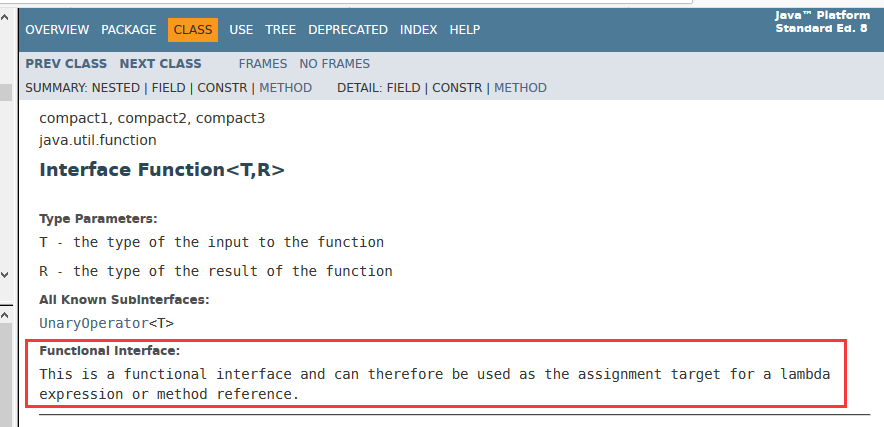
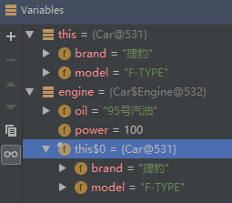
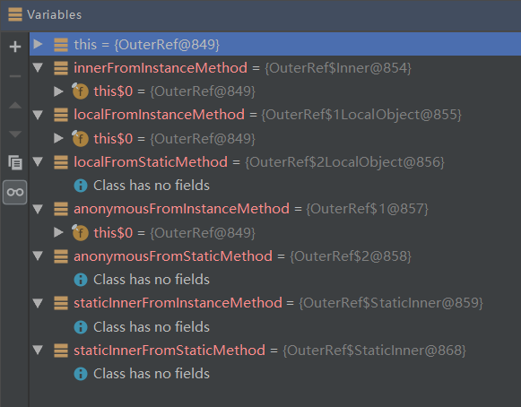
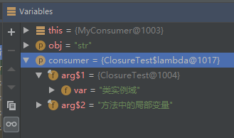
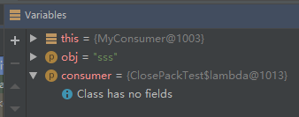
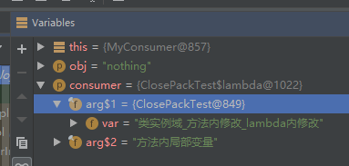
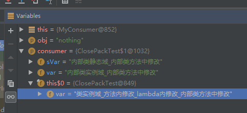

# █ 六. 接口, 内部类, lambda

# 一. 接口

## 1. 基本概念

> Interface

用来描述一个类具备某些特定的功能, 但不提供具体的实现: 定义了一些方法名, 但没有方法体

接口中定义的方法, 都是**public**方法, 无须使用 `public` 关键字来修饰.

## 2. 静态方法

## 3. 默认方法

## 4. 接口回调


# 二. 函数式接口

## 1. 什么是函数式接口

在 Java 中, 不能直接传递一个代码块, 必须先构造一个对象, 这个对象的类中含有一个包含所需代码的方法.

为了实现这种"传递代码块"的需求, java 8 定义了一种特殊的接口, 接口中**有且只有一个抽象方法,**

当一个方法以函数式接口作为形参时, 在调用这个方法时就可以以 lambda 表达式作为实参, 这个 lambda 表达式的实参将会成为这个函数式接口中那唯一一个抽象方法的方法体实现.

java 8 以前的函数式接口:

- java.lang.**Runnable**
- java.util.concurrent.Callable
- java.security.PrivilegedAction
- java.util.**Comparator**
- java.io.FileFilter
- java.nio.file.PathMatcher
- java.lang.reflect.InvocationHandler
- java.beans.PropertyChangeListener
- java.awt.event.**ActionListener**
- javax.swing.event.ChangeListener

## 2. Java 8 的函数式接口

java 8 中提供了一个 `java.util.function` 包, 里面有各种形式的函数式接口, 方便开发人员使用.

根据提供的方法类型, 可以分成以下几类, 并根据参数和返回值的具体类型进行了扩展

### 2.1. Consumer

消费型接口, 需要传入参数, 没有返回值

| 接口类型                   | 接口方法                        | 描述                                    |
| :------------------------- | ------------------------------- | --------------------------------------- |
| **Consumer&lt;T&gt;**      | void accept(T t);               | 接受 `T` 类型参数, 无返回值             |
| IntConsumer                | void accept(int value);         | 接受 `int` 类型参数, 无返回值           |
| LongConsumer               | void accept(long value);        | 接受 `long` 参数, 无返回值              |
| DoubleConsumer             | void accept(double value);      | 接受 `double` 参数, 无返回值            |
| **BiConsumer&lt;T,U&gt;**  | void accept(T t, U u);          | 接受 `T` 和 `U`  两种类型参数, 无返回值 |
| ObjIntConsumer&lt;T&gt;    | void accept(T t, int value);    | 接受 `T` 和 `int` 参数, 无返回值        |
| ObjLongConsumer&lt;T&gt;   | void accept(T t, long value);   | 接受 `T` 和 `long`参数, 无返回值        |
| ObjDoubleConsumer&lt;T&gt; | void accept(T t, double value); | 接受 `T` 和 `double`参数, 无返回值      |

### 2.2. Supplier

供给型接口, 不需传入参数, 提供一个指定类型返回值

| 接口名                | 接口方法                | 描述                          |
| --------------------- | ----------------------- | ----------------------------- |
| **Supplier&lt;T&gt;** | T get();                | 获取一个 `T` 类型返回值       |
| IntSupplier           | int getAsInt();         | 获取一个 `int` 类型返回值     |
| LongSupplier          | long getAsLong();       | 获取一个 `long` 类型返回值    |
| DoubleSupplier        | double getAsDouble();   | 获取一个 `double` 类型返回值  |
| BooleanSupplier       | boolean getAsBoolean(); | 获取一个 `boolean` 类型返回值 |

### 2.3. Predicate

断言型接口, 根据传入参数, 返回一个 `boolean` 值

| 接口名                     | 接口方法                    | 描述                                          |
| -------------------------- | --------------------------- | --------------------------------------------- |
| **Predicate&lt;T&gt;**     | boolean test(T t);          | 根据 `T` 类型参数, 得到 `boolean` 结果        |
| IntPredicate               | boolean test(int value);    | 根据 `int` 类型参数, 得到 `boolean` 结果      |
| LongPredicate              | boolean test(long value);   | 根据 `long` 类型参数, 得到 `boolean` 结果     |
| DoublePredicate            | boolean test(double value); | 根据 `double` 类型参数, 得到 `boolean` 结果   |
| **BiPredicate&lt;T,U&gt;** | boolean test(T t, U u);     | 根据 `T` 和 `U` 两个参数, 得到 `boolean` 结果 |

### 2.4. Function

函数型接口, 根据传入参数, 返回指定类型结果, 

注意 Function 接口 `参数类型`与`返回值类型`不同, 如需 `参数类型` 与 `返回值类型` 相同的函数, 请使用 `Operator` 接口

#### 1) 一元函数, 单参数

| 接口名                        | 接口方法                          | 描述                                         |
| ----------------------------- | --------------------------------- | -------------------------------------------- |
| **Function&lt;T,R&gt;**       | R apply(T t);                     | 根据 `T` 类型参数, 得到 `R` 类型结果         |
| IntFunction&lt;R&gt;          | R apply(int value);               | 根据 `int` 类型参数, 得到 `R` 类型结果       |
| LongFunction&lt;R&gt;         | R apply(long value);              | 根据 `long` 类型参数, 得到 `R` 类型结果      |
| DoubleFunction&lt;R&gt;       | R apply(double value);            | 根据 `double` 类型参数, 得到 `R` 类型结果    |
| **ToIntFunction&lt;T&gt;**    | int applyAsInt(T value);          | 根据 `T` 类型参数, 得到 `int` 类型结果       |
| LongToIntFunction             | int applyAsInt(long value);       | 根据 `long` 类型参数, 得到 `int` 类型结果    |
| DoubleToIntFunction           | int applyAsInt(double value);     | 根据 `double` 类型参数, 得到 `int` 类型结果  |
| **ToLongFunction&lt;T&gt;**   | long applyAsLong(T value);        | 根据 `T` 类型参数, 得到 `long` 类型结果      |
| IntToLongFunction             | long applyAsLong(int value);      | 根据 `int` 类型参数, 得到 `long` 类型结果    |
| DoubleToLongFunction          | long applyAsLong(double value);   | 根据 `double` 类型参数, 得到 `long` 类型结果 |
| **ToDoubleFunction&lt;T&gt;** | double applyAsDouble(T value);    | 根据 `T` 类型参数, 得到 `double` 类型结果    |
| IntToDoubleFunction           | double applyAsDouble(int value);  | 根据 `int` 类型参数, 得到 `double` 类型结果  |
| LongToDoubleFunction          | double applyAsDouble(long value); | 根据 `long` 类型参数, 得到 `double` 类型结果 |

#### 2) 二元函数, 双参数

| 接口名                        | 接口方法                        | 描述                                         |
| ----------------------------- | ------------------------------- | -------------------------------------------- |
| **BiFunction&lt;T,U,R&gt;**   | R apply(T t, U u);              | 根据 `T` 和 `U` 参数, 获取 `R` 类型结果      |
| ToIntBiFunction&lt;T,U&gt;    | int applyAsInt(T t, U u);       | 根据 `T` 和 `U` 参数, 获取 `int` 类型结果    |
| ToLongBiFunction&lt;T,U&gt;   | long applyAsLong(T t, U u);     | 根据 `T` 和 `U` 参数, 获取 `long` 类型结果   |
| ToDoubleBiFunction&lt;T,U&gt; | double applyAsDouble(T t, U u); | 根据 `T` 和 `U` 参数, 获取 `double` 类型结果 |

### 2.5. Operator

算子型接口, 效果类似于运算符. 根据参数得到结果, 

与 Function 接口相似, 区别在于 Operator 的 `参数类型` 与 `返回值类型` 要保持一致

| 接口名                      | 接口方法                                         | 描述                                               |
| --------------------------- | ------------------------------------------------ | -------------------------------------------------- |
| **UnaryOperator&lt;T&gt;**  | T apply(T t);                                    | 继承`Function<T,T>`, 根据单参数得到结果            |
| IntUnaryOperator            | int applyAsInt(int operand);                     | 根据 `int` 类型参数, 得到 `int` 类型结果           |
| LongUnaryOperator           | long applyAsLong(long operand);                  | 根据 `long` 类型参数, 得到 `long` 类型结果         |
| DoubleUnaryOperator         | double applyAsDouble(double operand);            | 根据 `double` 类型参数, 得到 `double` 类型结果     |
| **BinaryOperator&lt;T&gt;** | T apply(T t1, T t2);                             | 继承 `BiFunction<T,T,T>`, 根据双参数得到结果       |
| IntBinaryOperator           | int applyAsInt(int left, int right);             | 根据两个 `int` 类型参数, 得到 `int` 类型结果       |
| LongBinaryOperator          | long applyAsLong(long left, long right);         | 根据两个 `long` 类型参数, 得到 `long` 类型结果     |
| DoubleBinaryOperator        | double applyAsDouble(double left, double right); | 根据两个 `double` 类型参数, 得到 `double` 类型结果 |

## 3. 使用函数式接口

### 3.1. 开发函数式接口

函数式接口的关键就是: **有且只有一个抽象方法**, 只要满足这个要求, 就是一个函数式接口.

java8 中提供了 单参数单返回值的 `Function<T,R>` 和 双参数单返回值的 `BiFunction<T,U,R>`, 

下面展示的则是经过扩展的 三参数单返回值的函数式接口:

```java
// com.loyofo.core.s6_interface.e4_functionInterface.f4_function.FunctionWith3Args
@FunctionalInterface
public interface FunctionWith3Args<A, B, C, R> {
    R apply(A a, B b, C c);
}
```

代码中的 `@FunctionalInterface` 表明这个接口是一个函数式接口, 这个注解不是必须的, 但建议加上. 

使用 `@FunctionalInterface` 的作用有两个:

1. 检查接口中的抽象接口, 确保有且只有一个抽象方法, 否则会提示编译错误

2. 在生成的**javadoc**中指示这个接口为函数式接口

   

### 3.2. 以函数式接口为方法形参 

定义一些方法, 这些方法使用函数式接口作为形参, 这样的方法才能使用 lambda 表达式或方法引用作为实参进行传递.

接受函数式接口参数后, 在方法体内调用该函数式接口中定义的抽象方法, 日后使用 lambda 表达式或方法引用时, 就会被执行相应的方法体.

后续案例都会使用这种形式的方法来接收 lambda 表达式.

```java
// com.loyofo.core.s6_interface.e4_functionInterface.f1_consumer.MyConsumer
public class MyConsumer {
    // 使用 Consumer 接口
    public <T> void doWithObject(T obj, Consumer<T> consumer) {
        consumer.accept(obj);
    }

    // 使用 BiConsumer 接口
    public <T, U> void doWithObject2(T a, U b, BiConsumer<T, U> consumer){
        consumer.accept(a, b);
    }
}

// com.loyofo.core.s6_interface.e4_functionInterface.f4_function.MyFunction
public class MyFunction {
    // 使用 Function 接口
    public <T,R> R doWithTFunction(T arg, Function<T,R> func){
        return func.apply(arg);
    }

    // 使用 BiFunction 接口
    public <T, U, R> R getRFromTU(T t, U u, BiFunction<T,U,R> func){
        return func.apply(t, u);
    }

    // 使用自定义的 FunctionWith3Args 接口
    public <A, B, C, R> R getRFrom3Args(A a, B b, C c, FunctionWith3Args<A, B, C, R> func) {
        return func.apply(a, b, c);
    }
}
```

### 3.3. 以接口对象为方法实参

定义好函数式接口和接收函数式接口参数的方法后, 就可以在后面的工作中调用 3.2. 中定义的方法, 传入 lambda 表达式作为实参.

```java
// com.loyofo.core.s6_interface.e4_functionInterface.f1_consumer.ConsumerTest
public class ConsumerTest {
    @Test
    public void testIntConsumer() {
        MyConsumer consumer = new MyConsumer();
        // 以 lambda 作为实参传递
        consumer.doWithObject("hello lambda", s -> System.out.println(s));
        // 以 方法引用 作为实参传递
        consumer.doWithObject("hello method ref", System.out::println);
    }
}
```

# 三. 内部类

## 1. 内部类

内部类 inner class  是定义在另一个类中的类, 使用内部类可能有以下原因:

1. 内部类方法可以访问该类定义所在的作用与中的数据, 包括私有的数据
2. 内部类可以对同一个包中的其他类隐藏起来, 对其他类不可见
3. 当想要定义一个回调函数且不想编写大量格式代码时, 使用匿名内部类比较方便

而且 Java中的 内部类对象持有一个隐式的引用 `Outer.this`, 它引用了实例化该内部对象的外围类对象, 通过这个指针, 可以访问到外围类对象的全部状态, 而 static 修饰的静态内部类没有这样的指针

```java
// com.loyofo.core.s6_interface.e6_innerClass.f1_innerClass.InnerClassTest
public class InnerClassTest {
    public static void main(String[] args){
        Car car = new Car("捷豹", "F-TYPE");
        car.start();
    }
}

class Car{
    private String brand;
    private String model;

    public Car(String brand, String model){
        this.brand = brand;
        this.model = model;
    }

    public void start(){
        Engine engine = new Engine("95号汽油", 100);
        // 打断点, 观察对象情况
        engine.run();
    }

    /**
     * 内部类
     */
    class Engine{
        private String oil;
        private int power;

        public Engine(String oil, int power){
            this.oil = oil;
            this.power = power;
        }

        public void run(){
            System.out.println("汽车正在运行");
            // 访问外部对象的数据域, 可注释后观察是否还有外围类对象的引用
            System.out.println("品牌: " + brand);
            System.out.println("型号: " + model);
            // 访问内部类对象的数据域
            System.out.println("发动机汽油: " + oil);
            System.out.println("发动机马力: " + power);
        }
    }
}
```

在 `start()` 方法内打断点, 观察对象情况:

- `this` 变量即当前对象, 指向 `Car@531`
- `engine` 对象中包含一个 `this$0` 的变量, 指向 `Car@531`, 即当前的外围类对象

由此可见, 内部类对象中都自动含有一个创建它的外围类对象的引用.  且不论内部类对象是否访问了外围类对象的数据域, 都会含有这个引用 ( 可以将内部类 `run()` 方法中访问 `brand` 和 `model` 的语句注释后观察) 




内部类对象对外围类对象的引用, 不是由开发者自己定义的, 因此不需要在内部类的源码中进行定义. 

这个引用是在构造器中设置的, 编译器修改了所有内部类的结构, 添加了一个外围类引用的参数 `this$0` . 

上述例子中的内部类经编译器修改后相当于这样的, 添加了一个 `this$0` 实例域并修改了构造器:

```java
class Car$Engine {
    private String oil;
    private int power;
    // 编译器添加的实例域
    private Car this$0;

    public Car$Engine(Car this$0, String oil, int power) {
        // 编译器自动添加的实例域
        this.this$0 = this$0;
        this.oil = oil;
        this.power = power;
    }

    public void run() {...}
}
```

### 1.2. 访问控制

#### 1) 内部类访问外围类

再看上面的例子, 如果 `Engine` 类是常规类而不是内部类, 那么要想在 `run()` 方法访问 `Car` 的私有域, 就需要在 `Car` 类中提供私有域的 Getter 方法. 

而如果 `Engine` 是 `Car` 的内部类, 则可以直接访问 `Car` 的私有域, 不需要通过 Getter 方法

#### 2) 外围类访问内部类

常规类的访问控制只能是 `package(默认)` 或 `public`但对于内部类, 可以为 `private` 或 `protected`. 

对于 private 内部类中的 private 实例域/方法, private 并未限制外围类去访问, *不知道具体什么原理*

编译器为外围类的实例域添加了访问方法, 编译后的内部类通过这些访问方法访问到外围类的私有域.

外部类对象可以访问内部类中 private 的实例域和方法

## 2. 特殊语法规则

### 2.1. 获取外围类对象

前面已经讲到, 内部类对象中含有一个外围类对象的引用, 并用 `outer` 进行描述. 但实际上, 如果要在内部中获取外围类对象, 需要采用以下的形式, 并返回制定类型的对象

> 外部类名.this

```java
public class InnerClassRules {
    @Test
    public void testInnerClassRules() {
        Inner rules = new Inner();
        InnerClassRules outer = rules.getOuter();
        System.out.println(outer);
        System.out.println(this);
    }

    class Inner{
        public InnerClassRules getOuter(){
            // 在内部类中通过 外部类名.this 获取外部类对象
            return InnerClassRules.this;
        }
    }
}
```

### 2.2. 创建内部类对象

- 在外围类的作用范围内, 可以像使用普通类一样使用内部类, 直接通过 `new` 创建内部类的对象

  >  内部类类名 变量名 = new 内部类类名(构造参数)

- 在外围类的作用范围外, 则要通过外围类的对象, 才能创建内部类的对象

  > 外围类类名.内部类类名 变量名 = 外围类对象.new 内部类类名(构造参数)

```java
public class InnerClassRules {
    @Test
    public void testGetInner() {
        // 获取当前类的内部类
        Inner inner = new Inner();
        System.out.println(inner);

        // 获取其他类的内部类
        Outer outer = new Outer();
        Outer.OuterInner outerInner = outer.new OuterInner();
        System.out.println(outerInner);
    }
    
    class Inner{
        public InnerClassRules getOuter(){
            return InnerClassRules.this;
        }
    }
}

class Outer{
    class OuterInner{}
    
}
```

### 2.3. 

静态域必须为 final, 即 static final 类常量, 声明的同时赋值, 不可改变

不能有 static 方法/ 或静态方法只能访问外围类的静态域

## 3. 其他内部类


## 2. 局部内部类

在方法之中定义的内部类, 称为局部内部类. 

局部内部类不能使用 `public`,  `protected`,  `private` 等访问控制符修饰, 因为局部内部类的作用域被限制在这个方法的方法体中, 对外界安全隐藏, 因此也不能以局部内部类作为返回值类型返回.

可以将局部内部类继承某一个类, 并以超类类型作为返回值, 从而将该局部内部类的对象带到外面.

局部内部内不仅可以访问包含它的外围类对象, 还可以访问方法中的局部变量, 但要求方法中的局部变量为final

```java
public class LocalInner {
    String field = "LocalInner";

    public Consumer<String> getConsumer(){
        String methodName = "getConsumer()";
        class LocalConsumer implements Consumer<String> {
            @Override
            public void accept(String s) {
                System.out.println(s);
                // 局部内部类可以访问外围类对象的实例域
                System.out.println(field);
                // 局部内部类可以访问当前方法的局部变量, 但要求为事实 final
                System.out.println(methodName);
                // 局部内部类中的 this 指当前内部类对象, 不是外围类对象
                System.out.println(this);
            }
        }
        return new LocalConsumer();
    }

    @Test
    public void testLocalInner() {
        // 获取局部内部类
        Consumer<String> localConsumer = getConsumer();
        localConsumer.accept("test localConsumer");
    }
}
```

## 3. 匿名内部类

将局部内部类更深入一步, 如果只需要这个类的一个对象, 则不需要为类命名了, 这种类被称为**匿名内部类**

由于构造器的名字与类名相同, 而匿名内部类没有类名, 自然也就没有构造函数了. 取而代之的是可以将构造参数传递给超类的构造器,  

> 超类 对象名 = new 超类(构造参数){...}

如果是实现接口的匿名内部类, 则不需传入任何的构造参数, 但仍需保留空的小括号

> 接口 对象名 = new 接口(){...}

```java
public class AnonymousTest {
    public static void main(String[] args) {
        // 创建一个 Outer 类的对象
        Outer outer = new Outer();
        System.out.println(outer.getClass());
        outer.printMe();

        // 创建一个匿名内部类对象, 没有构造参数
        Outer anonymous = new Outer() {
            @Override
            public void printMe() {
                System.out.println("这里是无参匿名内部类");
            }
        };
        System.out.println(anonymous.getClass());
        anonymous.printMe();

        // 创建一个匿名内部类对象, 传入参数
        Outer anonymousWithArgs = new Outer("有参匿名类", 99) {
            @Override
            public void printMe() {
                System.out.println("这里是有参匿名内部类, name=" + name + ", age=" + age);
            }
            public void printMe2(){
                System.out.println("匿名内部类新增方法");
            }
        };
        System.out.println(anonymousWithArgs.getClass());
        anonymousWithArgs.printMe();
        // 无法访问匿名类中新增的方法
        // anonymousWithArgs.printMe2();
    }
}

class Outer {
    String name;
    int age;

    public Outer() {
        System.out.println("\n-->> 这是 Outer 类的无参构造");
        this.name = "普通类";
        this.age = 22;
    }

    public Outer(String name, int age) {
        System.out.println("\n-->> 这是 Outer 类的有参构造");
        this.name = name;
        this.age = age;
    }

    public void printMe() {
        System.out.println("这里是普通类, name=" + name + ", age=" + age);
    }
}
```

对比一下创建 `普通类` 对象, 以及创建一个 `扩展超类的匿名内部类` 的对象, 可以发现创建匿名内部类时, 在构造方法后面带有一个大括号方法体, 这个方法体就是匿名内部类的实现. 

注意匿名内部类对外都是以超类类型存在, 因此, 匿名内部类对象能访问的方法都必须是超类中定义的方法. 

如果在匿名内部类中新增一个公有方法定义, 则匿名内部类之外对此方法一无所知, 因而也无法调用, 该公有方法没有意义. 但仍可以定义私有方法, 在匿名内部类之中进行调用.

### 3.2. 双括号初始化

如果需要构造一个数组或者列表, 并将其作为参数传递, 此后就不再需要这个数组列表, 那么可以考虑将其作为一个匿名列表. 

那作为一个匿名列表, 要如何为它添加元素呢? 这种情况下可以采用匿名内部类, 通过 "双括号初始化" 的方法为其添加元素. 例子如下

```java
@Test
public void testInitWithAnonymous() {
    // 传统方式构造列表
    ArrayList<String> list = new ArrayList<>();
    list.add("list-1");
    list.add("list-2");
    list.add("list-3");
    printList(list);

    // 双括号初始化构造列表
    printList(new ArrayList<String>(){{
        add("anonymous-1");
        add("anonymous-2");
        add("anonymous-3");
    }});
}

public void printList(ArrayList<String> list){
    System.out.println(list);
}
```

注意第二种方式的双层大括号, 其中`外层大括号是匿名内部类的类级`大括号, 内层括号则是**初始化块**, 初始化块将在构造内部类的对象时执行, 通过这种方式就可以将元素添加到匿名列表之中.

通过传统方式创建的列表对象, 以及双括号初始化创建的列表对象, 还有一个区别在于对象的真实类型, 传统方式列表对象的类型为 `ArrayList`, 但双括号初始化得到的对象是 `ArrayList` 的一个子类, 如果需要对多个列表对象调用 `equals` 方法进行比较, 则会因为类型不同而得到 `false` 的结果

### 3.3. 在静态方法中输出当前类

在生成日志或者调试信息时, 可能会希望在日志中记录当前类的类型, 为此可能会调用 `getClass()` 方法

但是 `getClass()` 方法是个实例方法, 在静态方法中不能使用, 为此, 也可以通过匿名内部类来获取当前类的类型.

```java
new Object(){}.getClass().getEnclosingClass();
```

在上面的代码中, `new Object(){}` 会创建 `Object` 的一个匿名子类对象, 而 `getEnclosingClass()` 方法则会得到其外围类, 即包含这个静态方法的类.

```java
@Test
public void testGetEnclosingClass() {
    System.out.println(getClassInMethod());
    System.out.println(getClassInStaticMethod());
}

public Class getClassInMethod(){
    return getClass();
}

public static Class getClassInStaticMethod(){
    return new Object(){}.getClass().getEnclosingClass();
}
```

## 4. 静态内部类

在前面学习到的内部类中, 如果是在内部类是在非静态方法中创建的, 那么该内部类对象就会持有一个当前外围类对象的引用, 以便内部类访问外围类对象的数据域. 但有时候可能可能只是想将一个类隐藏在另一个类里面, 并不需要内部类引用外围类, 为此, 可以将内部类声明为 `static`, 作为静态内部类从而消除内部类对外围类的引用.

请看下面的例子: 

```java
public class OuterRef {
    @Test
    public void testThisRef() {
        Object innerFromInstanceMethod = getInner();
        // Object innerFromStaticMethod = getInnerStatic();

        Object localFromInstanceMethod = getLocal();
        Object localFromStaticMethod = getLocalStatic();

        Object anonymousFromInstanceMethod = getAnonymous();
        Object anonymousFromStaticMethod = getAnonymousStatic();

        Object staticInnerFromInstanceMethod = getStaticInner();
        Object staticInnerFromStaticMethod = getStaticInnerStatic();
    }

    class Inner {}

    static class StaticInner {}

    public Object getInner(){ return new Inner(); }

    public static Object getInnerStatic(){
        // 静态方法不能创建非静态内部类对象
        // return new Inner();
        return null;
    }

    public Object getLocal() {
        class LocalObject {}
        return new LocalObject();
    }

    public static Object getLocalStatic() {
        class LocalObject {}
        return new LocalObject();
    }

    public Object getAnonymous(){ return new Object() {}; }

    public static Object getAnonymousStatic() { return new Object() {}; }

    public Object getStaticInner(){ return new StaticInner(); }

    public static Object getStaticInnerStatic(){ return new StaticInner(); }
}
```



从上述例子中可以看到:

- 从非静态方法中创建非静态内部类对象时 ( 包括普通内部类, 局部内部类, 匿名内部类 ) , 返回的内部类对象中都持有一个当前对象的引用 `this$0`,
- 从静态方法中创建非静态内部类对象时 ( 包括局部内部类, 匿名内部类), 由于静态方法不需要通过对象来调用, 返回的内部类对象中不含当前对象的引用
- 静态方法不能创建普通内部类的对象, 会提示`“XXX.this" is cannot be referenced from a static context` 的编译错误
- 不论静态方法还是非静态方法, 创建的静态内部类对象都不含外围类对象的引用. 

### 4.1. 静态域和静态方法

非静态内部类 ( 包括普通内部类, 局部内部类, 匿名内部类 ) 不能有 static 修饰的静态方法, 且静态域必须为 final.

静态内部类中可以像普通类一样声明静态方法, 且静态域不要求 final

在接口 `interface` 中定义的内部类, 都自动成为 `static` 和 `public` 的, 其中可以包含静态域和静态方法

```java
public class StaticInner {
    @Test
    public void testStatic() {
        System.out.println(StaticObj.name);
        StaticObj.name = "修改静态域";
        System.out.println(StaticObj.name);
        StaticObj.print();

        System.out.println(StaticInter.ClassInInterface.name);
        StaticInter.ClassInInterface.printInInterface();
    }

    static class StaticObj {
        public static String name = "这是静态域";

        public static void print(){
            System.out.println("这是静态内部类的静态方法");
        }
    }
}

interface StaticInter {
    class ClassInInterface{
        static String name = "接口中的内部类, 静态域";
        static void printInInterface() {
            System.out.println("接口中的内部类, 静态方法");
        }
    }
}
```

## 5. 捕获局部变量

前面说到, 局部内部类 和 匿名内部类 可以访问定义它们的那个方法中的局部变量, 这是怎么实现的呢?

编译器会检测内部类对局部变量的访问, 将每一个需要的局部变量捕获, 在内部类中建立相应的数据域并修改内部类的构造器, 在需要构造内部类对象的时候, 会将局部变量拷贝到构造器中, 

这样处理过后, 内部类对象中就有了局部变量的一个备份, 即使原来的方法栈已经消失, 内部类对象也能够正常运行.

又因为局部类对象中的局部变量是原始数据的一个拷贝, 如果在原来的方法中或局部类中对自己的那一份数据进行了修改, 则会导致两份数据不一致, 可能到带来奇怪的问题. 为了解决这个数据一致性的问题, java 要求被内部类捕获的局部变量是事实上 final 的, 即一经声明后就不再修改, 这样才能保证局部变量的两份拷贝保持一致.

对于基本类型, 

对于引用类型

| 类型 | 外部对象引用                           | 访问外部类     | 持有静态方法 | 持有静态域       |
| ---- | -------------------------------------- | -------------- | ------------ | ---------------- |
| 普通 | 只能非静态方法创建, 有外部对象引用     | 静态域, 实例域 | 否           | 必须 final       |
| 局部 | 非静态方法创建的有, 静态方法创建的没有 | 静态域, 实例域 | 否           | 必须 final       |
| 匿名 | 非静态方法创建的有, 静态方法创建的没有 | 静态域, 实例域 | 否           | 必须 final       |
| 静态 | 非静态/静态方法创建, 没有外部引用      | 静态域         | 可以         | 可以, 不需 final |


# 四. Lambda 与方法引用

## 1. 概述

## 2. Lambda 表达式

### 2.1. 完整形式

> (参数1类型 参数1, 参数2类型 参数2) -> { 含 return 语句的方法体  } 

完整形式可以使用语句块

```java
(String s1, String s2) -> {
    return s1 + s2;
}
```

### 2.2. 单行形式

> (参数1类型 参数1, 参数2类型 参数2) -> 不含 return 与分号的单行语句

如果方法体中只有一行语句, 则可以采用单行形式. 且该行语句的结果会作为返回值返回

单行形式中省略分号, 大括号, return 关键字

```java
(String s1,  String s2) -> s1 + s2
```

### 2.3. 类型推断

> ( 参数1, 参数2 ) -> { 含 return 语句的方法体 }
>
> ( 参数1, 参数2 ) -> 不含 return 与分号的单行语句

如果根据上下文可以确定参数类型, 则可以在 lambda 表达式的参数列表中省略参数类型

如 lambda 表达式作为一个已知参数类型的方法的实参时, 因为该方法需要的参数以及返回值都是确定类型的, 那么作为实参的 lambda 应该满足该方法的需求, 使用与方法需求一直的参数类型. 此时即可省略 lambda 表达式的参数类型声明

```java
(s1, s2) -> s1 + s2
```

### 2.4. 类型可推单参数

> 参数 -> { 含 return 语句的方法体 }
>
> 参数 -> 不含 return 与分号的单行语句

如果参数只有一个, 且这个参数的类型可以根据上下文推断, 则可以省略参数列表的小括号

```java
s1 -> System.out.println(s1)
```

### 2.5. 无参数

> () -> { 含 return 语句的方法体 }
>
> () -> 不含 return 与分号的单行语句

如果 lambda 不需要提供参数, 则需要提供空的小括号, 就像普通的无参方法一样.

```java
() -> System.out.println("hello lambda")
```

#### 1) lambda 表达式

```java
public class ConsumerTest {
    @Test
    public void testSort2() {
        String[] strs = new String[]{"a", "ab", "abc"};
        // 使用 lambda 表达式作为实参
        Arrays.sort(strs, (s1, s2) -> s1.length() - s2.length());
        
        // 改写成传统的内部类实现, 如下所示
        Arrays.sort(strs, new Comparator<String>() {
            @Override
            public int compare(String o1, String o2) {
                return o1.length() - o2.length();
            }
        });
    }
}
```

## 3. 方法引用

如果已经存在现成的方法可以满足需求, 则可以传递 `方法引用`, 指定一个方法作为实参, 传递给函数式接口.

注意, 要作为实参的方法, 其参数列表与返回值类型要符合目标接口的抽象方法中的要求.如果作为实参的方法有多个重载方法, 那么编译器会根据目标接口的抽象方法, 确定要使用哪个重载方法.

- 数组工具类 Arrays 提供了一个带比较器的排序方法, 允许用户传入一个 Comparator 接口的实例, 

  即 `public static <T> void sort(T[] a, Comparator<? super T> c) `, 

  这个的形参 `Comparator` 就是一个函数式接口, 其抽象方法为 `int compare(T var1, T var2)`

  下面以 `Arrays.sort(T[], Comparator)` 方法为例, 介绍 Java 8 中的方法引用

### 3.1. 类名::静态方法

与普通的方法调用一样, 由类名来调用静态方法, 但符号为双冒号 `::`

使用这种方式时, 需要先定义一个静态方法, 且满足: 参数列表与返回值 同 抽象方法中的一样

> **类名::静态方法**

```java
public class ConsumerTest {
    // 先定义一个静态方法, 参数列表与返回值 同 抽象方法中一样
    // 抽象方法为: int compare(T var1, T var2)
    public static int staticCompareWithLength(String s1, String s2){
        return s1.length()-s2.length();
    }

    @Test
    public void testSort3() {
        String[] strs = new String[]{"a", "ab", "abc"};
        // 引用静态方法作为实参传入
        Arrays.sort(strs, ConsumerTest::staticCompareWithLength);
        
        // 改写成 lambda 表达式
        Arrays.sort(strs, (s1, s2) -> ConsumerTest.staticCompareWithLength(s1, s2));
        
        // 改写成匿名内部类
        Arrays.sort(strs, new Comparator<String>() {
            @Override
            public int compare(String o1, String o2) {
                return ConsumerTest.staticCompareWithLength(o1, o2);
            }
        });
    }
}
```

### 3.2. 对象::实例方法

与普通的方法调用一样, 由对象来调用实例方法, 但符号为双冒号 `::`, 可以使用 `this`, `super` 关键字

使用这种方式时, 需要先定义一个实例方法, 且满足: 参数列表与返回值 同 抽象方法中的一样

使用 `类名::静态方法` 和 `对象::实例方法` 时, 等价于参数列表相同的 lambda 表达式

> **对象::实例方法**

```java
public class ConsumerTest {
    // 先定义一个实例方法, 参数列表与返回值 同 抽象方法中一样
    // 抽象方法为: int compare(T var1, T var2)
    public int compareWithLength(String s1, String s2){
        return s1.length()-s2.length();
    }

    @Test
    public void testSort4() {
        String[] strs = new String[]{"a", "ab", "abc"};
        // 通过实例方法所在类的对象, 调用这个实例方法, 作为实参传入
        ConsumerTest test = new ConsumerTest();
        Arrays.sort(strs, test::compareWithLength);

        // 改写成 lambda 表达式
        Arrays.sort(strs, (s1, s2) -> test.compareWithLength(s1, s2));
        
        // 改写成匿名内部类
        Arrays.sort(strs, new Comparator<String>() {
            @Override
            public int compare(String o1, String o2) {
                return test.compareWithLength(o1, o2);
            }
        });
    }
}
```

### 3.3. 类名::实例方法

通过 `类名::实例方法` , 此时这个实例方法将由抽象方法中定义的第一个参数来调用.

抽象方法的第一个参数, 将会成为实参方法的调用方, 抽象方法中的其余参数作为实参方法的参数, 

因此作为实参的方法, 比函数式接口中的抽象方法**少一个参数**, 

又因为实参方法要由抽象方法第一个参数来调用, 则这个类型是抽象方法中第一个参数的类型, 实参方法是第一个参数所属类中定义的方法, 即

> **第一参数类型**::实例方法

```java
public class ConsumerTest {
    @Test
    public void testSort5() {
        String[] strs = new String[]{"a", "ab", "abc"};
        ConsumerTest test = new ConsumerTest();
        // 通过类名::实例方法, 这个实例方法将由抽象方法中定义的第一个参数来调用
        // 也即这个类型是抽象方法中第一个参数的类型, 方法是第一个参数类中定义的方法
        Arrays.sort(strs, String::compareToIgnoreCase);

        // 改写成 lambda 表达式
        Arrays.sort(strs, (s1, s2) -> s1.compareToIgnoreCase(s2));
        
        // 改写成匿名内部类
        Arrays.sort(strs, new Comparator<String>() {
            @Override
            public int compare(String s1, String s2) {
                return s1.compareToIgnoreCase(o2);
            }
        });
    }
}
```

### 3.4. 类名::new

构造器引用与方法引用类似, 但方法名为 `new`, 可以将 `类名::new` 作为实参传递给函数式接口.

因为构造器往往会有多个重载方法, 编译器会根据函数式接口的需求, 选择合适的构造器. 而由于参数类型不同, 可能需要将构造方法传递给不同的函数式接口, 比如:

- 无参构造函数   传递给**Supplier&lt;R&gt;**

- 单参构造函数   传递给**Function&lt;T, R&gt;**

- 双参构造函数   传递给**BiFunction&lt;T,U,R&gt;**

- 多参构造函数   传递给**自定义函数式接口**, 如下

  ```java
  // 对于多参数的构造器, 需要自定义一个函数式接口来接收对应的多参数构造方法
  public interface FuntionWith3Args<A, B, C, R> {
      R apply(A a, B b, C c);
  }
  ```

  并且需要一个使用该自定义接口的方法

  ```java
  // 定义一个方法, 使用自定义接口为形参, 以便接收多参数的构造方法 
  public <A,B,C,R> R getRFrom3Args(A a, B b, C c, FuntionWith3Args<A,B,C,R> func){
      return func.apply(a, b, c);
  }
  ```

完整例子如下: 

```java
public class MethodRefTest {
    @Test
    public void testNew() {
        // 无参构造函数   传递给 Supplier<R>
        MySupplier supplier = new MySupplier();
        Person person = supplier.getInstance(Person::new);
        System.out.println(person);

        // 单参构造函数   传递给 Function<T, R>
        MyFunction function = new MyFunction();
        Person person1 = function.doWithTFunction("Amy", Person::new);
        System.out.println(person1);

        // 双参构造函数   传递给 Function<T,U,R>
        Person person2 = function.getRFromTU("Bennt", "123456", Person::new);
        System.out.println(person2);

        // 多参构造函数   传递给 自定义函数式接口
        Person person3 = getRFrom3Args("Candy", "654321", "this is my address", Person::new);
        System.out.println(person3);
    }
}
```

附: 具有多个构造方法的类

```java
// 定义一个 Person 类, 拥有多个重载构造方法
public class Person {
    private String name;
    private String phone;
    private String address;

    public Person(){
        System.out.println("无参构造");
        this.name = "hello ref new";
    }

    public Person(String name){
        System.out.println("单参构造");
        this.name = name;
    }

    public Person(String name, String phone){
        System.out.println("双参构造");
        this.name = name;
        this.phone = phone;
    }

    public Person(String name, String phone, String address){
        System.out.println("三参构造");
        this.name = name;
        this.phone = phone;
        this.address = address;
    }

    @Override
    public String toString() {
        return "Person{" +
                "name='" + name + '\'' +
                ", phone='" + phone + '\'' +
                ", address='" + address + '\'' +
                '}';
    }
}
```

程序输出结果:

```bash
无参构造
Person{name='hello ref new', phone='null', address='null'}
单参构造
Person{name='Amy', phone='null', address='null'}
双参构造
Person{name='Bennt', phone='123456', address='null'}
三参构造
Person{name='Candy', phone='654321', address='this is my address'}
```

## 4. 闭包与变量的作用域

### 3.1. 闭包与外部变量

有时候我们可能会希望能够在 lambda 中访问外部方法的**局部变量**, 又或者是类中声明的**静态域**或**实例域**, 如:

```java
public class ClosureTest {
    private static String sVar = "类静态域";
    private String var = "类实例域";

    @Test
    public void testFreeVar() {
        String mVar = "方法中的局部变量";
        MyConsumer consumer = new MyConsumer();
        consumer.doWithObject("str", s -> {
            System.out.println(s);
            // 访问当前对象的实例域 var 和静态域 sVar
            System.out.println(var);
            System.out.println(sVar);
            // 访问当前方法的局部变量
            System.out.println(mVar);
        });
    }
}

// MyConsumer 是一个自定义的类, 其中的方法使用 Consumer<T> 接口作为形参, 用来接收 lambda 表达式或匿名内部类
class MyConsumer {
    public <T> void doWithObject(T obj, Consumer<T> consumer) {
        consumer.accept(obj);
    }
    // 其他方法省略
}
```

在方法体中出现的 var 和 sVar, 并不属于这个目标接口, 我们也未在 lambda 中声明过任何与之相关的变量来接受他们的值, lambda 表达式到底是怎么处理这种外部变量的呢?

我们知道, lambda 在底层将会被转化为目标接口的一个对象, 由这个对象来调用 lambda 的方法体. 既然 lambda 能够处理外部变量, 就说明这个底层对象中的某个部分, 应该存储了这些外部变量的内容.

到这里, 我们可以发现 lambda 表达式有三个部分组成:

- 一个代码块, 即目标接口的方法体实现
- 参数, 即 lambda 前面参数列表中声明的部分
- 自由变量, 即非参数, 并且不在代码块中定义的变量

对上述代码 debug 执行, 可以看到 lambda 的对象 `consumer` 中有以下内容:

- 一个 `arg$1` 的实例域, 存储了外部对象 `ClosureTest@1004` 的引用;
- 一个 `arg$2` 的实例域, 存储了外部方法局部变量 `mVar` 的值, (实际上与 `mVar` 指向同一个 `char[]` )

所谓的自由变量, 就是通过对象的实例域存储相应的引用来实现 



如果我们的 lambda 表达式不使用任何外部变量, 则 `consumer` 对象不会包含任何实例域 `field`, 如下所示

```java
public class ClosePackTest {
    private static String sVar = "类静态域";
    private String var = "类实例域";

    @Test
    public void testLambdaNoVar() {
        MyConsumer consumer = new MyConsumer();
        consumer.doWithObject("sss", s -> System.out.println(s));
    }
}
```




### 3.2. 对外部变量的要求

在内部类和 lambda 中使用外部变量时, 需要满足以下要求:

- lambda 中不能声明与方法中局部变量同名的变量, 而在内部类中声明的会屏蔽外部方法中声明的局部变量

- 类的静态域和对象的实例域没有限制

- 局部变量要求事实上final, 即声明后不再赋值, 

  如果是引用类型的局部变量, 只要求不改变引用的对象, 但可以修改引用对象的实例域

```java
@Test
public void testLambda() throws Exception{
    String var = "方法内局部变量";
    String obj = "nothing";
    MyConsumer consumer = new MyConsumer();

    // 尝试外部修改
    // var = ""; //局部变量要求事实final, 不可修改
    sVar = sVar + "_testLambda()";
    this.var = this.var + "_testLambda()";

    System.out.println("---------------以下是 lambda 测试-------------");
    consumer.doWithObject(obj, s -> {
        // String var = "lambda 成员变量";// 不能在 lambda 内声明同名变量

        // 尝试在 lambda 内修改
        // var = var + "_lambda内修改"; // lambda报错, lambda要求局部变量为事实final, 不可修改
        sVar = sVar + "_lambda内修改";
        this.var = this.var + "_lambda内修改";

        System.out.println("var:" + var);// 局部变量, 要求事实上final
        System.out.println("svar:" + sVar);// 外部类的sVar, 不要求final
        System.out.println("this.var:" + this.var);// 类实例域, 不要求final
        System.out.println("ClosePackTest.this.var:" + ClosePackTest.this.var);
    });
}
```


### 3.3. lambda 与 内部类的区别

#### 1) 外部对象

lambda 表达式中, 按需捕获外部类对象的引用, 而匿名内部类, 则始终都会捕获外部类对象的引用. 

lambda 表达式的对象, 捕获了外部的`ClosePackTest@849` 对象, 其中就包含了自由变量 `var` 



#### 2) 局部其他变量

内部类方式, 不论是否使用了外部类对象的实例域, 内部类对象都会捕获了外部对象 `this$0`



# 五. 代理

代理, proxy, 可以在运行时创建一个实现了一组指定接口的新类, 并创建代理对象. 

这个在编译时无法确定要使用的接口时才需要使用.

应用程序开发中很少用到这种情况, 但代理技术带来的灵活性对系统程序设计人员来说非常重要. 


假设这么一种情况, 在某个特定的时候, 需要调用某个特定的方法, 但是在编译的时候, 无法确定要使用的接口/方法. 

为了解决这个问题, 有以下几种思路

- 在运行时动态生成java源代码, 然后调用编译器编译成class, 最后用类加载器加载编译结果class
  - 缺点, 速度很慢, 而且需要在需要将编译器与程序放在一起
- 使用Java动态代理, 可以在运行时基于一个接口, 创建其实现类
- 使用 CGLIB 代理, 可以在运行时基于一个类, 创建其子类

## Java 动态代理

java动态代理, 会在运行时创建全新的类, 这个类能实现指定的接口(interface), 包含以下的方法

- 指定接口所需要的全部方法
- Object 类中的全部方法

### 代理对象

要创建代理对象, 需要使用 `Proxy` 类的 `newProxyInstance` 方法, 需要三个参数

- 类加载器, 为了安全, 可以使用不同的类加载器, `null`表示使用默认的类加载器
- class对象数组, 每个元素都是需要实现的接口
- 一个调用处理器

### 代理的特性

- 代理类在运行时间创建, 创建之后, 就与常规类没什么区别. 
- 所有的代理类都扩展自 Proxy 类, 因此 java 动态代理只能代理接口(interface), 不能代理具体的类
- 一个代理类只有一个实例域, 即调用处理器 InvocationHandler
- 为了履行代理对象的职责, 所需要的附加数据都存储在调用处理器中
- 代理类覆盖了 Object 类的 toString, equals, hashCode
- 代理类的名字, `$Proxy` 开头的类名
- 对于同类加载器以及同一组接口, 只有一个代理类, 
  - 多次调用 `Proxy.newProxyInstance`, 会返回同一个类的多个对象
  - 可以通过 `Proxy.getProxyClass` 获取该代理类的 class 对象
- 代理类都是 `public` 和 `final` 的
  - 如果代理类实现的所有接口都是`public`的, 则代理类没有包名
  - 如果代理类实现的接口不全是`public`, 则非public的接口必须同包, 代理类也属于这个包
- 可以通过 `Proxy.isProxyClass` 来检测一个特定的 class 对象是不是代理类

### 调用处理器

动态代理的关键就在这个调用处理器, 

不能在运行时定义这些方法的新代码, 而是提供一个调用处理器, 调用处理器是实现了`InvocationHandler` 接口的类对象, 这个接口中有一个关键的方法

```java
public interface InvocationHandler {    
    public Object invoke(Object proxy, Method method, Object[] args) throws Throwable;
}
```

无论何时调用代理对象的方法, 都会调用这个处理器上的 `invoke` 方法, 并向其传入真正要调用的 `Method` 对象以及参数, 调用处理器将会给出处理调用的方式.

#### 实例

##### 实现多个接口

根据多个接口的不同实现类对象, 构造同时实现多个接口的代理对象

已有多个不同的接口的实现类对象, 构造一个同时实现多个接口的代理对象, 该代理对象会将具体方法委托给不同的对象来完成业务逻辑

```java
public class ProxyDemo {
    @Test
    public void testProxyDemo() {
        Hero hero = createHero();
        heroSaveTheWorld(hero);
    }

    private void heroSaveTheWorld(Hero hero) {
        if (hero instanceof Dog) {
            System.out.println("狗头人永不为奴");
            ((Dog) hero).wang();
            hero.fight();
        } else if (hero instanceof Spider) {
            System.out.println("我是蜘蛛侠不是猪猪侠");
            ((Spider) hero).xiu();
            hero.fight();
        } else {
            System.out.println("不是超人, 等死吧");
        }
    }

    // 构造一个同时实现了多个接口的Hero对象
    private Hero createHero() {
        int type = (int) (Math.random() * 3);
        switch (type) {
            case 1:
                return (Hero) createProxy(
                    new Object[]{new RealDog(), new RealHero()}, 
                    new Class[]{Dog.class, Hero.class});
            case 2:
                return (Hero) createProxy(
                    new Object[]{new RealSpider(), new RealHero()}, 
                    new Class[]{Spider.class, Hero.class});
            default:
                return (Hero) createProxy(
                    new Object[]{new RealHero()}, 
                    new Class[]{Hero.class});
        }
    }
    public Object createProxy(Object[] source, Class<?>[] interfaces) {
        ProxyHandler handler = new ProxyHandler(source);
        return Proxy.newProxyInstance(
            this.getClass().getClassLoader(), interfaces, handler);
    }
}
```

`ProxyHandler` 会根据调用的方法找到目标类, 让目标类来执行目标方法

```java
public class ProxyHandler implements InvocationHandler {
    private Object[] sourceArray;
    private Map<Method, Object> methodObjectMap;

    public ProxyHandler(Object[] sourceArray) {
        this.sourceArray = sourceArray;
        createMethodMap();
    }

    // 将方法与目标对象建立映射关系, 以便找到方法的真正执行者
    private void createMethodMap() {
        methodObjectMap = new HashMap<>();
        Stream.of(sourceArray).forEach(obj ->
                Stream.of(obj.getClass().getInterfaces()).forEach(c ->
                        Stream.of(c.getDeclaredMethods())
                              .forEach(m -> methodObjectMap.put(m, obj))
                )
        );
    }

    @Override
    public Object invoke(Object proxy, Method method, Object[] args) throws Throwable {
        System.out.print("===调用处理器===" + method.getName() + ": ");
        Object sourceObj = methodObjectMap.get(method);
        return method.invoke(sourceObj, args);
    }
}
```

##### 通用的扩展逻辑

已有扩展逻辑, 但不知道将会扩展什么类型的对象

比如需要统计方法的执行时间, 但是在编译时不确定要统计什么类, 什么方法

### 拿到代理对象后能做什么

动态代理不是凭空创造了实现逻辑, 实际上, 动态代理是对现有方法进行扩展, 

在方法前后添加了新的处理逻辑(如果基础方法是空的呢)

## CGLib


