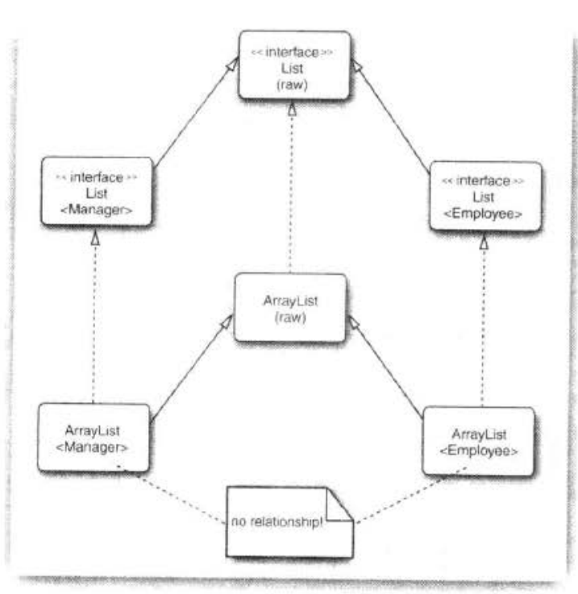

# █ 泛型

# 一. 什么是泛型

最常用的泛型类 `ArrayList<T>`, 在 Java 5.0 后出现

## 1. 泛型的好处

在 Java 引入泛型类之前, 泛型程序设计通过继承来实现, 比如在 5.0 之前, ArrayList 类中使用 `Object[]` 存储对象, 这种做法存在两个问题:

1. 添加对象时没有类型检查, 可以往 List 中添加任意类型的对象, 都不会引发编译错误或运行时异常.
2. 获取 List 中的一个对象时, 得到的是 Object 类型, 需要进行强制类型转换, 由于问题1, 强制类型转换可能会抛出类型转换异常.

引入泛型后, 提供了**类型参数**, ArrayList 类有一个类型参数用来指示元素的类型, 为开发者和编译器带来了方便, 使得程序有更好的可读性和安全性:

- **更好的可读性**, 开发者能够确定列表中的元素是什么类型.
- **编译时类型检查**,  `add()` 添加元素时, 检查加入的元素类型
- **运行时类型转换**, `get()` 获取元素时, 自动执行类型转换

## 2. 泛型使用的三个层级

泛型程序设计分为三个层次

1. 使用定义好的泛型类, 如使用 ArrayList 等集合泛型类, 不必考虑其中的工作方式和原理
2. 了解 Java 泛型的原理, 可以解决与 5.0 以前无类型代码对接时出现的问题
3. 自定义泛型类/方法, 根据自身需要, 设计出自定义的泛型类或泛型方法

## 3. 泛型类的结构


# 二. 泛型与虚拟机

## 1. 类型擦除

虚拟机中没有泛型类型对象, 所有对象都属于普通类.

对于一个定义好的泛型类, 都自动提供一个相应的**原始类型(raw type)**, 即将源代码中的类型参数 `<T>`, 替换成一个确定的类型, 这个操作称为**类型擦除**. 

编译器将类型变量, **替换成第一个限定**的类型, 如果未添加限定, 则使用 `Object` .

比如, `Generic<T>` 的原始类型为 `Generic`, 因为 T 没有限定, 直接用 Object 替换. 对于虚拟机而言, `Generic` 就是一个普通类, 就像泛型引入之前的 Java 已经实现的样子.

```java
// 定义的泛型类
public class Generic<T> {
    private T field;

    public void setField(T t) {...}
    
    public T getField() {...}
}

// 对应的原始类型, 将所有 T 换成 Object
public class Generic {
    private Object field;

    public void setField(Object t) {...}

    public Object getField() {...}
}
```

在类型擦除时, 原始类型使用第一个限定的类型变量来替换, 如果没有限定则使用 `Object` .

当有多个限定时, 由于原始类型使用第一个限定替换了 T, 编译器会在必要时插入强制类型转换, 这会影响效率. 为了提高效率, 应该**注意限定的排列顺序**, 如将标签接口(不提供任何方法)放在限定列表的最后面.

## 2. 翻译泛型表达式

由于类型擦除, 当程序调用泛型方法时, 若返回类型已经被擦除, 则编译器会自动插入相应的类型转换, 如 `getFirst` 本应返回 Employee 类型, 类型擦除后变成返回 Object 类型, 因此需要添加一个强制类型转换.

也就是说, 编译器把`getFirst()` 方法的调用翻译成了两条指令.

```java
// 原始代码
Pair<Employee> pair = ...;
Employee e = pair.getFirst();

// 类型擦除后, 编译器翻译结果
Pair pair = ...;
Object e1 = pair.getFirst();
Employee e = (Employee) e1;
```

当存取一个泛型域时, 也同样需要经过强制类型转换.

```java
// 原始代码, 假设 pair 的 second 域是 public
Pair<Employee> pair = ...;
Employee second = pair.second;

// 类型擦除后, 编译器翻译结果
Pair pair = ...;
Object second1 = pair.second;
Employee second = (Employee) second1;
```

## 3. 翻译泛型方法

泛型方法也会进行类型擦除, 擦除类型后, 泛型方法变成了一个普通方法

```java
// 泛型方法定义
public static <T extends Comparable> T min(T[] a){...}

// 类型擦除后, 变成一个普通方法, 只剩下限定类型
public static Comparable min(Comparable[] a){...}
```

方法的类型擦除会带两个复杂的问题, 下面详细谈论.

### 3.1. 

考虑这样一种情况, 子类继承了一个泛型类, 并且重写了泛型类中的泛型方法, 如:

```java
class DateInterval extends Pair<LocalDate> {
    // 重写了 Pair<T> 类中的方法
    public void setSecond(LocalDate second){
        if (second.compateTo(getFirst()) >= 0) {
            super.setSecond(second);
        }
    }
}
```

编译器进行类型擦除后, 变成了一个普通类

```java
class DateInterval extends Pair {
    // 并不是泛型方法, 形参的 LocalDate 类型未被擦除
    public void setSecond(LocalDate second){...}
}
```

让人疑惑的是, `DateInterval` 类中除了上述方法, 还存在着另外一个从 `Pair` 继承的 `setSecond()` 方法

```java
public void setSecond(Object second){...}
```

因为形参列表不同, 这显然是两个不同的方法, 但此处并不应该出现两个不同的方法, 考虑以下场景

```java
DateInterval interval = new DateInterval();
// 向上造型为 Pair 
Pair<LocalDate> pair = interval;
pair.setSecond(aDate);
```

在这里, 我们希望对 `setSecond()` 的调用具有多态性, pair 实际上是 DateInterval 类型, 理应调用 DateInterval  中的 `setSecond(LocalDate second)` 方法.

但此处没这么简单, 我们先分析一下上述场景中的具体执行过程:

变量 pair 已经声明为 `Pair<LocalDate>` , 而这个类中只有一个 `setSecond(Object)` 方法; 又因为 pair 实际对象是 `DateInterval`, 所以会调用 `DateInterval.setSecond(Object)`  方法.

由于类型擦除, 我们发现这与多态机制发生冲突, 要解决这个冲突, 编译器需要在 DateInterval  中生成一个**桥方法**

```java
// 这是在 DateInterval 中合成的桥方法, 调用了 setSecond(LocalDate)
public void setSecond(Object second) { 
    setSecond((LocalDate) second);
}
```

通过这个桥方法, 我们实现了对 `DateInterval.setSecond(LocalDate)` 方法的调用.

### 3.2. 

又假设 `DateInterval` 也覆盖了 `getSecond()` 方法

```java
public class DateInterval extends Pair<LocalDate> {
    public LocalDate getSecond(){
        return (LocalDate) super.getSecond().clone();
    }
}
```

那么在类型擦除后, `DateInterval` 类将会拥有两个 `getSecond()` 方法

```java
// 在 DateInterval 中定义的
public LocalDate getSecond(){...}

// 继承自 Pair 的
public Object getSecond(){...}
```

这很奇怪, 两个方法的签名完全一样(方法名相同, 参数列表同为空), 我们不能这样编写代码, 但是现在这种情况确实出现了. 

虽然编译器不允许开发者编写方法签名相同, 返回类型不同的方法, 但是在虚拟机中这是合法的, 虚拟机可以通过参数类型和返回类型来确定一个方法. 因此, 编译器可能会产生两个仅返回类型不同的方法字节码, 虚拟机能够正确地处理这种情况.

总之, 关于 java 泛型转换, 需要记住

- 虚拟机中没有泛型, 只有普通的类和方法

- 所有的类型参数, 都会用他们的限定类型替换
- 编译器会合成桥方法, 以保持多态性
- 为了保持类型安全性, 必要时会插入强制类型转换

## 4. 兼容非泛型类代码

设计 Java 泛型类型时, 一个重要的目标就是要允许泛型代码于遗留的非泛型类代码相互兼容.

与遗留代码协作, 有两种形式

### 4.1. 泛型类 >> 原始类型

类似于向上造型, 当需要将指定泛型类转变为原始类型时, 不会给出警告.

在这种情况下, 引入泛型能与原始类型很好地进行配合工作.

```java
@Test
public void testTtoObj() {
    ArrayList<String> strList = new ArrayList<>();

    // T to Obj, 类似向上造型, 不会出现编译警告
    doWithObjList(strList);
    ArrayList objList = getStrList();
}

public void doWithObjList(ArrayList objList) {
    objList.add(123);
    objList.add("ok");
    objList.add(new Random());
    System.out.println(objList.get(0));
}

public ArrayList<String> getStrList() {
    return new ArrayList<>();
}
```

### 4.2. 原始类型 >> 泛型类

此时涉及到强制类型转换, 编译器会给出警告, 需要开发者自己控制类型转换的正确性.

但这于引入泛型类之前没有什么区别, 泛型的引入并没有破坏程序的健壮性

```java
@Test
public void testObjToT() {
    ArrayList objList = new ArrayList();

    // Obj to T, 需要强制转换, 会有编译警告
    doWithStrList(objList);
    ArrayList<String> strList = getObjList();
}

public void doWithStrList(ArrayList<String> strList) {
    strList.add("123");
    strList.add("ok");
    strList.add("new Random");
    System.out.println(strList.get(0));
}

public ArrayList getObjList() {
    return new ArrayList();
}
```


# 三. 泛型的使用

## 1. 泛型接口

### 1.1. 声明

### 1.2. 调用

## 2. 泛型类

泛型类, 就是具有一个或多个类型参数变量的类. 

泛型类引入了类型变量, 习惯上使用单个大写字母表示, 并用尖括号`<>` 括起来放在**类名的后面**. 也可以引用多个类型参数, 与定义方法的参数列表一样, 使用逗号 `,` 隔开

> 修饰符 class 类名 **<类型参数>** {...}

```java
// 单个类型参数, 类型参数放在类名后面
public class Generic<T> {...}

// 多个类型参数, 使用逗号隔开
public class Generic<T, U> {...}
```

在类名后声明的泛型类型参数, 可以在类中如下4种地方使用:

```java
public class Generic<T> {
    // 类型参数 T 作为域的类型
    private T field;

    // 类型参数 T 作为方法的参数类型
    public void setField(T t) {...}

    // 类型参数 T 作为方法局部变量
    public void localType() {
        T t = getField();
    }

    // 类型参数 T 作为方法返回值类型
    public T getField() {...}
}
```

使用泛型类时, 在**类名后**用具体的类型替换类型参数, 就可以实例化泛型类型, 如使用 `Generic<String>` 时, 可以认为存在一个如下的类. 换句话说, 泛型类可以看作普通类的工厂.

```java
// 用 String 替换掉 Generic 类中的类型参数 T
public class Generic<String> {
    private String field;

    public void setField(String t) {...}

    public void localType() {
        String t = getField();
    }

    public String getField() {...}
}
```

## 3. 泛型方法

泛型方法, 就是具有一个或多个类型参数变量的方法. 

除了可以定义泛型类, 还可以在定义泛型方法. 泛型方法可以定义在泛型类中, 也可以定义在普通类中.

与定义泛型类时不同, 泛型方法的类型参数放在**修饰符后, 返回类型前**

> 方法修饰符 **<类型参数>**  方法返回值 方法名(参数列表) {...}

```java
public class Normal {
    public static <T> T getType() {...}
}
```

方法上的类型参数, 可以作为返回值类型, 或是方法内的局部变量类型来使用

```java
public class Normal {
    // 类型参数 T 作为方法返回值类型
    public static <T> T method1() {...}
    
    // 类型参数 T 作为方法参数类型
    public static <T> void method2(T t) {...}
    
    // 类型参数 T 作为方法局部变量类型
    public static <T> void method3() {
    	T t = method1();
    }
}
```

使用泛型方法时, 在**方法名前**面用尖括号 `<>` 指定具体的类型, 如 `Normal.<String>method1()` 

通常情况下, 实际调用时实参的信息就足够推断出泛型方法的具体参数类型, 因此大多数情况都可以省略泛型方法调用时的参数类型

```java
// 定义泛型方法
public static <T> T getMiddle(T... a) {
    return a[a.length / 2];
}

@Test
public void test() {
    // 在方法名前用尖括号确定参数类型
    String s1 = MethodDemo.<String>getMiddle("aa", "bb", "cc");
    System.out.println(s1);

    // 大多数情况下, 编译器能根据实参类型推断出泛型方法的具体类型, 因此可以省略类型参数
    String s2 = MethodDemo.getMiddle("a", "b", "c");
    System.out.println(s2);

    // 如果实参有多种类型, 编译器会尝试寻求公共父类型
    Number n = MethodDemo.getMiddle(1, 20L, 3.3f, 4.0);
    System.out.println(n);

    // 如果想知道编译器的推断类型, 可以故意引入错误, 则编译器会给出错误信息, 告知推断类型
    // String n2 = MethodDemo.getMiddle(1, 20L, 3.3f, 4.0);
}
```

## 4. 类型限定

有时候, 我们可能需要泛型类适配某一些类, 但不需要适配所有的类, 并且需要使用到这些适配类中的公共方法, 如果只是简单的使用通用的类型参数 `<T>`, 可能会无法满足需要, 比如

```java
public static <T> T min(T[] a) {
    if (a == null || a.length == 0 ){
        return null;
    }
    T smallest = a[0];
    for (int i = 1; i < a.length ; i++) {
        // 无法确定 T 类型中拥有 compareTo 方法, 此处编译错误
        if (smallest.compareTo(a[i]) > 0) {
            smallest = a[i];
        }
    }
    return smallest;
}
```

以上方法中, 由于无法确定 `<T>` 类型的对象拥有 `compareTo`  方法, 出现了编译错误.

解决这个问题的方法是为 `<T>` 设置限定, 限制为实现了 `Comparable` 接口的类型, 就可以在泛型方法中使用 `compareTo` 方法了. 

上例将 `<T>` 改成 `<T extends Comparable>` 即可.

 ```java
public static <T extends Comparable> T min(T[] a) {
    if (a == null || a.length == 0 ){
        return null;
    }
    T smallest = a[0];
    for (int i = 1; i < a.length ; i++) {
        if (smallest.compareTo(a[i]) > 0) {
            smallest = a[i];
        }
    }
    return smallest;
}
 ```

>  <T **extend** 限定类型>

根据上面的例子,  上述格式表示 T 是限定类型的子类型. T 和限定类型都可以是类或是接口, 注意此处不论限定类型是类还是接口, 都使用 `extends` 关键字, 这更接近于子类的概念

一个类型变量或通配符可以有多个限定, 用 `&` 连接, 

> <T extends **限定1 & 限定2**>

如果有多个类型参数, 则继续用逗号 `,` 隔开, 每个类型参数都需要单独设置限定类型

> <T extends 限定1, U extends 限定1 & 限定2>

同时, 由于 Java 的单继承多实现, 限定类型可以有多个, 但**限定类型中至多只有一个类**, 其余都必须是接口. 而且如果限定类型中有类, 则这个**类必须是限定列表中的第一个**

由于编译器会通过实参类型来推断泛型类型参数的具体类型, 实参有多种类型时会向上寻找父类, 最高可能会找到 `Object` 作为推断父类. 而限定类型限制了向上寻找父类时的极限, 即**限定类型是类型推断的上限**

# 四. 约束与局限性

由于 java 实现泛型需要进行类型擦除, 这对泛型类的使用带来了一些约束和限制

## 1. 不能使用基本类型作为类型参数

不能使用八种基本类型来作为类型参数, 比如不能使用 `ArrayList<double>` , 应使用其包装类 `ArrayList<Double>`

背后的原因是, 当进行类型擦除后, 会变成原始类型, 含有 `Object` 类型的域, 而 `Object` 不能存储基本类型的值. 

## 2. 运行时类型查询只适用于原始类型

由于虚拟机中并不记录泛型类型参数, 所有泛型类都会被擦除类型, 以原始类型的形式存在于虚拟机中, 因此, 所有的类型查询都只会返回原始类型.

```java
public void testTypeCheck() {
    ArrayList<String> list = new ArrayList<>();

    // 不能使用 instanceof 检查泛型类的类型参数, 编译错误
    // if (list instanceof ArrayList<String>) {
    //      System.out.println("list instanceof ArrayList<String>");
    // }

    if (list instanceof ArrayList) {
        System.out.println("list instanceof ArrayList");
    }
}
```

同样的道理, `getClass()` 也只会返回原始类型

```java
@Test
public void testGetClass() {
    ArrayList<String> strList = new ArrayList<>();
    ArrayList<Integer> intList = new ArrayList<>();

    System.out.println(strList.getClass()); // class java.util.ArrayList
    System.out.println(intList.getClass()); // class java.util.ArrayList
    System.out.println(strList.getClass() == intList.getClass()); // true
    System.out.println(strList.getClass().equals(intList.getClass())); // true
}
```

因为无法检查泛型类的参数类型, 在使用强制类型转换的时候, 总会给出编译警告, 需要开发者自己确保类型转换的正确性

如果确信类型转换不会出现问题, 可以添加注解 `@SuppressWarnings("unchecked") `, 抑制"未经类型检查"的警告

```java
public void testConver() {
    ArrayList list = new ArrayList();
    @SuppressWarnings("unchecked")
    ArrayList<Integer> list2 = (ArrayList<Integer>) list;
}
```

## 3. 不能创建参数化类型的数组

数组能够记住它包含的元素类型, 如果往数组中添加其他类型的元素, 会抛出元素类型错误的异常.

### 3.1. 不能初始化数组

但是对于泛型类的数组, 由于类型擦除, 数组只能记录原始类型, 并不能记录具体的参数化类型. 因此, 初始化数组的时候, 不允许指定具体的参数类型.

```java
@Test
public void testInit() {
    // 不允许泛型数组初始化
    // ArrayList<String>[] strList = new ArrayList<String>[10];

    // 只能用原始类型去初始化泛型数组
    ArrayList<String>[] strList1 = new ArrayList[10];
    // 或者使用通配符初始化, 再强转为指定类型的数组(实质还是原始类型数组, 便于编译器进行类型检查)
    ArrayList<Double>[] strList2 = (ArrayList<Double>[])new ArrayList<?>[10];
}
```

### 3.2. 可以声明数组变量

虽然不能使用具体的参数类型去初始化泛型类数组, 但可以在声明变量时指定具体的参数类型, 编译器可以对添加到数组中的元素进行类型检查.

但应该注意, 即便能往数组中加入不同类型, 在取出时也可能出现类型转换异常.

```java
@Test
public void testDeclare() {
    // 可以声明参数类型的数组变量, 但是只能用初始类型初始化, 有"未检查类型"的警告
    ArrayList<String>[] strArr = new ArrayList[10];

    // 往参数类型数组中, 存入参数类型元素, 编译器会进行类型检查, 若不符合会编译错误
    // strArr[0] = new ArrayList<Integer>();    // 编译错误
    strArr[0] = new ArrayList<String>();

    // 往原始类型数组中, 存入不同参数类型的元素, 不会编译错误
    ArrayList[] objArr = new ArrayList[10];
    objArr[0] = new ArrayList<String>();
    objArr[0] = new ArrayList<Integer>();

    // 将参数类型数组赋值给原始类型数组, 则原数组也可存入不同的参数类型元素, 不会编译错误
    ArrayList[] strArrToObjArr = strArr;
    // 可以存入 ArrayList<String>
    ArrayList<String> strList = new ArrayList<>();
    strList.add("hello generic");
    strArrToObjArr[0] = strList;
    // 可以存入 ArrayList<Integer>
    ArrayList<Integer> intList = new ArrayList<>();
    intList.add(123);
    strArrToObjArr[1] = intList;

    // 虽然存入了不同参数类型的元素, 但取出时可能出现类型转换异常
    // String s1 = strArr[1].get(0); // 类型转换异常
    String s2 = strArr[0].get(0);
}
```

## 4. 可变参数警告 (Varargs)

前面说到不支持泛型类型的数组, 下面再看一个相关的问题: 参数数量可变的方法, 其中参数列表中的 `T... ts` 其实是一个数组, 将会包含所有的实参

```java
public static <T> void addAll(Collection<T> coll, T... ts) {
    System.out.println(ts.getClass());
    for (T t : ts) {coll.add(t);}
}
```

如果有以下的调用, 则虚拟机似乎需要创建一个 `ArrayList<String> ` 的数组, 这违反了前面的规则, 实际上虚拟机只会创建原始类型的 `ArrayList[]` 

编译器会检查实参的类型参数是否正确, 若参数类型一致, 允许调用, 但会给出"创建泛型数组"的警告; 若类型不一致, 则会直接给出编译错误.

```java
@Test
public void test() {
    Collection<ArrayList<String>> coll = new LinkedList<>();
    // 原始类型可以正常调用
    ArrayList list1 = new ArrayList<String>();
    ArrayList list2 = new ArrayList<Integer>();
    addAll(coll, list1, list2);

    ArrayList<String> list3 = new ArrayList<String>();
    ArrayList<String> list4 = new ArrayList<String>();
    ArrayList<Integer> list5 = new ArrayList<Integer>();
    // 当实参的类型参数一致时, 可以调用, 但给出了"创建泛型数组"的警告
    addAll(coll, list3, list4);

    // 当实参的类型参数不一致时, 编译错误
    // addAll(coll, list3, list4, list5);
}
```

对于此时的"创建泛型数组"的警告, 可以采用两种方式去抑制

1. 在调用所在方法添加`@SuppressWarnings("unchecked")`
2. 为`addAll()` 方法添加 `@SafeVarargs`

## 5. 不能实例化类型变量

不能使用 `new T()`, `new T[10]`, `T.class` 等表达式, 其中的 T 会被擦除成原始类型, 显然不是我们想要的结果.

### 5.1. 通过反射获取实例

如果需要获取参数类型的实例, 传统做法是通过反射调用 `Class.newInstance()` 来构造泛型对象.

比如有如下的泛型类, 拥有一个参数化类型的实例域 `content`

```java
public class Container<T> {
    T content;
    public Container(T t){
        this.content = t;
    }
    public static <R> Container<R> reflexInstance(Class<R> cl) {
        try {
            return new Container<>(cl.newInstance());
        } catch (Exception e) {
            e.printStackTrace();
            return null;
        }
    }
}

class Content {
    private String name = "this is the content";
    @Override
    public String toString(){
        return this.name;
    }
}
```

调用时, 需要传入目标类型的 Class 对象. 

注意这里, `Class`类本身也是一个泛型类, 而`Content.class` 则是 `Class<Content>` 的唯一实例(单例)

```java
@Test
public void test2() {
    Container<Content> c = Container.reflexInstance(Content.class);
    System.out.println(c.content);// this is the content
}
```

### 5.2. 通过方法引用获取实例

Java 8 以后, 更好的做法是通过方法引用, 为泛型类传入一个构造方法

```java
public class Container<T> {
    T content;
    public Container(T t){
        this.content = t;
    }
    public static <T> Container<T> getInstance(Supplier<T> constructor) {
        return new Container<>(constructor.get());
    }
}
```

如果想要获取一个`Container<Content>` 类型的实例, 可以传入 `Content` 的构造器

```java
public void test1() {
    Container<Content> c = Container.getInstance(Content::new);
    System.out.println(c.content);// this is the content
}
```

## 6. 不能实例化泛型数组

就像不能实例化泛型实例一样, 也不能实例化泛型数组. 由于类型擦除, `new T[]` 将会变成原始类型数组.

### 6.1. 通过反射获取

```java

```

### 6.2. 通过方法引用获取

```java

```

## 7. 泛型类的静态内容不能使用类型参数

由于类型擦除, 泛型类本身并不会记录类型参数, 只会在调用的地方进行类型检查或类型转换.

而静态域/静态方法是属于类本身的内容, 因为泛型类不记录类型参数, 静态域/静态方法无法确定需要的具体类型, 所以禁止在静态域/静态方法中使用泛型类定义的类型参数.

但是可以定义静态的**泛型方法**, 这时静态泛型方法使用的参数类型, 在调用方法时确定

```java
public class l7_noStatic<T> {
    // 泛型类中的静态域不能使用参数类型
    // private static T name;

    // 泛型类中的静态方法中, 不允许使用泛型类定义的参数类型
    // public static T getT(Supplier<T> constructor) {
    //     return constructor.get();
    // }

    // 可以将静态方法定义为泛型方法, 使用有别于泛型类的类型参数
    public static <R> R getR(Supplier<R> constructor) {
        return constructor.get();
    }

    @Test
    public void testStaticT() {
        Content c = l7_noStatic.<Content>getR(Content::new);
        System.out.println(c);
    }
}
```

## 8. 泛型与异常

### 8.1. 泛型类不能扩展 Throwable

泛型类不允许扩展 Throwable, 因为编译后参数类型会被擦除, 而异常对象都是在运行时进行捕获和抛出, 已经丢失了其具体类型参数, 即便在定义异常的时候允许扩展, 在实际使用中也只能识别原始类型, 因此不允许泛型类扩展 Throwable.

```java
// 假设允许扩展 Throwable, 以下异常定义可以通过编译
class Problem<T> extends Exception{......}

// 在实际使用中需要进行捕获
public class TestProblem{
    public void test(){
        try{...}
        // 经过类型擦除后, 此处两个catch子句其实是相同的, java不允许相同的catch
        catch(Problem<Integer> e1){...}
        catch(Problem<Number> e2){...}
    }
}
```

### 8.2. 不能抛出泛型类

如果未对类型参数设置Throwable 的限定, 则不能作为异常被抛出.

如果需要抛出泛型对象, 需要为其类型添加 Throwable 的限定, 添加限定后也可以在方法的异常声明处使用该类型

```java
public class L8_Throwable<T extends Exception, R> {
    // 不允许抛出未加限定的泛型类对象, 会被擦除成Objcet, Object 不是 Throwable
    // public void throwR(Supplier<R> constructor) throws R {
    //     throw constructor.get();
    // }

    // 可以抛出限定为 Throwable 的泛型对象, 在方法的异常声明处也可以使用该类型
    public void throwT(Supplier<T> constructor) throws T {
        throw constructor.get();
    }
}
```

### 8.3. 不能捕获泛型类

在异常的 catch 子句中, 不允许使用类型参数. 因为会被擦除成原始类型, 若有多个catch子句, 可能会导致异常捕获的优先级被打乱, 因此不允许在 catch 子句中使用类型参数.

```java
public void catchT(Supplier<T> constructor){
    try {
        throwT(constructor);
        // 不能在 catch 子句中使用类型参数
        // } catch (T t1) {
    } catch (RuntimeException t1) {
        System.out.println("Catch Exception ok");
    } catch (Exception t1) {
        System.out.println("Catch Exception ok");
    }
}

@Test
public void testThrowable() {
    L8_Throwable<RuntimeException, String> t = new L8_Throwable<>();
    t.catchT(RuntimeException::new);
}
```

## 9. 可以消除对受查异常的检查

我们知道, 如果代码中抛出了受查异常, 则必须对其进行捕获, 否则无法通过编译. 

但是通过泛型类, 我们可以"消除"编译器对受查异常的检查. 请看下面这个例子:

```java
abstract class ThreadWithAnyException {
    // 定义一个泛型方法, 抛出指定类型的异常
    public static <T extends Throwable> void throwAs(Throwable t) throws T {
        // 由于类型擦除, 此处不会进行类型转换, 因此也不会抛出类型转换异常
        throw (T) t;
    }
    // 抽象方法, 以便放置具体的业务代码, 允许抛出任意类型的异常
    public abstract void body() throws Exception;

    public Thread toThread() {
        return new Thread(){
            public void run() {
                try {
                    body();
                } catch (Exception e) {
                    // 捕获 body() 抛出的任意类型异常
                    // 以 RuntimeException 为类型参数, 编译器认为此处会抛出非受查异常
                    ThreadWithAnyException.<RuntimeException>throwAs(e);
                }
            }
        };
    }
}
```

如果使用原始的 `Thread` 类创建线程, 由于 `run()` 声明为不抛出任何受查异常.因此必须在 `run()` 方法中捕获.

而使用上述的泛型类自动对受查异常进行包装, 则放置业务代码的`body()` 方法可以抛出任意类型的异常

```java
public class L9_ConverToRTE {
    @Test
    public void test1() {
        // 业务逻辑中可以抛出任意类型的异常
        new ThreadWithAnyException(){
            @Override
            public void body() throws Exception {
                throw new FileNotFoundException();
            }
        }.toThread().run();
    }

    @Test
    public void test2() {
        // 使用原始的Thread, 必须在业务 run 方法中捕获所有受查异常, 包装成非受查异常
        new Thread(){
            @Override
            public void run() {
                try {
                    throw new FileNotFoundException();
                } catch (FileNotFoundException e) {
                    throw new RuntimeException(e);
                }
            }
        }.run();
    }
}
```

可以基于此原理, 构造一个工具类

```java
class Utils {
    @SuppressWarnings("unchecked")
    private static <T extends Throwable> void throwException(Throwable exception, Object dummy) throws T{
        throw (T) exception;
    }

    public static void throwException(Throwable exception) {
        Utils.<RuntimeException>throwException(exception, null);
    }
}

public class Test {
    public static void main(String[] args) {
        Utils.throwException(new Exception("This is an exception!"));
    }
}
```


## 10. 类型擦除后的冲突

当泛型类型被擦除后, 可能会导致一些冲突.

比如, 在泛型类中 `Box<T>` 写了一个`equals()` 方法, 并以类型参数 `T` 作为形参的类型.

```java
class Box<T> {
    T value;
    // 编译错误, 方法签名冲突
    public boolean equals(T value){
        return this.value.equals(value);
    }
}
```

考虑 `Box<String>`, 直觉上, 应该会存在两个 `equals()` 方法:

- 在泛型类中定义: `public boolean equals(String value)`
- Object 类继承的: `public boolean equals(Object value)`

但实际上, 类型擦除之后, 泛型类中的 equals 与 Object 类中的方法签名完全一致, 导致了冲突. 解决办法就是改方法名, 或者与 Object 中定义的一样, 使用 `Object` 作为方法形参类型, 从而覆盖 Object 类中的版本.

泛型规范还有另一条原则: 

- 一个类或其类型变量, 不能同时成为两个接口 (这两个接口是同一接口的不同参数化) 的子类

这条规则有点绕, 来看一个例子

```java
class Aoo implements Comparable<String>{...}
class Boo extends Aoo implements Comparable<Integer>{...}
```

这样的 `Boo` 将不能通过编译, 因为 `Comparable<String>` 和 `Comparable<Integer>` 是同一接口的不同参数化. 

这主要是因为合成的桥方法发生了冲突, 实现了 `Comparable<X>` 的类, 编译后会生成一个桥方法. 如果上面的例子通过编译, 应该要生成两个桥方法, 但这两个方法签名冲突, 导致编译错误.

```java
// 为 Comparable<String> 创建的
public int comparaTo(Object o) { return comparaTo((String) o); }
// 为 Comparable<Integer> 创建的
public int comparaTo(Object o) { return comparaTo((Integer) o); }
```

# 五. 泛型类型的继承规则

泛型类的不同参数化之间, 不存在继承关系. 

比如 `Teacher` 是 `Person` 的子类 , 但 `ArrayList<Teacher>` 并不是 `ArrayList<Person>` 的子类, 如下面的例子

```java
class Person {}
class Teacher extends Person {}

public class F1_extendsDemo {
    @Test
    public void testExtend() {
        // Teacher 是 Person 的子类
        Person person = new Teacher();
        
        // ArrayList<Teacher> 不是 ArrayList<Pserson> 的子类, 编译错误
        // ArrayList<Person> personList = getTeachers();
        
        // 并且不允许在同一泛型类的不同参数化之间直接进行强转
        // ArrayList<Person> personList1 = (ArrayList<Person>) getTeachers();
    }

    public ArrayList<Teacher> getTeachers() {
        ArrayList<Teacher> teacherList = new ArrayList<>();
        teacherList.add(new Teacher());
        return teacherList;
    }
    public ArrayList<Person> getPersons() {
        ArrayList<Person> personList = new ArrayList<>();
        personList.add(new Person());
        return personList;
    }
}
```

编译器不仅不允许直接将 `ArrayList<Teacher>` 赋值给 `ArrayList<Person>` , 而且也不允许在同一泛型类的不同参数化之间直接进行强转.这似乎过于严格, 但这对类型安全很重要.

虽然编译器不允许对象在泛型类的不同参数化之间强转, 但允许原始类型与参数化类型之间的强转, 我们来看看进行转化后的情况:

转换后 `personList` 与 `teacherList` 引用了同一个对象, 如果在 `personList` 中添加 `Person` 对象, 这对 `teacherList` 而言是不合法的, 取出对象时会出现类型错误. 

```java
@Test
public void test() {
    ArrayList<Teacher> teacherList = getTeachers();
    // 不允许在不同参数化之间强转, 只允许原始类型与参数化类型之间强转
    ArrayList<Person> personList = (ArrayList<Person>) (ArrayList) teacherList;
    Person p1 = personList.get(0);

    // 这时 personList 与 teacherList 引用了同一个对象
    personList.add(new Person());
    Teacher teacher = teacherList.get(1);// ClassCastException
}
```

另外, 泛型类本身也可以扩展或实现其他的泛型类, 这点与普通类是一样的, 

比如 `ArrayList<T>` 实现了 `List<T>` 接口, 这意味着 `ArrayList<Teacher>` 可以被转换为 `List<Manager>`

```java
public void test() {
    List<Teacher> list = getTeachers(); // ok
    Teacher t = list.get(0);
}
```

最后, 用一个图表示, 泛型类与普通类一样, 可以有继承/实现关系, 但同一个泛型类的不同参数化之间, 则不存在继承/实现的关系.



# 六. 通配符

固定的泛型类系统, 使用起来可能不够灵活, 为此, Java 设计者提供了一种巧妙但足够安全的解决方法, 即使用"**通配符**" 对泛型类进行参数化.

直观的讲, 带有超类型限定的通配符, 可以向泛型对象写入, 带有子类型限定的通配符, 可以从泛型对象读取

## 1. ? extends T

比如 `ArrayList<? extends Animal>`, 表示参数类型为 `Animal` 子类的任何泛型 `ArrayList`,  如 `ArrayList<Cat>`,  `ArrayList<Dog>`,但不包括 `ArrayList<String>`

假设需要一个输出 `ArrayList<Animal>` 的方法, 如

```java
public void printList(ArrayList<Animal>list){
    System.out.println(list);
}
```

正如前面介绍, java 不允许同一泛型类的不同参数化之间直接类型转换, 我们不能将 `ArrayList<Cat>` 或 `ArrayList<Dog>` 作为实参传入, 这点很受限制, 

```java
public void test1() {
    ArrayList<Animal> animals = new ArrayList<>();
    ArrayList<Cat> cats = new ArrayList<>();
    ArrayList<Dog> dogs = new ArrayList<>();

    // 不能将 ArrayList<Cat> 或 ArrayList<Dog> 作为 ArrayList<Animal> 的实参传入
    printList(animals);
    // printList(cats);	// 参数类型不匹配, 编译错误
    // printList(dogs);	// 参数类型不匹配, 编译错误
}
```

解决的方法就是将该方法的形参类型, 改成带子类限定的通配符类型, 这样就可以接受不同参数类型了

```java
// 改成以 ArrayList<? extends Animal> 为形参类型
public void printListExtend(ArrayList<? extends Animal> list){
    System.out.println(list);
}

public void test2() {
    ArrayList<Animal> animals = new ArrayList<>();
    ArrayList<Cat> cats = new ArrayList<>();
    ArrayList<Dog> dogs = new ArrayList<>();

    // 将 ArrayList<Cat> 或 ArrayList<Dog> 作为实参
    printListExtend(animals);
    printListExtend(cats);
    printListExtend(dogs);
}
```

使用通配符时, 我们可以认为 `ArrayList<Cat>` 和 `ArrayList<Dog>` 是 `ArrayList<? extends Animal>` 的子类, 如图所示

> 这里要插图

前面介绍泛型类不同参数化之间没有继承关系时, 我们说这是出于类型安全的考虑, 那么, 使用通配符会不会破坏安全性呢?

```java
public void test3() {
    ArrayList<Cat> cats = new ArrayList<>();
    // 将 ArrayList<Cat> 向上造型为 ArrayList<Animal>, 没问题
    ArrayList<? extends Animal> animals = cats;
    // 尝试往里面添加对象, 编译失败
    // animals.add(new Animal());
    // animals.add(new Cat());
}
```

编译器会对泛型类对象的操作进行类型检查, 只有满足了类型参数要求的才能通过编译. 而通配符参数化的泛型类, 在这里无法通过类型检查, 编译失败.

在讲为什么无法通过类型检查之前, 我们先来复习一下**变量声明类型**与**对象实际类型**的区别.

```java
A obj = new B();
```

在上述这个表达式中, 我们用 B 构造了一个对象, 这个对象的真实类型是 B 的. 

然后我们将这个对象, 赋值给了 A 类型的变量 obj, 从这里开始, 引用这个对象的变量 obj, 就 "忘了" 自己原来是 B 类型, 并且后续的语句中, 编译器也会**基于变量的声明类型 A 检查**后续操作是否合法; 而编译后运行时具体会执行哪个方法, 是要根据对象的实际类型去动态绑定的. 

考虑`ArrayList<? extends Animal> animals = cats` , 在这条表达式之后, `animals` 变量只知道自己引用的是`ArrayList` , 类型参数是 `Animal`  的子类, 但已经"忘了"具体是什么类型. 于是编译器在后续的检查中, 无法确定这个 ArrayList 到底能接收什么类型的参数, 只能拒绝传送任何类型.

对于 `ArrayList<? extends Animal>` 类型, 里面的 `add()` 和 `get()` 方法应该是这样的

```java
void add(? extends Animal){...}
? extends Animal get(int n){...}
```

编译器知道 `add` 方法需要 `Animal` 的某个子类, 但无法确定什么类型才是安全, 因此它拒绝接受任何特定的类型, 从而导致 `add` 方法不可用.

而 `get` 方法, 因为返回的对象肯定是 `Animal` 的一个子类对象, 不论是哪个子类, 都能以 `Animal` 类型返回, 所以 `get` 方法会返回一个 `Animal` 类型的对象.

## 2. ? super T

除了**"带子类限定的通配符"**, java 还提供了**"带超类限定的通配符"**, 以 `<? super T>` 表示

这个通配符限制为 `T` 的所有超类, 正好与上一节中带子类限定的通配符相反. 比如 `ArrayList<? super Cat>` , 将提供这样的方法

```java
void add(? super Cat){...}
? super Cat get(int n){...}
```

编译器知道 `ArrayList` 的类型参数可能是 `Cat` 的任意一个超类, 但无法确定具体是哪一个.

 `add` 方法的参数应该是 `Cat` 的一个超类对象, 但不论是哪一个超类, 都肯定能接收 `Cat` 对象, 于是 `add` 方法允许使用 `Cat` 及其子类的对象作为实参.

`get` 方法也类似, 它只知道返回的类型可能是 `Object` - `Cat` 之间的任何一个超类的对象, 同样也不能确定具体的类型, 只有 `Object` 是安全的, 所以 `get` 方法只能返回 `Object` 类型的对象.

## 3. 不带限定的通配符

# █ 反射

## 1. 什么是反射

反射是 Java 提供的动态执行机制, 可以动态加载类, 动态创建对象, 是动态访问属性, 动态调用方法

#### 1.1. 静态执行

Java 代码经过编译以后就确定的执行次序, 称为静态执行次序

```java
Foo foo = new Foo();
foo.test();
```

#### 1.2. 动态执行

- 在运行期间才确定创建哪个类的对象, 执行哪个方法, 称为动态执行. Java 反射 API 可以实现动态执行
- 如需要执行某个指定类中全部的以 test 为开头的方法, 必须使用反射实现

### 1.3. 反射的特点

1. 是 Java 提供的 API, 提供了一系列的功能
2. 是 Java 底层的执行机制

## 2. 反射的功能

### 2.1. 动态加载类

将类名对应的类, 加载到方法区, 如果类名错误, 则抛出异常

> Class.forName( 包名.类名 )

### 2.2. 动态创建对象

动态创建对象, 根据动态加载得来的类, 创建其的一个实例

可以创建任何对象, 但要求 cls 创建的类必须有无参构造器( JavaBean ), 如果没有无参构造器, 则会抛出异常.

> Class cls = Class.forName( 包名.类名 )
> Object obj = cls.newInstance();

反射 API 可以利用 Constructer API 支持有参数构造器, 此处略.\

### 2.3. 动态获取类中的方法信息

通过反射, 可以返回类中声明的所有方法的信息
返回值是一个数组, 数组中元素为 java.lang.reflect.Method 类的对象

> Method[] methods = cls.getDeclaredMethods();
> for( Method m : methods ){
> 　　System.out.println( m );
> }

给定方法名, 可以找到指定的方法

> Method m = cls.getDeclaredMethod( 方法名 );
> 输出:

	public java.lang.String demo.Aoo.getName()
	public void demo.Aoo.setName(java.lang.String)
	public int demo.Aoo.getAge()
	public void demo.Aoo.setAge(int)

### 2.4. 动态获取类中的属性信息

通过反射, 可以获取类中声明的所有属性的信息
返回值是一个数组, 数组中元素为 java.lang.reflect.Field类的对象

> Field[] field = cls.getDeclaredFields();
> for( Field f : field ){
> 　　System.out.println( f );
> }

输出: 

	private java.lang.String demo.Aoo.name
	private int demo.Aoo.age

### 2.5. 动态执行实例方法

1. 必须有对象
2. 找到对象所属类的方法信息

#### 案例:

```java
//在类信息中查找一个方法信息
Method m = cls.getDeclaredMethod("m", args);

//获取类中的一个对象
Object obj = cls.newInstance();

//动态调用方法, val是方法返回值, 还可能抛出各种异常
Object val = m.invoke(obj);
```

1. 实例, 无参方法
2. 实例, 有参方法
3. 静态, 无参方法
4. 静态, 有参方法
5. 实例, 重载的方法
6. 静态, 重载的方法

### 2.6. 利用反射临时修改访问权限

对于受访问权限限制的方法或属性, 如private 修饰的方法, 
可以通过反射访问, 但实际上这样的操作破坏了封装性.

> method.setAccessible(true);

## 3. 反射的用途

1. Eclipse 中的快捷菜单, 以及 Outline 结构解析, 利用反射机制获取类中的属性和方法
2. Spring 利用了反射

   1. 动态加载类
   2. 动态创建Bean
   3. 动态注入属性, 包括私有属性注入
   4. 动态解析注解
3. MyBatis 利用了反射. 将查询结果注入到 Bean 再返回

   1. 动态创建对象
   2. 动态调用 setter 方法注入属性
   3. 动态加入到 list
4. JUnit 使用了反射
5. 注解的解析使用了反射
6. Servlet调用使用了反射

# 一. 概述

反射是一个强大的工具, 能够动态操作 java 代码, 在运行时修改java 类, 反射机制的功能极其强大, 可以用在以下方面:

-  在运行时分析类的能力, 知道类中具有哪些属性与方法
- 在运行中查看对象或修改对象, 比如为对象属性赋值, 或编写一个 toString 方法供所有类使用
- 实现通用的数组操作代码
- 利用 method 对象, 这个对象就像是 C++ 中的函数指针

反射是一种功能强大且复杂的机制, 它的主要用户是工具的构造者, 而不是应用程序员.

# 二. 获取 Class 对象

在程序运行期间, java 虚拟机始终为所有的对象维护一个被称为运行时的类型标识. 这个类型信息跟踪者每个对象所属的类. 虚拟机利用运行时类型信息, 选择相应的方法执行

可以通过专门的 java 类访问这些信息. 保存这些信息的类被称为 `Class`, 这个名字可能很容易让人混淆.

请注意, 一个 Class 对象实际上表示的是一个类型, 这个类型不一定是一个 java 类, 也可以是基本类型, 甚至是 void 空类型.

## 1. 通过类型获取

任意的 java 类型(包括基本类型, 引用类型, 甚至是 void 关键字), `Type.class` 就表示对应的类对象.

Class 对象描述了一种类型, 但这个类型不一定是一个类. 比如基本类型, 没有对应的类, 但是却拥有对应的 `Class` 对象.

这种方式适用于任意的 java 类型, 但需要编码, 无法在运行时动态获取不同类型.

> Class cl = **Type.class**

```java
public void testTClass() {
    // 基本类型
    Class intCl = int.class;
    System.out.println(intCl);// int
    // 引用类型
    Class strCl = String.class;
    System.out.println(strCl);// class java.lang.String
    // void 关键字
    Class voidCl = void.class;
    System.out.println(voidCl);// void
}
```

对于数组, 获取到的类型名可能会有点奇怪, Java 本身对于这一块制定了相应规则, 在元素的类型前面添加相应数量的 `[` 符号，用 `[` 的个数来提示数组的维度

- 基础类型: `[` + `类型编码`
- 引用类型: `[` + `L具体类型`
- 数组类型: `[` + `元素类型`

```java
public void testArrayClass() {
    System.out.println(byte[].class); // class [B
    System.out.println(boolean[].class); // class [Z
    System.out.println(int[].class); // class [I
    System.out.println(int[][].class); // class [[I
    System.out.println(Integer[].class); // class [Ljava.lang.Integer;
    System.out.println(Integer[][][].class);  // class [[[Ljava.lang.Integer;
}
```

## 2. 通过已有对象获取

 `Object` 类中的 `getClass()` 方法将会返回一个当前对象对应的 `Class` 类型实例.

这种方法要求已经存在一个该类的对象, 然后再通过这个对象, 获取其类型对象, 不支持基本类型.

> Class cl = **obj.getClass()**

```java
public void testGetClass() {
    String s = "hello reflex";
    // 获取一个 Class 类型的实例
    Class cl = s.getClass();
    System.out.println(cl); // class java.lang.String
}
```

## 3. 通过 forName 方法获取

 `Class` 类的静态方法 `forName()`, 可以根据类名获取该类的 `Class` 对象. 如果类名保存在字符串中, 并且可能会在运行时改变, 就可以通过这个方法获取指定的类对象. 但这个方法可能会抛出一个受查异常, 需要将该异常捕获或者抛出.

这种方式要求知道一个类的完整类名, 不支持基本类型, 数组.

> Class cl = **Class.forName(“完整类名”)**

```java
public void testForName() throws ClassNotFoundException {
    // 根据类名获取 Class 对象, 需要提供完整类名(含包名)
    String name = "com.loyofo.core.s6_interface.e0_demo.Manager";
    Class cl = Class.forName(name);
    System.out.println(cl);// class com.loyofo.core.s6_interface.e0_demo.Manager
}
```

在程序启动时, 会加载包含 `main()` 方法的类, 它会加载所有需要的类, 这些被加载的类又要加载它们需要的类, 直到所有需要的类都加载完成. 对于一个大型应用程序, 这个过程可能会消耗很多时间. 我们可以这么变通一下: 包含 `main()` 方法的类避免显示引用太多其他的类, 启动后显示一个启动画面,  然后再通过 `Class.forName()`  加载程序需要的其他类.

## 4. 相等与泛型

虚拟机中每个类型都只会有一个 `Class` 对象, 因此可以通过 `==` 来比较不同方式获取的类对象

```java
public void testEquals() throws Exception{
    System.out.println("str".getClass() == String.class);  // true
    System.out.println(Class.forName("java.lang.String") == String.class);  // true
    System.out.println(Class.forName("java.lang.String") == "str".getClass());  // true
}
```

从 java 1.5 开始, Class 类已经参数化了, 是一个泛型类. 比如 `Class<Employee>` 的类型是`Employee`, 这使得原本就抽象的概念更加复杂化, 但在大多数实际情况中, 我们可以忽略类型参数, 直接使用原始的 Class 类.

# 三. 获取类的信息

如同一个 `String` 对象描述了一个特定字符串的属性一样, 一个 `Class` 对象描述了一个特定类的属性. 通过这个 `Class` 对象, 可以获取该类的类名, 超类, 方法等信息.

```java
public void test2() {
    Manager manager = new Manager();
    // 获取一个 Class 类型的实例
    Class cl = manager.getClass();
    // 获取完整类名(含包名)
    System.out.println(cl.getName()); // com.loyofo.core.s6_interface.e0_demo.Manager
    // 获取简单类名(不含包名)
    System.out.println(cl.getSimpleName()); // Manager
    // 获取方法列表
    Method[] methods = cl.getMethods();
    for (Method m : methods) {
        System.out.println(m);
    }
}
```

在 `java.lang.reflect` 包中有三个重要的类: `Field`, `Method`, `Constructor`, 分别描述类的域, 方法以及构造器. 这三个类中都含有 `getName()` 方法, 可获取该项目的名称. 还有一个`getModifiers` 可以获取一个描述修饰符的 int 数值.

## 1. Field

可以通过 `Class` 对象的 `getFields()` 方法获取目标类中定义 (以及从超类中继承) 的 `public` 域.

```java
// 定义两个类, 包含了四种访问控制的实例域以及 public 的静态域
class Aoo {
    public int publicAtAoo;
    protected int protectedAtAoo;
    int packageAtAoo;
    private int privateAtAoo;

    public static int publicStaticAtAoo;
}
class Boo extends Aoo {
    public int publicAtBoo;
    protected int protectedAtBoo;
    int packageAtBoo;
    private int privateAtBoo;

    public static int publicStaticAtBoo;
}

// 获取超类和子类的 Field[], 并打印输出
public class Demo {
    @Test
    public void testGetField() {
        System.out.println("Aoo Fields:");
        Class aooCL = Aoo.class;
        Field[] aooFields = aooCL.getFields();
        printArray(aooFields);

        System.out.println("Boo Fields:");
        Class booCl = Boo.class;
        Field[] booFields = booCl.getFields();
        printArray(booFields);
    }

    public void printArray(Object[] array) {
        for (Object obj : array) {
            System.out.println(obj);
        }
        System.out.println();
    }
}
```

上面的例子中, 我们定义了两个类, 包含四种访问修饰符的实例域, 以及 public 的静态域, 打印输出后结果如下

```java
Aoo Fields:
public int com.loyofo.core.s5_reflex.e1_Class.Aoo.publicAtAoo
public static int com.loyofo.core.s5_reflex.e1_Class.Aoo.publicStaticAtAoo

Boo Fields:
public int com.loyofo.core.s5_reflex.e1_Class.Boo.publicAtBoo
public static int com.loyofo.core.s5_reflex.e1_Class.Boo.publicStaticAtBoo
public int com.loyofo.core.s5_reflex.e1_Class.Aoo.publicAtAoo
public static int com.loyofo.core.s5_reflex.e1_Class.Aoo.publicStaticAtAoo
```

可以看出, 默认情况下反射只能获取到 `public` 域, 包括在类中定义的以及从超类中继承过来的. 而其他访问控制的域则不会被获取. 

```java
@Test
public void testGetDeclaredField() {
    System.out.println("Aoo Fields:");
    Class aooCL = Aoo.class;
    Field[] aooFields = aooCL.getDeclaredFields();
    printArray(aooFields);

    System.out.println("Boo Fields:");
    Class booCl = Boo.class;
    Field[] booFields = booCl.getDeclaredFields();
    printArray(booFields);
}
```

`getDeclaredFields()` 方法则会返回在类中定义的所有域, 但不包含从超类继承的

```java
Aoo Fields:
public int com.loyofo.core.s5_reflex.e1_Class.Aoo.publicAtAoo
protected int com.loyofo.core.s5_reflex.e1_Class.Aoo.protectedAtAoo
int com.loyofo.core.s5_reflex.e1_Class.Aoo.packageAtAoo
private int com.loyofo.core.s5_reflex.e1_Class.Aoo.privateAtAoo
public static int com.loyofo.core.s5_reflex.e1_Class.Aoo.publicStaticAtAoo

Boo Fields:
public int com.loyofo.core.s5_reflex.e1_Class.Boo.publicAtBoo
protected int com.loyofo.core.s5_reflex.e1_Class.Boo.protectedAtBoo
int com.loyofo.core.s5_reflex.e1_Class.Boo.packageAtBoo
private int com.loyofo.core.s5_reflex.e1_Class.Boo.privateAtBoo
public static int com.loyofo.core.s5_reflex.e1_Class.Boo.publicStaticAtBoo
```


## 2. Method

可以通过 `Class` 对象的 `getFields()` 方法获取目标类中定义 (以及从超类中继承) 的 `public` 域.

## 3. Constructor

可以通过 `Class` 对象的 `getFields()` 方法获取目标类中定义 (以及从超类中继承) 的 `public` 域.

## 4. Modifier

可以通过 `Field`, `Method`, `Constructor`, 对象的 `getFields()` 方法获取目标类中定义 (以及从超类中继承) 的 `public` 域.


# 三. 创建类的对象

`Class` 对象除了能获取类型信息, 还有一个很有用的方法: `newInstance()`. 这个方法会调用该类默认的无参构造, 可以用来创建指定类的对象, 如果该类没有无参构造, 就会抛出一个异常.

结合 `Class.forName()` 或 `obj.getClass()`, 可以在运行时动态创建对象. 返回的是 `Object` 对象, 可能需要强转成目标类型.

```java
public void test7() {
    try {
        Manager manager1 = new Manager("张三", 20, "男");
        Manager manager2 = manager1.getClass().newInstance();
        System.out.println("创建 Manager ok");

        String empName = "com.loyofo.core.s6_interface.e0_demo.Employee";
        Employee employee = (Employee) Class.forName(empName).newInstance();
        System.out.println("创建 Employee ok");
    } catch (Exception e) {
        System.out.println("newInstance 异常:" + e.getCause());
    }
}
```

如果需要使用带参数的构造方法, 需要通过 `Class` 对象先获取到含参构造, 然后再通过 `Constructor.newInstance(Object...)` 方法调用指定的构造器

```java
public void test8() {
    try {
        String empName = "com.loyofo.core.s6_interface.e0_demo.Employee";
        Constructor[] cs = Class.forName(empName).getConstructors();
        Constructor c = cs[0];
        Object obj = c.newInstance("反射创建员工", 22, "男");
        System.out.println(obj);    // Employee{name='反射创建员工', age=22, sex='男'}
    } catch (Exception e) {
        System.out.println("newInstance 异常:" + e.getCause());
    }
}
```

# 四. 分析类的结构

反射机制中最重要的一项内容: 检查类的结构


# 五. 运行时分析对象

在编写程序时, 如果类中某个实例域名称和类型,  可以很容易地获取到域的内容, 而反射机制, 则可以查看在编译时还不清楚的对象域.

查看对象实例域的关键方法是 `Field` 类中的 `get(obj)` 方法, 如果 f 是一个 Field 类型的对象, 而 `obj` 是某个包含 `f` 域的类的对象, 那么 `f.get(obj)` 就会返回 `obj` 对象中 `f` 域的值-

```java
public void testGetFieldValue() throws IllegalAccessException, NoSuchFieldException {
    Employee employee = new Employee("张三", 11, "男");
    Class cl = employee.getClass();
    // 获取 public 域
    Field f2 = cl.getDeclaredField("pbname");
    System.out.println(f2.get(employee));

    // 获取 private 域
    Field f1 = cl.getDeclaredField("name");
    System.out.println(f1.get(employee));
}
```

但是这里还有一个问题, 由于`name` 是一个私有域, 只能用目标类中定义的 `get()` 方法才能获取到值, 而 Field 类的 get 方法会抛出一个 `IllegalAccessException` 的异常.

反射机制的默认行为受限于 java 的访问控制, 除非拥有访问权限, 否则 java 安全机制只允许查看任意对象的域和类型, 但不允许读取他们的值.

然而, 如果一个程序没有收到安全管理器的控制, 就可以覆盖访问控制, 从而访问到原本不允许访问的域或方法.

`AccessibleObject` 类是 `Field`, `Method`, `Contructor`  的公共超类, 提供了两个方法:

> public static void setAccessible(AccessibleObject[] array, boolean flag)
>
> public void setAccessible(boolean flag)

第一个是静态方法, 可以将一个数组内的元素都设置为可访问的, 第二个是实例方法, 某个对象可以设置自己为可访问的.

这两个方法是为了调试, 持久存储和相似机制提供的.

# 六. 调用任意方法

Method 类中有一个 invoke 方法, 允许调用当前 Method 对象中的方法.

>Object invoke(Object obj, Object... args)

第一个参数是隐式参数, 指示要调用当前方法的那个对象, 如果是静态方法, 这里需要传入一个 null

剩下的参数是显式参数, 指示当前方法的参数列表, 如果是无参方法, 这里需要传入一个 null

也就是说, invoke 至少需要两个实参(可以为null). 

invoke 声明的返回类型是 Object, 实际类型则视具体方法的不同而不同. 如果返回类型是基本类型,  invoke 方法会返回其包装类型, 获取到 invoke 返回的 Object 类型后, 需要再进行强制类型转化, 恢复其具体类型. 

# 1. 获取指定的方法

如何获取某个指定的 Method 对象呢, 可以先获取类中的所有方法, 然后再查找到想要的方法

如果已知方法名, 也可以通过 Class 类的 getMethod 方法获取. 

填入一个参数时, 获取无参方法

填写多个参数时, 后面的参数是目标方法的参数类型.

可能存在多个同名的方法, 这时还需要传入具体的参数类型


