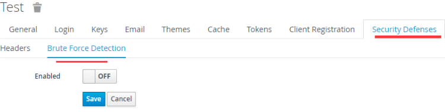
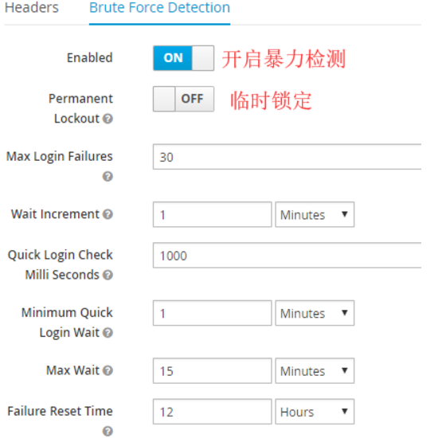

# 开关

Realm Settings –》 Security Defenses —》Brute Force Detection
Realm的该配置项，默认是未开启状态。

Enabled 值为ON，开启暴力检测。

# 暴力检测

* 开启暴力检测后，如遇到暴力检测，可以临时锁定账号，或者永久锁定账号。
* 临时锁定账号后，过一段时候后，该账号会自动解锁。
* 永久锁定的账号，需要登录keycloak管理控制台手动解锁。

# 临时锁定和永久锁定的公共配置

* Permanent Lockout
  * 值为 ON表示永久锁定被暴力检测的账号。
  * 值为 OFF 表示临时锁定被暴力检测的账号。
* Max Login Failures
  * 登录失败次数达到多少次时，（临时/永久）锁定账号。
  * 次数统计仅与登录账号相关，与会话无关，关闭重启浏览器，次数不会重置。
* Quick Login Check Milli Seconds
  * 快速登录检测，两次登录请求之间的时间间隔（单位毫秒）小于该值时，则认定为快速登录。
* Minimum Quick Login Wait
  * 一旦被认定为快速登录，该账号将被临时锁定为该配置项配置的时长。
  * 达到锁定时长后，会自动解锁。

# 临时锁定配置说明：

以上截图中的数值是Realm开启暴力检测后的默认值。

* Wait Increment锁定时长基准值
* Max Wait  最大锁定时长
* Failure Reset Time登录失败次数重置时间，即经过该配置项配置的时长后，账号的登录失败次数将被重置为0，否则继续累加。

> 实际锁定时长 =  Wait Increment 乘以 (当前登录失败次数/ Max Login Failures) 其中 （当前登录失败次数/ Max Login Failures） 的结果向下取整，如：1/2=0; 3/2=1

# 按照上述截图中的配置，锁定场景如下

* 12小时内，同一账号，
* 连续登录失败次数到达30次，将锁定该账号 1*(30/30)=1分钟。
* 连续登录失败次数到达60次，将锁定该账号 1*(60/30)=2分钟。
* 如果12小时内，同一账号，连续登录失败次数没有达到30次（如达到了20次），那么距离首次登录失败的时间超过12小时后，再次登录失败，登录失败次数计数器将重置为1.
