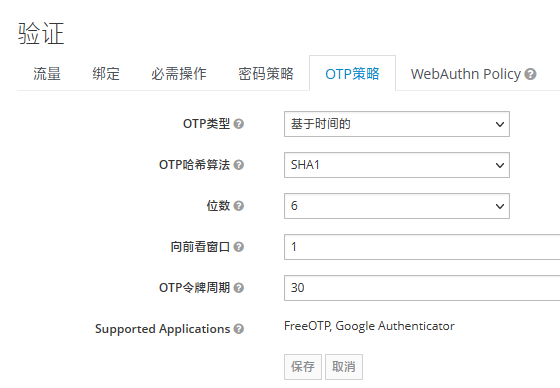
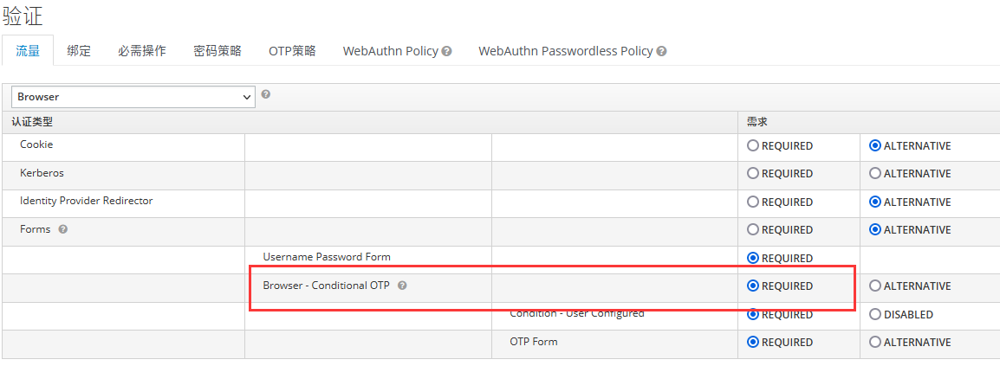
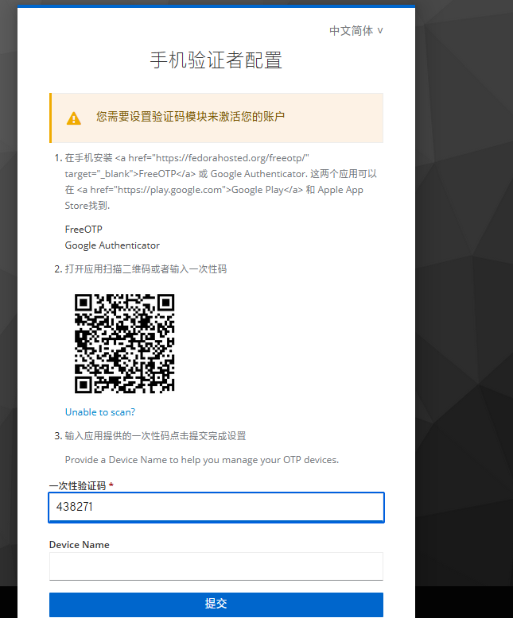
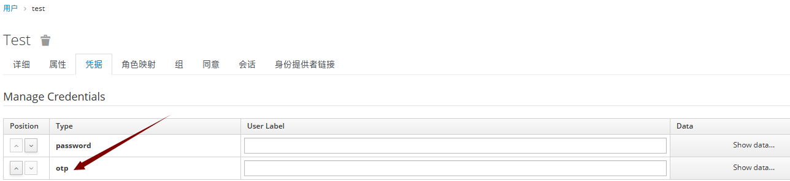
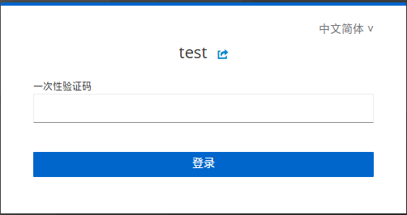

# MFA多因子认证配置

Keycloak 是一个开源的身份和访问管理解决方案，支持多因素认证（MFA）的配置非常灵活。下面是一些涉及Keycloak MFA相关的配置和步骤：

1. **启用MFA**：

   - 登录到Keycloak管理控制台。
   - 找到您的Realm（领域）并进入Realm设置。
   - 在左侧导航栏中选择 "Authentication"（认证）选项卡。
   - 找到 "Multi-Factor Authentication"（多因素认证）部分。
   - 启用 "Multi-Factor Authentication Required"（需要多因素认证）选项。
2. **配置MFA方法**：

   - 在 "Multi-Factor Authentication"（多因素认证）部分，您可以选择启用不同的MFA方法。Keycloak支持多种MFA方法，如TOTP（基于时间的一次性密码）、Email（通过电子邮件发送验证码）、SMS（通过短信发送验证码）等。
   - 您可以在 "Config"（配置）列下配置每种MFA方法的具体设置。
3. **MFA流程配置**：

   - 在 "Authentication Flow"（认证流程）选项卡下，您可以编辑MFA认证流程。
   - Keycloak允许您自定义认证流程，并通过 "Execution"（执行）选项来添加和配置MFA相关的步骤。
4. **用户设置MFA**：

   - 用户可以通过访问其个人资料设置启用MFA。
   - 登录后，用户可以在 "Account"（账户）页面找到 "Multi-Factor Authentication"（多因素认证）部分，并启用所需的MFA方法。
5. **MFA的验证顺序**：

   - 在 "Authentication Flow"（认证流程）选项卡下，您可以定义MFA认证的验证顺序。可以配置多个MFA步骤，按照顺序验证多个MFA方法。
6. **MFA的细粒度控制**：

   - Keycloak允许您根据需要对MFA进行细粒度的控制。您可以在 "Authentication"（认证）选项卡下的 "Bindings"（绑定）部分配置不同的MFA策略，例如将MFA应用于特定的客户端或用户角色。
7. **MFA事件监听器**：

   - Keycloak还提供了事件监听器，可以让您监控MFA事件，如MFA成功或失败的事件。您可以根据这些事件执行自定义的操作或记录。

请注意，Keycloak的界面可能会因版本而异，上述步骤基于Keycloak的较新版本。在配置Keycloak时，请确保参考您所使用的特定版本的文档和管理界面。

## 1. 配置MFA_OTP

## 2. 配置MFA_OTP的认证流程

## 3. 用户第一次登录时，需要配置MFA

## 4. 配置的MFA类型会保存在用户信息中

## 5. 下次用户再登录时，直接在APP上看到code码，输入即可

