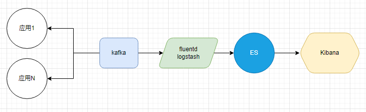
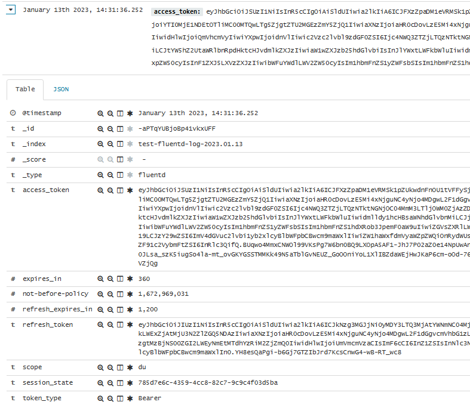

# 日志收集


# 使用docker的镜像
lypgcs/fluentd-es-kafka:v1.3.2
|-- fluentd' version '1.3.2'
|-- fluent-plugin-elasticsearch' version '4.0.3'
|-- fluent-plugin-kafka' version '0.12.3

# fluent.conf配置
可以添加configMap，扩展性更好，下面说一下配置的含义
名称是fluentd-config，内部文件名是fluent.conf
* brokers  这是kafka的地址
* consumer_group 消费组名称
* start_from_beginning true表示从头消费，false从最新的消息
* format json 表示kafka里存储的是json格式
* topics 表示监控的主题，多个之间用逗号分开
* tag 表示索引名称
* flush_interval 刷新频率
* logstash_format index是否使用logstash命名方式（logstash-%Y.%m.%d），默认不启用，比index_name优先级高
* logstash_prefix：logstash_format启用的时候，index命名前缀是什么。默认为logstash
* index_name fluentd.${tag}.%Y%m 索引名称，当没有logstash_format时，使用这个。
* include_tag_key true  #把tag当做字段写入ES,如果需要自定义tag时，可以添加这项
* tag_key @log_name
```
<source>
@type kafka_group
brokers 192.168.60.146:9092
consumer_group fluentd-k8s
format json
topics KC_AUTHORIZATION_POLICY,KC_AUTHORIZATION_POLICY_CREATE,KC_AUTHORIZATION_POLICY_DELETE,KC_AUTHORIZATION_POLICY_UPDATE,KC_AUTHORIZATION_RESOURCE_CREATE,KC_AUTHORIZATION_RESOURCE_DELETE,KC_CLIENT_LOGIN,KC_CLIENT_ROLE_MAPPING_CREATE,KC_CLIENT_ROLE_MAPPING_DELETE,KC_GROUP_CREATE,KC_GROUP_DELETE,KC_GROUP_MEMBERSHIP_CREATE,KC_LOGIN_ERROR,KC_LOGOUT,KC_REALM_ROLE_CREATE,KC_REALM_ROLE_MAPPING_CREATE,KC_REALM_ROLE_MAPPING_DELETE,KC_USER_ACTION,KC_USER_CREATE,KC_USER_DELETE,KC_USER_INFO_REQUEST,KC_USER_UPDATE,KC_CODE_TO_TOKEN_ERROR,KC_LOGIN
</source>

<match *>
@type elasticsearch
host 192.168.60.146
port 4116
logstash_format true
flush_interval 10s
logstash_prefix fluentd-log
</match>
```
# k8s编排
```
apiVersion: apps/v1
kind: Deployment
metadata:
  name: fluentd-log-deployment
  namespace: default
spec:
  replicas: 1
  selector:
    matchLabels:
      app: fluentd-log
  template:
    metadata:
      labels:
        app: fluentd-log
    spec:
      hostAliases:
        - ip: "192.168.60.146"
          hostnames: [ "kafka146" ]
      containers:
        - name: fluentd-log-controller
          image: lypgcs/fluentd-es-kafka:v1.3.2
          volumeMounts:
            - name: config-volume
              mountPath: /etc/fluent
      volumes:
        - name: config-volume
          configMap:
            name: fluentd-config
  #滚动升级策略
  strategy:
    type: RollingUpdate
    rollingUpdate:
      maxSurge: 1
      maxUnavailable: 0
```
# kibana检索结果化数据
> 如果你的索引结构发生变化，需要去Management的Index Patterns菜单中，重新刷新索引，这样才能使用新的结构进行检索和聚合

