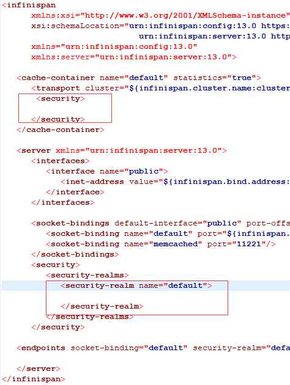

# 参考：
* https://infinispan.org/docs/stable/titles/configuring/configuring.html
* https://docs.wildfly.org/21/High_Availability_Guide.html#remote_cache_container
* https://vertx-china.gitee.io/docs/vertx-infinispan/java/
# docker版部署
* https://infinispan.org/get-started/
> quay.io/infinispan/server:13.0的景象是可以用的，直接用infinispan/server在添加cache时就出现403
```
docker run  --name infinispan-server  -it -p 11222:11222 -e USER="admin" -e PASS="password" quay.io/infinispan/server:11.0.9.Final-1
```
* 使用jboss/infinispan/server版本的，需要指定管理员用户
```
docker run --name infinispan-server -it -d -e MGMT_USER="admin" -e MGMT_PASS="admin" -p 9990:9990 -p 11222:11222  jboss/infinispan-server:9.4.11.Final

docker run --name infinispan-server -it -d -e USER="admin" -e PASS="admin"  --net=host quay.io/infinispan/server:11.0.9.Final-1
```

# linux版部署
后台启动服务
```
nohup /root/infinispan-server-13.0.2.Final/bin/server.sh -b 172.17.0.22  -k 172.17.0.22 &

nohup /root/infinispan-server-13.0.2.Final/bin/server.sh -c  /root/infinispan-server-13.0.2.Final/bin/server.conf -b 172.17.0.22  -k 172.17.0.22 &

```
添加用户
```
bin/cli.sh user create admin -p admin  -g admin
```
连接远程infinispan-server
```
bin/cli.sh
conn[disconnected]> connect http://192.168.60.136:11222 -u admin -p admin
ls caches //查看缓存列表
```
# kc连接infinispan集群
* 目前kc通过k8s部署，通过环境变量配置infinispan的连接串，目前只支持配置单个IP【192.168.60.136】，但从KC日志中可以看到，它确实已经是集群模式了

* 当出现你配置的节点宕机【192.168.60.136】后，infinispan服务还是正常的，只是少了一个节点

* 当你重新启动节点【192.168.60.136】之后，它会自动加到infinispan集群中


# k8s部署集群
* 目前k8s集群有问题，只能使用单节点，k8s集群没有工作
```
apiVersion: apps/v1
kind: StatefulSet
metadata:
  name: infinispan-server
spec:
  selector:
    matchLabels:
      app: infinispan-server
  replicas: 3
  serviceName: infinispan-server-headless
  template:
    metadata:
      labels:
        app: infinispan-server
        deploymentConfig: infinispan-server
      name: infinispan-server
    spec:
      containers:
      - args:
        - -Djboss.default.jgroups.stack=kubernetes
        env:
        - name: USER
          value: admin
        - name: PASS
          value: admin
        - name: JAVA_OPTIONS
          value: -Dinfinispan.bind.address=$HOSTNAME #每个节点地址都是它的pod名称
        - name: KUBERNETES_LABELS
          value: application=infinispan-server
        - name: KUBERNETES_NAMESPACE
          valueFrom:
            fieldRef:
              fieldPath: metadata.namespace
        - name: JGROUPS_DISCOVERY_PROTOCOL
          value: KUBE_PING
        image: quay.io/infinispan/server:13.0       
        name: infinispan-server
        ports:
        - containerPort: 11222
          name: hotrod
          protocol: TCP
        resources:
          requests:
            cpu: "0.5"
            memory: 512Mi
      terminationGracePeriodSeconds: 120

```
# 添加keycloak的7个缓存,对应remote.cli里的缓存配置
* 模板
```
{
  "distributed-cache": {
    "mode": "SYNC",
    "encoding": {
      "media-type": "application/x-jboss-marshalling"
    },
    "statistics": true
  }
}
```
* 缓存对象
    * authenticationSessions 
    * work
    * sessions
    * loginFailures
    * offlineSessions
    * clientSessions
    * offlineClientSessions
    * actionTokens 
# 缓存模式

Infinispan支持四种缓存模式：本地(Local)模式、复制(Replicated)模式、失效(Invalidation)模式、分布式(Distribution)模式。除本地模式外，其他三种模式均为集群模式缓存。

3.1 本地模式

本地模式下，数据缓存在本地内存，节点间数据不共享。Infinispan的cache对象继承自Java的ConcurrentMap，和直接采用map相比，其优势在于：

支持缓存数据持久化，支持mongodb、leveldb等多种数据库。Infinispan通过设置cache store仅将将上述数据库作为缓存数据的存储介质，并不涉及数据库本身的其他高级特性。
支持eviction策略，避免内存耗尽。
支持expiration策略，保证长期未被使用的数据被清除。
基于MVCC的并发处理策略，采用CAS和其他lock-free算法保证高性能。
*事务性保证。

3.2 失效模式

失效模式下，数据需持久化到数据库(或其他持久化设备)中，节点间并不共享任何数据。当发生数据更新时，更新数据库并通知其他节点该数据已过期。节点发现数据过期后，采用lazy策略从数据库更新至缓存。这样做的好处在于：

1. 网络负荷最小化。和复制模式下更新数据相比，失效消息要小的多，有效降低了网络负荷。
2. 延迟更新。节点发现数据失效后，无需立即更新数据，仅当需访问该数据时才执行更新。
3. 支持同步、异步两种失效方式。
4. 同步失效：发送失效通知，并等待所有节点响应(收到失效消息，并逐出过期数据)后返回。
5. 异步失效：发送失效通知，广播至所有节点，并直接返回。
6. 数据存在持久化需求，缓存作为持久数据的中间层。在读操作频繁的场景下，采用Infinispan，避免每次直接访问数据库，提高读取性能。


3.3 复制模式

1. 复制模式是集群模式的一种，在该模式任何一个节点的数据变更将复制到其他所有节点上，这使得集群中任何一个节点都包含了完整的缓存数据。
2. 和嵌入式模式组合时，所有数据均保存在应用程序本地，读操作仅需访问本地内存，性能最高。
3. 和C\S模式组合时，因为数据都保存在远端，读写都需要进行一次远端访问，此时复制模式和分布式模式相比并无明显优势。
4. Infinispan设计了同步、异步两种方式用于将本节点的数据变更操作通知到其他节点，对于每种操作又支持TCP、UDP两种通信方式。采用UDP协议时，通过叠加JGroups的NAKACK2和UNICAST3保证传输的可靠性，具体可参见[JGroups支持]。


3.4 分布式(Distributed)模式

分布模式是Infinispan支持的可扩展性最好的一种模式。在这种模式下，用户可以配置固定数量（numOwners）的副本数，而不需要复制数据到所有的节点上。复制有限个副本既可以控制开销，也可以带来数据访问性能和可靠性的提升。
在集群中，Infinispan通过一致性哈希（Consistent Hashing）算法来确定数据访问和存储的位置。使用一致性哈希是好处是：当现有节点失效或新节点加入时，系统不需要重新计算哈希来重新分配数据在集群中的存储位置。
和复制模式相比，优势如下：

    可扩展性：对集群节点数量没有限制，可根据业务需要，灵活的增、删节点。
    数据网格：假设集群中有三个节点A，B，C，内存大小为8G，复制模式下集群容量为8G。分布式模式下，如果每个条目保存在2个节点上，集群的容量为(8 G* 3) / 2 = 12G。

和复制模式一样，分布式模式也支持同步和异步两种模式


* 一致性哈希介绍

1. 首先求出memcached服务器（节点）的哈希值，并将其配置到0～2^32的圆（continuum）上。
2. 然后采用同样的方法求出存储数据的键的哈希值，并映射到相同的圆上。
3. 然后从数据映射到的位置开始顺时针查找，将数据保存到找到的第一个服务器上。如果超过2^32仍然找不到服务器，就会保存到第一台memcached服务器上。
    


# 缓存类型的配置
* 在客户端使用方去配置，如keycloak中使用了infinispan来做缓存，这时，在它注册缓存时，需要指定它的类型，可以参考remote.cli文件，下面代码是添加了复本类型的缓存，名称是work
```
/subsystem=infinispan/cache-container=keycloak/replicated-cache=work/store=remote:add( \
    passivation=false, \
    fetch-state=false, \
    purge=false, \
    preload=false, \
    shared=true, \
    remote-servers=["remote-cache"], \
    cache=work, \
    properties={ \
        rawValues=true, \
        marshaller=org.keycloak.cluster.infinispan.KeycloakHotRodMarshallerFactory, \
        protocolVersion=${env.HOTROD_VERSION:2.8} \
    } \
)
```
# 关闭infinispan-server的授权
默认授权是打开的，有两个地方，分别是cache-containert和server下面security节点，我们需要将这个地方的授权信息删除，这个配置我在google上找了很久，终于在对应的api上找到答案。
* 参考：https://infinispan.org/docs/stable/titles/security/security.html
* 答案如图


* 删除授权后的配置
```
   <cache-container name="default" statistics="true">
      <transport cluster="${infinispan.cluster.name:cluster}" stack="${infinispan.cluster.stack:tcp}" node-name="${infinispan.node.name:}"/>     
       <security>
       
      </security>      
   </cache-container>
   <server>
     <security>
         <security-realms>
            <security-realm name="default">
             
            </security-realm>
         </security-realms>
      </security>
   </server>
```
* 配置文件截图


# Generated by iptables-save v1.4.21 on Fri Aug 10 11:13:57 2018

# Replicated caches
Infinispan replicates all entries in the cache to all nodes in the cluster. Each node can perform read operations locally.

Replicated caches provide a quick and easy way to share state across a cluster, but is suitable for clusters of less than ten nodes. Because the number of replication requests scales linearly with the number of nodes in the cluster, using replicated caches with larger clusters reduces performance. However you can use UDP multicasting for replication requests to improve performance.

Each key has a primary owner, which serializes data container updates in order to provide consistency.


Figure 1. Replicated cache
* Synchronous or asynchronous replication
    * Synchronous replication blocks the caller (e.g. on a cache.put(key, value)) until the modifications have been replicated successfully to all the nodes in the cluster.

    * Asynchronous replication performs replication in the background, and write operations return immediately. Asynchronous replication is not recommended, because communication errors, or errors that happen on remote nodes are not reported to the caller.

* Transactions
If transactions are enabled, write operations are not replicated through the primary owner.

With pessimistic locking, each write triggers a lock message, which is broadcast to all the nodes. During transaction commit, the originator broadcasts a one-phase prepare message and an unlock message (optional). Either the one-phase prepare or the unlock message is fire-and-forget.

With optimistic locking, the originator broadcasts a prepare message, a commit message, and an unlock message (optional). Again, either the one-phase prepare or the unlock message is fire-and-forget.
#  Distributed caches
Infinispan attempts to keep a fixed number of copies of any entry in the cache, configured as numOwners. This allows distributed caches to scale linearly, storing more data as nodes are added to the cluster.

As nodes join and leave the cluster, there will be times when a key has more or less than numOwners copies. In particular, if numOwners nodes leave in quick succession, some entries will be lost, so we say that a distributed cache tolerates numOwners - 1 node failures.

The number of copies represents a trade-off between performance and durability of data. The more copies you maintain, the lower performance will be, but also the lower the risk of losing data due to server or network failures. Regardless of how many copies are maintained, distribution still scales linearly, and this is key to Infinispan scalability.

Infinispan splits the owners of a key into one primary owner, which coordinates writes to the key, and zero or more backup owners.

The following diagram shows a write operation that a client sends to a backup owner. In this case the backup node forwards the write to the primary owner, which then replicates the write to the backup.


* Cluster replication


* Distributed cache
## Read operations
Read operations request the value from the primary owner. If the primary owner does not respond in a reasonable amount of time, Infinispan requests the value from the backup owners as well.

A read operation may require 0 messages if the key is present in the local cache, or up to 2 * numOwners messages if all the owners are slow.

## Write operations
Write operations result in at most 2 * numOwners messages. One message from the originator to the primary owner and numOwners - 1 messages from the primary to the backup nodes along with the corresponding acknowledgment messages.

## Synchronous or asynchronous replication
Asynchronous replication is not recommended because it can lose updates. In addition to losing updates, asynchronous distributed caches can also see a stale value when a thread writes to a key and then immediately reads the same key.

## Transactions
Transactional distributed caches send lock/prepare/commit/unlock messages to the affected nodes only, meaning all nodes that own at least one key affected by the transaction. As an optimization, if the transaction writes to a single key and the originator is the primary owner of the key, lock messages are not replicated.

# Key ownership
Distributed caches split entries into a fixed number of segments and assign each segment to a list of owner nodes. Replicated caches do the same, with the exception that every node is an owner.

The first node in the list of owners is the primary owner. The other nodes in the list are backup owners. When the cache topology changes, because a node joins or leaves the cluster, the segment ownership table is broadcast to every node. This allows nodes to locate keys without making multicast requests or maintaining metadata for each key.

The numSegments property configures the number of segments available. However, the number of segments cannot change unless the cluster is restarted.

Likewise the key-to-segment mapping cannot change. Keys must always map to the same segments regardless of cluster topology changes. It is important that the key-to-segment mapping evenly distributes the number of segments allocated to each node while minimizing the number of segments that must move when the cluster topology changes.
