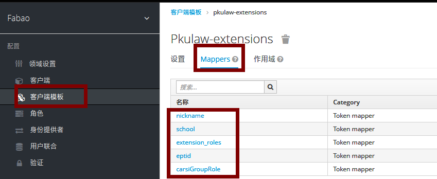
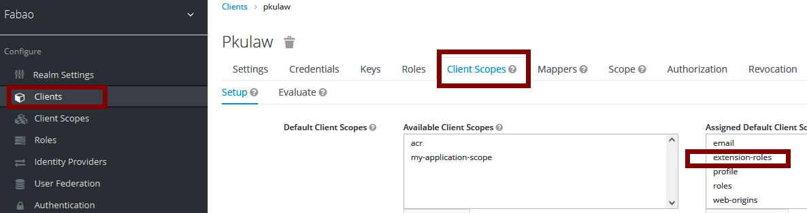

# jwt扩展字段介绍
> 为了实现业务的定制化需求和开发人员使用的便利，对kc的JWT进行了扩展，这个扩展字段在解析JWT之后都可以看到。

# jwt的payload
```json
{
  "exp": 1675329802,
  "iat": 1675329622,
  "jti": "2a80e925-b9ce-464f-822d-5c801ff4e8a0",
  "iss": "https://cas.pkulaw.com/auth/realms/fabao",
  "aud": ["case", "realm-management", "account"],
  "sub": "d21a5ec8-30c5-4db6-a26a-17ac4b3fcfd4",
  "typ": "Bearer",
  "azp": "democlient",
  "session_state": "c6b5fdbc-38fd-45d7-bde1-de7cc18837d3",
  "acr": "1",
  "allowed-origins": ["*"],
  "realm_access": {
    "roles": ["manage-users", "query-realms", "query-clients", "query-users"]
  },
  "resource_access": {
    "realm-management": {
      "roles": ["view-realm", "manage-authorization", "manage-clients", "query-groups"]
    },
    "account": {
      "roles": ["manage-account", "view-applications"]
    }
  },
  "scope": "roles my-application-scope extension-roles email profile",
  "phoneNumber": "13521972991",
  "email_verified": true,
  "loginType": "password",
  "nickname": "张三",
  "isGroupUser": 1,
  "extension_roles": {
    "weixin": ["banktopic"]
  },
  "preferred_username": "test"
}
```
# 公用字段
* exp token过期时间戳
* iat token生成时间戳
* jti token的唯一身份标识,对接token_id或者refresh_token_id，这两个id在服务端会有存储，与它颁发的`token里的jti相对应`
* iss token的发行机制，kc中的域，例如：https://cas.pkulaw.com/auth/realms/fabao
* aud 授权到的客户端
* sub 当前用户ID
* typ 认证方式
* azp 当前客户端client_id
* session_state 当前会话id,浏览器中的AUTH_SESSION_ID和AUTH_SESSION_ID_LEGACY
* acr 如果clientSession通过cookie (SSO)进行身份验证，则使用0，否则为1
* allowed-origins 允许哪种域名使用我们的token
* realm_access 域的权限
* resource_access 客户端（资源）权限，kc允许你为用户依照客户端去授权
* scope 客户端模板，它将一类jwt中的属性进行分类，通过这个scope模块去渲染你的jwt字段

# 个性化字段
> 用户属性：是user_attribute表，在kc管理平台中，可以通过用户详情-属性[attributes]查看
* phoneNumber 用户手机号
* email_verified 是否验证了邮箱
* loginType 登录方式【password,ip,weixin,carsi,wechat-work】
  * password 用户名密码登录
  * ip 基于客户端的ip登录
  * weixin 微信扫码登录
  * carsi 基于校园的carsi登录
  * wechat-work 企业微信 扫码登录
* nickname 用户昵称
  * 如果用户属性nickname时就用它；
  * 否则用户名以wx或者phone开头，并且用户属性手机号不为空，就用手机号；
  * 否则使用用户名username
* isGroupUser 是否为集团用户
  * 1：集团用户
  * 0：普通用户
* extension_roles.weixin 扩展角色中的微信角色
* preferred_username kc中的用户名username

# 为客户端配置自定义属性
1. 通过客户端模板，去添加一个模板，通过mappers将多个相关的属性添加到这个模板里


2. 选择指定客户端-》客户端模板-》添加已有的模板

