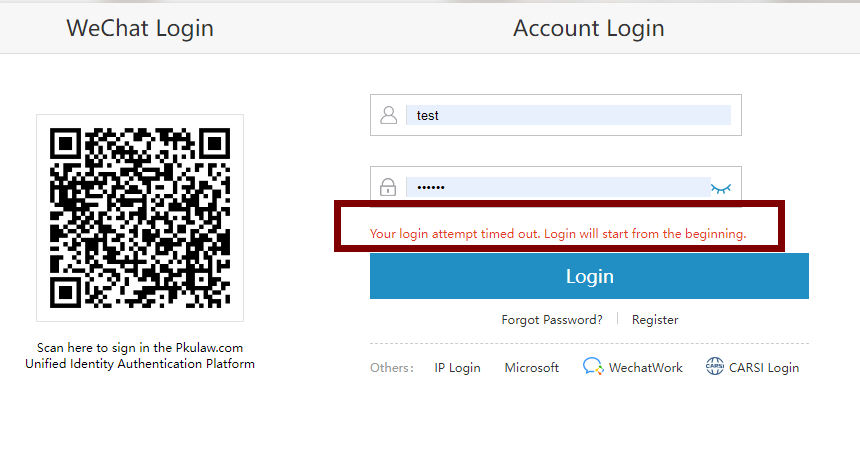

> https://blog.sighup.io/keycloak-ha-on-kubernetes/

# Server cache configuration

Keycloak has two types of caches:

    Local cache: sits in front of the database to decrease the load on the database and to decrease overall response times. Realm, client, role, and user metadata is kept in this type of cache. It does not use replication even if you are in the cluster with more Keycloak servers. If one entry is updated an invalidation message is sent to the rest of the cluster and the entry is evicted. See the work cache below.
    Replicated cache: handles user sessions, offline tokens, and keeping track of login failures so that the server can detect password phishing and other attacks. The data held in these caches is temporary, in memory only, but is possibly replicated across the cluster.

# Infinispan caches
## Authentication sessions
In Keycloak we have the concept of authentication sessions. There is a separate Infinispan cache called authenticationSessions used to save data during authentication of a particular user. Requests from this cache usually involve only a browser and the Keycloak server, not the application. Here we can rely on sticky sessions and the authenticationSessions cache content does not need to be replicated across data centers, even if you are in Active/Active mode.
在Keycloak中，我们有身份验证会话的概念。有一个名为authenticationSessions的独立Infinispan缓存，用于在特定用户的身份验证期间保存数据。来自此缓存的请求通常只涉及浏览器和Keycloak服务器，而不涉及应用程序。在这里，我们可以依赖于会话保持，authenticationSessions缓存内容不需要跨数据中心复制，即使您处于Active/Active模式。
**上面说的感觉有些问题，我的双节点的kc集群，如果authenticationSessions不采用分布式模式会出现如下错误：

```
09:39:37,248 WARN  [org.keycloak.events] (default task-16) type=LOGIN_ERROR, realmId=fabao, clientId=null, userId=null, ipAddress=172.19.50.38, error=expired_code, restart_after_timeout=true, authSessionParentId=40cf45bd-a164-4095-a62d-10a3e7832b5b, authSessionTabId=0jdo9ZIeEjg
09:39:37,484 WARN  [org.keycloak.events] (default task-16) type=LOGIN_ERROR, realmId=fabao, clientId=null, userId=null, ipAddress=172.19.50.38, error=expired_code, restart_after_timeout=true, authSessionParentId=a6ce2ece-b444-4d3b-a813-9082973383dd, authSessionTabId=rdzRqScinCs
```
而我将`authenticationSessions`改成与`actionTokens`相同的分布式缓存后，问题得到了解决。

## Action tokens
We also have the concept of action tokens, which are used typically for scenarios when the user needs to confirm an action asynchronously by email. For example, during the forget password flow the actionTokens Infinispan cache is used to track metadata about related action tokens, such as which action token was already used, so it can’t be reused a second time. This usually needs to be replicated across data centers.
我们还有操作令牌的概念，通常用于用户需要通过电子邮件异步确认操作的场景。例如，在忘记密码流期间，actionTokens Infinispan缓存用于跟踪有关相关操作令牌的元数据，例如已经使用了哪个操作令牌，因此它不能被第二次重用。这通常需要跨数据中心复制。

## Caching and invalidation of persistent data
Keycloak uses Infinispan to cache persistent data to avoid many unnecessary requests to the database. Caching improves performance, however, it adds another challenge. When one Keycloak server updates any data, all other Keycloak servers in all data centers need to be aware of it, so they invalidate particular data from their caches. Keycloak uses local Infinispan caches called realms, users, and authorization to cache persistent data.
Keycloak使用Infinispan缓存持久化数据，避免了对数据库的许多不必要的请求。缓存提高了性能，但是也增加了另一个挑战。当一台Keycloak服务器更新任何数据时，所有数据中心中的所有其他Keycloak服务器都需要知道它，因此它们会使缓存中的特定数据失效。Keycloak使用称为领域、用户和授权的本地Infinispan缓存来缓存持久数据。
We use a separate cache, work, which is replicated across all data centers. The work cache itself does not cache any real data. It is used only for sending invalidation messages between cluster nodes and data centers. In other words, when data is updated, the Keycloak node sends the invalidation message to all other cluster nodes in the same data center and also to all other data centers. After receiving the invalidation notice, every node then invalidates the appropriate data from their local cache.
我们使用单独的缓存work，它可以在所有数据中心复制。工作缓存本身不缓存任何实际数据。它仅用于在集群节点和数据中心之间发送失效消息。换句话说，当数据更新时，Keycloak节点将无效消息发送到同一数据中心中的所有其他集群节点，也发送到所有其他数据中心。在收到无效通知后，每个节点将使其本地缓存中的适当数据无效。

## User sessions
There are Infinispan caches called sessions, clientSessions, offlineSessions, and offlineClientSessions, all of which usually need to be replicated across data centers. These caches are used to save data about user sessions, which are valid for the length of a user’s browser session. The caches must handle the HTTP requests from the end-user and the application. As described above, sticky sessions cannot be reliably used in this instance, but we still want to ensure that subsequent HTTP requests can see the latest data. For this reason, the data are usually replicated across data centers.
有一些Infinispan缓存叫做session、clientSessions、offlineSessions和offlineClientSessions，所有这些缓存通常都需要跨数据中心复制。这些缓存用于保存关于用户会话的数据，这些数据对于用户浏览器会话的长度是有效的。缓存必须处理来自最终用户和应用程序的HTTP请求。如上所述，在这个实例中不能可靠地使用粘着会话，但是我们仍然希望确保后续的HTTP请求可以看到最新的数据。因此，数据通常是跨数据中心复制的。

## Brute force protection

Finally, the loginFailures cache is used to track data about failed logins, such as how many times a user entered a bad password. The details are described here. It is up to the admin whether this cache should be replicated across data centers. Replication across data centers is needed to have an accurate count of login failures. On the other hand, not replicating this data can save some performance. So if performance is more important than accurate counts of login failures, the replication can be avoided.
While deploying your Infinispan cluster, you should add Keycloak's cache definitions to Infinispan's configuration file:
```
<replicated-cache-configuration name="keycloak-sessions" mode="ASYNC" start="EAGER" batching="false">
</replicated-cache-configuration>

<replicated-cache name="work" configuration="keycloak-sessions" />
<replicated-cache name="sessions" configuration="keycloak-sessions" />
<replicated-cache name="offlineSessions" configuration="keycloak-sessions" />
<replicated-cache name="actionTokens" configuration="keycloak-sessions" />
<replicated-cache name="loginFailures" configuration="keycloak-sessions" />
<replicated-cache name="clientSessions" configuration="keycloak-sessions" />
<replicated-cache name="offlineClientSessions" configuration="keycloak-sessions" />
```
It is important that the Infinispan cache cluster is up and running before starting your Keycloak cluster.

Then, you'll have to configure the remoteStore for Keycloak's caches. This can be done using a startup CLI script as we did previously to set the CACHE_OWNERS variable, save the following snippet to a file and mount it to Keycloak's /opt/jboss/startup-scripts/ folder:

```
embed-server --server-config=standalone-ha.xml --std-out=echo
batch

echo *** Update infinispan subsystem ***
/subsystem=infinispan/cache-container=keycloak:write-attribute(name=module, value=org.keycloak.keycloak-model-infinispan)

echo ** Add remote socket binding to infinispan server **
/socket-binding-group=standard-sockets/remote-destination-outbound-socket-binding=remote-cache:add(host=${remote.cache.host:localhost}, port=${remote.cache.port:11222})

echo ** Update replicated-cache work element **
/subsystem=infinispan/cache-container=keycloak/replicated-cache=work/store=remote:add( \
passivation=false, \
fetch-state=false, \
purge=false, \
preload=false, \
shared=true, \
remote-servers=["remote-cache"], \
cache=work, \
properties={ \
rawValues=true, \
marshaller=org.keycloak.cluster.infinispan.KeycloakHotRodMarshallerFactory, \
protocolVersion=${keycloak.connectionsInfinispan.hotrodProtocolVersion} \
} \
)

/subsystem=infinispan/cache-container=keycloak/replicated-cache=work:write-attribute(name=statistics-enabled,value=true)

echo ** Update distributed-cache sessions element **
/subsystem=infinispan/cache-container=keycloak/distributed-cache=sessions/store=remote:add( \
passivation=false, \
fetch-state=false, \
purge=false, \
preload=false, \
shared=true, \
remote-servers=["remote-cache"], \
cache=sessions, \
properties={ \
rawValues=true, \
marshaller=org.keycloak.cluster.infinispan.KeycloakHotRodMarshallerFactory, \
protocolVersion=${keycloak.connectionsInfinispan.hotrodProtocolVersion} \
} \
)
/subsystem=infinispan/cache-container=keycloak/distributed-cache=sessions:write-attribute(name=statistics-enabled,value=true)

echo ** Update distributed-cache offlineSessions element **
/subsystem=infinispan/cache-container=keycloak/distributed-cache=offlineSessions/store=remote:add( \
passivation=false, \
fetch-state=false, \
purge=false, \
preload=false, \
shared=true, \
remote-servers=["remote-cache"], \
cache=offlineSessions, \
properties={ \
rawValues=true, \
marshaller=org.keycloak.cluster.infinispan.KeycloakHotRodMarshallerFactory, \
protocolVersion=${keycloak.connectionsInfinispan.hotrodProtocolVersion} \
} \
)
/subsystem=infinispan/cache-container=keycloak/distributed-cache=offlineSessions:write-attribute(name=statistics-enabled,value=true)

echo ** Update distributed-cache clientSessions element **
/subsystem=infinispan/cache-container=keycloak/distributed-cache=clientSessions/store=remote:add( \
passivation=false, \
fetch-state=false, \
purge=false, \
preload=false, \
shared=true, \
remote-servers=["remote-cache"], \
cache=clientSessions, \
properties={ \
rawValues=true, \
marshaller=org.keycloak.cluster.infinispan.KeycloakHotRodMarshallerFactory, \
protocolVersion=${keycloak.connectionsInfinispan.hotrodProtocolVersion} \
} \
)
/subsystem=infinispan/cache-container=keycloak/distributed-cache=clientSessions:write-attribute(name=statistics-enabled,value=true)

echo ** Update distributed-cache offlineClientSessions element **
/subsystem=infinispan/cache-container=keycloak/distributed-cache=offlineClientSessions/store=remote:add( \
passivation=false, \
fetch-state=false, \
purge=false, \
preload=false, \
shared=true, \
remote-servers=["remote-cache"], \
cache=offlineClientSessions, \
properties={ \
rawValues=true, \
marshaller=org.keycloak.cluster.infinispan.KeycloakHotRodMarshallerFactory, \
protocolVersion=${keycloak.connectionsInfinispan.hotrodProtocolVersion} \
} \
)
/subsystem=infinispan/cache-container=keycloak/distributed-cache=offlineClientSessions:write-attribute(name=statistics-enabled,value=true)

echo ** Update distributed-cache loginFailures element **
/subsystem=infinispan/cache-container=keycloak/distributed-cache=loginFailures/store=remote:add( \
passivation=false, \
fetch-state=false, \
purge=false, \
preload=false, \
shared=true, \
remote-servers=["remote-cache"], \
cache=loginFailures, \
properties={ \
rawValues=true, \
marshaller=org.keycloak.cluster.infinispan.KeycloakHotRodMarshallerFactory, \
protocolVersion=${keycloak.connectionsInfinispan.hotrodProtocolVersion} \
} \
)
/subsystem=infinispan/cache-container=keycloak/distributed-cache=loginFailures:write-attribute(name=statistics-enabled,value=true)

echo ** Update distributed-cache actionTokens element **
/subsystem=infinispan/cache-container=keycloak/distributed-cache=actionTokens/store=remote:add( \
passivation=false, \
fetch-state=false, \
purge=false, \
preload=false, \
shared=true, \
cache=actionTokens, \
remote-servers=["remote-cache"], \
properties={ \
rawValues=true, \
marshaller=org.keycloak.cluster.infinispan.KeycloakHotRodMarshallerFactory, \
protocolVersion=${keycloak.connectionsInfinispan.hotrodProtocolVersion} \
} \
)
/subsystem=infinispan/cache-container=keycloak/distributed-cache=actionTokens:write-attribute(name=statistics-enabled,value=true)

#这块在没有会话保持时，需要做成跨数据中心的缓存，否则会有登录失败的情况
echo ** Update distributed-cache authenticationSessions element **
/subsystem=infinispan/cache-container=keycloak/distributed-cache=authenticationSessions:write-attribute(name=statistics-enabled,value=true)


echo *** Update undertow subsystem ***
/subsystem=undertow/server=default-server/http-listener=default:write-attribute(name=proxy-address-forwarding,value=true)


run-batch
stop-embedded-server
```
Remember to set the JAVA_OPTS so Keycloak points to your Infinispan's Hot Rod service: remote.cache.host, remote.cache.port and set the site name jboss.site.name.
