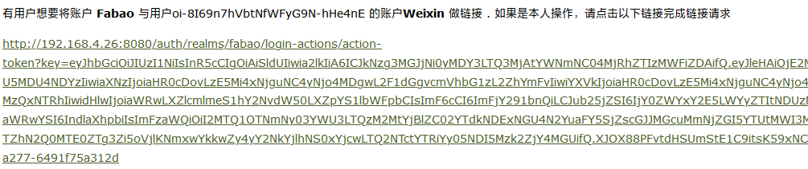
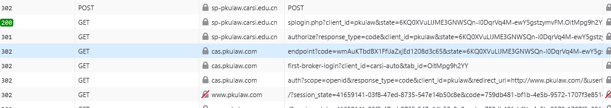
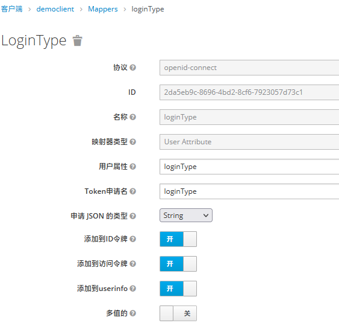
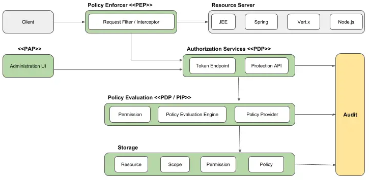

<Dictionary<string, byte[]>>(key);# keycloak对外api接口

# keycloak对外api接口

> 对接口的调用，登陆用户需要有对接的权限，最基础的bearer认证，你的access_token里需要包含对接的接口权限才可以调用，否则将返回`403`

# 二次开发说明

主要是项目`keycloak-phone-provider`为核心，通过这个项目进行docker镜像的构建，目前集成了`keycloak-services-event-user-role-expire`、`keycloak-services-event-kafka`、`keycloak-services-social-weixin`、`keycloak-services-social-weixin-applet`等项目

# 目录

* 环境介绍

  * [开发环境](#开发环境)
  * [测试环境](#测试环境)
  * [生产环境](#生产环境)
  * [扩展SPI](#扩展SPI)
  * [jwt规范](#jwt规范)
* 手机验证码

  * [发送验证码](#发送验证码)
  * [校验验证码](#校验验证码)
* 认证接口

  * [用户名密码登录](#用户名密码登录)
  * [开启Web源](#开启Web源)
  * [两种直接授权流【direct grant】类型](#两种直接授权流【direct grant】类型)
    * [手机号登录](#手机号登录)
    * [email发送验证码](#email发送验证码)
  * [自定义登录事件数据源](#自定义登录事件数据源)
  * [userId自动登录](#userId自动登录)
  * [微信unionId自动登录](#微信unionId自动登录)
  * [IP地址登录](#IP地址登录)
  * [微信扫码登录](#微信扫码登录)
  * [验证token合法性](#验证token合法性)
  * [验证token是否在线](#验证token是否在线)
  * [验证session是否在线](#验证session是否在线)
  * [删除session会话](#删除session会话)
  * [删除session会话并重定向](#删除session会话并重定向)
  * [多端登录-通过kc-cookie完成共享登录](#多端登录-通过kc-cookie完成共享登录)
  * [多端登录-通过jsonp获取登录状态](#多端登录-通过jsonp获取登录状态)
  * [多端SSO原理](#多端SSO原理)
  * [kc客户端共享登录](#kc客户端共享登录)
  * [记住密码实现登录状态保持](#记住密码实现登录状态保持)
  * [集成v6登录页](#集成v6登录页)
  * [自定义皮肤引入JS](#自定义皮肤引入JS)
  * [登出/注销](#登出/注销)
  * [修改密码](#修改密码)
  * [refresh_token刷新token](#refresh_token刷新token)
  * [授权码登录](#授权码登录)
  * [登录类型添加到access_token](#登录类型添加到access_token)
  * [微信登录的流程](#微信登录的流程)
  * [客户端认证](#客户端认证)
  * [自动触发社区登录](#自动触发社区登录)
* 登录校验

  * [用户名密码校验](#用户名密码校验)
  * [IP地址校验](#IP地址校验)
* 用户接口

  * [用户ID获取用户](#用户ID获取用户)
  * [根据UserId获取微信相关信息](#根据UserId获取微信相关信息)
  * [用户名精确查询](#用户名精确查询)
  * [用户名模糊查询](#用户名模糊查询)
  * [前台注册用户](#前台注册用户)
  * [添加用户的校验接口](#添加用户的校验接口)
  * [前台编辑用户](#前台编辑用户)
  * [编辑用户的校验接口](#编辑用户的校验接口)
  * [Email地址重复性](#Email地址重复性)
  * [编辑用户](#编辑用户)
  * [删除用户](#删除用户)
  * [为用户授权角色](#为用户授权角色)
  * [为用户取消授权角色](#为用户取消授权角色)
  * [按着已认证的email获取用户](#按着已认证的email获取用户)
  * [着已验证手机号获取用户](#按着已验证手机号获取用户)
  * [三方登录-绑定userId和unionId及类型](#三方登录-绑定userId和unionId及类型)
* 组接口

  * [组列表](#组列表)
  * [按名称精确查找组](#按名称精确查找组)
  * [添加组](#添加组)
  * [编辑组](#编辑组)
  * [删除组](#删除组)
  * [组绑定用户](#组绑定用户)
  * [组解绑用户](#组解绑用户)
  * [为组授权角色](#为组授权角色)
  * [为组取消授权角色](#为组取消授权角色)
* 角色接口

  * [获取角色列表](#获取角色列表)
  * [按名称精确查找角色](#按名称精确查找角色)
  * [添加角色](#添加角色)
  * [编辑角色](#编辑角色)
  * [删除角色](#删除角色)
  * [获取用户的角色和有效期](#获取用户的角色和有效期)
  * [用户绑定角色和有效期](#用户绑定角色和有效期)
  * [用户批量绑定角色和有效期](#用户批量绑定角色和有效期)
  * [获取组的角色和有效期](#获取组的角色和有效期)
  * [组绑定角色有效期](#组绑定角色有效期)
  * [组批量绑定角色有效期](#组批量绑定角色有效期)
* keycloak自定义扩展

  * [JWT扩展](#JWT扩展)
  * [自定义mapper实现角色类型的扩展](#自定义mapper实现角色类型的扩展)
  * kc服务端开发
    * [为认证接口添加配置](#为认证接口添加配置)
    * [认证接口为页面转值](#认证接口为页面转值)
  * [缓存的广播](#缓存的广播)
  * 模板渲染
    * [模板页ftl页面的`url`对象构建过程](#模板页ftl页面的`url`对象构建过程)
  * 三方社区登录
    * [微信登录](#微信登录)
* 部署相关

  * [kc扩展包构建](#kc扩展包构建)
  * [docker部署](#docker部署)
  * [nginx配置](#nginx配置)
  * [k8s部署](#k8s部署)
  * [集群会话共享](#集群会话共享)
  * [远程的infinispan](#远程的infinispan)
  * [JWT超时时间说明](#JWT超时时间说明)
  * [配置favicon.ico图标](#配置favicon.ico图标)
* [问题的解决](#问题的解决)

## 环境介绍

### <span id="开发环境">开发环境</span>

* 开发环境，主要用来测试新的功能，迭代频繁，开发人员联调使用
* 地址: http://192.168.4.26:8080   https需要自己本机配置host,pkulaw.com的二级域名即可
* kafka: 192.168.4.26:9092
* mysql: 192.168.4.26:3306

### <span id="测试环境">测试环境</span>

* 测试环境，开发完成一个版本后，提交到这个环境，按着迭代发布，相对稳定
* 地址: https://devcas.pkulaw.com:18081
* kafka: 192.168.60.146:9091   部署kc服务端需要配置host 192.168.60.146  qingyun146
* mysql: 192.168.60.136:3306

### <span id="生产环境">生产环境</span>

* 地址: https://cas.pkulaw.com
* kafka: 192.168.10.132:9091   部署kc服务端需要配置host 192.168.10.132  qingyun132
* mysql: 192.168.60.149:3306

### <span id="扩展SPI">扩展SPI</span>

* keycloak-phone-provider   rest前缀：sms
* keycloak-services-event-user-role-expire  rest前缀：role-api
* keycloak-services-social-weixin rest前缀：weixin-api

### <span id="jwt规范">jwt规范</span>

#### JWT标准里面定义的标准claim包括：

* iss(Issuser)：JWT的签发主体，oauth网站；
* sub(Subject)：JWT的所有者，用户ID；
* aud(Audience)：JWT的接收对象；
* exp(Expiration time)：JWT的过期时间；
* iat(Issued at)：JWT的签发时间；
* nbf(Not Before)：JWT的生效开始时间；
* jti(JWT ID)：是JWT的唯一标识。
* azp：对接的客户端
* allowed-origins：开放的域，在这些域下token是有效的

#### JWT的安全性

* 生成jwt串时，需要提供密钥（对称），或者私钥（非对称），再通过对应的密钥进行解密
* keycloak的公钥，每个realms都有自己的配置，通过https://devcas.pkulaw.com:18081/auth/realms/{realmName}的返回值public_key来获取
* 也可以在keycloak管理平台的领域设置中-》密钥来管理它

## 手机验证码

### <span id="发送验证码">发送验证码</span>

* GET /auth/realms/fabao/sms/verification-code-send?phoneNumber=13521972991
* 响应

```
{
    "expiresIn": 60
}
```

### <span id="校验验证码">校验验证码</span>

* 为当前登录的用户认证手机号，注意应该确保手机号没有重复，校验成功直接更新到用户信息表
* Header Authorization  Bearer {token}
* POST /auth/realms/fabao/sms/verification-code?phoneNumber=13521972991&code=862773
* 响应  状态码204

## 认证接口

假设你的realm名称为`fabao`,请求头`Authorization Bearer access_token`

### <span id="用户名密码登录">用户名密码登录</span>

> 注意这是direct grant的认证方法，主要是直接调用rest接口来获取token的，所以需要先在kc去配置对应的direct grant才可以。

* 核心代码逻辑

```
/**
 * 直接继承了验证密码功能的direct grant流.
 */
public class V6DirectGrantAuthenticator extends ValidatePassword {
  KeycloakSession session;

  public V6DirectGrantAuthenticator(KeycloakSession session) {
    this.session = session;
  }

  @Override
  public void authenticate(AuthenticationFlowContext context) {
    String username = Optional.ofNullable(context.getHttpRequest().getDecodedFormParameters().getFirst("username"))
        .orElse(context.getHttpRequest().getDecodedFormParameters().getFirst("username"));
    String password = Optional.ofNullable(context.getHttpRequest().getDecodedFormParameters().getFirst("password"))
        .orElse(context.getHttpRequest().getDecodedFormParameters().getFirst("password"));
    MultivaluedMap<String, String> inputData = new MultivaluedMapImpl<>();
    inputData.add(KeycloakUtil.FIELD_EMAIL_PHONE, username);
    inputData.add(KeycloakUtil.PASSWORD, password);
    if (KeycloakUtil.passwordLogin(this, context, session.getProvider(JpaConnectionProvider.class).getEntityManager(), session, inputData)) {
      super.authenticate(context); //验证密码
    }
  }

```


* POST /auth/realms/fabao/protocol/openid-connect/token
* 请求体 x-www-form-urlencoded

```
grant_type:password
username:test
password:123456
client_secret:ec0fd1c6-68b0-4c39-a9fa-c3be25c8ef01
client_id:democlient
```

* 响应

```
{
    "access_token": "*.*.*",
    "expires_in": 3000,
    "refresh_expires_in": 1800,
    "refresh_token": "*.*.*",
    "token_type": "bearer",
    "not-before-policy": 1619512543,
    "session_state": "765969ec-94da-4edb-9dcb-e15ea3e0ad3b",
    "scope": "roles email profile"
}
```

## <span id="开启WEB源">开启WEB源</span>

你生成的jwt_token会标有`allowed-origins`属性，表示允许CORS跨域的起点，你可以添加`*`，你的token可以用到所有的网站上；即你在A网站生成的token，它可以在B,C,D网站来使用它。


## 两种直接授权流【direct grant】类型


### <span id="手机号登录">手机号登录</span>

> 注意这是direct grant的认证方法,需要配置directGrant方式为手机认证才能生效，这一般需要我们自己去扩展SPI

* 添加验证方式，复制一个direct grant
  
* 配置direct grant流
  
* 在postman中进行手机号授权测试
  

### <span id="email发送验证码">email发送验证码</span>

#### kc端配置

* 选择菜单 realms settings > email 完成email发送端配置
  
  其它配置与手机号登录类似

#### 发送接口

* PUT /auth/admin/realms/fabao/users/{userId}/send-verify-email
* 地址栏参数

```
redirect_uri:http://localhost:5050/index  //完成验证之后，回到你的应用的地址
client_id:democlient //客户端
```

### <span id="自定义登录事件数据源">自定义登录事件数据源</span>

* 找到你的登录认证类`AbstractUsernameFormAuthenticator`子类的`action方法`，它表示表单提交之后的逻辑，在里面添加如下代码，为LOGIN事件添加detail元素

```
context.getEvent().detail("姓名": "仓储大叔");
```

* 生成的事件消息实体如下

```
{
  "time": 1661994267877,
  "type": "LOGIN",
  "realmId": "fabao",
  "clientId": "risklens",
  "userId": "79a095b5-429d-49b6-97b0-9f78eaf9267c",
  "sessionId": "80e63b04-c01c-4b31-8385-29eaa2e50a79",
  "ipAddress": "111.198.143.194",
  "error": null,
  "details": {
    "auth_method": "openid-connect",
    "auth_type": "code",
    "email-phone": "huangjl",
    "loginType": "password",
    "redirect_uri": "https://risklens-dev.pkulaw.com/sso/login",
    "remember_me": "true",
    "consent": "no_consent_required",
    "code_id": "80e63b04-c01c-4b31-8385-29eaa2e50a79",
    "姓名": "仓储大叔"
  }
}
```

### <span id="userId自动登录">userId自动登录</span>

> 首先你的请求需要带上userId和sign参数，然后kc会直接根据userId进行认证，认证成功颁发code，并进行重定向，之后你可以根据code获取token

* GET

```
/auth/realms/fabao/protocol/openid-connect/auth?response_type=code
&client_id=risklens
&redirect_uri=your_uri
&scope=openid
&sign=89722e0356ebf7f29990c1e5acf55dd9
&userId=79a095b5-429d-49b6-97b0-9f78eaf9267c
```

* 地址栏参数

```
# secret向管理员要一下
String sign = md5(userId + "yyyy-MM-dd" + secret).toUpperCase();
userId=yourId&sign=sign
```

### <span id="微信unionId自动登录">微信unionId自动登录</span>

> 首先你的请求需要带上unionId参数，然后kc会直接根据unionId进行认证，认证成功颁发code，并进行重定向，之后你可以根据code获取token

* GET

```
/auth/realms/fabao/protocol/openid-connect/auth?response_type=code
&client_id=risklens
&redirect_uri=your_uri
&scope=openid
&unionId=79a095b5-429d-49b6-97b0-9f78eaf9267c
```

### <span id="IP地址登录">IP地址登录</span>

> 为了性能考虑，IP地址字典已经存储到infinispan分布式缓存中

* IP地址登录主要用在组用户上，需要满足组有ip地址属性，并且组里用户有一个管理员角色，然后在登录时会模拟这个管理员角色的用户登录
  
* IP登录需要的mysql函数

```
CREATE FUNCTION SPLIT_STR(
  x VARCHAR(255),
  delim VARCHAR(12),
  pos INT
)
RETURNS VARCHAR(255)
RETURN REPLACE(SUBSTRING(SUBSTRING_INDEX(x, delim, pos),
       LENGTH(SUBSTRING_INDEX(x, delim, pos -1)) + 1),
       delim, '');
```

* 对组添加ipAddress的扩展属性
  接口：/auth/admin/realms/fabao/groups

```
{
    "name": "lind-scope",
    "attributes": {
        "ipAddress": [
            "192.168.0.1~192.168.0.255",
            "192.168.3.1~192.168.3.255",
            "10.0.0.1"
        ]
    }
}
```

### <span id="微信扫码登录">微信扫码登录</span>

> 由于微信二维码与表单登录设计到了一个页面里，所有需要结合`AbstractUsernameFormAuthenticator`对象去设计，而不能使用社区登录`SocialIdentityProvider`

#### 微信回调接口

可以通过`PhonePasswordFormProvider`对象添加配置属性，添加回调接口，回调主要作用是拿到unionid，然后我们根据unionid模拟用户登录的动作

> 注意，微信的回调地址最多只能有一个参数，一般我们会把业务回调路径写在微信回调地址上，这是唯一的参数

```
  String uri = session.getContext().getUri().getBaseUri()
                    + "realms/fabao/protocol/openid-connect/auth?scope=openid&response_type=code"
                    + "&client_id=" + clientId
                    + "&unionId=" + unionId
                    + "&login=true&state=" + state
                    + "&redirect_uri=" + redirectUri;
            logger.info("authorizationCode=" + authorizationCode + "&unionId=" + unionId + "&client_id=" + clientId + "&redirect_uri=" + redirectUri);
            return Response.temporaryRedirect(URI.create(uri)).build();
```

#### 通过配置节点，对注册页面信息进行动态设置


#### 扩展PhonePasswordFormProvider登录行为

方法`context.success()`将会跳转到redirect_uri的业务回调页，并带有code值，我们可以通过code来获取token值

```
 private void unionIdLogin(AuthenticationFlowContext context) {
        EntityManager em = getEntityManager();
        String unionId = getUnionId(context);
        System.out.println("action unionId=" + unionId);
        if (unionId != null) {
            TypedQuery<FederatedIdentityEntity> query = em.createQuery("select a from FederatedIdentityEntity a where a.realmId= :realmId and a.identityProvider= :identityProvider and a.userId= :userId", FederatedIdentityEntity.class);
            query.setParameter("identityProvider", "weixin");
            query.setParameter("userId", unionId);
            query.setParameter("realmId", session.getContext().getRealm().getName());
            List<FederatedIdentityEntity> results = query.getResultList();
            FederatedIdentityEntity federatedIdentityEntity = results != null && results.size() > 0 ? results.get(0) : null;
            if (federatedIdentityEntity == null) {

                String clientId = getClientId(context);
                SimpleDateFormat simpleDateFormat = new SimpleDateFormat("yyyy-MM-dd");
                String sign = md5(unionId + clientId + simpleDateFormat.format(new Date()) + secret);
                String registerUrl = context.getAuthenticatorConfig().getConfig().get(DEFAULT_REGISTER_ADDRESS);
                logger.info("registerUrl=" + registerUrl);
                Response response = Response.status(302)
                        .header(HttpHeaders.LOCATION,
                                registerUrl + "?unionId=" + unionId
                                        + "&clientId=" + clientId
                                        + "&sign=" + sign)
                        .build();
                context.challenge(response);
                logger.info("注册新的用户");
                return;
            }

            UserModel user = context.getSession().users().getUserByUsername(federatedIdentityEntity.getUser().getUsername(), context.getRealm());
            if (user == null) {
                logger.info("WeixinUnionIdAuthenticator.action.user is null");
                invalidCredentials(context, AuthenticationFlowError.INVALID_USER);
                return;
            }
            logger.info("unionId认证成功" + unionId);
            context.setUser(user);
            context.success();
        } else {
            logger.info("WeixinUnionIdAuthenticator.action getUnionId is null");
            invalidCredentials(context, AuthenticationFlowError.INVALID_USER);
        }
    }
```

### <span id="验证token合法性">验证token合法性</span>

> 可以用来判断token是否由KC颁发，是否过期

* GET /auth/realms/fabao/token-verify/{clientId}?token=your token

```
// true表示合法
// false表示非法
```

### <span id="验证token是否在线">验证token是否在线</span>

> 是否触发了keycloak的logout接口，如果触发了，那token将被删除，在线状态active为false，如果不希望提供client_secret参数，也可以通过`/auth/realms/fabao/protocol/openid-connect/userinfo`接口来判断token是否有效，httpcode为401表示token失效.

* 使用场景：a客户端在kc申请的token，可以在b客户端调用kc的接口去校验它的合法性
* POST /auth/realms/fabao/protocol/openid-connect/token/introspect
* 请求体 x-www-form-urlencoded

```
token:*.*.*
client_id:democlient
client_secret:ec0fd1c6-68b0-4c39-a9fa-c3be25c8ef01
```

### <span id="验证session是否在线">验证session是否在线</span>

本接口的参数`session_state`是在获取token时返回的，所以客户端如果后期需要用到它，则应该保存它，一般情况下，我们可以通过这个session_state来判断用户会话是否在线
session_state一般的做法是把它存储到回调页面cookie里，然后path为根，这样其它页面也可以获取到session_state。

```
ResponseCookie cookie = ResponseCookie.from("session_state", maps.get("session_state").toString())
    .httpOnly(true)
    .secure(true)
    .sameSite("None")
    .path("/") //路径，相当于以所有子页面都可以取到这个cookie
    .build();
// 设置Cookie Header
response.setHeader(HttpHeaders.SET_COOKIE, cookie.toString());
```

* GET /auth/realms/fabao/sms/sessions/{session_state}
* 响应

```
{
    exist:true
}
```

### <span id="删除session会话">删除session会话</span>

接着上面一节，上面检查session在线之后，你也可以删除这个session，即完成`退出`操作

* DELETE /auth/realms/fabao/sms/sessions/{session_state}
* 响应

```
操作成功    状态码：204
操作失败    状态码：404 
{
    "error": "Sesssion not found"
}
```

### <span id="删除session会话并重定向">删除session会话并重定向</span>

> 本功能是因为v6的ip自动登录功能添加的，用户点kc登出之后，会在浏览器上重定向到redirect_uri地址，并且在kc域写cookie`KEYCLOAK_EXIT`，这也是为什么需要在浏览器重定向的原因，之后kc就知道这是由用户手动点击的退出了。本删除session由于是通过浏览器发起的，所以不需要显示转session_id。

* GET /auth/realms/fabao/sms/remove-sessions?redirect_uri={url}
* 响应 302，重定向到目标网址

### <span id="多端登录-通过kc-cookie完成共享登录">多端登录-通过kc-cookie完成共享登录</span>

#### kc端-同步登录状态的接口

* GET /auth/realms/fabao/sms/kc-sessions
* 参数

```
isLogin       是否在kc登录了，当本端在kc上认证之后，这个值为1，存储在本域cookie里
client        当前客户端名称
redirect_uri  重定向地址，主要负责统一完成token的获取（授权码登录）
refer_uri     客户端回调地址，在redirect_uri处理完成后（通常是把token写在本域token），重定向到的地址
```

* 响应
  直接302的重定向

> 说明：核心是通过isLogin来判断你的网站是否从kc登录过，这个值并不是判断sesion有效的标准，真正判断session有效是在
> `AUTH_SESSION_ID`和`AUTH_SESSION_ID_LEGCY(不支持samesite时)`这个cookie里，我们服务端从这里取出session来判断它是否在线；`isLogin`只表示你在这个网站已经登录过。

#### 客户端-为需要同步登录状态的接口添加拦截器

主要用来判断是否去kc同步过，如果没有，则去kc同步一下当前状态

```
// 从kc跳回来后，不走这个逻辑，避免反复跳
if (request.getParameter("kc") == null) {
    String isLogin = "";
    if (request.getCookies() != null) {
        for (Cookie cookie : request.getCookies()) {
            // 取出自己域名下的isLogin，如果未登录它是空的，如果已经登录会赋上1
            if (cookie.getName().equals(COOKIE_IS_LOGIN)) {
                isLogin = cookie.getValue();
                break;
            }
        }
    }
    // 重定向到kc写入登录状态
    String back = request.getRequestURI();
    String domain = request.getRequestURL().substring(0, request.getRequestURL().indexOf(request.getRequestURI()));
    String url = keycloakSpringBootProperties.getAuthServerUrl() + "/realms/fabao/sms/kc-sessions?"
            + COOKIE_IS_LOGIN + "=" + isLogin
            + "&client=" + keycloakSpringBootProperties.getResource()
            + "&redirect_uri=" + uaaProperties.getCallbackUri()
            + "&refer_uri=" + request.getRequestURL();
    response.sendRedirect(url);
}
```

#### 客户端-统一的回调接口（从kc回调过来的地址）

它是`从kc服务器认证之后重定向`的接口,一般用这个接口来获取token,一般的逻辑是,先去kc获取code,再根据code去获取token,然后将token存到cookie里

```
@ApiOperation("授权码认证")
@GetMapping(path = "/token/authorizationCodeRedirect")
public void authorizationCodeLoginAndRedirect(@RequestParam(required = false) String code,
                                              HttpServletResponse response,
                                              HttpServletRequest request) throws IOException {
    if (StringUtils.isBlank(code)) {
        // step1
        response.sendRedirect(getCodeUri());
    } else {
        // step2
        HttpHeaders headers = new HttpHeaders();
        headers.setContentType(MediaType.APPLICATION_FORM_URLENCODED);
        MultiValueMap<String, String> map = new LinkedMultiValueMap<>();
        map.add("grant_type", "authorization_code");
        map.add("code", code);
        map.add("client_id", keycloakSpringBootProperties.getResource());
        map.add("client_secret", keycloakSpringBootProperties.getClientKeyPassword());
        map.add("redirect_uri", uaaProperties.getCallbackUri());
        writeTokenRedirect(response, map, headers, request);
    }
}

 /**
     * 重定向并附加token信息.
     *
     * @param response
     * @param map
     * @param headers
     * @throws IOException
     */
private void writeTokenRedirect(HttpServletResponse response,
                                MultiValueMap<String, String> map,
                                HttpHeaders headers,
                                HttpServletRequest httpServletRequest) throws IOException {
    RestTemplate restTemplate = new RestTemplate();
    HttpEntity<MultiValueMap<String, String>> request = new HttpEntity<>(map, headers);
    Map maps = restTemplate.postForEntity(
            getTokenUri(),
            request,
            Map.class).getBody();

    // 向自己域名写cookie
    Cookie cookie = new Cookie(COOKIE_IS_LOGIN, "1");
    cookie.setPath("/");
    cookie.setHttpOnly(true);
    response.addCookie(cookie);
  
    // 构建重定向地址
    String redirect = httpServletRequest.getParameter("refer_uri");
    if (redirect == null) {
        redirect = uaaProperties.getRedirectUri();
    }
    response.sendRedirect(redirect
            + "?access_token=" + maps.get("access_token")
            + "&refresh_token=" + maps.get("refresh_token"));
}
```

### 多端登录-通过jsonp获取登录状态

* 场景：一般前端直接对接即可，可以在前端页面上获取用户登录状态（如果用户在浏览器上登录了kc其它客户端，本服务是可以共享它的登录状态的）
* 原理：自定义登录接口中获取响应cookie里的`AUTH_SESSION_ID_LEGACY`和`AUTH_SESSION_ID_LEGACY`值，这样它就可以跨站共享了，在kc server上添加jsonp的接口，返回一个javascript对象，在其它网站中添加对接的客户端代码来获取用户状态即可。

#### cookie里存储的元素

* 跨站需要满足：协议为https,samesite为none,secure为true,生命周期不是会话的cookie
  

#### kc服务端接口kc-jsonp-sessions

```
@Path("kc-jsonp-sessions")
@NoCache
@GET
@Consumes(MediaType.APPLICATION_JSON)
@Produces({"application/javascript"})
public String kcJsonpSession(@Context HttpRequest request,
                             @Context HttpResponse response,
                             @QueryParam("callback") String callback) {
    Cookie cookieSession = request.getHttpHeaders().getCookies().get(TokenUtils.PKULAW_AUTH_SESSION_ID_LEGACY);
    String result = "{\"userName\":\"\",\"userId\":\"\"}";
    if (cookieSession != null) {
        String sessionId = cookieSession.getValue().substring(0, cookieSession.getValue().indexOf("."));
        UserSessionModel userSession = session.sessions().getUserSession(session.getContext().getRealm(), sessionId);
        System.out.println("userSession:" + userSession);
        if (userSession != null) {
            result = String.format("{\"userName\":\"%s\",\"userId\":\"%s\"}", userSession.getLoginUsername(), userSession.getUser().getId());
        }
    }
    return callback + "(" + result + ")";
}
```

#### kc客户端jsonp代码

```javascript
$.ajax({
    type: "get",
    url: "https://kc.pkulaw.com:8443/auth/realms/fabao/sms/kc-jsonp-sessions",
    dataType: 'jsonp',
    jsonp: 'callback',      //回调参数名
    jsonpCallback: 'getdata',   //回调参数值,后端通过这个名称，调用前端的JS方法
    success: function (response, status, xhr) {
        console.log(response);	//服务器返回的信息
        console.log(xhr.status);	//服务器返回的信息
    }
});

function getdata(data){
 $("#json_user").html(data.userName);//通过返回值，渲染前端页面元素
}
```

> jsonp方案一般用来获取和显示登录的状态，如果你的接口需要授权才能访问，应用使用重定向的方案。

### <span id="多端SSO原理">多端SSO原理</span>

keycloak中的cookie，它的会话状态使用了SameSite，从而在由一个网站到另一个网站时，如果你已经登录，那这些登录信息会带到另一个网站去，这是由SameSite特性决定的，
和开发的程序无关。

* 多端登录流程图
  
* AUTH_SESSION_ID和AUTH_SESSION_ID_LEGACY支持新旧多种浏览器，并添加有效期，保持AUTH_SESSION_ID在关闭浏览器之后，
  而如果希望下次打开浏览器自动保持登录状态，还需要开启另一个cookie,`KEYCLOAK_REMEMBER_ME`，它会对应另外两个cookie，用来持久化session_id，
  `KEYCLOAK_SESSION`和KEYCLOAK_SESSION_LEGACY，对应它的配置如图，谁大就用谁：
  
* samesite的类型：

1. Strict最为严格，完全禁止第三方 Cookie，跨站点时，任何情况下都不会发送 Cookie。换言之，只有当前网页的 URL 与请求目标一致，才会带上 Cookie。
2. Lax规则稍稍放宽，大多数情况也是不发送第三方 Cookie，但是导航到目标网址的 Get 请求除外。

   | 请求类型 | 示例                               | 正常情况    | Lax         |
   | -------- | ---------------------------------- | ----------- | ----------- |
   | 链接     | <a href="..."></a>                 | 发送 Cookie | 发送 Cookie |
   | 预加载   | <link rel="prerender" href="..."/> | 发送 Cookie | 发送 Cookie |
   | GET表单  | <form method="GET" action="...">   | 发送 Cookie | 发送 Cookie |
   | POST表单 | <form method="POST" action="...">  | 发送 Cookie | 不发送      |
   | iframe   | <iframe src="..."></iframe>        | 发送 Cookie | 不发送      |
   | AJAX     | $.get("...")                       | 发送 Cookie | 不发送      |
   | Image    |                     | 发送 Cookie | 不发送      |
3. 没有限制

### <span id="kc客户端共享登录"></span>kc客户端共享登录

1. 配置认证流程的cookie选项
   
2. 实现原理，就是在登录时，向kc域名的cookie里写了数据，然后第二个网站跳转时，会带着这个cookie里的KEYCLOAK_SESSION_LEGACY数据，它们是相同的

* 授权地址
  * /auth/realms/fabao/protocol/openid-connect/auth
* 网站1
  * Set-Cookie
    KEYCLOAK_SESSION=fabao/f1099a0a-e21a-4e9c-8977-c142817da8db/618ff88d-6560-4088-9b33-f58f84974d52; Version=1; Expires=Fri, 16-Jul-2021 20:35:47 GMT; Max-Age=72000; Path=/auth/realms/fabao/; SameSite=None; Secure
* 网站2
  * Set-Cookie
    KEYCLOAK_SESSION=fabao/f1099a0a-e21a-4e9c-8977-c142817da8db/618ff88d-6560-4088-9b33-f58f84974d52; Version=1; Expires=Fri, 16-Jul-2021 20:35:48 GMT; Max-Age=72000; Path=/auth/realms/fabao/; SameSite=None; Secure

> 这个跨域cookie的传递应该是使用了samesite策略，具体参考：https://developer.mozilla.org/zh-CN/docs/Web/HTTP/Headers/Set-Cookie/SameSite

### <span id="记住密码实现登录状态保持">记住密码实现登录状态保持</span>

登录状态保持，即当用户`关闭浏览器`之后，下次打开kc仍然保持登录状态，这是通过kc里的`记住密码`功能实现的，如下几个步骤开启它

1. 打开域中的记住密码选项
   
2. `记住密码`实际上是在kc的cookies中添加了`KEYCLOAK_REMEMBER_ME`这个标志，默认为1年有有效期，同时添加sessionId在两个键`KEYCLOAK_SESSION_LEGACY`和`KEYCLOAK_SESSION`里，分别对新旧浏览器的支持
   
3. `KEYCLOAK_SESSION_LEGACY`和`KEYCLOAK_SESSION`的有效期通过`域`的`tokens`的`SSO Session Max Remember Me`来配置
   

### <span id="集成v6登录页">集成v6登录页</span>

* 本kc服务端的登录页面做了定制化开发，皮肤为`custom`，可以通过我们的realms`设置`中的皮肤`Themes`标签来进行配置
  
* 我们需要对v6登录页进行个性化配置，如`注册页地址`，`忘记密码页地址`，是否显示`记住密码`按钮等，可以通过配置来完成
  
  
  
* 如果在配置中，没有进行以上配置，那么在v6登录页将会把对应的按钮隐藏
  

### <span id="自定义皮肤引入JS">自定义皮肤引入JS</span>

* 在resources目录下，建立皮肤目录，如theme目录，再建立custom目录，custom表示皮肤名称
* 根据需求，在custom目录下添加子目录，可以添加登录login、用户管理account等皮肤目录
* 添加登录login.ftl文件，这是freemaker的皮肤页面
* 在login目录下添加resources目录，这里可以放css,js等文件
* 在ftl中，通过`${url.resourcesPath}/js_css_filename`来引用对应的资源，其中url.resourcesPath已经帮我们定位到了custom/login/resources目录


### <span id="登出/注销">登出/注销</span>

KC的登出是属于单点登出的，即一个点登出之后，其它端也同时登出了

登出之后


> 一般地，如果是前后不分享项目，应该还会清除自己网站的session会话，然后再去调用KC的接口

* POST /auth/realms/fabao/protocol/openid-connect/logout
* 请求体 x-www-form-urlencoded

```
refresh_token:*.*.*
client_id:democlient
client_secret:ec0fd1c6-68b0-4c39-a9fa-c3be25c8ef01
```

* 响应

```
HttpCode为200或者204表示操作成功
```

### <span id="修改密码">修改密码</span>

* POST /auth/realms/fabao/sms/reset-password-json/{username}
* 请求体

```
{
    "oldPassword": "123456%",
    "newPassword": "123456",
    "confirmPassword": "123456"
}
```

* 响应
  * 状态码400，表示客户端输入参数有问题，会有相应的错误返回
  * 状态码200，表示密码修改成功

### <span id="refresh_token刷新token">refresh_token刷新token</span>

> 注意，刷新token与客户端有关，自己客户端生产的access_token，只能由自己客户端去refresh_token刷新

* POST /auth/realms/fabao/protocol/openid-connect/token

```
grant_type:refresh_token
refresh_token:*.*.*
client_id:democlient
client_secret:ec0fd1c6-68b0-4c39-a9fa-c3be25c8ef01
```

* 响应
  新的token对象

```
{
    "access_token": "*.*.*",
    "expires_in": 3000,
    "refresh_expires_in": 1800,
    "refresh_token": "*.*.*",
    "token_type": "bearer",
    "not-before-policy": 1621497420,
    "session_state": "405d25b0-5128-45ae-9934-953eecb79894",
    "scope": "roles profile"
}
```

### <span id="授权码登录">授权码登录</span>

#### 注意的几点

* code时的redirect_uri和authorization_code的需要是一致的，不一致的错误

```
{
    "error": "invalid_grant",
    "error_description": "redirect_uri error"
}
```

* code时的client_id和client_secret和authorization_code的需要是一致的，不一致的错误，`这块我已经修改了源码，去掉了这个限制`
  {
  "error": "invalid_grant",
  "error_description": "Auth error"
  }
* code的组成
  它由3部分组成，中间使用.分割，第一部分是UUID，第二部分是用户会话ID【session_state】，第三部分是客户端ID，例如：

```
5c33f9a2-cbf4-4804-a8ee-e2d076eda2d6.40be5301-f41b-4f0d-97e7-d2074db2801c.ff591897-7654-460e-9c19-8e8f92117768
```

#### 请求code

* GET /auth/realms/fabao/protocol/openid-connect/auth
* QUERY

```
client_id:democlient
scope:openid
response_type:code
client_secret:ec0fd1c6-68b0-4c39-a9fa-c3be25c8ef01
redirect_uri:http://localhost:9090/callback
```

* 跳转到kc的登录页，完成用户名和密码的登录
  
* 登录成功之后，跳回callback删除，在url参数上带上了code
  

#### 请求token

* POST /auth/realms/fabao/protocol/openid-connect/token
* 请求体 x-www-form-urlencoded

```
grant_type:authorization_code
code:68058719-add6-4b40-ab96-8e71af03827a.7a31b1a9-c3e8-46d4-b8cc-345012fcf4a2.25e52f60-5991-43dd-9108-873f60af385d
client_id:democlient
client_secret:ec0fd1c6-68b0-4c39-a9fa-c3be25c8ef01
scope:openid
redirect_uri:http://localhost:9090/callback
```

* 响应

```
{
    "access_token": "*.*.*",
    "expires_in": 3000,
    "refresh_expires_in": 1800,
    "refresh_token": "*.*.*",
    "token_type": "bearer",
    "id_token": "*.*.*",
    "not-before-policy": 1619660302,
    "session_state": "14812f50-b9f7-4cee-be56-bf9bef5c961a",
    "scope": "openid roles email profile"
}
```

### <span id="登录类型添加到access_token"></span>登录类型添加到access_token

#### 表单登录添加登录类型

这也是对上一节内容的应用，比如，我们登录有多种方式，密码、手机验证码、微信等等，而在token上记录当前的登录方式，我们可以通过扩展attribute来实现，
假如以loginType来代表登录类型，然后在kc中配置如下：

在自定义的登录代码中，为user添加这个attribute即可

在生成的access_token中包含这个属性

注意：user.attribute.loginType这个字段会持久化到数据库里，每登录一次，它都会进行更新，只保留最后一次登录类型。

#### 社区登录添加登录类型

如果我们集成了微信、google、github等社区三方登录，如果希望记录它的loginType，我们可以在Identity Providers菜单下选择你的登录类型，进行编辑，
然后选择Mapping映射标签，添加一个名称为loginType的字段，模式是强制，如图:

然后，当我们使用这种社区进行登录时，用户的attribute里的loginType就会更新成weixin这个值了。

### <span id="微信登录的流程>微信登录的流程</span>

1. 微信登录按钮


2. 微信扫码


3. 输入用户名


4. 用户名已存在，添加到已知用户


5. 发送邮件（邮件可能没有确认，也可能已经确认）


6. 邮件中链接完成绑定（同时邮件变成已经绑定状态）


7. 在完成用户信息页面，完成手机号的绑定


### <span id="客户端认证>客户端认证</span>

客户端认证，与用户无关，主要保证向keycloak发起的请求，来自合法的client即可(由keycloak颁发的client)

* POST /auth/realms/fabao/protocol/openid-connect/token
* 请求 `x-www-form-urlencoded`
* 参数

```
grant_type:client_credentials
client_secret:912ecc47-60b1-4dd4-8f62-c7745c293cab
client_id:case
```

* 注意，需要在keycloak客户端配置开启`服务账号`
  
* 如果没有开启`服务账号`，将出现下面异常

```
{
    "error": "unauthorized_client",
    "error_description": "Client not enabled to retrieve service account"
}
```

### <span id="自动触发社区登录">自动触发社区登录</span>

> carsi中出现的东西，院校希望直接通过固定的uri实现社区登录，故开发这个功能

* 地址：GET https://cas.pkulaw.com/auth/realms/fabao/protocol/openid-connect/auth?scope=openid&response_type=code&client_id=carsi-auto&redirect_uri=https://www.baidu.com
* 首先，需要在配置`Authentication Flows`中的brower中的社区登录的有限级最高，我们可以复制一个brower认证流，在新流上修改,用户密码认证步骤关闭，也可以删除
  
* 这个里的重定向认证使用的认证流是carsi
  
* 其次，需要新添加客户端，专门用来发送社区自动认证请求的，如`carsi-auto`，或者配置客户端的自定义认证方式
  
* 最后，测试一下，你可以看到，通过这个地址，可以唤起社区登录，最后回调到我们OIDC认证上来
  

## 登录校验

### <span id="用户名密码校验">用户名密码校验</span>

* POST /auth/realms/fabao/sms/check-username-login
* 请求`x-www-form-urlencoded` username=zzl&password=12356
* 响应

```
{
    "result": false,
    "message": "用户名密码不正确"
}
```

### <span id="IP地址校验">IP地址校验</span>

> 通过result的值判断，你所在的IP地址是否满足登录条件

* GET /auth/realms/fabao/sms/check-ip-login
* 响应

```
{
    "result": false,
    "ip": "192.168.3.181"
}
```

## 用户接口

### <span id="#用户ID获取用户">用户ID获取用户</span>

* GET /auth/realms/fabao/sms/find-user/{userid}
* 响应

```
{
    "id": "f1099a0a-e21a-4e9c-8977-c142817da8db",
    "username": "test",
    "firstName": "张",
    "lastName": "波",
    "email": "test@sina.com",
    "enabled": true,
    "emailVerified": false,
    "realmId": "fabao"
}
```

### <span id="根据UserId获取微信相关信息">根据UserId获取微信相关信息</span>

* GET /auth/realms/fabao/weixin-api/user-detail?userId=f1099a0a-e21a-4e9c-8977-c142817da8db
* 响应

```
{
    "userId": "3173df7a-066f-4680-a911-73d6855ac9e4",
    "userName": "oi-8i69n7hvbtnfwfyg9n-hhe4ne",
    "openId": "oi-8i69n7hvbtnfwfyg9n-hhe4ne",
    "unionId": "oPBM51E0XEdxUOSvH3Y17ollctS0",
    "email": "weixin@sina.com"
}
```

### <span id="#用户名精确查询">用户名精确查询</span>

* GET }/auth/realms/fabao/sms/find-user?username=zhangsan
* 响应

```
{
    "id": "f1099a0a-e21a-4e9c-8977-c142817da8db",
    "username": "test",
    "firstName": "张",
    "lastName": "波",
    "email": "test@sina.com",
    "enabled": true,
    "emailVerified": false,
    "realmId": "fabao"
}
```

### <span id="#用户名模糊查询">用户名模糊查询</span>

* GET  /auth/admin/realms/fabao/users?username=test
* 响应

```
[
    {
        "id": "0cddb61c-87d4-4dd8-9056-c01eaba919ab",
        "createdTimestamp": 1618814774546,
        "username": "grouptest",
        "enabled": true,
        "totp": false,
        "emailVerified": false,
        "disableableCredentialTypes": [],
        "requiredActions": [],
        "notBefore": 0,
        "access": {
            "manageGroupMembership": true,
            "view": true,
            "mapRoles": true,
            "impersonate": true,
            "manage": true
        }
    },
    {
        "id": "d0969809-9cfc-4a2e-8b43-f17f8917b0b3",
        "createdTimestamp": 1618814808661,
        "username": "jiangshatest123",
        "enabled": true,
        "totp": false,
        "emailVerified": false,
        "disableableCredentialTypes": [],
        "requiredActions": [],
        "notBefore": 0,
        "access": {
            "manageGroupMembership": true,
            "view": true,
            "mapRoles": true,
            "impersonate": true,
            "manage": true
        }
    }
]
```

### <span id="前台注册用户">前台注册用户</a>

其中，attributes表示用户的扩展属性，可以自定义；federatedIdentities是社区登录属性，例如微信；credentials是密码属性

* POST /auth/realms/fabao/sms/register-user
* 请求体

```
 {
     "username": "test_attr",
     "enabled": true,
     "emailVerified": false,
     "firstName": "zhang",
     "lastName": "test",
     "attributes": {
         "phoneNumber": "13521972221",
         "phoneNumberVerified": true
     },
    "federatedIdentities": [
        {
            "identityProvider": "weixin",
            "userId": "oPBM51CPlRGpA1hNrEaf2vi04Z618",
            "userName": ""
        }
    ]
     "credentials": [
         {
             "type": "password",
             "value": "123456",
             "temporary": false
         }
     ]
 }
```

响应

```
http status code:200表示成功，400表示失败
```

### <a id="添加用户的校验接口">添加用户的校验接口</span>

* 功能：对用户名，邮箱（已验证），手机号（已验证），微信unionid等信息进行校验
* POST：/auth/realms/fabao/sms/user-register-validate
* 请求体

```
{
     "username": "test_attr",
     "enabled": true,
     "emailVerified": false,
     "firstName": "zhang",
     "lastName": "test",
     "attributes": {
         "phoneNumber": "13521972221",
         "phoneNumberVerified": true
     },
    "federatedIdentities": [
        {
            "identityProvider": "weixin",
            "userId": "oPBM51CPlRGpA1hNrEaf2vi04Z618",
            "userName": ""
        }
    ]
 }
```

响应

```
http status code:200表示成功，400表示无效
```

### <span id="前台编辑用户">前台编辑用户</a>

其中，attributes表示用户的扩展属性，可以自定义;credentials是密码属性

> 目前不支持`federatedIdentities`属性

* PUT /auth/realms/fabao/sms/edit-user/{userid}
* 请求体

```
 {
     "username": "test_attr",
     "enabled": true,
     "emailVerified": false,
     "firstName": "zhang",
     "lastName": "test",
     "attributes": {
         "phoneNumber": "13521972221",
         "phoneNumberVerified": true,
         "weixinRoles": [ //微信权限
            "book",
            "beltroad"
        ],
        "ipAddress": [//user_attribute里是三行记录，在UI中显示为一条，使用##分割
            "192.168.0.1~192.168.0.255",
            "192.168.3.1~192.168.3.255",
            "10.0.0.1"
        ]
     },
     "credentials": [
         {
             "type": "password",
             "value": "123456",
             "temporary": false
         }
     ]
 }
```

响应

```
http status code:200表示成功，400表示失败
```

### <span id="编辑用户的校验接口">编辑用户的校验接口</span>

* 功能：对用户名，邮箱（已验证），手机号（已验证），微信unionid等信息进行校验，校验时会先排除自己的信息
* POST：/auth/realms/fabao/sms/user-edit-validate
* 请求体

```
{
     "username": "test_attr",
     "enabled": true,
     "emailVerified": false,
     "firstName": "zhang",
     "lastName": "test",
     "attributes": {
         "phoneNumber": "13521972221",
         "phoneNumberVerified": true
     },
    "federatedIdentities": [
        {
            "identityProvider": "weixin",
            "userId": "oPBM51CPlRGpA1hNrEaf2vi04Z618",
            "userName": ""
        }
    ]
 }
```

响应

```
http status code:200表示成功，400表示无效
```

### <span id="Email地址重复性">Email地址重复性</span>

kc可以使用email进行登录，这时要求email是要具有唯一性的，而kc使用字段`EMAIL_CONSTRAINT`来标识唯一性，它是添加了unique索引的，在登录时，使用的是这个字段，它与email字段是相同的，这个使用email登录时可以在`realms setting>login>login with email`进行配置

当选项被关闭后，email字段是可以被设置为重复的，如图


### <span id="编辑用户">编辑用户</span>

* PUT /auth/admin/realms/fabao/users/{userId}
* 请求体

```
{
   "username": "dudu",
   "enabled": true,
   "emailVerified": false,
   "firstName": "zhang",
   "lastName": "san",
   "attributes": {
         "phoneNumber": "13521972221",
         "phoneNumberVerified": true,
         "weixinRoles": [ //微信权限
            "book",
            "beltroad"
        ],
        "ipAddress": [
            "192.168.0.1~192.168.0.255",
            "192.168.3.1~192.168.3.255",
            "10.0.0.1"
        ]
     },
     "credentials": [
         {
             "type": "password",
             "value": "123456",
             "temporary": false
         }
     ]
}
```

### <span id="删除用户">删除用户</span>

* DELETE /auth/admin/realms/fabao/users/{userId}

### <span id="为用户授权角色">为用户授权角色</span>

* POST /auth/admin/realms/fabao/users/{userId}/role-mappings/realm
* 请求体

```
 [
        {
            "id": "06884d7d-87f2-48fb-a4e9-23eb72083141",
            "name":"系统管理" 
        }
]
```

### <span id="为用户取消授权角色">为用户取消授权角色</span>

* DELETE /auth/admin/realms/fabao/users/{userId}/role-mappings/realm
* 请求体

```
[
    {
        "id":"09734a4c-cf86-4430-aab0-6e3621c4ad05",
        "name":"banktopic"
    }
]
```

### <span id="按着已认证的email获取用户">按着已认证的email获取用户</span>

* GET /auth/realms/fabao/sms/find-user-by-email/{email}

### <span id="按着已验证手机号获取用户">按着已验证手机号获取用户</span>

* GET /auth/realms/fabao/sms/find-user-by-phone/{phone}

### <span id="三方登录-绑定userId和unionId及类型">三方登录-绑定userId和unionId及类型</span>

* POST /auth/realms/fabao/weixin-api/bind-user-unionId
* 参数类型 x-www-form-urlencoded
* 参数
  * userId kc用户ID
  * unionId 第三方ID
  * openId  第三方昵称
  * type 第三方类型
    ```
     /**
      * 微信登录
      */
     weixin,
     /**
      * ip登录
      */
     ip,
     /**
      * 苹果ID
      */
     apple,
     /**
      * 钉钉
      */
     dingding,
     /**
      * 企业微信
      */
     weixinWork;
    ```

## 组接口

### <span id="组列表">组列表</span>

* GET /auth/admin/realms/demo/groups?search=hua
* 响应

```
[
    {
        "id": "5b512137-b241-4084-8896-78f94bad7c4d",
        "name": "dongchuang",
        "path": "/dongchuang",
        "subGroups": []
    },
    {
        "id": "84cb41c4-95e0-4202-a701-9816de14efcd",
        "name": "dongjianghuanbao",
        "path": "/dongjianghuanbao",
        "subGroups": []
    }
]
```

### <span id="按名称精确查找组">按名称精确查找组</span>

* GET /auth/realms/fabao/role-api/group/search?name=测试
* 响应

```
[
    {
        "id": "d355cb9e-9557-4465-9eba-44f20b0c24ea",
        "name": "测试",
        "parentId": " ",
        "realm": "fabao",
        "attributes": []
    }
]
```

### <span id="添加组">添加组</span>

* POST /auth/admin/realms/fabao/groups
* 请求体

```
{
    "name": "华北组"
}
```

### <span id="编辑组">编辑组</span>

* PUT /auth/admin/realms/demo/groups/{groupId}
* 请求体

```
{
"name":"东北组",
 "realmRoles": ["用户管理员"]
}
```

### <span id="删除组">删除组</span>

* DELETE /auth/admin/realms/fabao/groups/{groupName}
* 响应

```
状态码 204
```

### <span id="组绑定用户">组绑定用户</span>

* PUT /auth/admin/realms/fabao/users/{userId}/groups/{groupId}
* 响应

```
状态码 204
```

### <span id="组解绑用户">组解绑用户</span>

* DELETE /auth/admin/realms/fabao/users/{userId}/groups/{groupId}
* 响应

```
状态码 204
```

### <span id="为组授权角色">为组授权角色</span>

* POST /auth/admin/realms/fabao/groups/{groupId}/role-mappings/realm
* 请求体

```
 [
        {
            "id": "06884d7d-87f2-48fb-a4e9-23eb72083141",
            "name":"系统管理" 
        }
]
```

### <span id="为组取消授权角色">为组取消授权角色</span>

* DELETE /auth/admin/realms/fabao/groups/{groupId}/role-mappings/realm
* 请求体

```
[
    {
        "id":"09734a4c-cf86-4430-aab0-6e3621c4ad05",
        "name":"banktopic"
    }
]
```

## 角色接口

### <span id="获取角色列表">获取角色列表</span>

*　GET /auth/admin/realms/fabao/users/f1099a0a-e21a-4e9c-8977-c142817da8db/role-mappings/realm

* 响应

```
[
    {
        "id": "09734a4c-cf86-4430-aab0-6e3621c4ad05",
        "name": "banktopic",
        "description": "银行专题",
        "composite": false,
        "clientRole": false,
        "containerId": "fabao"
    },
    {
        "id": "09412dd0-1931-4f95-84c2-f9ecec9c9860",
        "name": "beltroad",
        "description": "一带一路",
        "composite": false,
        "clientRole": false,
        "containerId": "fabao"
    }
]
```

### <span id="按名称精确查找角色">按名称精确查找角色</span>

* GET /auth/realms/fabao/role-api/role/search?name=测试人员
* 响应

```
[
    {
        "id": "60c77280-97ff-48ad-ba75-07534cff795b",
        "name": "测试人员",
        "composite": false,
        "clientRole": false,
        "containerId": "fabao",
        "attributes": {}
    }
]
```

### <span id="角色查询">角色查询</span>

* GET /auth/admin/realms/fabao/roles?search=finance
* 响应

```
[
    {
        "id": "a8454401-223e-49d9-8d55-bad6875f124d",
        "name": "finance",
        "description": "金融专题",
        "composite": false,
        "clientRole": false,
        "containerId": "fabao"
    }
]
```

### <span id="添加角色">添加角色</span>

* POST /auth/admin/realms/fabao/roles
* 请求体

```
 {
        "name": "信息管理员",
        "description": "信息管理员",
        "composite": false,
        "clientRole": true
  }
```

### <span id="编辑角色">编辑角色</span>

* PUT /auth/admin/realms/fabao/roles/{roleId}
* 请求体

```
 {
        "name": "信息管理员备份",
        "description": "信息管理员",
  }
```

### <span id="删除角色">删除角色</span>

* DELETE /auth/admin/realms/fabao/roles/{roleName}
* 响应

```
状态码 204
```

### <span id="获取用户的角色和有效期">获取用户的角色和有效期</span>

* GET /auth/realms/fabao/role-api/user/{userId}?type=0
* type可以不传，不传默认值为0；type=0表示角色类型为`普通角色`，为1表示`微信角色`
* 响应

```
[
    {
        "userId": "f1099a0a-e21a-4e9c-8977-c142817da8db",
        "roleId": "06884d7d-87f2-48fb-a4e9-23eb72083141",
        "expireDate": "2021-07-08 13:18:37",
        "type":0
    },
    {
        "userId": "f1099a0a-e21a-4e9c-8977-c142817da8db",
        "roleId": "a2186e40-8297-4655-9d93-70130b40fa4f",
        "expireDate": "2021-07-06 13:42:43",
        "type":0
    },
    {
        "userId": "f1099a0a-e21a-4e9c-8977-c142817da8db",
        "roleId": "b2e6a02c-c97a-4d86-bafb-2e5b9b6b5544",
        "expireDate": "2021-07-01 17:19:00",
        "type":0
    }
]
```

### <span id="用户绑定角色和有效期">用户绑定角色和有效期</span>

* POST /auth/realms/fabao/role-api/user/bind/{userId}/{roleId}?expire=7&type=0
* expire=7表示有效期为7天
* type=0表示角色类型为`普通角色`，为1表示`微信角色`
* 响应

```
{
    "userId": "0067298d-977f-4ed3-a90c-015c5c4ca00c",
    "roleId": "06884d7d-87f2-48fb-a4e9-23eb72083141",
    "expireDate": "2021-06-07 13:23:04",
    "type":0
}
```

### <span id="用户绑定角色和有效期">用户绑定角色和有效期</span>

* POST /auth/realms/fabao/role-api/user/bulk-bind/{username}?type=1 [type表示类型，0为普通，1为微信]
* 请求体

```
[
    {
        "name": "ROLE_USER",
        "expire": "2022-10-11"
    },
    {
        "name": "lawfirm",
         "expire": "2022-10-12"
    }
]
```

* 响应

```
[
    {
        "userId": "d21a5ec8-30c5-4db6-a26a-17ac4b3fcfd4",
        "roleId": "1b8d39d9-c866-49d4-8e27-91adfaf076dd",
        "type": 1,
        "expireDate": "2022-10-11 08:00:00"
    },
    {
        "userId": "d21a5ec8-30c5-4db6-a26a-17ac4b3fcfd4",
        "roleId": "30b71c3f-bef6-4258-b084-2281078cced0",
        "type": 1,
        "expireDate": "2022-10-12 08:00:00"
    }
]
```

### <span id="获取组的角色和有效期">获取组的角色和有效期</span>

* GET /auth/realms/fabao/role-api/group/{groupId}
* 响应

```
[
    {
        "groupId": "f1099a0a-e21a-4e9c-8977-c142817da8db",
        "roleId": "06884d7d-87f2-48fb-a4e9-23eb72083141",
        "expireDate": "2021-07-08 13:18:37"
    },
    {
        "groupId": "f1099a0a-e21a-4e9c-8977-c142817da8db",
        "roleId": "a2186e40-8297-4655-9d93-70130b40fa4f",
        "expireDate": "2021-07-06 13:42:43"
    }
]
```

### <span id="组绑定角色有效期">组绑定角色有效期</span>

* POST /auth/realms/fabao/role-api/group/bind/{groupId}/{roleId}?expire=7
* expire=7表示有效期为7天
* 响应

```
{
    "groupId": "0067298d-977f-4ed3-a90c-015c5c4ca00c",
    "roleId": "06884d7d-87f2-48fb-a4e9-23eb72083141",
    "expireDate": "2021-06-07 13:23:04"
}
```

### <span id="组批量绑定角色有效期">组批量绑定角色有效期</span>

* POST /auth/realms/fabao/role-api/group/bulk-bind/{groupname}
* 请求体

```
[
    {
        "name": "ROLE_USER",
        "expire": "2022-10-11"
    },
    {
        "name": "lawfirm",
         "expire": "2022-10-12"
    }
]
```

* 响应

```
[
    {
        "groupId": "c2b0461f-2abb-4b7e-bb45-82551960dedb",
        "roleId": "1b8d39d9-c866-49d4-8e27-91adfaf076dd",
        "expireDate": "2022-10-11 08:00:00"
    },
    {
        "groupId": "c2b0461f-2abb-4b7e-bb45-82551960dedb",
        "roleId": "30b71c3f-bef6-4258-b084-2281078cced0",
        "expireDate": "2022-10-12 08:00:00"
    }
]
```

### <span id="state参数的作用">state参数的作用</span>

https://stackoverflow.com/questions/54705603/keycloak-retrieve-jwt-token-via-oidc-endpoint
Basically, if you're not using any adapter, when detecting a request to some protected resource you should:
Perform a redirection to the keycloak login page (keep in mind keycloak uses the REALM entity, so you'll need to specify it too):

```
HTTP/1.1 302 Found
  Location: https://mykeycloakinstance.org/auth/realms/demo/protocol/openid-connect/auth?
    response_type=code
    &scope=openid
    &client_id=s6BhdRkqt3
    &state=af0ifjsldkj
    &redirect_uri=https%3A%2F%2Fclient.example.org%2Fcb
```

You'll need to keep the state value in the client, as it needs to survive the redirection process:

> It is recommended that client’s use this parameter to maintain state between the request and the callback. Typically, Cross-Site Request Forgery (CSRF, XSRF) mitigation is done by cryptographically binding the value of this parameter with a browser cookie.

## keycloak自定义扩展

### <span id="JWT扩展">JWT扩展</span>

1. 定义client scope
   它是对于某个客户端的认证范围，一个client scope可以包括多个mapper，而每个mapper是一种信息的映射，这些mapper可以被添加到当前用户上下文，
   id token或者 access token中；同时也可以为它添加角色的限制（scope选项），即哪些角色开高这个client scope功能。
   
   它可以定义多个mapper
   
2. 定义mapper是一种信息的映射，比如我们可以把当前用户的user_attribute里的某个属性映射出来，并把它添加到token中，给用户返回，这对于自定义jwt token是非常必要的。

* mapper支持字段串，json和其它简单类型
* mapper可以通过`Multivalued`实现集合类型，在user_attribute的数据表里，使用##来进行元素分割，从而存储集合。
  

3. 为客户端指定client scope
   在客户端配置中，我们可以为它绑定某个`client scope`，也可以直接绑定这个客户端的mapper，即`client scope`是在一级菜单中添加的，而mapper是在`客户端配置`中添加的。

* 添加`client scope`中的某个选项
  
* 添加当前客户端的个性化mapper
  

4. 客户端继承`client scope`中所有mapper
   例如，有个client scope叫extension_roles，它里面有多个mapper，当你为某个客户端指定这个client scope之后，它也就继承了这些mapper
   

> 注意，`User Session Note`可以手动为它赋值，比较灵活；user_attribute类型主要是指从用户属性表中映射字段，如果是数组类型，在数据表中是分开存储的，而在UI显示上，通过`##`来分割每个元素

### <span id="自定义mapper实现角色类型的扩展">自定义mapper实现角色类型的扩展</span>

接着上一节说，我们的client scope由多个mapper组成，而系统提供的mapper功能有限，如果希望扩展自己的个性化mapper，需要实现`AbstractOIDCProtocolMapper`抽象类和相关接口，下面将添加一个`用户角色类型扩展mapper`，以便实现用户角色关系的分类，如用户在微信类型的角色关系、用户在钉钉类型的角色关系等。

1. 添加类型ExtensionRoleMapper，实现通过用户ID获取它角色关系的功能

```
public class ExtensionRoleMapper extends AbstractOIDCProtocolMapper implements OIDCAccessTokenMapper, OIDCIDTokenMapper, UserInfoTokenMapper {
 @Override
  protected void setClaim(IDToken token, ProtocolMapperModel mappingModel, UserSessionModel userSession, KeycloakSession keycloakSession, ClientSessionContext clientSessionCtx) {
 // 主要在这里实现
 token.setOtherClaims(tokenAttribute, hashMap);   
}
}
```

注册它,resources/META-INF/service/org.keycloak.protocol.ProtocolMapper

```
org.keycloak.phone.providers.spi.mappers.ExtensionRoleMapper
```

2. 添加client scope
   
3. 根据角色分类添加mapper
   
4. 生成的token中将出现extension_roles标签
   

### kc服务端开发

#### <span id="为认证接口添加配置">为认证接口添加配置</span>

AuthenticatorFactory的实现类中，添加配置字段的声明和默认值

```
private static final List<ProviderConfigProperty> configProperties = new ArrayList<>();
 static {
        ProviderConfigProperty property;
        property = new ProviderConfigProperty();
        property.setName("DEFAULT_LOGIN_REG_ADDR");
        property.setLabel("register address on login page");
        property.setType(ProviderConfigProperty.STRING_TYPE);
        property.setHelpText("please input register page address");
        configProperties.add(property);
    }
@Override
public boolean isConfigurable() {
    return true;
}

@Override
public List<ProviderConfigProperty> getConfigProperties() {
    return configProperties;
}
```

AbstractUsernameFormAuthenticator的实现类中，对配置字段进行获取和使用

```
if (context.getAuthenticatorConfig() != null
            && context.getAuthenticatorConfig().getConfig() != null
            && context.getAuthenticatorConfig().getConfig().containsKey("DEFAULT_LOGIN_REG_ADDR")) {
        String registerUri = context.getAuthenticatorConfig().getConfig().get("DEFAULT_LOGIN_REG_ADDR");
//...
}
```

#### <span id="认证接口为页面转值">认证接口为页面转值</span>

在后端向前端使用`AuthenticationFlowContext`实例的方法`form()`,这个方法的返回值是一个`LoginFormsProvider`对象，这个对象
里有方法`setAttribute(名称，值)`，用来为前端转值，在前端使用${名称}来获取值

```
LoginFormsProvider forms = context.form();
forms.setAttribute("registerUri","http://127.0.0.1/register.html");
```

### <span id="缓存的广播">缓存的广播<span>

对于多节点的应用，你使用了infinispan进行了缓存的持久化，有些缓存是在远程存储的（当你自定义部署了infinispan集群），例如token,work等，
而有些是在本地存储，例如realm等，对于本地存储的缓存，我们如何让它们同步，这就成了一个问题，keycloak中使用的方案是`失效模式`，当缓存失效后，
以广播的方式通知给其它节点，让缓存过期。

* 订阅一个关于USER_IP_ADDRESS的缓存删除事件

```
factory.register((ProviderEvent event1) -> {
      if (event1 instanceof PostMigrationEvent) {
        KeycloakModelUtils.runJobInTransaction(factory, session -> {
          InfinispanConnectionProvider provider = session.getProvider(InfinispanConnectionProvider.class);
          ClusterProvider cluster = session.getProvider(ClusterProvider.class);
          cluster.registerListener(USER_IP_ADDRESS, (ClusterEvent event) -> {
            System.err.println("registerListener收到事件订阅USER_IP_ADDRESS");
            if (event instanceof ClearCacheEvent) {
              if (provider.getCache(REALM_CACHE_NAME) != null) {
                if (provider.getCache(REALM_CACHE_NAME).containsKey(USER_IP_ADDRESS)) {
                  System.err.println("registerListener删除了ip缓存");
                  provider.getCache(REALM_CACHE_NAME).remove(USER_IP_ADDRESS);
                }
              }
            }
          });
        });
      }
    });
```

* 发布一个关于USER_IP_ADDRESS删除的事件

```
  ClusterProvider cluster = session.getProvider(ClusterProvider.class);
  cluster.notify(USER_IP_ADDRESS, new ClearCacheEvent(), false, ClusterProvider.DCNotify.ALL_DCS);
```

* 失效模式关系图
  

### 模板渲染

#### <span id="模板页ftl页面的`url`对象构建过程">模板页ftl页面的`url`对象构建过程</span>

* org.keycloak.forms.login.freemarker.createCommonAttributes()方法。
* ftl里的url对象赋值：attributes.put("url", new UrlBean(realm, theme, baseUri, this.actionUri));
* FreeMarkerAccountProvider.processTemplate将对象响应到前端

### 三方社区登录

#### <span id="微信登录">微信登录</span>

* 登录接口源码地址：org.keycloak.services.resources.performLogin()方法
* 接口URL：/auth/realms/{realmId}/broker/{providerId}/login
* 方法签名

```
  @GET
    @NoCache
    @Path("/{provider_id}/login")
    public Response performLogin(@PathParam("provider_id") String providerId,
                                 @QueryParam(LoginActionsService.SESSION_CODE) String code,
                                 @QueryParam("client_id") String clientId,
                                 @QueryParam(Constants.TAB_ID) String tabId,
                                 @QueryParam(OIDCLoginProtocol.LOGIN_HINT_PARAM) String loginHint)
```

#### <span id="carsi登录">carsi登录</span>

* 使用标准的社区登录方式，实现了与carsi社区的对接，从发起起来，到解析学生与院校的信息，均以实现
* WAYFless，快速登录，通过 WAYFless（Where Are You From Less）链接地址跳过机构选择等中间步骤，直接进入北京师范大学统一认证界面，登录成功后即可在校外使用数据库。然而认证入口链接还处于测试中，若无法访问，请参考文档“基于CARSI服务的数据库校外访问方法”查看具体登录步骤。

## 部署相关

### <span id="kc扩展包构建">kc扩展包构建</span>

redhat的keycloak，使用SPI实现了对项目的扩展，每个SPI都可以是一个独立的项目，然后都可以实现热部署，我们的keycloak扩展主要在service-spi
项目里，它的子模块通过pom里`maven-dependency-plugin`的copy对构建的jar进行复制，将所有扩展包放到service-spi的根目录，然后再通过Dockerfile
进行镜像的编排，最后生产出一个功能完善的keycloak镜像。

### <span id="docker部署">docker部署</span>

```
cd ./service-spi
docker build -t keycloak/phone ./
docker run --name keycloak -d -p 8080:8080   \
-e KEYCLOAK_USER=admin \
-e KEYCLOAK_PASSWORD=admin \
-e DB_VENDOR=MYSQL \
-e DB_ADDR=192.168.4.26 \
-e DB_DATABASE=keycloak_dev \
-e DB_USER=root \
-e DB_PASSWORD=123456 \
-e JDBC_PARAMS='useSSL=false' \
-e TZ=Asia/Shanghai \
-e LANG=zh_CN.GB2312 \
-e PROXY_ADDRESS_FORWARDING=true \ #接收反向代码的Forwarded-For
-e KAFKA_HOST=192.168.4.26:9092 \
-v /etc/localtime:/etc/localtime \
--add-host=kafka1:192.168.4.26 \
--privileged=true \
--restart=always \
keycloak/phone
```

### <span id="nginx配置">nginx配置</span>

当有多个keycloak节点组成一下集群时，我们需要在上层添加负载均衡的组件，我们以nginx为例为说一下。

> nginx中的`proxy_set_header`选项，需要docker中添加环境变量`PROXY_ADDRESS_FORWARDING`来联合使用，否则你的kc将无法使用https等功能。

```
upstream keycloak {
    server 192.168.4.26:8080;
}

server {
     server_name kc.pkulaw.com;
     listen 443 ssl;
     ssl_certificate /usr/local/nginx/tls.crt;
     ssl_certificate_key /usr/local/nginx/tls.key;
     ssl_protocols TLSv1 TLSv1.1 TLSv1.2;
     ssl_prefer_server_ciphers on;
  
     location /{
     return 301 https://$server_name/auth;
     }
     
    location /auth {
      proxy_pass http://keycloak/auth;
    
      proxy_set_header Host $server_name;  
      proxy_set_header X-Forwarded-Proto  $scheme; #决定了keycloak.js文件是走https，这个比较特殊
      proxy_set_header X-Real-IP $remote_addr;
      proxy_set_header X-Forwarded-For $proxy_add_x_forwarded_for;
    
      }

}
```

### <span id="k8s部署">k8s部署</span>

下面代码实现了2个pod的编排，并且使用JDBC_PING为实现`infinispan`会话的共享，使用`PROXY_ADDRESS_FORWARDING`实现的从负载过来的请求头的捕获等。

```
---
apiVersion: v1
kind: Service
metadata:
  name: keycloak
  namespace: pkulaw-cas
spec:
  selector:
    app: keycloak
  type: NodePort
  publishNotReadyAddresses: true
  ports:
    - name: http
      port: 8080
      protocol: TCP
      nodePort: 32080
    - name: ping
      port: 7600
      targetPort: 7600
---

apiVersion: apps/v1
kind: Deployment
metadata:
  name: keycloak-deployment
  namespace: pkulaw-cas
spec:
  replicas: 2
  selector:
    matchLabels:
      app: keycloak
  template:
    metadata:
      labels:
        app: keycloak
    spec:
      hostAliases:
        - ip: "192.168.10.132"
          hostnames: ["qingyun132"]
        - ip: "192.168.10.133"
          hostnames: ["qingyun133"]
        - ip: "192.168.10.134"
          hostnames: ["qingyun134"]
      containers:
        - name: keycloak-controller
          image: {{IMAGE_REPOSITORY}}/{{REPOSITORY_NAMESPACE}}/keycloak/phone:{{IMAGE_TAG}}

          ports:
            - containerPort: 8080
              protocol: TCP
            - containerPort: 7600
              protocol: TCP
          env:
            - name: KEYCLOAK_USER
              value: admin
            - name: KEYCLOAK_PASSWORD
              value: admin
            - name: DB_VENDOR
              value: MYSQL
            - name: DB_ADDR
              value: 192.168.60.149
            - name: DB_DATABASE
              value: keycloak
            - name: DB_USER
              value: root
            - name: DB_PASSWORD
              value: "bdyh@2020" #数字需要加上引号
            - name: JDBC_PARAMS
              value: 'useSSL=false'
            - name: TZ
              value: Asia/Shanghai
            - name: LANG
              value: zh_CN.GB2312
            - name: KAFKA_HOST
              value: 192.168.10.132:9091
            - name: JGROUPS_DISCOVERY_PROTOCOL
              value: JDBC_PING
            - name: JGROUPS_DISCOVERY_EXTERNAL_IP
              valueFrom:
                fieldRef:
                  apiVersion: v1
                  fieldPath: status.podIP #需要使用podIP，才可以使用容器的端口7600进行通讯的，如果使用hostIP，那你需要开放nodeport端口才行
            - name: PROXY_ADDRESS_FORWARDING #接收反向代码的Forwarded-For
              value: true
  
          resources:
            limits:
              memory: "2048Mi"


```

### <span id="集群会话共享">集群会话共享<span>

多个keycloak节点组成了集群，在这个过程中会话共享就成了必须要解决的问题，目前官方给出了多种实现方法，咱们使用的是基于数据库的JDBC_PING，还有以下

#### 几种方式：

* DNS_PING
* TCP_PING
* KUBE_PING

#### 参考：

* https://code.aliyun.com/helm-chart/stable/tree/master/stable/keycloak
* http://jgroups.org/manual4/index.html#_dns_ping
* https://github.com/jgroups-extras/jgroups-kubernetes

### <span id="远程的infinispan">远程的infinispan</span>

参考：https://blog.sighup.io/keycloak-ha-on-kubernetes/

### <span id="JWT超时时间说明">JWT超时时间说明</span>

#### 概念

* `refresh_expires_in` refresh_token的过期时间（秒）
* `expires_in` token的过期时间（秒）
* `refresh_expires_in` > `expires_in`

#### KC配置里，refresh_expires_in谁小使用谁

* SSO Session Idle SSO会话空闲时间,在`SSO Session Max`有效期时，如果达到空闲时间，session也会失效
* SSO Session Max SSO会话最大值时间，它是session最大存活时间
* Client Session Idle 客户端会话在到期前允许空闲的时间。如果未设置，它将使用`SSO Session Idle`
* Client Session Max 客户端会话过期前的最长时间。如果未设置，它将使用`SSO Session Max`。
* 事实上，以上4个配置，谁小refresh_expires_in使用谁

#### KC配置里，expires_in谁小使用谁

* KC配置里的Access Token Lifespan用来配置token的过期时间
* 理论上refresh_expires_in应该大于expires_in，因为在token过期时，需要使用refresh来换新的token，重新进行认证（包括最新的角色认证）
* 如果refresh_expires_in上面的配置小于Access Token Lifespan，那么，refresh_expires_in将使用这个Access Token Lifespan

#### 定时换token的过程

1. kc为用户颁发了token,里面有refresh_expires_in和expires_in，一般来说expires_in更短一些，可能是5分钟有效，而refresh_expires_in
   我们可以理解为`最长需要用户重新登录的时间`，比如你设置1个月，那么在这1个月内，你可以使用refresh_token来换新的token。
2. 后台使用任务调度，每4分钟（小于expires_in的时间，当然你也可以过期后直接去换新token）使用refresh_token来获取新的token信息(包括新的refresh_token)
3. 这样做，保证了token的安全，因为当用户权限改变后，我们可以第一时间拿到最新的状态
4. 新换回来的`refresh_token`的`refresh_expires_in`将在之前的基础上递减

#### 配置KC的token超时时间


* Access Token Lifespan 访问令牌过期前的最长时间。该值建议相对于 SSO 超时时间较短
* Access Token Lifespan For Implicit Flow 在 OpenID Connect 隐式流程期间颁发的访问令牌到期之前的最长时间。建议该值小于 SSO 超时时间。在隐式流期间不可能刷新令牌，这就是为什么有一个不同于“访问令牌寿命”的单独超时
* 产生的token说明

```
{
    "access_token": "",
    "expires_in": 1800, 
    "refresh_expires_in": 86335 //虽然refresh_token变了，但它的超时时间在原来基础上计算的
    "refresh_token": "",
    "token_type": "bearer",
    "not-before-policy": 1631686411,
    "session_state": "e3e6c390-4c02-41fe-947a-2f4b1c01117e",
    "scope": "roles email profile"
}
```

* 第一次换token之后，我们观察refresh_expires_in，它的时间没有初始化，而expires_in初始化了

```
{
    "access_token": "",
    "expires_in": 1800, //60*30
    "refresh_expires_in": 86400//60*60*24
    "refresh_token": "",
    "token_type": "bearer",
    "not-before-policy": 1631686411,
    "session_state": "e3e6c390-4c02-41fe-947a-2f4b1c01117e",
    "scope": "roles email profile"
}
```

### <span id="配置favicon.ico图标">配置favicon.ico图标</span>

对于网站图标我们可以在自己的login.ftl里重写模版页的这个元素，如下代码

```
<#if faviconUrl?? >
    <link rel="shortcut icon" href="${faviconUrl}">
</#if>
```

上面的变量`faviconUrl`是我在认证流中添加的变量，可以在`Authentication`菜单中，对自己的认证流程进行配置，添加一个faviconUrl配置项即可


## 客户端UMA资源授权



* oidc api接口：https://devcas.pkulaw.com:18081/auth/realms/fabao/.well-known/openid-configuration
* uma：UMA是基于OAuth2.0框架的用户间授权协议（User-Managed Access (UMA) 2.0 Grant for OAuth 2.0 Authorization）
* uma规范：https://docs.kantarainitiative.org/uma/wg/oauth-uma-grant-2.0-09.html
* uma2 api接口：https://devcas.pkulaw.com:18081/auth/realms/fabao/.well-known/uma2-configuration
* api参考：
  * https://www.jianshu.com/p/05e49f06f728;https://www.keycloak.org/docs/latest/authorization_services/index.html#_policy_evaluation_api
  * https://gruchalski.com/posts/2020-09-05-introduction-to-keycloak-authorization-services/#scope-tab
* 资源uma授权：
  * `democlient`客户端是一个资源服务器，它在`服务账号角色`配置中添加了`uma_protection`角色
  * 它在权限配置中添加了`资源user`，并且为它配置了策略和权限
  * 这时通过接口`/auth/realms/fabao/authz/protection/resource_set`来获取它的资源列表，它将返回一个资源ID的数组
  * 我们通过这个数组就可以获取到它所有资源，然后查看当前token是否有对某个资源的权限.
* Keycloak支持细粒度的授权策略，并可以对这些策略进一步组合，如：
  * 基于属性（ABAC）
  * 基于角色（RBAC）
  * 基于用户（UBAC）
  * 基于上下文（CABC）
  * 基于客户端
  * 基于规则（Rule-based）
    * 通过JavaScript
    * 使用Jboss Drools
  * 基于时间（Time-based）
  * 通过SPI自定义访问控制策略（ACM）
* UMA workflow
  
* 客户端认证测试

1. 客户端直接认证拿到access_token
   
2. 通过token以及想要访问的资源服务器，获取对于这个资源服务器的rpt_token，即资源授权的token，如果当前客户端生成的token无权访问资源服务器，会返回如下信息
   
3. 如果客户端有权访问资源服务器上面的资源，会直接返回token
   
   
4. 解析这个JWT，我们可以看到rpt授权信息里出现了，当前客户端可以访问的资源列表

```
// 代码片段
{
    "authorization": {
        "permissions": [{
            "rsid": "7177810a-7f2a-4f21-8179-86fb22fc0ae0",
            "rsname": "user"
        }]
    },
    "scope": "roles extension-roles email profile",
    "email_verified": false,
    "extension_roles": {},
    "preferred_username": "service-account-case"
}
```

5. 我们通过这个新的rpt token就可以访问具体的资源了

* 资源服务器对接
  资源服务器目前来说，keycloak提供了springboot版本的适配器，它支持帮我们实现了uma授权功能，而.net目前这块还是有欠缺的，需要自己去实现。

1. [客户端]先完成oauth2的`客户端认证`，返回token信息`/auth/realms/fabao/protocol/openid-connect/token`,`post x-www-form-urlencoded`,`grant_type=client_credentials`
2. [客户端]调用资源服务器接口，资源服务器通过它的token和`grant_type=urn:ietf:params:oauth:grant-type:uma-ticket`及`audience=资源服务名称`来判断是否有权限访问资源，有权限会返回rtp token.
3. [资源服务器]通过客户端认证，去KC上获取自己的资源列表`/auth/realms/fabao/authz/protection/resource_set`
4. [资源服务器]遍历列表，获取对接的资源，获取它的uri信息`/auth/realms/fabao/authz/protection/resource_set/{rid}`
5. [资源服务器]通过当前请求的uri，去上面的资源列表uri去匹配，如果找到有这个资源，而进行授权
6. [资源服务器]解析第一步产生的rtp token，解析它，取`authorization.permissions`,如果包换上面的资源ID，说明对资源有权限访问。

# <span id="问题的解决">问题的解决</span>

1. 用户登录后，出现email的验证页面

> 在用户进行登录时，默认会检测用户的email是否被验证过，如果没有会提示用户去验证，下面是关闭或者开启这个功能的截图
> 

1. email可重复的问题

> 在用户批量导入时，如果email重复将不会重新导入，如果我们期望重复email也可以导入（有时间我们希望当邮箱已验证之后，才保证它的唯一性），如果开启`Duplicate emails`选项
> 

1. 未登录时，重定向到kc,其中redirect_uri中的参数包含空格的错误

> 如果是前端跳转：为redirect_uri进行`encodeURIComponent`的编码；如果是后端，那直接将url中的空格使用%20替换即可

1. 用户名密码错误问题

> kc默认存储的用户名，组名都为小写，所有在进行登录时，需要将表单的数据转为小写；注意：kc的密码是区分大小写的，除非我们有意思向密码以小写存储,
> 如果以小写存储，需要人为在加密之前进行转换

1. 中文用户名通过url传参验证失败

> 这是中文编码问题，需要在后台接口中对它进行`URLDecode`的解码

1. kc管理后台-用户列表不支持中文检索问题

> 需要保证user_entity表的`email`和`username`字符集是一样的，都是utf8或者utf8mb4
> 

1. kc用户表`username`,`email`都是全小写，不会出现大写字符
2. kc组表，`name`对大小写是敏感的
3. kc自定义错误页
   直接添加error.ftl在你的login模板文件夹下即可，它将覆盖默认的error.ftl模板
4. kc中redirect_uri中有参数，并且参数值中有空格，出现错误；

> 对源代码org.keycloak.protocol.oidc.utils.RedirectUtils.verifyRedirectUri方法进行修改，将redirect_uri参数中的空格进行了替换

1. 远程infinispan本地缓存说明
   对于REALM缓存它采用了本地存储，可以通过广播的方式，将缓存过期通知到其它节点，`PhoneAccountFormServiceProviderFactory.postInit`方法中对缓存过期事件进行了订阅，通过`CacheUtils.delIpFromCache`方法进行缓存删除事件的发布。
2. 解决发布时503的问题
   在容器中，添加探针功能，当探针成功获取，pod才加入到service中

```
# kind:service中需要关闭这个功能，publishNotReadyAddresses: false #表示是否pod就绪再关联上service，这个应该是false，否则会有服务不可用情况
     containers:
        - name: keycloak-controller
          image: {{IMAGE_REPOSITORY}}/{{REPOSITORY_NAMESPACE}}/keycloak/phone:{{IMAGE_TAG}}
          readinessProbe: #探针功能，服务启动成功后再加到service的endpoints中
            periodSeconds: 10 #每10秒检测一次
            initialDelaySeconds: 5 #pod启动后,延时5秒
            httpGet:
              path: /auth/realms/master/
              port: 8080
```

添加平滑滚动，每次只启动1个pod

```
  strategy:
    type: RollingUpdate
    rollingUpdate:
      maxSurge: 1
      maxUnavailable: 0

```

1. 会话持久化与迁移调研步骤
   * 模拟用户在测试环境登录
   * 测试环境infinispan-server停服务
   * 测试环境infinispan-server启动服务，检查用户是否在线
   * 将infinispan-server数据文件迁移到生产环境
   * 测试环境v6指向生产环境的infinispan-server，检查用户是否在线
   * 调研嵌入式的infinispan里的数据文件，将它拷贝出来，放到独立的infinispan中
   * 在测试环境验证它的有效性
2. 编译keycloak源代码某个包

```
$ mvn package -Denforcer.skip=true -Dmaven.test.skip=true
```

1. 在jboss里查看cpu,内存情况
   /opt/jboss/keycloak/domain/configuration/mgmt-users.properties文件里，添加admin=admin(以后可以使用它登录)
2. 添加对codeToToken方法（通过code来换token）进行校验调整，由于有VPN代理的影响，将redirect_uri的匹配校验去除（code和token两个阶段的相等判断）
   
3. 一个第三方登录最简模版

```
public CarsiAuthenticator(KeycloakSession session, OAuth2IdentityProviderConfig config) {
       super(session, config);

       String domain = "https://spoauth2pre.carsi.edu.cn";
       if (getConfig().getConfig().containsKey(CARSI_ADDRESS)
           && StringUtils.isNotBlank(getConfig().getConfig().get(CARSI_ADDRESS))) {
         domain = getConfig().getConfig().get(CARSI_ADDRESS);
       }
       config.setAuthorizationUrl(domain + CODE_URL);
       config.setTokenUrl(domain + TOKEN_URL);
       config.setUserInfoUrl(domain + RESOURCE_URL);
   
       if (config.getClientId() == null) {
         config.setClientId("pkulaw");
       }
       if (config.getClientSecret() == null) {
         config.setClientSecret("bdyh@2021@pkulaw");
       }
  }

  // 1.发送登录请求到carsi，登录后会带着code返回到callback页面
  @Override
  public Response performLogin(AuthenticationRequest request) {
    return Response.seeOther(createAuthorizationUrl(request)).build();
  }
  // 2.从carsi的回调,获取token
  @Override
  public Object callback(RealmModel realm, AuthenticationCallback callback, EventBuilder event) {
    return new Endpoint(callback, realm, event);
  }
  // 2.拿到token,openId,unionId等信息
  public BrokeredIdentityContext getFederatedIdentity(String response) { 
   }
  // 3.从返回对象中取用户信息，渲染到页面上.
  @Override
  protected BrokeredIdentityContext extractIdentityFromProfile(EventBuilder event, JsonNode profile) {
    return null;
  }
  // 建立授权地址
  @Override
  protected UriBuilder createAuthorizationUrl(AuthenticationRequest request) {
    return URI.create(CODE_URL);
  }

  @Override
  protected String getDefaultScopes() {
    return "openid";
  }
```
