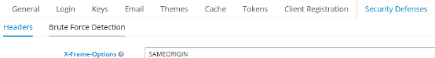
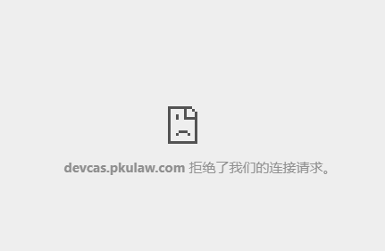

# 安全配置Security Defenses
通过对Security Defenses的配置 ，可以对http头添加相应的安全配置 ，如csp, X-Frame-Options,  X-Content-Type-Option等
## 1 X-Frame-Options
参考：https://www.rfc-editor.org/rfc/rfc7034
HTTP 响应头是用来给浏览器指示允许一个页面可否在 <frame>, </iframe> 或者 <object> 中展现的标记。网站可以使用此功能，来确保自己网站的内容没有被嵌套到别人的网站中去，也从而避免了点击劫持 (clickjacking) 的攻击。 
注意：由于微信扫码采用iframe的方式，所以这块我们不能配置，不然微信不能使用，或者使用ALLOW-FROM。
现代浏览器遵循 X-Frame-Options 协议头，它表明一个资源是否允许加载到 frame 或者 iframe 中。 如果响应包含值为 SAMEORIGIN 的协议头，浏览器会在 frame 中只加载同源请求的的资源；如果协议头设置为 	 ，浏览器会在加载 frame 时屏蔽所有资源，无论请求来自于哪个站点；如果希望开放给某个域名，可以使用ALLOW-FROM uri来实现它,DENY表示拒绝所有请求。


如果在kc中配置了它，并且在其它网站想通过iframe嵌入KC的页面，那么，如果使用SAMEORIGIN
它会出现如下图提示；如果是同源网站，是可以通过iframe访问它的


## 2 Content Security Policy
参考：https://www.w3.org/TR/CSP/
"网页安全政策"（Content Security Policy，缩写 CSP）CSP 的实质就是白名单制度，开发者明确告诉客户端，哪些外部资源可以加载和执行，等同于提供白名单。它的实现和执行全部由浏览器完成，开发者只需提供配置。
```
# 不允许被嵌入，包括<frame>, <iframe>, <object>, <embed> 和 <applet>
Content-Security-Policy: frame-ancestors 'none'
# 只允许被同源的页面嵌入
Content-Security-Policy: frame-ancestors 'self'
# 只允许被白名单内的页面嵌入
Content-Security-Policy: frame-ancestors www.example.com
 
# 不允许被嵌入，包括<frame>, <iframe>, <embed> 和 <object>
X-Frame-Options: deny
# 只允许被同源的页面嵌入
X-Frame-Options: sameorigin
# （已废弃）只允许被白名单内的页面嵌入
X-Frame-Options: allow-from www.example.com
```
## 3 Content-Security-Policy-Report-Only
参考：https://www.w3.org/TR/CSP/

## 4 X-Content-Type-Options
参考： https://developer.mozilla.org/zh-CN/docs/Web/HTTP/Headers/X-Content-Type-Options
响应首部相当于一个提示标志,被服务器用来提示客户端一定要遵循在 Content-Type 首部中对 MIME 类型 的设定。

## 5 X-Robots-Tag
参考：https://http.dev/x-robots-tag

## 6 X-XSS-Protection
参考：https://owasp.org/www-project-secure-headers/#xxxsp

## 7 HTTP Strict Transport Security (HSTS)
参考：https://owasp.org/www-project-secure-headers/#hsts
