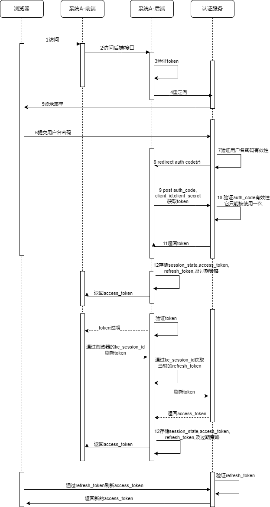

oauth2相关资料
* https://www.rfc-editor.org/rfc/rfc6749
* OAuth 2.0 https://www.rfc-editor.org/rfc/rfc6750
* OAuth 1.0 https://www.rfc-editor.org/rfc/rfc5849
* jwt https://www.rfc-editor.org/rfc/rfc7519
# refresh_token换新token的过程
> 注意：由于app端已经有多个版本供用户使用，所以对于app使用的客户端[vue]来说，需要单独控制它的过期时间，目前这个客户端的token过期时间还要维持30天
## 被动模式-过期后重新获取
* 用户请求登录接口
  * 浏览器[browser]或者rest接口[direct grant]认证
    * 按着授权码或者密码模式，返回token
      * 解析access_token,refresh_token,session_state
        * session_state被存储到浏览器cookie里，如果非浏览器环境，需要自己缓存到本地
          * access_token和refresh_token前端也需要缓存
            * 前端每次带着access_token去访问后端资源
              * 后端返回401时，前端需要拿到refresh_token去获取新的access_token
                * 如果没有获取到新的access_token，前端需要重定向到登录页面，重新认证
## 主动模式-定时刷新token[5分钟一次]
* 用户请求登录接口
  * 浏览器[browser]输入用户名密码
    * 认证成功，kc重定向到后端服务，并在地址栏带上授权码code
      * 后端服务通过code获取token信息
        * 后端通过code获取token
          * 前端拿到access_token,refresh_token进行存储
            * 前端每5分钟拿refresh_token去换新的access_token并存储
              * 前端访问后端接口出现401，需要再拿refresh_token去换新的access_token
                * 如果仍然出现401，前端跳转到kc登录页

# refresh_token换新的token方式
* 【refresh_token的有效性设置多少合适】
> * 使用方需要存储kc颁发的access_token和refresh_token
> * 当通过access_token获取接口返回401时，说明你的token已经过期了，这时需要通过refresh_token来换新的access_token
> * kc为用户颁发的token,里面有refresh_expires_in和expires_in，一般来说`expires_in`更短一些，可能是5分钟有效，而`refresh_expires_in`
    我们可以理解为`最长需要用户重新登录的时间`，比如你设置1个月，那么在这1个月内，你可以使用refresh_token来换新的token。
> * 新换的token中，也包含新的refresh_token，它的有效期会在原来的refresh_token基础上进行递减，不会从头算的。
* url:{kc_host}/auth/realms/fabao/protocol/openid-connect/token
* 请求方式：POST
* 请求类型：x-www-form-urlencoded
* 请求参数
```
grant_type:refresh_token
refresh_token:xxx
client_id:your clientId
client_secret:your clientSecret
```
* 响应
```
{
"access_token": "xxx.yyy.zzz",
"expires_in": 300,
"refresh_expires_in": 2591980,
"refresh_token": "xxx.yyy.zzz",
"token_type": "Bearer",
"not-before-policy": 1672035279,
"session_state": "143d9929-e586-4c9c-9336-11243d823479",
"scope": "roles pkulaw-extensions email v6 profile"
}
```

# kc认证的过程图


