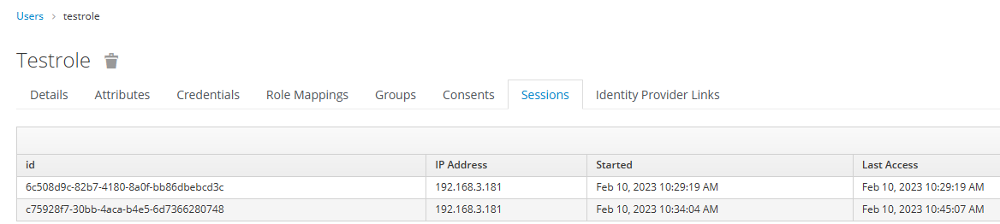

我们需要认清session会话和token令牌的区别，在keycloak中，他们是不同的两个概念，职责也不一样。

# session【session_state】

> 它被保存到浏览器的cookie中，有4个会话属性，这主要基于高低版本浏览器和记住我功能考虑而设计的

按着kc系统获取会话的优先级，他们分别是：【带_legacy是为了适应不支持samesite属性的浏览器】

1. auth_session_id（支持samesite属性，会话级，关闭浏览器后过期）
2. auth_session_id_legacy
3. keycloak_session_id （开启了KEYCLOAK_REMEMBER_ME后，设置了过期时间，会在cookie添加这个属性)
4. keycloak_session_id_legacy

会话与浏览器cookie里设计的过期时间有关，与token过期时间无关，当用户退出时，kc服务器保持的会话【session_state】会被删除，如图为kc用户的会话列表


# token

由于kc中使用的是jwt(json web token)，所以我们不需要把它再次进行存储了，因为在这个token里已经有了用户信息，并且添加了当前会话信息；而传统的而自解释
的token，往往需要把它与当前用户作一个对应关系，缓存起来，这点kc的jwt不需要存储。

一 根据职责，设置时长

* access_token 较短的有效期，如30分钟，jwt的token中，会有用户认证和授权的信息
* refresh_token 较长的有效期，用户最长可接受的，从新登录的时间，如10天

二 token的验证

* 在线验证: 为认证服务器压力比较大，相当于去中心化校验，因为kc存储了session_state，可以更准确的知道这个token是否在线
* 离线验证：各个服务端【对接到KC上的客户端】，通过kc颁发的公钥，对token进行签名验证，它可以验证出token是否由当前KC颁发的，对于在线性，它无法直接验证，当然，客户端自己也可以保留session_state，相当于分担KC的在线验证的压力
  * 离线验证的属性至少要包括
    * iss,token的颁发机构
    * exp,token的过期时间
    * 如果希望验证实时在线性，那你至少要维护session_state与token的关系，用户主动退出，需要清除它的关系
* /auth/realms/lind 来查看iss颁发的分钥信息

```json
{
    "realm":"lind",
    "public_key":"MIIBIjANBgkqhkiG9w0BAQEFAAOCAQ8AMIIBCgKCAQEAyOCNCy8x",
    "token-service":"https://kc.com/auth/realms/fabao/protocol/openid-connect",
    "account-service":"https://kc.com/auth/realms/fabao/account",
    "tokens-not-before":1670507855
}
```

三 refresh_token使用方式
refresh_token去刷新token的方式方法，往往争论不休，业界的做法也是多种多样，其中使用最多的，还是在前端添加轮训操作，定时去通过refresh_token去换新的access_token

```
  refreshToken() {
      this.refreshTime = setInterval(() => {
        checkToken(this.refreshLock, this.$store)
      }, 60000)
    }
```
