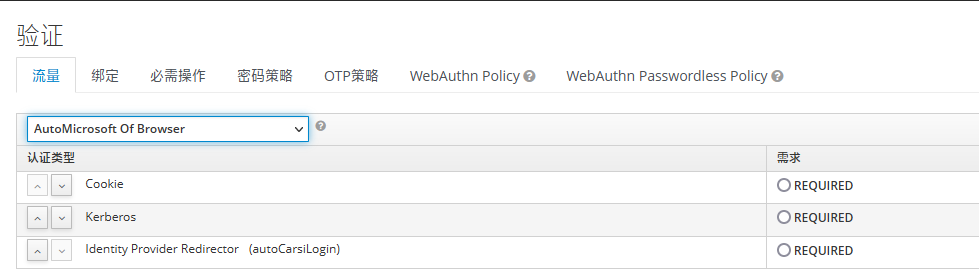
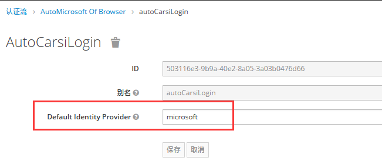
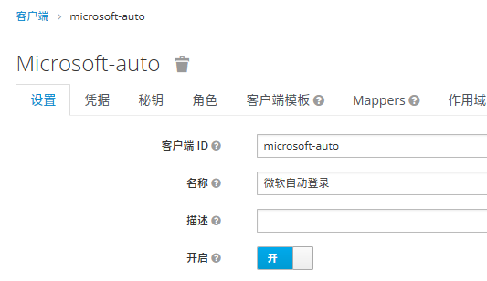
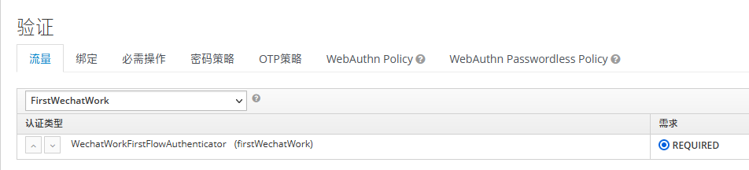
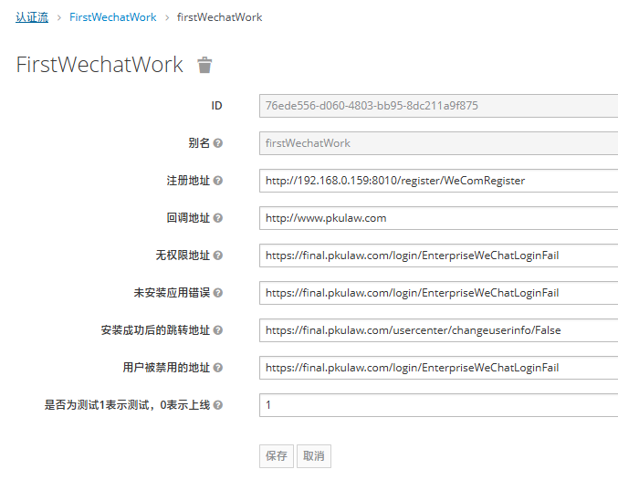

# kc社区登录

kc生成的社区登录的地址，会有tab_id,session_code，这是kc后台认可的id，这个不能自己定义，`必须由kc颁发`，所以你希望自定义社区登录的地址，需要使用其它方式，不用想着自定义tab_id和session_code这些参数。

# 定义认证流程，用于唤起某个社区的登录请求

选择最后一项`Identity Provider Redirector

配置具体的社区认证ID

# 定义新的社区自动登录客户端

重新配置它的认证流程，选择我们刚才建立的认证流

# 标准的登录地址

/auth/realms/fabao/protocol/openid-connect/auth?client_id=microsoft-auto&response_type=code&scope=openid&redirect_uri=https://www.pkulaw.com

* client_id:为我们刚才建立个客户端，注意每个客户端对应一种需要手动登录的社区
* response_type:认证方式，返回code码
* scope:授权类型于openid
* redirect_uri:认证成功后的回调地址

# 扩展知识

社区登录时，如果是新用户（未与kc用户进行绑定的），会跳到注册页面，这个注册页面的登录，在以First开头的认证流中进行配置（First是我们自己约定的，如果不配置，默认使用kc自己的`First Broken Flow`）

配置详情

