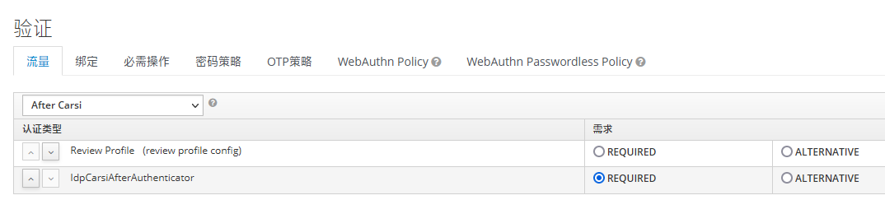

# 三方社区BUG问题
1. 登录页的社区登录链接，只能点一次，如果在新窗口打开，点第二次时会出现会话过期问题

# 三方社区登录重点
* AbstractOAuth2IdentityProvider 负责与第三方对接，完成登录
* AbstractIdpAuthenticator 如果在登录过程中，检测到了三方用户ID(federated_identity.federated_user_id)不存在，就会去AbstractIdpAuthenticator实现类`IdpCarsiFirstFlowAuthenticator`去做注册
* CarsiConfig是个性化配置类，它集成了OAuth2IdentityProviderConfig配置类，添加了自己独有的属性 
* 登录成功后，如果是新用户走FirstBrokerLogin的流程，在kc社区配置中进行；如果是老用户走finishBrokerAuthentication方法 
* 社区登录，可以通过在kc配置中，添加`第一登录流`来添加新用户的操作；也可以添加`登录后流程`来添加老用户登录成功后的个性化操作

> kc在登录，登录，获取code,获取token过程中都会向外部发布事件，我们可以订阅这些事件，去做我们自己的事情

# carsi认证的个性化
1. 使用第一登录流`IdpCarsiFirstFlowAuthenticator`实现了新用户的注册逻辑，当你的社区账号没有与kc账号完成绑定之前，在社区登录
后，它会先到这个`第一登录流`的逻辑里。
2. 如果你的社区账号已经完成与KC的绑定，在登录成功后，会走`CarsiAfterAuthenticator`，就是登录后的逻辑，本例子中，在这里把用户和组
绑定到了一起。
3. 当登录时，KC会向外部发布一些事件，如获取token,登录成功等事件，本例子中，我们在获取完token之后，需要把用户和组的关系解绑，所以
用到了`CODE_TO_TOKEN`事件，它会进行删除用户和组关系的动作。
4. 登录事件`LOGIN`里，我们完成了用户登录方式的记录，它被记录到user_attribute里，通过loginType进行标识。
5. 对token进行二次加工，需要重写`AbstractOIDCProtocolMapper`类，如果希望你添加的Mapper在其它Mapper后面执行，需要重写order和getPriority方法。
6. 更新用户扩展属性，当新用户登录时，通过CarsiAuthenticator.extractIdentityFromProfile方法进行实现；当老用户时，通过CarsiAuthenticator.updateBrokeredUser方法来实现更新用户信息
