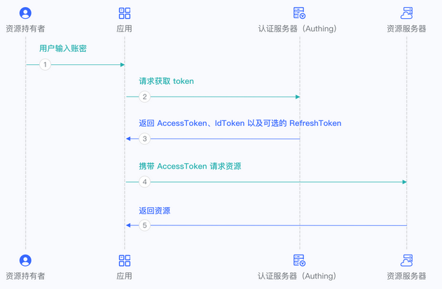
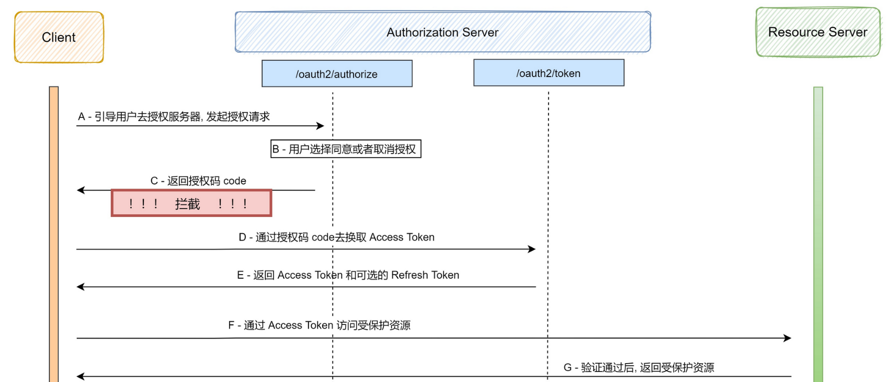
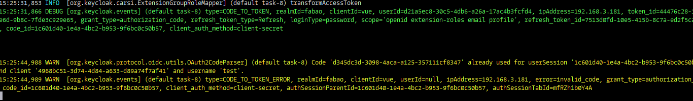

# 文档目录
 [1.服务对接KC的种类](#h1)
 [2.过期时间的策略](#h2)
 [3.离线验证token的有效性](#h3)
 [4.direct_grant密码认证](#h4)
 [5.refresh_token换新的token方式](#h5)
 [6.删除kc会话并重定向](#h6)
 [7.kc的HttpStatusCode规范](#h8)
 [8.机构账号与个人账号](#h9)
 [9. nickname的配置](#10)
 [10.★KC的优化与安全的建议](#h7)

# 流程图
## keycloak与其它应用的关系

## 验证token流程

## 授权码模式【brower】流程

## 密码模式【direct grant】流程

## 客户端模式流程

## 授权码拦截攻击
> 两种客户端类型：
> * confidential[/ˌkɑːnfɪˈdenʃ(ə)l/]，对于一个普通的web站点来说，虽然用户可以访问到前端页面， 但是数据都来自服务器的后端api服务， 前端只是获取授权码code， 通过 code 换取access_token 这一步是在后端的api完成的， 由于是内部的服务器， 客户端有能力维护密码或者密钥信息， 这种是机密的的客户端。
> * public,客户端本身没有能力保存密钥信息， 比如桌面软件， 手机App， 单页面程序(SPA)， 因为这些应用是发布出去的， 实际上也就没有安全可言， 恶意攻击者可以通过反编译等手段查看到客户端的密钥， 这种是公开的客户端。




# <span id="h1">1. 服务对接KC的种类</span>
> 目前项目中由.net,.net core,java,vue分别对接了keycloak，大体可分为两类：自主开发和keycloak官方提供的客户端adapter.
> dotnet与.net是一个东西，dot在英语单词里是`点`的意思，故dotnet就是指.net)
## 语言类
* dotnet → 自己封装的逻辑
* dotnet core → 自己封装的逻辑
* vue → kc官方适配器
* java~springboot → kc官方适配器
## 项目类
* v6主站 → .net → 自己封装的逻辑 → refresh_token已实现
* v6专题 → .net → 自己封装的逻辑 → refresh_token已实现
* v6高级检索 → .net core → 自己封装的逻辑 → refresh_token实现中
* 类案 → java → kc适配器，前端vue → kc适配器 → refresh_token已实现
* 风险透镜 → java → kc适配器,前端vue未对接kc → refresh_token未实现
* 小程序 → java → kc适配器,前端vue → kc适配器 → refresh_token未实现
* m站 → java → kc适配器,前端vue → kc适配器 → refresh_token未实现
* 书城 → java → kc适配器,前端vue → kc适配器 → refresh_token未实现
# <span id="h2">2. 过期时间的策略</span>
#### 概念
* `refresh_expires_in` refresh_token的过期时间（秒）
* `expires_in` token的过期时间（秒）
* `refresh_expires_in` > `expires_in`

#### KC配置里，refresh_expires_in谁小使用谁
* SSO Session Idle
* SSO Session Max
* Client Session Idle[/ˈaɪd(ə)l/]
* Client Session Max
* 以上4个配置，谁小refresh_expires_in使用谁
> 在keycloak管理后台，有个会话管理，或者在每个用户详情里，有个会话标签，这里记录的没有被删除的session_id，这里的session_id的生命周期与refresh_token的生命周期是一致的，但并不是说，在这里显示的session_id就一定没有过期，因为这个列表中的session_id有个删除规则，这个规则的时间是`全局的刷新token的时间`，比如（realms下面tokens在选项卡里的4个配置）你的token已经过期，去通过刷新token换也已经过期，那这个列表里的session_id就会被删除，例如：全局刷新token过期时间为5分钟，那么你18点登录的，在`18：05`分你需要从新去登录。

#### KC配置里，expires_in谁小使用谁
* KC配置里的Access Token Lifespan用来配置token的过期时间
* 理论上refresh_expires_in应该大于expires_in，因为在token过期时，需要使用refresh来换新的token，重新进行认证（包括最新的角色认证）
* 如果refresh_expires_in上面的配置小于Access Token Lifespan，那么，Access Token Lifespan将使用这个refresh_expires_in，即Access Token Lifespan的配置将失效

# <span id="h3">3. 离线验证token的有效性</span>
> 安全性问题，是否需要加访问限制，可以由汪洋那边去做限制
* 公钥获取地址：{kc_url}/auth/realms/fabao


* kc提供的验证token的方式，java端可直接使用，直接获取了kc中的公钥信息，并加了缓存，确保不会每次请求都连kc获公钥
* kc提供的两种公钥加载器
  * org.keycloak.adapters.rotation.JWKPublicKeyLocator[/loʊˈkeɪtər]
  * org.keycloak.adapters.rotation.HardcodedPublicKeyLocator
```
    AccessToken accessToken = null;
    try {
      AdapterConfig adapterConfig = new AdapterConfig();
      //realm name
      adapterConfig.setRealm(keycloakSpringBootProperties.getRealm());
      //client_id
      adapterConfig.setResource(keycloakSpringBootProperties.getResource());
      //认证中心keycloak地址
      adapterConfig.setAuthServerUrl(keycloakSpringBootProperties.getAuthServerUrl());
      //访问https接口时，禁用证书检查。
      adapterConfig.setDisableTrustManager(true);
      //根据client配置信息构建KeycloakDeployment对象
      KeycloakDeployment deployment = KeycloakDeploymentBuilder.build(adapterConfig);
      //执行token签名验证和有效性检查（不通过会抛异常）
      accessToken = AdapterTokenVerifier.verifyToken(token, deployment);
    } catch (Exception e) {
      e.printStackTrace();
    }
    if (accessToken != null) {
      return ResponseEntity.ok(true);
    } else {
      return ResponseEntity.ok(false);
    }
  }
```
* 获取公钥的方法 
org.keycloak.adapters.rotation.JWKPublicKeyLocator.getPublicKey()
```
  public PublicKey getPublicKey(String kid, KeycloakDeployment deployment) {
    int minTimeBetweenRequests = deployment.getMinTimeBetweenJwksRequests();
    int publicKeyCacheTtl = deployment.getPublicKeyCacheTtl();
    int currentTime = Time.currentTime();
    PublicKey publicKey = this.lookupCachedKey(publicKeyCacheTtl, currentTime, kid);
    if (publicKey != null) {
      return publicKey;
    } else {
      synchronized(this) {
        currentTime = Time.currentTime();
        if (currentTime > this.lastRequestTime + minTimeBetweenRequests) {
          this.sendRequest(deployment);
          this.lastRequestTime = currentTime;
        } else {
          log.debug("Won't send request to realm jwks url. Last request time was " + this.lastRequestTime);
        }

        return this.lookupCachedKey(publicKeyCacheTtl, currentTime, kid);
      }
    }
  }
```
# <span id="h4">4. direct_grant密码认证</span>
> * 直接通过rest接口进行密码认证，适合于不需要浏览器支持的场景，如app，后端服务通讯等
* url:{kc_host}/auth/realms/fabao/protocol/openid-connect/token
* 请求方式：POST
* 请求类型：x-www-form-urlencoded
* 请求参数
```
grant_type:password
username:test
password:123456
client_id:your clientId
client_secret:your clientSecret
```
* 响应
```
{
"access_token": "xxx.yyy.zzz",
"expires_in": 300,
"refresh_expires_in": 2591980,
"refresh_token": "xxx.yyy.zzz",
"token_type": "Bearer",
"not-before-policy": 1672035279,
"session_state": "143d9929-e586-4c9c-9336-11243d823479",
"scope": "roles pkulaw-extensions email v6 profile"
}
```

# <span id="h5">5. refresh_token换新的token方式</span>
* 【refresh_token的有效性设置多少合适】
> * 使用方需要存储kc颁发的access_token和refresh_token
> * 当通过access_token获取接口返回401时，说明你的token已经过期了，这时需要通过refresh_token来换新的access_token
> * kc为用户颁发的token,里面有refresh_expires_in和expires_in，一般来说`expires_in`更短一些，可能是5分钟有效，而`refresh_expires_in`
   我们可以理解为`最长需要用户重新登录的时间`，比如你设置1个月，那么在这1个月内，你可以使用refresh_token来换新的token。
> * 新换的token中，也包含新的refresh_token，它的有效期会在原来的refresh_token基础上进行递减，不会从头算的。
* url:{kc_host}/auth/realms/fabao/protocol/openid-connect/token
* 请求方式：POST
* 请求类型：x-www-form-urlencoded
* 请求参数
```
grant_type:refresh_token
refresh_token:xxx
client_id:your clientId
client_secret:your clientSecret
```
* 响应
```
{
"access_token": "xxx.yyy.zzz",
"expires_in": 300,
"refresh_expires_in": 2591980,
"refresh_token": "xxx.yyy.zzz",
"token_type": "Bearer",
"not-before-policy": 1672035279,
"session_state": "143d9929-e586-4c9c-9336-11243d823479",
"scope": "roles pkulaw-extensions email v6 profile"
}
```
# <span id="h6">6. 删除kc会话并重定向</span>
* 说明：清除kc域下面的会话，清除后，重定向到目标页，用户可以进行重新登录
* url:{kc_host}/auth/realms/fabao/sms/remove-sessions?redirect_uri={url}
* 请求方式：GET

# <span id="h8">7. kc的HttpStatusCode规范</span>
* 401
  * 未登录
  * token过期无效
* 403
  * 无权限访问这个url
* 500
  * kc内部错误 
* 200
  * 操作成功，刷新页面
* 204
  * kc不返回任何数据，页面保持原来的，不刷新页面

# <span id="h9">8. 机构账号与个人账号</span>
> 需要解析jwt token
* 获取里面的realm_access.roles数组，里面包含"组管理员"表示是机构用户，否则为普通用户。
* 例如，以下为机构账号
```
{
    "exp": 1674618200, //JWT的过期时间
    "iat": 1672026201, //JWT的签发时间
    "jti": "cf5d1c5e-fdc8-4c20-af76-b8c8821b1ecf", //jwt的唯一身份标识，主要用来作为一次性token,从而回避重放攻击
    "iss": "https://finalcas.pkulaw.com/auth/realms/fabao",//签发的认证网站
    "aud": ["pkulaw", "realm-management"], //当前用户具有哪些客户端的授权，在用户-角色映射-客户端角色中查看
    "sub": "347c9e9e-076c-45e3-be74-c482fffcc6e5",//kc里用户id
    "typ": "Bearer", //jwt类型
    "azp": "vue", //对接的客户端
    "session_state": "c007461c-d9ab-478f-8bc4-7cd4f6f1b271",//kc中的会话ID
    "acr": "1",
    "allowed-origins": ["*"], //允许哪些域名使用这个jwt
    "realm_access": { //域级别的权限
    "roles": ["carsi", "组管理员", "federated", "case"]
     }
    "resource_access": { //客户端级别的权限
        "pkulaw": {
            "roles": ["uma_protection"]
        },
    "nickname": "test",
    "extension_roles": {//自定义的扩展权限，包含微信，dingding等
            "weixin": ["banktopic"]
        },
    "scope": "roles pkulaw-extensions email v6 profile" //scope对应kc中的客户端模板，可理解为对jwt主体的加工
}
```
# <span id="h10">9. nickname的配置</span>
* nickname的扩展，需要将profile中的nickname删除


* 在客户端模板中，添加我们自己的nickname的mapper


* 用户属性中添加nickname


* jwt中的nickname生效


# <span id="h7">10. ★KC的优化与安全的建议</span>
## 登录优化
* 目前登录这块，有时出现登录状态无法同步的情况，表现如下：[V6这块有状态延时，通过iframe去判断从其它端登录的状态]
    * cookie中的会话在kc里是`在线的`，操作表现：用户点登录 → 跳到登录页后马上又回到v6首页 → 未登录状态
    * cookie中的会话在kc里`不在线`，操作表现：用户点登录 → 跳到登录页 → 输入用户名密码点登录  → 回到v6首页 → 未登录状态
* 优化步骤：
    * 点登录 → 302到清session接口 → 删除kc cookie里保持的会话 → 302到登录页，完成新用户的认证
## token校验优化
* code换token，去掉来源相同的限制，即client1请求的code，client2可以直接获取token，可以校验服务与kc的交互次数
* token的校验，去掉了协议名的校验，即忽略`iss【签发的认证网站】`地址里协议名的限制
## 安全的建议
* 缩短access_token有效期 【降低单个token的使用时限】
* 考虑个人用户添加登录的会话限制，每个个人用户，同时只有一个活动会话
* 限制每个应用的回调地址 【在kc上生成code时，回调地址必须是预期的，否则不能生成code码】【*因为有代理，所以地址不确定*】
* 限制每个应用的web-origins(web起源) 【你请求生成的token，哪些应用可以用】【*因为有代理，所以地址不确定*】
## 问题，待调研
* 登录-》删除cookie可能有问题，【一个人同时打开两个窗口，在一个窗口登录了，在另一个窗口也点登录，会将上一次的状态删除；kc默认是不会清的，会保持状态】
* code换token时出现被占用的原因【张占岭】
* refresh_token有效性，及时序图，是否需要定时器，周期性刷新token，刷新频率控制[是否由KC端去控制][refresh_token逻辑与登录生成token逻辑是一致的]
  * 前端获取token及刷新token通过后端，请求到kc
  * 阻止频繁刷新token
  * refresh_token存到后端
  * 后端将新token换回来之后，如何将新token返回到前端？
    * 新端调用后端接口->token过期返回401->前端调用后端刷新token接口[自己的后端]->返回新token->前端存储这个token->再从新调用后端接口
* 离线token验证说明，需要再
* 客户端【服务提供方】资源授权，需要用起来，某个端的角色只开放给某些端
* vue适配器，是否要启用官方的，自己进行封装
* 个人用户的登录限制问题

## 需要跟进的，下次讨论的
> 方案汇总时间：【2023-01-05下班前】
* code换token时出现被占用的原因【张占岭】
  * 用户恶意操作，授权码请求中的code，对code多次发送，也会引起这种结果
  * UUID生成可能出现重复
  * 集群中，多个web节点，如果处理多个相同的code，也会有引起这种结果
 
 
* 离线验证token封装成组件【.net 李超】【java 何昌涛】
* refresh_token回收验证 【张占岭】
  * refresh_token校验是否控制这个生成refresh_token的客户端与刷新refresh_token时的客户端保持一致
  * 关于refresh_token的使用次数，通过kc后台配置`Revoke Refresh Token`和`Refresh Token Max Reuse[/riːˈjuːz/]`实现，当达到`Refresh Token Max Reuse`次数时，这个token将被回收，这时你需要从新登录的
  * 用户被禁用后，无法通过refresh_token换新token
  * 用户修改密码后，是可以正常换token的
* refresh_token换token前后分离场景流程【.net 郑世可】【java 何昌涛，李晓光】
* vue自定义适配器，自己进行组件化封装 【李晓光】
* 客户端【服务提供方】按着权限为指定客户端授权 【张占岭 左凯瑞】
* 个人用户的登录会话限制 【张占岭】
  * 这块通过实现`Authenticator`接口的authenticate()方法，来控制用户会话数量，当达量限制时，可以将老的会话路踢出
  * kc认证通过`flow`机制实现，可以灵活控制每个登录的步骤，当用户名密码认证成功之后，去追加这个回话数限制逻辑
* 环境切换（阿里云，青云）出现无法登录的问题
