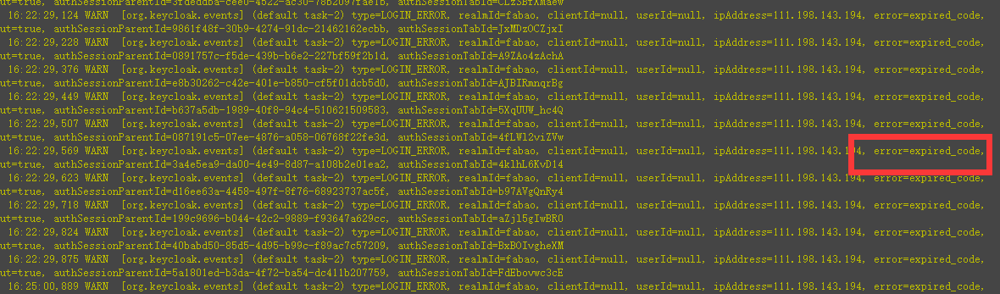
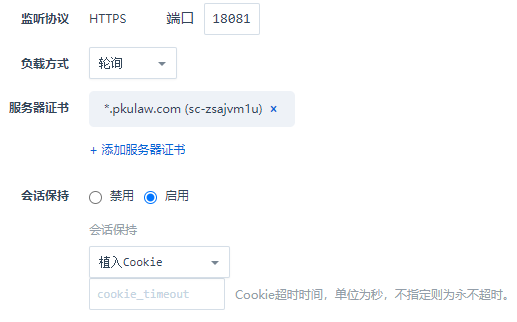

# 前提
kc的登录过程-》用户名密码-》认证成功-》重写向客户端带上了code->客户端拿code获取token，注意这个`code和token`的对应关系是保存在每个node节点的，它并不是分布式的缓存。

# 问题图片
* 描述，用户获取的code的对象关系在A节点，而通过code获取token时，它去了B节点，这样导致了你的code是无效的



# 配置
* 负载均衡是轮训模块时，需要开启会话保持，植入到cookie



* kc端部署到k8s时，关系svc的集群模式，改为Local，会话保存为ClientIp
```yml
spec:
  selector:
    app: keycloak
  externalTrafficPolicy: Local #主要配合云上的负载均衡使用，不进行svc的负载，即它是单独的节点，主要为了【负载均衡状态保持，植入cookie】,不过，如果浮在均衡使用的是轮训的方式，这边虽然不是cluster模式，但也会出现一个问题，就是同一个用户，发的请求一会儿在A节点，一会在B节点
  sessionAffinity: ClientIP #pod的会话保持
```
