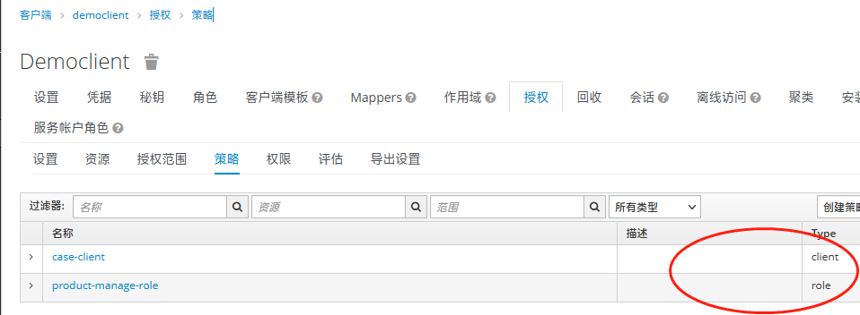

# 1 远程授权

通过在keyclowk的客户端上进行权限配置，来实现远程权限的下发，对应的程序不需要实现授权的功能。

# 2 配置相关

```
keycloak:
  auth-server-url: http://192.168.4.26:8080/auth
  realm: fabao
  resource: democlient
  credentials:
    secret: ec0fd1c6-68b0-4c39-a9fa-c3be25c8ef01
  policy-enforcer-config:
    enforcement-mode: ENFORCING #开启KC远程授权
  security-constraints: #开启远程的授权策略，没有认证将会跳到KC登录页
    - auth-roles:
        - "*"
      security-collections:
        - name:
          patterns:
            - /*
```

# 3 kc服务端配置相关

## 3.1 资源服务器打开远程授权


Policy Enforcement Mode：指定授权服务器接受到请求时策略如何执行

1. Enforcing：当资源没有配置关联的策略时，请求默认被拒绝访问，这也是默认的选项
2. Permissive：当资源没有配置关联的策略时，请求允许访问，但也需要先登录，否则拒绝访问
3. Disabled：禁用所有资源的所有访问策略

Decision Strategy：表示权限最终是如何计算的策略，以决定相应的资源是否能获得授权

1. Affirmative【肯定】 ：至少一个权限计算做出正向决定
2. Unanimous【一致】：所有的权限计算都要做出正向决定

> 注意：当你在keycloak管理平台修改了uma远程配置之后，你的资源服务器需要重新启动，否则不会生效，它的配置是在服务启动时加载到内存里的。

## 3.2 配置资源客户端的uma_protection角色

这一步非常重要，如果没有配置，远程授权会是403
这个参考资料：https://stackoverflow.com/questions/47199243/spring-keycloak-adapter-permissions-policy-enforcer-how-to-set-it-up

> 如下图，客户端photoz-uma-restful-api它是做为一个资源服务器对外提供api接口的，这时，他的服务端角色需要添加uma_protection。


## 3.3 资源和权限及策略关系图


## 3.4 多个策略指向同一资源

* 你的策略可以是角色，客户端，用户，组等等，它们可以指向同一个资源，这样就可以实现对资源不同纬度的控制，而权限就是把策略和资源组织在一起的抽象的概念。
  

## 3.5 对资源授权的步骤

* 建立资源
  
* 建立策略
  
* 建立权限
  一个权限用关联一个资源和多个策略
  

## 3.6 权限的决策策略[Decision Strategy]参数说明
1. Affirmative【肯定】：至少一个权限计算做出正向决定
2. Unanimous【一致】：所有的权限计算都要做出正向决定
3. Consensus【共识】：超少一半的权限计算做出正向决定

### 3.6.1 扩展阅读
在Jenkins中，Decision Strategy（决策策略）是一个插件，允许你在构建过程中使用不同的投票策略来决定构建的最终结果。这个插件通常用于处理具有多个分支或节点的构建过程，例如在分布式构建环境中，或者当有多个条件需要满足才能继续构建的情况下。

决策策略有三个选项：Affirmative（肯定投票）、Unanimous（全体一致投票）和Consensus（共识投票）。下面是它们的作用：

1. Affirmative（肯定投票）：
   当至少有一个构建节点投票“肯定”时，整个构建被视为通过。这意味着只要有一个节点认为构建是可行的，构建就会继续执行。如果所有节点都投票否定，则构建会被视为失败。这个选项适用于希望在分布式构建环境中只需一个节点同意构建就可以继续的情况。

2. Unanimous（全体一致投票）：
   所有构建节点都必须投票“肯定”，才能使构建继续执行。只要有一个节点投票否定，构建就会被终止。这个选项适用于希望在所有节点都同意构建条件时才继续执行的情况，这样可以确保构建的条件在所有节点上都是一致的。

3. Consensus（共识投票）：
   这个选项要求节点达成共识，即超过半数的节点投票“肯定”才能继续构建。如果投票结果没有达成共识，构建将被终止。这个选项适用于需要多个节点达成共识才能继续构建的情况。

你可以根据你的具体构建需求和分布式环境的配置选择合适的决策策略。要设置决策策略，你需要在Jenkins的构建配置中找到相应的选项，并选择你希望使用的策略。
