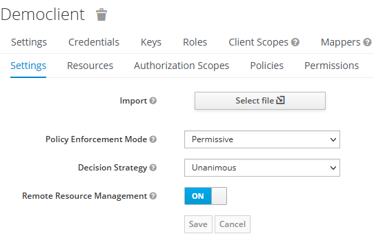
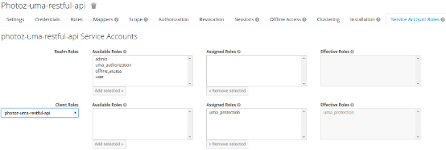
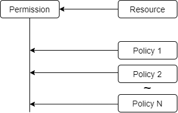
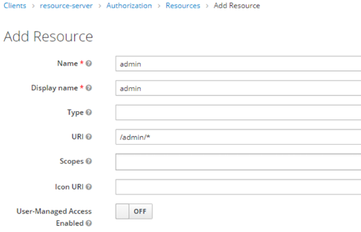
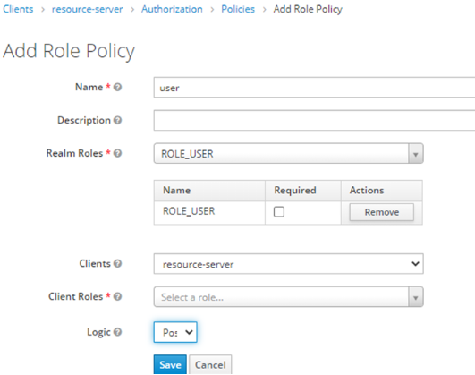
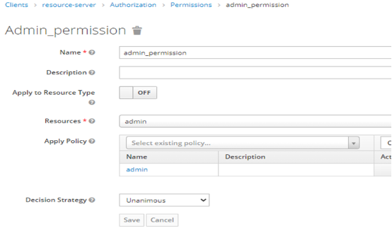

# 1 远程授权
通过在keyclowk的客户端上进行权限配置，来实现远程权限的下发，对应的程序不需要实现授权的功能。
# 2 配置相关
```
keycloak:
  auth-server-url: http://192.168.4.26:8080/auth
  realm: fabao
  resource: democlient
  credentials:
    secret: ec0fd1c6-68b0-4c39-a9fa-c3be25c8ef01
  policy-enforcer-config:
    enforcement-mode: ENFORCING #开启KC远程授权
  security-constraints: #开启远程的授权策略，没有认证将会跳到KC登录页
    - auth-roles:
        - "*"
      security-collections:
        - name:
          patterns:
            - /*
```
# 3 kc服务端配置相关
## 3.1 资源服务器打开远程授权

Policy Enforcement Mode：指定授权服务器接受到请求时策略如何执行
1. Enforcing：当资源没有配置关联的策略时，请求默认被拒绝访问，这也是默认的选项
2. Permissive：当资源没有配置关联的策略时，请求允许访问，但也需要先登录，否则拒绝访问
3. Disabled：禁用所有资源的所有访问策略

Decision Strategy：表示权限最终是如何计算的策略，以决定相应的资源是否能获得授权
1. Affirmative ：至少一个权限计算做出正向决定 
2. Unanimous：所有的权限计算都要做出正向决定

## 3.2 配置资源客户端的uma_protection角色
这一步非常重要，如果没有配置，远程授权会是403
这个参考资料：https://stackoverflow.com/questions/47199243/spring-keycloak-adapter-permissions-policy-enforcer-how-to-set-it-up


## 3.3 资源和权限及策略关系图


## 3.4 对资源授权的步骤
* 建立资源

* 建立策略

* 建立权限
一个权限用关联一个资源和多个策略


