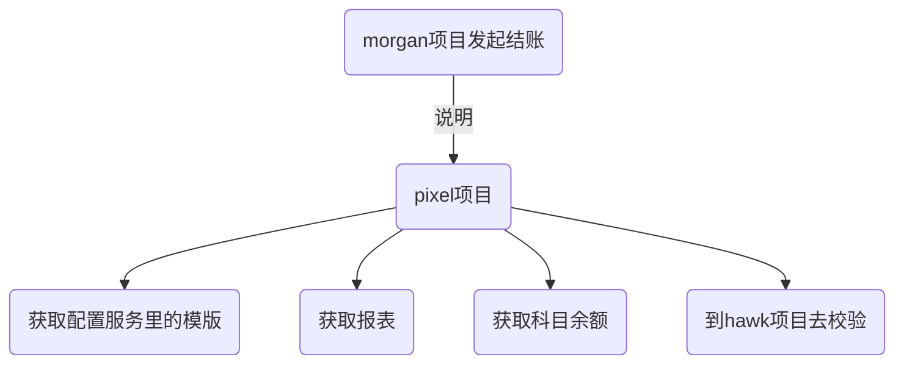
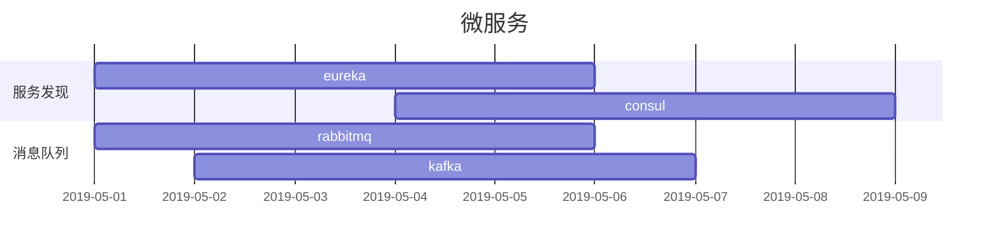
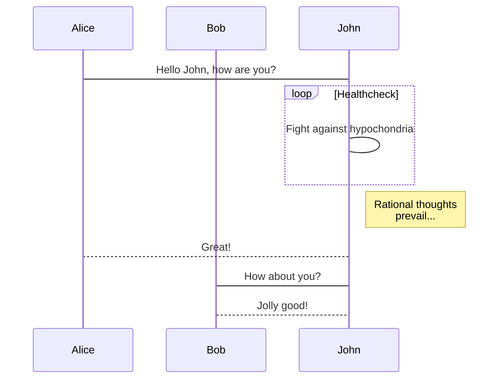
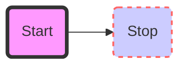
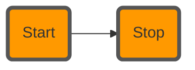
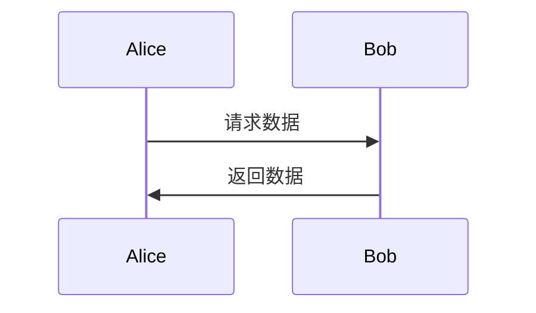
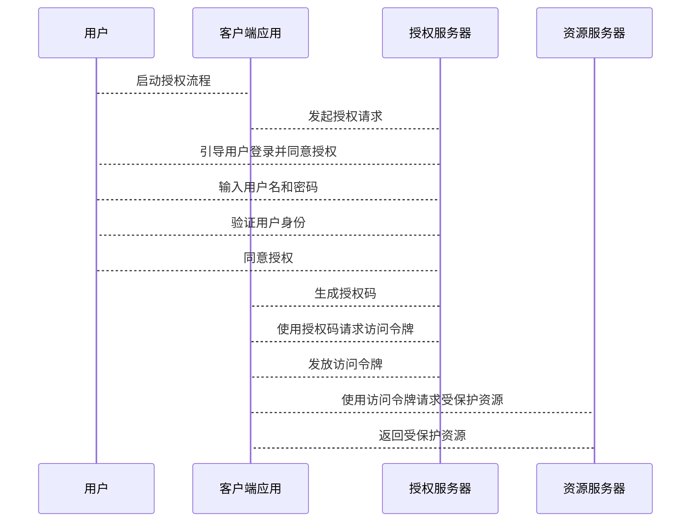

## 强调和高亮背景

中国是`伟大`的民族！
==Highlight==

## 链接

[大叔博客园](http://www.cnblogs.com/lori "仓储大叔")

## 引用

> .net
>
>> .net standard
>>
>>> .net core
>>>
>>

## 删除

中国是~~社会主义~~的国家

## 斜体和粗体

*斜体*和**粗体**,***斜又粗***

## 上标和下标

* a~1~+a~2~=A
* a^2+b^2=c^2

## 流程图

在gitlab,github网面上需要使用```mermaid才可以渲染流程图











## 表格


| 姓名 | 性别 |
| ---- | ---- |
| 张三 | 男   |

## 项目符号

* 第一章
  * 第一节
    * 第一单元
      * 第一课
      * 第二课
    * 第二单元
  * 第二节
* 第二章

## 编号

1. 微软
2. IBM
3. SUN

## 分割线

---

写信了

---

## 添加脚注

仓储大叔[^1]

[^1]: 是一位架构师，开发了Lind.DDD框架，同时是多年微软MVP，在工作上帮到了很多开发人员。
    
## 任务列表

* [X]  .net
* [X]  java
* [X]  node.js

## 数学公式

```math
\oint_c x^3\,dx+4y^2\,dy

2=\left(
\frac
{\left(3-x\right)\times2} 
{3-x}
\right)
```

今天就说到这里吧，希望可以帮助到大家！

## 时序图



## oauth2时序图


