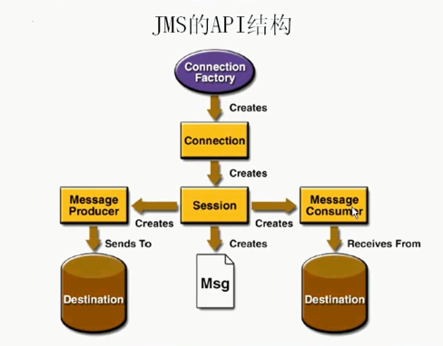
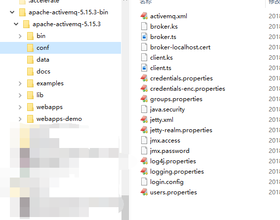
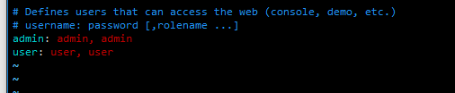
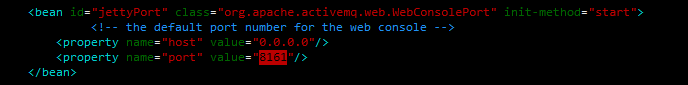
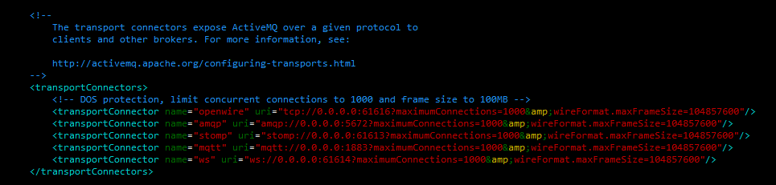
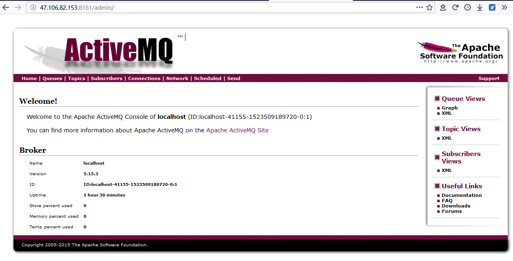
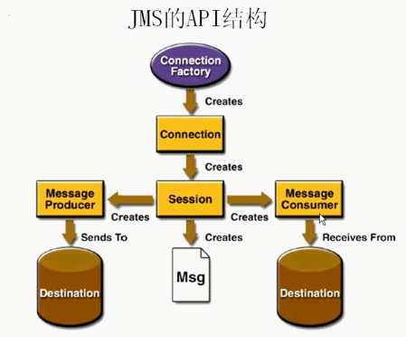
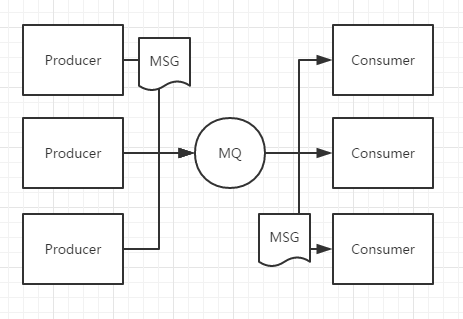
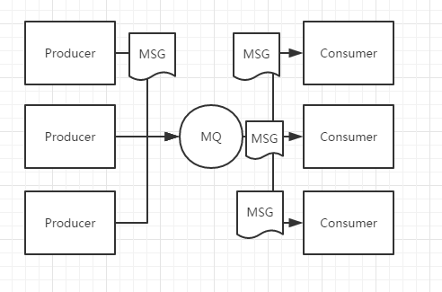
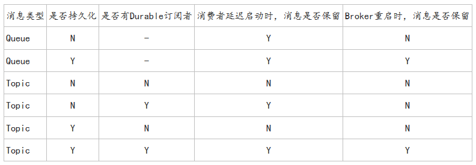

# █ 消息队列

# 一. 应用场景

[参考链接: 消息队列的使用场景](https://blog.csdn.net/seven__________7/article/details/70225830)

消息队列中间件是分布式系统中重要的组件，主要解决应用耦合，异步消息，流量削锋等问题, 实现高性能，高可用，可伸缩和最终一致性架构. 

以下介绍消息队列在实际应用中常用的使用场景。异步处理，应用解耦，流量削锋和消息通讯四个场景 :

1. **异步处理**

   将原本需要串行处理的多个业务操作, 变成异步处理, 有利于提高系统响应速度.

   原本系统需要同步完成一系列操作后才会给出响应, 用户需要等待的时间就是**所有操作耗时之和**;

   引入消息队列后, 系统先完成最主要的步骤, 然后将余下步骤写入消息队列就给用户返回响应, 用户等待时间为 **主要步骤耗时+写入消息队列** 的时间, 响应速度大大加快.

   (用户并不十分关心余下的步骤在什么时候完成., 不应让用户在这些环节上等待)

2. **应用解耦**

   在分布式系统中, 如果 A 系统直接调用 B 系统, 则在程序运行过程中, A B 系统任意一个出现故障都可能会导致整个操作流程的失败;

   引入消息队列后, A B 系统通过消息队列进行通讯, 其中一个系统出现故障时, 不影响另一个系统的照常运行, 等到故障系统恢复后, 会继续处理之前放入消息队列中的消息. 

### 2. 应用解耦

场景说明：用户下单后，订单系统需要通知库存系统。传统的做法是，订单系统调用库存系统的接口。如下图

 

传统模式的缺点：

- 假如库存系统无法访问，则订单减库存将失败，从而导致订单失败
- 订单系统与库存系统耦合

 

- 订单系统：用户下单后，订单系统完成持久化处理，将消息写入消息队列，返回用户订单下单成功
- 库存系统：订阅下单的消息，采用拉/推的方式，获取下单信息，库存系统根据下单信息，进行库存操作
- 假如：在下单时库存系统不能正常使用。也不影响正常下单，因为下单后，订单系统写入消息队列就不再关心其他的后续操作了。实现订单系统与库存系统的应用解耦

### 3. 流量削峰

### 4. 日志处理

## 二. 主流技术
使用较多的消息队列有ActiveMQ，RabbitMQ，ZeroMQ，Kafka，MetaMQ，RocketMQ.

# 二. JMS 介绍

## 1. JMS 规范

JMS, Java Message Service, Java 消息服务, 是 Java EE中的一个技术

JMS 是一套规范, 只定义了访问消息中间件的接口, 并没有给予实现, 实现 JMS 接口的消息中间件称为 JMS Provider, 如 Active MQ

## 2. JMS 组成

**JMS provider:** 实现 JMS 接口和规范的消息中间件

**JMS message:** JMS 的消息, 由以下三部分组成

1. 消息头: 每个消息头字段都有相应的 getter/setter 方法
2. 消息属性: 如果需要除了消息头以外的信息, 可以使用消息属性
3. 消息体: 封装具体的消息数据

**JMS producer:** 消息生产者, 创建和发送 JMS 消息的客户端应用

**JMS consumer:** 消息消费者, 接受和处理 JMS 消息的客户端应用

**JMS domains**: 消息传递域, JMS 规范中定义了两种消息传递域

1. 点对点(point to point, PTP), 
2. 发布/订阅(publish/subscribe)

**JMS broker**: 相当于 JMS provider 的实例

## 3. JMS 消息结构

### 1) 消息头

消息头包含消息的识别信息和路由信息. 

```
JMSDestination: 消息发送的目的地, 主要是指 queue 和 topic, 由创建方法 createQueue() 或 createTopic() 指定
JMSDeliveryMode: 传送模式: 持久模式和非持久模式
JMSExpiration: 消息过期时间, 0表示该消息永不过期. 若发送后消息过期时间内没被消费者消费, 则该消息被清除
JMSPriority: 消息优先级, 0-4 普通消息, 5-9 是加急消息. 默认为 4.
JMSMessageID: 唯一识别每个消息的标识, 由 provider 产生;
JMSTimestamp: 在调用send() 方法时自动设置的时间戳, 是消息被发送和消费者实际接受的时间差
JMSCorrelationID: 引用另一条消息, 典型应用是在回复消息时引用原消息. 通常为原消息的 JMSMessageID. 也可以自定义
JMSReplyTo: 提供本消息接受回执的地址, 如果消费者要发送签收回执,将按这个属性发送回执
JMSType: 消息类型的识别符
JMSRedelivered: 表示该消息是原件还是复件. 若该属性为 true, 表示该消息在之前已经发送过, 但并没有签收
```

### 2) 消息体

JMS 定义了5中消息体格式, 也叫消息类型

```
StreamMessage      Java 原始值数据流
MapMessage         一套 K-V 键值对
TextMessage        一个字符串对象
ObjectMessage      一个可序列化的对象
BytesMessage       一个字节数据流
```

其中 ObjectMessage 被认为是不安全的, 因此 ActiveMQ 限制使用, 如果需要使用 ObjectMessage, 需要指定要使用的 package , [ActiveMQ - ObjectMessage支持](http://activemq.apache.org/objectmessage.html)

#### i. broker 设置

在 `${activemq}/bin/env` 文件中, 为 `ACTIVEMQ_OPTS` 添加信任的 package 列表, 如果要允许所有类, 可以将信任列表设为`*`

```sh
if [ -z "$ACTIVEMQ_OPTS" ] ; then
    ACTIVEMQ_OPTS="$ACTIVEMQ_OPTS_MEMORY 
    	-Djava.util.logging.config.file=logging.properties 
    	-Djava.security.auth.login.config=$ACTIVEMQ_CONF/login.config 
    	# 信任的 package 列表, 只有在信任列表中的类才能正常序列化, * 表示信任所有类
    	-Dorg.apache.activemq.SERIALIZABLE_PACKAGES=java.lang,java.util,com.mycompany.myapp"
fi
```

#### ii. client 设置

在 client 端, 也需要在 connectionFactory 上指定信任列表

```xml
<bean id="connectionFactory" class="org.apache.activemq.ActiveMQConnectionFactory">
    <property name="brokerURL">
        <value>${activemq.broker.url}</value>
    </property>
    <!-- 添加信任列表 -->
    <property name="trustedPackages">
        <list>
            <value>org.apache.activemq.test</value>
            <value>org.apache.camel.test</value>
        </list>
    </property>
    <!-- 信任所有 -->
    <property name="trustAllPackages" value="true"/>
</bean>
```

### 3) 消息属性

消息属性, 包含三种类型的属性

1. JMS 客户端应用设置的自定义属性

   > message.setXXXProperty( KEY, VALUE)

2. JMS 定义的属性

   使用 JMSX 作为属性名的前缀, 

   connetcion.getMetaData().getJMSXPropertyNames(), 会返回所有连接支持的 JMSX 属性的名字

   ```
   1. JMSXUserID: 发送消息的用户标识
   2. JMSXAppID: 发送消息的应用标识
   3. JMSXDeliveryCount: 转发消息的重试次数
   4. JMSXGroupID: 消息所在消息组的标识
   5. JMSXGroupSeq: 组内消息的序号
   6. JMSXProducerTXID: 产生消息的那个事务的标识
   7. JMSXConsumerTXID: 消费消息的那个事务的标识
   8. JMSXRevTimeStamp: JMS 转发消息到消费者的时间
   9. JMSXState: 消息的状态. 
      1=等待, 2=准备, 3=到期, 4=保留, 由 provider 提供与维护
   ```

3. JMS provider 特定的属性

## 4. JMS 的 API 结构



**Connection factory**: 连接工厂, 用来创建连接对象, 以连接到 JMS provider

**JMS Connection**: 封装了客户与 JMS Provider 之间的一个虚拟的连接

**JMS Session**: 是生产和消费消息的一个单线程会话, 用于创建消息的生产者/消费者和消息等. session 提供了一个事务性的上下文, 在这个上下文中, 一组发送和接受被组合到一个原子操作中.

**Destination**: 消息发送到的目的地, 队列 或是 主题

**Acknowledge**: 消息的签收, 

**Transaction**: 事务

**JMS Client**: 用来收发消息的 Java 应用

**Non-JMS Client**: 使用 JMS provider 本地 API 写的应用, 用来替换 JMS API 实现收发消息的功能, 通常会提供其他的一些特性. 如 CORBA, RMI 等

**Administered objects**: 预定义的 JMS 对象, 通常在 provider 规范中定义, 提供给 JMS 客户端来访问, 如 ConnectionFactory 和 Destination

# 三. ActiveMQ

## 1. 简介

JMS 是一个规范, 只提供了接口, 并没有提供实现, 要使用消息队列服务, 必须选择一个 JMS provider.

ActiveMQ 是 Apache出品的，非常流行的消息中间件，可以说要掌握消息中间件，需要从 ActiveMQ 开始，要掌握更加强大的RocketMQ，也需要 ActiveMQ 的基础.

## 2. 环境搭建
### 1) 安装需求

通常直接从官网下载最新的二进制包, 只需满足前两个条件即可.

1. JRE 1.7+
2. 配置 JAVA_HOME
3. MAVEN 3.0+ (从源码安装)
4.  [依赖的 Jars](http://cvs.apache.org/repository/geronimo-spec/jars/) (从源码安装)

### 2) 下载安装

1. 移动到工作目录 /usr/local
2. 从官网下载最新版本的 tar 包
3. 解压到当前目录

```bash
cd [activemq_install_dir]
wget http://activemq.apache.org/path/tofile/apache-activemq-x.x.x-bin.tar.gz
tar zxvf activemq-x.x.x-bin.tar.gz
```

## 3. 基本配置参数

### 1) 目录结构



activemq 的目录如上图所示: 

>**bin**, 下面存放的是 ActiveMQ 的启动脚本
>
>**conf**, 里面是配置文件，重点关注的是 activemq.xml、jetty.xml、jetty-realm.properties。
>
>**data**, 目录下是 ActiveMQ 进行消息持久化存放的地方，默认采用 kahadb，也支持 leveldb, JDBC等, 也可以不使用持久化;
>
>**webapps**，ActiveMQ 自带 Jetty, 提供 Web 管控台
>
>**lib**, ActiveMQ 为我们提供了分功能的 JAR 包，当然也提供了activemq-all-5.15.3.jar
>

### 2) jetty-realm.properties

这个文件用来指定访问 web 控制台的用户名和密码, 默认有 admin 和 user 两个用户

> 登陆用户名: 密码, 显示角色名



### 3) jetty.xml

这个文件中指定了 web 控制台的访问端口, 默认为 **8161**




### 4) activemq.xml

这个文件中指定了 mq 服务监听的端口, 默认为 **61616**




### 5) 安全设置

activemq 默认没有安全校验, 只要获取了 broker 的 url, 任何人都可以在上面收发消息

如果需要安全校验, 可以使用简单的安全控制, 需要提供用户名和密码才能访问 broker

如需更细致的安全控制, 可以使用 JAAS 安全控件

现在只介绍简单的安全控制: 

1. 在`activemq.xml` 中添加 `simpleAuthenticationPlugin` 插件

   ```xml
   <plugins>
       <simpleAuthenticationPlugin>
           <users>
               <authenticationUser username="admin" password="password" groups="admins"/>
               <authenticationUser username="guest" password="password"  groups="guests"/>
           </users>
       </simpleAuthenticationPlugin>
   </plugins>
   ```

2. 在客户端代码中, 指定连接的用户名和密码

   ```java
   // 1. 在 connectionFactory 中设置
   ConnectionFactory connectionFactory = new ActiveMQConnectionFactory("admin", "admin", "tcp://ip:61616");
   Connection connection = connectionFactory.createConnection();
   connection.start();
   
   // 2. 或在 connection 中设置
   ConnectionFactory connectionFactory = new ActiveMQConnectionFactory("tcp://ip:61616");
   Connection connection = connectionFactory.createConnection("admin","admin");
   connection.start();
   ```

3. 如果使用 spring JMS, 在配置连接工厂时进行如下设置

   ```xml
   <bean id="connectionFactory" class="org.apache.activemq.ActiveMQConnectionFactory">
       <property name="userName" value="admin" />
       <property name="password" value="admin" />
       <property name="brokerURL">
           <value>${activemq.broker.url}</value>
       </property>
       <!-- amq默认只支持少量类型的 ObjectMessage, 可以指定信任的包, 或信任所有包 -->
       <property name="trustAllPackages" value="true"/>
   </bean>
   ```


## 4. 启动与结束 

### 1) 启动

移动到 activemq/bin 目录下, 执行 `./activemq start`

```bash
root@remote:~# cd /usr/local/activemq/bin/
root@remote:/usr/local/activemq/bin# ./activemq start
```

返回提示信息以及使用的 pid, 表示成功启动

```bash
INFO: Loading '/usr/local/activemq//bin/env'
INFO: Using java '/usr/java/jdk1.8.0_162/bin/java'
INFO: Starting - inspect logfiles specified in logging.properties and log4j.properties to get details
INFO: pidfile created : '/usr/local/activemq//data/activemq.pid' (pid '23767')
```

### 2) 结束

移动到 activemq/bin 目录下, 执行 `./activemq stop`

```bash
root@remote:~# cd /usr/local/activemq/bin/
root@remote:/usr/local/activemq/bin# ./activemq start
```

返回提示信息, 表示成功结束

## 5. web 控制台

可以通过 `ip:port/admin `来访问 web 控制台, 需要输入用户名和密码, 在 `jetty-realm.properties` 中配置



## 6. Java client

### 1) 导入依赖包

在 java 应用中访问 ActiveMQ, 需要导入支持的包

```xml
<dependency>
    <groupId>org.apache.activemq</groupId>
    <artifactId>activemq-client</artifactId>
    <version>5.15.3</version>
</dependency>
```

导入依赖包后, 就可以访问外部的 ActiveMQ 中间件.

如果需要创建使用嵌入式的 broker, 还可以使用  `activemq-all` 包, 但这个包中自带了很多外部 jar 包的依赖, 如果项目中还需要用到其他技术, 比如 `spring` 框架, 则应注意依赖冲突的问题.

### 2) 基本操作



1. 创建 ConnectionFactory, 连接工厂;

   > ConnectionFactory connectionFactory= new ActiveMQConnectionFactory(用户名, 密码, 消息队列路径);

2. 创建 Connection, 代表了应用程序和消息服务器之间的通信链路, 默认关闭, 需要 start 开启;

   > Connection connection = connectionFactory.createConnection();
   >
   > connection.start();

3. 创建 Session, Session，用于发送和接受消息，而且是单线程的，支持事务的。如果Session开启事务支持，那么Session将保存一组信息，要么commit到MQ，要么回滚这些消息。Session可以创建MessageProducer/MessageConsumer;

   > Session session = connection.createSession(是否开启事务, 签收模式);

4. 创建 Destination, 即消息的目标, queue(点对点模式) 或 topic(主题模式);

   >Destination destination = session.createQueue(队列名);
   >
   >Destination destination = session.createTopic(主题名);

5. 创建 生产者/消费者, 通过 **session** 来创建

   >MessageProducer messageProducer = session.createProducer(destination);
   >
   >MessageConsumer messageConsumer = session.createConsumer(destination);

6. 设置持久化方式, 可以保存到 kahdb/leveldb/jdbc 等方式, 若不持久化则重启后丢失消息

   > messageProducer.setDeliveryMode(持久化方式);

7. 消息对象的发送/接收,生产者和消费者之间传递的对象，由3个主要部分构成：

   1. 消息类型

      消息头（路由）+消息属性（消息选择器，以后介绍）+消息体（JMS规范的5种类型消息）

   2. 生产者发送消息

      > TextMessage textMessage = session.createTextMessage();
      > textMessage.setText("hello activeMQ");
      > messageProducer.send(textMessage);

   3. 消费者接收消息

      > TextMessage message = (TextMessage) messageConsumer.receive();

8. 关闭连接, 必须关闭连接, 否则 ActiveMQ 不会释放资源

# 四. 消息传递模式

## 1. PTP -- 点对点模式

### 1) 概述

JMS PTP ( point to point) 模型是基于队列的, 生产者发送消息到队列, 消费者从队列中接受消息. 

队列的存在使得消息的异步传输成为可能. JMS provider 提供工具管理队列的创建和删除.

- **可靠性**: 如果在 session 关闭时, 有一些消息已经被消费者接收, 但是没有被签收, 那么当消费者下次连接到相同的队列时, 这些消息还会被再次接收
- **选择性**: 如果用户在 receive 中设置了消息的选择条件, 那么不满足条件的消息会留在队列中, 不会被接收
- **异步性**: 队列可以长久的保存消息, 直到消费者签收消息. 消费者不需担心消息丢失而与队列保持连接, 充分体现了异步传输模式的优势
- **点对点**: 每个队列可以有多个消费者, 但每个消息只能有一个消费者, 一旦消费者签收消息, 该消息就会从队列中移除.
- **时间无关性**: 消息的生产者和消费者之间没有时间上的相关性, 无论消费者在生产者发送消息时是否处于运行状态, 都可以从队列中提取消息



### 2) Demo

生产者

```java
public static void main(String[] args) throws Exception{
    // 创建连接
    String username = "admin";
    String password = "admin";
    String url = "tcp://47.106.82.153:61616";
    ConnectionFactory connectionFactory = new ActiveMQConnectionFactory(username, password, url);
    Connection connection = connectionFactory.createConnection();
    connection.start();

    // 创建会话, 不开启事务, 通过自动模式收发消息
    Session session = connection.createSession(false, Session.AUTO_ACKNOWLEDGE);
    Destination destination = session.createQueue("acknowledgeMode");

    // 创建生产者
    MessageProducer producer = session.createProducer(destination);

    for(int i = 0; i< 5; i++){
        MapMessage message = session.createMapMessage();
        message.setString("auto_msg" ,"这是自动签收的消息"+i);
        producer.send(message);
        System.out.println("已发送消息:"+i);
    }

    // 关闭连接
    connection.close();
}
```

消费者

```java
public static void main(String[] args) throws Exception{
    // 创建连接
    String username = "admin";
    String password = "admin";
    String url = "tcp://47.106.82.153:61616";
    ConnectionFactory connectionFactory = new ActiveMQConnectionFactory(username, password, url);
    Connection connection = connectionFactory.createConnection();
    connection.start();

    // 创建会话, 不开启事务, 通过自动模式收发消息, 不需要手动签收
    Session session = connection.createSession(false, Session.AUTO_ACKNOWLEDGE);
    Destination destination = session.createQueue("acknowledgeMode");

    // 创建消费者
    MessageConsumer consumer = session.createConsumer(destination);

    System.out.println("准备接受自动消息.....");
    for(int i = 0; i< 5; i++){
        MapMessage message = (MapMessage)consumer.receive();
        String msg = message.getString("auto_msg");
        System.out.println(msg);
    }

    // 关闭连接
    connection.close();
}
```

## 2. Pub/Sub -- 发布/订阅模式

### 1) 概述

JMS Pub/Sub 发布/订阅消息传递域中, 目的地被称为 主题(Topic) , 模型定义了如何向一个内容节点发布和订阅消息, 这些节点被称为 Topic (主题)

主题可以认为是消息的传输中介, 发布者(publisher)发布消息到主题, 订阅者(Subscriber)从主题订阅消息. 主题使得消息订阅者和消息发布者保持相互独立, 不需要接触即可保证消息的传送.

- 两种模式: 消息订阅分为持久订阅和非持久订阅两种模式
- 选择性: 如果消费者在 receive 中设置了消息的选择条件, 那么不满足条件的消息不会被接收
- 时间相关性: 生产者和消费者之间有时间相关性. 订阅一个主题的消费者, 只能消费自他订阅之后发布的消息.
- 可靠性: 非持久订阅的状态下, 不能恢复或重新派送一个未签收的消息, 只有持久订阅者才能恢复或重新派送一个未签收的消息
- 当所有的消息必须被接收, 使用持久订阅; 若能够容忍消息的丢失, 采用非持久订阅, 性能较优

每个消息可以有多个消费者

JMS 规范允许客户进行持久化订阅与非持久化订阅, 在一定程度上放松了时间上的相关性要求, 持久订阅允许消费者消费在它未处于激活状态时发送过的消息.



### 2) 非持久订阅

#### 2) 特点

非持久订阅: 消费者订阅以后, JMS provider 不会为离线的消费者保留消息, 消费者将丢失他在离线期间的消息

对于非持久的 topic 消息发送, 与发送消息到队列基本一样, 只是创建目的地时由 createTopic() 创建 topic

对于非持久的 topic 消息接收:

- 创建 destination 时, 选择创建 topic
- 接收方必须在线, 然后发送方才能发送消息, 否则接收方将丢失信息
- 接收方不知道发送方发送了多少消息, 通过 while 死循环轮询接收消息

#### 3) Demo

生产者

```java
public static void main(String[] args) throws Exception{
    // 创建连接
    String username = "admin";
    String password = "admin";
    String url = "tcp://47.106.82.153:61616";
    ConnectionFactory connectionFactory = new ActiveMQConnectionFactory(username, password, url);
    Connection connection = connectionFactory.createConnection();
    connection.start();

    // 创建会话, 不开启事务, 通过自动模式收发消息
    Session session = connection.createSession(false, Session.AUTO_ACKNOWLEDGE);
    Destination destination = session.createTopic("nonPersist");

    // 创建生产者
    MessageProducer producer = session.createProducer(destination);

    for(int i = 0; i< 5; i++){
        MapMessage message = session.createMapMessage();
        message.setString("nonMsg" ,"这是非持久订阅的消息"+i);
        producer.send(message);
        System.out.println("已发送消息:"+i);
    }

    // 关闭连接
    connection.close();
}
```

消费者

```java
public static void main(String[] args) throws Exception{
    // 创建连接
    String username = "admin";
    String password = "admin";
    String url = "tcp://47.106.82.153:61616";
    ConnectionFactory connectionFactory = new ActiveMQConnectionFactory(username, password, url);
    Connection connection = connectionFactory.createConnection();
    connection.start();

    // 创建会话, 不开启事务, 通过自动模式收发消息, 不需要手动签收
    Session session = connection.createSession(false, Session.AUTO_ACKNOWLEDGE);
    Destination destination = session.createTopic("nonPersist");

    // 创建消费者
    MessageConsumer consumer = session.createConsumer(destination);

    System.out.println("准备接受自动消息.....");
    MapMessage message = (MapMessage)consumer.receive();
    while(message != null){
        String msg = message.getString("nonMsg");
        System.out.println(msg);
        message = (MapMessage)consumer.receive(1000L);
    }

    // 关闭连接
    connection.close();
}
```

### 3) 持久订阅

#### a. 特点

持久化订阅: 消费者订阅以后, 不论消费者是否在线, JMS provider 将为消费者保留消息, 直到消费者上线消费 

- 对于生产者: 

  通常要求消息的生产者采用 DeliveryMode.PERSISTENT 模式发送消息

  需要先设置好以后, 才能 connection.start() ( 测试发现先启动 connection 也能实现消息持久订阅? )

- 对于订阅者:

  设置消费者ID, 用来识别是哪个消费者

  创建 topicSubscriber 来作为订阅者

  设置好以后, 再 connection.start() ?

  先运行一次以向 JMS provider 注册这个订阅消费者, 才能运行生产者发送消息

    > connection.setClientID( **客户ID** );
    >
    >
    > Session session = connection.createSession(false, Session.AUTO_ACKNOWLEDGE);
    >
    > TopicSubscriber consumer =session.createDurableSubscriber(Topic名, **持久订阅名**);

**客户ID+订阅名** 具有唯一性, 同一个订阅者名下的持久订阅不可重名:

- 当 "客户ID+订阅名" 不同时, 将创建不同的订阅, 即同一个客户ID, 可以拥有多个主题订阅;

  但在某一时刻, 同一个客户ID, 只能激活其中一个订阅;


- 订阅后使用 "客户ID+订阅名+**原主题**", 调用 CreateDurableSubscriber(), 该订阅被激活, 获取离线消息;


- 订阅后使用 "客户ID+订阅名+**新主题**", 调用 CreateDurableSubscriber(), 会创建新订阅, 覆盖原有订阅

#### b. 取消订阅

持久订阅在创建之后会一直保留, 直到程序调用会话上的 unsubscribe() 方法;

取消订阅时, 需要指定订阅者ID, 以及要取消的订阅名.

> **connection.setClientID( 订阅者ID );**
> Session session = connection.createSession(false, Session.AUTO_ACKNOWLEDGE);
> **session.unsubscribe( 要取消的订阅名 );**

#### c. Demo

生产者

```java
public static void main(String[] args) throws Exception{
    // 创建连接
    String username = "admin";
    String password = "admin";
    String url = "tcp://47.106.82.153:61616";
    ConnectionFactory connectionFactory = new ActiveMQConnectionFactory(username, password, url);
    Connection connection = connectionFactory.createConnection();

    // 创建会话, 不开启事务, 通过自动模式收发消息
    Session session = connection.createSession(false, Session.AUTO_ACKNOWLEDGE);
    Destination destination = session.createTopic("Persist");

    // 创建生产者, 并设置投递模式为持久化投递
    MessageProducer producer = session.createProducer(destination);
    producer.setDeliveryMode(DeliveryMode.PERSISTENT);

    // 持久化订阅相关设置完成, 并将持久化消息生产者创建之后, 再启动连接
    connection.start();

    for(int i = 0; i< 5; i++){
        MapMessage message = session.createMapMessage();
        message.setString("persistMsg" ,"这是持久订阅的消息"+i);
        producer.send(message);
        System.out.println("已发送消息:"+i);
    }

    // 关闭连接
    connection.close();
}
```

消费者

```java
public static void main(String[] args) throws Exception{
    // 创建连接
    String username = "admin";
    String password = "admin";
    String url = "tcp://47.106.82.153:61616";
    ConnectionFactory connectionFactory = new ActiveMQConnectionFactory(username, password, url);
    Connection connection = connectionFactory.createConnection();

    // 需要为本次连接设置一个订阅者ID
    connection.setClientID("sub001");

    // 创建会话, 不开启事务, 通过自动模式收发消息, 不需要手动签收
    Session session = connection.createSession(false, Session.AUTO_ACKNOWLEDGE);
    Topic topic = session.createTopic("Persist");

    // 创建持久化订阅者
    TopicSubscriber consumer = session.createDurableSubscriber(topic, "thisSubscribe");

    // 持久化订阅相关设置完成, 并将持久化订阅者创建之后, 再启动连接
    connection.start();

    System.out.println("准备接受自动消息.....");
    MapMessage message = (MapMessage)consumer.receive();
    while(message != null){
        String msg = message.getString("persistMsg");
        System.out.println(msg);
        message = (MapMessage)consumer.receive(1000L);
    }

    // 关闭连接
    connection.close();
}
```

取消订阅

```java
public class Unsubscribe {
    public static void main(String[] args) throws Exception{
        // 创建连接
        String username = "admin";
        String password = "admin";
        String url = "tcp://47.106.82.153:61616";
        ConnectionFactory connectionFactory = new ActiveMQConnectionFactory(username, password, url);
        Connection connection = connectionFactory.createConnection();

        // 需要为本次连接设置一个订阅者ID
        connection.setClientID("sub001");
        Session session = connection.createSession(false, Session.AUTO_ACKNOWLEDGE);
        connection.start();

        // 设置要取消的订阅名
        session.unsubscribe("thisSubscribe");
        // 关闭连接
        connection.close();
    }
}
```

# 五. JMS 的可靠性机制

## 1. 消息的消费

### 1) 同步消费 -- receive()

通过调用消费者的 **receive()** 方法, 从目的地中显式提取消息, 去获取队列中的消息, 称为消息的同步接受.

同步消费的方式, 需要写一个死循环来不断接受消息, 而如果队列中没有消息, 消费者的receive 方法会被阻塞, 直到新消息的到达

可以采用消息监听的机制 , 一旦队列上有消息了, 就回调 message handler 进行处理

### 2) 异步消费 -- onMessage()

消息的异步接受是指当消息到达时，ActiveMQ 主动通知客户端。

可以注册一个 MessageConsumer, 实现 MessageListener 接口中的 onMessage() 方法。在往 Destination 发消息时，会调用该方法。

> 这种异步接受“貌似”是 ActiveMQ 主动的推送消息给消费者，其本质还是消费者轮询消息服务器导致的，只不过这个过程被封装了！

## 2. 消息的确认

JMS 消息只有在被确认之后, 才认为已经被成功地消费了, 消息的成功消费通常包含三个阶段:

> 客户接受消息 --> 客户处理消息 --> 消息被确认

在事务性会话中(创建 session 时设置 true 属性), 当一个事务被提交时, 确认自动发生;

在非事务性会话中, 消息何时被确认取决于应答模式(签收模式), 有以下可选值

1. **SESSION_TRANSACTED**:  事务控制, 由 session.commit() 和 session.rollback() 控制消息是否签收
2. **AUTO_ACKNOWLEDGE**: 消费者成功接收消息时自动签收, 不论消费者对消息的处理结果如何, 消息都从消息队列中移除; 
3. **CLIENT_ACKNOWLEDGE**: 客户通过调用消息的 acknowledge() 方法手动签收. 但应注意, 虽然调用的是某条消息的签收方法, 但是会签收该次会话中的已消费的所有消息, 未消费的消息则不会签收.
4. **DUPS_ACKNOWLEDGE**: 允许消息重复签收.如消费者获取消息并处理, 但尚未提交的过程中, 如果 JMS provider 挂了, 当provider 重启时, 会认为上次的消息尚未签收. 再次向消费者发送消息并将JMSRedelivered 属性设为 true
5. **INDIVIDUAL_ACKNOWLEDGE**: 消息的单条签收, ActiveMQ 提供, 并非 JMS 中规定的接收模式


## 3. 消息的持久性

JMS 支持两种消息提交模式, 可以在创建生产者或者发送消息时指定

- **PERSISTENT**: 指示 JMS provider 持久保存消息, 保证消息不会因为 JMS provider 的失败而丢失

- **NON_PERSISTENT**: 不要求 JMS privider 持久保持消息, 


可以为生产者设置 setDeliveryMode, 这样该生产者的所有消息都将是持久性消息

> producer.setDeliveryMode( **DeliveryMode.消息提交模式** );

也可以在发送消息时为消息设置传送模式, 只对发送的那条消息有效.

> producer.send( message, **DeliveryMode.消息提交模式**, priority, timeToLive);

不同模式下的持久化情况如下表: 



### 1) 持久化消息

ActiveMQ 的默认传送模式, 保证消息有且仅有一次成功的消费.

持久性消息传送到消息服务时, 将被放入持久性数据存储, 如果消息服务挂了, 重启后可以恢复消息, 并将消息传送到相应的消费者.

对于持久化消息, 可靠性是优先考虑的因素, 但会增加消息传送时的开销

### 2) 非持久化消息

一条非持久化的消息, 若 provider 出现故障, 该消息会永远丢失

对于非持久化消息, 可靠性不是首要因素, 此模式不要求持久性的数据存储, 也不保证消息服务挂了以后不会丢失

## 4. 消息的优先级

​      JMS 不要求 provider 严格按照十个优先级发送消息, 但必须保证加急消息要先于普通消息被消费,


## 5. 消息的临时目的地

在session 会话中, 可以创建一个匿名的临时目的地, 不会出现在 MQ 的控制台管理页面中. 

只有创建它的session 可以使用它, session 结束时临时目的地也将消失. 可用在需要即时反馈的场景, 如接受消息的消费回执等.

### 1) 生产者Demo

```java
public static void main(String[] args) throws Exception{
    // 创建连接
    String username = "admin";
    String password = "admin";
    String url = "tcp://47.106.82.153:61616";
    ConnectionFactory connectionFactory = new ActiveMQConnectionFactory(username, password, url);
    Connection connection = connectionFactory.createConnection();
    connection.start();

    // 创建会话, 因为同时用生产者和消费者, 不可能在同一事务中, 采用自动签收模式
    Session session = connection.createSession(false, Session.AUTO_ACKNOWLEDGE);
    Destination destination = session.createQueue("tempDestination");

    // 创建临时目的地, 建立一个匿名的临时目的地, 可用于接受消费者发送的消息回执, 这个临时目的地不会出现在 mq 控制台中
    TemporaryQueue tq = session.createTemporaryQueue();
    MessageProducer producer = session.createProducer(destination);
    for(int i = 0; i< 5; i++){
        MapMessage message = session.createMapMessage();
        message.setString("msg" ,"这是临时目的地demo的消息"+i);

        // 将临时目的地添加到消息的 replyTo 属性中
        message.setJMSReplyTo(tq);

        producer.send(message);
        System.out.println("已发送消息:"+i);
    }

    // 创建回执消费者, 获取回执
    MessageConsumer replyConsumer = session.createConsumer(tq);
    for(int i = 0; i< 5; i++){
        TextMessage message = (TextMessage)replyConsumer.receive();
        String reply = message.getText();
        System.out.println(reply);
    }
    connection.close();
}
```

### 2) 消费者Demo

```java
public static void main(String[] args) throws Exception{
    // 创建连接
    String username = "admin";
    String password = "admin";
    String url = "tcp://47.106.82.153:61616";
    ConnectionFactory connectionFactory = new ActiveMQConnectionFactory(username, password, url);
    Connection connection = connectionFactory.createConnection();
    connection.start();

    // 创建会话, 因为同时用生产者和消费者, 不可能在同一事务中, 采用自动签收模式
    Session session = connection.createSession(false, Session.AUTO_ACKNOWLEDGE);
    Destination destination = session.createQueue("tempDestination");

    // 创建消费者
    MessageConsumer consumer = session.createConsumer(destination);
    System.out.println("准备接受消息.....");
    for(int i = 0; i< 5; i++){
        MapMessage message = (MapMessage)consumer.receive();
        String msg = message.getString("msg");
        Destination tq = message.getJMSReplyTo();
        System.out.println(msg);

        // 创建回执生产者, 获取临时队列并发送回执
        MessageProducer replyProducer = session.createProducer(tq);
        TextMessage reply = session.createTextMessage();
        reply.setText("收信回执, 已收到:"+ msg);
        replyProducer.send(reply);
    }
    connection.close();
}
```

## 6. 本地事务

在一个 JMS 客户端，可以使用本地事务来组合消息的发送和接收。JMS Session 接口提供了 commit 和 rollback 方法。

- **commit**: 事务提交, 生产的所有消息被发送，消费的所有消息被确认；
- **rollback**: 事务回滚, 生产的所有消息被销毁，消费的所有消息被恢复并重新提交，除非它们已经过期。

事务性的会话总是牵涉到事务处理中，commit 或 rollback 方法一旦被调用，一个事务就结束了，而另一个事务被开始。关闭事务性会话将回滚其中的事务。

需要注意的是，消息的生产和消费不能包含在同一个事务中. 如果使用请求/回复机制，即发送一个消息，同时希望在同一个事务中等待接收该消息的回复，那么程序将被挂起，因为直到事务提交，发送操作才会真正执行.

# 六. ActiveMQ 应用开发

## 1. 嵌入式开发

可以在应用程序中编码, 或在 spring 中创建 bean, 来启动 broker, 如果需要启动多个 broker, 需要为 broker 设置一个名字.

使用嵌入式 broker 时的 client, 与使用外部的 ActiveMQ时 client 完全一样, 只需要将 uri 改为本机

### 1) brokerService 

```java
public static void main(String[] args) throws Exception{
    BrokerService broker = new BrokerService();
    broker.setUseJmx(true);
    broker.addConnector("tcp://localhost:61666");
    broker.start();
}
```

### 2) brokerFactory

```java
public static void main(String[] args) throws Exception{
    String uri = "properties:broker.properties";
    BrokerService broker = BrokerFactory.createBroker(new URI(uri));
    broker.addConnector("tcp://localhost:61666");
    broker.start();
}
```

这种方式需要通过一个配置文件获取配置信息, properties 文件配置如下

```properties
useJmx=true
persistent=false
brokerName=Cheese
```

### 3) spring + brokerService

```xml
<bean id="broker" class="org.apache.activemq.broker.BrokerService" init-method="start" destroy-method="stop">
    <property name="brokerName" value="springBroker" />
    <property name="persistent" value="false" />
    <property name="transportConnectorURIs">
        <list>
            <value>tcp://localhost:61666</value>
        </list>
    </property>
</bean>
```

### 4) spring + brokerFactory

```xml
<bean id="broker2" class="org.apache.activemq.xbean.BrokerFactoryBean">
    <property name="config" value="resources/active-simple.xml" />
    <property name="start" value="true" />
</bean>
```

这种方式需要配置config 文件, 该文件的格式是? 

## 2. ActiveMQ + SpringJMS

### 1) spring-jms

与 SpringJDBC 类似, SpringJMS 提供了一个 JMSTemplate.

JMSTemplate 封装了对创建/关闭连接等琐碎的操作, 开发人员可以专注于处理业务逻辑

```xml
<!-- springJMS 与 ActiveMQ -->
<dependency>
    <groupId>org.apache.activemq</groupId>
    <artifactId>activemq-client</artifactId>
    <version>5.15.3</version>
</dependency>
<dependency>
    <groupId>org.apache.activemq</groupId>
    <artifactId>activemq-pool</artifactId>
    <version>5.15.3</version>
</dependency>
<dependency>
    <groupId>org.springframework</groupId>
    <artifactId>spring-jms</artifactId>
    <version>4.3.3.RELEASE</version>
</dependency>
```

### 2) 点对点模式

spring 配置文件

需要配置 jms 连接池,  jmsTemplate, destination

其中 destination 可以设为 jmsTemplate 的默认目的地, 或者注入到 生产者/消费者 中, 由 jmsTemplate.send() 选择目的地

```xml
<!-- 配置组件扫描 -->
<context:component-scan base-package="com.loyofo.mqdemo.jmsDemo.d7_springAndMQ"/>
<!-- jmsFactory, 提供 jms 连接池 -->
<bean id="jmsFactory" class="org.apache.activemq.pool.PooledConnectionFactory" init-method="start" destroy-method="stop" >
   <property name="connectionFactory">
      <bean class="org.apache.activemq.ActiveMQConnectionFactory">
         <property name="brokerURL">
            <value>tcp://47.106.82.153:61616</value>
         </property>
      </bean>
   </property>
   <property name="maxConnections" value="100" ></property>
</bean>

<!-- jmsTemplate, 封装了 jms 的基本操作 -->
<bean id="jmsTemplate" class="org.springframework.jms.core.JmsTemplate">
   <property name="connectionFactory" ref="jmsFactory" />
   <!-- 设置默认的 destination -->
   <property name="defaultDestination" ref="destination" />
   <property name="messageConverter">
      <bean class="org.springframework.jms.support.converter.SimpleMessageConverter" />
   </property>
</bean>

<!-- 收发消息的目的地, 点对点模式使用 Queue -->
<bean id="destination" class="org.apache.activemq.command.ActiveMQQueue">
   <constructor-arg index="0" value="spring-queue" />
</bean>
```

生产者

```java
@Service
public class SpringJMSProducer {
    @Autowired
    private JmsTemplate jmsTemplate = null;

    public static void main(String[] args) throws Exception{
        ApplicationContext ctx = new ClassPathXmlApplicationContext("springAMQ.xml");
        SpringJMSProducer sender = (SpringJMSProducer)ctx.getBean("springJMSProducer");

        sender.jmsTemplate.send(new MessageCreator() {
            @Override
            public Message createMessage(Session session) throws JMSException {
                TextMessage msg = session.createTextMessage("spring jms msg");
                return msg;
            }
        });
    }
}
```

消费者

```java
@Service
public class SpringJMSConsumer {
    @Autowired
    private JmsTemplate jmsTemplate = null;

    public static void main(String[] args) throws Exception{
        ApplicationContext ctx = new ClassPathXmlApplicationContext("springAMQ.xml");
        SpringJMSConsumer consumer = (SpringJMSConsumer)ctx.getBean("springJMSConsumer");

        String msg = (String) consumer.jmsTemplate.receiveAndConvert();
        System.out.println(msg);
    }
}
```

### 3) 发布/订阅模式

在 spring 配置文件, 创建一个 topic 目的地的 bean, 设为默认目的地, 或注入到 生产者/消费者 中

```xml
<bean id="jmsFactory" class="org.apache.activemq.pool.PooledConnectionFactory" init-method="start" destroy-method="stop" >
   <property name="connectionFactory">
      <bean class="org.apache.activemq.ActiveMQConnectionFactory">
         <property name="brokerURL">
            <value>tcp://47.106.82.153:61616</value>
         </property>
      </bean>
   </property>
   <property name="maxConnections" value="100" ></property>
</bean>


<bean id="jmsTemplate" class="org.springframework.jms.core.JmsTemplate">
    <property name="connectionFactory" ref="jmsFactory" />
    <!-- 默认destination 设为主题 -->
    <property name="defaultDestination" ref="destinationTopic" />
    <property name="messageConverter">
        <bean class="org.springframework.jms.support.converter.SimpleMessageConverter" />
    </property>
</bean>

<!-- 创建一个主题目的地 -->
<bean id="destinationTopic" class="org.apache.activemq.command.ActiveMQTopic">
   <constructor-arg index="0" value="spring-topic" />
</bean>
```

### 4) 使用 listener 

如果在 spring 中配置消费者, spring 会在启动时创建好, 不需手动启动消费者了.

在 spring 中配置的消费者, 需要采用监听模式, 首先需要创建一个消息监听器, 并添加组件注解

```java
public class SpringJMSListener implements MessageListener{
    @Override
    public void onMessage(Message msg) {
        TextMessage textMessage = (TextMessage)msg;
        try{
            System.out.println("listener 收到消息:");
            System.out.println(textMessage.getText());
        } catch (Exception e){
            e.printStackTrace();
        }
    }
}
```

并在spring 中添加 jmsContainer 的相关配置

```xml
<!--listenerContainer, 需要指定连接方式(连接池)和目的地 -->
<bean id="jmsContainer" class="org.springframework.jms.listener.DefaultMessageListenerContainer">
   <property name="connectionFactory" ref="jmsFactory"/>
   <property name="destination" ref="destinationTopic" />
   <property name="messageListener" ref="messageListener"/>
</bean>
<!-- listener bean -->
<bean id="messageListener" class="com.loyofo.mqdemo.jmsDemo.d7_springAndMQ.SpringJMSListener"/>
```

此时再去执行生产者的 main(), 就会在启动 spring 时启动消费者监听器, 消费者监听器就能直接收到消息

### 5) 其他建议

1. 使用 Camel 框架, 支持大量的企业继承模式, 可以大大简化继承组件件的大量服务和复杂的消息刘. 而 spring 框架更注重简单性, 仅仅支持基本的最佳实践
2. spring 消息发送的核心架构是 jmsTemplate, 隔离了打开关闭 session 和 producer 的繁琐操作, 因此开发人员只需要关注实际的业务逻辑, 但是 JmsTemplate 损害了 ActiveMq 的 pooledConnectionFactory 对 session 和消息 producer 的缓存机制带来的性能提升
3. 新的 spring 里, 可以设置 CachingConnectionFactory 的sessionCacheSize, 或者直接使用 ActiveMQ 的 pooledConnectionFactory
4. 不建议使用 JmsTemplate 的 receive() 方法, 因为在 JmsTemplate 上的所有调用都是同步的, 即调用线程需要被阻塞, 影响性能
5. 请使用 DefaultMessageListenerContainer, 它允许异步接收消息并缓存 session 和消息 consumer, 而且还可以根据消息数量动态的增加或缩减监听器的数量
