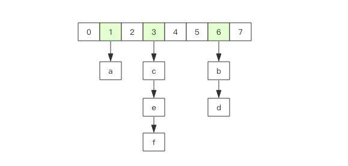
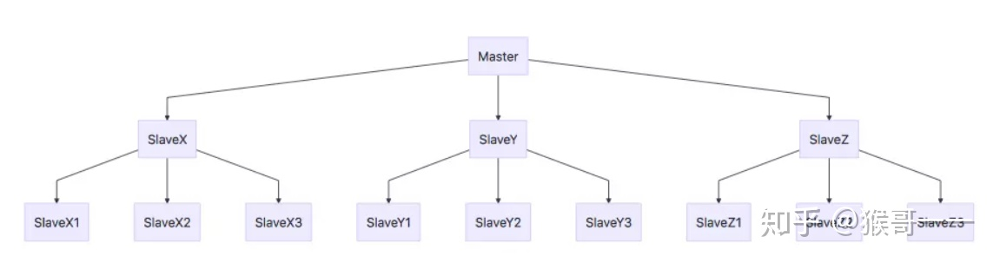
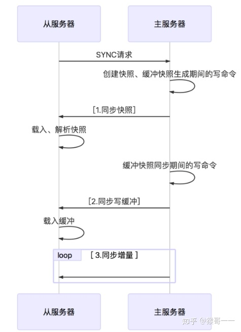
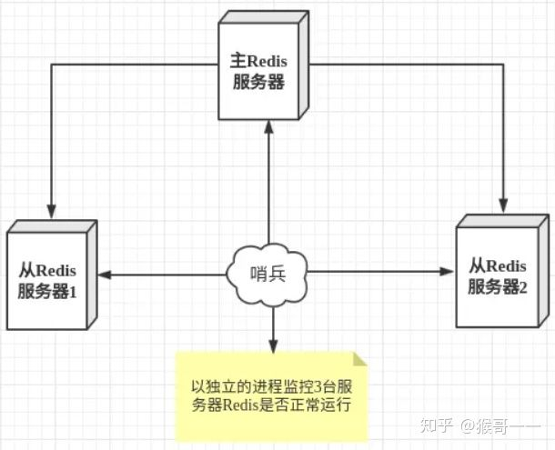
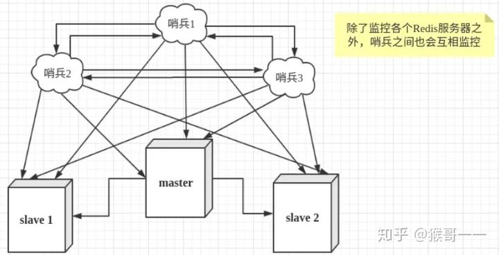

# █ Redis

# 一. 简介

## 1. 概述 

REmote DIctionary Server(Redis)

Salvatore Sanfilippo 写的 key-value 存储系统。

 Redis是一个开源的使用 ANSI C 语言编写、遵守 BSD协议、支持网络、可基于内存亦可持久化的日志型、Key-Value数据库，并提供多种语言的API。 

 它通常被称为数据结构服务器，因为值（value）可以是 字符串(String), 哈希(Map), 列表(list), 集合(sets) 和 有序集合(sorted sets)等类型

特点:

-  Redis支持数据的持久化，可以将内存中的数据保存在磁盘中，重启的时候可以再次加载进行使用。 
-  Redis不仅仅支持简单的key-value类型的数据，同时还提供list，set，zset，hash等数据结构的存储。
-  Redis支持数据的备份，即master-slave模式的数据备份。 

优势

- 性能极高 – Redis能读的速度是110000次/s,写的速度是81000次/s 。
- 丰富的数据类型 – Redis支持二进制案例的 Strings, Lists, Hashes, Sets 及 Ordered Sets 数据类型操作。
- 原子 – Redis的所有操作都是原子性的，意思就是要么成功执行要么失败完全不执行。单个操作是原子性的。多个操作也支持事务，即原子性，通过 `MULTI` 和 `EXEC` 指令包起来。
- 丰富的特性 – Redis还支持 publish/subscribe, 通知, key 过期等等特性。

与其他 K-V 存储的区别

- Redis有着更为复杂的数据结构并且提供对他们的原子性操作，这是一个不同于其他数据库的进化路径。
- Redis的数据类型都是基于基本数据结构的同时对程序员透明，无需进行额外的抽象。
- Redis运行在内存中但是可以持久化到磁盘，所以在对不同数据集进行高速读写时需要权衡内存，因为数据量不能大于硬件内存。在内存数据库方面的另一个优点是，相比在磁盘上相同的复杂的数据结构，在内存中操作起来非常简单，这样Redis可以做很多内部复杂性很强的事情。同时，在磁盘格式方面他们是紧凑的以追加的方式产生的，因为他们并不需要进行随机访问。

### 典型应用场景

1. 记录帖子的点赞数、评论数和点击数 (**hash**)。
2. 记录用户的帖子 ID 列表 (排序)，便于快速显示用户的帖子列表 (**zset**)。
3. 记录帖子的标题、摘要、作者和封面信息，用于列表页展示 (**hash**)。
4. 记录帖子的点赞用户 ID 列表，评论 ID 列表，用于显示和去重计数 (**zset**)。
5. 缓存近期热帖内容 (帖子内容空间占用比较大)，减少数据库压力 (**hash**)。
6. 记录帖子的相关文章 ID，根据内容推荐相关帖子 (**list**)。
7. 如果帖子 ID 是整数自增的，可以使用 Redis 来分配帖子 ID(**计数器**)。
8. 收藏集和帖子之间的关系 (**zset**)。
9. 记录热榜帖子 ID 列表，总热榜和分类热榜 (**zset**)。
10. 缓存用户行为历史，进行恶意行为过滤 (**zset,hash**)。

## 2. 安装

### 2.1. 安装

```sh
$ sudo apt-get update
$ sudo apt-get install redis
```

### 2.2. 启动服务

执行 `redis-server` 命令启动, 若不指定配置文件, 会采用默认的设置

```sh
$ redis-server
```

如果需要指定配置文件, 在命令后加上配置文件的路径即可

```sh
$ redis-server /path/to/redis.conf
```

### 2.3. 启动

```sh
$ redis-cli
```

以上命令将会打开 redis 的命令行接口, 如下显示

```sh
redis 127.0.0.1:6379>
```

其中 `127.0.0.1` 是本机 IP, `6379` 是 redis 的服务端口, 现在我们就可以在这个客户端内执行 redis 的操作

如下我们执行了 `ping` 操作, redis 返回 `PONG` 表示执行成功

```shell
redis 127.0.0.1:6379> ping
PONG
```

## 3. 配置

### 3.1. 查看配置

redis 的配置文件位于 redis 的安装目录下, 文件名为 `redis.conf`, 可以在 redis-cli 中通过 `CONFIG` 命令查看或设置配置项

```sh
redis 127.0.0.1:6379> config get 配置项的key
```

如下查看绑定主机

```shell
redis 127.0.0.1:6379> 127.0.0.1:6379> config get bind
1) "bind"
2) "127.0.0.1"
```

redis 会返回对应配置项, 分两行显示, 第一行是配置项的 key, 第二行是配置项的 value

可以使用通配符 `*` 查看所有配置项

### 3.2. 编辑配置

可以通过 `set` 修改 redis 的配置

```sh
redis 127.0.0.1:6379> config set KEY VALUE
```

如下所示

```sh
redis 127.0.0.1:6379> config set loglevel "notice"
OK
redis 127.0.0.1:6379> config get loglevel
1) "loglevel"
2) "notice"
```

具体参数说明详细: [菜鸟教程-redis配置](http://www.runoob.com/redis/redis-conf.html)

### 开放访问

打开配置文件 `/etc/redis/redis.conf` 

- `bind 127.0.0.1 ::1` 注释掉
- `protect-mode` 设为`no`


# 二. 基本操作

## 2.1. 数据类型

 redis 支持 5 种基础数据类型

1. string 可以是字符串, 整数或者浮点数
2. hash 哈希, 包含键值对的无序散列表
3. list 列表, 一个链表, 链表上每个节点包含一个字符串
4. set 集合, 包含字符串的无序收集器, 并且被包含的每个字符串都是不可重复的
5. zset 有序集合, 字符串成员与浮点数分支之间有序映射, 元素的排列顺序由对应的分值决定

#### 1) String

string 是redis最基本的类型，一个key对应一个value。

string 类型是**二进制安全**的。即可以包含任何数据。比如 jpg 图片或者序列化的对象 。

Redis 的字符串是可以修改的**动态字符串**，内部结构实现上类似于 Java 的  ArrayList，采用预分配冗余空间的方式来减少内存的频繁分配. 

当字符串长度小于 1M 时，扩容都是加倍现有的空间，如果超过  1M，扩容时一次只会多扩 1M  的空间, 最大长度为 512M。

```sh
# set key value, 设置对应key的value
127.0.0.1:6379> set name luojbin
OK

# get key, 获取对应的 value
127.0.0.1:6379> get name
"luojbin"
```

- 通过 `get`, `set` 操作单个键值对
- 通过 `mget`, `mset` 批量操作键值对
- `setex` 设置过期时间, 到期自动清除
- `setnx` 不存在才创建, 成功返回1, 失败返回0
- 若 value 是一个整数, 可以自增

#### 2) Hash

Redis hash 是一个键值对 KEY-VALUE 集合, 其中的 key 和 value 都是 string 类型, hash 特别适合用于存储对象.

与 Java HashMap 类似, 是数组+链表结构



每个 hash 可以存储**2^32^ -1 键值对（4294967295, 每个列表可存储40多亿）**。 

- 写入一个 field `hset key field value`
- 写入多个 field `hmset key field1 value1 field2 value2`
- 读取一个 field `hget key field `
- 读取多个 field `hmget key field1 field2`
- 读取全部, field/value会交替返回, `hgetall key`
- 若某个field的value 为整数, 可以计数操作 `hincrby key field 步长`

```sh
redis 127.0.0.1:6379> hmset luojbin firstName luo lastName jbin born 1990
OK
redis 127.0.0.1:6379> hget luojbin firstName
"luo"
redis 127.0.0.1:6379> hget luojbin lastName
"jbin"
redis 127.0.0.1:6379> 
```

#### 3) List

是一个双端的链表, 类似 Java 中的 `LinkedList`

Redis 列表是简单的字符串列表，按照插入顺序排序。你可以添加一个元素到列表的头部（左边）或者尾部（右边）。 

列表最多可存储**2^32^ - 1 元素 (4294967295, 每个列表可存储40多亿)**。 

- 双端操作, `lpush`/`rpush` 添加元素, `lpop`/`rpop` 弹出元素
  - 当队列用: 一端进, 另一端出, 如 `lpush` + `rpop`
  - 当栈用: 同端进出, 如 `lpush` + `lpop`
- 添加多个元素, `lpush 表名 元素1 元素2 元素3`
- 获取长度 `llen 表名`
- 获取指定范围元素, 但不移除 `lrange 表名 起始序号 结束序号`
  - 只有 `lrange`, 没有`rrange`
  - 下标从 0 开始, 如果是负数, 即表示倒数第几个 
  - 下标为负数`-a`时, redis 会按 `len-a` 计算下标
  - 只在 **结束下标>=起始下标** 时才能查询到数据
- 获取指定下标元素, `lindex n`, 遍历列表, 效率低, `O(n)`
- 截取片段, 保留指定下标范围内(闭区间)的数据 `ltrim 开始下标 结束下标`

```sh
redis 127.0.0.1:6379> lpush ljb redis
(integer) 1
redis 127.0.0.1:6379> lpush ljb mongodb
(integer) 2
redis 127.0.0.1:6379> lpush ljb rabitmq
(integer) 3
redis 127.0.0.1:6379> lrange ljb 0 10
1) "rabitmq"
2) "mongodb"
3) "redis"
redis 127.0.0.1:6379>
```

#### 4) Set

Redis的Set是string类型的无序集合, 有去重功能的, 元素不可重复。

集合是通过哈希表实现的，所以添加，删除，查找的复杂度都是O(1)。

集合中最大的成员数为**2^32^  - 1(4294967295, 每个集合可存储40多亿个成员)**。 

- 添加元素 `sadd key item`
- 获取全部 `smembers key`
- 查询是否存在 `sismember key item`
- 获取长度 `scard key`
- 获取并弹出元素 `spop key item`

```sh
redis 127.0.0.1:6379> sadd myset redis
(integer) 1
redis 127.0.0.1:6379> sadd myset mongodb
(integer) 1
redis 127.0.0.1:6379> sadd myset rabitmq
(integer) 1
redis 127.0.0.1:6379> sadd myset rabitmq
(integer) 0
redis 127.0.0.1:6379> smembers myset
1) "redis"
2) "rabitmq"
3) "mongodb"
```

以上实例中 rabitmq 添加了两次，但根据集合内元素的唯一性，第二次插入的元素将被忽略。 

#### 5) Zset

Redis  zset 和 set 一样也是 string 类型元素的集合, 且不允许重复的成员。 

不同的是每个元素都会关联一个 double 类型的分数。redis正是通过分数来为集合中的成员进行**从小到大**的排序。

zset的成员是唯一的,但分数(score)却可以重复。

- 添加元素并指定分值 `zadd key score item`
- 获取指定排名区间的元素(升序) `zrange key 开始名次 结束名次`
- 获取指定排名区间的元素(降序) `zrevrange key 开始名次 结束名次`
- 获取指定分值区间的元素 `zrangebyscore key 开始分数 结束分数`
- 获取范围内元素时同时获取分数 `xxxx withscores`
- 获取长度 `zcard key`
- 获取指定元素的分值 `zscore key item`
- 获取指定元素的名次(升序) `zrank key item`
- 删除元素 `zrem key item`

```
redis 127.0.0.1:6379> zadd zdemo 0 redis
(integer) 1
redis 127.0.0.1:6379> zadd zdemo 0 mongodb
(integer) 1
redis 127.0.0.1:6379> zadd zdemo 0 rabitmq
(integer) 1
redis 127.0.0.1:6379> > zrangebyscore zdemo 0 1000
1) "mongodb"
2) "rabitmq"
3) "redis"
```

### 容器型数据结构规则

- 不存在就创建
- 没元素就删除, 释放空间

## 2. 基本命令

redis 可以通过命令进行操作, 要通过命令操作 redis, 需要启动一个 redis 命令客户端

### 2.1. 连接到 redis

#### 1) 访问本地 redis

> $ redis-cli

```sh
$redis-cli
redis 127.0.0.1:6379>
redis 127.0.0.1:6379> PING
PONG
```

#### 2) 访问远程 redis

> $ redis-cli -h 远程主机 -p 访问端口 访问密码

### 2.2. 基本命令

#### 1) 键命令

redis 的键命令用来管理 redis 的键

> 命令 要操作的key

```
redis 127.0.0.1:6379> SET demo redis
OK
redis 127.0.0.1:6379> DEL demo
(integer) 1
```

如上的例子, `del` 是一个命令, `demo` 是该命令要操作的key, 当命令执行成功时, 就会返回成功更改的数量`1`

| 操作     | string                                                       | list | hash                                                         | set                                                          | zset |
| -------- | ------------------------------------------------------------ | ---- | ------------------------------------------------------------ | ------------------------------------------------------------ | ---- |
| 添加元素 | [SET key value](http://www.runoob.com/redis/strings-set.html) |      | [HMSET key field1 value1 [field2 value2 \]](http://www.runoob.com/redis/hashes-hmset.html) | SADD key member1 member2                                     |      |
| 获取元素 | [GET key](http://www.runoob.com/redis/strings-get.html)      |      |                                                              |                                                              |      |
| 获取部分 | [GETRANGE key start end](http://www.runoob.com/redis/strings-getrange.html) |      |                                                              |                                                              |      |
| 获取多个 | MGET key1 [key2..\]](http://www.runoob.com/redis/strings-mget.html) |      |                                                              |                                                              |      |
| 获取全部 |                                                              |      |                                                              | [SMEMBERS key](http://www.runoob.com/redis/sets-smembers.html) |      |
|          |                                                              |      |                                                              |                                                              |      |
|          |                                                              |      |                                                              |                                                              |      |
|          |                                                              |      |                                                              |                                                              |      |
|          |                                                              |      |                                                              |                                                              |      |


# 三. 高级教程

分数据库

redis 允许将不同的数据存放到不同的数据空间, 这样就可以实现不同应用的数据互不干扰.

redis 默认允许16 个数据空间(即 16 个数据库), 默认连接到 0 号库, 可以通过 `select n` 切换到第 n 号空间

> select n

也可以自定义数据库总数, 通过 `config` 修改 `databases` 修改使用的数据库数量

当要清空一个数据库时, 可以执行以下命令

> flushdb

如果要清空整个 redis 的存储, 可以使用`flushall`, 但这个操作要谨慎使用

> flushall

# 四.操作

## 连接池

## 与 spring 整合

## 事务

## 分库

## 安全控制

# 五. redis 实战

## 1. 排行榜功能

## 2. 用户登录管理

### 2.1. 登录状态与 cookie

http 请求是无状态的, 即服务器本身不会记录与过往请求有关的信息, 为了保留用户会话, 比如记录登录信息, 常需要使用 cookie 来记录用户的身份. cookie 由少量数据组成, 网站回要求浏览器存储这些数据, 并在每次服务发送请求时将这些数据传回给服务器. 

对于用来登录的 cookie, 由两种产检的方法可以将登录信息存储再 cookie 里面:

- 签名cookie

  通常会存储用户名, 可能还会有用户 id, 用户最后一次成功登录的时间, 以及网站需要的一些信息. 除了用户信息外, 签名 cookie 还包含一个签名, 服务器通过这个签名来验证浏览器发送的消息是否未经改动. 比如修改登录用户名等

- 令牌 cookie

  会在 cookie 里面存储一串随机字符串作为令牌, 服务器根据令牌再数据库中查找令牌的拥有者. 随着时间的推移, 旧令牌会被新令牌取代


# █ Redis 集群

redis 支持[三种集群模式](https://zhuanlan.zhihu.com/p/145186839) 

- 主从复制模式, 每个节点存储所有数据, 若主节点挂了, 需要手动指定新的主节点
- sentinel 哨兵模式, 自动化的主从模式, 若主节点挂了, 哨兵会自动选出一个新的主节点, 保证高可用
- cluster 分布式, 将数据分布到不同节点中, 提高读写性能

实际上, 通常会将 cluster 和 sentinel 模式一起使用, 以提供更好的读写性能并保证高可用

# 一. 主从复制

## 1. 概述





## 2. 部署

基本配置

```shell
# redis.conf 设置后台运行
daemonize yes
```

各节点配置

```nginx
# redis6379.conf    master
include /etc/redis/redis.conf
pidfile /var/run/redis_6379.pid
port    6379
dbfilename dump6379.rdb
logfile "my-redis-6379.log"

# redis6380.conf    slave1
include /etc/redis/redis.conf
pidfile /var/run/redis_6380.pid
port    6380
dbfilename dump6380.rdb
logfile "my-redis-6380.log"
# 最后一行设置了主节点的 ip 端口
replicaof 127.0.0.1 6379

# redis6381.conf    slave2
include /etc/redis/redis.conf
pidfile /var/run/redis_6381.pid
port    6381
dbfilename dump6381.rdb
logfile "my-redis-6381.log"
# 最后一行设置了主节点的 ip 端口
replicaof 127.0.0.1 6379
```

启动各个节点

```shell
# 顺序启动节点
$ redis-server redis6379.conf
$ redis-server redis6380.conf
$ redis-server redis6381.conf
```

# 二. sentinel 哨兵

## 1. 概述





## 2. 部署

先要安装 `redis-sentinel` 组件

```shell
sudo apt install redis-sentinel
```

安装完成后, 可以在 `/etc/redis/sentinel.conf` 看到默认的配置文件

为了演示方便,我们这里使用同一机器上, 通过不同的配置文件启动多个 sentinel 进程, 配置文件如下, 仅端口不同

```shell
# sentinel1.conf
port 26379
sentinel monitor mymaster 127.0.0.1 6379 1

# sentinel2.conf
port 26380
sentinel monitor mymaster 127.0.0.1 6379 1

# sentinel3.conf
port 26381
sentinel monitor mymaster 127.0.0.1 6379 1
```

启动哨兵

```shell
$ redis-sentinel sentinel1.conf
$ redis-sentinel sentinel2.conf
$ redis-sentinel sentinel3.conf
```

## 3. 测试

在redis 主节点中, 通过 `shutdown` 结束进程, 观察哨兵进程的输出, 可以看到哨兵选出了新的主节点

即使我们把原 master 节点恢复运行， 它也只是 slave 身份了存在了

# 三. cluster 分布式

## 1. 概述


官方推荐至少使用3台以上的 master 节点，且每个 master 都应该有slave, 即需要3主3从共六个节点


## 2. 部署

# 四. sentinel + cluster

## 1. 概述

## 2. 部署

# 五. springboot 集成
