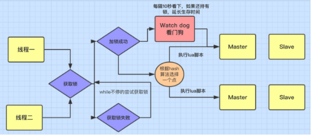
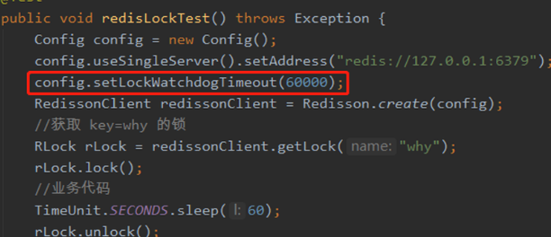

# 背景

据Redisson官网的介绍，Redisson是一个Java Redis客户端，与Spring 提供给我们的 RedisTemplate 工具没有本质的区别，可以把它看做是一个功能更强大的客户端（虽然官网上声称Redisson不只是一个Java Redis客户端）

强烈推荐下阅读redisson的中文官网
我想我们用到 Redisson 最多的场景一定是分布式锁，一个基础的分布式锁具有三个特性：

互斥：在分布式高并发的条件下，需要保证，同一时刻只能有一个线程获得锁，这是最最基本的一点。

防止死锁：在分布式高并发的条件下，比如有个线程获得锁的同时，还没有来得及去释放锁，就因为系统故障或者其它原因使它无法执行释放锁的命令,导致其它线程都无法获得锁，造成死锁。

可重入：我们知道ReentrantLock是可重入锁，那它的特点就是同一个线程可以重复拿到同一个资源的锁。
实现的方案有很多，这里，就以我们平时在网上常看到的redis分布式锁方案为例，来对比看看 Redisson 提供的分布式锁有什么高级的地方。

普通的 Redis 分布式锁的缺陷

我们在网上看到的redis分布式锁的工具方法，大都满足互斥、防止死锁的特性，有些工具方法会满足可重入特性。

如果只满足上述3种特性会有哪些隐患呢？redis分布式锁无法自动续期，比如，一个锁设置了1分钟超时释放，如果拿到这个锁的线程在一分钟内没有执行完毕，那么这个锁就会被其他线程拿到，可能会导致严重的线上问题，我已经在秒杀系统故障排查文章中，看到好多因为这个缺陷导致的超卖了。

# Redisson 提供的分布式锁



# watch dog 的自动延期机制

Redisson 锁的加锁机制如上图所示，线程去获取锁，获取成功则执行lua脚本，保存数据到redis数据库。

如果获取失败: 一直通过while循环尝试获取锁(可自定义等待时间，超时后返回失败)，获取成功后，执行lua脚本，保存数据到redis数据库。

Redisson提供的分布式锁是支持锁自动续期的，也就是说，如果线程仍旧没有执行完，那么redisson会自动给redis中的目标key延长超时时间，这在Redisson中称之为 Watch Dog 机制。

同时 redisson 还有公平锁、读写锁的实现。

使用样例如下，附有方法的详细机制释义

```java
private void redissonDoc() throws InterruptedException {
    //1. 普通的可重入锁
    RLock lock = redissonClient.getLock("generalLock");

    // 拿锁失败时会不停的重试
    // 具有Watch Dog 自动延期机制 默认续30s 每隔30/3=10 秒续到30s
    lock.lock();

    // 尝试拿锁10s后停止重试,返回false
    // 具有Watch Dog 自动延期机制 默认续30s
    boolean res1 = lock.tryLock(10, TimeUnit.SECONDS);

    // 拿锁失败时会不停的重试
    // 没有Watch Dog ，10s后自动释放
    lock.lock(10, TimeUnit.SECONDS);

    // 尝试拿锁100s后停止重试,返回false
    // 没有Watch Dog ，10s后自动释放
    boolean res2 = lock.tryLock(100, 10, TimeUnit.SECONDS);

    //2. 公平锁 保证 Redisson 客户端线程将以其请求的顺序获得锁
    RLock fairLock = redissonClient.getFairLock("fairLock");

    //3. 读写锁 没错与JDK中ReentrantLock的读写锁效果一样
    RReadWriteLock readWriteLock = redissonClient.getReadWriteLock("readWriteLock");
    readWriteLock.readLock().lock();
    readWriteLock.writeLock().lock();
}
```

# 如何启动Redisson的看门狗机制

如果你想让Redisson启动看门狗机制，你就不能自己在获取锁的时候，定义超时释放锁的时间，无论，你是通过lock() （void lock(long leaseTime, TimeUnit unit);）还是通过tryLock获取锁，只要在参数中，不传入releastime，就会开启看门狗机制，

就是这两个方法不要用： boolean tryLock(long waitTime, long leaseTime, TimeUnit unit) throws InterruptedException

和void lock(long leaseTime, TimeUnit unit);，因为它俩都传leaseTime

> 但是，你传的leaseTime是-1，也是会开启看门狗机制的，具体在源码部分解释

# watch dog 核心源码解读

如果拿到分布式锁的节点宕机，且这个锁正好处于锁住的状态时，会出现锁死的状态，为了避免这种情况的发生，锁都会设置一个过期时间。这样也存在一个问题，加入一个线程拿到了锁设置了30s超时，在30s后这个线程还没有执行完毕，锁超时释放了，就会导致问题，**Redisson给出了自己的答案，就是 watch dog 自动延期机制**。

其实，这个例子就很容易让人误导，这个30秒不是你传的leaseTime参数为30，而是你不传leaseTime或者传-1时，Redisson配置中默认给你的30秒

我在学习redis分布式锁的时候，一直有一个疑问，就是为什么非要设置锁的超时时间，不设置不行吗？于是，我就反向思考，不设置锁超时的话，会出现什么问题？

当一个线程A在获取redis分布式锁的时候，没有设置超时时间，如果在释放锁的时候，出现了异常，那么锁就会常驻redis服务中，当另外一个线程B获取锁的时候，无论你是通过自定义的redis分布式锁setnx，还是通过Redisson实现的分布式锁的方式\*\*if (redis.call(‘exists’, KEYS[1]) == 0) \*\*，在获取锁之前，其实都有一个逻辑判断：

* 如果该锁已经存在，就是key已经存在，就不往redis中写了，也就是获取锁失败
* 那么线程B就永远不会获取到锁，自然就一直阻塞在获取锁的代码处，发生死锁
* 如果有了超时时间，异常发生了，超时的话，redis服务器自己就把key删除了，也就是锁释放了
* 这也就避免了并发下的死锁问题
* 有了这么一层逻辑，你就会明白，为什么我们不传release超时释放锁时间，Redisson也会给我们默认传一个30秒的锁超时释放时间了

Redisson提供了一个监控锁的看门狗，它的作用是在Redisson实例被关闭前，不断的延长锁的有效期，也就是说，如果一个拿到锁的线程一直没有完成逻辑，那么看门狗会帮助线程不断的延长锁超时时间，锁不会因为超时而被释放。

默认情况下，看门狗的续期时间是30s，也可以通过修改Config.lockWatchdogTimeout来另行指定。

另外Redisson 还提供了可以指定leaseTime参数的加锁方法来指定加锁的时间。超过这个时间后锁便自动解开了，不会延长锁的有效期。

```java
 // 直接使用lock无参数方法
public void lock() {
    try {
        lock(-1, null, false);
    } catch (InterruptedException e) {
        throw new IllegalStateException();
    }
}

// 进入该方法 其中leaseTime = -1
private void lock(long leaseTime, TimeUnit unit, boolean interruptibly) throws InterruptedException {
    long threadId = Thread.currentThread().getId();
    Long ttl = tryAcquire(-1, leaseTime, unit, threadId);
    // lock acquired
    if (ttl == null) {
        return;
    }

   //...
}

// 进入 tryAcquire(-1, leaseTime, unit, threadId)
private Long tryAcquire(long waitTime, long leaseTime, TimeUnit unit, long threadId) {
    return get(tryAcquireAsync(waitTime, leaseTime, unit, threadId));
}

// 进入 tryAcquireAsync
private <T> RFuture<Long> tryAcquireAsync(long waitTime, long leaseTime, TimeUnit unit, long threadId) {
    if (leaseTime != -1) {
        return tryLockInnerAsync(waitTime, leaseTime, unit, threadId, RedisCommands.EVAL_LONG);
    }
    //当leaseTime = -1 时 启动 watch dog机制
    RFuture<Long> ttlRemainingFuture = tryLockInnerAsync(waitTime,
                                            commandExecutor.getConnectionManager().getCfg().getLockWatchdogTimeout(),
                                            TimeUnit.MILLISECONDS, threadId, RedisCommands.EVAL_LONG);
    //执行完lua脚本后的回调
    ttlRemainingFuture.onComplete((ttlRemaining, e) -> {
        if (e != null) {
            return;
        }

        if (ttlRemaining == null) {
            // watch dog 
            scheduleExpirationRenewal(threadId);
        }
    });
    return ttlRemainingFuture;
}
```

从源码中可以得知，如果不传release，默认会给个-1，如果release是-1的话，通过 if (leaseTime != -1) 判断就会开启看门狗机制，这也是为啥我说，无论你是tryLock还是Lock只要不传release，就会开启看门狗机制，所以，如果你想解决由于线程执行慢或者阻塞，造成锁超时释放的问题，就不要在两个方法中传release，实际上，通过传release参数来设置超时时间，风险是比较大的，你需要清楚的知道，线程执行业务的时间，设置的过小，redis服务器就自动给你释放了。

# scheduleExpirationRenewal 方法开启监控

```java
private void scheduleExpirationRenewal(long threadId) {
    ExpirationEntry entry = new ExpirationEntry();
    //将线程放入缓存中
    ExpirationEntry oldEntry = EXPIRATION_RENEWAL_MAP.putIfAbsent(getEntryName(), entry);
    //第二次获得锁后 不会进行延期操作
    if (oldEntry != null) {
        oldEntry.addThreadId(threadId);
    } else {
        entry.addThreadId(threadId);
  
        // 第一次获得锁 延期操作
        renewExpiration();
    }
}

// 进入 renewExpiration()
private void renewExpiration() {
    ExpirationEntry ee = EXPIRATION_RENEWAL_MAP.get(getEntryName());
    //如果缓存不存在，那不再锁续期
    if (ee == null) {
        return;
    }
  
    Timeout task = commandExecutor.getConnectionManager().newTimeout(new TimerTask() {
        @Override
        public void run(Timeout timeout) throws Exception {
            ExpirationEntry ent = EXPIRATION_RENEWAL_MAP.get(getEntryName());
            if (ent == null) {
                return;
            }
            Long threadId = ent.getFirstThreadId();
            if (threadId == null) {
                return;
            }
    
            //执行lua 进行续期
            RFuture<Boolean> future = renewExpirationAsync(threadId);
            future.onComplete((res, e) -> {
                if (e != null) {
                    log.error("Can't update lock " + getName() + " expiration", e);
                    return;
                }
        
                if (res) {
                    //延期成功，继续循环操作
                    renewExpiration();
                }
            });
        }
        //每隔internalLockLeaseTime/3=10秒检查一次
    }, internalLockLeaseTime / 3, TimeUnit.MILLISECONDS);
  
    ee.setTimeout(task);
}

//lua脚本 执行包装好的lua脚本进行key续期
protected RFuture<Boolean> renewExpirationAsync(long threadId) {
    return evalWriteAsync(getName(), LongCodec.INSTANCE, RedisCommands.EVAL_BOOLEAN,
            "if (redis.call('hexists', KEYS[1], ARGV[2]) == 1) then " +
                    "redis.call('pexpire', KEYS[1], ARGV[1]); " +
                    "return 1; " +
                    "end; " +
                    "return 0;",
            Collections.singletonList(getName()),
            internalLockLeaseTime, getLockName(threadId));
}
```

关键结论
上述源码读过来我们可以记住几个关键情报：

* watch dog 在当前节点存活时每10s给分布式锁的key续期 30s；
* watch dog 机制启动，且代码中没有释放锁操作时，watch dog 会不断的给锁续期；
* 从可2得出，如果程序释放锁操作时因为异常没有被执行，那么锁无法被释放，所以释放锁操作一定要放到 finally {} 中；
* 看到3的时候，可能会有人有疑问，如果释放锁操作本身异常了，watch dog 还会不停的续期吗？下面看一下释放锁的源码，找找答案

```java
// 锁释放
public void unlock() {
    try {
        get(unlockAsync(Thread.currentThread().getId()));
    } catch (RedisException e) {
        if (e.getCause() instanceof IllegalMonitorStateException) {
            throw (IllegalMonitorStateException) e.getCause();
        } else {
            throw e;
        }
    }
}

// 进入 unlockAsync(Thread.currentThread().getId()) 方法 入参是当前线程的id
public RFuture<Void> unlockAsync(long threadId) {
    RPromise<Void> result = new RedissonPromise<Void>();
    //执行lua脚本 删除key
    RFuture<Boolean> future = unlockInnerAsync(threadId);
    //回调函数
    future.onComplete((opStatus, e) -> {
        // 无论执行lua脚本是否成功 执行cancelExpirationRenewal(threadId) 方法来删除EXPIRATION_RENEWAL_MAP中的缓存
        cancelExpirationRenewal(threadId);

        if (e != null) {
            result.tryFailure(e);
            return;
        }

        if (opStatus == null) {
            IllegalMonitorStateException cause = new IllegalMonitorStateException("attempt to unlock lock, not locked by current thread by node id: "
                    + id + " thread-id: " + threadId);
            result.tryFailure(cause);
            return;
        }

        result.trySuccess(null);
    });

    return result;
}

// 此方法会停止 watch dog 机制
void cancelExpirationRenewal(Long threadId) {
    ExpirationEntry task = EXPIRATION_RENEWAL_MAP.get(getEntryName());
    if (task == null) {
        return;
    }
  
    if (threadId != null) {
        task.removeThreadId(threadId);
    }

    if (threadId == null || task.hasNoThreads()) {
        Timeout timeout = task.getTimeout();
        if (timeout != null) {
            timeout.cancel();
        }
        EXPIRATION_RENEWAL_MAP.remove(getEntryName());
    }
}
```

释放锁的操作中 有一步操作是从 EXPIRATION_RENEWAL_MAP 中获取 ExpirationEntry 对象，然后将其remove，结合watch dog中的续期前的判断：

```java
EXPIRATION_RENEWAL_MAP.get(getEntryName());
if (ent == null) {
    return;
}
```

可以得出结论：

如果释放锁操作本身异常了，watch dog 还会不停的续期吗？不会，因为无论释放锁操作是否成功，EXPIRATION_RENEWAL_MAP中的目标 ExpirationEntry 对象已经被移除了，watch dog 通过判断后就不会继续给锁续期了。

# 关键结论

> watch dog 在当前节点存活时每10s给分布式锁的key续期 30s；
> 可以修该watchDog设置的30秒的时间,这也是我推荐的不传releas，设置锁超时的方式



* watch dog 机制启动，且代码中没有释放锁操作时，watch dog 会不断的给锁续期；
* 如果程序释放锁操作时因为异常没有被执行，那么锁无法被释放，所以释放锁操作一定要放到 finally {} 中；
* 要使 watchLog机制生效 。只要不穿leaseTime即可
* watchlog的延时时间 可以由 lockWatchdogTimeout指定默认延时时间，但是不要设置太小。如100
* watchdog 会每 lockWatchdogTimeout/3时间，去延时。
* watchdog 通过 类似netty的 Future功能来实现异步延时
* watchdog 最终还是通过 lua脚本来进行延时
