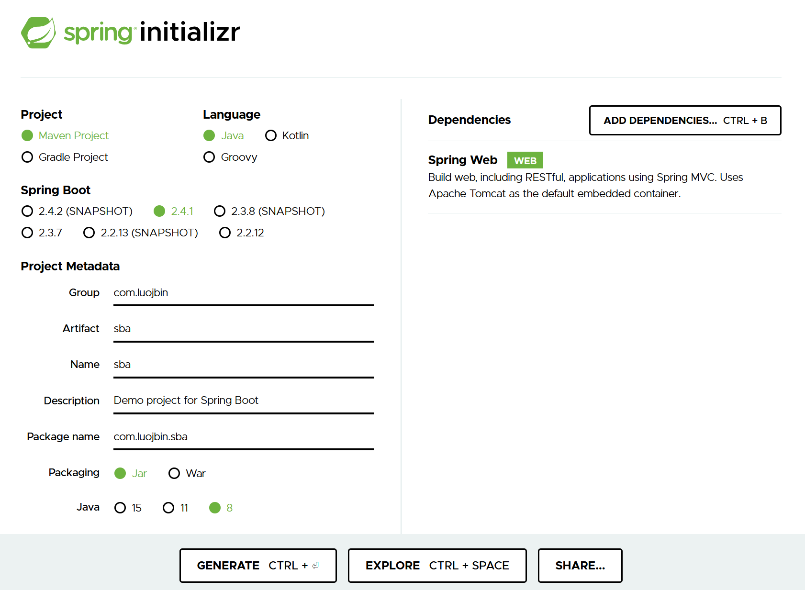
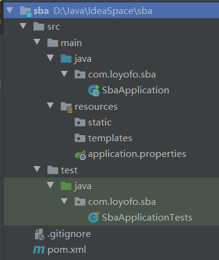
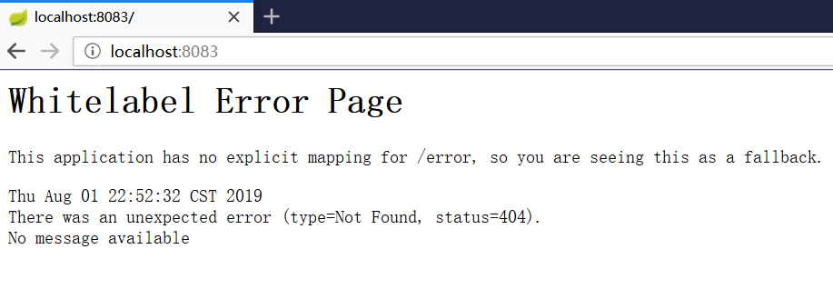
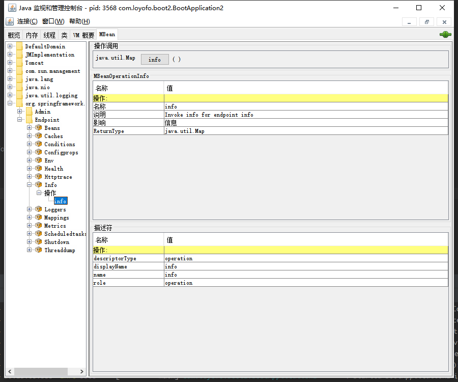

# █ Spring Boot

# 一. Spring Boot 概览

## 1. 概述

与逐渐流行的动态语言相比, Java EE 的开发过程非常笨重, 配置复杂, 开发效率地下, 复杂的部署流程以及第三方技术集成难度大.

springboot 是 spring 系列最新的框架, springboot 的目标不在于为已解决的问题提供新的解决方案, 而是带来一种全新的开发体验, 简化对这些已有技术的使用.

从本质上说, Spring Boot 就是 Spring, 只是借助 **Spring 4 的条件化配置**特性, 以及 Maven/Gradle 提供的**传递依赖**解析, 以此实现了 Spring 应用程序上下文的自动配置, 完成了那些在传统 Spring 应用中由应用开发者自己完成的各种 Bean 样板配置. 借助 Spring Boot , 只需要很少的代码和配置, 即可构建一个可用的应用.

springboot 的 web 模块内置了 tomcat, 构建的 fat jar 包可以通过 `java -jar XX.jar` 一键启动, 这种特性非常契合微服务的概念, 并可以结合 spring cloud 和 docker 技术来构建微服务并部署到云端:

- 一个 jar 包就是一个独立的服务
- 很容易加载到容器, 每个服务可以在自己的容器, 如 docker 中运行
- 可以通过脚本实现配置与部署, 适合云端部署, 并且自动扩展也很容易

## 2. 核心特性

- **自动配置**

  针对很多 Spring 应用程序常见的应用功能， Spring Boot 能自动提供相关配置 

- **起步依赖**

  告诉 Spring Boot 需要什么功能，它就能引入需要的库 , 简化 maven 依赖管理, 同时避免了依赖冲突等常见的问题

- **命令行界面**

  可选功能, 借此你只需写代码就能完成完整的应用程序，无需传统项目构建 
  
- **Actuator**

  深入运行中的Spring Boot应用程序 , 上下文中的 bean, 路径映射等

## 3. Spring Initializr



## 4. 项目结构概览

新建一个 SpringBoot 应用最简单的做法就是使用 Spring Initializr, 会生成 SpringBoot 项目的基本结构.



 springboot 项目的目录结构如上图所示. 基本上是遵循传统 Maven 项目的布局. 其中几个约定的目录含义如下:

- `pom.xml`: maven 的项目对象模型, 添加springboot 起步依赖并添加编译插件
  
- `src/main/java`: 存放项目的 java 代码
  
  - `XXApplication`: Spring Boot 应用的启动类
  
    springboot 建议我们将这个启动类放置在项目的根包名下. 因为默认和包有关的注解, 默认包名都是当前类所在的包, 例如 `@ComponentScan`, `@EntityScan`, `@SpringBootApplication` 注解, 这些注解都是按当前 `SbaApplication.java` 所在包作为扫描起始路径, 扫描当前包以及子包.
  
- `src/main/resources`: 存放项目相关资源
  
  - `static`: web 应用程序的静态内容, 图片, JavaScript 等
  - `templates`: 页面模板文件
  - `application.properties`: 项目配置文件, 也可以使用 `application.yml`
  
- `src/test/java`: 存放项目的测试代码
  
  - `XXApplicationTests`: 空的 JUnit 测试类, 用来进行集成测试

# 二. SpringBoot 开发入门

Spring Initializr 创建的项目骨架, 本质上还是一个 maven 项目, 

所以我们也可以抛开 Spring Initlializr, 从新建一个 maven 项目开始使用 SpirngBoot, 下面来看看 SpringBoot 项目都需要什么, 即 Spring Initlializr 都为我们做了什么.

## 1. 引入 springboot

#### 1) 继承 SpringBoot parent

springboot 通过继承 starter 的方式来简化项目配置, 只需要在 maven 项目中设置父 pom 为 `spring-boot-starter-parent`, 即可继承 spring 项目的基本配置, 这是引入 spring boot 最简单的方法. 

```xml
<parent>
    <groupId>org.springframework.boot</groupId>
    <artifactId>spring-boot-starter-parent</artifactId>
    <version>2.1.0.RELEASE</version>
</parent>
```

#### 2) 引入 SpringBoot 依赖

但是有时候可能项目中已经有一个父 pom 需要继承, 不能直接添加 `parent` 时, 还可以通过如下方式引入, 但使用这种方式时需要进行更多配置, 才能打包成可执行 jar:

```xml
<dependencyManagement>
    <dependencies>
        <dependency>
            <!-- 导入 spring boot 的依赖 -->
            <groupId>org.springframework.boot</groupId>
            <artifactId>spring-boot-dependencies</artifactId>
            <version>1.2.3.RELEASE</version>
            <type>pom</type>
            <!-- 这个地方需要声明 import -->
            <scope>import</scope>
        </dependency>
    </dependencies>
</dependencyManagement>
```

#### 3) 添加 starter 起步依赖

起步依赖其实就是特殊的 Maven 依赖和 Gradle 依赖，利用了传递依赖解析，把常用库聚合在一起，组成了几个为特定功能而定制的依赖。

spring boot 提供了一系列的 starter, 已经对一些功能性的 jar 包进行了集成. 通过引入这些 starter, 就能方便地引入相应地依赖, 并且由于 `spring-boot-starter-parent` 和 `spring-boot-dependencies` 中已经预设了大量常用依赖的版本号, 不需开发者去手动管理依赖 jar 包的版本.

```xml
<dependencies>
    <dependency>
        <groupId>org.springframework.boot</groupId>
        <artifactId>spring-boot-starter-web</artifactId>
    </dependency>

    <dependency>
        <groupId>org.springframework.boot</groupId>
        <artifactId>spring-boot-starter-test</artifactId>
        <scope>test</scope>
    </dependency>
</dependencies>
```

传统的 spring 项目, 开发前我们需要为项目添加依赖, 指定各个依赖的 GAV 坐标. 但是, 记住所需依赖的 GAV 坐标很麻烦, 并且很难保证彼此之间兼容不冲突. 

Spring Boot 的起步依赖就是为了解决依赖管理问题而存在. 开发者只需要选择自己需要的功能, 起步依赖就能自动选择需要的依赖, 并确保兼容不冲突. 

Spring Boot起步依赖基本都以`spring-boot-starter`打头，随后是直接代表其功能的名字. 起步依赖本质上是一个Maven项目对象模型（Project Object Model， POM），定义了对其他库的传递依赖，这些东西加在一起即支持某项功能。 

引入起步依赖时, 不需要指定版本号, 其版本号是由 Spring Boot 版本决定的, 选择需要的 Spring Boot 版本, 就决定了以起步依赖引入的一系列依赖的版本. Spring Boot 已经对这些依赖进行了充分测试, 确保兼容. 这对开发者而言是一种解脱, 无需关心项目需要维护哪些依赖库, 也不必担心其版本. 

如果需要手动指定某些依赖的版本, 或是排除某些传递依赖, 只需像传统的 Maven 项目一样, 在 pom 中显式声明所需版本号, 或添加 `exclusions` 元素排除.

#### 4) 构建插件

spring Boot 为 maven 和 gradle 提供了构建插件, 其主要功能有以下几个:

- **直接运行**: 通过构建插件的 `spring-boot:run ` 目标, 直接运行 spring boot 项目
- **构建超级jar**: 把项目打包成一个可执行的超级 JAR, 包括应用的所有依赖.
- **热部署**: 开发过程中避免重复启动项目, 修改立即生效

spring boot 需要将项目打包成一个可执行的 fat jar, 与 maven 默认的打包行为有所区别. 因此需要添加 `spring-boot-maven-plugin` 插件.

```xml
<build>
    <plugins>
        <plugin>
            <groupId>org.springframework.boot</groupId>
            <artifactId>spring-boot-maven-plugin</artifactId>
        </plugin>
    </plugins>
</build>
```

如果不是直接继承 `spring-boot-starter-parent`, 而是使用 `spring-boot-dependencies` 添加的 springboot 依赖, 还需要显式指定目标为 `repackage`.

在开发过程中，我们需要经常修改，为了避免重复启动项目, 可以利用这个插件实现热部署, 需要在插件下再添加一个 `springloaded` 的依赖

```xml
<build>
    <plugins>
        <plugin>
            <groupId>org.springframework.boot</groupId>
            <artifactId>spring-boot-maven-plugin</artifactId>
            <!-- 如果未继承 spring-boot-starter-parent, 需要指定 goal 为 repackage -->
            <executions>
                <execution>
                    <goals>
                        <goal>repackage</goal>
                    </goals>
                </execution>
            </executions>
            <!-- 如果希望开发过程中 springboot 支持热部署, 可以添加 springloaded 的依赖 -->
            <dependencies>
                <dependency>
                    <groupId>org.springframework</groupId>
                    <artifactId>springloaded</artifactId>
                    <version>1.2.8.RELEASE</version>
                </dependency>
            </dependencies>
        </plugin>
    </plugins>
</build>
```

添加 `springloaded` 后, 通过 `mvn spring-boot:run` 启动项目就支持了热部署. idea 默认关闭自动编译, 可以在需要时 ctrl+f9 手动编译, 即可完成热部署

## 2. 启动类

```java
@SpringBootApplication
public class SbaApplication {
    public static void main(String[] args) {
        SpringApplication.run(SbaApplication.class, args);
    }
}
```

启动类有两个作用, 配置和启动引导:

### 1.1. 配置注解

作为主要的配置类, `@SpringBootApplication` 注解开启了 Spring 的组件扫描和 Spring Boot 的自动配置功能, 实际上它是一个组合注解, 包括以下三个部分:

- Spring 的 `@ComponentScan`, 基于当前类的包, 启用组件扫描
- Spring 的 `@Configuration`, 声明这是一个配置类, 会提供一些基于 Java 的配置
- Spring Boot 的 `@EnableAutoConfiguration`, 启用自动配置,  `exclude` 属性可以禁用不想要自动配置

通常情况下, 启动类只会使用一些 `@EnableXXX` 的使能类注解, 如果需要添加其他具体配置, 建议使用一个单独的 `@Configuration ` 的配置类, 组件扫描将会发现并使用这些配置类.

### 1.2. main 方法

作为启动类, 它提供了一个 `main` 方法作为程序的入口, 它允许我们将 springboot 应用以可执行 jar 包来启动, 可以用以下三种方式:

1. 使用 `SpringApplication.run()`

   ```java
   public static void main(String[] args) {
       // SpringApplication 类提供了一个静态方法, 只需将当前类以及启动参数传入即可
       SpringApplication.run(Application.class, args);
   }
   ```

2. 构造当前应用的实例并添加配置, 然后启动

   ```java
   public static void main(String[] args) {
       // 构造当前应用的实例, 可以在应用启动前进行一些必要的设置, 如添加默认启动参数等
       SpringApplication application = new SpringApplication(Application.class);
       application.setBannerMode(Banner.Mode.OFF);
       application.run();
   } 
   ```

3. 通过 builder 创建应用实例并启动

   ```java
   public static void main(String[] args) {
       // 通过 builder 构造当前应用对象, 与方法2类似, 可以在启动前进行一些必要的设置
       new SpringApplicationBuilder()
           .bannerMode(Banner.Mode.OFF)
           .sources(Application.class)
           .run(args);
   }
   ```

##  3. 配置属性

Spring Boot 通过一个 `properties` 文件或 `yaml` 文件来配置应用属性.

根据约定大于配置的原则, 开发者不需显示指定配置文件的路径, spring boot 默认会在`classpath/` 或 `classpath/config` 中查找配置文件(`properties` 或 `yaml`), 我们可以在 `application.properties` 文件中对 spring boot 应用进行一些配置:

```properties
# 设置服务器监听端口
server.port=8001
```

## 4. 测试类

Spring Boot 默认提供了一个测试类的骨架, 可以基于它为应用程序编写测试. 

同时它还是一个例子, 告诉开发者如何为 Spring Boot 应用编写测试. 

```java
@RunWith(SpringRunner.class)
@SpringBootTest
public class SbaApplicationTests {
    @Test
    public void contextLoads() {
    }
}
```

`@RunWith`

`@SpringBootTest`

`contextLoads()` 这是一个空的测试方法, 可以用来测试 spring Boot 项目配置是否正确, 项目能否正常启动并加载应用上下文. 

由于 springboot 2.2.x 以上版本中, 将 junit 从 4.1.2 升级为 junit jupiter, 因此测试类写法也有所不同

```Java
@SpringBootTest
class DemoApplicationTests {
    @Test
    void contextLoads() {
    }
}
```

新的测试类采用 Junit Jupiter 的写法, 不再需要 `@RunWith(SpringRunner.class)`.

## 5. 编写业务逻辑

有了上面4部分内容, 就搭建起 springboot 项目的骨架, 已经可以直接运行 `main` 方法, 将 springboot 应用跑起来了, 但此时的应用不能处理任何工作.

为了解决实际业务问题, 我们需要在 springboot 骨架之上编写我们的业务逻辑. 

下面是一个简单的 controller 示例:

```java
@RestController
@RequestMapping("hello")
public class HelloController {
    @GetMapping("world/{name}")
    public User helloUser(@PathVariable("name") String name) {
        User u = new User();
        u.setName(name);
        u.setAge(18);
        return u;
    }

    static class User {
        private String name;
        private Integer age;
        // getter/setter 等方法略
    }
}
```

在 springboot 项目中编写业务代码, 与在传统 spring 应用开发完全一样, 接下来, 请开始你的表演!

# 三. 自定义配置

在向应用程序引入 Spring Boot 时，有个名为 `spring-boot-autoconfigure` 的 JAR，其中包含了很多带有**条件注解**的配置类. 在应用的启动过程中, spring boot 会检测相关条件是否满足, 然后根据实际情况, 动态决定需要配置什么内容. 

虽然 spring boot 的自动配置非常方便, 但有时候默认配置可能不完全符合实际需求, 开发者可能会希望对应用进行一些自定义的配置.

## 1. 显式配置

想要覆盖 spring boot 的自动配置非常简单, 就当自动配置不存在, 直接显式编写一段自定义的配置即可. 可以用不同的方式声明配置, java/xml/groovy 形式均可. 

spring boot 自带了很多的配置类, 而这些配置类上, `@ConditionalOnMissingBean` 条件注解是覆盖自动配置的关键. 

如 `jdbcTemplate()` 方法, `@ConditionalOnMissingBean` 要求当前不存在 `JdbcOperations` 的 bean 时才会生效. 

```java
@Bean
@Primary
@ConditionalOnMissingBean(JdbcOperations.class)
public JdbcTemplate jdbcTemplate() {
    JdbcTemplate jdbcTemplate = new JdbcTemplate(this.dataSource);
    ...
    return jdbcTemplate;
}
```

Spring Boot 的设计是先加载应用级配置(即用户的显式配置)，随后再考虑自动配置类 .若开发者在自己的配置文件中配置了一个 `JdbcOperations` , 则 spring boot 不会执行自动配置的 `jdbcTemplate()` 方法, 即忽略自动配置 jdbcTemplate bean.

**注**: 在某些情况下, 可能会由于条件冲突而导致需要的 bean 未被正常配置. 

比如, 默认情况下 springboot 会配置 `dataSourceTransactionManager` (*beanId = transactionManager*) 作为事务管理器, 但当系统内有其他的事务管理器 (如`JmsTransactionManager`) 时, spring 就不再自动配置  dataSourceTransactionManager, 需要手动显式声明 dsTransactionManager 的 bean

## 2. 通过属性修改配置

虽然 spring boot 的 `@ConditionalOnMissingBean` 允许我们显式覆盖自动配置, 但很多时候我们不必这么麻烦. 如果只是修改某些具体参数, 而不是彻底放弃指定类型的 bean, spring boot 允许开发者通过外部属性对自动配置的 bean 进行配置. 

spring boot 提供了300多个可自定义的属性[(详见官方文档)](https://docs.spring.io/spring-boot/docs/current/reference/html/appendix-application-properties.html), 需要修改时, 只需在环境变量, java 系统属性, jndi, 命令行参数, 或者属性文件里进行指定就好了. 

### 2.1. 配置属性的位置

spring boot 允许通过方式设置属性参数, 按优先级排列如下, 高优先级的属性会覆盖低优先级的:

1. 命令行参数, 格式为`--参数名=值`

   ```shell
   # 将内置 tomcat 的监听端口设为 8100
   java -jar app.jar --server.port=8100
   ```

   如果在配置文件中使用属性占位符`${参数名:默认值}`, 则可以使用自定义的属性来设置, 

   ```shell
   # 在 application.properties 中使用属性占位符 port, 并指定默认值为 8100
   severt.port=${port:8100}
   
   # 则在命令行中可以使用自定义的属性 port 来配置参数
   java -jar demo.jar --port=8101
   ```

2. 来自`java:comp/env`的`JNDI`属性

3. Java系统属性`System.getProperties()`

4. 操作系统环境变量

5. `RandomValuePropertySource`配置的`random.*`属性值

6. `application.yml`或`application.properties`配置文件, 其中

   - `profile` 配置 > 非 `profile` 配置
   - 外部`/config` > 外部`/` > 内部`classpath/config`> 内部`classpath`
   - `.properties` > `.yml` 

7. `@Configuration`注解类上的`@PropertySource`

8. 通过`SpringApplication.setDefaultProperties`指定的默认属性

   ```java
   public static void main(String[] args) {
       Map<String, Object> defaultMap = new HashMap<>();
       defaultMap.put("server.port", "8103");
   
       SpringApplication application = new SpringApplication(Application.class);
       application.setDefaultProperties(defaultMap);
       application.run();
   }
   ```

### 2.2. 常用配置属性

#### 1) 模板缓存

Thymeleaf, FreeMarker, Groovy, velocity 等页面模板技术, 默认情况下都开启了模板缓存, 在生产环境下可以提高性能, 但在开发环境下不能及时看见更改. 为此, 可以在开发环境下关闭模板缓存, 可以将以下属性设置设为 `false`

- spring.thymeleaf.cache
- spring.freemarker.cache
- spring.groovy.template.cache
- spring.velocity.cache

#### 2) 嵌入式服务器

spring boot 的 web 应用默认嵌入了一个 tomcat, 使用 8080 端口. 如果需要对这个嵌入的 tomcat 进行配置, 可以修改以下属性

- server.port , 设置嵌入式服务器的端口
- server.ssl.key-store, 设置 https 密钥文件路径
- server.ssl.key-store-password , https 密钥文件密码
- server.ssl.key-password , https 密钥文件密码

#### 3) 日志记录

大多数应用程序都提供了某种形式的日志, 即使应用程序没有直接记录日志, 依赖的库可能也会记录它们的活动. 

默认情况下, Spring Boot 使用 `Slf4j` + `LogBack` 记录日志, 并采用 `INFO` 级别输出到控制台. 

*如果需要使用其他日志框架, 需要显式引入需要的日志框架, 并在起步依赖里排除 `spring-boot-starter-logging`* 

开发者对日志记录最常做的修改就是修改日志级别和指定日志文件路径, 使用 spring boot 的配置属性, 可以修改常用的日志配置. 

```yml
logging:
	path: /var/logs/
	file: myapp.log
	config:
		classpath: logging-config.xml
	level:
		root: WARN
		org.springframework.security: DEBUG
```

如上例所示

- `logging.path`, 指定日志文件路径
- `logging.file`, 指定日志文件文件名
- `logging.level.{logger名}`, 指定 logger 的日志级别
- `logging.config.classpath`, 指定日志配置文件名, 这在不同环境使用不同日志配置时很有用

要完全控制 logback 配置, 可以在 classpath 下添加一个 `logback.xml` 的配置文件, 具体配置方式参考 logback 相关文档. 而且 spring boot 对 logback 进行了扩展, 建议使用 `logback-spring.xml`, 以便充分利用 spring 对 logback 的增强配置. 

#### 4) 数据源

开发时可以使用 H2 嵌入式数据库, 但在生产环境, 通常会使用 mysql 或 oracle 等外部数据库

```yaml
spring:
	datasource:
		type: com.zaxxer.hikari.HikariDataSource
		driver-class-name: com.mysql.jdbc.Driver
		url: jdbc:mysql://localhost/test
		username: dbuser
		password: dbpass
```

不通过 `spring.datasource.type` 指定数据源连接池时, spring 按照以下顺序在 classpath 下寻找合适的连接池. 其中 HikariCP 是 spring Boot 默认引入的依赖, 而 tomcat 需要手动添加, 因此通常情况下, spring boot 项目默认使用 HIkariCP 作为数据源连接池. 

- tomcat
- HikariCP
- DBCP 2

通常无需指定 JDBC 驱动, spring boot 会根据数据库 URL 识别出需要的驱动, 但是如果识别结果不满足需要, 可以通过 `spring.datasource.driver-class-name ` 指定.

Spring Boot 还支持通过 `spring.datasource.jndi-name ` 在 jndi 中获取数据源, 一旦指定该属性, 其他的数据源连接属性都会被忽略. 

#### 5) 自定义属性

应用程序中常常需要设置一些不宜硬编码的变量, spring boot 允许在配置文件中添加自定义属性作为变量的值, 以便在程序启动时自动注入. 

Spring Boot的属性解析器非常智能，它允许使用不同的命名风格, 小驼峰/连字符/下划线等命名方式都是等效的, 通常情况下可以自由选择自己喜欢的命名风格. 

但有个别的属性, 可能会作为 map 中的 key, 这种情况下必须使用指定的命名风格( 如 spring cloud eureka 的 `defaultZone` 必须使用小驼峰式).

1. 定义一个类, 包含需要的属性作为实例域, 并提供 set 方法

2. 添加 `@ConfigurationProperties` 注解, 通过 `prefix` 指定需要的配置属性前缀

   ```java
   @ConfigurationProperties(prefix="myapp")
   public class MyProperties {
       private String value;
   
       public void setValue(String value) {
           this.value = value;
       }
   }
   ```

3. 在 `application.properties`文件中添加 `myapp.value` 属性

   ```properties
   myapp.value=自定义的属性
   ```

4. 启用配置属性. 从技术上说, `@ConfigurationProperties` 默认不会生效, 它依赖于 `@EnableConfigurationProperties` 注解, 只有添加该注解后, 属性注入才会生效. 但实际上, spring boot 的自动配置类中已经提供了该注解, 因此应用开发者不需要自行显式添加 `@EnableConfigurationProperties`

## 3. profile

将应用部署到不同的运行环境时, 一些具体的配置参数通常会有所不同. 

spring 3 开始支持通过指定不同的 profile 来为不同环境指定配置. profile 是一种条件化配置, 基于运行时激活的 profile, 会使用或忽略不同的 Bean 或配置类.

`spring.profiles.active` 属性用来激活指定的 profile, 可以通过任意一种设置属性的方式选择需要的 profile. 如 jvm 参数, 环境变量,  `application.properties` 或 `application.yml`等.

为了在激活指定 profile 时使得指定配置内容生效, 就需要为每个环境分别创建配置. 可以采用以下几种方式

### 3.1. @Profile 注解

可以在 `@Configuration` 配置类或 `@Bean` 方法上使用 `@Profile` 注解, 通过其 `value` 属性指定需要的 profile. 当注解指定的 profile 被激活时, 该配置生效. 否则被忽略.

如下代码所示, 在激活不同 profile 时, 创建不同的 DataSource bean.

```java
@Profile("mysql")
@Bean
public DataSource mysqlDs() {...}

@Profile("h2")
@Bean
public DataSource h2Ds() {...}
```

### 3.2. properties 文件

如果选择使用 `application.properties` 文件为 spring boot 指定配置属性, 可以创建额外的属性文件, 文件名为 `applicati-{profile}.properties`, 在不同的 properties 文件中提供特定的属性值, 这些属性会在激活对应的 profile 时使用.

而对于不特定于某个 profile, 或是所有环境共用的配置内容, 则可以继续放在原来的 `application.properties` 文件中.  

即应用可能会拥有这样多个 properties 文件:

- application.properties, 通用的配置内容
- application-**dev**.properties, profile=dev 的配置内容, 开发环境用
- application-**test**.properties,  profile=test 的配置内容,  测试环境用
- application-**prod**.properties,  profile=prod 的配置内容,  生产环境用

### 3.3. yaml 文件

如果选择使用 `application.yml` 文件的方式进行属性配置, 则可以遵循与 `properties` 文件相同的命名规则创建多个 yaml 配置文件, 如

- application.yml, 通用的配置内容
- application-**dev**.yml, profile=dev 的配置内容, 开发环境用
- application-**test**.yml, profile=test 的配置内容,  测试环境用
- application-**prod**.yml, profile=prod 的配置内容,  生产环境用

但 `yaml` 配置还提供了另外一种方式, 可以将所有 profile 的配置属性都放在同一个 `application.yml` 中. 多 profile 的 yaml 文件遵循以下规则:

- 使用三个横杠 `---` 将配置文件分成多个段
- 通用配置放在 yaml 文件的第一段
- 后续段落分别对应一个 profile, 该段的开头用 `spring.profiles` 属性声明所属的 profile
- 每个 profile 的段中定义该 profile 要使用的属性

```yaml
# 通用的配置内容
logging:
	level:
		root: INFO
---
# 开发环境专用的配置内容
spring:
	profiles: development
	
logging:
	level:
		root: DEBUG
---
# 生产环境专用的配置内容
spring:
	profiles: production
	
logging:
	path: /tmp/
	file: myapp.log
	level:
		root: WARN
```

## 4. 条件注解

如果想更加灵活地配置你的应用, 你还可以使用条件注解, 当条件满足时, 配置就会生效. 前面介绍的 `@Profile` 其实也是一个条件注解

### 4.1. springboot 的条件注解

spring boot 预设了以下条件注解, 你也可以根据自己的需要, 在配置类中使用合适的注解

| 条件注解                            | 生效条件                                                     |
| ----------------------------------- | ------------------------------------------------------------ |
| @ConditionalOn**Bean**              | 配置了某个特定Bean                                           |
| @ConditionalOn**MissingBean**       | 没有配置特定的Bean                                           |
| @ConditionalOn**Class**             | Classpath里有指定的类                                        |
| @ConditionalOn**MissingClass**      | Classpath里缺少指定的类                                      |
| @ConditionalOn**Expression**        | Spring表达式（SpEL）结果为 true                              |
| @ConditionalOn**Java**              | Java的版本匹配特定值或者一个范围值                           |
| @ConditionalOn**Jndi**              | 参数中给定的JNDI位置必须存在一个，如果没有给参数，则要有JNDI InitialContext |
| @ConditionalOn**Property**          | 指定的配置属性要有一个明确的值                               |
| @ConditionalOn**Resource**          | Classpath里有指定的资源                                      |
| @ConditionalOn**WebApplication**    | 这是一个Web应用程序                                          |
| @ConditionalOn**NotWebApplication** | 这不是一个Web应用程序                                        |

### 4.2. 自定义条件注解

如果 springboot 预设的条件注解不能满足你的需求, 你还可以开发自己的条件注解. 

只需要实现 `Condition` 接口, 覆盖 `matcher()` 方法

## 5. 自定义错误页

spring boot 默认提供一个 whitelabel 的错误页, 是自动配置的一部分. 为了让错误页面更加友好, 可以为应用指定一个自定义的错误页. 

默认情况下, Spring Boot 自动配置的默认错误处理器, 会查找名为 `error` 的视图, 如果找不到就使用默认的白标视图, 如下所示.



自定义错误页的最简方式, 就是创建一个自定义视图, 让其视图名为 `error`, 即将自定义错误页放置在 src/main/resources/templates 目录下

- Thymeleaf: src/main/resources/templates/error.html
- FreeMarker : src/main/resources/templates/error.ftl
- Velocity : src/main/resources/templates/error.vm

# 四. 测试

软件开发过程中, 良好的测试体系非常重要. 

spirng 鼓励松耦合, 接口驱动的设计, 在进行单元测试的时候, spring 通常不需要介入, 需要的依赖可以通过 mock 方式创建. 

但是, 集成测试需要用到 Spring, 如果生产应用通过 spring 来配置并组装组件, 那么集成测试也应该借助 spring 来完成这些工作. 

## 1. 版本说明 

### 2.2.x 之前

在 2.2.x 之前的版本中, spring boot 采用 junit 4.12 作为测试框架, 基本测试类如下:

```java
@RunWith(SpringRunner.class)
@SpringBootTest
public class SbaApplicationTests {
    @Test
    public void contextLoads() {
    }
}
```

### 2.2.x - 2.3.x

而在 2.2.x - 2.3.7 的版本中, spring boot 将 junit 从 4.12 升级到了 junit jupiter, 基本测试类如下

```java
@SpringBootTest
class DemoApplicationTests {
    @Test
    void contextLoads() {
    }
}
```

但同时为了兼容旧 junit 4 的写法, `starter-test` 中还通过 `junit-vintage-engine` 提供了对 junit 4 的兼容, 此时测试类可以使用 junit 或 junit jupiter 两种注解写法

如果项目中已经使用 junit jupiter 来编写测试代码, 则可以排除 `junit-vintage-engine`.

```xml
<dependency>
    <groupId>org.springframework.boot</groupId>
    <artifactId>spring-boot-starter-test</artifactId>
    <scope>test</scope>
    <exclusions>
        <exclusion>
            <groupId>org.junit.vintage</groupId>
            <artifactId>junit-vintage-engine</artifactId>
        </exclusion>
    </exclusions>
</dependency>
```

### 2.4.x

而到了 2.4.1, springboot `starter-test` 已经取消对 junit4 的兼容, 只能使用 junit jupiter, 原来的测试代码由于缺少 junit 4 的jar 包而无法通过编译, 需要自己引入 `junit-vintage-engine` 或是修改测试代码, 使用 junit jupiter 的注解 

## 1. spring 集成测试

```java
@RunWith(SpringJUnit4ClassRunner.class)
@ContextConfiguration(classes = {RootConfig.class})
public class SpringTest {

    @Autowired
    private HelloService helloService;

    @Test
    public void testGetAll() {
        Clazz expected = new Clazz();
        expected.setClassName("终极一班");
        expected.setId(1);
        expected.setStudentAmount(5);

        Clazz actual = helloService.getClazz("1");
        Assert.assertEquals(expected, actual);
    }
}
```

以上例子关键说明如下

- `@RunWith`

  junit 提供的这个注解, 可以通过参数指定运行器, 而 spring 的`SpringJUnit4ClassRunner.class` 开启了 Spring 集成测试支持. 

  Spring 4.2 起, 可以选择基于规则的 `SpringClassRule` 和 `SpringMethodRule`. 

  Spring 4.3 起, 提供了`SpringRunner.class`, 与 `SpringJUnit4ClassRunner.class` 完全等效, 只是名字更短.

- `@ContextConfiguration`

  Spring 提供的这个注解, 可以通过参数指定应用上下文的配置文件.

  `value/location` 参数指定 xml 配置文件, `classes` 属性指定 javaconfig 配置文件. 

- junit + spring 集成测试配置完成后, 就可以按 spring 的依赖注入的方式, 通过 `@Autowired` 注入需要测试的组件, 然后在具体的测试方法中编写测试代码.

## 2. spring Boot 集成测试

虽然 `@ContextConfiguration` 可以加载 spring 应用上下文, 但是并没有加载完整的 Spring Boot 应用. Spring Boot 应用最终是由 `SpringApplication` 加载的, 它不仅加载了应用上下文, 还会开启日志, 加载外部属性, 以及其他的 Spring Boot 特性. 

为了获取完整的 Spring Boot 特性, 可以将 Spring 的 `@ContextConfiguration` 替换为 Spring Boot 提供的 `@SpringApplicationConfiguration`, 其用法与前者基本一致. 在 Spring Boot 1.4 及后续版本中, 该注解被 `@SpringBootTest` 注解取代, 因此我们采用 `@SpringBootTest` 注解来加载完整的 Spring Boot 应用.

`@SpringBootTest` 提供以下功能:

- 未使用 `@ContextConfiguration` 指定应用上下文时, 默认使用 `SpringBootContextLoader` 加载 Spring Boot 应用上下文.
- 当不使用 `@Configuration` (含组合注解), 且不使用`classes` 属性指定配置类时，自动搜索带`@SpringBootConfiguration` 注解的配置类
- 使用 `properties/value` 属性定义自定义环境属性
-  `webEnvironment` 属性指定对不同测试模式的支持, 包括能够启动一个完全运行的容器，侦听一个定义的或随机端口. 默认为 MOCK 方式, 不启动 web 容器.
- 注册用于 web 测试的 `TestRestTemplate` bean

```java
@RunWith(SpringRunner.class)
@SpringBootTest
public class BootTest {

    // 注入 srping boot 应用上下文
    @Autowired
    private WebApplicationContext webContext;
    private MockMvc mockMvc;

    // 构造 mockmvc
    @Before
    public void setupMockMvc() {
        mockMvc = MockMvcBuilders
                .webAppContextSetup(webContext)
                .build();
    }

    // mockmvc 测试
    @Test
    public void homePage() throws Exception {
        mockMvc.perform(get("/hello/hello"))
                .andExpect(status().isOk())
                .andExpect(view().name("hello2"))
                .andExpect(model().attributeExists("msg"))
                .andExpect(model().attribute("msg", "测试获取信息"));
    }
}
```

如上所示, 通过 `@SpringBootTest` 注解开启 spring boot 集成测试, 自动搜索相应的配置类加载 spring boot 应用上下文, 并使用默认的 mock 方式进行测试. 

进行 mock 测试之前, 需要将应用上下文注入, 并在 junit 的 `@Beafore` 初始化方法通过 `MockMvcBuilders` 构造一个 mockMvc 的实例, 后续的 `@Test` 方法通过这个 mockMvc 实例进行 mockMvc 测试.

**注**: *构造 mockMvc 时, 要求注入的上下文类型为 `WebApplicationContext`, 在 spring boot 1.4 以前, 需要通过 `@WebAppConfiguration` 声明, 才能保证 SpringJUnit4ClassRunner 创建的应用程序上下
文是一个 WebApplicationContext.*

*而在 1.4 及后续版本中, `@SpringBootTest` 注解的 `webEnvironment` 属性默认值为MOCK, 会在 classpath 存在 `servlet-api` 时自动创建 webApplicationContext, 故可以省略 `@WebAppConfiguration`*

## 3. spring boot 容器测试

前面的测试都是 mock 测试, 并没有像生产环境一样真正的将应用部署到 servlet 容器中. 而 Spring Boot 支持将 Tomcat 或 Jetty 等嵌入式容器作为运行中的应用程序的一部分, 从而允许通过真正的 http 请求来测试应用. 

`@SpringBootTest` 注解有一个 `webEnvironment` 属性, 通过这个属性, 就可以启动一个嵌入式的 servlet 容器, 通过真正的 http 请求来进行测试.

`webEnvironment` 有四个可选的值

- `MOCK`, 默认, 使用 web 应用上下文, 不使用嵌入式容器, 通过 mock 方式进行测试
- `NONE`, 使用普通应用上下文, 不能进行 web 测试
- `RANDOM_PORT`, 使用 web 应用上下文, 启动嵌入式容器, 在随机端口上进行真实 http 请求测试
- `DEFINED_PORT`, 使用 web 应用上下文, 启动嵌入式容器, 在指定端口上进行真实 http 请求测试

如果需要启动嵌入式容器 tomcat, 只需要将 `webEnvironment`  修改为 `DEFINED_PORT` 即可, 其端口为 `server.port` 属性指定的值, 若未指定则使用 tomcat 默认端口 8080.

```java
@RunWith(SpringRunner.class)
@SpringBootTest(webEnvironment = SpringBootTest.WebEnvironment.DEFINED_PORT)
public class BootTest {
    @Test(expected = HttpClientErrorException.class)
    public void pageNotFound() {
        try {
            RestTemplate rest = new RestTemplate();
            rest.getForObject(
                "http://localhost:8083/noPage", String.class);
            Assert.fail("Should result in HTTP 404");
        } catch (HttpClientErrorException e) {
            Assert.assertEquals(HttpStatus.NOT_FOUND, e.getStatusCode());
            throw e;
        }
    }
}
```

若需要使用随机端口, 则将 `webEnvironment`  修改为 `RANDOM_PORT`, 并在测试类中注入该端口. 为了方便, spring 提供了 `local.server.port` 属性, 值为 servler 容器当前使用的端口.

然后在发起请求时, 指定占位符`{port}`, 并提供具体参数

```java
@RunWith(SpringRunner.class)
@SpringBootTest(webEnvironment = SpringBootTest.WebEnvironment.RANDOM_PORT)
public class RandomTomcatTest {

    // 注入当前容器端口
    @Value("${local.server.port}")
    private int port;

    @Test(expected = HttpClientErrorException.class)
    public void pageNotFound() {
        try {
            System.out.println("当前随机端口为: " + port);
            RestTemplate rest = new RestTemplate();
            // 使用占位符{port}, 并在最后提供具体参数值
            rest.getForObject("http://localhost:{port}/noPage", String.class, port);
            Assert.fail("Should result in HTTP 404");
        } catch (HttpClientErrorException e) {
            Assert.assertEquals(HttpStatus.NOT_FOUND, e.getStatusCode());
            throw e;
        }
    }
}
```

启动容器的集成测试, 是测试 REST 端点的理想工具, 但是对于返回 html 页面的 URL, 想要判断其结果是否符合预期非常困难,  通常需要借助 `Selenium `, 详情参考相关文档, 在此不做讨论.

# 五. Actuator 监控

## 1. 启用 actuator

Spring Boot Actuator的关键特性是在应用程序里提供众多Web端点, 默认路径为`/actuator/*`，通过它们了解应用程序运行时的内部状况。

只需在项目中引入Actuator的起步依赖即可, 在应用程序运行时自动配置都会生效, Actuator会开启。

```xml
<dependency>
  <groupId>org.springframework.boot</groupId>
  <artifactId>spring-boot-starter-actuator</artifactId>
</dependency>
```

关于Spring组件扫描和自动织入，最常遭人抱怨的问题之一就是很难看到应用程序中的组件是如何装配起来的. Actuator有一些端点不仅可以显示组件映射关系，还可以告诉你自动配置在配置Spring应用程序上下文时做了哪些决策。

**注**: *spring boot 2.0以后, 默认只开启了 `info` 和 `health` 两个端点, 为了演示方便, 这里先通过修改配置项 `management.endpoints.web.exposure.include` 属性的值, 暴露 actuator 提供的所有端点*

```properties
# 为了演示方便, 这里先启用所有端点
management.endpoints.web.exposure.include=*
```

## 2. 主要端点

- `/actuator`

  列出所有可用的 actuator 端点及url

- `/actuator/info`

  获取应用程序的定制信息，这些信息由 info 打头的属性提供

- `/actuator/health`

  报告应用程序的健康指标，这些值由 HealthIndicator 的实现类提供

- `/actuator/health/{component}`

- `/actuator/health/{component}/{instance}`

- `/actuator/conditions`

  提供了一份自动配置报告，记录哪些自动配置类满足了条件得以执行, 哪些未满足条件被忽略

  - positiveMatches, 列出了所有通过的条件及具体信息

    ```json
    {
      "positiveMatches": {
        "WebEndpointAutoConfiguration.WebEndpointServletConfiguration": [
          {
            "condition": "OnWebApplicationCondition",
            "message": "found ConfigurableWebEnvironment"
          }
        ]
      }
    }
    ```

  - negativeMatches, 列出了所有未通过的条件, 多条件时还会列出通过的条件

    ```json
    {
      "negativeMatches": {
        "CloudFoundryActuatorAutoConfiguration": {
          "notMatched": [
            {
              "condition": "OnCloudPlatformCondition",
              "message": "@ConditionalOnCloudPlatform did not find CLOUD_FOUNDRY"
            }
          ],
          "matched": [
            {
              "condition": "OnWebApplicationCondition",
              "message": "found ConfigurableWebEnvironment"
            }
          ]
        }
      }
    }
    ```

  - unconditionalClasses, 列出所有未设置条件的配置类

- `/actuator/beans`

  描述应用程序上下文里全部的Bean，以及 bean 的属性和依赖

  ```json
  {
    "contexts": {
      "application": {
        "beans": {
          "helloController": {
            "aliases": [],
            "scope": "singleton",
            "type": "com.luojbin.boot.HelloController",
            "resource": "file [D:\\...\\HelloController.class]",
            "dependencies": ["helloService"]
          }
        },
        "parentId": null
      }
    }
  }
  ```

- `/actuator/mappings`

  描述全部的URI路径，以及它们和控制器（包含Actuator端点）的映射关系, 罗列出应用程序发布的全部端点, 很容易搞清楚控制器都映射到了哪些端点

- `/actuator/configprops`

  描述配置属性（包含默认值）如何注入Bean

  可以查看带有`@ConfigurationProperties` 注解的Bean的实例属性。除了展现运行中应用程序的配置属性如何设置，这个报告也能作为一个快速参考指南，告诉你有哪些属性可以设置.

- `/actuator/env`

  获取全部配置属性, 包括命令行参数, properties/yml 文件配置, 系统环境变量等

  为了避免敏感信息暴露，所有名为`password`、`secret`、`key`（或者名字中最后一段是这些）的属性的值会被星号替代

- `/actuator/env/{name}`

  /env端点还能用来获取单个属性的值，只需要在请求时在/env后加上属性名即可

- `/actuator/loggers` 和 `/actuator/loggers/{name}`

  列出 logger 的信息

- `/actuator/heapdump`

  导出 jvm 的堆信息

- `/actuator/threaddump`

  查看 jvm 的线程信息

- `/actuator/metrics`

  列出可用的度量信息的名字, 可以通过 `/metrics/{name}` 查看具体的值

- `/actuator/metrics/{name}`

  查看具体度量信息的详情

- `/actuator/scheduledtasks`

  提供定时任务信息

- `/actuator/httptrace`

  提供应用处理过的HTTP请求跟踪信息(时间戳、HTTP头等), 默认记录100条

- `/actuator/auditevents`

- `/actuator/caches`

- `/actuator/caches/{cache}`

## 3. 配置 actuator

### 3.1. 修改基本路径

默认情况下, 所有端点都通过 `/actuator/*` 路径访问, 可以通过 `base-url` 来修改 actuator 的端点路径

```properties
management.endpoints.web.base-path=/act
```

此时需要使用 `http://localhost:8083/act/*` 来访问 actuator 的端口

### 3.2. 端点启用与暴露

默认情况下, springboot 启用了除`shutdown`之外的所有端点, 允许通过 JMX 访问, 但仅允许通过 web 访问 `health` 端点, 详见[官方文档-暴露端点](https://docs.spring.io/spring-boot/docs/current/reference/html/actuator.html#actuator.endpoints.exposing). 

由于部分端口携带了敏感信息, 实际项目中应仔细考虑 actuator 端口的启用与暴露情况

#### 1) 启用端点

`management.endpoints.{端点名}.enable` 用来配置端点是否启用, 默认启用了除`shutdown`之外的所有端点

```properties
# 启用/停用端点, 设置 enable
management.endpoint.shutdown.enabled=true
management.endpoint.info.enabled=false
```

#### 2) 暴露端点

启用端点后, 还需要通过 `management.endpoints.(jmx|web).exposure.(include|exclude)`  设置端口的暴露情况, 才可以通过 `JMX` 或 `web` 进行访问. 默认情况下

-  jmx 暴露所有端点 (`management.endpoints.jmx.exposure.include=*`)
- web 暴露 info, health 两个端点 (`management.endpoints.web.exposure.include=info,health`)

```properties
# 暴露多个指定端点, 用逗号隔开
management.endpoints.web.exposure.include=health,info,beans

# 暴露所有端点, 用 * 表示
management.endpoints.web.exposure.include=*

# 禁止暴露所有端点, 用 * 表示
management.endpoints.web.exposure.exclude=*

# exclude 的优先级比 include 高, 可以暴露除指定端点外的所有端点
management.endpoints.web.exposure.include=*
management.endpoints.web.exposure.exclude=env
```

### 3.3. 修改端点名

可以为端点指定别名, 修改端点名后, 原端点路径不可用, 需要使用新的路径来访问

```properties
# 修改端点路径
management.endpoints.web.path-mapping.mappings=map
```

需要通过 `/actuator/新端点名` 来访问

### 3.4. 创建自定义仓库来存储跟踪数据

持久化 `/httptrace`的数据, 默认 100 条, 为了持久化

实现 `HttpTraceRepository` 接口, 并注册为 bean 即可

### 3.5. 自定义度量信息

扩展`/metrics`, [参考资料](https://www.hangge.com/blog/cache/detail_2723.html)

`/metrics`端点可以获得运行中应用程序的内部度量信息，包括内存、垃圾回收和线程信息。这些都是非常有用且信息量很大的度量值，

但你可能还想定义自己的度量，用来捕获应用程序中的特定信息, 比如想要获取某个controller 的访问次数

actuator 提供了一个 MeterRegistry 来方便开发者往 `/metrics` 端点中添加信息, 只需要在合适的地方注入 `MeterRegistry`, 然后调用其中的 `gauge()` 或 `gaugeCollectionSize()` 方法即可

```java
public class HelloController {
    @Autowired
    private MeterRegistry meterRegistry;
    static List<String> list = new ArrayList();

    @GetMapping("count/{name}")
    public List<String> count(@PathVariable("name") String name){
        list.add(name);
        // 统计集合
        meterRegistry.gaugeCollectionSize("my.metrics.count", Tags.empty(), list);
        // 提交一个值
        meterRegistry.gauge("my.metrics.last", System.currentTimeMillis());
        return list;
    }
}
```

actuator 还提供了一个工具类 `Metrics` , 提供了多个静态方法, 方便我们使用

#### 1) 计量器 Gauge

最简单的度量类型, 只有一个数值, 用来记录一些对象的瞬时值

```java
Metrics.gauge("user.test.gauge", 3);
```

#### 2) 计数器 Counter

只增不减的计数器, 用于统计请求数量, 完成的任务数等

```java
Counter userCounter = Metrics.counter("user.counter.total", "services", "demo");
userCounter.increment(1D);
```

#### 3) 计时器 Timer

可以同时测量一个特定的代码逻辑块的调用（执行）速度和它的时间分布。简单来说，就是在调用结束的时间点记录整个调用块执行的总时间，适用于测量短时间执行的事件的耗时分布，例如消息队列消息的消费速率。

```java
Timer timer = Metrics.timer("user.test.timer","timer", "timersample");
timer.record(() -> createOrder());
```

#### 4) 摘要 Summary

**Summary**（摘要）用于跟踪事件的分布。它类似于一个计时器，但更一般的情况是，它的大小并不一定是一段时间的测量值。在 **micrometer** 中，对应的类是 **DistributionSummary**，它的用法有点像 **Timer**，但是记录的值是需要直接指定，而不是通过测量一个任务的执行时间。

```java
DistributionSummary summary = Metrics.summary("user.test.summary","summary", "summarysample");
summary.record(2D);
summary.record(3D);
summary.record(4D);
```

### 3.6. 插入自定义的健康指示器

扩展`/health`

实现 `HealthIndicator` 并注册为bean, 需要配合 `management.endpoint.health.show-details` 和 `management.endpoint.health.show-components` 属性

### 3.7. 为 Actuator 添加安全验证

使用 `spring-security`

## 4. 通过 JMX 监控应用

前面说到, springboot 的端点可以通过 web 或 jmx 两种方式访问, Actuator还把它的端点以MBean的方式发布了出来，可以通过 JMX 来查看和管理. 在 java 生态圈中, 使用 jmx 监控应用或许是一个更好的做法, 可以使用 JConsole 等成熟的监控工具. 

Actuator的端点都发布在 `org.springframework.boot` 域下



大部分端点MBean只有访问操作，返回其中的某个属性，但某些特殊的端点, 如`/shutdown`, 则允许一些额外的操作

# 六. 项目启动与部署

spring boot 项目可以通过以下方式启动

- 在开发工具 IDE 中启动
- 使用 maven 插件命令 `spring-boot:run`, 在命令行里运行
- 使用 maven 生成可运行的 JAR 文件, 然后通过 `java -jar` 命令启动
- 在 spring boot CLI 在命令行中运行 groovy 脚本
- 在 Spring boot CLI 来生成 JAR 文件, 然后通过 `java -jar` 命令启动

如果希望将应用部署到更加传统的应用服务器环境里, 比如独立的 tomcat, 这时可运行的 JAR 和 spring boot CLI 都不合适, 因为应用服务器需要一个 `war` 包. 此时只需要在 maven 的 pom.xml 中将 `<packaging> ` 指定为 `war` , 然后用 `package` 命令打包即可. 

同时, 这个 war 包保留了 `main()` 方法, 说明它依旧可以通过 `java -jar` 命令启动.

使用 `spring-boot-maven-plugin` 生成可执行 jar 包后, 可以通过以下方式运行:

1. 直接启动 jar 包

   > **java -jar** xxx.jar

   这种方式启动的 jar 包, 是一个前台程序, 会占用当前的终端窗口, 并且关闭终端后应用也会停止

   适合短时间内的调试使用. 

2. 后台启动

   > java -jar xxx.jar **&**

   命令中的 `&` 表示后台启动, 应用启动后会在后台运行, 不占用终端窗口, 当前终端仍可继续执行其他命令.

   但若关闭了终端, 应用也会停止.

3. 后台启动成服务

   > **nohup** java -jar xxx.jar **&**

   `nohup` 表示不挂断的任务, 相当于将应用启动成服务, 不仅不占用当前终端, 并且当前终端关闭之后不会停止该应用. 实际生产中都是采用这种方式启动. 

4. 停止应用程序

   使用前两种方式启动的应用程序, 关闭终端即可停止, 若是通过第三种方式运行的, 则可以通过 `ps` 找到应用的 PID, 然后通过 `kill` 命令停止. 

# 七. starter 开发

我们可以简单地将starter看作是对一个组件功能粒度较大的模块化封装，包括了所需**依赖包的整合**, **基础配置**和**自动装配**等.

开发一个starter也很简单，只需要以下步骤：

1. 新建一个Maven项目，在`pom.xml`文件中定义好所需依赖；
2. 新建配置类，写好配置项和默认值，使用`@ConfigurationProperties`指明配置项前缀；
3. 新建自动装配类，使用`@Configuration`和`@Bean`来进行自动装配；
4. 新建`spring.factories`文件，用于指定自动装配类的路径；

然后将 starter 发布到仓库, 供其他项目使用即可. 

## 1. 属性配置类

用于加载配置文件中对应的配置项, 用 `@ConfigurationProperties`的 `prefix` 属性声明使用的前缀. 

配置类中也可以使用 `@Validated` 启用校验

```java
@ConfigurationProperties(prefix = "crm.kit.qichacha")
@Data
@Validated
public class QiChaChaConfigurationProperties {
    /** 是否启用企查查自动配置，默认不启用 */
    private Boolean enabled;

    /** 企查查接口服务地址 */
    @NotEmpty(message = "企查查server不能为空")
    private String server = "http://api.qichacha.com";

    /** 企查查密钥 */
    @NotEmpty(message = "企查查key不能为空")
    private String key;

    /** 企查查私钥 */
    @NotEmpty(message = "企查查secretKey不能为空")
    private String secretKey;

    /** 分页查询 - 页码，默认1 */
    private String defaultPageIndex = "1";

    /** 分页查询 - 每页大小，默认20 */
    private String defaultPageSize = "20";
}
```

## 2. 自动装配类

自动装配类, 在满足条件时, 自动创建指定的 bean, 需要使用以下注解

- `@Configuration`, 表明这是一个 spring 配置类
- `@ConditionalOnXXX`, 条件注解, 表明需要满足指定条件, 才使用该配置类进行装配
- `@EnableConfigurationProperties`, 表明需要什么配置参数, 允许传入数组

```java
@Configuration
@ConditionalOnProperty(prefix = "crm.kit.qichacha", name = "enabled", havingValue = "true")
@EnableConfigurationProperties(QiChaChaConfigurationProperties.class)
@Slf4j
public class QiChaChaAutoConfiguration {

    @Bean
    public QiChaChaAPIKit qiChaChaAPIKit(
      QiChaChaConfigurationProperties properties) {
        log.info("企查查自动配置成功");
        return new QiChaChaAPIKit(properties);
    }
}
```

## 3. spring.factories 文件

在项目的`resources`目录下新建一个`META-INF`目录，并在该目录下新建 `spring.factories` 文件.

该文件用来声明自动配置类的路径, spring boot 将会加载该文件中声明的配置类, 并根据实际情况决定是否装配.

```properties
org.springframework.boot.autoconfigure.EnableAutoConfiguration=\
  com.vstecs.crm.kit.qichacha.QiChaChaAutoConfiguration,\
  com.vstecs.crm.kit.erp.ErpAutoConfiguration,\
  com.vstecs.crm.kit.tianyancha.TianYanChaAutoConfiguration
```

如果需要对 starter 进行其他配置, `spring.factories` 文件还支持以下配置

```properties
org.springframework.context.ApplicationContextInitializer
org.springframework.context.ApplicationListener
org.springframework.boot.autoconfigure.AutoConfigurationImportListener
org.springframework.boot.autoconfigure.AutoConfigurationImportFilter
org.springframework.boot.autoconfigure.EnableAutoConfiguration
org.springframework.boot.diagnostics.FailureAnalyzer
org.springframework.boot.autoconfigure.template.TemplateAvailabilityProvider
org.springframework.boot.env.EnvironmentPostProcessor
org.springframework.boot.SpringApplicationRunListener
org.springframework.boot.SpringBootExceptionReporter
org.springframework.beans.BeanInfoFactory
org.springframework.boot.env.PropertySourceLoader
org.springframework.data.web.config.SpringDataJacksonModules
org.springframework.data.repository.core.support.RepositoryFactorySupport
```


