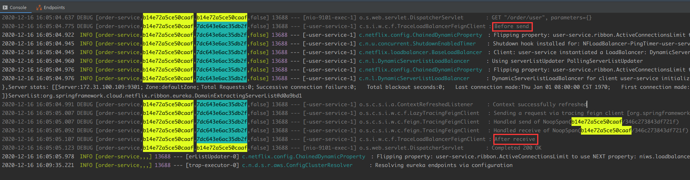

# █ Spring Cloud

# 一. 概述

Spring Cloud 是微服务架构一套完整解决方法, 包含了多个组件, 是一个整体, 不是特指某一个软件(类似于Microsoft Office, 是一套软件包), 常用的组件包括以下几个

| 名称     | 功能                  | 特点                                             |
| -------- | --------------------- | ------------------------------------------------ |
| eureka   | 服务注册与发现        | 分服务端与客户端                                 |
| Actuator | 服务状态监控          | 提供许多监控端点, 通过端点可以了解服务的运行状态 |
| Ribbon   | 客户端侧的负载均衡    |                                                  |
| Feign    | 声明式的Rest 接口调用 |                                                  |
| Hystrix  | 服务容错与监控        |                                                  |
| Config   | 统一管理服务配置      |                                                  |
| Zuul     | 微服务网关            |                                                  |

基于 spring boot 和 spring cloud, 每个微服务模块都需要添加 spring boot 和 spring cloud 相关依赖, 后面不再赘述

# 二. Eureka

## 1. 概述

## 2. 基本示例

### 2.1. 服务端

引入依赖 `spring-cloud-starter-netflix-eureka-server`

```xml
<dependency>
    <groupId>org.springframework.cloud</groupId>
    <artifactId>spring-cloud-starter-netflix-eureka-server</artifactId>
</dependency>
```

启动类添加 `@EnableEurekaServer` 注解, 声明这是一个 eureka 注册中心

```java
@SpringBootApplication
@EnableEurekaServer
public class EurekaServer {
    public static void main(String[] args){
        SpringApplication.run(EurekaServer.class, args);
    }
}
```

相关配置

```properties
spring.application.name=eureka-server
server.port=8001

eureka.client.service-url.defaultZone=http://localhost:8001/eureka/
eureka.client.fetch-registry=false
eureka.client.register-with-eureka=false
```

配置项需要说明一下

- `eureka.client.service-url.defaultZone`

  通过 rest 端点与 eureka 交互时的地址, 查询服务和注册服务都需要用这个地址.

  注意此处的 `defaultZone` 不能使用连字符形式, 

- `eureka.client.fetch-registry`

  是否从别的 eureka server 加载注册信息, 默认 true, 主要用在集群情况, 单机时可以为 false

- `eureka.client.register-with-eureka`

  是否将自己注册到 eureka, 默认true, 主要用在集群情况, 单机时可以为 false

启动 eureka server 应用, 访问 http://localhost:8001/ 即可打开 eureka 主页, 查看相关信息

### 2.2. 客户端

引入依赖

```xml
<dependency>
    <groupId>org.springframework.cloud</groupId>
    <artifactId>spring-cloud-starter-netflix-eureka-client</artifactId>
</dependency>
```

spring cloud Edgware 之后, 添加依赖后就可以完成自动配置, 启动类与普通 spring boot 应用一样, 不需做任何特殊配置. 在 spring cloud Edgware 之前的版本中, 需要添加 `@EnableEurekaClient` 或 `@EnableDiscoveryClient`

```java
@SpringBootApplication
public class UserApplication {
    public static void main(String[] args) {
        SpringApplication.run(UserApplication.class, args);
    }
}
```

应用配置 `application.properties` 中添加 eureka 相关配置

```properties
spring.application.name=user-service
eureka.client.service-url.defaultZone=http://localhost:8001/eureka/
eureka.instance.prefer-ip-address=true
```

具体配置项说明

- `spring.application.name`

  为当前应用起名, 作为注册到 eureka server 上的应用名称

- `eureka.instance.prefer-ip-address`

  注册到 eureka server 时使用 ip, 则后续被其他服务调用时, 也会通过 ip 进行调用. 

  默认为 false, 会通过 hostname 进行注册, 适合在局域网内使用.

## 3. 特性

### 1) 高可用

多个 eureka server 实例相互注册, 实例之间会同步信息

为了测试, 先修改 host (这是为什么呢, 起什么作用?)

```shell
127.0.0.1 peer1 peer2 peer3
```

修改 `application.yml` , 添加多个 profile 使用不同端口, 向另外两个实例注册

```yml
spring:
  application:
    name: eureka-server

---
spring:
  profiles: eureka-1
server:
  port: 8001
eureka:
  instance:
    hostname: peer1
  client:
    service-url:
      defaultZone: http://peer2:8002/eureka/,http://peer3:8003/eureka/

---
spring:
  profiles: eureka-2
server:
  port: 8002
eureka:
  instance:
    hostname: peer2
  client:
    service-url:
      defaultZone: http://peer1:8001/eureka/,http://peer3:8003/eureka/

---
spring:
  profiles: eureka-3
server:
  port: 8003
eureka:
  instance:
    hostname: peer3
  client:
    service-url:
      defaultZone: http://peer1:8001/eureka/,http://peer2:8002/eureka/
```

以上配置可以采用简短写法, 即将 `serviceUrl.defaultZone` 合并

```application.yml
spring:
  application:
    name: eureka-server
eureka:
  client:
    service-url:
      defaultZone: http://peer1:8001/eureka/,http://peer2:8002/eureka/,http://peer3:8003/eureka/
---
spring:
  profiles: eureka-1
server:
  port: 8001
eureka:
  instance:
    hostname: peer1

---
spring:
  profiles: eureka-2
server:
  port: 8002
eureka:
  instance:
    hostname: peer2

---
spring:
  profiles: eureka-3
server:
  port: 8003
eureka:
  instance:
    hostname: peer3
```

将其他微服务注册到 eureka server 集群, 只需要将 `serviceUrl.defaultZone` 设置多个地址即可

```properties
# 注册到 eureka
eureka.client.service-url.defaultZone=http://peer1:8001/eureka/,http://peer2:8002/eureka/,http://peer3:8003/eureka/
eureka.instance.prefer-ip-address=true
```


### 2) 心跳保持

默认情况下, 所有注册到 eureka 的服务, 会每隔30 秒给 eureka 发送一次心跳, 若在一定时间内没有收到某个服务的心跳, eureka 将会注销该实例(默认 90s).

### 3) 自我保护模式

但是发生网络分区故障时, 微服务与 eureka 之间的通讯不正常, 虽然 eureka server 没收到 应用服务的心跳, 但是该应用服务可能仍能正常服务该区的其他消费者, 此时 eureka 不应该注销该服务. 

为了避免网络分区时, eureka 误将正常工作的服务注销, eureka 提供了自我保护模式, 即当 eureka server 在短时间内丢失过多客户端(即应用服务)时, 那么 eureka server 认为发生了 网络分区故障, 此时该 eureka 节点就会进入自我保护模式, 进入保护模式后, eureka 将保留服务注册表中的消息, 不会注销任何应用服务.

> 宁可保留故障的节点, 也不能盲目注销正常节点

但是在开发时, 这个设置可能会带来不便, 无法迅速反应服务变化情况, 因此可以考虑关闭保护模式

`eureka.server.enable-self-preservation=false` 


## 2. 客户端

## 3. 元数据


# 三. Actuaor

提供了许多监控端点(访问接口), 通过这些端点, 可以了解服务的运行情况, spring boot提供

# 四. Ribbon

客户端侧的负载均衡

## 1. 自定义配置

### 1) 通过 java 代码自定义

### 2) 通过配置属性自定义

### 3) 饥饿加载

## 2. 脱离 eureka 使用 ribbon

# 五. Feign

提供声明式的 Rest 调用方式

## 1. 基本使用

### 1.1. 基本类型参数

### 1.2. 对象参数

### 1.3. Map 封装参数

## 2. 自定义配置

### 2.1. 通过 java 代码自定义

### 2.2. 通过配置属性自定义

## 3. 进阶使用

### 3.1. 继承

### 3.2. 压缩

### 3.3. 文件上传

### 3.4. 日志

# 六. Hystrix

## 1. 概述

Hystrix 的工作原理, 

1. 在方法上添加注解, 声明要对该方法进行断路保护, 并指定一个后备方法
2. 该方法抛出异常时, 进入后备方法
3. hystrix 会统计一段时间内进入后备方法的次数, 当次数达到指定阈值时, 断路器打开
4. 当断路器打开时, 所有该方法的调用请求都会被拦截, 直接返回错误提示
5. 当断路器打开一段时间后, 断路器进入半开状态, 一段时间内允许真实调用一次被保护方法, 其他调用请求继续被拦截
6. 如果这个被允许的调用正常执行完成, 说明该方法能正常工作, 断路器关闭
7. 如果这个被允许的调用还是执行失败, 说明该方法尚未恢复正常, 断路器打开

基于上面的原理分析, 可知我们主要需要在跨服务调用的方法上添加断路保护器, 避免跨服务的调用引发雪崩现象, 


## 2. 普通方式集成 Hystrix

添加依赖

```xml
<dependency>
    <groupId>org.springframework.cloud</groupId>
    <artifactId>spring-cloud-starter-netflix-hystrix</artifactId>
</dependency>
```

启动类上添加`@EnableHystrix` 注解, 启用断路器保护

```java
@SpringBootApplication
@EnableHystrix
public class StockApplication {
    public static void main(String[] args) {
        SpringApplication.run(StockApplication.class, args);
    }
}
```

在要保护的目标方法上添加 `@HystrixCommand` 注解

```java
@GetMapping("onlyOne")
@HystrixCommand(
    fallbackMethod = "onlyOneFallBack", 
    ignoreExceptions = {NullPointerException.class})
public Stock onlyOne(Integer id) {
    if (id == 1) {
        return stockList.get(0);
    }
    if (id == 3) {
        throw new NullPointerException("NullPointerException, 不触发回退");

    }
    throw new RuntimeException("不是指定的参数, 触发回退方法");
}

public Stock onlyOneFallBack(Integer id, Throwable t) {
    Stock stock = new Stock();
    stock.setId(0);
    stock.setName(t.getMessage());
    stock.setCount(0);
    return stock;
}
```

一般情况下, 被保护方法抛出异常时, 会进入后备方法. 但很多时候, 对于业务类的异常, 我们希望直接返回错误信息,而不是进入后备方法. 

Hystrix 提供了一个 HystrixBadRequestException 类, 当被保护方法抛出该类异常时, 直接返回, 不会进入后备方法, 因此, 可以让我们自定义的异常类继承这个 HystrixBadRequestException 类, 则我们抛出自定义的业务异常时, 从而达到业务异常不触发后备方法的效果.

除了继承 `HystrixBadRequestException` , Hystrix 还提供了一个 `ignoreExceptions` 的属性, 可以用来配置不执行后备方法的异常类型, 该属性可以接受一个数组, 可以指定多种异常类型.


## 3. Feign 集成 Hystrix

spring cloud 已经为 feign 整合了 hystrix, 不需要额外添加 hystrix 的依赖

修改应用配置 `application.properties`, 开发 feign 的 hystrix 支持

```properties
# 开启 feign 的 hystrix 支持
feign.hystrix.enabled=true
```

在 `@FeignClient` 的 `fallback` 属性中添加回退类, 该回退类要实现 feignClient 的接口

```java
@FeignClient(name = "stock-service", fallback = tockFeignClient.StockFeignFallback.class)
public interface StockFeignClient {
    @PostMapping("stock/minus")
    String minus(@RequestParam("id") int id, @RequestParam("count") int count) ;

    @Component
    @Slf4j
    class StockFeignFallback implements StockFeignClient {
        @Override
        public String minus(int id, int count) {
            log.warn("minus 方法调用失败, 进入回退方法");
            return "minus 调用失败, 进入回退方法";
        }
    }
}
```

前面说到, 回退方法中可以获取原方法抛出的异常信息, 而 继承 feignClient 接口的类缺少 Throwable 参数, 无法实现. 为此, Feign 提供了 `fallbackFactory` 机制来实现这个需求.

```java
@FeignClient(name="user-service", fallbackFactory = UserFeignClient.UserFallbackFactory.class)
public interface UserFeignClient {

    @GetMapping("user/{id}")
    User getUser(@PathVariable("id") int id);

    // 实现一个 FallbackFactory, 使用 UserFeignClient 接口作为类型参数
    @Component
    class UserFallbackFactory implements FallbackFactory<UserFeignClient> {
        @Override
        public UserFeignClient create(Throwable throwable) {
            // create 方法返回一个 UserFeignClient 的实现类对象,
            // 通过匿名内部类访问外部变量的机制, 实现在回退方法中获取原始异常信息
            return new UserFeignClient() {
                final Logger log = LoggerFactory.getLogger(UserFeignClient.class);
                @Override
                public User getUser(int id) {
                    log.error("user 服务调用失败", throwable);
                    User fallbackUser = new User();
                    fallbackUser.setId(0);
                    fallbackUser.setName("user 服务调用失败, 这是后备 user");
                    fallbackUser.setAddress(throwable.getMessage());
                    return fallbackUser;
                }
            };
        }
    }
}
```


# 七. Config

## 1. 服务端

### 1.1. 项目搭建

#### 1) 添加依赖

```xml
<dependency>
    <groupId>org.springframework.cloud</groupId>
    <artifactId>spring-cloud-starter-config</artifactId>
</dependency>
<dependency>
    <groupId>org.springframework.cloud</groupId>
    <artifactId>spring-cloud-config-server</artifactId>
</dependency>
```

#### 2) 启动类

```java
@SpringBootApplication
@EnableConfigServer
public class ConfigServerApplication {
    public static void main(String[] args) {
        SpringApplication.run(ConfigServerApplication.class, args);
    }
}
```

需要注解 `@EnableConfigServer` 启用 config server

#### 3) 应用配置

```properties
server.port=8301

# 配置仓库
```


### 1.2. 使用 git 仓库

config server 默认采用 git 作为后端的配置仓库, 可以方便地提供版本控制和持续集成

```properties
#从git远程仓库获取配置
spring.cloud.config.server.git.uri=https://github.com/luojbin/spring-cloud-demo
spring.cloud.config.server.git.search-paths=/spring-cloud-config/src/main/resources/config/user-service
```

如果是私有仓库, 还需要添加访问仓库的用户名和密码

```properties
spring.cloud.config.server.git.username=luojbin
spring.cloud.config.server.git.password=123456
```

#### 搜索目录

默认情况下, config server 只在仓库根目录下查找配置

我们可能会在一个仓库里管理多个微服务的配置, 因此可能会把配置文件放在仓库的子目录中，此时可以使用 `search-path` 属性**添加**查找范围, 该属性同样支持占位符.

```properties
# 指定可能在 foo, bar开头的子目录
spring.cloud.config.server.git.search-paths=foo,bar*
```

使用相对于仓库根目录的相对路径

#### 仓库占位符

前面我们通过 `spring.cloud.config.server.get.uri` 指定了一个仓库地址, 事实上该属性非常灵活, 支持使用占位符 `{application}`, `{profile}`, `{label}`, 允许每个应用一个仓库, 或者每个 profile 一个仓库

```properties
spring.cloud.config.server.git.uri=https://git/cloud/{application}
```

#### 模式匹配

模式匹配是指带有通配符的`{application}/{profile}` 名称的列表. 

如果 `{application}/{profile}` 不匹配任何模式, 它将使用`spring.cloud.config.server.git.uri` 指定的仓库地址

```properties
# 默认的配置仓库地址, 处理未能匹配到其他仓库的应用及profile
spring.cloud.config.server.git.uri= 
# simple 应用的仓库地址
spring.cloud.config.server.git.repos.simple=
# 模式匹配的仓库地址, 处理 special 开头的应用
spring.cloud.config.server.git.repos.special.pattren=special*/*,my-special*/dev
spring.cloud.config.server.git.repos.special.uri=https://git/cloud/special
```

#### 启动时加载配置

默认情况下, config server 在首次被请求配置时, 才会从远程仓库获取配置, 也可以让 config server 在启动时就clone git 仓库, 需要使用 `spring.cloud.config.server.git.repos.{repoName}.clone-on-start` 设为 true, 或者采用全局配置, `spring.cloud.config.server.git.clone-on-start`

```properties
# 启动时加载所有 git 仓库
spring.cloud.config.server.git.clone-on-start=true
# 指定某个仓库需要启动时加载
spring.cloud.config.server.git.repos.special.clone-on-start=true
```

### 1.3. 使用文件系统仓库

```properties
#从本地获取配置
spring.profiles.active=native
spring.cloud.config.server.native.search-locations=file://\\D:\\Java\\ideaSpace\\spring-cloud-demo\\spring-cloud-config\\src\\main\\resources\\config\\user
```

需要启用 `profile=native`, 否则无法正常使用文件系统仓库

实际项目中, 由于需要保证 config server 的高可用, 通常会在不同机器上部署多个 config server 的实例, 而配置却需要集中管理, 不适合在多个机器上创建副本

即使采用文件系统仓库, 也建议使用`ssh:` 协议, 这样 config server 能在本地创建一个共享配置仓库的副本作为缓存.

### 1.4. 获取配置

config server 提供了 rest 端点以便其他微服务从它这里获取配置, 可以通过以下几个端点获取配置

- `/{application}/{profile}/{label}`

  以 json 格式返回数据, 信息最完整, 且指定pofile 时, 会同时返回默认配置及指定profile配置

  ```json
  // /user-service/dev/master
  {
      "name": "user-service",
      "profiles": [
          "dev"
      ],
      "label": "master",
      "version": "7dd99131973d6acef06dc7b1cf46fc64017199cc",
      "state": null,
      "propertySources": [
          {
              "name": "https://.../config/user-service/user-service-dev.properties",
              "source": {
                  "info.application.env": "dev",
                  "info.application.author": "luojbin"
              }
          },
          {
              "name": "https://.../config/user-service/user-service.properties",
              "source": {
                  "info.application.env": "hello",
                  "info.application.author": "config"
              }
          }
      ]
  }
  ```

- `/{application}-{profile}.yml` 或 `/{label}/{application}-{profile}.yml`

  以 yml 格式返回数据, 只返回指定文件的内容, 指定profile 时不会同时返回默认配置信息

  ```yaml
  # /master/user-service-dev.yml
  info:
    application:
      author: luojbin
      env: dev
  ```

- `/{application}-{profile}.properties` 或 `/{label}/{application}-{profile}.properties`

  以 `key: value` 形式返回数据, 只返回指定文件的内容, 指定 profile 时不会同时返回默认配置信息

  ```properties
  # /master/user-service-dev.properties
  info.application.author: luojbin
  info.application.env: dev
  ```

在上述端点中, 有几个占位符

- `{application}`, 微服务的名字
- `{profile}`, 微服务使用的profile
- `{label}`, 对应 git 仓库中的分支或 tag

## 2. 客户端

```xml
<dependency>
    <groupId>org.springframework.cloud</groupId>
    <artifactId>spring-cloud-config-client</artifactId>
</dependency>
```

添加配置文件 `bootstrap.yml` 或 `bootstrap.properties`

```properties
# 服务名
spring.application.name=user-service
# 要使用的 profile
spring.profiles.active=default
# config server
spring.cloud.config.uri=http://localhost:8301
```

启动时, springboot 将会从 config server 中加载 `/{application}/{profile}/{label}` 对应的配置信息, 然后根据这些配置来启动 springboot 应用. 

从 config server 加载配置后, 客户端服务就可以通过 `@Value` 或 `@ConfigurationProperties` 将配置注入到 spring bean的实例域中. 

 spring cloud 有一个引导上下文的概念, 是主应用程序的父级上下文. 引导上下文负责从配置服务器加载配置属性, 以及解密外部配置文件中的属性. 主应用程序上下文会加载`application.yml`, 而引导上下文则会加载 `bootstrap.yml`. 引导上下文有更高的优先级, 默认情况下它不会被本地配置覆盖. 

若需要禁用引导过程, 需要通过`spring.cloud.bootstrap.enable=false` 来关闭

## 3. 整合 eureka

### 3.1. 服务端配置

### 3.2. 客户端配置

## 4. 安全保护

### 4.1. 访问限制

config server 默认不需身份验证, 所有人都可通过 web 请求 config server 获取应用配置, 为了避免敏感信息泄露, 我们可能需要对 config server 进行访问限制, 可能采取的做法有:

- 仅限内网访问
- 添加身份验证

下面我们介绍如何为 config server 添加身份验证.

### 4.2. 配置加密

除了对 config server 添加访问限制, 在配置中直接记录敏感信息的明文也是有风险的. config server 支持对配置内容的自动加解密, 可以保护我们的配置内容

# 八. sleuth 及 zipkin

> level [服务名,traceId,spanId,false]……



spring boot 2.0, spring cloud Edware 开始, 不再建议自己通过依赖搭建 zipkin 应用服务器, zipkin 团队提供了一个可执行 jar 包, 建议用户直接使用该 jar 包启动, 如果需要修改配置, 可以通过**命令行参数**或**环境变量**等方式来实现

注. zipkin 其实还是一个 springboot 应用, 我们知道 springboot 应用可以从 jar 包外加载 `application.yml` 的配置文件, 并覆盖 jar 包内配置文件的同名配置项. zipkin 同样可以根据这个机制使用外部的配置文件, 只是 zipkin 将配置文件名改成了 `zipkin-server`, 而不是原来的 `application`, 

因此, 我们可以在 zipkin-server jar包的相同目录下创建一个 `zipkin-server.properties` 文件, 在文件内指定要修改的配置内容. 但因为该种方式可能会覆盖 zipkin 团队预设的一些短变量, 因此不被推荐. 

### 后端存储库

默认情况下, zipkin 将数据保存在内存中, 也可以使用 elk 或 mysql 作为后端存储库, 相关依赖都已经集成在 zipkin-server.jar 中, 只需要通过配置开启相应开关即可

#### MySQL

可能是大部分开发者最熟悉的方式, 但后续可能会被取消

#### ElasticSearch

效果最好的, 建议学习使用

# 九. 综合示例

综合以上的内容, 一个比较完整的微服务应该包括以下组件:

- eureka client, 服务注册与发现
- config client, 获取配置
- actuator, 提供微服务状态的监控端点
- feign(含ribbon), 跨服务调用, 并实现客户端负载均衡
- hystrix, 提供断路保护, 避免级联失败导致的微服务架构雪崩

pom依赖如下

```xml
<test></test>
```

启动类配置如下

```java
@EnableFeignClient
```

引导配置 `bootstrap.yml` 或 `bootstrap.yml`

```properties
# 服务名
# 加入 eureka
# config server 配置
```

应用配置 `application-profile.properties` 或 `application-{profile}.yml`, 集中在 config 仓库

```properties
# hystrix 配置
# feign 配置
# 数据库配置
```

