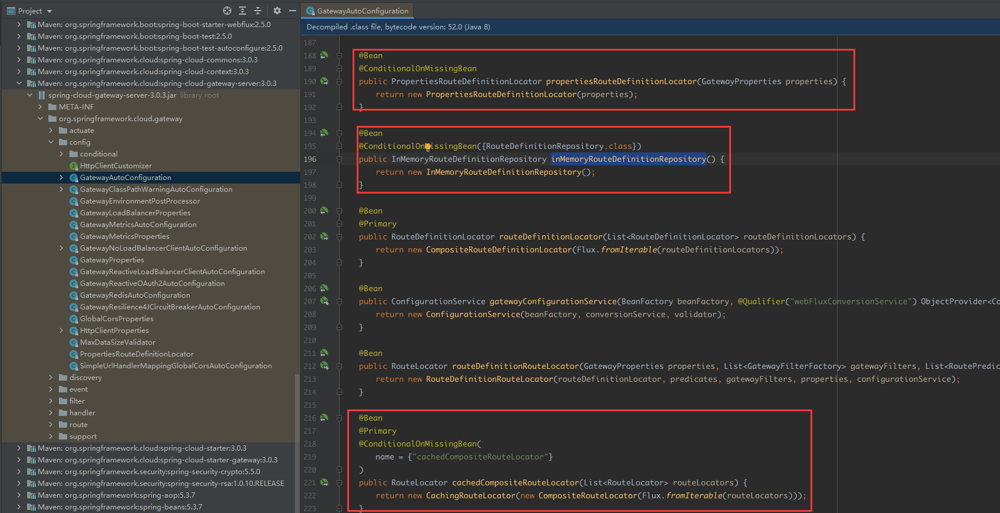

# Spring Gateway

spring gateway 网关

基于 springboot, spring webFlux, Reactor, netty 的网关框架, 与传统基于 servlet 的应用不同, 不适用于传统的 mvc 应用中.

## 基本概念

`Route 路由`：网关的基本构建块。它由 ID、目标 URI、谓词集合和过滤器集合定义。如果聚合谓词为真，则匹配路由。

`Predicate 断言`：这是一个 Java 8 函数式接口 `Predicate`。输入类型是 `Spring Framework` 的`ServerWebExchange`。这使您可以匹配来自 HTTP 请求的任何内容，例如标头或参数。

`Filter 过滤器`：使用特定工厂构建的 `GatewayFilter` 实例。在这里，您可以在发送下游请求之前或之后修改请求和响应。

## 工作流程


gateway 的工作流程如下

1. 客户端发出请求到 gateway
2. gateway handler mapping 确定该请求的路由目标, 发的到对应的 gateway web handler
3. gateway web handler 控制请求经过一系列的前处理 filter
4. 发送请求到目标服务
5. gateway web handler 控制请求经过一系列的后处理 filter
6. 返回给客户端

## 配置方式

spring cloud gateway 的路由断言和过滤器支持以下两种方式

### 完整写法

每个组件包括以下两个部分

- `name` 组件名称
- `args` 参数列表, 不同的组件, 下级的参数可能有所不同

```yaml
spring:
  cloud:
    gateway:
      routes:
      - id: after_route
        uri: https://example.org
        predicates:
        - name: Cookie
          args:
            name: mycookie
            regexp: mycookievalue
        filters:
        - name: StripPrefix
          args:
            parts: 1
```

### 简洁写法

将 `predicates` 或 `filters` 下的内容, 按照 `组件名=参数列表` 的形式列出, 其中参数列表按照该组件的 `shortcutFieldOrder()` 方法的结果给出, 详情查看后文自定义 filter 部分的介绍

```yaml
spring:
  cloud:
    gateway:
      routes:
      - id: after_route
        uri: https://example.org
        predicates:
        - Cookie=mycookie,mycookievalue
        filters:
        - StripPrefix=1
```

# 路由配置

## 静态路由

spring gateway 提供了大量内置的路由断言工厂, 用来处理 http 请求中的不同属性

你可以组合使用不同的路由断言工厂

After路由: 匹配特定时刻之后的请求

Before路由:  匹配特定时刻之前的请求

Between路由: 匹配两个特定时刻之间的请求

cookie 路由: 含有指定name, 且value满足给定正则表达式的cookie的请求

header路由: 含有指定name, 且value满足给定正则表达式的header的请求

host路由: 根据header 中的 host 字段判断, 支持uri 变量`{变量}`

method路由: 根据 http 请求方法判断, get/post/put等

path路由: 根据路径判断

query路由: 根据query 参数判断

远程地址路由: 根据客户端地址和子网掩码长度匹配, 如果在代理后方, 可能会获取到错误的地址

负载路由: 按照负载比例, 将请求分发

## 服务发现

### 自动设置路由

如果将 gateway 连接到注册中心, 则可以从服务中心获取服务信息, 从而将请求分发到指定服务. 

要启用服务发现的自动路由, 需要满足以下条件

- classpath 中包含 服务注册 相关依赖, 如 `eureka-client`
- 在配置文件中, `spring.cloud.gateway.discovery.locator.enabled=true`

启用服务发现自动路由后, gateway 自动将形如 `/serviceId/**` 的请求, 去掉`/serviceId`前缀之后的路径发送到`serviceId` 对应的服务.

如果使用 eureka 作为注册中心, 默认的 serviceId 是全大写的, 若请求路径是小写的, 则无法匹配

`spring.cloud.gateway.discovery.locator.lower-case-service-id: true` 来启用小写 serviceId 的匹配

### 手动设置路由

如果不想以 serviceId 作为分发依据添加到请求路径中, 而是使用自定义的路径标记, 则可以使用 `PathPredicateFactory`, 手动指定匹配路径, 并在 `uri` 项中使用 `lb://serviceId` 来指定目标服务

```yaml
spring:
  cloud:
    gateway:
      routes:
		- id: msUser
		  # 使用 lb 协议, 指定转发到 simple-user 服务
          uri: lb://simple-user
          predicates:
          	# 匹配路径前缀为 /ms-user 的请求
            - Path=/ms-user/**
          filters:
          	# 改写路径, 去掉 /ms-user 前缀
            - RewritePath=/ms-user/(?<remaining>.*), /$\{remaining}
```

## 自定义路由

### 自定义路由断言

实现 `RoutePredicateFactory`, 或继承抽象类`AbstractRoutePredicateFactory`

## 动态路由

参考 [详解SpringCloud-gateway动态路由](https://blog.csdn.net/tianyaleixiaowu/article/details/83412301)

spring cloud gateway 允许通过配置文件或java 代码来配置路由信息, 并保存到内存中, 但是这两种方式都不支持动态路由. 

既然 spring cloud gateway 是基于 spring boot 的, 那么它应该是用 spring boot 的自动配置方式自动构造了一些bean. 在 spring cloud gateway 的 jar 包中, 我们找到了 `org.springframework.cloud.gateway.config.GatewayAutoConfiguration`



# 请求处理

spring cloud gateway 通过 filter 对请求进行处理, filter 可以分成两类

-  `GatewayFilter`, 针对满足指定路由条件的
-  `GlobalFilter`, 针对所有进入网关的请求

## 内置 gatewayfilter

gateway 预设了很多filter工厂, 可以对请求进行各种处理

```java
// 请求路径
6.21.  SetPath   // 设置路径, 可以使用变量, 重
6.16.  RewritePath   // 设置路径, 使用正则, 更加灵活
6.9.  PrefixPath   // 添加路径前缀
6.25.  StripPrefix   // 去除路径中指定个数的前缀

// 请求头
6.1.  AddRequestHeader   // 添加请求头
6.13.  RemoveRequestHeader   // 删除请求头
6.22.  SetRequestHeader   // 设置请求头, 覆盖原值
6.8.  MapRequestHeader   // 替换请求头的名字
6.10.  PreserveHostHeader   // 保留原始 host 请求头
6.28.  SetRequestHostHeader   // 改写 host 请求头
6.20.  SecureHeaders   // 添加一系列安全相关的请求头

// 请求参数
6.2. The AddRequestParameter GatewayFilter Factory // 添加请求参数
6.15. The RemoveRequestParameter GatewayFilter Factory // 去除请求参数
// 请求体
6.29. Modify a Request Body GatewayFilter Factory


6.19. The SaveSession GatewayFilter Factory // spring session会话
    
// 响应头
6.3. The AddResponseHeader GatewayFilter Factory // 添加指定响应头
6.14. RemoveResponseHeader GatewayFilter Factory // 删除指定响应头
6.23. The SetResponseHeader GatewayFilter Factory // 设置指定响应头
6.18. The RewriteResponseHeader GatewayFilter Factory // 改写响应头
6.4. The DedupeResponseHeader GatewayFilter Factory // 去掉重复响应头
6.12. The RedirectTo GatewayFilter Factory // 设置重定向
6.17. RewriteLocationResponseHeader GatewayFilter Factory // 改写Location响应头

6.24. The SetStatus GatewayFilter Factory // 修改http状态码
// 响应体
6.30. Modify a Response Body GatewayFilter Factory
    
// 限流/断路/重试等
6.27. The RequestSize GatewayFilter Factory // 限制请求大小
6.11. The RequestRateLimiter GatewayFilter Factory // 限流
    6.11.1. The Redis RateLimiter
6.5. The Hystrix GatewayFilter Factory // hystrix熔断, 已被CircuitBreaker取代
6.6. Spring Cloud CircuitBreaker GatewayFilter Factory // 断路保护
    6.6.1. Tripping The Circuit Breaker On Status Codes
6.7. The FallbackHeaders GatewayFilter Factory// 断路fallback
6.26. The Retry GatewayFilter Factory // 失败后重试
    
6.31. Default Filters // 添加作用于所有路由的gatewayFilter
```

其中, 有几个需要重要的 filter

### StripPath

通常, 我们会将发送至网关的请求中, 以第一个段为目标服务的标记段, 然后需要将该标记段去掉, 再将请求分发到指定的后端服务器, 

StripPrefix 就是用来去掉请求路径中的指定标记段

```yaml
filters:
- StripPrefix=1
```

### PrefixPath

为请求路径添加指定的前缀

```yaml
filters:
- PrefixPath=/gateway
```

### RewritePath

根据正则表达式, 更改请求路径

如果需要替换路径中的某一段内容, 可以使用正则表达式进行替换, 其中需要保留的部分以`(?<段名>正则表达式)` 的进行匹配,  并在新路径中以`$\{段名}`作为占位符.

注意`$`后面有个`\`, 避免与spring变量`${变量名}`产生冲突

```yaml
filters:
- RewritePath=/red/(?<segment>.*), /blue/$\{segment}
```

## 内置 GlobalFilter

### LoadBalanceFilter

服务发现及负载均衡的关键, 能将 `lb://serviceId` 的路由目标解析成完整的目标url

## 自定义 filter

### 自定义GatewayFilter

实现 `GatewayFilterFactory`, 或继承抽象类`AbstractGatewayFilterFactory`

注意, GatewayFilterFactory 的名字应该符合 `xxxxGatewayFilterFactory` 的形式, 以便在配置文件中斤进行配置

然后定义一个 `GatewayFilter`类, 为了控制该 Filter 的执行顺序, 建议同时实现 `Ordered` 接口

### 自定义GlobalFilter

实现 `GlobalFilter`, 将会作用到所有请求上

## filter 的顺序

1. 如果未实现 Ordered, 会通过 OrderedGatewayFilter 进行代理, 为 filter 按照配置文件中的顺序, 设置 order, 从1 开始

   `org.springframework.cloud.gateway.route.RouteDefinitionRouteLocator#loadGatewayFilters`

2. 重新为filter们排序, 检查是否 PriorityOrdered 的子类

   1. 如果 a 是 b否, 则, a<b, 即无序号的优先
   2. 如果 a否, b是, 则 a<b, 即无序号的优先
   3. 如果 ab 都是, 或者都不是, 获取 ab的序号来比较
      1. 获取序号时, 如果是 Ordered 的子类(或OrderedGatewayFilter代理), getOrder() 获取序号
      2. 如果不是 Ordered 的子类, 返回一个超大的的数, 即排在最后面(实际上取不到, 都用OrderedGatewayFilter 代理了)
      3. 如果序号都相同, 则不改变顺序

# 集成

Spring Cloud Gateway 提供了一个名为 `ProxyExchange` 的实用程序对象。您可以在常规 Spring Web  处理程序中使用它作为方法参数传入。

它通过反映 HTTP 动词的方法支持基本的下游 HTTP 交换。对于 MVC，它还支持通过 forward()  方法转发到本地处理程序。

要使用 `ProxyExchange`，请在类路径中包含正确的模块（`spring-cloud-gateway-mvc` 或  `spring-cloud-gateway-webflux`）。

## Spring MVC

需要 `spring-cloud-gateway-mvc` 

```java
@RestController
@SpringBootApplication
public class GatewaySampleApplication {
    @Value("${remote.home}")
    private URI home;

    @GetMapping("/test")
    public ResponseEntity<?> proxy(ProxyExchange<byte[]> proxy) throws Exception {
        return proxy.uri(home.toString() + "/image/png").get();
    }
}
```

## Spring WebFlux

需要`spring-cloud-gateway-webflux`

```java
@RestController
@SpringBootApplication
public class GatewaySampleApplication {
    @Value("${remote.home}")
    private URI home;

    @GetMapping("/test")
    public Mono<ResponseEntity<?>> proxy(ProxyExchange<byte[]> proxy) throws Exception {
        return proxy.uri(home.toString() + "/image/png").get();
    }
}
```

