下面是一个简化的Spring OAuth2流程图，展示了基本的授权码模式（Authorization Code Grant）的流程：

```mermaid
graph LR
A[用户请求] --> B[客户端]
B --> C[授权请求]
C --> D[用户登录/授权]
D --> E[授权服务器]
E --> F[用户授权]
F --> G[生成授权码]
G --> H[授权码返回给客户端]
H --> I[客户端请求访问令牌]
I --> J[授权服务器]
J --> K[验证授权码]
K --> L[生成访问令牌和刷新令牌]
L --> M[访问令牌和刷新令牌返回给客户端]
M --> N[客户端请求资源]
N --> O[资源服务器]
O --> P[验证访问令牌]
P --> Q[返回请求资源给客户端]

```

这个流程图展示了授权码模式的基本步骤：

1. 用户通过客户端发起授权请求。
2. 用户登录并授权请求。
3. 授权服务器验证用户授权，并生成授权码。
4. 授权码返回给客户端。
5. 客户端使用授权码请求访问令牌。
6. 授权服务器验证授权码，然后生成访问令牌和刷新令牌。
7. 访问令牌和刷新令牌返回给客户端。
8. 客户端使用访问令牌请求资源。
9. 资源服务器验证访问令牌，并返回请求的资源给客户端。

请注意，这只是一个简化的示例，实际的Spring OAuth2流程可能会因授权模式和配置的不同而有所变化。还有其他授权模式，如密码模式（Password Grant）、客户端凭证模式（Client Credentials Grant）和隐式授权模式（Implicit Grant），它们的流程可能与授权码模式有所不同。
