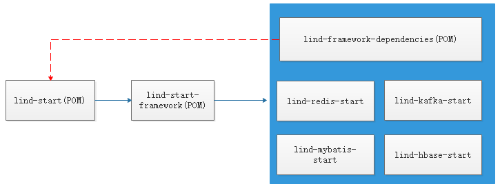
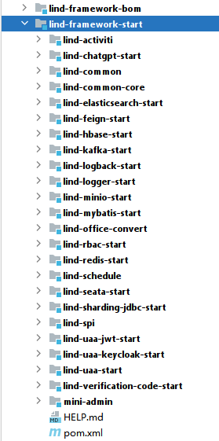

# 项目介绍

主要是由框架级工具进行封装，springboot的start包的使用，完成对工具包的自动注入，所有start包的版本都继承lind-framework的版本.

# 框架升级步骤

* 命令行执行：mvn versions:set -DnewVersion=1.1.3-SNAPSHOT // 更新整个项目版本,SNAPSHOT的同一个版本可以多次发到仓库里
* 提交版本变更：mvn versions:commit //提交，删除多余的pom.xml.versionsBackup
* 部署到仓库：mvn deploy -Dmaven.test.skip=true //跳过测试，部署到仓库

> 先deploy lind-framework-bom项目，再deploy lind-framework项目

# 项目结构

# lind-start-framework项目目录

> 以lind开头，以start结尾的项目，是其它项目的基础包
> 

* lind-framework-bom lind组件和相关依赖清单，需要使用lind组件，需要import这个包
* lind-framework 组件包
  * lind-activiti 工作流组件
  * lind-chatgpt-start 对接open-ai提供的gpt接口
  * lind-common 公用工具包
  * lind-common-core 公用核心包，依赖最少原则
  * lind-elasticsearch-start 封装了es7.x的操作，工厂模块完成对类型的动态转换
  * lind-feign-start 接口调用组件
  * lind-hbase-start 封装了hbase的操作，封装了常用字段，AOP完成赋值
  * lind-kafka-start 封装了kafka工具，动态代理实现生产者
  * lind-logback-start 对日志输出规范的封装，集成了traceId和ip等
  * lind-logger-start 日志拦截器，记录行为日志
  * lind-mybatis-start 封装了mybatis plus的操作
  * lind-nacos-start 统一了nacos的版本，添加了配置热更新demo
  * lind-office-convert 封装了对excel,word的操作
  * lind-rbac-start 用户角色管理相关的封装
  * lind-redis-start 对redis的封装，序列化的统一，分布锁组件， 限流组件
  * lind-schedule 任务调组件
  * lind-seata-start 快速对接seata分布式事务包
  * lind-sharding-jdbc-start  分库分表应用包
  * lind-spi java原生的插件组件
  * lind-uaa-jwt-start 基于JWT的授权组件
  * lind-uaa-keycloak-start 基于keycloak的授权组件
  * lind-uaa-start 用户授权组件
  * lind-verification-code-start 验证码组件
  * mini-admin 一个最小功能的后台项目，非前后分离设计，部署方便
