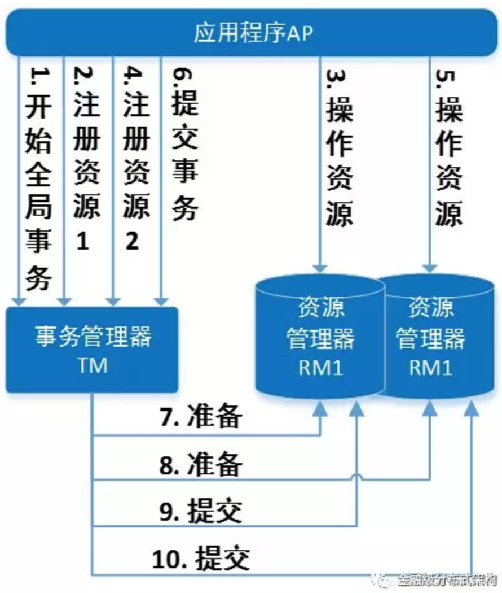

# 五. 分布式事务

## 1. 基本理论

### 1.1. CAP 理论

- `Consistency` 一致性 

  同一数据的多个副本是否实时相同。

- `Availability` 可用性

  一定时间内 & 系统返回一个明确的结果 则称为该系统可用。

- `Partition tolerance` 分区容错性

  将同一服务分布在多个系统中，从而保证某一个系统宕机，仍然有其他系统提供相同的服务。

指分布式系统中, CAP 三个指标最多只能满足其中2个需求. 


### 1.2. 酸碱平衡

单数据源的时候, 我们知道事务需要满足 **ACID** 四个特性

- `Atomicity` 原子性 

  整个事务的所有操作要么全部提交成功, 要么全部失败回滚.

- `Consistency` 一致性

  数据库总从一个一致性状态转换到另一个一致性的状态. 

- `Isolation` 隔离性

  一个事务的修改在最终提交之前, 对其他事务时不可见的.

- `Durability` 持久性

  一旦事务提交, 则其所作的修改就会永久保存到数据库中, 即使系统崩溃, 修改的数据也不会丢失.

CAP理论告诉我们一个悲惨但不得不接受的事实——我们只能在C、A、P中选择两个条件。而对于业务系统而言，我们往往选择牺牲一致性来换取系统的可用性和分区容错性。不过这里要指出的是，所谓的“牺牲一致性”并不是完全放弃数据一致性，而是牺牲**强一致性**换取**弱一致性**。下面来介绍下 **BASE** 理论。

- `Basic Available` 基本可用

  整个系统在某些不可抗力的情况下，仍然能够保证“可用性”，即一定时间内仍然能够返回一个明确的结果。只不过“基本可用”和“高可用”的区别是：

  - “一定时间”可以适当延长 当举行大促时，响应时间可以适当延长
  - 给部分用户返回一个降级页面 给部分用户直接返回一个降级页面，从而缓解服务器压力。但要注意，返回降级页面仍然是返回明确结果。

- `Soft State`: 柔性状态

  同一数据的不同副本的状态，可以不需要实时一致。

- `Eventual Consisstency`. 最终一致性

  同一数据的不同副本的状态，可以不需要实时一致，但一定要保证经过一定时间后仍然是一致的。

## 3. 分布式事务模型

### 3.1. 前提假设

存在一个节点作为协调者(Coordinator), 其他节点作为参与者(Cohorts), 节点之间可以进行网络通信;

所有节点都采用预写式日志, 且日志写入后即被保持在可靠的存储设备上, 即使节点宕机也不会丢失数据;

所有节点不会永久性损坏, 即使损坏后也能恢复

### 3.2. 两阶段提交


#### 0) 业务操作

由于两阶段提交关注点在于事务, 因此很多相关文章中, 都未明确说明业务操作在什么什么时候完成, 或者将业务操作纳入第一阶段中. 其实一个完整的操作, 在两阶段提交之前就需要先开启事务, 并完成需要的业务操作, 然后才开始两阶段提交, 

完成流程应该是: 开启事务-业务操作-准备阶段(投票)-正式提交/回滚

#### 1) 投票阶段

1. 协调者向所有参与者询问是否可以执行提交操作(vote), 并等待参与者的响应
2. 参与者执行本地事务操作, 并记录 undo 和 redo 信息(记录了数据库操作, 但未提交业务事务)
3. 各参与者响应协调者的询问, 如果参与者本地事务执行成功, 返回同意; 若本地事务失败, 则返回中止

#### 2) 提交执行阶段

当所有参与者都返回“同意”时, 正式提交

1. 协调者向所有参与者发出正式提交的请求
2. 参与者节点正式完成操作, 并释放在整个事务期间占用的资源
3. 参与者节点向协调者发送完成消息
4. 协调者收到所有节点的完成消息后, 完成事务

如果任一参与者在第一阶段返回了“中止”, 或协调者在限时内未收到所有参与者返回的同意

1. 协调者向所有参与者发出回滚的请求
2. 参与者利用之前记录的 undo, 执行回滚, 并释放在整个事务期间占用的资源
3. 参与者节点向协调者节点发送回滚完成的消息
4. 协调者收到所有参与者反馈的回滚完成消息后, 取消事务

无论最后结果如何, 第二阶段都会结束当前事务

#### 3) 存在的问题

- **同步阻塞** 执行过程中, 所有参与者节点都是事务阻塞型的(全局事务场景下, DTP/XA), 当参与者占用公共资源时, 其他第三方节点访问公共资源时被阻塞. (这个是全局事务的问题, 如 TCC 等补偿型的异步二阶段提交, 就不会一直阻塞)
- **参与者故障导致数据不一致** 参与者可能会发生故障, 协调者需要给每个参与者额外指定超时机制, 超时后整个事务失败
  - 若参与者在准备阶段故障, 协调者达到超时时间后将事务回滚, 但参与者本身已记录undo日志, 可以在恢复后再完成回滚操作, 实现最终一致性
  - 若参与者在投票成功后故障, 未正确完成提交操作, 可以在恢复后继续完成(?), 实现最终一致性
- **协调者单点故障导致一直阻塞** 协调者发生故障, 参与者收不到第二阶段的提交或者回滚请求, 会一直阻塞下去, 需要额外的备机进行容错
  - 三阶段提交中为参与者也设置了超时机制, 等不到协调者信息就自动执行
- **极端情况下无法确定状态** 如果协调者发出 commit 消息后宕机, 唯一接受到这条消息的参与者也宕机了, 即使后来协调者通过选举协议产生了新的协调者, 这条事务的状态也是不确定的, 没人知道事务是否已经提交
  - 三阶段提交中为参与者也设置了超时机制, 等不到协调者信息就自动执行, preCommit之前自动回滚, preCommit之后自动提交
  - 但是三阶段提交最后的 doCommit 发出的是回滚指令, 而指令只能传达部分参与者, 这时收到回滚指令的参与者进行了回滚, 而未收到指令的参与者执行了提交, 导致数据不一致.

### 3.3. 三阶段提交

为了解决两阶段提交的问题, Dale Skeen和Michael Stonebraker提出了三阶段提交.

- 在协调者和参与者中都引入超时机制 -> 解决协调者宕机导致参与者永久阻塞的问题
  - 第二阶段，如果协调者超时没有接受到参与者的反馈，则自动认为失败，发送abort命令
  - 第三阶段，如果参与者超时没有接受到协调者的反馈，则自动认为成功开始提交事务（基于概率）
- 在第一阶段和第二阶段中插入一个准备阶段, 保证在最后提交阶段之前各个节点的状态是一致, 都是可提交的, 保证了最后可以超时自动提交

也就是说, 除了引入超时机制之外, 3PC 将 2PC 的准备阶段再次一分为二, 这样三阶段提交就有 canCommit, preCommit, doCommit 三个阶段


#### 1) canCommit

3PC的CanCommit阶段其实和2PC的准备阶段很像。协调者向参与者发送commit请求，参与者如果可以提交就返回Yes响应，否则返回No响应。

1. **事务询问** 协调者向参与者发送CanCommit请求。询问是否可以进行事务提交操作。然后开始等待参与者的响应。
2. **响应反馈** 参与者接到CanCommit请求之后，正常情况下，如果其自身认为可以顺利执行事务，则返回Yes响应，并进入预备状态。否则反馈No

#### 2) preCommit

协调者根据参与者的反应情况来决定是否可以记性事务的PreCommit操作。根据响应情况，有以下两种可能。 假如协调者从所有的参与者获得的反馈都是Yes响应，那么就会执行事务的预执行。

1. **发送预提交请求** 协调者向参与者发送PreCommit请求，并进入Prepared阶段。
2. **事务预提交** 参与者接收到PreCommit请求后，会执行事务操作，并将undo和redo信息记录到事务日志中。
3. **响应反馈** 如果参与者成功的执行了事务操作，则返回ACK响应，同时开始等待最终指令。

假如有任何一个参与者向协调者发送了No响应，或者等待超时之后，协调者都没有接到参与者的响应，那么就执行事务的中断。

1. **发送中断请求** 协调者向所有参与者发送abort请求。
2. **中断事务** 参与者收到来自协调者的abort请求之后（或超时之后，仍未收到协调者的请求），执行事务的中断。

#### 3) doCommit

该阶段进行真正的事务提交，也可以分为以下两种情况。

**3.1 执行提交**

1. **发送提交请求** 协调者接收到所有参与者发送的ACK响应，那么他将从预提交状态进入到提交状态。并向所有参与者发送doCommit请求。
2. **事务提交** 参与者接收到doCommit请求之后，执行正式的事务提交。并在完成事务提交之后释放所有事务资源。
3. **响应反馈** 事务提交完之后，向协调者发送Ack响应。
4. **完成事务** 协调者接收到所有参与者的ack响应之后，完成事务。

**3.2 中断事务** 协调者没有接收到参与者发送的ACK响应（可能是接受者发送的不是ACK响应，也可能响应超时），那么就会执行中断事务。

1. **发送中断请求** 协调者向所有参与者发送abort请求
2. **事务回滚** 参与者接收到abort请求之后，利用其在阶段二记录的undo信息来执行事务的回滚操作，并在完成回滚之后释放所有的事务资源。
3. **反馈结果** 参与者完成事务回滚之后，向协调者发送ACK消息
4. **中断事务** 协调者接收到参与者反馈的ACK消息之后，执行事务的中断。

#### 4) 存在问题

相对于2PC，3PC主要解决的单点故障问题，并减少阻塞，因为一旦参与者无法及时收到来自协调者的信息之后，他会默认执行commit。而不会一直持有事务资源并处于阻塞状态。但是这种机制也会导致数据一致性问题，因为，由于网络原因，协调者发送的abort响应没有及时被参与者接收到，那么参与者在等待超时之后执行了commit操作。这样就和其他接到abort命令并执行回滚的参与者之间存在数据不一致的情况。

### 3.4. 问题

由于分布式基于网络通信, 而网络是不可靠的, 出现了问题时 2PC 3PC 的处理策略不同

| 故障点           | 两阶段提交                         | 三阶段提交                         |
| ---------------- | ---------------------------------- | ---------------------------------- |
| 等待期间阻塞     | 全局事务都会, 补偿型事务不会阻塞   | 全局事务都会, 补偿型事务不会阻塞   |
| 业务阶段-参与者  | 协调者超时收不到准备回应, 自动回滚 | 协调者超时收不到准备完成, 自动回滚 |
| 业务阶段-协调者  | 参与者等待协调者询问, 阻塞         | 参与者等待协调者询问, 阻塞         |
| canCommit-参与者 | /                                  |                                    |
| canCommit-协调者 | /                                  |                                    |
| 准备阶段-参与者  | 协调者超时收不到准备回应, 自动回滚 |                                    |
| 准备阶段-协调者  | 参与者等待协调者询问, 阻塞         |                                    |
| 提交阶段-参与者  |                                    |                                    |
| 提交阶段-协调者  |                                    |                                    |

类似于小说三体中提到的猜疑链, 分布式的难点在于如何让所有节点达成一致. 

- 开始事务

  - 协调者: 告知所有节点开始事务
  - 参与者A: 开启事务, 执行业务操作
  - 参与者B: 开启事务执行业务操作

- 一阶段, 协调者发起询问, AB是否 canCommit

  - 协调者收到参与者 A 回复的yes
    - 协调者知道A就绪, **但还不知道B的状态**
    - A 知道自己就绪, 协调者正常, **但不知道B的状态**
    - B 知道自己就绪, 协调者正常, **但不知道A的状态**
  - 协调者收到参与者B回复的 yes
    - 协调者 知道 AB 均已就绪, 即所有节点就绪
    - A 知道自己就绪, 协调者正常, **但不知道B的状态**
    - B 知道自己就绪, 协调者正常, **但不知道A的状态**

- 二阶段, 协调者知道AB均已就绪, 需要告知所有节点准备提交 preCommit

  - 协调者收到参与者 A 回复的yes
    - 协调者知道所有节点就绪, A知道所有节点就绪, **不确定 B 是否知道A就绪**
    - A 知道B节点就绪, **但不确定 B 是否知道A就绪**
    - B 知道A节点就绪, **但不确定 A 是否清楚B就绪**
  - 协调者收到参与者B回复的 yes
    - 协调者知道所有节点就绪, 且所有节点都清楚其他节点就绪
    - A 知道B节点就绪, **但不确定 B 是否知道A就绪**
    - B 知道A节点就绪, **但不确定 A 是否知道B就绪**

- 三阶段, 协调者知道“所有节点就绪, 且各节点都知道其他节点就绪“, 需要告知各节点, 所有节点都知道其他节点就绪

  - A 收到“B知道A就绪”的通知

    - 协调者知道“所有节点就绪, 且各节点都知道其他节点就绪”, 也知道 “A知道B知道A就绪“, 

      但因为B尚未回复, 协调者不知道B是否知道 “A知道B知道A就绪“

    - A 知道 B就绪, 也知道 “B知道A就绪“, 但不知道 B 是否知道 “A知道B知道A就绪“”

    - B 知道 A就绪, **但不确定 A 是否知道B就绪**

  - B 收到“A知道B就绪”的通知

    - A 知道 B 就绪, 也知道 “B知道A就绪“, 但不知道 B 是否知道 “A知道B知道A就绪“”
    - B 知道 A 就绪, 也知道 “A知道B就绪“, 但不知道 A 是否知道 “B知道A知道B就绪“”

- 四阶段, 协调者知道“所有节点就绪, 且所有节点知道其他节点就绪, 且所有节点知道其他节点知道所有节点就绪”, 此时协调者知道所有节点真的达成了一致, 可以安全提交

  - 终于发出提交指令, a收到通知, 放心地提交了
  - 但这时若B 没收到指令, 是否要提交呢, 对b而言, 它是停在第3阶段的状态, 它猜想

…

如此套娃, 后面就无穷无尽了

这个问题的关键在于3PC 试图通过引入超时机制来解决阻塞的问题, 前期超时自动回滚, 后期超时自动提交. 但是由于各个参与者收到协调者通知的时间先后不好把握, 

### 3.5. Paxos 选举算法

**prepare阶段** 

       1. 每个server向proposer发送消息，表示自己要当leader，假设proposer收到消息的时间不一样，顺序是： proposer2 -> proposer1 -> proposer3，消息编号依次为1、2、3。 
          紧接着，proposer将消息发给acceptor中超过半数的子成员(这里选择两个)，如图所示，proposer2向acceptor2和acceptor3发送编号为1的消息，proposer1向acceptor1和accepto2发送编号为2的消息，proposer3向acceptor2和acceptor3发送编号为3的消息。 
                 2. 假设这时`proposer1`发送的消息先到达`acceptor1`和`acceptor2`，它们都没有接收过请求，所以接收该请求并返回【pok，null，null】给`proposer1`，同时`acceptor1`和`acceptor2`承诺不再接受编号小于2的请求； 
                    3. 紧接着，`proposer2`的消息到达`acceptor2`和`acceptor3`，`acceptor3`没有接受过请求，所以返回`proposer2` 【pok，null，null】，`acceptor3`并承诺不再接受编号小于1的消息。而`acceptor2`已经接受`proposer1`的请求并承诺不再接收编号小于2的请求，所以`acceptor2`拒绝`proposer2`的请求；
                              4. 最后，`proposer3`的消息到达`acceptor2`和`acceptor3`，它们都接受过提议，但编号3的消息大于`acceptor2`已接受的2和`acceptor3`已接受的1，所以他们都接受该提议，并返回`proposer3` 【pok，null，null】； 
                                 5. 此时，`proposer2`没有收到过半的回复，所以重新取得编号4，并发送给`acceptor2`和`acceptor3`，此时编号4大于它们已接受的提案编号3，所以接受该提案，并返回`proposer2` 【pok，null，null】。

**accept阶段** 

1. `Proposer3`收到半数以上（两个）的回复，并且返回的value为null，所以，`proposer3`提交了【3，server3】的提案。 
   `Proposer1`也收到过半回复，返回的value为null，所以`proposer1`提交了【2，server1】的提案。 
      `Proposer2`也收到过半回复，返回的value为null，所以`proposer2`提交了【4，server2】的提案。 
2. **（这里要注意，并不是所有的proposer都达到过半了才进行第二阶段，这里只是一种特殊情况）**
3. `Acceptor1`和`acceptor2`接收到`proposer1`的提案【2，server1】，`acceptor1`通过该请求，`acceptor2`承诺不再接受编号小于4的提案，所以拒绝； 
   `Acceptor2`和`acceptor3`接收到`proposer2`的提案【4，server2】，都通过该提案； 
   `Acceptor2`和`acceptor3`接收到`proposer3`的提案【3，server3】，它们都承诺不再接受编号小于4的提案，所以都拒绝。

所以`proposer1`和`proposer3`会再次进入第一阶段，但这时候 `Acceptor2`和`acceptor3`已经通过了提案（AcceptN =  4，AcceptV=server2），并达成了多数


所以proposer会递增提案编号，并最终改变其值为server2。最后所有的proposer都肯定会达成一致，这就迅速的达成了一致。


## 4. 解决方案

实际上 3PC 很难实现, 目前业界的解决方案都是基于 2PC.

分阶段提交只是模型, 说明了提交/回滚时多个节点之间的怎么协调, 并不涉及具体怎么实现提交还是回滚

解决方案可以分成两类, 

数据库层面实现分布式事务, 如 DTP/XA 模式,  强一致性，在整个过程中，数据一张锁住状态，即从prepare到commit、rollback的整个过程中，TM一直把持折数据库的锁，如果有其他人要修改数据库的该条数据，就必须等待锁的释放，存在长事务风险。

业务层面实现分布式事务, 都是补偿型的, 如 TCC, AT, SAGA 等等, 最终一致性，不会出现长事务的锁风险，try是本地事务，锁定资源后就提交事务，confirm／cancel也是本地事务，可以直接提交事务，所以多个短事务不会出现长事务的风险。问题是由于数据源对分布式事务是无感知的, 因此无法针对性地对资源进行隔离, 隔离性不好.

at 是自动 tcc, saga 则是加长版的 tcc

### 4.1. 全局事务, DTP/XA[^xa]



DTP的编程模型大致如下

```
1. 配置TM，通过TM或者RM提供的方式，把RM注册到TM。可以理解为给TM注册RM作为数据源。一个TM可以注册多个RM。
2. AP从TM获取资源管理器的代理（例如：使用JTA接口，从TM管理的上下文中，获取出这个TM所管理的RM的JDBC连接或JMS连接）
3. AP向TM发起一个全局事务。这时，TM会通知各个RM。XID（全局事务ID）会通知到各个RM。
4. AP通过2中获取的连接，直接操作RM进行业务操作。这时，AP在每次操作时把XID(包括所属分支的信息)传递给RM，RM正是通过这个XID与3步中的XID关联来知道操作和事务的关系的。
5. AP结束全局事务。此时TM会通知RM全局事务结束。
6. 开始二段提交，也就是prepare - commit的过程
```


[^xa]: [X/Open DTP模型与XA协议之我见](https://blog.csdn.net/Saintyyu/article/details/100822735)

### 4.2. 基于可靠消息服务的分布式事务

不断重试直到全部成功

### 4.3. 最大努力通知

有限重试+定期校对+人工干预

### 4.4. TCC/SAGA


异步事务, 需额外提供补偿服务

### 4.5. AT 模式

简化版 TCC, 自动生成需要的补偿


## 5. 分布式事务框架

jta

tx-lcn

seata, 支持 at, tcc, saga, xa 4种模式


存储引擎的事务特性, 能够保证在存储引擎级别实现 ACID , 而分布式事务则让存储引擎级别的 ACID 可以扩展到数据库层面, 甚至可以扩展到多个数据库之间. 这需要通过两阶段提交来实现. 

MySQL 5.0 以后开始支持 XA 事务.

XA 事务中需要一个事务协调器来保证所有的事务参与者都完成了准备工作(第一阶段). 如果协调器收到所有的参与者都准备好的消息, 就会告诉所欲的事务可以提交了(第二阶段).MySQL 在这个XA 事务过程中扮演一个参与者的角色, 而不是协调者. 

实际上, MySQL 有两种 XA 事务, 一方面, Mysql 可以参与到外部的分布式事务中, 另一方面, 还可以通过 xa 事务来协调存储引擎和二进制日志. 

- 两阶段提交: vote - confirm
- 三阶段提交: canCommit - preCommit - doCommit
- JTA Java Transaction API 


seata 支持的模式

- AT 模式, 自动创建补偿sql, 开发者只需关注业务 sql, 无侵入式

- TCC 模式,  try confirm cancel, 失败补偿机制, 开发者实现补偿方式

  有一定的侵入性, 但没有全局行锁, 效率比 at 模式高

- SAGA 模式: 长事务, 依次补偿模式, 侵入性大, 性能高但无隔离性

- XA, 事务粒度大, 高并发下的系统可用性低, 很少使用


常见问题

- 幂等
- 空补偿: try 请求丢失, 先收到cancel, 直接返回回滚成功
- 防悬挂: try 请求延迟, 先收到 cancel 并回滚, 后收到 try 请求时不执行


