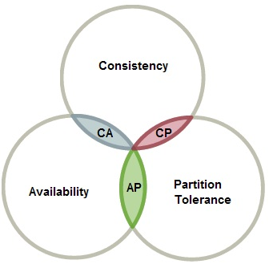
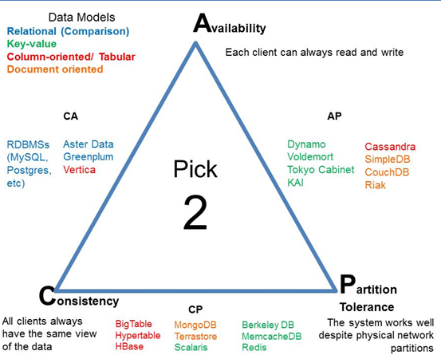

在CAP理论中，分区容错性（Partition Tolerance）是指系统能够在面对网络分区时继续正常运行的能力。网络分区是指网络中的节点无法相互通信或通信延迟很大，导致节点之间形成了隔离的子网络。

CAP理论将分布式系统的设计目标划分为三个核心属性：

1. 一致性（Consistency）：所有节点在同一时间具有相同的数据副本，即在写操作完成后，所有的读操作都能获得最新的数据。

2. 可用性（Availability）：系统在任何时候都能对请求作出响应，即系统保持可用状态，能够处理用户的请求。

3. 分区容错性（Partition Tolerance）：系统能够在面对网络分区时继续正常运行，即系统能够处理节点之间的通信中断或延迟。

CAP理论指出，在分布式系统设计中，无法同时满足一致性、可用性和分区容错性这三个属性，只能在其中选择满足两个属性。因此，根据CAP理论，**分区容错性是一个必须要考虑**的属性，因为在现实的分布式系统中，网络分区是难以避免的情况。

在面对网络分区时，系统可以采取不同的策略来保证分区容错性。一种常见的策略是采用副本复制和冗余节点，即将数据复制到不同的节点或数据中心，以确保即使在分区期间，数据仍然可用。另外，还可以使用一致性哈希算法来进行数据分片和负载均衡，以提高系统的可用性和分区容错性。

需要注意的是，分区容错性是CAP理论中的一个基本属性，对于构建稳定、可靠的分布式系统至关重要。但在实际系统设计中，仍然需要根据具体的应用场景、性能要求和业务需求，权衡不同的属性，并选择合适的设计方案。

# 三选二模型

# 根据具体业务，我们通常的作法是ap和cp
> 上文已经说过，p网络分区容错对于分布式系统是在所难免，所以一个分布式系统必须要有分区容错的能力，所以针对于这一点，就把cap分成两种实现ap和cp
* AP
  * Availability
  * Partition Tolerance
* CP
  * Consistency
  * Partition Tolerance

# cap使用场景

# 参考
https://stackoverflow.com/questions/12346326/cap-theorem-availability-and-partition-tolerance
