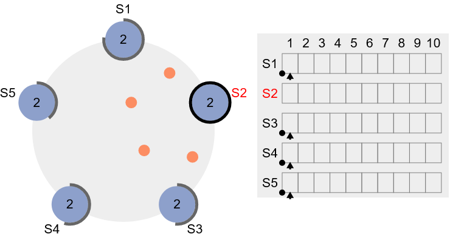
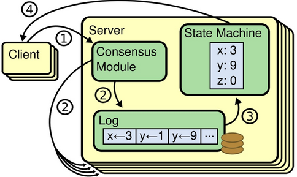
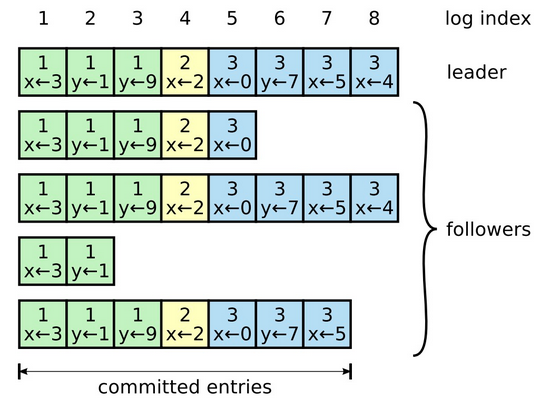
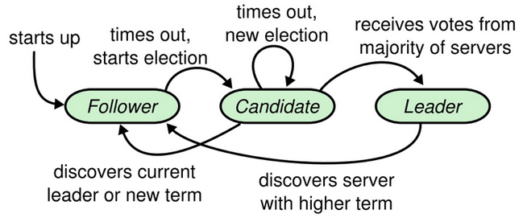

# 什么是 Raft?

Raft是一种共识算法，旨在使其易于理解。 它在容错和性能上与Paxos等效。 区别在于它被分解为相对独立的子问题，并且干净地解决了实际系统所需的所有主要部分。 我们希望Raft将使共识能够为更广泛的受众所接受，并且希望这个更广泛的受众能够开发出比当今更高质量的基于共识的系统。

# 什么是共识?

共识是容错分布式系统中的一个基本问题。 共识涉及多个服务器就价值达成一致。 一旦它们对价值做出决定，该决定就是最终决定。 当大多数服务器可用时，典型的共识算法会发挥作用。 例如，即使2台服务器出现故障，包含5台服务器的群集也可以继续运行。 如果更多服务器发生故障，它们将停止运行（但绝不会返回错误的结果）。

共识通常出现在复制状态机的背景下，复制状态机是构建容错系统的通用方法。 每个服务器都有一个状态机和一个日志。 状态机是我们要使容错的组件，例如哈希表。 对于客户端来说，即使群集中的少数服务器出现故障，它们也将与单个可靠的状态机进行交互。 每个状态机都从其日志中获取输入命令。 在我们的哈希表示例中，日志将包含将x设置为3之类的命令。共识算法用于在服务器日志中约定命令。 共识算法必须确保，如果有任何状态机将x设置为3作为第n条命令，则其他任何状态机都不会应用不同的nth命令。 结果，每个状态机处理相同系列的命令，并因此产生相同系列的结果并到达相同系列的状态。

# Raft 演示

下面是浏览器中运行的Raft集群。 您可以与之互动以查看Raft的实际使用情况。 左侧显示5台服务器，右侧显示其日志。 我们希望尽快创建一个截屏视频，以解释发生了什么。 这种演示现在仍然很糙。建议先到Raft 中文入门原理模拟中熟悉下再来实验下面的模拟。

可以在下图每个节点上右键，对该节点进行停止、重启、请求等操作，单击每个节点可查看该节点当前状态。

> [The Secret Lives of Data-CN](https://acehi.github.io/thesecretlivesofdata-cn/raft/) 是另一个演示的中文网站，它具有更多的指导性和较少的交互性，因此它可能是一个比较友好的入门演示网站。

# 架构具体介绍

## 复制状态机

Raft 算法基于 复制状态机Replicated State Machine模型，本质上就是一个管理 日志复制 的算法。

Raft 集群采用 Single Leader 架构，集群中有唯一的 Leader 进程负责管理日志复制，其职责有：

* 接受 Client 发送的请求
* 将日志记录同步到其他进程
* 告知其他进程的何时能够提交日志
  

## 日志

日志是 Raft 的核心概念。Raft 保证日志是连续且一致的，并且最终能够被所有进程按照日志索引的顺序提交。
每条日志记录包含：

* 任期term：生成该条记录的 Leader 对应的任期
* 索引index：其在日志中的顺序
* 命令command：可执行的状态机指令
  

一旦某条日志中的命令被状态机执行了，那么我们称这条记录为已提交committed，Raft 保证已提交的记录不会丢失。

## 角色

Raft集群中每个进程只能担任其中一个角色：

* 跟随者(Follower) 被动响应其他节点发送过来的请求
* 候选人(Candidate) 主动发起并参与选举
* 领导者(Leader) 发送心跳、管理日志复制与提交
  
  Raft 进程间使用 RPC 的方式进行通信，实现最基础的共识算法只需 两种RPC：
* RequestVote：用于选举产生 Leader
* AppendEntries：复制日志与发送心跳

## 算法流程

基于 Single Leader 模型，Raft 将一致性问题分解为 3 个独立的子问题：

* Leader 选举Election：Leader 进程失效后能够自动选举出一个新的 Leader
* 日志复制Replication：Leader 保证其他节点的日志与其保持一致
* 状态安全 Safety：Leader 保证状态机执行指令的顺序与内容完全一致
  为了方便理解，下面结合 动画 进行介绍。

### 选举

使用 心跳超时heartbeat timeout机制来触发 Leader 选举：

* 节点启动时默认处于Follower状态，如果Follower 超时未收到Leader心跳信息，会转换为Candidate 并向其他节点发起RequestVote请求。
* 当Candidate 收到半数以上的选票之后成为Leader，开始定时向其他节点发起AppendEntries请求以维持其Leader的地位。
* Leader失效之后停止发送心跳，Follower 的心跳超时机制又会被触发，开始新一轮的选举。

### 复制

集群中只有 Leader 对外提供服务：

* 客户端与 Leader 进行通信时，每个请求包含一条可以被状态机执行的命令。
* 当 Leader 在接收到命令之后，首先会将命令转换为一条对应的 日志记录log entry，并追加到本地的日志中。然后调用 AppendEntries 将这条日志复制到其他节点的日志中。
* 当日志被复制到过半数节点上时，Leader 会将这条日志中包含的命令 提交commit状态机执行，最后将执行结果告知客户端。

### 网络分区

使用 过半数majority机制来处理脑裂：

* 发生网络分区后，集群中可能同时出现多个 Leader，复制机制保证了最多只有一个 Leader 能够正常对外提供服务。
* 如果日志无法复制到多数节点，Leader 会拒绝提交这些日志，当网络分区消失后，集群会自动恢复到一致的状态。

## 安全性保证

* 选举时…
  * 保证新的 Leader 拥有所有已经提交的日志
    * 每个 Follower 节点在投票时会检查 Candidate 的日志索引，并拒绝为日志不完整的 Candidate 投赞成票
    * 半数以上的 Follower 节点都投了赞成票，意味着 Candidate 中包含了所有可能已经被提交的日志
* 提交日志时…
  * Leader 只主动提交自己任期内产生的日志
    * 如果记录是当前 Leader 所创建的，那么当这条记录被复制到大多数节点上时，Leader 就可以提交这条记录以及之前的记录
    * 如果记录是之前 Leader 所创建的，则只有当前 Leader 创建的记录被提交后，才能提交这些由之前 Leader 创建的日志

## 总结

* 一致性算法的本质：一致性与可用性之间的权衡。
* Raft 的优点：Single Leader 的架构简化日志管理
  * 所有日志都由 Leader 流向其他节点，无需与其他节点进行协商。其他节点只需要记录并应用 Leader 发送过来日志内容即可，将原来的两阶段请求优化为一次 RPC 调用。
* Raft 的缺点：对日志的连续性有较高要求
  * 为了简化日志管理，Raft 的日志不允许存在空隙，限制了并发性。某些应用场景下，需要通过Multi-Raft的模式对无关的业务进行解耦，从而提高系统的并发度。

# 刊物

这是Raft的论文，里面有详细的描述： [寻找一种可以理解的共识算法（扩展版）](https://acehi.github.io/raft-algorithm-cn/raft.pdf) by Diego Ongaro and John Ousterhout. A slightly shorter version of this paper received a Best Paper Award at the 2014 USENIX Annual Technical Conference.

# 参考：

* https://acehi.github.io/raft-algorithm-cn/
* https://acehi.github.io/thesecretlivesofdata-cn/raft/
* https://github.com/sofastack/sofa-jraft
* https://zhuanlan.zhihu.com/p/59385865
* https://www.cnblogs.com/buttercup/p/12903126.html
