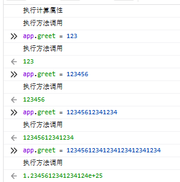

# █ Vue 基础

渐进式 javaScript 框架

- 体积小
- 更高的运行效率, 虚拟dom操作
- 双向数据绑定
- 生态丰富, 学习成本低

使用方式 

- 引入 javaScript 文件
- 命令行工具 CLI

命名规则

- js 变量名, 小驼峰
- js 方法名, 小驼峰
- html 元素, 小写连字符 kebab-case
- html attribute, 小写连字符 kebab-case
- html 事件, 小写连字符 kebab-case
- vue prop, 小写连字符 kebab-case
- vue 组件, 小写连字符 kebab-case, 以便兼容 html 自定义元素
- vue 组件选项对象, 小驼峰, 实际上是 js 变量

# 一. vue 基本特性

可以直接在 html 中通过 `<stript>` 标签引入 `vue.js`, 即可在 html 页面中使用 vue.

## 1. 声明式渲染

Vue.js 的核心是一个允许采用简洁的模板语法来声明式地将数据渲染进 DOM 的系统

比如在 dom 元素中使用 `{{变量名}}` 的格式充当占位符

```html
<div id="app">
  {{ message }}
</div>
```

然后创建一个 vue 实例, 并将该实例与 dom 元素进行绑定, vue 就会将模板替换成 vue 实例中的具体内容

```javascript
var app = new Vue({
  el: '#app',
  data: {
    message: 'Hello Vue!'
  }
})
```

## 2. 响应式修改

页面运行起来后, vue 实例就与 dom 元素app 进行了绑定, 需要修改内容时, 我们不需要直接操作dom, 只需要修改 vue 实例的内容即可. vue 实例与dom 元素的绑定关系是响应式的, 当我们操作 vue 实例的时候, dom 将被自动更新. 

比如在浏览器 console 中修改 app.message 的值, 页面上的 dom 会被同步更新.

除了直接操作 dom 元素的文本内容, vue 还允许对dom 元素的属性(attribute) 进行操作, 需要使用`v-bind:属性名` 来实现

```html
<div id="app-2">
  <span v-bind:title="message">
    鼠标悬停几秒钟查看此处动态绑定的提示信息！
  </span>
</div>
```

```javascript
var app2 = new Vue({
  el: '#app-2',
  data: {
    message: '页面加载于 ' + new Date().toLocaleString()
  }
})
```

如上所示, span 元素的title 与 vue 实例的 message 属性进行了绑定

`v-xxx` 是 html 5 的自定义属性, `v-` 表示是 vue 提供的属性, 在 vue 中被称为“**指令**”, 表示了特定的操作.

- 强制更新

  极个别情况下, 响应式修改无法触发, 这个时候你可能会需要使用`$forceUpdate`来触发强制更新.

- 静态组件

  如果一些组件不需要响应式修改, 可以通过 `v-once` 标记

## 3. 条件 v-if

```html
<div id="app-3">
  <p v-if="seen">现在你看到我了</p>
</div>
```

```js
var app3 = new Vue({
  el: '#app-3',
  data: {
    seen: true
  }
})
```

## 4. 循环 v-for

`v-for` 表示将所在元素重复循环若干遍, 属性值`item in list`, 后面的 `list` 是 vue 实例中的一个数组类型的实例域, 而前面的 `item` 则指代遍历数组时的当前元素

```html
<div id="app-4">
  <ol>
    <li v-for="item in list">
      {{ todo.text }}
    </li>
  </ol>
</div>
```

```js
var app4 = new Vue({
  el: '#app-4',
  data: {
    list: [
      { text: '学习 JavaScript' },
      { text: '学习 Vue' },
      { text: '整个牛项目' }
    ]
  }
})
```

## 5. 事件监听 v-on

可以用 `v-on` 指令添加一个事件监听器，通过它调用在 Vue 实例中定义的方法：

```html
<div id="app-5">
  <p>{{ message }}</p>
  <button v-on:click="reverseMessage">反转消息</button>
</div>
```

```js
var app5 = new Vue({
  el: '#app-5',
  data: {
    message: 'Hello Vue.js!'
  },
  methods: {
    reverseMessage: function () {
      this.message = this.message.split('').reverse().join('')
    }
  }
})
```

Vue 还提供了 `v-model` 指令，它能轻松实现表单输入和应用状态之间的双向绑定。

将输入框绑定到 vue 实例的实例域, 修改时, 会自动同步更新所有用引用该实例域的地方

```html
<div id="app-6">
  <p>{{ message }}</p>
  <input v-model="message">
</div>
```

```js
var app6 = new Vue({
  el: '#app-6',
  data: {
    message: 'Hello Vue!'
  }
})
```

## 6. 组件化应用

所谓的 vue 组件, 实际上是一个预定义的模板, 类似于web 规范的自定义元素, 方便页面的组织以及代码复用. 

使用步骤

1. 定义组件

   ```js
   Vue.component('组件名称', {
     // 参数列表, 父级组件引用当前组件时, 父级组件可以将数据作为参数, 传递到当前组件中
     props: ['todo'],
     // 组件的 html 模板
     template: '<li>{{ todo.text }}</li>'
   })
   ```

2. 以自定义元素的方式在 html 中添加组件, 也可以像普通元素一样使用 vue 指令

   ```html
   <div id="app-7">
     <ol>
       <!--
         现在我们为每个 todo-item 提供 todo 对象
         todo 对象是变量，即其内容可以是动态的。
         我们也需要为每个组件提供一个“key”，稍后再作详细解释。
       -->
       <todo-item
         v-for="item in groceryList"
         v-bind:todo="item"
         v-bind:key="item.id"
       ></todo-item>
     </ol>
   </div>
   ```

3. 创建 vue 实例, 并提供需要的内容

   ```js
   var app7 = new Vue({
     el: '#app-7',
     data: {
       groceryList: [
         { id: 0, text: '蔬菜' },
         { id: 1, text: '奶酪' },
         { id: 2, text: '随便其它什么人吃的东西' }
       ]
     }
   })
   ```

通过组件化, 子元素(组件)与父元素实现了解耦, 并能通过 `props` 接口交互, 我们可以对组件进行更复杂的操作而不会影响父元素

在一个大型应用中, 可以将页面的不同区域划分为不同的组件, 便于组织和管理, 如下所示

```html
<div id="app">
  <!-- 自定义的导航栏组件 --> 
  <app-nav></app-nav>
  <!-- 自定义的视图组件 --> 
  <app-view>
    <!-- 自定义的侧边栏组件 --> 
    <app-sidebar></app-sidebar>
    <!-- 自定义的正文内容组件 -->
    <app-content></app-content>
  </app-view>
</div>
```

### 与自定义元素的关系

vue组件的使用非常类似于 自定义元素, 因为vue 组件正是参考了该规范实现的, vue 组件实现了 实现了 [Slot API](https://github.com/w3c/webcomponents/blob/gh-pages/proposals/Slots-Proposal.md) 与 `is` attribute, 但与标准的自定义组件仍有几点区别

1. web 自定义组件规范尚未被所有浏览器原生实现, 存在一定的兼容性问题, 但 vue 组件不需要 polyfill, 在更多的浏览器下表现一致, 如 ie9+. 必要时, 也可以将 vue 组件包装成 自定义元素
2. vue 组件提供了一些自定义组件不具备的功能, 比如跨组件数据流, 自定义时间通信以及构建工具集成.

虽然 Vue 内部没有使用自定义元素，不过在应用使用自定义元素、或以自定义元素形式发布时，[依然有很好的互操作性](https://custom-elements-everywhere.com/#vue)。Vue CLI 也支持将 Vue 组件构建成为原生的自定义元素。

# 二. vue 实例

每个 vue 应用都是一个 vue 实例, 该 vue 实例可包含若干个组件. 

创建 vue 实例时, 需要提供一个 选项对象, vue 可以根据选项来修改 vue 实例的行为

```js
var vm = new Vue({
  // 选项列表
})
```

由于 vue 应用可以包含若干个组件, 而所有 vue 组件都是 vue 实例, 此处传入的选项对象, 将被所有的组件共享(一些根实例特有的选项除外)

## 1. 数据和方法

创建 vue 实例时, data 选项需要一个数据对象, 该数据对象的所有 property 将被添加到 vue 的响应式系统中, 修改vue 实例中的属性值, 或是修改原始对象的属性值, 都将引发另一个对象的修改, 并反映到视图中(更新为新的值)

```js
// 我们的数据对象
var vueData = { a: 1 }

// 该对象被加入到一个 Vue 实例中
var vm = new Vue({
  data: vueData
})

// 这个vue实例上的 property, 与原始数据对象中的值保持一致
vm.a == data.a // => true

// 设置 vue实例的property 也会影响到原始数据对象
vm.a = 2
data.a // => 2

// 反之亦然, 修改原始数据对象会影响 vue 实例中的值
data.a = 3
vm.a // => 3
```

当这些数据改变时，视图会进行重渲染。值得注意的是只有当实例被创建时就已经存在于 `data` 中的 property 才是**响应式**的。也就是说如果你添加一个新的 property，这个新 property 的修改不会触发任何视图的更新. 

如果提前知晓后续需要使用某个 property, 但当前没有具体的值, 仍需要在创建 vue 实例的时候提供一个占位的变量并设置初始值.

```js
data: {
  newTodoText: '',
  visitCount: 0,
  hideCompletedTodos: false,
  todos: [],
  error: null
}
```

### 冻结

由于原始数据对象与 vue 实例进行了关联, 任意修改都会同步到另一方. 但有时候我们不希望数据被修改, 这时需要在创建 vue 实例之前调用 `Object.freeze(原始对象)` 来冻结对象, 禁止任何修改. 

```js
var obj = {
  foo: 'bar'
}

// 冻结原始对象
Object.freeze(obj)

new Vue({
  el: '#app',
  data: obj
})
```

```html
<div id="app">
  <p>{{ foo }}</p>
  <!-- 这里的 `foo` 不会更新！ -->
  <button v-on:click="foo = 'baz'">Change it</button>
</div>
```

### 其他 property

除了初始化 vue 实例式提供的数据参数, vue 实例还暴露了一些有用的实例属性与方法. 

vue 预设的属性与方法带`$`前缀, 以便和用户定义的属性区分开来

```js
var data = { a: 1 }
var vm = new Vue({
  el: '#example',
  data: data
})

vm.$data === data // => true
vm.$el === document.getElementById('example') // => true

// $watch 是一个实例方法
vm.$watch('a', function (newValue, oldValue) {
  // 这个回调将在 `vm.a` 改变后调用
})
```

## 2. 生命周期

每个 Vue 实例在被创建时都要经过一系列的初始化过程——例如，需要设置数据监听、编译模板、将实例挂载到 DOM 并在数据变化时更新 DOM 等。同时在这个过程中也会运行一些叫做**生命周期钩子**的函数，这给了用户在不同阶段添加自己的代码的机会。

可以在初始化 vue 实例的时候, 在选项对象中通过指定property 提供函数, 这些函数将会在合适的生命周期阶段中被执行. 其中 `this` 关键字指向调用它的 vue 实例

> 由于 vue 组件会继承父元素的选项对象, 那么生命周期钩子会被每个组件执行? 

```js
new Vue({
  data: {
    a: 1
  },
  // 声明周期钩子, 在实例被创建后执行
  created: function () {
    // `this` 指向 vm 实例
    console.log('a is: ' + this.a)
  }
})
// => "a is: 1"
```

注意, 使用vue 时不要在property 或者回调中使用箭头函数(函数式编程), 因为箭头函数没有 `this`, 经常会导致错误.


# 三. vue 语法

Vue.js 使用了基于 HTML 的模板语法，允许开发者声明式地将 DOM 绑定至底层 Vue 实例的数据。所有 Vue.js 的模板都是合法的 HTML，所以能被遵循规范的浏览器和 HTML 解析器解析。

在底层的实现上，Vue 将模板编译成虚拟 DOM 渲染函数。结合响应系统，Vue 能够智能地计算出最少需要重新渲染多少组件，并把 DOM 操作次数减到最少。

## 插值

### 文本

使用 `Mustache` 语法, 即 `{{双大括号占位符}}` 进行文本插值, 默认情况下该值会与指定变量同步更新

若只需要初始化一次, 后续不再改变, 可以使用 `v-once` 指令

```html
<span>Message: {{ msg }}</span>
<span v-once>这个将不会改变: {{ msg }}</span>
```

### 原始html

双大括号会将数据解释为文本, 而非 html 代码, 如果需要插入 html, 可以使用 `v-html` 指令, 通过指令值来指代要插入的 html

```html
<p>Using mustaches: {{ rawHtml }}</p>
<p>Using v-html directive: <span v-html="rawHtml"></span></p>
```

注意, 不能使用 v-html 来复合嵌套局部模板, 因为 vue 不是基于字符串的模板引擎, 这种用户界面上的模板应该使用vue组件来实现. 

另外, html 插入可能会带来 xss 攻击的风险, 请不要对用户提供的内容使用 html 插值

### Attribute

双大括号也不能用在 attribute 上, 此时应该使用 `v-bind` 指令

对于布尔类型的 attribute (存在即为true的, 如 checked, readonly, disable 等), 若 `v-bind` 得到的值是 `null`, `undefined`, `false`, 则 vue 会省略该属性, 不会渲染到 html 中. 

```html
<div v-bind:id="dynamicId"></div>
<button v-bind:disabled="isButtonDisabled">Button</button>
```

### js表达式

双大括号不仅支持vue 实例中已有的属性, 也允许通过 js 表达式对已有属性进行运算

但仅支持单个表达式, 不支持复杂的代码块或者js语句.

```html
<!-- 支持 js 表达式 -->
{{ number + 1 }}
{{ ok ? 'YES' : 'NO' }}
{{ message.split('').reverse().join('') }}
<div v-bind:id="'list-' + id"></div>

<!-- 不支持 js 语句 -->
{{ var a = 1 }}
<!-- 不支持代码块 -->
{{ if (ok) { return message } }}
```

注意 模板表达式都被放在沙盒中，只能访问[全局变量的一个白名单](https://github.com/vuejs/vue/blob/v2.6.10/src/core/instance/proxy.js#L9)，如 `Math` 和 `Date` 。你不应该在模板表达式中试图访问用户定义的全局变量。

## 指令

指令 (Directives) 是带有 `v-` 前缀的特殊 attribute。指令 attribute 的值预期是**单个 JavaScript 表达式** (`v-for` 是例外情况，稍后我们再讨论)。指令的职责是，当表达式的值改变时，将其产生的连带影响，响应式地作用于 DOM。

### 参数

一些指令能够接收一个“参数”，在指令名称之后以冒号表示。例如，`v-bind` 指令可以用于响应式地更新 HTML attribute：

> v-指令:**参数**=值

```html
<!-- href 是参数, 告知vue将当前元素的 href attribute 与 url 绑定-->
<a v-bind:href="url">...</a>

<!-- 在这里参数是监听的事件名。我们也会更详细地讨论事件处理。 -->
<a v-on:click="doSomething">...</a>
```

### 动态参数

从 2.6.0 开始, 允许使用方括号 `[动态参数名]`, 其中括号内的动态参数名是一个变量, 可以在运行时决定要使用的具体参数名

```html
<a v-bind:[attributeName]="url"> ... </a>
```

若 vue 实例包名为`attributeName`的属性, 且值为`href`, 则此表达式等价于

```html
<a v-bind:href="url"> ... </a>
```

还可以使用动态参数为一个动态的事件名绑定处理函数

```vue
<a v-on:[eventName]="doSomething"> ... </a>
```

### 动态参数数的约束

1. 动态参数预期会求出一个字符串，异常情况下值为 `null`。这个特殊的 `null` 值可以被显性地用于移除绑定。任何其它非字符串类型的值都将会触发一个警告。

2. 某些字符，如空格和引号，放在 HTML attribute 名里是无效的。变通的办法是使用没有空格或引号的表达式，或用计算属性替代这种复杂表达式。

   ```vue
   <!-- 在动态属性中使用引号和空格 -->
   <a v-bind:['foo' + bar]="value"> ... </a>
   <!-- 使用计算属性替代 -->
   <a v-bind:[calVal]="value"> ... </a>
   ```

3. 在 DOM 中使用模板时 (直接在一个 HTML 文件里撰写模板)，还需要避免使用大写字符来命名键名，因为浏览器会把 attribute 名全部强制转为小写

### 修饰符

修饰符 (modifier) 是以半角句号 `.` 指明的特殊**后缀**，用于指出一个指令应该以特殊方式绑定。例如，`.prevent` 修饰符告诉 `v-on` 指令对于触发的事件调用 `event.preventDefault()`：

```html
<form v-on:submit.prevent="onSubmit">...</form>
```

## 缩写

`v-` 前缀对于识别 vue 属性来说非常方便, 但频繁输入前缀也会略显繁琐, 因此, vue 针对最常用的 `v-bind` 和 `v-on` 提供了缩写形式

- `v-bind:`xxx  => `:`xxx

  ```html
  <!-- 完整语法 -->
  <a v-bind:href="url">...</a>
  
  <!-- 缩写 -->
  <a :href="url">...</a>
  
  <!-- 动态参数的缩写 (2.6.0+) -->
  <a :[key]="url"> ... </a>
  ```

- `v-on:`yyy=> `@`yyy

  ```html
  <!-- 完整语法 -->
  <a v-on:click="doSomething">...</a>
  
  <!-- 缩写 -->
  <a @click="doSomething">...</a>
  
  <!-- 动态参数的缩写 (2.6.0+) -->
  <a @[event]="doSomething"> ... </a>
  ```

## 计算属性和侦听器

虽然 vue 允许在双大括号模板内使用表达式, 但设计初衷是用于简单运算的, 放入太多逻辑会使模板难以计算. 这种功能情况下, 建议使用 vue 提供的计算属性.

计算属性是指构建 vue 实例时, 在选项对象中通过 `computed` 属性指定计算逻辑, 之后就可以像绑定普通 property 一样在模板中绑定计算属性, 并且 vue 知道计算属性基于哪个原始属性, 修改原始属性时会同步更新计算属性的引用点

```js
var vm = new Vue({
  el: '#example',
  data: {
    message: 'Hello'
  },
  // 定义计算属性的运算逻辑
  computed: {
    // 计算属性的 getter
    reversedMessage: function () {
      // `this` 指向 vm 实例
      return this.message.split('').reverse().join('')
    }
  }
})
```

```html
<div id="example">
  <p>Original message: "{{ message }}"</p>
  <p>Computed reversed message: "{{ reversedMessage }}"</p>
</div>
```

#### 计算属性 vs 调用方法

```vue
<p>Reversed message: "{{ reversedMessage() }}"</p>
```

直接封装一个方法, 在模板内调用方法也可以实现与计算属性相同的效果, 区别在于计算属性会**建立缓存**, 确实需要重新计算时才会执行计算逻辑. 而调用方法则是每次渲染时都会重新运算



#### 计算属性的 setter

默认情况下, 计算属性只提供 getter, 但 vue 也允许为计算属性提供 setter, 并使用 setter 更新对应的原始属性

```javascript
// ...
computed: {
  fullName: {
    // getter
    get: function () {
      return this.firstName + ' ' + this.lastName
    },
    // setter
    set: function (newValue) {
      var names = newValue.split(' ')
      this.firstName = names[0]
      this.lastName = names[names.length - 1]
    }
  }
}
// ...
```

#### 侦听器

虽然计算属性在大多数情况下足够方便，但有时也需要一个自定义的侦听器。

Vue 通过 `watch` 选项提供了一个更通用的方法，来响应数据的变化。当需要在数据变化时执行**异步**或**开销较大**的操作时，这个方式更合适。

使用 `watch` 选项允许我们执行异步操作 (访问一个 API)，限制我们执行该操作的频率，并在我们得到最终结果前，设置中间状态。这些都是计算属性无法做到的。

除了 `watch` 选项之外，您还可以使用命令式的 [vm.$watch API](https://cn.vuejs.org/v2/api/#vm-watch)。

#### 计算属性 vs 侦听属性

vue 提供了另一种方式来跟随数据变动 `watch` 侦听属性, 在不同情况下可以选择不同的方式

```js
var vm = new Vue({
    el: '#demo',
    data: {
        firstName: 'Foo',
        lastName: 'Bar',
        fullNameViaWatch: 'Foo Bar',
        fullNameViaComputed: 'Foo Bar'
    },
    // 侦听属性
    watch: {
        firstName: function (val) {
            this.fullNameViaWatch = val + ' ' + this.lastName
        },
        lastName: function (val) {
            this.fullNameViaWatch = this.firstName + ' ' + val
        }
    },
    // 计算属性
    computed: {
        fullNameViaComputed: function () {
            return this.firstName + ' ' + this.lastName
        }
    }
})
```

## class

在将 `v-bind` 用于 `class` 和 `style` 时，Vue.js 做了专门的增强

### 通过对象声明

我们可以传给 `v-bind:class` 一个对象, 当相应class需要的变量为true时, 会动态地切换 class：

> {class : 变量, class2: 变量2}

```html
<div v-bind:class="{ active: isActive }"></div>
```

上面的语法表示 `active` 这个 class 存在与否将取决于数据 property `isActive` 的 [truthiness](https://developer.mozilla.org/zh-CN/docs/Glossary/Truthy)。

你可以在对象中传入更多字段来动态切换多个 class。此外，`v-bind:class` 指令也可以与普通的 class attribute 共存。当有如下模板和数据

```html
<div
  class="static"
  v-bind:class="{ active: isActive, 'text-danger': hasError }"
></div>
```

```js
var data = {
  isActive: true,
  hasError: false
}
```

结果会渲染为

```html
<div class="static active"></div>
```

绑定的数据对象不必内联定义在模板里, 可以使用 vue 实例的数据：

```html
<div v-bind:class="classObject"></div>
```

```js
var vm = new Vue({
    data: {
        classObject: {
            active: true,
            'text-danger': false
        }
    }
})
```

也可以结合计算属性使用

```js
data: {
  isActive: true,
  error: null
},
computed: {
  classObject: function () {
    return {
      active: this.isActive && !this.error,
      'text-danger': this.error && this.error.type === 'fatal'
    }
  }
}
```

### 通过数组声明

可以使用数组传入多个确定的class, 但应注意数组元素均是 vue 实例中声明的属性, 不能直接使用 class 名

比如当有以下数据时

```json
{
  activeClass: 'active',
  errorClass: 'text-danger'
}
```

可以通过以下方式传入数组

```html
<!-- 直接引用数据变量 -->
<div v-bind:class="[activeClass, errorClass]"></div>
<!-- 结合三元运算符, 可以根据条件添加 -->
<div v-bind:class="[isActive ? activeClass : '', errorClass]"></div>
<!-- 可以在数组中使用对象语法 -->
<div v-bind:class="[{ active: isActive }, errorClass]"></div>
```

结果会被渲染成

```html
<div class="active text-danger"></div>
```

### 用在组件上

在子组件上使用 `v-bind:class` 时, class 将被添加到子组件模板的**根元素**中, 也允许在组件上使用对象/数组语法添加 class

## style

### 通过对象声明

`v-bind:style` 的对象语法十分直观——看着非常像 CSS，但其实是一个 JavaScript 对象。CSS property 名可以用驼峰式 (camelCase) 或短横线分隔 (kebab-case，记得用引号括起来) 来命名, 直接绑定到一个样式对象通常更好，这会让模板更清晰

```html
<div v-bind:style="styleObject"></div>
```

```js
data: {
  styleObject: {
    color: 'red',
    fontSize: '13px'
  }
}
```

### 通过数组声明

可以通过数组, 指定多个不同的 style 对象, 即可将多个样式叠加到一个元素上

```html
<p v-bind:style="[styleObject, bigFont]">数组语法, 引用多个 style 对象</p>
```

### 兼容性

- **自动添加前缀**

  对于需要添加浏览器前缀的 css 属性, vue.js 会自动检测浏览器类型并添加合适的前缀, 保证兼容性

- **多重值**

  可以在 style 对象的 value 中以数组形式指定多个值, 则浏览器最终会取**最后一个**支持的值

  ```html
  <!-- 若浏览器支持不带浏览器前缀的 flexbox，那么就只会渲染 display: flex -->
  <div :style="{ display: ['-webkit-box', '-ms-flexbox', 'flex'] }"></div>
  ```

## 条件渲染

### v-if

vue 提供了 `v-if`, `v-else`, `v-eles_if` 等指令, 所在的元素只会在条件满足时才渲染,

因为 `v-if` 等指令只能放在元素上, 若需要对一组元素以相同条件决定是否渲染, 可以用一个不可见的 `<template>` 元素将要渲染的内容元素包裹起来, 在`<template>` 元素上使用 `v-if` 指令.

```html
<template v-if="ok">
  <h1>Title</h1>
  <p>Paragraph 1</p>
  <p>Paragraph 2</p>
</template>
```

`v-else`, `v-else-if` 指令必须紧跟在 `v-if` 元素后面, 否则不会识别

#### 用 key 管理可复用的元素

为了尽可能高效的渲染元素, vue 通常会复用已有元素而不是从头开始渲染. 这样不仅可以提高效率, 还可以在不同模式中切换并保留用户输入, 改善用户体验. 

```html
<template v-if="loginType === 'username'">
  <label>Username</label>
  <input placeholder="Enter your username">
</template>
<template v-else>
  <label>Email</label>
  <input placeholder="Enter your email address">
</template>
```

如上所示, 切换模式时文本框将被复用, 用户输入也被保留, 仅替换了 placeholder.

如果不希望元素复用, 则需要为元素添加唯一 key, 以标识该元素不能复用.

```html
<template v-if="loginType === 'username'">
  <label>Username</label>
  <input placeholder="Enter your username" key="username-input">
</template>
<template v-else>
  <label>Email</label>
  <input placeholder="Enter your email address" key="email-input">
</template>
```

### v-show

`v-show` 指令也可以根据条件展示元素, 与 `v-if` 的区别在于`v-show`总会在 html 中渲染元素, 仅切换元素的`display` 属性.

一般来说，`v-if` 有更高的切换开销(切换时要重新渲染)，而 `v-show` 有更高的初始渲染开销(初始化时渲染所有内容)。因此，如果需要非常频繁地切换，则使用 `v-show` 较好；如果在运行时条件很少改变，则使用 `v-if` 较好。

## 循环与遍历

### v-for 遍历数组

我们可以用 `v-for` 指令基于一个数组来渲染一个列表。`v-for` 指令需要使用 `item in items` 形式的特殊语法，其中 `items` 是源数据数组，而 `item` 则是被迭代的数组元素的**别名**。也可以用 `of` 替代 `in` 作为分隔符，因为它更接近 JavaScript 迭代器的语法：

> v-for=“循环变量 in/of 列表/数组”

```html
<ul id="example-1">
  <li v-for="item in items" :key="item.message">
    {{ item.message }}
  </li>
</ul>
```

`v-for` 还支持一个可选的第二个参数，即当前项的索引

> v-for=“(循环变量, 索引序号) in/of 列表/数组”

### v-for 遍历对象属性

除了用了遍历数组/列表, `v-for` 也可以用来遍历一个对象的所有属性, 

> v-for=“属性值变量 in/of 对象”
>
> v-for=“(属性值变量, 属性名变量) in/of 对象”
>
> v-for=“(属性值变量, 属性名变量, 索引序号 in/of 对象”

```html
<ul>
    <li v-for="val in person">{{val}}</li>
</ul>
<ul>
    <li v-for="(val,key) in person">{{val}}</li>
</ul>
<ul>
    <li v-for="val in person">{{val}}</li>
</ul>
```

```js
person : {
    name: '谢霆锋',
    age: '38',
    job: '歌手',
    address: '香港'
}
```

### v-for 指定次数循环

可以指定一个具体的循环次数, vue 会将模板重复指定的次数

```html
<div>
  <span v-for="n in 10">{{ n }} </span>
</div>
```

### 维护状态

vue 通过 `Object.keys()` 的结果顺序进行遍历渲染, 但不能保证在所有 js 引擎中保持一样的顺序

当 vue 需要更新 v-for 的列表时, 默认采用就地更新的策略, 不会移动dom元素的顺序. 这样的策略虽然比较高效, 但是**只适用于不依赖子组件状态或临时 DOM 状态 (例如：表单输入值) 的列表渲染输出**。

因此, vue 建议为每项都添加一个 key  属性, 以便 vue 能跟踪每个节点的身份，从而重用和重新排序现有元素.

```html
<div v-for="item in items" v-bind:key="item.id">...</div>
```

### 数组/预处理

有时候需要对数据进行过滤或者排序, 这个时候建议添加一个计算属性, 然后遍历这个处理后的结果数组, 而不是直接在模板中对原始数组进行处理.

vue 支持 `v-for` 和 `v-if` 一起用, vue 中 `v-for` 的优先级更高, 因此可以实现对遍历元素进行 if 判断, 从而实现渲染数组中某些满足特定条件的元素. **但不建议采用这种做法, 应直接在计算属性的方法中处理**

```html
<li v-for="todo in todos" v-if="!todo.isComplete">
  {{ todo }}
</li>
```

## 事件处理

### 监听事件

可以用 `v-on` 指令监听 DOM 事件，并在触发时运行一些 JavaScript 代码

```html
<div id="example-1">
    <button v-on:click="counter += 1">Add 1</button>
    <p>The button above has been clicked {{ counter }} times.</p>
</div>

<script>
    var example1 = new Vue({
        el: '#example-1',
        data: {
            counter: 0
        }
    })
</script>
```

### 事件处理方法

然而许多事件处理逻辑会更为复杂，所以直接把 JavaScript 代码块写在 `v-on` 指令中是不可行的。因此 `v-on` 还可以接收一个需要调用的方法名称。

该方法需要在创建 vue 实例时, 通过 `methods` 选项声明, `$event` 可以在调用时传入原始 dom 事件对象

```html
<div id="example-2">
    <!-- 通过方法名进行事件绑定 -->
    <button v-on:click="greet">Greet</button>
    <!-- 通过js进行方法调用 -->
    <button v-on:click="greet(message)">Greet</button>
    <!-- $event 可以传入原始dom事件对象 -->
    <button v-on:click="greet(message, $event)">Greet</button>
</div>

<script>
    var example2 = new Vue({
        el: '#example-2',
        data: {
            name: 'Vue.js'
        },
        // 在 `methods` 对象中定义方法
        methods: {
            greet: function (msg, e){
                if (msg === this.message) {
                    alert('通过方法调用, 参数:' + msg);
                } else {
                    alert('绑定方法名, 没有传参');
                }
                // 可以方法原始 dom 对象
                console.log(e);
            }
        }
    })

    // 通过 methods 声明的方法, 也可以在其他地方通过 vue 实例进行调用 
    example2.greet();
</script>
```

### 事件修饰符

虽然可以通过 `$event` 将原始 dom 事件对象传入方法中, 以便直接操作事件对象. 

但 vue 认为更好的方式是: 方法应该专注于数据逻辑处理, 对 dom 事件的处理则通过事件修饰符来完成

前面介绍vue指令的时候提及过, 修饰符是由点开头的指令后缀来表示的。

```html
<!-- 阻止单击事件继续传播 -->
<a v-on:click.stop="doThis"></a>

<!-- 提交事件不再重载页面 -->
<form v-on:submit.prevent="onSubmit"></form>

<!-- 修饰符可以串联 -->
<a v-on:click.stop.prevent="doThat"></a>

<!-- 只有修饰符 -->
<form v-on:submit.prevent></form>

<!-- 添加事件监听器时使用事件捕获模式 -->
<!-- 即内部元素触发的事件先用这里的方法处理，然后才交由内部元素进行处理 -->
<div v-on:click.capture="doThis">...</div>

<!-- 只当在 event.target 是当前元素自身时触发处理函数 -->
<!-- 即事件不是从内部元素/子组件触发的 -->
<div v-on:click.self="doThat">...</div>
```

使用修饰符时，顺序很重要；相应的代码会以同样的顺序产生。因此，用 `v-on:click.prevent.self` 会阻止**所有的点击**，而 `v-on:click.self.prevent` 只会阻止对元素自身的点击。

### 按键修饰符

你可以直接将 [`KeyboardEvent.key`](https://developer.mozilla.org/en-US/docs/Web/API/KeyboardEvent/key/Key_Values)(即`$event.key`) 暴露的任意有效按键名(转换为 kebab-case 形式)来作为修饰符。此时只有指定按键的事件才会调用绑定方法.

``` html
<!-- 只有在 `key` 是 `Enter` 时调用 `vm.submit()` -->
<input v-on:keyup.enter="submit">
<!-- 只有在 `key` 是 `pageDown` 时调用 `onPageDown` -->
<input v-on:keyup.page-down="onPageDown">

<!-- 也可以使用 keyCode 作为修饰符, 但因为 keyCode 方法已废弃, 不建议使用 -->
<input v-on:keyup.13="submit">
```

### 系统修饰符

为了支持组合键, vue 提供了几个组合键的修饰符. 

- `.ctrl`
- `.alt`
- `.shift`
- `.meta` (command@Mac, win@windows)

请注意修饰键与常规按键不同，在和 `keyup` 事件一起用时，事件触发时修饰键必须处于按下状态。换句话说，只有在按住 `ctrl` 的情况下释放其它按键，才能触发 `keyup.ctrl`。而单单释放 `ctrl` 也不会触发事件。如果你想要这样的行为，请为 `ctrl` 换用 `keyCode`：`keyup.17`。

```html
<!-- Alt + C -->
<input v-on:keyup..67="clear">

<!-- Ctrl + Click -->
<div v-on:click.ctrl="doSomething">Do something</div>
```

`.exact` 修饰符允许你控制由精确的系统修饰符组合触发的事件。

```html
<!-- 默认只要按下了ctrl就能触发, 比如 ctrl+alt 或 ctrl+shift同时按下时也会触发 -->
<button v-on:click.ctrl="onClick">A</button>

<!-- 有且只有 Ctrl 被按下的时候才触发 -->
<button v-on:click.ctrl.exact="onCtrlClick">A</button>

<!-- 没有任何系统修饰符被按下的时候才触发 -->
<button v-on:click.exact="onClick">A</button>
```

对于鼠标按键, `.left`/`.right`/`.middle` 会限制处理函数仅响应特定的鼠标按键:

## 表单输入绑定

### 基础用法

你可以用 `v-model` 指令在表单 `<input>`、`<textarea>` 及 `<select>` 元素上创建双向数据绑定。它会根据控件类型自动选取正确的方法来更新元素。尽管有些神奇，但 `v-model` 本质上不过是语法糖。它负责监听用户的输入事件以更新数据，并对一些极端场景进行一些特殊处理。

`v-model` 会忽略所有表单元素的 `value`、`checked`、`selected` attribute 的初始值而总是将 Vue 实例的数据作为数据来源。你应该通过 JavaScript 在组件的 `data` 选项中声明初始值。

```html
<!-- 文本 -->
<input v-model="message" placeholder="edit me">
<p>Message is: {{ message }}</p>

<!-- 多行文本, 在文本区域插值 (<textarea>{{text}}</textarea>) 无效，应用 v-model 来代替。  -->
<span>Multiline message is:</span>
<p style="white-space: pre-line;">{{ message }}</p>
<br>
<textarea v-model="message" placeholder="add multiple lines"></textarea>

<hr>
<p>单个复选框(是否勾选), 绑定到一个布尔变量: {{ checked }}</p>
<input type="checkbox" id="checkbox" v-model="checked">
<label for="checkbox">是否勾选</label>

<hr>
<p>多个复选框, 绑定到一个数组: {{checkedNames}}</p>
<input type="checkbox" id="jack" value="jack" v-model="checkedNames">
<label for="jack">jack</label>
<input type="checkbox" id="lucy" value="lucy" v-model="checkedNames">
<label for="lucy">lucy</label>
<input type="checkbox" id="tony" value="tony" v-model="checkedNames">
<label for="tony">tony</label>

<hr>
<p>单选: {{radioVal}}</p>
<input type="radio" id="radio-yes" value="yes" v-model="radioVal">
<label for="radio-yes">yes</label>
<input type="radio" id="radio-no" value="no" v-model="radioVal">
<label for="radio-no">no</label>

<hr>
<p>下拉选-单选, 绑定到一个值, 建议提供一个值为空的默认选项</p>
<div id="example-5">
    <select id="selectBox" v-model="selected">
        <option value="">请选择</option>
        <option value="A">A</option>
        <option value="B">B</option>
        <option value="C">C</option>
    </select>
    <label for="selectBox"><span>Selected: {{ selected }}</span></label>
</div>

<hr>
<div>
    <p>下拉选-多选, 绑定到一个数组</p>
    <select id="multiSelectBox" v-model="multiSelectVal" multiple style="width: 50px;">
        <option value="A">A</option>
        <option value="B">B</option>
        <option value="C">C</option>
    </select>
    <label for="multiSelectBox"><span>Selected: {{ multiSelectVal }}</span></label>
</div>

<hr>
<div>
    <p>下拉选-单选, 动态渲染选项, 注意此时select元素用model绑定选中值, option 用value绑定选项值</p>
    <select id="selectBox2" v-model="optionsPicked">
        <option v-for="option in options" v-bind:value="option.value">
            {{ option.text }}
        </option>
    </select>
    <label for="selectBox2"><span>Selected: {{ optionsPicked }}</span></label>
</div>

<hr>
<div>
    <p>下拉选-多选, 动态渲染选项, 注意此时select元素用model绑定选中值, option 用value绑定选项值</p>
    <select id="multiSelectBox2" v-model="optionsPicked2" multiple style="width: 50px;">
        <option v-for="option in options" v-bind:value="option.value">
            {{ option.text }}
        </option>
    </select>
    <label for="multiSelectBox2"><span>Selected: {{ optionsPicked2 }}</span></label>
</div>
```

### 值绑定

对于单选按钮，复选框及选择框的选项，`v-model` 绑定的值通常是静态字符串 (对于复选框也可以是布尔值)：

但是有时我们可能想把值绑定到 Vue 实例的一个动态 property 上，这时可以用 `v-bind` 实现，并且这个 property 的值可以不是字符串。

```html
<input type="checkbox" v-model="toggle" true-value="yes" false-value="no">
// 当选中时
vm.toggle === 'yes'
// 当没有选中时
vm.toggle === 'no'

<input type="radio" v-model="pick" v-bind:value="a">
// 当选中时
vm.pick === vm.a

<select v-model="selected">
    <!-- 内联对象字面量 -->
  <option v-bind:value="{ number: 123 }">123</option>
</select>
// 当选中时
typeof vm.selected // => 'object'
vm.selected.number // => 123
```

### 修饰符

- `.lazy` 在“change”时而非“input”时更新

  ```html
  <input v-model.lazy="msg">
  ```

- `.number` 自动将用户的输入值转为数值类型

  ```html
  <input v-model.number="age" type="number">
  ```

- `.trim` 自动过滤用户输入的首尾空白字符

  ```html
  <input v-model.trim="msg">
  ```

  

# 四. vue 组件

## 1. 组件注册

- 第一个参数是组件名称, 使用组件时作为自定义元素名
- 第二个参数是配置对象
  - data, 需要一个函数, 以便不同实例可以隔离
  - props, 从父组件获取数据的形参
  - template, html 模板代码

组件是可复用的 Vue 实例，且带有一个名字：在这个例子中是 `<button-counter>`。我们可以在一个通过 `new Vue` 创建的 Vue 根实例中，把这个组件作为自定义元素来使用：

因为组件实际上也是 Vue 实例，所以组件可以接受与 `new Vue` 接收相同的选项对象，例如 `data`、`computed`、`watch`、`methods` 以及生命周期钩子等。仅有的例外是像 `el` 这样根实例特有的选项。

你可以将组件进行任意次数的复用, 因为 `data` 选项接受一个函数, 组件间的数据相互隔离

### 1.1. 组件名称

建议全小写且带连字符的组件名, 以便于常规 html 元素区分

### 1.2. 全局注册

即通过 `Vue.component(...)` 这个方法将组件注册到 vue 中, 它们在注册之后可以用在任何新创建的 Vue 根实例 (`new Vue`) 的模板中。

```js
Vue.component('my-component-name', {
  // ... 选项 ...
})
```

### 1.3. 局部注册

全局注册的组件往往不够灵活, 比如使用事先准备好的组件库时, 若全部组件都是全局注册的, 那么对于一个具体应用而言可能会有很多没用到的组件, 但全局组件的相关注册信息都会保留在 js 代码中, 会增加用户下载 js 文件时的网络开销.

Vue 提供了组件的局部注册, 以便在构建项目时选择性地编译真正有用的组件

1. 在一个普通的 js 文件中定义多个组件的选项对象

   ```js
   var ComponentA = { /* ... */ }
   var ComponentB = { /* ... */ }
   var ComponentC = { /* ... */ }
   ```

2. 在创建 vue 实例时, 通过 `components` 属性添加真正要用的组件, 其中 property 形如 `组件名: 选项对象`

   ```js
   new Vue({
     el: '#app',
     components: {
       'component-a': ComponentA,
       'component-b': ComponentB
     }
   })
   ```

3. 如果希望在某个局部组件中中使用其他的局部组件, 需要在局部组件的选项对象中注册要用的局部组件

   ```js
   // 如果希望在 ComponentB 中使用 ComponentA
   // 需要在 ComponentB 的选项对象中用 components 属性注册 ComponentA
   var ComponentA = { /* ... */ }
   var ComponentB = {
     components: {
       'component-a': ComponentA
     },
     // ...
   }
   ```

### 1.4. 匿名组件

在使用动态组件时, 我们知道 `is` attribute 可以接受一个选项对象而不是一个已注册的组件名. 通过这种方式激活的组件, 没有具体的组件名, 也不便于复用. 


## 2. 组件的组织

通常一个应用会以一棵嵌套的组件树的形式来组织, 每个组件又包含了其它的像导航链接、博文之类的组件。


为了能在模板中使用，这些组件必须**先注册**以便 Vue 能够识别。这里有两种组件的注册类型：**全局注册**和**局部注册**。至此，我们的组件都只是通过 `Vue.component` 全局注册的：

全局注册的组件可以用在其被**注册之后**的任何 (通过 `new Vue`) 新创建的 Vue 根实例，也包括其组件树中的所有子组件的模板中。

到目前为止，关于组件注册你需要了解的就这些了，如果你阅读完本页内容并掌握了它的内容，我们会推荐你再回来把[组件注册](https://cn.vuejs.org/v2/guide/components-registration.html)读完。

vue组件的 template 选项要求模板中只有一个根元素, 如果需要使用多种内容, 请使用一个根元素将内容包裹起来

### 内联模板

如果使用子组件时, 提供了 `inline-template` 这个attribute, 则组件的内容会作为当前的模板, 组件注册时预定义的 template 将被忽略, 并且此时组件内的作用域在子组件内, 使用了子组件的数据. 

这一点会让人有点疑惑, 因此不太建议使用

```js
Vue.component(`comp`, {
    data: function (){
        return {msg: '子组件内的数据'}
    },
    template:`<div>子组件本身的模板</div>`});
var app = new Vue({
    el: '#app',
    data: {msg: '父组件内的数据'},
    template: ` <comp inline-template><p>这里的数据是谁的呢? {{msg}}</p></comp> `
})
```

### X-Template

另一个定义模板的方式是在一个 `<script>` 元素中，并为其带上 `text/x-template` 的类型，然后通过一个 `id` 将模板引用过去。例如：

```html
<script type="text/x-template" id="hello-world-template">
  <p>Hello hello hello</p>
</script>
```

```js
Vue.component('hello-world', {
  template: '#hello-world-template'
})
```

一般情况下请避免使用，因为这会将模板和该组件的其它定义分离开。

## 3. 通过 prop 传递数据

定义组件时, 选项对象中可以提供一个 props 属性(可以包含多个 prop), 用来声明形参

引用组件时, 父组件中可以通过 `v-bind`指令将具体数据绑定到子组件的 prop 中, 从而实现向子组件传递数据

```html
<todo-item v-for="item in list" v-bind:todo="item" v-bind:key="item.id"></todo-item>
```

如果需要传递的 prop 比较多, 在引用组件时需要使用大量的 `v-bind`, 为了简化使用, prop 可以接受一个对象, 在组件模板内读取对象的具体属性

```html
<!-- 传递多个 prop -->
<blog-post
           v-for="post in posts"
           v-bind:key="post.id"
           v-bind:title="post.title"
           v-bind:content="post.content"
           v-bind:publishedAt="post.publishedAt"
           v-bind:comments="post.comments"
           ></blog-post>
Vue.component('blog-post', {
props: ['title', 'content'],
template: `
<div class="blog-post">
    <h3>{{ title }}</h3>
    <div v-html="content"></div>
</div>`
})

<!-- 使用对象prop, 包裹多个属性 -->
<blog-post
           v-for="post in posts"
           v-bind:key="post.id"
           v-bind:post="post"
           ></blog-post>
Vue.component('blog-post', {
props: ['post'],
template: `
<div class="blog-post">
    <h3>{{ post.title }}</h3>
    <div v-html="post.content"></div>
</div>`
})
```

### prop 名称

建议使用小写连字符格式命名porp, 以便在 html 中正确使用.

但如果使用字符串模板, 则没有此限制, 可以使用小驼峰命名法

### prop 类型

前面我们只用了字符串数组列出 prop, 但也可以采用对象的形式, 对prop 的类型做出限制

```js
// 简单的字符串 prop 名称数组
props: ['title', 'likes', 'isPublished', 'commentIds', 'author']
// 对象形式, 可以指定 prop 的类型
props: {
  title: String,
  likes: Number,
  isPublished: Boolean,
  commentIds: Array,
  author: Object,
  callback: Function,
  contactsPromise: Promise // or any other constructor
}
```

### prop 传递

#### 基本用法

prop 可以传递静态字面量/变量/js 表达式的值

```html
<!-- 赋予一个静态的值 -->
<blog-post title="My journey with Vue"></blog-post>
<!-- 动态赋予一个变量的值 -->
<blog-post v-bind:title="post.title"></blog-post>
<!-- 动态赋予一个复杂表达式的值 -->
<blog-post v-bind:title="post.title + ' by ' + post.author.name"></blog-post>
```

#### 传递非字符串类型的值

当以静态形式传递数据时, vue 都会将之解析为字符串, 而不是其他的类型, 因此, 在很多时候, 静态的值也需要使用 `v-bind` 指令

```html
<!-- 即便 `42` 是静态的，我们仍需要`v-bind`来告诉Vue这是一个 JavaScript 表达式而不是字符串。-->
<blog-post v-bind:likes="42"></blog-post>
<blog-post v-bind:likes="post.likes"></blog-post>

<!-- 包含该 prop 没有值的情况在内，都意味着 `true`。-->
<blog-post is-published></blog-post>
<blog-post v-bind:is-published="false"></blog-post>
<blog-post v-bind:comment-ids="[234, 266, 273]"></blog-post>
```

如果需要往组件中传递多个不同的值, 可以采用以下三种方式, 效果是一样的

#### 多个 v-bind:prop 传值

```js
Vue.component('post-div', {
    // 声明多个 prop, 在模板中直接使用 prop 的值
    props: ['idx', 'title', 'author', 'content'],
    template: `<p>{{ title }} by {{ author }} : "{{ content }}"</p>`
});
var app = new Vue({
    el: '#app',
    data: {title: "张三的文章", author: "张三", content: "这里是张三的家, 非常大"},
    // 使用多个 v-bind:prop="value" 对应传入多个 prop 的值
    template: `
        <post-div 
            v-bind:title="title" 
            v-bind:author="author" 
            v-bind:content="content">
		</post-div>`
})
```

#### 一个 v-bind:prop 传对象

```js
Vue.component('post-div', {
    // 声明一个 prop, 传入一个对象, 模板中用 prop.xxx 的属性值
    props: ['post'],
    template: `<p>{{ post.title }} by {{ post.author }} : "{{ post.content }}"</p>`
});
var app = new Vue({
    el: '#app',
    data: {
        post: {title: "张三的文章", author: "张三", content: "这里是张三的家, 非常大"}
    },
    // 使用 v-bind:prop="object" 传入一个对象
    template: `<post-div v-bind:post="post"></post-div>`
})
```

#### 不带参数的 v-bind

```js
Vue.component('post-div', {
    // 声明多个 prop, 在模板中直接使用 prop 的值
    props: ['title', 'author', 'content'],
    template: `<p>{{ title }} by {{ author }} : "{{ content }}"</p>`
});
var app = new Vue({
    el: '#app',
    data: {
        post: {title: "张三的文章", author: "张三", content: "这里是张三的家, 非常大"}
    },
    // 使用不带参数的 v-bind 传入一个对象, 要求对象包含所有已定义的 prop
    template: ` <post-div v-bind="post"></post-div>`
})
```

### prop 应是单向的

所有的 prop 都使得其父子 prop 之间形成了一个**单向下行绑定**：父级 prop 的更新会向下流动到子组件中，但是反过来则不行。这样会防止从子组件意外变更父级组件的状态，从而导致你的应用的数据流向难以理解。

额外的，每次父级组件发生变更时，子组件中所有的 prop 都将会刷新为最新的值。这意味着你**不**应该在一个子组件内部改变 prop。如果你这样做了，Vue 会在浏览器的控制台中发出警告。

以下场景可能会想更改父组件传入的数据, 相比于直接修改 prop, vue 建议采用以下替代方案

1. **prop 用来传递一个初始值；这个子组件接下来希望将其作为一个本地数据来使用。**在这种情况下，最好定义一个本地的 data property 并将这个 prop 用作其初始值：
2. **prop 以一种原始的值传入且需要进行转换。**在这种情况下，最好使用这个 prop 的值来定义一个计算属性

另外, 由于 js 传递对象和数组时是通过引用传递的, 上述方法可能仍会造成原始对象的变化, 这种时候应该进行对象克隆以保证封装性. 

### prop 验证

可以为组件的 prop 指定验证要求

```js
Vue.component('my-component', {
  props: {
    // 基础的类型检查 (`null` 和 `undefined` 会通过任何类型验证)
    propA: Number,
    // 多个可能的类型
    propB: [String, Number],
    // 必填的字符串
    propC: {
      type: String,
      required: true
    },
    // 带有默认值的数字
    propD: {
      type: Number,
      default: 100
    },
    // 带有默认值的对象
    propE: {
      type: Object,
      // 对象或数组默认值必须从一个工厂函数获取
      default: function () {
        return { message: 'hello' }
      }
    },
    // 自定义验证函数
    propF: {
      validator: function (value) {
        // 这个值必须匹配下列字符串中的一个
        return ['success', 'warning', 'danger'].indexOf(value) !== -1
      }
    }
  }
})
```

### attribute 的继承

#### 继承到根元素

vue 允许使用组件时传入未定义为 prop 的 attribute, 解析时将会原样添加到组件模板中的**根元素**中. 

- 如果传入的 attribute 与组件中定义的 attribute 同名但有不同的值, vue 默认会用传入的值**替换**模板中的值, 
- 但对于 class 和 style, vue 会将模板中的值和传入的值**合并**作为新的值

比如有如下组件, 使用时添加了自定义 attribute `my-attrs`

```js
var autoAttrs = {
    template: ` <div style="background-color: beige" class="big-font">
                	<input type="date">
                </div>`
};
var app = new Vue({
    el: '#app',
    components: {'auto-attrs': autoAttrs},
    template: `
		<auto-attrs 
            my-attrs="my-attrs-val" 
            style="color: blue" 
            class="round-corner">
		</auto-attrs>`
})
```

渲染结果如下, `my-attrs`属性会原样添加到组件根元素中, 且 class 和 style 都合并到根元素

```html
<div class="big-font round-corner" 
     style="background-color: beige; color: blue;" 
     my-attrs="my-attrs-val">
    <input type="date">
</div>
```

#### 禁止继承

如果你**不**希望组件的**根元素**继承 attribute，你可以在组件的选项中设置 `inheritAttrs: false`。但 style 和 class 仍会按原来的规则进行合并.

```js
var inheritAttrsComp = {
    inheritAttrs: false,
    template: ` <div style="background-color: beige" class="big-font">
                	<input type="date">
                </div>`
};
var app2 = new Vue({
    el: '#app2',
    components: {'inherit-attrs': inheritAttrsComp},
    template: `
        <inherit-attrs 
            my-attrs="my-attrs-val" 
            style="color: blue" 
            class="round-corner">
        </inherit-attrs>`
})
```

渲染结果如下, `my-attrs` 没有被继承, 但 style 和 class 被合并了

```html
<div class="big-font round-corner" 
     style="background-color: beige; color: blue;">
    <input type="date">
</div>
```

#### 继承到非根元素

禁止继承到根元素的同时, 可能会想让组件中的某个**非根的子元素**来继承这些属性, 则可以在组件模板中用到 `v-bind="$attrs"`, 隐含变量`$attrs`包含了传递给一个组件的所有 attribute 名和 attribute 值

这个模式允许你在使用基础组件的时候更像是使用原始的 HTML 元素，而不会担心哪个元素是真正的根元素

```js
var someAttrs = {
    inheritAttrs: false,
    template: `<div style="background-color: beige" class="big-font">
				  <input type="date" v-bind="$attrs">
			   </div>`
};
var app3 = new Vue({
    el: '#app3',
    components: {'some-attrs': someAttrs},
    template: `
        <some-attrs 
            my-attrs="my-attrs-val" 
            style="color: blue" 
            class="round-corner">
        </some-attrs>`
})
```

渲染结果如下, `my-attrs` 没有被根元素继承, 而是被子元素`input` 继承

```html
<div class="big-font round-corner" 
     style="background-color: beige; color: blue;">
    <input type="date" my-attrs="my-attrs-val">
</div>
```


## 4. 响应子组件的事件

### 4.1. 监听子组件的事件

通过 prop, 可以从父组件向子组件传递数据, 有时候也需要反过来, 子组件向父组件传递数据

vue 提供了自定义事件系统来解决这个问题, 父级组件可以像处理 native DOM 事件一样通过 `v-on` 监听子组件实例的任意事件：

- 在父组件声明一个属性, 用来跟子组件沟通

### 4.2. 获取子组件抛出的数据

## 5. 在自定义组件上使用 v-model

`v-model` 其实是一个语法糖, 用在 input 上时

```html
<input v-model="searchText">
等价于
<input v-bind:value="searchText" v-on:input="searchText = $event.target.value">
```

而用在自定义组件上时, 则是

```html
<custom-input v-model="searchText"></custom-input>
等价于
<custom-input v-bind:value="searchText" v-on:input="searchText = $event"></custom-input>
```

为了使组件能够正常响应`v-model`, 我们从下面一种写法可以看到这里隐含了两个约定

- 输入内容绑定到名为`value` 的 `prop` 中
- 组件会抛出名为 `input` 的事件, 并将数据直接抛出

因此, 我们在定义组件时, `<input>`元素需要满足上面两个约定

```js
Vue.component('custom-input', {
    // 声明一个名为 value 的 prop
    props: ['value'],
    // 在模板中声明抛出 input 事件, 并将输入框的值 $event.target.value 抛出
    template: `
        <input
            v-bind:value="value"
            v-on:input="$emit('input', $event.target.value)"
        >`
})
```

默认情况下, `v-model` 使用 `value` 属性和`input` 事件, 但是像单选框、复选框等类型的输入控件可能会将 `value` attribute 用于[不同的目的](https://developer.mozilla.org/en-US/docs/Web/HTML/Element/input/checkbox#Value)。

可以通过 `model` 选项来指定要关联的属性和响应的事件, 以避免这样的冲突

```js
Vue.component('base-checkbox', {
  model: {
    prop: 'checked',
    event: 'change'
  },
  props: {checked: Boolean},
  template: `
    <input
      type="checkbox"
      v-bind:checked="checked"
      v-on:change="$emit('change', $event.target.checked)"
    >
  `
})
```

## 6. sync 修饰符

有时候我们可能需要在父子组件之间进行双向的数据绑定, 但是如果使用真正的双向绑定, 会带了额外的复杂问题. 

因此, vue 建议采用由子组件在必要时触发一个形如`update:prop名`自定义事件, 并在父组件监听该事件的方式来实现数据的双向传输. 

```html
<text-document
  v-bind:title="doc.title"
  v-on:update:title="doc.title = $event"
></text-document>
```

vue 提供了 `.sync` 这一个语法糖修饰符, 可以实现上面相同的效果

```html
<text-document v-bind:title.sync="doc.title"></text-document>
```

比如有如下的组件

```js
Vue.component('my-p',{
    props: ['initVal'],
    data: function(){
        // 以传入的num 作为组件内变量的初始值, 后续会发生变化
        return {num: this.initVal}
    },
    methods:{
        addNum: function () {
            // 在必要时以新的值触发 update:initVal 事件
            this.$emit("update:initVal", ++this.num);
        }
    },
    template: `
        <div>
			子组件: 父组件传入的-{{ initVal }}, 子组件内的数据-{{ num }}
        	<button v-on:click="addNum" >点击加1</button>
        </div>`
});
```

则父组件采用以下两种写法是等价的

```js
// 使用 v-on 监听 update:num 事件
var app = new Vue({
    el: '#app',
    data: {clickCount:0},
    template: `
<div>
	<p>父组件中的clickCount: {{clickCount}}</p>
	<my-p v-bind:num="clickCount" v-on:update:num="clickCount = $event"></my-p>
</div>`
})

// 使用 .sync 修饰符实现同步
var app2 = new Vue({
    el: '#app2',
    data: {clickCount:0},
    template: `
<div>
	<p>父组件中的clickCount: {{clickCount}}</p>
	<my-p v-bind:num.sync="clickCount"></my-p>
</div>`
})
```

当传入 prop 的是一个对象, `.sync`也依然有效

## 6. 插槽

前面我们都是通过 `v-bind` 指令将数据绑定到组件的 `prop` 中, 但 vue 也支持像常规的 html 元素那样在组件中添加文本内容, 如

```html
<alert-box>
  这里是外部传入组件内的文本内容
</alert-box>
```

为了实现这种写法, 需要在组件的模板中放置一个 `<slot></slot>` 占位符, 我们将之称为插槽. 外部数据将会被填充中插槽的位置. 插槽内可以包含任何模板代码, 包括 html 或其他组件

如果一个组件的模板内没有`<slot>` 元素, 则该组件起止标签内的任何内容都会被丢弃

### 编译作用域

如果需要为组件插槽传入内容时使用`property`变量, 注意数据是先编译, 然后再传进组件内.

因此, `property` 必须在父组件中声明的, 而不是在组件内部定义的. 

```js
var app = new Vue({
    el: '#app',
    components: {
        'slot-div': {
            data: {msg: '内部的msg'},
            template: `<div> 插入的内容:<slot></slot></div>`
        }
    },
    data: {msg: '外部的msg'},
    // 此处的 msg 是 app 中的msg, 不是组件 slot-div 中的msg
    template: `<div><slot-div>{{msg}}</slot-div></div>`
})
```

记住一个规则:

```
父级模板里的所有内容都是在父级作用域中编译的；
子模板里的所有内容都是在子作用域中编译的。
```

### 默认内容

如果希望为插槽设置一个默认内容, 当外部未指定具体内容时, 将会显示默认内容

只需要在组件内的`<slot>` 元素中添加内容即可, 如 `<slot>默认内容</slot>`.

```js
var app2 = new Vue({
    el: '#app2',
    components: {
        'slot-div-default': {template: `<div>插入的内容: <slot>[未提供内容]</slot></div>`}
    },
    data: {msg: '外部的msg'},
    template: `
        <div>
            <slot-div-default>{{ msg }}</slot-div-default>
            <slot-div-default></slot-div-default>
        </div>`
})
```

### 具名插槽

前面介绍的插槽, 一个组件内只能有一个. 但有时候我们也希望组件能提供多个插槽, 这时候需要用`slot` 元素的`name`属性为插槽命名

然后使用组件时, 通过 `<template>` 元素的 `v-slot` 指定将内容插入到指定插槽

```js
var app3 = new Vue({
    el: '#app3',
    components: {
        'slot-div-named': {
            template: `
            <div>
                头部: <slot name="head">[未提供内容]</slot><br>
                身体: <slot name="body">[未提供内容]</slot><br>
                屁股: <slot name="butt">[未提供内容]</slot><br>
                脚部: <slot name="foot">[未提供内容]</slot><br>
				其他内容: <slot>[未提供内容]</slot><br>
            </div>`
        }
    },
    data: {msg: '外部的msg'},
    template: `
        <div>
            <slot-div-named>
                <template v-slot:head>我来组成头部</template>
                <template v-slot:body>我来组成身体</template>
                <template v-slot:foot>我来组成脚部</template>
				你猜我是谁
            </slot-div-named>
        </div>`
})
```

一个不带 `name` 的 `<slot>` 出口会带有隐含的名字`default`, 任何没有被包裹在带有 `v-slot` 的 `<template>` 中的内容都会被视为默认插槽的内容。

如果你希望更明确一些，仍然可以在一个 `<template v-slot:default>` 中包裹默认插槽的内容

#### 具名插槽的缩写

跟 `v-on` 和 `v-bind` 一样，`v-slot` 也有缩写，即把参数之前的所有内容 (`v-slot:`) 替换为字符 `#`。例如 `v-slot:header` 可以被重写为 `#header`

和其它指令一样，该缩写只在其有参数的时候才可用, 如果你希望使用缩写的话，你必须始终以明确插槽名

```html
<!-- 这样会触发一个警告 -->
<current-user #="{ user }">{{ user.firstName }}</current-user>

<!-- 指定明确的插槽名 -->
<current-user #default="{ user }">{{ user.firstName }}</current-user>
```

### 作用域插槽(提供数据)

前面说到, 插槽中的数据是先编译再插入, 因此 `property` 的作用域是父级组件内. 但有时候可能也希望让插槽内容能访问组件内的数据

比如有这样一个组件

```js
'slot-div-scope': {
    data: function () {
        return {
            user: {firstName: '张',lastName: '三'}
        }
    },
    template: `
        <div>
            全名:<slot>
                	{{user.firstName}} {{user.lastName}}
                </slot><br>
            姓:<slot name="first">{{user.firstName}}</slot><br>
            名:<slot name="last">{{user.lastName}}</slot><br>
        </div>`
}
```

现在我们希望在外部控制该组件, 将全名的展示方式从**姓名**改为**名姓**

由于 user 是组件内部的数据, 在组件外部无法访问, 以下写法是不可用的

```html
<slot-div-scope>
    <template v-slot:default>
        {{user.lastName}} {{user.firstName}}
    </template>
</slot-div-scope>
```

为了在组件外也能访问组件内的数据, 我们需要修改组件模板, 通过 `v-bind:外部使用的变量名=组件内数据`将组件数据绑定到该插槽中, 一般建议将`外部使用的变量名`设为组件内数据相同的名字, 以便阅读

则新的组件模板为

```html
<div>
    全名:<slot v-bind:user="user">
        	{{user.firstName}} {{user.lastName}}
        </slot><br>
    姓:<slot name="first">{{user.firstName}}</slot><br>
    名:<slot name="last">{{user.lastName}}</slot><br>
</div>`
```

然后在组件外指定要使用的插槽内数据 `v-slot:插槽名=指代所有插槽数据的变量`

最后通过`{{所有插槽数据变量.外部使用的变量名.具体字段}}`获取组件内的数据

```html
<slot-div-scope>
    <template v-slot:default="slotProps">
    	{{slotProps.user.lastName}} {{slotProps.user.firstName}}
    </template>
</slot-div-scope>
```

### 缩写语法

如果组件内只有默认插槽提供了组件内数据, 可以直接将 `v-slot` 指令写在组件元素上, 省略 `template` 元素

```html
<slot-div-scope v-slot:default="slotProps">
    {{slotProps.user.lastName}} {{slotProps.user.firstName}}
</slot-div-scope>
```

还可以进一步省略默认插槽名 `default`

```html
<slot-div-scope v-slot="slotProps">
    {{slotProps.user.lastName}} {{slotProps.user.firstName}}
</slot-div-scope>
```

注意默认插槽的缩写语法**不能**和具名插槽混用, 只要出现多个插槽，请始终为所有的插槽使用完整的基于 `<template>` 的语法

### 解构插槽prop

由于在外部访问插槽绑定的数据时, 需要通过指代插槽所有prop的变量来访问, vue 允许在 `v-slot` 指令的值中使用 js 表达式来解构

```html
使用表达式以简化代码
<slot-div-scope v-slot="{ user }">
    {{user.lastName}} {{user.firstName}}
</slot-div-scope>
<hr>

对变量重命名 user -> me
<slot-div-scope v-slot="{ user:me }">
    {{me.lastName}} {{me.firstName}}
</slot-div-scope>
<hr>

定义后备内容, 用于插槽prop  undefined 的情形
<slot-div-scope v-slot="{ user2 = { firstName: '李', lastName: '四'  } }">
    {{user2.lastName}} {{user2.firstName}}
</slot-div-scope>
```

### 动态插槽

[动态指令参数](https://cn.vuejs.org/v2/guide/syntax.html#动态参数)也可以用在 `v-slot` 上，来定义动态的插槽名：

```html
<base-layout>
  <template v-slot:[dynamicSlotName]>
    ...
  </template>
</base-layout>
```


## 7. 动态组件

vue 提供了动态组件, 可以方便地控制不同组件的切换, 比如不同的 tab 页面. 所有的 vue 组件都有一个名为 `is` 的隐藏 attribute, 因此可以注册一个空的组件, 作为动态组件的容器, 然后将真正要使用的组件通过 `is` attribute 嵌入到这个空组件中, 即可激活指定的组件.

这个 `is` attribute可以接收一个全局注册的组件名, 也可以接受一个选项对象, 作为一个匿名组件(即局部注册)

```html
<div id="app">
    <button v-for="tab in tabs" v-on:click="currentComponent = tab">{{ tab }}</button>
    <p>当前激活的组件</p>
    <box v-bind:is="currentComponent"></box>
</div>

<script>
    // 空组件, 作为动态组件的容器
    Vue.component('box', {template: ``});
    // 备用的动态组件
    Vue.component('box-red', 
                  {template: ` <div style="color: red"> 这是红色文本组件</div> `});
    Vue.component('box-green', 
                  {template: ` <div style="color: green"> 这是绿色文本组件</div> `});
    Vue.component('box-blue', 
                  {template: ` <div style="color: blue"> 这是蓝色文本组件</div> `});

    var app = new Vue({
        el: '#app',
        data: {
            currentComponent: 'box-red',
            tabs: ['box-red', 'box-green', 'box-blue']
        }
    });
</script>
```

### 状态保持

默认情况下, vue 每次都会重新渲染动态组件, 但很多时候我们可能在多个动态组件间来回切换, 并希望保持之前的状态, 而不是每次切换都重新初始化组件. 

vue 提供`<keep-alive>` 元素来实现这个目的, 只需要将动态组件放置在`<keep-alive>`元素内即可

```js
Vue.component('cp1', {
    template: ` <button v-on:click="count++">组件1, 点击次数 {{count}}</button>`,
    data: function (){return {count: 0}}
} )
Vue.component('cp2', {
    template: ` <button v-on:click="count++">组件2, 点击次数 {{count}}</button>`,
    data: function (){return {count: 0}}
} )
Vue.component('cp3', {
    template: ` <button v-on:click="count++">组件3, 点击次数 {{count}}</button>`,
    data: function (){return {count: 0}}
} )
var app = new Vue({
    el: '#app',
    data: {
        demo1: 'cp1',
        demo2: 'cp1',
        options: ['cp1', 'cp2', 'cp3']
    },
    template: `
    <div>
        <div>
            <p>默认每次重新初始化组件</p>
            <button v-for="cp in options" v-on:click="demo1 = cp">{{ cp }}</button>
            <component v-bind:is="demo1"></component>
        </div>
        <div>
            <p>keep-alive 保持组件状态</p>
            <button v-for="cp in options" v-on:click="demo2 = cp">{{ cp }}</button>
            <keep-alive>
            	<component v-bind:is="demo2"></component>
            </keep-alive>
        </div>
    </div>
`
})
```

### 注意事项

有些 HTML 元素，诸如 `<ul>`、`<ol>`、`<table>` 和 `<select>`，对于哪些元素可以出现在其内部是有严格限制的。而有些元素，诸如 `<li>`、`<tr>` 和 `<option>`，只能出现在其它某些特定的元素内部。

这会导致我们使用这些有约束条件的元素时遇到一些问题。例如：

```html
<table>
  <blog-post-row></blog-post-row>
</table>
```

这个自定义组件 `<blog-post-row>` 会被作为无效的内容提升到外部，并导致最终渲染结果出错。幸好这个特殊的 `is` attribute 给了我们一个变通的办法：

```html
<table>
  <tr is="blog-post-row"></tr>
</table>
```

需要注意的是**如果我们从以下来源使用模板的话，这条限制是*不存在*的**：

- 字符串 (例如：`template: '...'`)
- [单文件组件 (`.vue`)](https://cn.vuejs.org/v2/guide/single-file-components.html)
- `<script type="text/x-template">`

## 8. 跨组件访问

在绝大多数情况下，我们最好不要触达另一个组件实例内部或手动操作 DOM 元素。不过也确实在一些情况下做这些事情是合适的。

### 向上访问

vue 提供了 `$root` 和 `$parent` property 访问 vue 根实例或父级组件的数据或方法, 

```js
Vue.component(`cp1`, {
    data: function (){return {msg : 111}},
    template:`
        <div>
            <p>cp1 的内容:{{msg}}</p>
            <p>父级元素的内容: {{ $parent.msg }}</p>
            <p>根元素的内容: {{ $root.msg }}</p>
        </div>`
});
Vue.component(`cp2`, {
    data: function (){return {msg : 222}},
    template:`<div><slot></slot></div>`
});
var app = new Vue({
    el: '#app',
    data : {msg : 'root'},
    template: ` <div><cp2><cp1></cp1></cp2></div> `
})
```

但在多层组件嵌套的时候, 可能需要逐层尝试获取数据, 这种方式很容易出问题, 建议采用**依赖注入**

```js
var map = this.$parent.map || this.$parent.$parent.map|| this.$parent...$parent.map
```

### 依赖注入

为了让子组件能访问任意层级的父级组件, vue 通过`provide` 和 `inject` 两个选项来实现依赖注入

- 在父组件中, 使用 `provide` 选项指定要暴露给子组件的内容
- 在子组件中, 使用`inject` 选项指定要使用的父组件内容

```js
Vue.component(`cp1`, {
    data: function (){return {msg : 111}},
    inject: ['cp2msg'],
    template:`<div>
                <p>cp1 的内容:{{ msg }}</p>
                <p>cp2 提供的内容: {{ cp2msg }}</p>
			  </div>`
});
Vue.component(`cp2`, {
    provide: function () {return { cp2msg : 222}},
    template:`<div><slot></slot></div>`});
Vue.component(`cpn`, {template:`<div><slot></slot></div>`});
var app = new Vue({
    el: '#app',
    template: `
    <div>
        <cp2>
            <cpn>
                <cpn>
                    <cpn>
                        <cpn>
                        	<cp1></cp1>
                        </cpn>
                    </cpn>
                </cpn>
            </cpn>
        </cp2>
    </div> `
})
```

### 向下访问

有时候需要在父组件的方法中直接访问某个子组件, 可以在使用子组件时通过`ref`属性给子组件添加一个引用id, 后续父组件就可以通过 `this.$refs.子组件id` 来访问子组件

但应注意, `$refs`只会在组件渲染完成之后生效，并且它们不是响应式的, 因此只能在渲染之后触发的方法中使用, 而无法在模板或者计算属性中使用

```js
Vue.component(`cp1`, {
    data: function (){return {msg : 111}},
    template:`<div><slot></slot></div>`});
Vue.component(`cp2`, {
    data: function (){return {msg : 222}},
    template:`<div><slot></slot></div>`});
var app = new Vue({
    el: '#app',
    data : {
        msg : 'root',
        cp1Msg: '',
        cp2Msg: ''
    },
    methods: {
        getRef: function (){
            this.cp1Msg = this.$refs.cp1Ref.msg;
            this.cp2Msg = this.$refs.cp2Ref.msg;
        }
    },
    template: `
        <div>
            <cp2 ref="cp2Ref"><cp1 ref="cp1Ref">子组件</cp1></cp2>
            <hr>
            <button v-on:click="getRef">点击获取子组件内容</button>
            <p>cp1: {{cp1Msg}}, cp2: {{cp2Msg}}</p>
        </div>
        `
})
```

## 9. 循环引用

### 递归组件

组件可以引用自身, 实现递归调用

- 对于局部组件/匿名组件, 需要在组件的选项对象中提供`name` 选项
- 对于全局组件, 全局的组件id 自动成为 `name` 选项

但是注意, 递归调用很容易出现栈溢出, 因此要确保递归调用是条件行的, 比如配合`v-if`

```js
Vue.component(`global-cp`, {
    props: ['count'],
    template:`
		<div>
            <global-cp v-if="count > 0" v-bind:count="count - 1">
                <slot></slot>
            </global-cp>
            <slot v-if="count === 0"></slot>
        </div>`});
var app = new Vue({
    el: '#app',
    template: `<div><global-cp v-bind:count="5">到底了</global-cp></div> `
})
```

### 交叉引用

全局注册的组件没问题, 但是对于 webpack 等模块系统, 需要定义一个起点

- 使用 beforeCreate 生命周期钩子

  ```js
  beforeCreate: function () {
      this.$options.components.TreeFolderContents = 
          require('./tree-folder-contents.vue').default
  }
  ```

- 使用 webpack 的异步 import

  ```js
  components: {
    TreeFolderContents: () => import('./tree-folder-contents.vue')
  }
  ```


# 五. 事件处理

## 自定义事件

## 响应事件

### 普通元素响应事件

普通元素只能响应原生的 dom 事件

v-on:原生事件名

### 组件响应事件

组件可以响应原生事件 (需要.native), 也可以响应 $emit 抛出的自定义事件

组件响应原生事件 (.native)

组件响应自定义事件 ($emit)

将根元素的原生事件绑定到组件, 需要使用 `.native`

v-on 默认只会响应组件抛出的自定义事件, 并不会响应原生的 dom 事件


组件事件监听器 `$listener`

```js
Vue.component('basic-input', {
    inheritAttrs: false,
    props: ['label'],
    data: function () {return {value: ''};},
    template: ` <label>{{ label }}
                    <input v-bind="$attrs" v-bind:value="value" 
                    v-on:input="$emit('input', $event.target.value)">
                </label>`
});
var app = new Vue({
    el: '#app',
    methods: {
        focusRes: function(){console.log('focus事件')},
        inputRes: function(){console.log('input事件')},
    },
    // 由于focus事件不会冒泡且label元素自身不产生focus事件, 组件只响应input事件, 但不响应focus事件
    template: `<basic-input v-on:focus="focusRes" 
                    v-on:input="inputRes" v-bind:label="'focus事件'">
               </basic-input>`
})
```

你可能有很多次想要在一个组件的根元素上直接监听一个原生事件。这时，你可以使用 `v-on` 的 `.native` 修饰符：

```html
<base-input v-on:focus.native="onFocus"></base-input>
```

在有的时候这是很有用的，不过在你尝试监听一个类似 `<input>` 的非常特定的元素时，这并不是个好主意。比如上述 `<base-input>` 组件可能做了如下重构，所以根元素实际上是一个 `<label>` 元素：

```html
<label>
  {{ label }}
  <input
    v-bind="$attrs"
    v-bind:value="value"
    v-on:input="$emit('input', $event.target.value)"
  >
</label>
```

这时，父级的 `.native` 监听器将静默失败。它不会产生任何报错，但是 `onFocus` 处理函数不会如你预期地被调用。

(由于 focus 事件不会冒泡(而且 label 元素没有tabIndex属性, 默认不会响应focus 事件), 当内层 input 元素获取 focus 事件时, 组件的根元素并没有 focus 事件, 因此在组件base-input 根元素即label 元素上添加的 focus 事件监听器无法触发)

为了解决这个问题, 我们需要将添加到组件的监听器，转移绑定到内层具体的子元素中.  Vue 提供了一个 `$listeners` property，它是一个对象，里面包含了作用在这个组件上的所有监听器。例如：

```js
{
  focus: function (event) { /* ... */ }
  input: function (value) { /* ... */ },
}
```

有了这个 `$listeners` property，你就可以配合 `v-on="$listeners"` 将所有的事件监听器指向这个组件的某个特定的子元素。

对于类似 `<input>` 的你希望它也可以配合 `v-model` 工作的组件来说，为这些监听器创建一个类似下述 `inputListeners` 的计算属性通常是非常有用的：

```js
Vue.component('base-input', {
  inheritAttrs: false,
  props: ['label', 'value'],
  computed: {
    inputListeners: function () {
      var vm = this
      // `Object.assign` 将所有的对象合并为一个新对象
      return Object.assign({},
        // 我们从父级添加所有的监听器
        this.$listeners,
        // 然后我们添加自定义监听器，或覆写一些监听器的行为
        {
          // 这里确保组件配合 `v-model` 的工作
          input: function (event) {
            vm.$emit('input', event.target.value)
          }
        }
      )
    }
  },
  template: `
    <label>
      {{ label }}
      <input
        v-bind="$attrs"
        v-bind:value="value"
        v-on="inputListeners"
      >
    </label>
  `
})
```

现在 `<base-input>` 组件是一个**完全透明的包裹器**了，也就是说它可以完全像一个普通的 `<input>` 元素一样使用了：所有跟它相同的 attribute 和监听器都可以工作，不必再使用 `.native` 监听器。

# 六. 过渡, 动画

Vue 在插入、更新或者移除 DOM 时，提供多种不同方式的应用过渡效果。包括以下工具：

- 在 CSS 过渡和动画中自动应用 class
- 可以配合使用第三方 CSS 动画库，如 Animate.css
- 在过渡钩子函数中使用 JavaScript 直接操作 DOM
- 可以配合使用第三方 JavaScript 动画库，如 Velocity.js

## 单元素过渡

Vue 提供了 `transition` 的封装组件，在下列情形中，可以给任何元素和组件添加进入/离开过渡

- 条件渲染 (使用 `v-if`)
- 条件展示 (使用 `v-show`)
- 动态组件
- 组件根节点

当插入或删除包含在 `transition` 组件中的元素时，Vue 将会做以下处理：

1. 自动嗅探目标元素是否应用了 CSS 过渡或动画，如果是，在恰当的时机添加/删除 CSS 类名。
2. 如果过渡组件提供了 [JavaScript 钩子函数](https://cn.vuejs.org/v2/guide/transitions.html#JavaScript-钩子)，这些钩子函数将在恰当的时机被调用。
3. 如果没有找到 JavaScript 钩子并且也没有检测到 CSS 过渡/动画，DOM 操作 (插入/删除) 在下一帧中立即执行。(注意：此指浏览器逐帧动画机制，和 Vue 的 `nextTick` 概念不同)


### 过渡的类名

在进入/离开的过渡中，vue 会对 `<transition>` 组件内的对应元素自动切换 class

- 如果使用一个没有名字的 `<transition>`，则 `v` 是这些类名的默认前缀, 如 `v-enter`。
- 如果使用了 `name` 属性，那么以 `name`的值为前缀, 如 `my-transition-enter`。

```js
var app = new Vue({
    el:`#app`,
    data: { isShow : true},
    template: `
        <div>
            <button v-on:click="isShow = !isShow">点击切换</button>
            <transition name="fade">
            	<p v-if="isShow">启用过渡效果</p>
            </transition>
            <hr>
            <div>
            	<p v-if="isShow">直接出现/消失</p>
            </div>
        </div>`
});
```

有以下6个 class

1. `v-enter`：进入过渡的**开始状态**(瞬间)。在元素被插入之前生效，在元素被插入之后的下一帧移除。
2. `v-enter-active`：进入过渡**生效时的状态(持续)**。在整个进入过渡的阶段中应用，在元素被插入之前生效，在过渡/动画完成之后移除。这个类可以被用来定义进入过渡的过程时间，延迟和曲线函数。
3. `v-enter-to`：进入过渡的**结束状态**(瞬间)。在元素被插入之后下一帧生效 (与此同时 `v-enter` 被移除)，在过渡/动画完成之后移除。
4. `v-leave`：离开过渡的**开始状态**。在离开过渡被触发时立刻生效，下一帧被移除。
5. `v-leave-active`：离开过渡**生效时的状态**。在整个离开过渡的阶段中应用，在离开过渡被触发时立刻生效，在过渡/动画完成之后移除。这个类可以被用来定义离开过渡的过程时间，延迟和曲线函数。
6. `v-leave-to`：离开过渡的结束状态。在离开过渡被触发之后下一帧生效 (与此同时 `v-leave` 被删除)，在过渡/动画完成之后移除。


### css过渡

由于 vue 自动为组件添加了这些 class, 我们可以修改这个class 的样式, 即可实现对组件过渡样式的控制

```css
.fade-enter-active, .fade-leave-active {transition: opacity 2s;}
.fade-enter, .fade-leave-to {opacity: 0;}
```

### css动画

CSS 动画用法同 CSS 过渡，区别是在动画中 `v-enter` 类名在节点插入 DOM 后不会立即删除，而是在 `animationend` 事件触发时删除。

### 同时使用过渡和动画

Vue 为了知道过渡的完成，必须设置相应的事件监听器。它可以是 `transitionend` 或 `animationend`，这取决于给元素应用的 CSS 规则。如果你使用其中任何一种，Vue 能自动识别类型并设置监听。

但是，在一些场景中，你需要给同一个元素同时设置两种过渡动效，比如 `animation` 很快的被触发并完成了，而 `transition` 效果还没结束。在这种情况中，你就需要使用 `type` attribute 并设置 `animation` 或 `transition` 来明确声明你需要 Vue 监听的类型, 以免过渡 class 被错误的移除。

### 指定过渡持续时间

在很多情况下，Vue 可以自动得出过渡效果的完成时机。默认情况下，Vue 会等待其在过渡效果的根元素的第一个 `transitionend` 或 `animationend` 事件。然而也可以不这样设定——比如，我们可以拥有一个精心编排的一系列过渡效果，其中一些嵌套的内部元素相比于过渡效果的根元素有延迟的或更长的过渡效果。

在这种情况下你可以用 `<transition>` 组件上的 `duration` prop 定制一个显性的过渡持续时间 (以毫秒计)：

```HTML
<transition :duration="1000">...</transition>
```

你也可以定制进入和移出的持续时间：

```html
<transition :duration="{ enter: 500, leave: 800 }">...</transition>
```

### 使用 javaScript 钩子

除了使用 `transition` 提供的6个class, vue 还允许通过 javaScript 钩子, 在必要时调用相应的 javaScript 函数, 实现更灵活的过渡/动画

`transition` 提供了一系列的事件, 可以通过 `v-on` 指定响应函数, 这些钩子函数可以结合 CSS `transitions/animations` 使用，也可以单独使用。

```html
<transition
  v-on:before-enter="beforeEnter"
  v-on:enter="enter"
  v-on:after-enter="afterEnter"
  v-on:enter-cancelled="enterCancelled"

  v-on:before-leave="beforeLeave"
  v-on:leave="leave"
  v-on:after-leave="afterLeave"
  v-on:leave-cancelled="leaveCancelled"
>
  <!-- ... -->
</transition>
```

注意, 当只用 JavaScript 过渡的时候，**在 `enter` 和 `leave` 中必须使用 `done` 进行回调**。否则，它们将被同步调用，过渡会立即完成。

推荐对于仅使用 JavaScript 过渡的元素添加 `v-bind:css="false"`，Vue 会跳过 CSS 的检测。这也可以避免过渡过程中 CSS 的影响。

### 初始渲染的过渡

vue 默认的过渡/动画并不会作用在页面的初始渲染上, 但如有有需要, 也可以通过 `appear` 属性来声明需要初始渲染. 

区别于进入/离开时的渲染会根据 `name` 属性自动应用对应的 class, 初始渲染的class 需要通过 `appear-xxx` 属性显式指定, 如

```html
<transition
  appear
  appear-class="custom-appear-class"
  appear-to-class="custom-appear-to-class"
  appear-active-class="custom-appear-active-class"
>
  <!-- ... -->
</transition>
```

初始渲染也允许使用 javaScript 钩子函数

```html
<transition
  appear
  v-on:before-appear="customBeforeAppearHook"
  v-on:appear="customAppearHook"
  v-on:after-appear="customAfterAppearHook"
  v-on:appear-cancelled="customAppearCancelledHook"
>
  <!-- ... -->
</transition>
```

## 多元素过渡

注意, `transition` 元素内只能有单个元素或组件, 多组件过渡需要`transition-group`.

如下面的情况, vue 会给出错误提示

```html
<transition name="fade">
    <h2 v-if="isShow">可见, 显示大标题</h2>
    <p>显示p</p>
</transition>
```

但在某些特殊情况下, `transition`也允许内部出现多个元素

### N选一

如果模板中 `transition` 内有两个元素, 而这个两个元素通过`v-if` 和 `v-else` 实现了N选一的渲染, 此时vue 不会报错, 渲染正常

```html
<transition name="fade">
    <h2 v-if="isShow">可见, 显示大标题</h2>
    <p v-else>不可见, 显示p</p>
</transition>
```

当有**相同标签名**的元素切换时，需要通过 `key` attribute 设置唯一的值来标记以让 Vue 区分它们，否则 Vue 为了效率只会替换相同标签内部的内容。即使在技术上没有必要，**给在 `<transition>` 组件中的多个元素设置 key 是一个更好的实践。**

### 改写成单元素形式

如例子所示, 可以通过给 `key` 设置不同的值, 在key 变化的时候触发过渡

```html
<transition>
  <button v-if="isEditing" key="save">
    Save
  </button>
  <button v-else key="edit">
    Edit
  </button>
</transition>

<!-- 改写后, 通过 key 变化触发过渡 -->
<transition>
  <button v-bind:key="isEditing">
    {{ isEditing ? 'Save' : 'Edit' }}
  </button>
</transition>
```

使用多个 `v-if` 的多个元素的过渡可以重写为绑定了动态 property 的单个元素过渡。

```html
<transition>
  <button v-if="docState === 'saved'" key="saved">
    Edit
  </button>
  <button v-if="docState === 'edited'" key="edited">
    Save
  </button>
  <button v-if="docState === 'editing'" key="editing">
    Cancel
  </button>
</transition>

<!-- 改写后, 配合计算属性使用 -->
<transition>
  <button v-bind:key="docState">
    {{ buttonMessage }}
  </button>
</transition>
<script>
computed: {
  buttonMessage: function () {
    switch (this.docState) {
      case 'saved': return 'Edit'
      case 'edited': return 'Save'
      case 'editing': return 'Cancel'
    }
  }
}
</script>
```

### 过渡模式

`<transition>` 切换元素时, 默认是进入和离开同时发生, 因而在过渡期间, 两个元素同时存在, 而在过渡结束后, 其中一个元素被移除, 这会导致页面内容的抖动. 

如果不希望这种过渡模式影响用户体验, 可以采用以下方式

- 要切换的元素采用绝对定位, 多个元素覆盖显示
- 使用 `mode` 属性设置过渡模式, 避免新旧元素同时存在
  - `in-out`：新元素先进行过渡，完成之后当前元素过渡离开。
  - `out-in`：当前元素先进行过渡，完成之后新元素过渡进入。

### 多组件过渡

多个组件之前的切换很简单, 只需要在`transition` 内使用**动态组件**即可, 并且不需要提供`key`属性

```html
<transition name="component-fade" mode="out-in">
  <component v-bind:is="view"></component>
</transition>
```

## 列表过渡

### 列表项的进入/离开

渲染整个列表可以使用 `<transition-group>` 组件。先了解关于这个组件的几个特点：

- 不同于 `<transition>`，它会以一个真实元素呈现, 以作为容器, 默认为`<span>`, 可通过 `tag` 修改
- [过渡模式](https://cn.vuejs.org/v2/guide/transitions.html#过渡模式)不可用，因为我们不再相互切换特有的元素。
- 内部元素**总是需要**提供唯一的 `key` attribute 值。
- CSS 过渡的类将会应用在内部的元素中，而不是这个组/容器本身。

```html
<!-- 通过 tag 属性指定容器元素 -->
<transition-group name="list" tag="p">
    <span v-for="item in items" v-bind:key="item" class="list-item">
        {{ item }}
    </span>
</transition-group>
```

### 列表项的排序过渡

`<transition-group>` 组件还有一个特殊之处。不仅可以进入和离开动画，还可以改变定位。要使用这个新功能只需了解新增的 **`v-move` class**，它会在元素的改变定位的过程中应用。像之前的类名一样，可以通过 `name` attribute 来自定义前缀，也可以通过 `move-class` attribute 手动设置。

`v-move` class 对于设置过渡的切换时机和过渡曲线非常有用，你会看到如下的例子

```html
<transition-group name="flip-list" tag="ul">
    <li v-for="item in items" v-bind:key="item">
        {{ item }}
    </li>
</transition-group>

<style>
    .flip-list-move {
        transition: transform 1s;
    } 
</style>
```

### 列表项的交错过渡

通过 data attribute 与 JavaScript 通信，就可以实现列表的[交错过渡](https://cn.vuejs.org/v2/guide/transitions.html#%E5%88%97%E8%A1%A8%E7%9A%84%E4%BA%A4%E9%94%99%E8%BF%87%E6%B8%A1)

## 可复用的过渡

只需要将 `<transition>` 或者 `<transition-group>` 作为根组件，然后将任何子组件放置在其中, 就开发自己的过渡组件。

也可以通过函数式组件来完成

## 动态过渡

通过 `v-bind:name` 将 `transition` 的 name 属性绑定到一个变量上, 即可实现动态过渡. 可以方便地切换不同的过渡/动画.

最后，创建动态过渡的最终方案是组件通过接受 props 来动态修改之前的过渡。一句老话，**唯一的限制是你的想象力。**

## 状态过渡(数据过渡)

Vue 的过渡系统提供了非常多简单的方法设置进入、离开和列表的动效。那么对于数据元素本身的动效呢，比如：

- 数字和运算
- 颜色的显示
- SVG 节点的位置
- 元素的大小和其他的 property

这些数据**要么本身就以数值形式存储，要么可以转换为数值**。有了这些数值后，我们就可以结合 Vue 的响应式和组件系统，使用第三方库来实现切换元素的过渡状态。

通过**侦听器**和**计算属性**我们能监听到任何数值 property 的数值更新, 然后即可触发相应的过渡动画

# 七. 混入

创建 vue 组件或者实例时, 我们需要提供一个选项对象. 而不同组件之间, 可能有很多选项是可以复用的, 因此, vue 提供了一种叫`混入`的方式, 来实现组件选项的复用. 

```js
// 先定义一个要复用的选项对象
var mixin = {
  data: function () {
    return {
      message: 'hello',
      foo: 'abc'
    }
  }
},
// 在声明组件时, 在组件的选项对象中添加 mixins 选项
new Vue({
  mixins: [mixin],
  data: function () {
    return {
      message: 'goodbye',
      bar: 'def'
    }
  },
  created: function () {
    console.log(this.$data)
  }
})
// 输出了 { message: "goodbye", foo: "abc", bar: "def" }

// 也可以使用 Vue.extend 基于选项对象创建vue 实例
var Component = Vue.extend({
    mixins: [myMixin]
})
var c = new Component();
console.log(c.foo);
```

## 选项合并

当组件和混入对象含有同名选项时，这些选项将以恰当的方式进行“合并”

- 数据字段同名时, 以组件内定义的为准
- 函数同名时, 将合并成一个数组, 所有函数都被调用, 最后调用组件内部定义的函数

### 数据

数据对象在内部会进行**递归合并**，并在发生冲突时以组件数据优先

```js
var mixin = {
  data: function () {
    return {
      message: 'hello',
      foo: 'abc'
    }
  }
}

new Vue({
  mixins: [mixin],
  data: function () {
    return {
      message: 'goodbye',
      bar: 'def'
    }
  },
  created: function () {
    console.log(this.$data)
    // => { message: "goodbye", foo: "abc", bar: "def" }
  }
})
```

值为对象的选项，例如 `methods`、`components` 和 `directives`，将被合并为同一个对象。两个对象键名冲突时，取组件对象的键值对。

```js
var mixin = {
  methods: {
    foo: function () {
      console.log('foo')
    },
    conflicting: function () {
      console.log('from mixin')
    }
  }
}

var vm = new Vue({
  mixins: [mixin],
  methods: {
    bar: function () {
      console.log('bar')
    },
    conflicting: function () {
      console.log('from self')
    }
  }
})

vm.foo() // => "foo"
vm.bar() // => "bar"
vm.conflicting() // => "from self"
```

### 函数

同名钩子函数将合并为一个数组，因此都将被调用。另外，混入对象的钩子将在组件自身钩子**之前**调用。

```js
var mixin = {
  created: function () {
    console.log('混入对象的钩子被调用')
  }
}

new Vue({
  mixins: [mixin],
  created: function () {
    console.log('组件钩子被调用')
  }
})

// => "混入对象的钩子被调用"
// => "组件钩子被调用"
```

## 全局混入

混入也可以进行全局注册。使用时格外小心！一旦使用全局混入，它将影响**每一个**之后创建的 Vue 实例。使用恰当时，这可以用来为自定义选项注入处理逻辑。

```js
// 为自定义的选项 'myOption' 注入一个处理器。
Vue.mixin({
  created: function () {
    var myOption = this.$options.myOption
    if (myOption) {
      console.log(myOption)
    }
  }
})

new Vue({
  myOption: 'hello!'
})
```

## 自定义合并策略

自定义选项将使用默认策略，即简单地覆盖已有值。如果想让自定义选项以自定义逻辑合并，可以向 `Vue.config.optionMergeStrategies` 添加一个函数：

```js
Vue.config.optionMergeStrategies.myOption = function (toVal, fromVal) {
  // 返回合并后的值
}
```

# 八. 过滤器

vue 允许自定义过滤器, 可以对数据进行一些预处理, 如文本格式化等

过滤器加在 js 表达式后, 用管道符号`|` 指示, 可以用在两个地方: 

- 双花括号插值 `{{ data | filter }}`
- `v-bind` 表达式

```html
<div v-bind:id="rawId | formatId">
    {{ message | capitalize }}
</div>
```

过滤器有以下特点

- 是一个函数, 接受参数, 并返回结果.

  ```js
  filters: {
    capitalize: function (value) {
      if (!value) return ''
      value = value.toString()
      return value.charAt(0).toUpperCase() + value.slice(1)
    }
  }
  ```

- 可以连续使用, 如 `data | filterA | filterB`, 前一个过滤器输出的**第一个值**作为后一个过滤器的输入

  ```js
  {{ message | filterA | filterB }}
  ```

- 可以定义全局过滤器或局部过滤器, 重名时局部过滤器会覆盖全局过滤器

  ```js
  Vue.filter('capitalize', function (value) {
    if (!value) return ''
    value = value.toString()
    return value.charAt(0).toUpperCase() + value.slice(1)
  })
  ```

- 可以接受其他参数

  ```js
  {{ message | filterA('arg1', arg2) }}
  
  // 会将前面的值, 跟过滤器参数合并, 传入过滤器, 即实际上是这样调用过滤器
  filterA(message, 'arg1', arg2)
  ```


# █ Vue 应用开发

虽然直接在 html 中引入 `vue.js` 就能正常使用 vue, 但在现代前端开发中, 通常会使用 `vue-cli` 结合其他 npm 工具来进行完整项目开发

# 一. 环境与工具

## 1. 安装

1. 安装 `node.js`, 初始化配置, 详见`node.js.md` 笔记

2. 安装 `vue-cli`

   ```shell
   $ cnpm install -g @vue/cli
   ```

3. 安装 `webpack`

   ```shell
   $ cnpm install -g webpack
   ```

## 2. vue-cli

### vue-cli

### vue-cli-service

## 3. webpack

## 4. vue-loader

Vue Loader 是一个 **webpack** 的 loader，它允许你以`.vue`文件编写 Vue 组件

`vue-loader` 会解析`.vue`文件，提取每个语言块，将内容交给合适的 loader 处理，比如使用 `lang` 属性指定非默认语言, 或者使用自定义块

最后将他们组装成一个 ES Module，它的默认导出是一个 Vue.js 组件选项的对象。

```vue
<style lang="sass">
  /* write Sass! */
</style>
```

### 处理资源路径

vue-loader 会将`template` 中遇到的资源url 转换为 webpack 模块请求, 因此需要注意代码中资源路径的设置, 具体会对哪些元素的资源属性进行转换, 可在`transformAssertUrls` 中配置

- 绝对路径原样保留
- `.`开头, 视为相对的模块依赖, 并按文件系统上的目录结构进行解析
- `~`开头, 视为模块依赖, 可以从模块依赖中获取资源
- `@`开头, 指向了`/src`

配合 `file-loader` 和 `url-loader`, 可以合理的处理资源

- `file-loader` 可以指定要复制和放置资源文件的位置，以及如何使用版本哈希命名以获得更好的缓存。
- `url-loader` 允许你有条件地将文件转换为内联的 base-64 URL (当文件小于给定的阈值)，这会减少小文件的 HTTP 请求数。如果文件大于该阈值，会自动的交给 `file-loader` 处理。

### 使用预处理器

在 webpack 中，所有的预处理器需要匹配对应的 loader。Vue Loader 允许你使用其它 webpack loader 处理 Vue 组件的某一部分。它会根据 `lang` 属性以及 webpack 配置中的规则自动推断出要使用的 loader。

比如, 在 `webpack.config.js` 中声明 scss 的 loader

```js
module.exports = {
  module: {
    rules: [
      // ... 忽略其它规则
      // 普通的 `.scss` 文件和 `*.vue` 文件中的 `<style lang="scss">` 块都应用它
      {
        test: /\.scss$/,
        use: ['vue-style-loader','css-loader','sass-loader']
      }
    ]
  },
  // 插件忽略
}
```

### css作用域

`style` 元素的样式默认全局有效, 但若添加了 `scoped` 属性, 该样式将会被限制在组件内. 实际上, 是通过css的属性选择器实现的

```html
<style scoped>
.example {color: red;}
</style>
<div class="example">hi</div>
```

vue-loader 自动为元素添加了 `data-v-xxx` 属性, 得到以下结果

```html
<style>
.example[data-v-f3f3eg9] {color: red;}
</style>
<div class="example" data-v-f3f3eg9>hi</div>
```

一个`.vue` 文件中允许使用多个`<style>` 元素, 因此可以混用全局和组件内样式

使用 `scoped` 后，父组件的样式将不会渗透到子组件中。不过一个子组件的根节点会同时受其父组件的 scoped CSS 和子组件的 scoped CSS 的影响。这样设计是为了让父组件可以从布局的角度出发，调整其子组件根元素的样式

如果你希望 `scoped` 样式中的一个选择器能够作用得“更深”，如子组件，你可以使用`>>>`或`::v-deep`操作符

```css
.a >>> .b { /* ... */ }
```

上述代码将会编译成：

```css
.a[data-v-f3f3eg9] .b { /* ... */ }
```

### css modules

CSS Modules 必须通过向 `css-loader` 传入 `modules: true` 来开启：

```json
{
    loader: 'css-loader',
    options: {
        // 开启 CSS Modules
        modules: true,
        // 自定义生成的类名
        localIdentName: '[local]_[hash:base64:8]'
    }
}
```

然后在你的 `<style>` 上添加 `module` ：

```vue
<style module>
    .red {color: red;}
    .bold {font-weight: bold;}
</style>
```


### vue-template-complier

解析 `.vue` 文件中 `<template>` 块的内容, 生成 js 渲染函数

## 5. vue-route

### 

## 6. babel

## 7. eslint

代码校验, 是否符合 javaScript ES 规范

# 三. 项目开发

## 1. 创建项目 

### vue ui 

使用 `vue ui` 启动vue图形控制台, 在浏览器中打开 `localhost:8000`

在浏览器中的vue 图形控制台完成项目创建

然后就可以关闭控制台及命令行窗口

### vue-cli

```shell
$ vue create project-name
```

### idea/webStorm 


### visual studio code


## 2. 目录结构

- public 编译后, 可以部署到生产环境的内容
- src 源代码, 主要开发文件
  - components 组件目录, 放置各种vue组件
  - App.vue 项目入口文件, 完成对组件的引入工作

```shell
├── build/               # Webpack 配置目录
├── dist/                # build 生成的生产环境下的项目
├── config/              # Vue基本配置文件，可以设置监听端口，打包输出等
├── node_modules/        # npm依赖包，通常执行npm i会生成
├── src/                 # 源码目录（开发的项目文件都在此文件中写）
│   ├── assets/          # 需要 Webpack 处理的静态文件，通常为样式类文件，如css，sass以及外部的js
│   ├── components/      # 公共组件
│   ├── filters/         # 过滤器
│   ├── store/    　　　　# 状态管理
│   ├── routes/          # 路由，此处配置项目路由
│   ├── services/        # 服务（统一管理 XHR 请求）
│   ├── utils/           # 工具类
│   ├── views/           # 路由页面组件
│   ├── App.vue          # 根组件
│   ├── main.js          # 入口文件
├── index.html           # 主页，打开网页后最先访问的页面
├── static/              # 无需 Webpack 处理的静态文件，通常放置图片类资源
├── .babelrc             # Babel 转码配置
├── .editorconfig        # 代码格式
├── .eslintignore        # （配置）ESLint 检查中需忽略的文件（夹）
├── .eslintrc            # ESLint 配置
├── .gitignore           # （配置）在上传中需被 Git 忽略的文件（夹）
├── package.json         # 本项目的配置信息，启动方式
├── package-lock.json    # 记录当前状态下实际安装的各个npm package的具体来源和版本号
├── 算法网址.md            # 项目说明（很重要，便于其他人看懂）
```

## 3. vue 单文件组件

`.vue` 文件是在同一个文件中封装了一个vue 组件所需的 html+js+css, 经过 vue-cli 编译后生成最终的 html/js/css 文件, 默认包含三个部分, 还可以添加自定义的模块

```html
<template>...</template>
<script>...</script>
<style>...</style>

<my-tag>自定义模块</my-tag>
```

如果喜欢把 `.vue` 文件分隔到多个文件中，你可以通过 `src` 属性导入外部文件

```vue
<template src="./template.html"></template>
<style src="./style.css"></style>
<script src="./script.js"></script>
```

### 3.1. template html模板

- 每个 `.vue` 文件最多包含**一个** `<template>` 块。
- 内容将被提取并传递给 `vue-template-compiler` 为字符串，预处理为 JavaScript 渲染函数，并最终注入到从 `<script>` 导出的组件中。

### 3.2. script 脚本

- 每个 `.vue` 文件最多包含**一个** `<script>` 块。
- 这个脚本会作为一个 ES Module 来执行, 通常用 es6 来写, 包括其他组件的导入, 当前组件的声明。
- 它的**默认导出`export default`**应该是一个 Vue.js 的**组件选项对象**, 也可以导出由 `Vue.extend()` 创建的扩展对象，但是普通对象是更好的选择。
- 任何匹配 `.js` 文件 (或通过它的 `lang` 特性指定的扩展名) 的 webpack 规则都将会运用到这个 `<script>` 块的内容中

### 3.3. style css样式

- 默认匹配：`/\.css$/`。
- 一个 `.vue` 文件可以包含**多个** `<style>` 标签。
- `<style>` 标签可以有 scoped 或者 module 属性 (查看 scoped CSS和 CSS Modules) 以帮助你将样式封装到当前组件。具有不同封装模式的多个 `<style>` 标签可以在同一个组件中混合使用。
- 任何匹配 `.css` 文件 (或通过它的 `lang` 特性指定的扩展名) 的 webpack 规则都将会运用到这个 `<style>` 块的内容中

### 3.4. 自定义块

可以在 `.vue` 文件中添加额外的自定义块来实现项目的特定需求，例如 `<docs>` 块。`vue-loader` 将会使用标签名来查找对应的 webpack loader 来应用在对应的块上。webpack loader 需要在 `vue-loader` 的选项 `loaders` 中指定。

# 三. 测试

# 四. 部署

# 前端库

## vue组件库 

element

bootstrap-vue

ant-design-vue

## 动画库

animate.css

Velocity.js

## 工具

vuex

webpack

route

