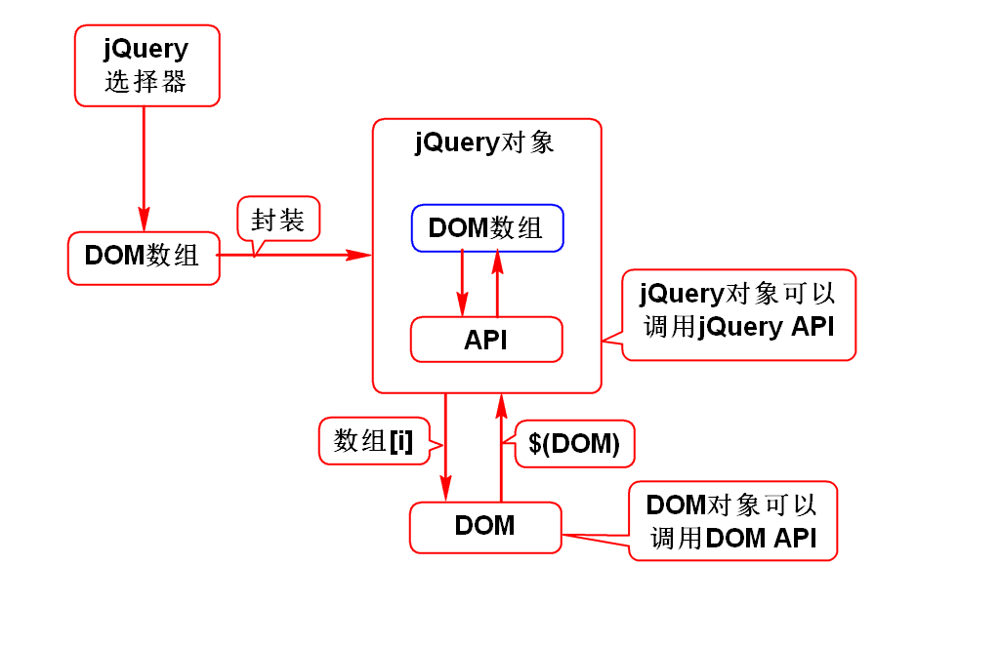

# jQuery

# 一. jQuery 概述

## 1. jQuery 简介

- jQuery 是一个优秀的 JavaScript 框架, 一个轻量级的 JavaScript 库, 本质上还是 JavaScript 脚本, 极大地简化了 JavaScript 编程
- 核心理念是 **write less, do more**
- 它封装了 JavaScript, CSS, DOM, 提供了一致的, 简洁的 API
- 兼容 CSS3, 及各种浏览器 (从jQuery 2.x 开始不再支持 IE 6.7.8 )
- 使用户更方便地处理 HTML, Events, 实现动画效果, 并且方便地为网站提供 AJAX 交互
- 使用户的 HTML 页面保持代码和 HTML 内容分离 

## 2. 使用 jQuery 

1. 引入 jQuery 的js文件, 注意引入文件的 script 标签不能再用于定义新函数
> &lt;script src="jQuery的js文件"&gt;&lt;/script&gt;

2. 使用选择器定位要操作的节点
3. 调用 jQuery 的方法进行操作

## 3. jQuery 对象



# 一. jQuery对象和DOM对象
## 1. 通过$所获得的对象是 jQuery 对象

    $("p")
    $(img)
    $("< li>< /li>")

## 2. 调用修改方法返回的是 jQuery 对象

    obj.width(218)
    obj.html("abc")

## 3. 调用读取方法
### 1) 若方法返回元素,则是 jQuery 对象

    obj.parent()
    obj.next()

### 2) 若方法返回文本,则是 DOM 对象

    obj.html()
    obj.attr("src")

- 为了解决浏览器的兼容问题, jQuery 框架提供了一种统一封装后的对象描述, 即jQuery对象
- jQuery 提供的方法都是针对 jQuery 对象特有的, 而且大部分方法的返回值就是当前的jQuery 对象, 所以方法可以连缀调用, 用一条语句对一个对象进行多项设置
> jQuery对象.方法().方法().方法()...

- 为了调用 jQuery 提供的方法, 要先通过 jQuery 选择器, 把选中的对象为 jQuery 对象

jQuery 对象本质上是一个DOM 对象数组, 它在该数组上扩展了一些操作数组中元素的方法
可以直接操作这个数组, 

DOM 对象可以转换为 jQuery 对象, 转换后就可以调用 jQuery 框架的 API 方法, 使用更灵活更方便 

> $(DOM对象)

# 二. jQuery 选择器
jQuery 选择器
选择条件与 css 选择器相似, 带引号时是选择器, 不带引号时是将DOM对象转换为jQuery对象

### 1. 基本选择器: 与 JavaScript 相似

- **元素选择器**
> $("标签名")

- **类选择器**
> $(".class名")

- **id选择器**
> $("#id")

- **选择器组**
> $("多个选择器")


### 2. 层次选择器 ( 派生选择器 )
在某元素之下, 选择满足条件的某些下级元素

- **子孙选择器**
    选择父级选择器结果之下, 所有满足子孙选择器的元素
> $("父级选择器 子孙选择器")

- **子级选择器**
    在父级选择器结果之下一级的元素中, 选择能满足子级选择器的元素
> $("父级选择器>子级选择器")

- **弟弟选择器**
    在选择器1后面, 找到满足选择器2的第一个弟弟
    > $("选择器1+选择器2")

	在选择器1后面, 找到满足选择器2的所有弟弟
    > $("选择器1~选择器2")
### 3. 过滤选择器
jQuery 中最重要, 最常用的选择器, 尤其是基本过滤选择器

- **基本过滤选择器**
根据元素的基本特征定位元素, 常用于表格和列表

    > $("选择器: 过滤条件")

	- first: 第一个元素
	- last : 最后一个元素
	- not(选择器) : 排除指定元素
	- even : 下标为偶数的元素
	- odd : 下标为奇数的元素
	- eq(下标) : 指定下标等于某一值的元素
	- gt(下标) : 指定下标大于某一值的元素, 即指定元素的所有弟弟
	- lt(下标) : 指定下标小于某一值的元素, 即指定元素的所有哥哥

			// 1)基本过滤
			console.log($("li:first"));
			console.log($("li:even"));
			console.log($("li:lt(2)"));
			console.log($("li:not(#gz)"));

- **内容过滤选择器**
根据文本内容定位元素

	- contains("包含文本") 选中包含指定文本的元素
	- empty	 选中所有空元素, 不含子元素或文本

			// 2)内容过滤
			console.log($("li:contains('州')"));

- **可见性过滤选择器**
根据可见性定位元素

	- :hidden 匹配所有不可见元素
	- :visible 匹配所有可见元素

			// 3)可见性过滤
			console.log($("li:hidden"));

- **属性过滤选择器**
根据属性定位元素

	- 元素[属性]	: 选中具有某属性的元素
	- 元素[属性 = 值] : 选中某属性等于某值的元素
	- 元素[属性 != 值] : 选中某属性不等于某值的元素

			// 4)属性过滤
			console.log($("li[id]"));

- **状态过滤选择器**( 表单控件 )
	根据表单控件的状态来选择元素
	
	- enabled : 匹配可用的元素
	- disabled : 匹配不可用的元素
	- checked : 匹配选中的checkbox(复选框)
	- selected : 匹配选中的option(下拉选)

			// 5)状态过滤
			console.log($("input:disabled"));
			console.log($("option:selected"));

### 4. 表单选择器
为了化简使用属性选择器来对表单控件的筛选, 通常都是用来选择input 下的不同类型,为此 jQuery 进行了简化
> $(":控件属性")

		//4.表单选择器
		console.log($(":radio"));

# 三. jQuery 操作 DOM
## 1. 读写节点

- 读写 HTML 内容
    > 查询 : jq对象.html()
    > 写入 : jq对象.html("新内容")

		console.log($("p:first").html());
		$("p:first").html("1.jQuery支持<u>读写</u>节点");	

- 读写节点的文本内容

    > 查询 : jq对象.text()
    > 写入 : jq对象.text("新内容")

- 读写节点的 value 属性值 

    > 查询 : jq对象.val()
    > 写入 : jq对象.val("新值")

		console.log($(":button:first").val());
		$(":button:first").val("BBB");

- 读写节点的指定属性值
	可以输入一个或两个参数
	一个参数时, 查找由参数指定的那个属性的属性值,
	两个参数时, 第一个参数指定属性项, 第二个参数设定属性值
    > 查询 : jq对象.attr("属性项")
    > 写入 : jq对象.attr("属性项" , "属性值")

		console.log($("img:first").attr("src"));
		$("img:first").attr("src","../images/02.jpg");

## 2. 增删节点

### 2.1. 创建 DOM 节点
JavaScript 创建节点时, 先创建的是一个空节点, 然后再赋值获取内容.
jQuery 创建节点时, 已经包含节点内容
> $("节点内容")

### 2.2. 插入 DOM 节点
jQuery 创建的节点也是游离节点, 需要插入到 DOM 树中

> 插入到最后 : parent.append(新节点)
> 插入到最前 : parent.prepend(新节点)
> 某节点之前 : brother.before(新节点)
> 某节点之后 : brother.after(新节点)

	// 1)追加节点, 
	function add(){
		var li = $("<li>天津</li>");
		//节点在最后
		$("ul").append(li);
	}
	// 2)插入节点
	function insert(){
		var li = $("<li>杭州</li>");
		//插入到广州之后
		$("#gz").after(li);
	}

### 2.3. 删除 DOM 节点
JavaScript 中, 删除节点要由父节点操作
jQuery 可以自己删除自己
> 删除节点 : jq对象.remove()
> 删除选中 : jq对象.remove(选择器)
> 清空内容 : jq对象.empty()

		function rmgz(){
			$("#gz").remove();
		}

## 遍历节点
即根据层次结构查询节点, 不指定选择器时将查询所有类型
用于以已有节点出发去处理兄弟节点的情况, 此时不便于使用选择器进行查询遍历.
jQuery 中, 大部分方法不会返回文本节点, 要返回文本节点, 应使用 contents().


- 直接子节点 : children(选择器)
- 含文本节点 : contents(); 
- 弟弟节点 : next(选择器)
- 哥哥节点 : prev(选择器)
- 兄弟节点 : siblings(选择器) ,不包括自己
- 各级后代 : find(选择器)
- 父级节点 : parent()

```javascript
var gz = $("#gz");
//获取父节点
console.log(gz.parent());
//获取哥哥节点
console.log(gz.prev());
//获取所有兄弟节点, 不包括当前节点本身
console.log(gz.siblings());

var ul = $("ul");
//获取带有id属性的li
console.log(ul.find("li[id]"));
```

## 案例: jQuery 版购物车


## 样式操作

- addClass("css类名")
对给定的 jQuery 对象, 追加在相应的类选择器中设定的样式, 样式可以叠加

- removeClass("css类名")
对给定的 jQuery 对象, 移除在相应的类选择器中设定的样式, 样式可以叠加

- removeClass()
对给定的 jQuery 对象, 移除所有的CSS样式

- toggleClass("css类名")
对给定的 jQuery 对象, 根据该对象是否具有指定类型样式, 进行开关切换

- hasClass()
判断 jQuery 对象是否具有某个样式

- css("css类名")
读取css的值

- css("属性" , "值")
设置样式

# 四. jQuery 事件

# 二.jQuery事件
## 1.事件概述
### 1)什么是事件
- 和js一样

### 2)事件的分类
- 和js一样

## 2.事件定义
### 1)直接定义
- 和js一样

### 2)动态绑定(*)
- 页面加载: $(function(){})
- $("").click(function(){})

### 3)取消事件
- return false
> js和jQuery中都采用这样的方式取消事件

## 3.事件对象
### 1)什么是事件对象
- 和js一样

### 2)如何获取事件对象
#### 直接定义事件时
- 和js一样

#### 动态绑定事件时
- 和js一样
> 获得的event是被jQuery封装后的event

## 4.事件机制
### 1)冒泡机制
- 和js一样

### 2)如何取消冒泡(*)
- e.stopPropagation()

### 3)作用
- 和js一样

### 4)如何获取事件源(*)
- e.target

## 5.合成事件
- 看PPT

## 6.模拟操作(*)
- 看PPT

## 1. 事件概述
### 1.1. 什么是事件
与 JavaScript 一样

### 1.2. 事件的分类
与 JavaScript 一样

## 2. 事件定义
### 2.1. 直接定义
与 JavaScript 一样

### 2.2. 动态绑定
- 与 JavaScript **有区别**

页面加载的语句不一样,区别
JavaScript 的 **window.onload** 只能写一次, 若写了多次则后者**覆盖前者**, 没有意义
jQuery 的 **$(function(){})** 可以写多次, 若写了多次, 则作用逻辑会叠加

- js window.onload=function(){}
- jq $(function(){})

选择器

- js 各类选择器
- jq $("")

    > jQuery对象.bind( 事件类型, 事件处理函数 )

- jq 的事件具有简写形式

    > jQuery对象.事件类型( 事件处理函数 )


### 2.3. 取消事件
return false

## 3. 事件对象
### 3.1. 什么是事件对象
和 JavaScript 一样

### 3.2. 如何获取事件对象
和 JavaScript 一样

#### 动态绑定事件时
和 JavaScript 一样
- 获得的 event 是被 jQuery 封装后的 event
- 
## 4. 事件机制
### 4.1. 冒泡机制
### 4.2. 如何取消冒泡
### 4.3. 作用
### 4.4. 如何

## 模拟操作
可以让 jQuery 帮人实现模拟操作, 