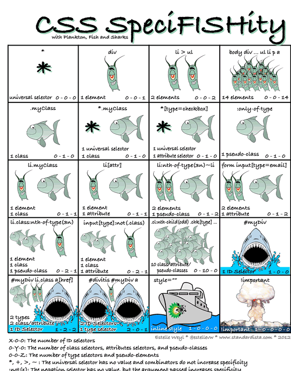
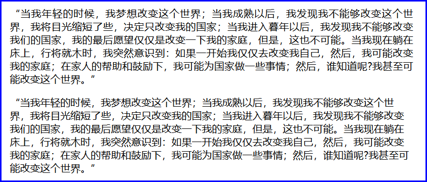

`

# █ 前端基础

## 1. 主要内容

- **HTML**: 勾勒出网页的结构和内容
- **CSS**: 层叠样式表, 美化网页
- **JavaScript**: 动态网页脚本, 让网页呈现动态的数据和效果
- **jQuery**: 一个 JavaScript 框架, 提高JS的开发效率

## 2. 参考链接

- [w3c 官方文档](http://www.w3school.com.cn "w3school")
- [菜鸟教程](https://www.runoob.com/, "各种前端技术的教程")
- [MDN 开发者文档](https://developer.mozilla.org/zh-CN/, "mozilla 组织维护的 web 开发文档")

# █ HTML

# 一. WEB 概述

## 1. Web三要素

- **浏览器**：向服务器发起请求，下载服务器中的网页（HTML文件），然后执行 HTML 显示出内容
- **服务器**：接收浏览器的请求，发送相应的页面到浏览器
- **HTTP协议**：浏览器与服务器的通讯协议

## 2. 工作原理


- HTML 是带标记的文本文件, 部署在服务器上, 在浏览器上解释执行
  根据 HTTP 协议, 浏览器发出请求给服务器，服务器做出响应, 给浏览器返回一个 HTML
- 浏览器解释执行 HTML, 从而显示出内容

## 3. 标记语言

### 3.1. XML

- 可扩展（自定义）标记语言
- 标记，属性，标记之间的关系都可以扩展
- 用来存储或传输数据

### 3.2. HTML

- 超文本标记语言
- 用来设计网页的标记语言, 文件以 .html 或 .htm 为后缀
- 由浏览器解释执行, 可以嵌套用脚本语言编写的程序段
- 标记、属性、标记之间的关系都是固定的（由 W3C 制定标准）
- 可以将 HTML 理解为标签固定的 XML, 某些版本的 HTML 是严格遵守 XML 规范

### 3.3. XHTML

XHTML 包含的内容与 html 4.01 基本相同, 但对格式的要求更加严谨

- 文档结构
  - XHTML DOCTYPE 是强制性的
  - 必须在 `<html>` 中的指定 XML namespace 
  - `<html>`、`<head>`、`<title>` 以及 `<body>` 必不可少
- 元素语法
  - 元素必须正确嵌套
  - 元素必须始终关闭
  - 元素必须小写
  - 必须有一个根元素
- 属性
  - 属性必须使用小写
  - 属性值必须用引号包围
  - 禁止属性最小化也是的

### 3.4. HTML5

最新的 html 标准, 相对于 html 4.01 的混乱, 以及 xhtml 中的过分严谨, 推出了新的标准. 

HTML5 仍处于完善之中。然而，大部分现代浏览器已经具备了某些 HTML5 支持。 

# 二. HTML 基础概念

## 1. 基本概念

由于 html + css + javaScript 是网页外发的事实标准, 三者的分工更加明确. 最新的 html5 更加关注于网页内容的结构, 提供了更多的语义化标签. 而在 html4 标准中关于布局和样式的相关属性, 基本上都被废弃, 建议使用 css 来实现网页样式的控制.

### 标签

HTML **标签** (HTML tag), 是用尖括号括起来的关键词.

- **双标签**
  成对出现的标签, 开始标签 + 结束标签, 结束标签有结束符号(斜杠 /),  双标签中间是标签要表达的内容

  > <标签 属性=属性值> 内容 < /标签>  

- **单标签**
  单独出现的标签, 一个标签即可把内容表达清楚

  > <标签 属性=属性值>

- **注释**

  HTML 支持在文件中添加注释, 注释可以跨行, 不可嵌套

  > < !-- 注释内容 -->

### 属性

全局属性, 适用于绝大多数元素

| 属性                                                         | 描述                                                       |
| ------------------------------------------------------------ | ---------------------------------------------------------- |
| [accesskey](https://www.runoob.com/tags/att-global-accesskey.html) | 设置访问元素的键盘快捷键。                                 |
| [class](https://www.runoob.com/tags/att-global-class.html)   | 规定元素的类名（classname）                                |
| [contenteditable](https://www.runoob.com/tags/att-global-contenteditable.html) | 规定是否可编辑元素的内容。                                 |
| [contextmenu](https://www.runoob.com/tags/att-global-contextmenu.html) | 指定一个元素的上下文菜单。当用户右击该元素，出现上下文菜单 |
| [data-*](https://www.runoob.com/tags/att-global-data.html)   | 用于存储页面的自定义数据                                   |
| [dir](https://www.runoob.com/tags/att-global-dir.html)       | 设置元素中内容的文本方向。                                 |
| [draggable](https://www.runoob.com/tags/att-global-draggable.html) | 指定某个元素是否可以拖动                                   |
| [dropzone](https://www.runoob.com/tags/att-global-dropzone.html) | 指定是否将数据复制，移动，或链接，或删除                   |
| [hidden](https://www.runoob.com/tags/att-global-hidden.html) | hidden 属性规定对元素进行隐藏。                            |
| [id](https://www.runoob.com/tags/att-global-id.html)         | 规定元素的唯一 id                                          |
| [lang](https://www.runoob.com/tags/att-global-lang.html)     | 设置元素中内容的语言代码。                                 |
| [spellcheck](https://www.runoob.com/tags/att-global-spellcheck.html) | 检测元素是否拼写错误                                       |
| [style](https://www.runoob.com/tags/att-global-style.html)   | 规定元素的行内样式（inline style）                         |
| [tabindex](https://www.runoob.com/tags/att-global-tabindex.html) | 设置元素的 Tab 键控制次序。                                |
| [title](https://www.runoob.com/tags/att-global-title.html)   | 规定元素的额外信息（可在工具提示中显示）                   |
| [translate](https://www.runoob.com/tags/att-global-translate.html) | 指定是否一个元素的值在页面载入时是否需要翻译               |

### 内容

 开始标签与结束标签之间的内容, 称为元素的内容

### 元素

HTML 元素

html 5 标准中, 规定了六种元素

空元素

指只有标签和属性, 没有下级元素的标签元素. 对于空元素, 不需要闭合标签, 也不需要自闭合斜杠.

- [area](https://www.runoob.com/tags/tag-area.html) 定义图像映射区域（带有可点击区域的图像), 始终嵌套在 `<map>` 元素内部  
- [base](https://www.runoob.com/tags/tag-base.html)  规定页面上所有的相对地址的默认 URL 或默认目标, 只能使用一次, 且在 `<head>` 元素内 
- [br](https://www.runoob.com/tags/tag-br.html)  插入一个简单的换行符 
- [col](https://www.runoob.com/tags/tag-col.html) 规定了`<colgroup>`元素内部的每一列的列属性, 可以向整个列应用样式 
- [embed](https://www.runoob.com/tags/tag-embed.html):  定义了一个容器，用来嵌入外部应用或者互动程序（插件） 
- [hr](https://www.runoob.com/tags/tag-hr.html) 定义 HTML 页面中的主题变化（比如话题的转移），并显示为一条水平线。 
- [img](https://www.runoob.com/tags/tag-img.html)  定义 HTML 页面中的图像,  有两个必需的属性：`src` 和 `alt`
- [input](https://www.runoob.com/tags/tag-input.html)  规定输入数据的输入字段. 在 `<form> `元素中使用, 通过`type` 属性改变输入方式
- [link](https://www.runoob.com/tags/tag-link.html)  定义惠html文档与外部资源的关系, 常用来引入 css 文件
- [meta](https://www.runoob.com/tags/tag-meta.html)  提供了 HTML 文档的元数据。元数据不会显示在客户端，但是会被浏览器解析
- [param](https://www.runoob.com/tags/tag-param.html) 允许您为插入 XHTML 文档的对象规定 run-time 设置，也就是说，此标签可为包含它的 [object](https://www.runoob.com/tags/tag-object.html) 或者 [applet](https://www.runoob.com/tags/tag-applet.html) 标签提供参数。  
- [source](https://www.runoob.com/tags/tag-source.html) 为媒体元素（比如 `<video>` 和`<audio>`）定义媒体资源, 允许提供多个备选
- [track](https://www.runoob.com/tags/tag-track.html)  为媒体元素（比如 `<audio>` and `<video>`）规定外部文本轨道 
- [wbr](https://www.runoob.com/tags/tag-wbr.html)  如果单词太长 , 可以规定在文本中的何处适合添加换行符 

模板元素

 `template` 

原始文本元素

```
script`, `style
```

可选的原始文本元素

```
textarea`, `title
```

外部元素

 Elements from the [MathML namespace](https://infra.spec.whatwg.org/#mathml-namespace) and the [SVG namespace](https://infra.spec.whatwg.org/#svg-namespace). 

来自 `MathML` 和 `SVGML` 规范中的元素, 对于此类元素, 需要使用闭合标签或自闭合斜杠, 以保证正确解析.

普通元素

其他的各种标签元素

## 2. HTML 文档结构

### 2.1. 版本声明

- HTML 有多个不同版本的标准, 不同版本支持的标签功能有区别, 会导致页面显示效果不一致. 因此在文档中要明确指出采用的 HTML 版本, 浏览器才能正确解读文件, 达到理想的效果.

- HTML 版本需要在文档开头声明, <!DOCTYPE> 该声明不是 HTML 标签, 它告诉浏览器应该用什么标准来解读当前页面

- 版本声明不区分大小写

  > < !DOCTYPE html版本信息>

  	常用的 HTML5 声明
  	<!DOCTYPE html>

### 2.2. 根标签

- 每个HTML文件都有一个根标签, 根标签为 `<HTML>`
- 根标签之下有两个子标签, **头部** `<head>` 与**主体** `<body>`.

### 2.3. 头部

`<head>`元素是所有头部元素的容器, 可以声明元信息, 指示浏览器在何处可以找到样式表, 脚本等等

- **标题** `<title>`
  指定页面的标题, 该标题可用在收藏夹, 或作为搜索引擎结果的页面标题
  
- **元信息** `<meta>`
  关于 HTML 文档的元数据, 不会显示在页面上, 用以告知浏览器必要信息.
  如页面的描述, 关键词, 文档作者, 最后修改时间以及其他元数据等
  
- **关联资源** `<link>`
  
  如当前文档关联的样式表

### 2.4. 主体

HTML 页面的具体页面内容

综上, 一个完整的html 结构如下

```html
<!DOCTYPE html>
<html>
    <head>
		<title>完整的 html 结构</title>
        <meta charset="utf-8">
    </head>
    <body>
        <!-- 页面具体内容 -->
    </body>
</html>
```


# 三. HTML 页面内容

## 1. 文本类

文本是网页上的重要组成部分, 直接书写的文本会用浏览器默认的样式显示, 也可以用相应的文本类标签进行处理.

- **标题** `<h1>~<h6>`

   标题元素让文字以醒目的方式显示, 往往用于文章的标题, 有 h1~h6 六个等级

- **段落** `<p>`

   结构化文本的一种方式, 段落元素中的文本独立成段, 有段间距

- **列表**

   列表是值将具有相似特征或者先后顺序的几行文字进行对齐排列.

   列表元素可以嵌套使用, 可以创建多层列表, 常用于创建文档大纲, 导航菜单等

   - **有序列表** `<ol>`: 有序列表, 按顺序将列表项对齐排列, 段首有数字编号

   - **无序列表** `<ul>`: 无序列表, 将列表项对齐排列, 段前有段落标记, 但没有数字编号

   - **列表项** `<li>`: 无论是有序列表还是无序列表, 在列表之中都有列表项

   ```html
   <ul>
       <li>无序列表1</li>
       <li>无序列表2</li>
       <!-- 嵌套无序列表, 此处不要关闭 -->
       <li id="a">嵌套无序列表
           <ul>
               <li>无序列表1</li>
               <!-- 嵌套有序列表, 此处不要关闭 -->
               <li id="b">嵌套有序列表
                   <ol>
                       <li>有序列表1</li>
                       <li>有序列表2</li>
                   </ol>
               <!-- 嵌套有序列表结束, 关闭 b -->
               </li>
           </ul>
       <!-- 嵌套无序列表结束, 关闭 a -->
       </li>
   </ul>
   ```
   
- 自定义列表 `<dl>`

   - 自定义列表项 `<dt>`

   ```HTML
   <dl>
       <dt>列表组A</dt>
           <dd>列表项A-1</dd>
           <dd>列表项A-2</dd>
       <dt>列表组B</dt>
           <dd>列表项B-1</dd>
           <dd>列表项B-2</dd>
       <dt>列表组C</dt>
           <dd>列表项C-1</dd>
           <dd>列表项C-2</dd>
   </dl>
   ```

- **行内元素**

   - 行内元素 `span` 没有特定的含义, 可用于为行内部分文本设置样式属性
   - 加粗 `<b>`
   - 斜体 `<i>`
   - 下划线 `<u>`
   - 删除线 `<del>`

## 2. 多媒体

### **图像** ``

使用单标记< img>元素, 将图像添加到页面
- **src** 用于指定图像文件的位置, 可使用相对路径或绝对路径
- **width** 设置图片的显示宽度, 通常以像素为单位指定, 也可使用相对父级区域的百分比
- **height** 设置图片的显示高度, 通常以像素为单位
- **alt** 设置图片无法正常显示时的替代文本, 建议填写
- **title** 设置鼠标悬停时在图片上显示的文本信息, 建议填写

### **视频** `<video>`

可以在标签内放置文本内容, 这样在不支持 video 元素的浏览器中可以显示提示信息

- **src** 用于指定图像文件的位置, 可使用相对路径或绝对路径
- **width** 设置播放器宽度, 通常以像素为单位指定, 也可使用相对父级区域的百分比
- **height** 设置播放器高度, 通常以像素为单位
- **[autoplay](https://www.runoob.com/tags/att-video-autoplay.html)** 是否自动播放
- **[controls](https://www.runoob.com/tags/att-video-controls.html)** 是否显示控件, 如播放按钮
- **[loop](https://www.runoob.com/tags/att-video-loop.html)** 是否循环播放
- **[muted](https://www.runoob.com/tags/att-video-muted.html)** 是否静音播放
- **[poster](https://www.runoob.com/tags/att-video-poster.html)** 封面图片
- **[preload](https://www.runoob.com/tags/att-video-preload.html)** 是否提前加载

```html
<!-- 使用 src 属性给出视频地址 -->
<video width="320" height="240" controls src="movie.mp4"></video>

<!-- 使用 source 下级元素给出备选地址-->
<video width="320" height="240" controls>
  <source src="movie.mp4"  type="video/mp4">
  <source src="movie.ogg"  type="video/ogg">
</video>
```

### 音频 

- 插件
- object
- audio

### 绘图 SVG, canvas 

### 插件

## 3. 超链接

- **超链接** `<a>`

  - 外部文档

  - 内部锚点, html4 中锚点跳转功能需要用另一个`<a>` 元素的`name`属性来声明锚点, 在 html 5 中已废弃

    ```html
    <!-- html4 中的锚点跳转功能 -->
    <a name="mark4">声明锚点</a>
    ...
    <a href="#mark4">跳到锚点</a>
    ```

  - 内部书签, html5 文档内任意一个设置了 id 属性的元素, 都可以视为一个书签 可以通过`<a>`标签快速跳转

    ```html
    <!-- html5 中的书签跳转功能 -->
    <p id="markP">段落</p>
    <div id="markDiv">div块</div>
    <h2 id="markH2">二级标题</h2>
    ...
    <a href="#markP">跳到段落</a>
    <a href="#markDiv">跳到div块</a>
    <a href="#markH2">跳到二级标题</a>
    ```

| 值          | 描述                                 |
| ----------- | ------------------------------------ |
| _blank      | 在新窗口中打开被链接文档。           |
| _self       | 默认。在相同的框架中打开被链接文档。 |
| _parent     | 在父框架集中打开被链接文档。         |
| _top        | 在整个窗口中打开被链接文档。         |
| *framename* | 在指定的框架中打开被链接文档。       |

| 属性                                                        | 描述                                                         |
| ----------------------------------------------------------- | ------------------------------------------------------------ |
| [target](https://www.runoob.com/tags/att-a-target.html)     | 规定在何处打开目标 URL。仅在 href 属性存在时使用。           |
| [href](https://www.runoob.com/tags/att-a-href.html)         | 规定链接的目标 URL。                                         |
| [download](https://www.runoob.com/tags/att-a-download.html) | 指定下载链接                                                 |
| [hreflang](https://www.runoob.com/tags/att-a-hreflang.html) | 规定目标 URL 的基准语言。仅在 href 属性存在时使用。          |
| [media](https://www.runoob.com/tags/att-a-media.html)       | 规定目标 URL 的媒介类型。默认值：all。仅在 href 属性存在时使用。 |
| [rel](https://www.runoob.com/tags/att-a-rel.html)           | 规定当前文档与目标 URL 之间的关系。仅在 href 属性存在时使用。 |
| [type](https://www.runoob.com/tags/att-a-type.html)         | 规定目标 URL 的 MIME 类型。仅在 href 属性存在时使用。        |

## 4. 表格

### 4.1. 作用

- 表格通常用来组织结构化的信息, 是由单元格排列而成
- 也可以使用表格来为页面分区

### 4.2. 标签

| 标签                                                | 描述                 |
| --------------------------------------------------- | -------------------- |
| [table](https://www.runoob.com/tags/tag-table.html) | 定义表格, 划分出表格整体的作用范围 |
| [tr](https://www.runoob.com/tags/tag-tr.html) | 定义表格的行 |
| [th](https://www.runoob.com/tags/tag-th.html)     | 定义表头单元格, 默认居中加粗 |
| [td](https://www.runoob.com/tags/tag-td.html)      | 定义普通单元格        |
| [caption](https://www.runoob.com/tags/tag-caption.html) | 定义表格标题, 默认居中显示 |
| [colgroup](https://www.runoob.com/tags/tag-colgroup.html)| 定义表格列的组, 对列进行组合,以便格式化 |
| [col](https://www.runoob.com/tags/tag-col.html)| 规定了`colgroup`元素内部的每一列的列属性 |
| [thead](https://www.runoob.com/tags/tag-thead.html)| 定义表格的页眉       |
| [tbody](https://www.runoob.com/tags/tag-tbody.html)| 定义表格的主体       |
| [tfoot](https://www.runoob.com/tags/tag-tfoot.html)| 定义表格的页脚       |

### 4.3. 属性

| 属性    | 描述                                                         | 适用元素      |
| ------- | ------------------------------------------------------------ | ------------- |
| scope   | 规定表头单元格是否是行、列、行组或列组的头部. 语义属性, 没有视觉效果 | th            |
| headers | 指定单元格关联的表头. 语义属性, 没有视觉效果                 | td, th        |
| colspan | 跨列, 规定单元格可横跨的列数                                 | td, th        |
| rowspan | 跨行, 规定单元格可横跨的行数                                 | td, th        |
| span    | 为列和列组指定属性时的跨列数                                 | colgroup, col |

### 4.4. 示例

```html
<table>
    <caption>表格功能演示</caption>
    <colgroup>
        <col style="background-color: coral">
        <col span="2" style="background-color: darkcyan">
        <col span="3" style="background-color: darkgray">
    </colgroup>
    <thead style="background-color: cornflowerblue">
    <tr>
        <th>表头1</th>
        <th colspan="2">表头2+3</th>
        <th>表头4</th>
        <th>表头5</th>
    </tr>
    </thead>
    <tbody>
    <tr>
        <td>1-1</td>
        <td rowspan="2">跨行格子</td>
        <td colspan="2">跨列格子</td>
        <td>1-5</td>
    </tr>
    <tr>
        <td>2-1</td><td>2-3</td><td>2-4</td><td>2-5</td>
    </tr>
    <tr>
        <td>3-1</td><td>3-2</td><td>3-3</td><td>3-4</td><td>3-5</td>
    </tr>
    <tr>
        <td>4-1</td><td>4-2</td><td>4-3</td><td>4-4</td><td>4-5</td>
    </tr>
    </tbody>
    <tfoot style="background-color: darkorchid">
    <tr>
        <td>表尾-1</td><td>表尾-2</td><td>表尾-3</td><td>表尾-4</td><td>表尾-5</td>
    </tr>
    </tfoot>
</table>
```


## 5. 表单

表单,  用于收集不同类型的用户输入。

### 5.1. 表单组织

#### 1) 声明表单 `<form>`

`form` 标签声明表单并指定表单的范围, 提交表单时会将表单范围内的所有表单域内容提交到服务器.

可以使用以下属性对表单进行配置. 

| 属性                                                         | 描述                                                         |
| ------------------------------------------------------------ | ------------------------------------------------------------ |
| [accept-charset](https://www.runoob.com/tags/att-form-accept-charset.html) | 规定服务器可处理的表单数据字符集。                           |
| [action](https://www.runoob.com/tags/att-form-action.html)   | 规定当提交表单时向何处发送表单数据。                         |
| [autocomplete](https://www.runoob.com/tags/att-form-autocomplete.html) | 规定是否启用表单的自动完成功能。`on` 或`off`                 |
| [enctype](https://www.runoob.com/tags/att-form-enctype.html) | 规定在向服务器发送表单数据之前如何对其进行编码。（适用于 method="post" 的情况） |
| [method](https://www.runoob.com/tags/att-form-method.html)   | 规定用于发送表单数据的 HTTP 方法。                           |
| [name](https://www.runoob.com/tags/att-form-name.html)       | 规定表单的名称。以便在 javaScript 中引用表单数据             |
| [novalidate](https://www.runoob.com/tags/att-form-novalidate.html) | 如果使用该属性，则提交表单时不进行验证。                     |
| [target](https://www.runoob.com/tags/att-form-target.html)   | 规定在何处打开 action URL. 与`<a>`的`target`属性一致         |

#### 2) 组件标签 `<label>`

通过 `label` 元素, 可以将表单域与文本内容绑定在一起, 增加表单域的面积, 便于操作. 有以下两种处理方式

```HTML
<!-- label 与表单域分开, 通过 for 属性关联 -->
<input type="checkbox" checked id="check1" />
<label for="check1">我已阅读并愿遵守此协议</label>

<!-- label 包含表单域, 不需 for 属性 -->
<label>
    <input type="checkbox" checked id="check2">
    我已阅读并愿遵守此协议
</label>
```

| 属性                                                    | 描述                                  |
| ------------------------------------------------------- | ------------------------------------- |
| [for](https://www.runoob.com/tags/att-label-for.html)   | 规定 label 与哪个表单元素绑定。       |
| [form](https://www.runoob.com/tags/att-label-form.html) | 规定 label 字段所属的一个或多个表单。 |

#### 2) 组件分组 `<fieldset>`

可以使用 `fieldset` 对表单域进行分组, 加边框. `legend` 为该组的组名

```html
<fieldset>
    <legend>个人基本信息:</legend>
    <label>姓名:<input type="text" size="30"></label><br>
    <label>电话:<input type="text" size="30"></label><br>
    <label>生日:<input type="date" size="10"></label>
</fieldset>
```


可以为 `fieldset` 指定属性, `legend` 无配置属性

| 属性                                                         | 值        | 描述                                 |
| ------------------------------------------------------------ | --------- | ------------------------------------ |
| [disabled](https://www.runoob.com/tags/att-fieldset-disabled.html) | disabled  | 规定该组中的相关表单元素应该被禁用。 |
| [form](https://www.runoob.com/tags/att-fieldset-form.html)   | *form_id* | 规定 fieldset 所属的一个或多个表单。 |
| [name](https://www.runoob.com/tags/att-fieldset-name.html)   | *text*    | 规定 fieldset 的名称。               |

### 5.2. input 元素

最常用的表单输入组件, `input` 元素的 `type` 属性提供 23 种输入类型, 但不同浏览器的支持程度不一致, 部分类型暂未得到支持.

以下属性为适用于所有类型通用的属性. 针对不同类型的 input 元素的专用属性详见后续的内容.

| 属性                                                         | 描述                                                       |
| ------------------------------------------------------------ | ---------------------------------------------------------- |
| [type](https://www.runoob.com/tags/att-input-type.html)      | 规定该表单字段的类型                                       |
| [name](https://www.runoob.com/tags/att-input-name.html)      | 规定该表单字段的名称                                       |
| [value](https://www.runoob.com/tags/att-input-value.html)    | 指定该表单字段的值                                         |
| [readonly](https://www.runoob.com/tags/att-input-readonly.html) | 规定输入字段是只读的, 不可编辑. 最小化字段                 |
| [required](https://www.runoob.com/tags/att-input-required.html) | 规定字段时必须的, 提交表单之前需要填写. 最小化字段         |
| [disabled](https://www.runoob.com/tags/att-input-disabled.html) | 规定应该禁用的元素, 不可修改, 也不提交到服务器. 最小化字段 |
| [autocomplete](https://www.runoob.com/tags/att-input-autocomplete.html) | 规定该字段是否启用浏览器自动完成功能, `on` 或 `off`        |
| [autofocus](https://www.runoob.com/tags/att-input-autofocus.html) | 规定页面加载时该字段自动获得焦点                           |
| [form](https://www.runoob.com/tags/att-input-form.html)      | 规定在`<form>` 元素外的 `<input>` 仍输入指定表单           |


#### 1) 文本输入

| 类型     | 描述                                                         |
| -------- | ------------------------------------------------------------ |
| text     | 默认。定义一个单行的文本字段（默认宽度为 20 个字符）。       |
| password | 定义密码字段（字段中的字符会被遮蔽）。                       |
| number   | 定义用于输入整数的字段。                                     |
| hidden   | 定义隐藏输入字段, 通常用来存放不需用户输入, 但需要与表单一同提交的数据 |
| email    | 定义用于 e-mail 地址的字段                                   |
| url      | 定义用于输入 URL 的字段                                      |
| search   | 定义用于输入搜索字符串的文本字段。                           |
| tel      | 定义用于输入电话号码的字段。                                 |

| 属性                                                         | 描述                                                         |
| ------------------------------------------------------------ | ------------------------------------------------------------ |
| [placeholder](https://www.runoob.com/tags/att-input-placeholder.html) | 规定描述输入字段预期值的简短的提示信息 。                    |
| [maxlength](https://www.runoob.com/tags/att-input-maxlength.html) | 规定 元素中允许的最大字符数。                                |
| [size](https://www.runoob.com/tags/att-input-size.html)      | 规定以字符数计的元素的可见宽度。                             |
| [pattern](https://www.runoob.com/tags/att-input-pattern.html) | 规定用于验证字段的值的正则表达式。                           |
| [list](https://www.runoob.com/tags/att-input-list.html)      | 引用  `<datalist> `元素，其中包含当前字段的预定义选项。      |
| [min](https://www.runoob.com/tags/att-input-min.html)        | 规定 元素的最小值。仅适用于 `number`和 `range`               |
| [max](https://www.runoob.com/tags/att-input-max.html)        | 规定元素的最大值。仅适用于 `number`和 `range`                |
| [step](https://www.runoob.com/tags/att-input-step.html)      | step 属性规定元素的合法数字间隔。仅适用于 `number`和 `range` |

#### 2) 功能控件

| 类型           | 描述                                                         |
| -------------- | ------------------------------------------------------------ |
| file           | 定义文件选择字段和 "浏览..." 按钮，供文件上传。              |
| range          | 通过滑块输入数字, 配合 min/max/step属性使用, value 默认为合法数值的中间值 |
| color          | 定义拾色器。                                                 |
| date           | 定义 date 控件                                               |
| time           | 定义用于输入时间的控件（不带时区）                           |
| month          | 定义 month 和 year 控件（不带时区）                          |
| week           | 定义 week 和 year 控件（不带时区）                           |
| datetime-local | 定义 date 和 time 控件（不带时区）                           |
| datetime       | 定义 date 和 time 控件（基于 UTC 时区)                       |

| 属性                                                         | 描述                                                 |
| ------------------------------------------------------------ | ---------------------------------------------------- |
| [accept](https://www.runoob.com/tags/att-input-accept.html)  | 规定通过文件上传来提交的文件的类型。 仅适用于 `file` |
| [multiple](https://www.runoob.com/tags/att-input-multiple.html) | 允许输入多个值, 逗号分隔。仅适用于 `email` 和 `file` |

#### 3) 选择框

| 类型     | 描述                                                         |
| -------- | ------------------------------------------------------------ |
| radio    | 单选框, value属性指定选项的值, name 属性相同的为一组, 相互排斥 |
| checkbox | 复选框, value属性指定选项的值, name 属性相同的为一组         |

| 属性                                                         | 描述                                                         |
| ------------------------------------------------------------ | ------------------------------------------------------------ |
| [checked](https://www.runoob.com/tags/att-input-checked.html) | checked 属性规定在页面加载时应该被预先选定的元素, 最小化属性 |

```html
<h4>单选框组:</h4>
<label><input type="radio" name="radio1" value="0">未知</label>
<label><input type="radio" name="radio1" value="1">男</label>
<label><input type="radio" name="radio1" value="2">女</label>

<h4>复选框组:</h4>
<label><input type="checkbox" name="cb1" value="1">中国</label>
<label><input type="checkbox" name="cb1" value="2">广东</label>
<label><input type="checkbox" name="cb1" value="3">深圳</label>
```

#### 4) 按钮

| 类型   | 描述                                                |
| ------ | --------------------------------------------------- |
| submit | 提交按钮, 将表单的内容提交到服务器                  |
| reset  | 重置按钮, 将表单的内容清除, 恢复到初始状态          |
| button | 自定义按钮, 结合 js, 给按钮绑定事件, 实现自定义功能 |
| image  | 以图片作为提交按钮                                  |

| 属性                                                         | 描述                                                         |
| ------------------------------------------------------------ | ------------------------------------------------------------ |
| [height](https://www.runoob.com/tags/att-input-height.html)  | 规定图片显示高度. 仅适用于`image`                            |
| [width](https://www.runoob.com/tags/att-input-width.html)    | 规定图片显示宽度。  仅适用于`image`                          |
| [alt](https://www.runoob.com/tags/att-input-alt.html)        | 定义图像输入的替代文本。 仅适用于`image`                     |
| [src](https://www.runoob.com/tags/att-input-src.html)        | src 属性规定显示为提交按钮的图像的 URL。仅适用于`image`      |
| [formaction](https://www.runoob.com/tags/att-input-formaction.html) | 属性规定当表单提交时处理输入控件的文件的 URL。适合 `submit` 和 `image` |
| [formenctype](https://www.runoob.com/tags/att-input-formenctype.html) | 属性规定当表单数据提交到服务器时如何编码. 适合 `submit` 和 `image` |
| [formmethod](https://www.runoob.com/tags/att-input-formmethod.html) | 定义发送表单数据到 action URL 的 HTTP 方法. 适合 `submit` 和 `image` |
| [formtarget](https://www.runoob.com/tags/att-input-formtarget.html) | 规定表示提交表单后在哪里显示接收到响应的名称或关键词。适合 `submit` 和 `image` |
| [formnovalidate](https://www.runoob.com/tags/att-input-formnovalidate.html) | 覆盖 `<form>` 元素的 novalidate 属性, 忽略输入校验。适合 `submit` 和 `image` |

```html
<input type="submit" value="提交按钮"><br>
<input type="reset" value="重置按钮"><br>
<input type="button" value="普通按钮"><br>
<input type="image" src="../assets/logo.png" alt="图片按钮"><br>
```

### 5.2 其他元素

#### 1) 文本域 `<textarea>` 

可以自由改变大小的文本框 
默认大小为2*20
双标签中间为默认值

| 属性                                                         | 值         | 描述                                             |
| ------------------------------------------------------------ | ---------- | ------------------------------------------------ |
| [name](https://www.runoob.com/tags/att-textarea-name.html)   | *text*     | 规定文本区域的名称。                             |
| [rows](https://www.runoob.com/tags/att-textarea-rows.html)   | *number*   | 规定文本区域内可见的行数。                       |
| [cols](https://www.runoob.com/tags/att-textarea-cols.html)   | *number*   | 规定文本区域内可见的宽度。                       |
| [placeholder](https://www.runoob.com/tags/att-textarea-placeholder.html) | *text*     | 规定一个简短的提示，描述文本区域期望的输入值。   |
| [readonly](https://www.runoob.com/tags/att-textarea-readonly.html) | readonly   | 规定文本区域为只读。                             |
| [disabled](https://www.runoob.com/tags/att-textarea-disabled.html) | disabled   | 规定禁用文本区域。                               |
| [required](https://www.runoob.com/tags/att-textarea-required.html) | required   | 规定文本区域是必需的/必填的。                    |
| [form](https://www.runoob.com/tags/att-textarea-form.html)   | *form_id*  | 定义文本区域所属的一个或多个表单。               |
| [maxlength](https://www.runoob.com/tags/att-textarea-maxlength.html) | *number*   | 规定文本区域允许的最大字符数。                   |
| [autofocus](https://www.runoob.com/tags/att-textarea-autofocus.html) | autofocus  | 规定当页面加载时，文本区域自动获得焦点。         |
| [wrap](https://www.runoob.com/tags/att-textarea-wrap.html)   | hard  soft | 规定当提交表单时，文本区域中的文本应该怎样换行。 |

```html
<textarea cols="20" rows="2" placeholder="请输入个人简介, 500字以内"></textarea>
```

#### 2) 下拉选 `<select>`

 `select` 表示下拉选, `option` 指示各个选项, 第一个选项往往设为提示信息,还可以利用 `optgroup`进行分组. 

```html
<select >
    <optgroup label="华东区" disabled>
        <option>上海</option>
        <option>浙江</option>
        <option>江苏</option>
    </optgroup>
    <optgroup label="华北区">
        <option>北京</option>
        <option>天津</option>
        <option>河北</option>
    </optgroup>
</select>
```


| 属性                                                         | 描述                                                | 适用元素                 |
| ------------------------------------------------------------ | --------------------------------------------------- | ------------------------ |
| [name](https://www.runoob.com/tags/att-select-name.html)     | 定义下拉列表的名称。                                | select                   |
| [form](https://www.runoob.com/tags/att-select-form.html)     | 定义 select 字段所属的一个或多个表单。              | select                   |
| [multiple](https://www.runoob.com/tags/att-select-multiple.html) | 当该属性为 true 时，可选择多个选项。                | select                   |
| [autofocus](https://www.runoob.com/tags/att-select-autofocus.html) | 规定在页面加载时下拉列表自动获得焦点。              | select                   |
| [required](https://www.runoob.com/tags/att-select-required.html) | 规定用户在提交表单前必须选择一个下拉列表中的选项。  | select                   |
| [size](https://www.runoob.com/tags/att-select-size.html)     | 规定下拉列表中可见选项的数目。默认1, multiple时为4  | select                   |
| [disabled](https://www.runoob.com/tags/att-select-disabled.html) | 当该属性为 true 时，禁用下拉列表, 或禁用选项/选项组 | select, optgroup, option |
| [label](https://www.runoob.com/tags/att-optgroup-label.html) | 为选项组规定描述。                                  | optgroup, option         |
| [selected](https://www.runoob.com/tags/att-option-selected.html) | 标记为选中状态                                      | option                   |
| [value](https://www.runoob.com/tags/att-option-value.html)   | 提交表单时发送的选项值                              | option                   |

#### 3) 按钮 `<button>`

定义一个按钮. 与 `input` 元素按钮的区别在于, 可以在 `button` 元素内部放置内容, 如文字或图像等.

| 属性                                                         | 描述                                                         | 适用type |
| ------------------------------------------------------------ | ------------------------------------------------------------ | -------- |
| [autofocus](https://www.runoob.com/tags/att-button-autofocus.html) | 规定当页面加载时按钮应当自动地获得焦点。                     |          |
| [disabled](https://www.runoob.com/tags/att-button-disabled.html) | 规定应该禁用该按钮。                                         |          |
| [form](https://www.runoob.com/tags/att-button-form.html)     | 规定按钮属于一个或多个表单。                                 |          |
| [name](https://www.runoob.com/tags/att-button-name.html)     | 规定按钮的名称。                                             |          |
| [type](https://www.runoob.com/tags/att-button-type.html)     | 规定按钮的类型。                                             |          |
| [value](https://www.runoob.com/tags/att-button-value.html)   | 规定按钮的初始值。可由脚本进行修改。                         |          |
| [formaction](https://www.runoob.com/tags/att-button-formaction.html) | 规定当提交表单时向何处发送表单数据。覆盖 form 元素的 action 属性。 | submit   |
| [formenctype](https://www.runoob.com/tags/att-button-formenctype.html) | 规定在提交表单数据的编码方式。覆盖 form 元素的 enctype 属性。 | submit   |
| [formmethod](https://www.runoob.com/tags/att-button-formmethod.html) | 规定用于发送表单数据的 HTTP 方法。覆盖 form 元素的 method 属性。 | submit   |
| [formnovalidate](https://www.runoob.com/tags/att-button-formnovalidate.html) | 提交表单时不进行验证。覆盖 form 元素的 novalidate 属性。     | submit   |
| [formtarget](https://www.runoob.com/tags/att-button-formtarget.html) | 规定在何处打开 action URL。覆盖 form 元素的 target 属性。    | submit   |

```html
<button type="button" onclick="alert('点击文字按钮!')">文字按钮</button><br>
<button type="button" onclick="alert('点击图片按钮!')">
    
</button>
```


#### 4) 预设数据 `<datalist>`

与 `input` 的 `list` 属性配合使用, 在输入框提供预设的值. 具体选项通过 `option` 元素指定, 且支持多种写法.

```html
<label>
    国家
    <input list="country" type="text" name="country">
</label>
<datalist id="country">
    <!-- 火狐提示为option元素的内容, 选中后填入value值. chrome 同时显示 -->
    <option value="China">中国</option>
    <option value="Russia">俄罗斯</option>
    <!-- 显示/填入均为value值, 闭合标签可以省略 -->
    <option value="美国"></option>
    <option value="英国">
    <!-- 显示/填入均为option元素的内容 -->
    <option>法国</option>
</datalist>
```


#### 5) 计算结果 `<output>`

显示脚本执行的结果, 需要在`form`元素上定义事件处理

```html
<form onchange="cal()">
    <script>
        function cal() {
            var a = parseInt(document.getElementById('a').value);
            var b = parseInt(document.getElementById('b').value);
            document.getElementById('sum').value = a + b;
            document.getElementById('minus').value = a - b;
            document.getElementById('multi').value = a * b;
            document.getElementById('divide').value = a / b;
        }
    </script>

    <label>A: 100<input type="range" id="a" min="100" max="1000" step="10">1000</label>
    <br>
    <label>B: 1<input type="range" id="b" min="1" max="10">10</label>
    <br>

    和 <output id="sum" for="a b"></output><br>
    差 <output id="minus" for="a b"></output><br>
    积 <output id="multi" for="a b"></output><br>
    商 <output id="divide" for="a b"></output><br>
</form>
```


## 6. 框架

 `<iframe>` 元素可以在页面内开辟一个独立区域, 可以用来显示其他 html 文档的内容

| 属性                                                         | 描述                                  |
| ------------------------------------------------------------ | ------------------------------------- |
| [name](https://www.runoob.com/tags/att-iframe-name.html)     | 规定框架的名称。                      |
| [height](https://www.runoob.com/tags/att-iframe-height.html) | 规定框架的高度。                      |
| [width](https://www.runoob.com/tags/att-iframe-width.html)   | 规定框架的宽度。                      |
| [src](https://www.runoob.com/tags/att-iframe-src.html)       | 规定在框架中显示的文档的 URL。        |
| [sandbox](https://www.runoob.com/tags/att-iframe-sandbox.html) | 对框架的内容定义一系列额外的限制。    |
| [srcdoc](https://www.runoob.com/tags/att-iframe-srcdoc.html) | 规定页面中的 HTML 内容显示在 框架中。 |

```html
<!-- 在框架内显示内容 -->
<iframe name="myFrame" src="//www.baidu.com" width="800" height="600"></iframe>

<!-- 将 a 超链接的 target 可以指定为某个框架的 name, 在框架内打开链接 -->
<a href="//www.baidu.com" target="myFrame">百度</a><br>
<iframe name="myFrame" src="emptyFrame.html" width="800" height="600"></iframe>

<!-- 将 a 超链接的 target 属性指定为 _parent 或 _top, 就会在框架外部页面打开内容 -->
<a target="_top" href="//www.baidu.com">在整个窗口打开百度</a>
```

## 7. 杂项

### 7.1. script 脚本

`<script>` 标签定义客户端脚本, 比如 JavaScript.  该元素可包含脚本语句, 也可通过 `src` 属性引入外部脚本文件.

`<noscript>` 元素指定禁用/不支持 javaScript 时的替代内容 

| 属性                                                         | 值          | 描述                                                   |
| ------------------------------------------------------------ | ----------- | ------------------------------------------------------ |
| [async](https://www.runoob.com/tags/att-script-async.html)   | async       | 规定异步执行脚本（仅适用于外部脚本）。                 |
| [charset](https://www.runoob.com/tags/att-script-charset.html) | *charset*   | 规定在脚本中使用的字符编码（仅适用于外部脚本）。       |
| [defer](https://www.runoob.com/tags/att-script-defer.html)   | defer       | 规定当页面已完成解析后，执行脚本（仅适用于外部脚本）。 |
| [src](https://www.runoob.com/tags/att-script-src.html)       | *URL*       | 规定外部脚本的 URL。                                   |
| [type](https://www.runoob.com/tags/att-script-type.html)     | *MIME-type* | 规定脚本的 MIME 类型。                                 |

详见后面 javaScript 相关章节

### 7.2. CSS 样式

 CSS (Cascading Style Sheets) 用于渲染HTML元素标签的样式, 可以通过以下方式添加到HTML中:

- 内联样式- 在 HTML 元素中使用 `style` 属性 
- 内部样式表 -在HTML文档头部 `<head>` 区域使用`<style>` 元素来包含CSS
- 外部引用 - 使用`<link>` 元素的 `href` 属性引入外部 CSS 文件

| 属性                                                         | 描述                                             |
| ------------------------------------------------------------ | ------------------------------------------------ |
| [href](https://www.runoob.com/tags/att-link-href.html)       | 定义被链接文档的位置。                           |
| [rel](https://www.runoob.com/tags/att-link-rel.html)         | 必需。定义当前文档与被链接文档之间的关系。       |
| [hreflang](https://www.runoob.com/tags/att-link-hreflang.html) | 定义被链接文档中文本的语言。                     |
| [media](https://www.runoob.com/tags/att-link-media.html)     | 规定被链接文档将显示在什么设备上。               |
| [sizes](https://www.runoob.com/tags/att-link-sizes.html)     | 定义了链接属性大小，只对属性 rel="icon" 起作用。 |
| [type](https://www.runoob.com/tags/att-link-type.html)       | 规定被链接文档的 MIME 类型。                     |

`rel` 属性的可选值

| 值         | 描述                                                         |
| ---------- | ------------------------------------------------------------ |
| alternate  | 链接到该文档的替代版本（比如打印页、翻译或镜像）。           |
| author     | 链接到该文档的作者。                                         |
| help       | 链接到帮助文档。                                             |
| icon       | 导入表示该文档的图标。                                       |
| license    | 链接到该文档的版权信息。                                     |
| next       | 表示该文档是集合中的一部分，且集合中的下一个文档是被引用的文档。 |
| prefetch   | 规定应该对目标资源进行缓存。                                 |
| prev       | 表示该文档是集合中的一部分，且集合中的上一个文档是被引用的文档。 |
| search     | 链接到针对文档的搜索工具。                                   |
| stylesheet | 要导入的样式表的 URL。                                       |

详见后面 CSS 相关章节

### 7.3. 颜色

HTML 颜色由三基色红色、绿色、蓝色混合而成, 每种基本色的范围从0-255, 总共1600万种颜色.

在 html 页面上使用颜色时, 可以采用以下三种形式

- 十进制 RGB 函数, 形如 `rgb(255,255,255)`
- 十六进制颜色编码, 形如`#ABCDEF`
- 颜色名称, 部分颜色有对应的名称. 

### 7.4. 实体

html 是一种标记语言, 使用某些字符作为语法标记. 因此, 如果需要在页面中按原样显示这写特殊的字符, 需要借助实体来转义. html 实体的表现形式形如 `&#实体编号;` 或 `&实体名称`. 注意实体名称对大小写敏感, 只能使用小写形式.

详见 [html 实体参考手册](https://www.runoob.com/tags/ref-entities.html)


# 四. 布局

## 1. 块级/行内元素

默认情况下, 块级元素会独占一行, 即元素的前后都会自动换行, 如 `h1`, `p`, `table`, `ul`, `form` 等

行内元素不会换行, 默认与别的元素位于同一行内, 如 `b`, `a`, `img`, `input` 等

前面我们见到的元素, 都带有一定的具体含义, 是语义元素. html 还提供了 `<div>` 和 `<span>` 两个没有具体语义的标签元素, 可以用做其他语义元素的容器, 以便对页面内容分组分块, 方便布局或设置样式. 

## 2. 布局

大多数网站使用 `<div>` 或者 `<table>` 元素来创建网页布局. 配合 css 可以设计出漂亮的布局. 

虽然 `table` 可以实现页面的分块, 但这种做法模糊了 `table` 元素原本语义, 不建议使用, 应尽量使用 `div` 布局.

由于 `div` 是块级元素, 默认独占一行, 需要配合 `css` 的浮动属性 `float` 进行多列布局.  详见 css 部分内容.


# 五. 高级功能

1. 本地存储
2. 本地sql
3. 缓存
4. webSocket
5. webWorker
6. 服务器事件推送
7. mathML
8. 拖放功能

# █ CSS

# 一. 概述

## 1. 简介

CSS 指层叠样式表
样式: 定义如何显示 HTML 元素, 通常存储在样式表中

## 2. 使用

### 2.1. 内联样式

定义在单个的 HTML 元素中的 **style 属性** 里的样式, 只对当前元素有效

> &lt;标签 **style="css样式声明"**>...< /标签>

### 2.2. 内部样式

定义在 HTML 页的头元素 `<head>` 下的 `<style>` 元素中的样式, 可以被页面中多个地方使用

> &lt;head>
> 　　&lt;style type="text/css">
> 　　　　**选择器 { css样式声明 }**
> 　　&lt;/style>
> &lt;/head>

### 2.3. 外部样式

定义在独立的外部 `.css` 文件中的样式. `.css` 是一个纯文本文件, 该文件中只能包含样式规则.

HTML 页面通过 `<link>` 元素引入样式表文件, 同一个 css 文件可以被多个页面使用. 

> &lt;**link** rel="stylesheet" **href="CSS文件路径"** />

# 二. 语法与规则

## 1. 语法规则

### 1.1. 语法结构

### 1) 样式声明

CSS 的样式声明, 是一个以冒号 `:` 分开的键值对, 多条声明以分号 `;` 分隔. 最后一条声明可以省略分号，但建议每条声明都加上分号, 这样在增减样式声明时, 能避免不必要的错误。

> **属性 : 值 ;**
>
> **属性1 : 值1 ; 属性2 : 值2 ;**

使用 **内联样式** 时, 直接在 html 元素的 `style` 属性中使用样式声明

> &lt;标签 **style="属性1:值1; 属性2:值2;"**>...&lt;/标签>

在 **内部样式** 和 **外部样式文件** 中, 需要使用 **选择器** 指定样式声明的适用范围, 并将样式声明用大括号 `{}` 括起来.

> **选择器** **{** 样式声明1; 样式声明2; **}**
>
> **选择器** **{** 属性1:值1; 属性2:值2; **}**

### 2) 注释

css 文件中允许使用注释,  用来解释你的代码

> **/*** 注释内容 ***/**

### 1.2. CSS规则特性

- **继承性**
  父元素的CSS的声明可以被子元素继承, 如字体, 颜色等
- **层叠性**
  同一个元素若存在多个CSS规则, 对于不冲突的声明可以叠加
- **优先级**
  同一个元素若存在多个CSS规则, 对于冲突的声明, 以优先级高者为准
  相同优先级的样式设置项, 如果重复定义, 以最后一次的定义为准

1. 浏览器默认设置
2. 外部样式表或者内部样式表(就近优先)
3. 内联样式

## 2. 选择器

### 2.1. 选择器类型与组合

#### 1) 独立选择器

独立的选择器有以下六种, 其中前三种是基础, 后三种通常搭配前三种选择器一起使用

| 选择器       | 格式         | 说明                                                      |
| ------------ | ------------ | --------------------------------------------------------- |
| 元素选择器   | `html元素名` | 选中某种 html 元素                                        |
| 类选择器     | `.类名`      | 选中 **class=某值** 的所有元素, 以**句点** `.` 开头       |
| id选择器     | `#id`        | 选中 **id=某值** 的元素, 以**井号** `#` 开头              |
| 伪类选择器   | `:伪类`      | 选中处于某种 **指定状态** 的元素,  以 **单冒号** `:` 开头 |
| 伪元素选择器 | `::伪元素`   | 选中特定元素的 **指定部分**, 以 **双冒号**`::`开头        |
| 属性选择器   | `[属性]`     | 选中具有某种属性的元素, 以 **方括号**`[]`包裹             |

#### 2) 组合选择器

可以将多个选择器组合起来使用, 有以下的组合方式

| 类型           | 格式                  | 说明                                                    |
| -------------- | --------------------- | ------------------------------------------------------- |
| 相邻兄弟选择器 | `选择器+弟弟选择器`   | 选中紧接在指定元素后的同级元素. 用 **加号** `+` 分开    |
| 普通兄弟选择器 | `选择器~弟弟选择器`   | 选中在指定元素后的所有同级元素. 用 **波浪号** `~` 分开  |
| 子代选择器     | `父选择器>子选择器`   | 选中父元素下的满足条件的子级元素. 用 **大于号**`>` 分开 |
| 后代选择器     | `父选择器 后代选择器` | 选中父元素下的满足条件的所有下级元素. 用 **空格** 分开  |
| 选择器组       | `选择器1, 选择器2`    | 同时应用多个选择器, 选中所有结果. 用 **逗号** `,`分开   |
| 叠加选择器     | `选择器1选择器2`      | 选择同时满足所有选择器的元素, 多个选择器 **直接连接**   |


### 2.2. 伪类选择器

 指定要选择的元素的特殊状态 

#### 1) 链接/按钮类

| 格式 | 说明 |
| ---- | ---- |
| `:link`| 未访问的链接|
| `:visited`| 已访问的链接|
| `:hover`| 表示鼠标悬停的元素|
| `:active`| 表示鼠标点击/按下的元素|

#### 2) 表单编辑类

| 格式 | 说明 |
| ---- | ---- |
| `:enabled` | 表示任何启用的（enabled）元素  |
| `:disabled`| 表示任何被禁用的元素    |
| `:read-write` | 代表一个可以被用户编辑元素（例如可输入文本的 input元素）|
| `:read-only` | 表示元素不可被用户编辑的状态|
| `:required` | 表示没有`required`属性的表单**必填**组件 |
| `:optional` | 表示没有`required`属性的表单**选填**组件 |
| `:focus`| 表示获取了焦点的输入框|
| `:focus-within` | 表示元素自身或者它的某个后代|
| `:in-range` | 代表一个 `input[number]`的值处于属性`min` 和`max` 限定的范围之内 |
| `:out-of-range` | 代表一个 `input[number]`的值处于属性`min` 和`max` 限定的范围之外 |
| `:checked` | 表示处于选中状态的 radio / checkbox / select 的 option       |
| `:default`| 表示一组相关元素中的默认元素, 如 radio / checkbox / select 的 checked 元素 |

#### 3) 父子结构类

| 格式 | 说明 |
| ---- | ---- |
| `:empty` | 代表没有子元素的元素|
| `:first-child` | 表示在一组兄弟元素中的第一个元素|
| `:nth-child(n)` | 表示在一组兄弟元素中的第n个元素, 需要提供参数n|
| `:nth-last-child(n)` | 表示在一组兄弟元素中的倒数第n个元素, 需要提供参数n|
| `:last-child` | 表示在一组兄弟元素中的最后一个元素|
| `:only-child`| 没有任何兄弟元素的元素 |
| `:first-of-type` | 同级的元素列表中，第一个给定类型的元素 |
| `:nth-of-type(n)`| 同级的元素列表中，第n个给定类型的元素, 需要参数n |
| `:nth-last-of-type(n)`| 同级的元素列表中，倒数第n个给定类型的元素, 需要参数n |
| `:last-of-type`| 同级的元素列表中，最后一个给定类型的元素 |
| `:only-of-type`| 元素没有其他相同类型的兄弟元素 |

### 2.3. 伪元素选择器

伪元素是一个附加至选择器末的关键词，允许你对被选择元素的特定部分修改样式。 由于适用对象不是一个完整的元素, 只是一个特定的部分, 因此称为 **伪元素**. 很多样式声明无法使用. 一般局限于文本/背景.

部分伪元素, 既可以使用 CSS3 的 `::` 表示法, 也可以使用 CSS2 的 `:` 表示法. 为了更明确区分伪类和伪元素, 建议使用 `::` 表示法.

| 伪元素           | 说明                                                         |
| ---------------- | ------------------------------------------------------------ |
| `::before`       | 在选中元素开头插入伪元素, 常通过 `content` 属性添加内容. 默认为行内元素 |
| `::after`        | 在选中元素结尾插入伪元素, 常通过 `content` 属性添加内容. 默认为行内元素 |
| `::first-letter` | 选中块级元素第一行的第一个字母, 包括紧挨着的前后标点符号.    |
| `::first-line`   | 选中块级元素第一行.                                          |
| `::selection`    | 被用户选中, 高亮的部分                                       |

### 2.4. 属性选择器

属性选择器通过特定的属性和值, 确定相应的元素.

| 选择器          | 说明     |
| --------------- | -------- |
| `[attr]`        | 拥有指定属性 |
| `[attr="value"]` | 拥有指定属性, 且属性值为"value" |
| `[attr~="value"]` | 拥有指定属性, 且属性允许多值, 至少一个值为"value" |
| `[attr|="value"]` | 拥有指定属性, 且属性值为“value”或以“value-”为前缀 |
| `[attr^="value"]` | 拥有指定属性, 且属性值是以"value"字符开头的元素 |
| `[attr$="value"]` | 拥有指定属性, 且属性值是以"value"字符结尾 |
| `[attr*="value"]` | 拥有指定属性, 且属性值任意部分包含"value"字符, 开头/中间/结尾均可 |
| `[attr※"value" i]` | `※`为前述任意一种属性匹配模式, `i`表示忽略大小写 |

**注意** 不同匹配模式, 对属性多值时的处理方式不同.

- `=` 是完全匹配, 不允许多值, 有且只有一个指定的属性值

  ```html
  <!-- p[class="value"]  -->
  <p class="value" >有效</p>
  <p class="value-X" >无效</p>
  <p class="value value-X" >无效</p>
  ```

- `~=` 是完整匹配, 允许属性多值, 且至少有一个指定的属性值

  ```html
  <!-- p[class~="value"]  -->
  <p class="value" >有且只有一个, 有效</p>
  <p class="value value-X" >前面有一个, 有效</p>
  <p class="value-X value" >后面有一个, 有效</p>
  ```

- 其余 `|=`, `^=`, `$=`, `*=` 将多值视为一个整体进行匹配, 能否匹配成功与值的排列顺序有关, 容易引起混乱

  ```html
  <!-- p[class^="value"] -->
  <p class="value" >整体匹配, 生效</p>
  <p class="valueX" >前缀匹配, 生效</p>
  <p class="value-X" >前缀匹配, 生效</p>
  <p class="valueX val" >前缀匹配, 生效</p>
  <p class="val valueX" >前缀不匹配, 无效</p>
  ```

### 2.5. 通用选择器

用于给所有元素设置基本样式, 用通配符 * 表示

> *

### 2.6. 选择器的优先级

同一个元素若存在多个CSS规则, 对于冲突的声明, 以优先级高者为准
越精确的选择器优先级越高, 计算时将各项优先级分值相加后比较

- 元素选择器	1

- 类选择器	10

- id选择器	100

- 选择器组

  //类选择器 + 元素选择器, 优先级分值11
  	.content>div{	
  		width:910px;
  		height:40px;
  	}
  	

  	//类选择器, 优先级分值10
  	.data{
  		width:910px;
  		height:310px;
  	}
  	
  	//类选择器+类选择器, 优先级分值20
  	.content>.data{
  		width:910px;
  		height:310px;
  	} 

  

## 4. BOX 盒模型

### 4.1. 概述

定义了元素框, 以及元素框处理元素内容、内边距、边框和外边距的方式


- box框模型包含边框和边距：

1. 元素内容	content
2. 内边距	padding
3. 边框		border
4. 外边距	margin

- **width/height**:
  指示内容 content 区域的宽度及高度

- **总边距**

  > 总宽 = 元素宽 + 2padding + 2border + 2margin
  > 总高 = 元素高 + 2padding + 2border + 2margin

### 4.2. 设置边距

#### 1) 四边相同边距

- > 边距: 4边边距

    	/* 1.四个边设置相同的边距 */
    	#d1 {
    		padding:20px;
    		margin:40px;
    	} 

#### 2) 四边都单独设置不同的边距

- > 边距 : 上边距 右边距 下边距 左边距

    	/* 2.四个边设置不同的边距 */
    	#d2 {
    		padding:10px 20px 30px 40px;
    		margin:10px 20px 30px 40px;
    	}

#### 3) 单独设置某一边的边距

- > 单边边距 : 边距

    	/* 3. 设置单边边距 */
    	#d3 {
    		padding-left:10px;
    		margin-left:10px;
    	}

#### 4) 对称设置边距

- > 对称边距 : 上下边距 左右边距

    	/* 4.对称设置边距 */
    	#d4 {
    		padding:10px 50px;
    		margin:10px 50px;
    	}

#### 5) 自动水平居中

- > 外边距居中 : 上下边距 auto

    	/* 5.对称外边距的特殊用法: 左右边距值为auto时,水平居中 */
    	#d5 {
    		margin:10px auto;
    	}

### 4.3. 外边距折叠

#### 1) 流定位, 外边距折叠

在流定位中, 垂直方向上的外边距空间可以重叠
即两块级元素上下排列时, 其间距是两者外边距中的较大值, 而不是两者外边距的叠加

#### 2) 浮动定位, 外边距叠加

两元素浮动时, 其左右边距, 以及浮动元素与未浮动元素之间的间距, 是两者外边距的叠加

### 4.4. 行高

文字会在行高的范围内垂直居中.
若行高等于全高时, 文字在元素内垂直居中.


## 5. 尺寸与单位

可以通过以下属性, 调整元素的尺寸

| 属性                                                         | 描述                 |
| ------------------------------------------------------------ | -------------------- |
| [height](https://www.runoob.com/cssref/pr-dim-height.html)   | 设置元素的高度。     |
| [width](https://www.runoob.com/cssref/pr-dim-width.html)     | 设置元素的宽度。     |
| [line-height](https://www.runoob.com/cssref/pr-dim-line-height.html) | 设置行高。           |
| [max-height](https://www.runoob.com/cssref/pr-dim-max-height.html) | 设置元素的最大高度。 |
| [max-width](https://www.runoob.com/cssref/pr-dim-max-width.html) | 设置元素的最大宽度。 |
| [min-height](https://www.runoob.com/cssref/pr-dim-min-height.html) | 设置元素的最小高度。 |
| [min-width](https://www.runoob.com/cssref/pr-dim-min-width.html) | 设置元素的最小宽度。 |

可以使用以下单位, 来表示不同的尺寸

### 相对尺寸单位

| 单位 | 描述                                                         |
| ---- | ------------------------------------------------------------ |
| em   | 它是描述相对于应用在当前元素的字体尺寸，所以它也是相对长度单位。一般浏览器字体大小默认为16px，则2em == 32px； |
| ex   | 依赖于英文字母小 x 的高度                                    |
| ch   | 数字 0 的宽度                                                |
| rem  | 根元素（html）的 font-size                                   |
| vw   | viewpoint width，视窗宽度，1vw=视窗宽度的1%                  |
| vh   | viewpoint height，视窗高度，1vh=视窗高度的1%                 |
| vmin | vw和vh中较小的那个。                                         |
| vmax | vw和vh中较大的那个。                                         |
| %    | 相对于当前元素的比例                                         |

### 绝对尺寸单位

 像素或许被认为是最好的"设备像素"，而这种像素长度和你在显示器上看到的文字屏幕像素无关。px实际上是一个按角度度量的单位。 

| 单位 | 描述                                   |
| ---- | -------------------------------------- |
| cm   | 厘米                                   |
| mm   | 毫米                                   |
| in   | 英寸 (1in = 96px = 2.54cm)             |
| px * | 像素 (1px = 1/96th of 1in)             |
| pt   | point，大约1/72英寸； (1pt = 1/72in)   |
| pc   | pica，大约6pt，1/6英寸； (1pc = 12 pt) |

## 6. 显示模式与可见性

### 3.1. 元素有哪些显示方式

#### 1) 块

- 有宽高,垂直排列
- h1,p,ol,ul,div,table,form

#### 2) 行内

- 无宽高,左右排列
- span,b,strong,i,em,u,del,a,label

#### 3) 行内块

- 有宽高,左右排列
- img,input,select,textarea

### 3.2. 如何改变元素的显示方式

- 块: display:block;
- 行内: display:inline;
- 行内块: display:inline-block;
- 隐藏: display:none;

### display 属性

设置一个元素应该如何显示, 常用的属性如下

| 值                 | 描述                                                         |
| ------------------ | ------------------------------------------------------------ |
| **none**           | 此元素不会被显示。                                           |
| **block**          | 此元素将显示为块级元素，此元素前后会带有换行符。             |
| **inline**         | 默认。此元素会被显示为内联元素，元素前后没有换行符。         |
| **inline-block**   | 行内块元素。（CSS2.1 新增的值）                              |
| list-item          | 此元素会作为列表显示。                                       |
| run-in             | 此元素会根据上下文作为块级元素或内联元素显示。               |
| compact            | CSS 中有值 compact，不过由于缺乏广泛支持，已经从 CSS2.1 中删除。 |
| marker             | CSS 中有值 marker，不过由于缺乏广泛支持，已经从 CSS2.1 中删除。 |
| table              | 此元素会作为块级表格来显示（类似 `<table>`），表格前后带有换行符。 |
| inline-table       | 此元素会作为内联表格来显示（类似 `<table>`），表格前后没有换行符。 |
| table-row-group    | 此元素会作为一个或多个行的分组来显示（类似 `<tbody>`）。     |
| table-header-group | 此元素会作为一个或多个行的分组来显示（类似 `<thead>`）。     |
| table-footer-group | 此元素会作为一个或多个行的分组来显示（类似 `<tfoot>`）。     |
| table-row          | 此元素会作为一个表格行显示（类似 `<tr>`）。                  |
| table-column-group | 此元素会作为一个或多个列的分组来显示（类似 `<colgroup>`）。  |
| table-column       | 此元素会作为一个单元格列显示（类似 `<col>`）                 |
| table-cell         | 此元素会作为一个表格单元格显示（类似 `<td>` 和 `<th>`）      |
| table-caption      | 此元素会作为一个表格标题显示（类似 `<caption>`）             |
| inherit            | 规定应该从父元素继承 display 属性的值。                      |

注意 img 默认是 inline-block, 如果为图片的父元素设置边框, 会留有白边, 需要将 img 改为 block 块

### visibility 属性

指定一个元素是否可见

| 值          | 描述                                                         |
| ----------- | ------------------------------------------------------------ |
| **visible** | 默认值。元素是可见的。                                       |
| hidden      | 元素是不可见的。                                             |
| collapse    | 当在表格元素中使用时，此值可删除一行或一列，但是它不会影响表格的布局。被行或列占据的空间会留给其他内容使用。如果此值被用在其他的元素上，会呈现为 "hidden"。 |
| inherit     | 规定应该从父元素继承 visibility 属性的值。                   |

visibility:hidden可以隐藏某个元素，但隐藏的元素仍需占用与未隐藏之前一样的空间

# 三. 基础样式

## 1. 背景

### 1.1. 基本设置

- **背景色** [background-color](https://www.runoob.com/cssref/pr-background-color.html)

  | 可选择值          | 描述                                                         |
  | ----------------- | ------------------------------------------------------------ |
  | **`transparent`** | 透明背景, 默认                                               |
  | `inherit`         | 从父元素继承背景颜色                                         |
  | *`具体颜色`*      | 指定具体颜色. 可以使用颜色的三种表达方式:  `rgb()`函数, #颜色编码, 颜色名称 |

- **背景图片** [background-image](https://www.runoob.com/cssref/pr-background-image.html)

  | 值                                                           | 说明                                  |
  | ------------------------------------------------------------ | ------------------------------------- |
  | **`none`**                                                   | 无图像背景, 默认                      |
  | `inherit`                                                    | 从父元素继承背景图像                  |
  | `url("图片路径")`                                            | 通过 `url()` 函数指定图片路径         |
  | [linear-gradient()](https://www.runoob.com/cssref/func-linear-gradient.html) | css3函数, 创建线性渐变的 "图像"       |
  | [radial-gradient()](https://www.runoob.com/cssref/func-radial-gradient.html) | css3函数, 创建径向渐变的 "图像"       |
  | [repeating-linear-gradient()](https://www.runoob.com/cssref/func-repeating-linear-gradient.html) | css3函数, 创建重复的线性渐变 "图像"。 |
  | [repeating-radial-gradient()](https://www.runoob.com/cssref/func-repeating-radial-gradient.html) | css3函数, 创建重复的径向渐变 "图像"   |

- **平铺设置** [background-repeat](https://www.runoob.com/cssref/pr-background-repeat.html)

  | 值           | 说明                                 |
  | ------------ | ------------------------------------ |
  | **`repeat`** | 背景图像将向垂直和水平方向重复, 默认 |
  | `inherit`    | 从父元素继承平铺设置                 |
  | `repeat-x`   | 只有水平位置会重复背景图像           |
  | `repeat-y`   | 只有垂直位置会重复背景图像           |
  | `no-repeat`  | background-image不会重复             |

- **随动设置** [background-attachment](https://www.runoob.com/cssref/pr-background-attachment.html)

  | 值           | 描述                                                         |
  | ------------ | ------------------------------------------------------------ |
  | **`scroll`** | 背景图片随着**页面**的滚动而滚动，默认。                     |
  | `local`      | 背景图片随着**元素内容**的滚动而滚动。                       |
  | `inherit`    | 从父元素继承随动设置                                         |
  | `fixed`      | 背景图片不会随着页面的滚动而滚动, 此时背景定位基于整个页面, 而不是当前元素。 |
  | `initial`    | 设置该属性的默认值。 [阅读关于 *initial* 内容](https://www.runoob.com/cssref/css-initial.html) |

- **图片定位** [background-position](https://www.runoob.com/cssref/pr-background-position.html)

  图片定位支持以下三种定位格式, 可以混用. 

  需提供水平和竖直两个参数进行定位, 若只提供一个参数, 则竖直方向上为居中(50% 或 center).

  | 值           | 描述                                                         |
  | ------------ | ------------------------------------------------------------ |
  | *`相对位置`* | 形如`x%`. 默认0% 0%.                                         |
  | *`绝对位置`* | 相对于元素 content 左上角的距离. 使用css长度表达式, 支持任何 ccs 单位 |
  | *`方位位置`* | 可选`top|left|center|right|bottom`                           |
  | `inherit`    | 指定background-position属性设置应该从父元素继承              |

### 1.2. CSS 3 新增

- **尺寸** [background-size](https://www.runoob.com/cssref/css3-pr-background-size.html)

  | 值         | 描述                                                         |
  | ---------- | ------------------------------------------------------------ |
  | `绝对尺寸` | 设置背景图片高度和宽度。如果只给出一个值，第二个为 auto, 按纵横比缩放 |
  | `相对尺寸` | 形如 `x%`, 将计算相对于背景定位区域的百分比。如果只给出一个值，第二个为 auto, 按纵横比缩放 |
  | `cover`    | 保持纵横比缩放, 图像"适应"元素区域, 不满部分按背景色填充     |
  | `contain`  | 保持纵横比缩放, 图像"填充"元素区域, 超出部分被裁剪           |

- **裁剪范围** [background-clip](https://www.runoob.com/cssref/css3-pr-background-clip.html)

  为元素设置背景的裁剪范围(有效范围)

  

  | 值               | 说明                                                         |
  | ---------------- | ------------------------------------------------------------ |
  | **`border-box`** | **默认**. 背景绘制在 barder 以内, 即包含 border+padding+content |
  | `padding-box`    | 背景绘制在 padding 内, 即包含 padding+content                |
  | `content-box`    | 背景绘制在 content 内, 即仅包含 content                      |

- **定位基准** [background-origin](https://www.runoob.com/cssref/css3-pr-background-origin.html)

  指定`background-position` 属性定位的基准

  **注意** 如果 `background-attachment` 是`fixed`，定位基准为整个页面, 该属性无效.

  

  | 值                | 描述                                  |
  | ----------------- | ------------------------------------- |
  | `border-box`      | 背景图像基于 border 左上角            |
  | **`padding-box`** | 背景图像基于 padding 左上角, **默认** |
  | `content-box`     | 背景图像基于 content 左上角           |

- **混合模式** [background-blend-mode](https://www.runoob.com/cssref/pr-background-blend-mode.html)

  允许将两张背景图以某种方式进行混合

### 1.3. 简便写法

可以将背景相关设置在一个属性里设置, 各项按顺序排列且能省略，但背景色和背景图至少有一个

基础属性的格式和顺序如下

- 传统写法, 需要严格遵守各属性的顺序

  > background : 颜色 图像 重复 随动 定位

- css 3 新格式

  css 3 不再限定各项属性的顺序, 根据各项属性的有效值自动识别. 其中有以下几条规则

  - 可以指定多个背景层, 以逗号`,`分隔. 
  - `color`属性只能在最后一个背景层中设置
  - `size`必须紧跟在`position` 后, 以`/` 分隔, 如 `10px 10px/80% 80% `, 前面是`position`, 后面是`size`
  - `origin` 与 `clip` 由于值域相同, 当值出现一次时, 同时设定 origin 与 clip. 出现2次时, 先 origin 后 clip

## 2. 文本

### 2.1. 效果样式

| 属性                                                         | 描述                                   |
| ------------------------------------------------------------ | -------------------------------------- |
| [color](https://www.runoob.com/cssref/pr-text-color.html)    | 设置文本颜色                           |
| [text-shadow](https://www.runoob.com/cssref/css3-pr-text-shadow.html) | 设置文本阴影                           |
| [text-decoration](https://www.runoob.com/cssref/pr-text-text-decoration.html) | 向文本添加修饰                         |
| [text-align](https://www.runoob.com/cssref/pr-text-text-align.html) | 文本的对齐方式                         |
| [vertical-align](https://www.runoob.com/cssref/pr-pos-vertical-align.html) | 定义行内元素相对于所在行的垂直对齐方式 |
| [text-indent](https://www.runoob.com/cssref/pr-text-text-indent.html) | 缩进元素中文本的首行                   |
| [text-transform](https://www.runoob.com/cssref/pr-text-text-transform.html) | 文本大小写转换                         |
| [direction](https://www.runoob.com/cssref/pr-text-direction.html) | 设置文本方向                           |
| [line-height](https://www.runoob.com/cssref/pr-dim-line-height.html) | 设置行高                               |
| [letter-spacing](https://www.runoob.com/cssref/pr-text-letter-spacing.html) | 设置字符间距                           |
| [word-spacing](https://www.runoob.com/cssref/pr-text-word-spacing.html) | 设置字间距                             |
| [white-space](https://www.runoob.com/cssref/pr-text-white-space.html) | 设置元素中空白的处理方式               |
| [unicode-bidi](https://www.runoob.com/cssref/pr-text-unicode-bidi.html) | 设置或返回文本是否被重写               |

#### 水平对齐

| 值      | 描述                                       |
| ------- | ------------------------------------------ |
| left    | 把文本排列到左边。**默认**                 |
| right   | 把文本排列到右边。                         |
| center  | 把文本排列到中间。                         |
| justify | 两端对齐.                                  |
| inherit | 规定应该从父元素继承 text-align 属性的值。 |

**注**: 在多行文本中, 可能会因为中英文字符及标点的字宽不同, 导致各行实际宽度不一致. 而 `justify` 则是自动调整每行的字符间距, 使得每行的实际宽度保持一致, 使排版更加整齐美观. 

如下图所示, 上面一段使用了 `justify` 的对齐模式, 各行实际宽度一样, 右端行尾对齐. 下面一段使用默认的`left` 左端对齐, 右侧行尾参差不齐.



#### 垂直对齐

`vertical-align`属性用于使行内元素盒模型与其行内元素容器垂直对齐。

- 用于垂直对齐一行文本的内的图片
- 垂直对齐表格单元内容

注意, 该属性只对行内元素、表格单元格元素生效：不能用它垂直对齐块级元素

| 值            | 描述                                                         |
| ------------- | ------------------------------------------------------------ |
| `baseline`    | 默认。元素放置在父元素的基线上。使元素的基线与父元素的基线对齐 |
| `sub`         | 垂直对齐文本的下标。使元素的基线与父元素的基线对齐           |
| `super`       | 垂直对齐文本的上标, 使元素的基线与父元素的上标基线对齐       |
| `top`         | 使元素的顶部与**整行的顶部**对齐                             |
| `bottom`      | 使元素的底部与**整行的底部**对齐                             |
| `middle`      | 使元素的中部与父元素的基线加上父元素x-height（译注：[x高度](https://www.zhangxinxu.com/wordpress/2015/06/about-letter-x-of-css/)）的一半对齐 |
| `text-top`    | 元素的顶部与父元素**文字内容的顶部**对齐                     |
| `text-bottom` | 元素的底部与父元素**文字内容的底部**对齐                     |
| *`length`*    | 使元素的基线对齐到父元素的基线之上的给定长度                 |
| `n%`          | 使元素的基线对齐到父元素的基线之上的给定百分比               |
| inherit       | 规定应该从父元素继承 vertical-align 属性的值。               |

#### 文字装饰

`text-decoration` 属性是一种简写属性，并且可以使用普通属性三个值中的任何一个。普通属性如下：`text-decoration-line`，`text-decoration-color`和`text-decoration-style`

文本修饰属性会延伸到后代元素。如果祖先元素指定了文本修饰属性，后代元素则不能将其删除.

- `text-decoration-line`

  | 值           | 描述                           |
  | ------------ | ------------------------------ |
  | none         | 默认值。规定文本修饰没有线条。 |
  | underline    | 规定文本的下方将显示一条线。   |
  | overline     | 规定文本的上方将显示一条线。   |
  | line-through | 规定文本的中间将显示一条线。   |

- `text-decoration-style`

  | 值     | 描述                       |
  | ------ | -------------------------- |
  | solid  | 默认值。线条将显示为单线。 |
  | double | 线条将显示为双线。         |
  | dotted | 线条将显示为点状线。       |
  | dashed | 线条将显示为虚线。         |
  | wavy   | 线条将显示为波浪线。       |

#### 缩进

#### 阴影

| 值         | 描述                                 |
| ---------- | ------------------------------------ |
| *h-shadow* | 必需。水平阴影的位置。允许负值。     |
| *v-shadow* | 必需。垂直阴影的位置。允许负值。     |
| *blur*     | 可选。模糊的距离。                   |
| *color*    | 阴影的颜色, 可选, 默认与文字颜色一样 |

#### 大小写转换

| 值         | 描述                                           |
| ---------- | ---------------------------------------------- |
| none       | 默认。定义带有小写字母和大写字母的标准的文本。 |
| capitalize | 文本中的每个单词以大写字母开头。               |
| uppercase  | 定义仅有大写字母。                             |
| lowercase  | 定义无大写字母，仅有小写字母。                 |

#### 空白处理

指定元素内的空白怎样处理。

| 值       | 描述                                                       |
| -------- | ---------------------------------------------------------- |
| normal   | 默认。空白会被浏览器忽略。                                 |
| pre      | 空白会被浏览器保留。其行为方式类似 HTML 中的 `<pre>`标签。 |
| nowrap   | 折叠空格, 不自动换行, `<br>` 正常换行                      |
| pre-wrap | 保留空格, 自动换行                                         |
| pre-line | 合并空白符序列，但是保留换行符。                           |
| inherit  | 规定应该从父元素继承 white-space 属性的值。                |

###  2.2. 字体

| Property                                                     | 描述                                 |
| ------------------------------------------------------------ | ------------------------------------ |
| [font](https://www.runoob.com/cssref/pr-font-font.html)      | 在一个声明中设置所有的字体属性       |
| [font-family](https://www.runoob.com/cssref/pr-font-font-family.html) | 指定文本的字体系列                   |
| [font-size](https://www.runoob.com/cssref/pr-font-font-size.html) | 指定文本的字体大小                   |
| [font-style](https://www.runoob.com/cssref/pr-font-font-style.html) | 指定文本的字体样式                   |
| [font-variant](https://www.runoob.com/cssref/pr-font-font-variant.html) | 以小型大写字体或者正常字体显示文本。 |
| [font-weight](https://www.runoob.com/cssref/pr-font-weight.html) | 指定字体的粗细。                     |

```css
body {
	font-family: "微软雅黑","文泉驿正黑","黑体";
	font-size:14px;
}
.logo {
	text-align:right;
	line-height:61px;
}
.logo>a {
	margin-right:40px;
	text-decoration:none;
	color:#fff;
}
.logo>a:hover{
	font-weight:bold;
}
.copyright>p {
	color:#fff;
	text-align:center;
	line-height:25px;
}
```

## 3. 列表

| 属性                                                         | 描述                                               |
| ------------------------------------------------------------ | -------------------------------------------------- |
| [list-style](https://www.runoob.com/cssref/pr-list-style.html) | 简写属性。用于把所有用于列表的属性设置于一个声明中 |
| [list-style-image](https://www.runoob.com/cssref/pr-list-style-image.html) | 将图象设置为列表项标志。                           |
| [list-style-position](https://www.runoob.com/cssref/pr-list-style-position.html) | 设置列表中列表项标志的位置。                       |
| [list-style-type](https://www.runoob.com/cssref/pr-list-style-type.html) | 设置列表项标志的类型。                             |

可以对列表左侧的显示标记进行修改

> list-style-type: 标记类型

- 无序列表

  - none : 无标记
  - disc : 实心圆, 默认值
  - circle : 空心圆
  - square : 实心方块

- 有序列表

  - none : 无标记
  - decimal : 数字, 默认值
  - lower-roman : 小写罗马数字
  - upper-roman : 大写罗马数字

还可以使用图片作为自定义符号

> list-style-image:url(图片路径)

## 4. 表格

| 属性                                                         | 说明                                       |
| ------------------------------------------------------------ | ------------------------------------------ |
| [border-collapse](https://www.runoob.com/cssref/pr-border-collapse.html) | 规定是否合并表格边框                       |
| [border-spacing](https://www.runoob.com/cssref/pr-border-spacing.html) | 规定相邻单元格边框之间的距离               |
| [caption-side](https://www.runoob.com/cssref/pr-tab-caption-side.html) | 规定表格标题的位置                         |
| [empty-cells](https://www.runoob.com/cssref/pr-tab-empty-cells.html) | 规定是否显示表格中的空单元格上的边框和背景 |
| [table-layout](https://www.runoob.com/cssref/pr-tab-table-layout.html) | 设置用于表格的布局算法                     |

分别对 table,tr,td 设置样式
合并边框, 必须写在 table 样式中

**示例, 设置隔行样式与悬停高亮**

## 5. 边框

| 属性                                                         | 描述                                                         |
| ------------------------------------------------------------ | ------------------------------------------------------------ |
| [border](https://www.runoob.com/cssref/pr-border.html)       | 简写属性，用于把针对四个边的属性设置在一个声明。             |
| [border-width](https://www.runoob.com/cssref/pr-border-width.html) | 简写属性，用于为元素的所有边框设置宽度，或者单独地为各边边框设置宽度。 |
| [border-style](https://www.runoob.com/cssref/pr-border-style.html) | 用于设置元素所有边框的样式，或者单独地为各边设置边框样式。   |
| [border-color](https://www.runoob.com/cssref/pr-border-color.html) | 简写属性，设置元素的所有边框中可见部分的颜色，或为 4 个边分别设置颜色。 |
| border-*位置*                                                | 简写属性，把指定位置边框的所有属性设置到一个声明中。         |
| border-*位置*-width                                          | 设置元素的下边框的宽度。                                     |
| border-*位置*-style                                          | 设置元素的下边框的样式。                                     |
| border-*位置*-color                                          | 设置元素的下边框的颜色。                                     |

注: *`位置`*指 top/bottom/left/right 上下左右四个可选值, 为指定位置单独设置边框

使用简写属性(不指定位置)时, 

- 4个参数: 上, 右, 下左
- 3个参数: 上, 左右, 下
- 2个参数: 上下, 左右
- 1个参数: 上下左右

## 6. 轮廓

 轮廓（outline）是绘制于元素周围的一条线，位于边框边缘的外围，可起到突出元素的作用。 

 outline是不占空间的, 与 margin 重叠, 甚至会覆盖相邻元素. 

| 属性                                                         | 说明                           |
| ------------------------------------------------------------ | ------------------------------ |
| [outline](https://www.runoob.com/cssref/pr-outline.html)     | 在一个声明中设置所有的轮廓属性 |
| [outline-color](https://www.runoob.com/cssref/pr-outline-color.html) | 设置轮廓的颜色                 |
| [outline-style](https://www.runoob.com/cssref/pr-outline-style.html) | 设置轮廓的样式                 |
| [outline-width](https://www.runoob.com/cssref/pr-outline-width.html) | 设置轮廓的宽度                 |

## 7. 鼠标

可以指定鼠标样式

> cursor: 鼠标形状

- defaule
- pointer
- crosshair
- text
- wait
- help

# 图像处理


## 1. 透明度

`opacity` 属性控制图像的透明度, 取值范围 0.0 ~ 1.0, 数值越小, 透明程度越高.

- html

  ```html
  <body>
  
  
  
  </body>
  ```

- css

  ```css
  .opacity1_0{opacity: 1;}
  .opacity0_5{opacity: 0.5;}
  .opacity0_1{opacity: 0.1;}
  ```

- 效果

  

## 2. 缩放

图片缩放, 可以通过指定图片元素的尺寸, 或是指定 zoom 属性

## 3. 图像拼合

网页中通常会使用很多导航按钮或图片元素来美化页面, 通常情况下一个图片需要一次请求, 为了减少创建请求连接的开销, 可以将多个小图片拼合成一张大图, 再通过css 切图选取需要的部分. 

实际上, 是根据图像定位和元素尺寸, 从完整图片中裁剪出要显示的部分


### 前景图片

对于 `img` 标签引入的前景图片, 可以通过一个 `overflow: hidden`  外围 `div` , 构造出一个可见窗口, 只有在可见窗口内的部分才可见


### 背景图片

## 4. 2D 转换

图像转换前后不影响元素定位尺寸, 图像经过转换后, 可能会与其他元素重叠.

如下所示, 经过 `scale` 放大后的图像, 在流内的占用空间与原图像一样, 不能排开周边的文字


### 偏移

### 缩放

### 旋转

### 倾斜

## 5. 3D 转换


# 四. 定位

就是排列(摆放)元素的方式, 通过 position 属性和浮动, 可以将元素摆放到不同位置.

选择定位的建议

1. 固定定位: 看是否需要将元素挂在窗口上不动
2. 浮动定位: 看是否要将块元素左右排列
3. 相对定位: 看是否偏移量很小,是否元素不释放位置
4. 绝对定位: 超过15秒没想出来基本就是绝对定位

## 1. 特殊定位

### 1.1. 定位与偏移

`position` 属性指定定位类型, 以便确定定位基准. position 提供的定位类型有以下5种:

| 值                                                           | 描述                                                         |
| ------------------------------------------------------------ | ------------------------------------------------------------ |
| [static](https://www.runoob.com/css/css-positioning.html#position-static) | 默认值。**流式定位**，元素出现在正常的流中, 偏移属性无效     |
| [relative](https://www.runoob.com/css/css-positioning.html#position-relative) | **相对定位**: 以自身的位置为基准进行定位                     |
| [absolute](https://www.runoob.com/css/css-positioning.html#position-absolute) | **绝对定位**: 以父元素位置为基准进行定位                     |
| [fixed](https://www.runoob.com/css/css-positioning.html#position-fixed) | **固定定位**: 以浏览器窗口为基准进行定位                     |
| [sticky](https://www.runoob.com/css/css-positioning.html#position-sticky) | **粘性定位**，基于用户滚动的位置。它的行为就像流式定位; 而当页面滚动超出目标区域时，它的表现就像 position:fixed;，它会固定在目标位置。 |
| inherit                                                      | 规定应该从父元素继承 position 属性的值。                     |
| initial                                                      | 设置该属性为默认值，详情查看 [CSS initial 关键字](https://www.runoob.com/cssref/css-initial.html)。 |

确定了定位类型和基准后, 还需要通过偏移属性确定偏移量, 偏移属性有以下四个

| 属性   | 描述                                   |
| ------ | -------------------------------------- |
| top    | 基于定位基准元素的上边距, 偏移指定距离 |
| left   | 基于定位基准元素的左边距, 偏移指定距离 |
| right  | 基于定位基准元素的右边距, 偏移指定距离 |
| bottom | 基于定位基准元素的下边距, 偏移指定距离 |

### 1.2. 流式定位(默认)

默认定位方式, 元素按照顺序从上往下排列, 并且忽略偏移属性

- html

  ```html
  <body>
      <div class="box">
          <div class="block red"></div>
          <div class="block green"></div>
          <div class="block blue"></div>
      </div>
      <p>演示文字演示文字演示文字演示文字演示文字演示文字</p>
  </body>
  ```

- css

  ```css
  .box {
      width: 400px;
      border: 2px solid red;
      background-color: #dddddd;
  }
  .block {
      height: 50px;
      width: 50px;
      margin: 10px;
  }
  
  .blue {background-color: blue;}
  .red {background-color: red;}
  .green {background-color: green;}
  ```

- 效果图

  

### 1.3. 相对定位 relative

> position: **relative**
>
> 偏移基准: 偏移量

以自身默认位置为定位基准产生偏移,通常偏移量很小. 除了设置偏移类型, 还需要设置偏移量

相对定位的元素不离队(不脱离流), 位置不释放, 不会被后续元素取代

- html

  ```html
  <body>
  <div class="box">
      <div class="block red">相对定位, 不释放</div>
      <div class="block green">未占据红色块的位置</div>
      <div class="block blue"></div>
  </div>
  <p>演示文字演示文字演示文字演示文字演示文字演示文字</p>
  </body>
  ```

- css

  ```css
  .box {
      width: 400px;
      border: 2px solid red;
      background-color: #dddddd;
  }
  .block {
      height: 80px;
      width: 80px;
      margin: 10px;
  }
  
  .red {
      background-color: red;
      /* 相对定位, 以左边为基准, 偏移200px */
      position: relative;
      left: 200px;
  }
  .green {background-color: green;}
  .blue {background-color: blue;position: relative;}
  ```

- 效果图

  

### 1.4. 绝对定位 absolute

> position: **absolute**
>
> 偏移基准: 偏移量

以最近一个带有 `position` 属性的父级元素为定位基准, 产生偏移. 若父辈都没有 `position` 属性, 则以 `body`为定位基准.

如果父元素本身不需要偏移, 仅作为子元素的定位基准, 则一般将父元素 `position` 设为 `relative`, 且不设置偏移量. 

绝对定位的元素离队(脱离流), 所占位置释放, 后续元素上移补位. 

- html

  ```html
  <body>
  <div class="position box">
      带 position 的box
      <div class="position block red">
          带 position 属性的block
          <div class="son red-son">基于block偏移, 离队</div>
          <div class="after">后续内容向上移</div>
      </div>
      <div class="block green">
          不带 position 属性的block
          <div class="son green-son">基于box偏移, 离队</div>
          <div class="after">后续内容向上移</div>
      </div>
  </div>
  <div class="box">
      不带 position 的box
      <div class="block blue">
          不带 position 属性的block
          <div class="son blue-son">基于body偏移, 离队x</div>
          <div class="after">后续内容向上移</div>
      </div>
      <div class="block orange">
          不带 position 属性的父类
          <div class="son orange-son">不偏移</div>
          <div class="after">后续内容位置不变</div>
      </div>
  </div>
  <p>演示文字演示文字演示文字演示文字演示文字演示文字</p>
  </body>
  ```

- css

  ```css
  .box {
      width: 400px;
      border: 2px solid red;
      background-color: #dddddd;
  }
  .position {position: relative;}
  .block {
      margin: 10px 30px;
      height: 100px;width: 200px;
      border: 2px solid purple;
  }
  .son {width: 80px;height: 50px;}
  .red-son {
      background-color: red;
      position: absolute;
      left: 50px;
  }
  .green-son {
      background-color: green;
      position: absolute;
      left: 50px;
  }
  .blue-son {
      background-color: blue;
      position: absolute;
      left: 50px;
  }
  .orange-son {background-color: orange;}
  .after {background-color: grey}
  ```

- 效果

  

### 1.5. 固定定位 fixed

> position: **fixed**
>
> 偏移基准: 偏移量

将元素固定在**浏览器窗口**的指定位置, 滚动页面时元素仍固定不动.

未指定的偏移量时, 默认定位在原流式定位的位置, 如果指定偏移量, 则以浏览器窗口为定位基准进行偏移

固定定位的元素离队(脱离流), 所占位置释放, 后续元素上移补位. 

- html

  ```html
  <body>
      <div class="box">
          <div class="block top">固定定位, 离队靠上</div>
          <div class="block right">固定定位, 离队靠右</div>
          <div class="block left">固定定位, 离队靠左</div>
          <div class="block bottom">固定定位, 离队靠下</div>
          <div class="block normal">固定定位, 占了box内最上面的位置</div>
      </div>
      <div class="box">
          <div class="block normal">默认定位, 占了box内最上面的位置</div>
      </div>
      <div class="box">
          <div class="block normal">默认定位, 占了box内最上面的位置</div>
      </div>
      <div class="box">
          <div class="block normal">默认定位, 占了box内最上面的位置</div>
      </div>
      <p>演示文字演示文字演示文字演示文字演示文字演示文字</p>
  </body>
  ```

- css

  ```css
  .box {
      width: 80px;
      border: 2px solid red;
      background-color: #dddddd;
      margin: 100px;
      padding: 20px;
  }
  
  .block {height: 80px;width: 80px;}
  .top {
      background-color: red;
      position: fixed;
      top: 10px;
  }
  .right {
      background-color: green;
      position: fixed;
      right: 10px;
  }
  .left {
      background-color: #ff73ea;
      position: fixed;
      left: 10px;
  }
  .bottom {
      background-color: #5efff0;
      position: fixed;
      bottom: 10px;
  }
  .normal {background-color: #f2ff3b;}
  ```

- 效果

  

### 1.6. 粘性定位 sticky

> position: **sticky**
>
> 偏移基准: 偏移量

当元素按流式定位能落在浏览器窗口内时, 元素按流式定位确定位置. 

当元素的按流式定位不能落在浏览器的窗口内时, 元素按固定定位确定位置. 且只有超出阈值的偏移量起作用

另外, 粘性定位**仅在父元素的范围内**有效, 若父元素也落在浏览器窗口区域以外, 则粘性定位的元素不再固定在浏览器窗口内.

粘性定位元素需要指定 `top/right/bottom/left` 中至少一个相对于浏览器窗口的定位阈值, 当元素未超过给定阈值时, 元素按流式定位确定位置; 当元素按流式定位确定的位置超过给定阈值时, 按该给定阈值以固定定位确定元素位置. 

如下图所示:

- 若元素按流式定位落在`A’ `处(浏览器窗口区域上方), 此时`top` 属性生效, 使元素固定在`A`处
- 若元素按流式定位落在`B’ `处(浏览器窗口区域右方), 此时`right`属性生效, 使元素固定在`B`处
- 若元素按流式定位落在`C’ `处(浏览器窗口区域下方), 此时`bottom ` 属性生效, 使元素固定在`C`处
- 若元素按流式定位落在`D’ `处(浏览器窗口区域左方), 此时`left` 属性生效, 使元素固定在`D`处


- html

  ```html
  <body>
  <div class="box">
      <div class="block">粘性定位, all:50px</div>
      <div class="block">粘性定位, all:50px</div>
      <div class="all">粘性定位, all:50px</div>
      <div class="block">粘性定位, all:50px</div>
      <div class="block">粘性定位, all:50px</div>
  </div>
  </body>
  ```

- css

  ```css
  .box {
      width: 1000px;
      height: 1000px;
      border: 2px solid red;
      background-color: #dddddd;
      margin: 50px;
  }
  
  .block {height: 200px;width: 200px;margin: 10px;
      background-color: #fff357;
  }
  .all {
      height: 80px;width: 80px;margin: 10px;
      background-color: #3982ff;
      position: sticky;
      top: 50px;
      left: 50px;
      right: 50px;
      bottom: 50px;
  }
  ```

- 效果

  

## 2. 浮动定位

### 2.1. float 属性

默认的流式布局, 所有块级元素从上往下依次排列, 但很多时候我们需要将不同的块级元素横向排列, 这时就需要使用浮动布局, 通过 `float` 属性, 可以将块级元素横向排列, 从左往右, 或是从右到左均可.

| 值        | 描述                                                     |
| --------- | -------------------------------------------------------- |
| **none**  | **默认值**。元素不浮动，并会显示在其在文本中出现的位置。 |
| **left**  | 元素向左浮动。从左往右排列                               |
| **right** | 元素向右浮动。从右往左排列                               |
| inherit   | 规定应该从父元素继承 float 属性的值。                    |

### 2.2. 左浮动

- html

  ```html
  <!-- 红色块 向左浮动 -->
  <div class="box">
      <div class="block left red"></div>
      <div class="block green"></div>
      <div class="block blue"></div>
  </div>
  <p>浮动时观察我的位置</p>
  
  <!-- 红绿2色块 向左浮动 -->
  <br><br><br>
  <div class="box">
      <div class="block left red"></div>
      <div class="block left green"></div>
      <div class="block blue"></div>
  </div>
  <p>浮动时观察我的位置</p>
  
  <!-- 红绿蓝3色块 向左浮动, 文字环绕 -->
  <br><br><br>
  <div class="box">
      <div class="block left red"></div>
      <div class="block left green"></div>
      <div class="block left blue"></div>
  </div>
  <p>浮动时观察我的位置</p>
  ```

- css

  ```css
  .block {
      height: 60px;
      width: 60px;
      margin: 10px;
  }
  
  p, .box {
      border: 2px solid red;
      width: 300px;
      background-color: #dddddd;
  }
  
  .red {background-color: red;}
  .green {background-color: green;}
  .blue {background-color: blue;}
  
  .left {
      float: left;
      /* 为了看出元素重叠, 浮动元素稍微偏移一点*/
      position: relative;
      top: -3px;
      left: 5px;
  }
  ```

- 效果如下

  1. 开始时, 所有色块均不浮动, 以流式布局从上到下排列
  2. 仅红色块向左浮动, 红色块脱离流, 绿色块上移占据红色块的原始位置, 此时红色块与绿色块重叠
  3. 红绿2色块向左浮动, 在同一行内依次排列, 红绿2色块脱离流, 蓝色块上移, 此时红蓝色块重叠
  4. 红绿蓝3色块向左浮动, 在同一行内依次排列, 3色块脱离流, 父元素内没有能拉伸高度的内容, 父元素高度为零, 仅剩下一条红线(上下边框), 后续的段落元素上移, 元素内文字围绕浮动色块排列.

  

### 2.3. 右浮动

- html

  ```html
  <!-- 红色块 向右浮动 -->
  <div class="box">
      <div class="block right red"></div>
      <div class="block green"></div>
      <div class="block blue"></div>
  </div>
  <p>浮动时观察我的位置</p>
  
  <!-- 红绿2色块 向右浮动 -->
  <br><br><br>
  <div class="box">
      <div class="block right red"></div>
      <div class="block right green"></div>
      <div class="block blue"></div>
  </div>
  <p>浮动时观察我的位置</p>
  
  <!-- 红绿蓝3色块 向右浮动, 文字环绕 -->
  <br><br><br>
  <div class="box">
      <div class="block right red"></div>
      <div class="block right green"></div>
      <div class="block right blue"></div>
  </div>
  <p>浮动时观察我的位置</p>
  ```

- css

  ```css
  .block {
      height: 60px;
      width: 60px;
      margin: 10px;
  }
  
  p, .box {
      border: 2px solid red;
      width: 300px;
      background-color: #dddddd;
  }
  
  .red {background-color: red;}
  .green {background-color: green;}
  .blue {background-color: blue;}
  
  .right {float: right;}
  ```

- 效果如下

  1. 开始时, 所有色块均不浮动, 以流式布局从上到下排列
  2. 仅红色块向右浮动, 红色块脱离流, 绿色块上移占据红色块的原始位置, 此时红绿色块处在同一行左右两侧
  3. 红绿2色块向右浮动, 从右往左排列, 红绿2色块脱离流, 蓝色块上移, 此时蓝色块与红绿色块分处左右两侧
  4. 红绿蓝3色块向右浮动, 在同一行内依次排列, 3色块脱离流, 父元素内没有能拉伸高度的内容, 父元素高度为零, 仅剩下一条红线(上下边框), 后续的段落元素上移, 元素内文字围绕浮动色块排列.

  

### 2.4. 浮动换行

浮动元素仅在父级元素范围内浮动, 当父级元素宽度足够时, 多个浮动的元素可以在一行内依次排列; 若父级元素宽度不足, 则浮动元素会自动换行.

浮动排列换行的具体规则如下所示

- 元素在父级元素的宽度范围内自动排列
- 每一行的顶端都是平齐的, 由该行最左端元素确定
- 每一行的底端, 是根据该行每个元素的右下顶点组成的阶梯状曲线. 若左侧元素高度小于右侧元素, 则以右侧元素高度为准, 即左侧小元素下方区域将不再被使用, 
  - 如图中色块2, 9, 10下方空白
- 每一行的最左端, 是根据上一行底端阶梯曲线中的最靠右上角的端点确定. 可能会导致左侧出现空白区域
  - 如第2行的左端点是第一行色块3,4 所组成阶梯的端点
  - 如第4行的左端点是第3行色块8与色块11所组成阶梯的端点, 色块1,8下方的区域留白


- html

  ```html
  <div class="box">
      <div class="huge-block left red">1</div>
      <div class="block left green">2</div>
      <div class="mid-block left blue">3</div>
      <div class="block left orange">4</div>
      <div class="block left pink">5</div>
      <div class="block left cyan">6</div>
      <div class="block left chocolate">7</div>
      <div class="high-block left red">8</div>
      <div class="block left green">9</div>
      <div class="block left blue">10</div>
      <div class="mid-block left orange">11</div>
      <div class="high-block left pink">12</div>
      <div class="mid-block left cyan">13</div>
      <div class="block left chocolate">14</div>
      <div class="block left red">15</div>
      <div class="block left green">16</div>
      <div class="block left blue">17</div>
      <div class="block left orange">18</div>
      <div class="mid-block left pink">19</div>
      <div class="block left cyan">20</div>
      <div class="block left chocolate">21</div>
      <div class="high-block left red">22</div>
      <div class="clear"></div>
  </div>
  ```

- css

  ```css
  .block,.mid-block,.high-block,.huge-block {
      width: 60px;
      margin: 5px;
  }
  .block {height: 50px;}
  .mid-block {height: 100px;}
  .high-block {height: 160px;}
  .huge-block {height: 200px;}
  
  .box {
      border: 2px solid red;
      width: 350px;
      background-color: #f0f0f0;
  }
  
  .red {background-color: red;}
  .green {background-color: green;}
  .blue {background-color: blue;}
  .orange {background-color: orange;}
  .pink {background-color: rgba(96, 230, 77, 0.87);}
  .cyan {background-color: cyan;}
  .chocolate {background-color: chocolate;}
  
  .left {float: left;}
  .clear {clear:both;}
  ```

## 3. 消除定位影响

使用某些特殊定位时, 由于元素脱离流, 释放原来占用的流式布局内的空间, 后续的元素则会上移占用这部分空间. 因此, 元素的定位不仅对自身有影响, 还会对周边元素产生影响:

- 元素脱离流, 导致**父元素高度变化**
- 后续元素上移, 与浮动元素共用一行, **元素重叠**
- **文字环绕**, 浮动元素后续的文字会围绕浮动元素排列, 可能脱离所在元素的区域

会导致元素脱离流的定位方式有:

- 绝对定位 position: absolute
- 固定定位 position: fixed
- 浮动定位 float: left/right


### 3.1. clear 属性

`clear` 属性可以消除浮动元素带来的影响, 指定元素独占一行, 所在行不允许存在浮动元素, 元素将位于浮动元素所在行的下方.

| 值        | 描述                                  |
| --------- | ------------------------------------- |
| **none**  | **默认值**。允许浮动元素出现在两侧。  |
| **both**  | 在左右两侧均不允许浮动元素。          |
| **left**  | 在左侧不允许浮动元素。                |
| **right** | 在右侧不允许浮动元素。                |
| inherit   | 规定应该从父元素继承 clear 属性的值。 |

### 3.2. 拉伸父元素

`clear` 属性只能保证后续元素独占一行, 但不能保证浮动元素的父级元素具有合适的大小. 比如需要保留父元素的边框, 则需要配合下列方式, 将拉伸父元素的高度.


通常情况下, 元素的高度由元素内容流确定, 但因为特殊定位令元素脱离了流, 父元素内没有足够的内容拉伸父元素的高度, 导致父元素折叠高度为零, 若设置边框则仅有一条横线.

为了解决父元素折叠问题, 只需要以合适的方式将其拉伸开即可.

#### 1) height 指定高度

通用

#### 2) 添加空的 div

浮动+clear

绝对/固定+height

#### 3) 添加 ::after 伪元素

浮动+clear

绝对/固定+height

- html

  ```html
  <body>
  <!-- 绝对定位  -->
  <div class="box-absolute">
      <div class="block absolute blue"></div>
  </div>
  <p>绝对定位: 基于父元素 ---- 演示文字演示文字演示文字演示文字</p>
  <br><br>
  
  <!-- 固定定位  -->
  <div class="box-fixed">
      <div class="block fixed blue"></div>
  </div>
  <p>固定定位: 基于浏览器 ---- 演示文字演示文字演示文字演示文字</p>
  <br><br>
  
  <!-- 浮动  -->
  <div class="box-float">
      <div class="block float blue"></div>
  </div>
  <p>浮动定位: 基于父元素 ---- 演示文字演示文字演示文字演示文字</p>
  </body>
  ```

- css

  ```css
  .block {
      background-color: blue;
      height: 60px;
      width: 60px;
      margin: 10px;
  }
  
  p, [class^="box"] {
      position: relative;
      border: 2px solid red;
      width: 300px;
  }
  
  /*region 定位类型*/
  .absolute {position: absolute;right: 10px;}
  .fixed {position: fixed;right: 10px;}
  .float {float: right;}
  /*endregion*/
  
  .box-absolute::after {
      display: block;
      content: "";
      height: 80px;
  }
  .box-fixed::after {
      display: block;
      content: "";
      height: 80px;
  }
  /*after, 仅对浮动有效*/
  .box-float::after {
      display: block;
      content: "";
      clear: both;
  }
  ```

- 效果

  

#### 4) 使用 overflow 属性

仅对浮动有效

- html

  ```html
  <body>
  <!-- 绝对定位  -->
  <div class="box">
      <div class="block absolute"></div>
  </div>
  <p>绝对定位: 基于父元素 ---- 演示文字演示文字演示文字演示文字</p>
  <br><br>
  
  <!-- 固定定位  -->
  <div class="box">
      <div class="block fixed"></div>
  </div>
  <p>固定定位: 基于浏览器 ---- 演示文字演示文字演示文字演示文字</p>
  <br><br>
  
  <!-- 浮动  -->
  <div class="box">
      <div class="block float"></div>
  </div>
  <p>浮动定位: 基于父元素 ---- 演示文字演示文字演示文字演示文字</p>
  </body>
  ```

- css

  ```css
  .block {
      background-color: blue;
      height: 60px;
      width: 60px;
      margin: 10px;
  }
  
  p, .box {
      position: relative;
      border: 2px solid red;
      width: 300px;
  }
  
  /*region 定位类型*/
  .absolute {position: absolute;right: 0;}
  .fixed {position: fixed;right: 0;}
  .float {float: right;}
  /*endregion*/
  
  /*溢出处理, 浮动有效, 绝对定位被隐藏*/
  .box {
      overflow: hidden;
  }
  ```

- 效果


## 4. 元素堆叠

一旦修改了元素的定位方式, 则元素可能会发生堆叠
可以使用 z-index 属性来控制元素的堆叠顺序
属性值为数值, 数字越大表示元素越靠上, 在其他元素的前面  

> z-index:叠放优先级

	div>img:hover{
		z-index:5;
	}

- html

  ```html
  <body>
  <div class="box">
      <div class="block blue">1</div>
      <div class="block green">2</div>
      <div class="block red">3</div>
      <div class="block pink">4</div>
  </div>
  </body>
  ```

- css

  ```css
  .box {
      position: relative;
      border: 2px solid red;
      width: 250px;
      height: 250px;
  }
  
  .block {
      background-color: blue;
      height: 90px;
      width: 90px;
      margin: 5px;
      position: absolute;
  }
  /* 修改悬停元素的堆叠顺序*/
  .block:hover{z-index: 100;}
  
  .blue {background-color: blue;top: 20px;left: 30px;}
  .green {background-color: green;top: 30px;left: 80px;}
  .red {background-color: red;top: 90px;left: 10px;}
  .pink {background-color: pink;top: 80px;left: 90px;}
  
  ```

- 效果

  

# 五. 动画

# 六. 函数

# 七. @规则


# 八. 常见样式实例

## 1. 对齐

## 2. 导航栏

## 3. 下拉菜单

## 4. 悬浮提示框

## 5. 表单

## 6. 表格

## 7. 切图

# █ JavaScript

# 一. 概述

## 1. JavaScript 概述

**JavaScript** 是嵌入在HTML中, 在浏览器中运行的脚本语言, 具有与Java, c语言类似的语法.

1. 一种网页编程技术, 用来向 HTML 页面添加交互行为
2. 直接嵌入 HTML 页面
3. 由浏览器解释执行代码, 不需进行预编译

### 1.1. 发展史

最早由网景公司在 Netscape 2.0 首先推出了 JavaScript, 当时命名参考了 Java 的名称
现在由 **ECMA** 组织维护 JavaScript 标准

### 1.2. 特点

可以使用任何文本编辑工具编写
由浏览器内置的 JavaScript 引擎执行代码

- 解释执行: 事先不编译, 逐行执行
- 基于对象: 内置大量线程对象

适宜:

- 客户端数据机选
- 客户端表单合法性验证
- 浏览器事件的触发
- 网页特殊显示效果制作
- 服务器的异步数据提交

## 2. JavaScript 的三种调用方式

### 2.1. 事件定义式

- 在定义事件时直接写入 JavaScript 脚本代码, 要用**双引号**把 JavaScript 语句括起来
- 事件: 是用户的操作(动作), 是 JavaScript 调用的时机
  如单击事件, 双击事件...

> <标签 **事件 = "JavaScript 语句"** /> 

		<input type="button" value="按钮1" onclick="alert('hello,tarena!');" />

### 2.2. 嵌入式

#### 1) 标签中定义函数

- 在页面内任意位置, 嵌入 **< script>** 标签, 在标签中定义 JavaScript 函数

  - JavaScript 的函数都是公有的静态函数
  - JavaScript 的函数都有返回值, 返回值类型不用声明
  - JavaScript 中使用引号时, 单引号与双引号效果相同

> function 函数名( 参数列表 ){ 函数体 }

	//定义函数
	<script>
		function f2(){
			alert("hello 传奇");
		}
	</script>
	
	//调用函数
	<input type="button" value="按钮2" onclick="f2();" />

#### 2) 标签中直接写执行语句

嵌入式调用 JavaScript 时, **< script>** 标签中除了定义函数, 还可以直接写 JavaScript 代码.

- 直接写 js 代码, 此时的代码在页面加载的同时就将执行, 并且可以阻塞页面的后续加载


### 2.3. 文件调用式

- 将 JavaScript 代码写入一个单独的 .js 文件, HTML 文件引用该 .js 文件
- js 文件是纯文本文件, 不需要包含 < script> 标签, 直接书写 js 代码
- 引入文件时, 相当于把 JavaScript 代码复制到该位置

> < script src="js文件路径"> < /script> 

	<script src="demojs.js"></script>

### 2.4. script 标签

1. 可以用来定义嵌入式 JavaScript 函数
2. 可以用来引用文件调用式 JavaScript 代码

- 若在同一个script标签中, 既引用了外部js文件, 又定义新的JavaScript函数代码, 则对内部函数的定义有严格要求
- 不建议在一个script标签中同时执行两种调用方式.

## 3. 代码纠错问题

- JavaScript 是解释性代码, 若编写时代码错误, 编辑器中并无明显提示, 只有最后执行时, 页面中得不到理想效果.

1. **查看错误信息**
   页面执行出错时, 可以在浏览器控制台查看错误信息
   不管能否看懂, 都必须去看, 对于反复出现的错误要记住
   **· IE:** 状态栏, 开发工具
   **· Firefox, Chrome:** 错误控制台


2. **打桩**
   隔一段代码, 输出一次当前信息, 看程序执行到什么地方出错
   打桩还可跟踪程序执行的过程, 检验变量在当前语句是否正确

3. **排除法定位故障点**
   每次注释掉一部分代码, 看代码是否还有问题
   建议采用二分法, 每次注释一半的可疑代码

# 二. JavaScript 基本语法

## 1. 注释

JavaScript 的注释方式与 Java 基本相同, 但没有文档注释

> //单行注释
> /* 多行注释 */

## 2. 语句

### 2.1. 基本规则

- 由表达式, 关键字, 运算符组成
- 大小写敏感
- 使用分号或换行结束, 一行中有多个语句时不能省略分号
- 推荐加上分号, 减少错误和歧义

### 2.2. 常用语句

1. 弹出提示框

> alert('弹出框内容');

2. 控制台输出

> console.log("输出内容");

3. 获取外部对象

> document.getElementById("元素ID");

4. 获取对象的值

> 外部对象.value;

5. 输出内容

> 外部对象.innerHTML = 输出内容;

## 3. 标识符

- 标识符

  - 由不以数字开头的字母,下划线,美元符号组成
  - 常用于标识函数,变量等名称
  - 见名知意,小驼峰命名法
  - JavaScript 有一些保留字,不可声明为标识符

## 4. 变量

### 4.1.  声明变量

JavaScript 的变量没有类型, 称为弱类型语言, Java的变量有明确类型, 称为强类型语言
统一使用关键字 **var** 声明变量
变量没有类型, 但变量引用的数据是有类型的

> var x,y;

### 4.2. 变量初始化

使用 **=** 赋值, 未初始化的默认值为 **undefined**

## 5. 数据类型

### 5.1. 特殊类型

- null: 空
- undefined: 未定义

### 5.2. 内置对象(基本类型)

- Number: 数字
- String: 字符串
- Boolean: 布尔
- Function: 函数
- Array: 数组

### 5.3. 外部对象

- window: 浏览器对象
- document: 文档对象

### 5.4. 自定义对象

- Object: 自定义对象

### 5.5. 类型转换

JavaScript 属于松散类型的程序语言

- 变量在声明时不需要指定数据类型
- 变量所引用的数据有类型

不同类型数据在计算过程中会自动进行转换

- 数字值 + 字符串: 数字转换为字符串
- 数字值 + 布尔值: true转换1, false转为0
- 字符串 + 布尔值: 布尔转换为字符串true或false
- 布尔值 + 布尔值: 布尔值转换为数值1或0进行计算

### 5.6. 类型转换函数

#### 1) 转换为字符串

- 所有数据类型都可以转换为String类型

  > toString( 表达式 )


#### 2) 转换为整数

- 转换为整数, 若失败则返回 **NaN** ( not a number)

  > parseInt( 表达式 )

  	console.log(parseInt("3.14"));	//3
  	console.log(parseInt(3.14));	//3
  	console.log(parseInt("good"));	//NaN
  	console.log(parseInt(true));	//NaN

#### 3) 转换为浮点数

- 转换为浮点数, 若失败则返回 **NaN** ( not a number)

  > parseFloat( 表达式 )


#### 4) 查询当前类型

- 查询当前数据的类型

  > typeof( 表达式 )

#### 5) 数字类型检查

- 判断被测表达式是不是一个数,
  如果不是数则返回 true , 是一个数则返回 false

    > isNaN( 表达式 )

- 判断结果不太理想, 实际工作中通常使用正则表达式来判断

  console.log(isNaN(3.14));		//false
  	console.log(isNaN("3.14"));		//false	
  	console.log(isNaN("abc"));		//true
  	console.log(isNaN(true));		//false

  	//矛盾的情况, 空串非NaN, 解析结果却是NaN
  	console.log(isNaN(""));			//false
  	console.log(parseInt(""));		//NaN

## 6. 运算符

JavaScript 的运算符, 与 Java 中的相似, 只有部分小区别

### 6.1. 算术运算

- **+ 加 :** 可以表示数值的加法运算, 也可以用于字符串连接
- **- 减 :** 可以表示数值的减法运算, 也可以用于表示负数
- **＊乘 :** 同Java中乘法一样
- **/ 除 :** 整型数值相除可以得到浮点数
- **++ 递增 :** i++ 等价于 i = i + 1
- **-- 递减 :** i-- 等价于 i = i - 1

### 6.2. 关系运算

用于判断数据之间的大小关系, 关系表达式的结果值为boolean类型

- **>**  大于
- **<**  小于
- **=**     等于
- **!=**    不等于
- **>=** 大于等于
- **<=** 小于等于

### 6.3. 全等运算

JavaScript 中除了普通的双等号表示数值相等, 还可以用三等号表示全等

- **相等**: 数值相等, 类型不一定相同

  > 变量1 == 变量2

- **全等**: 数值相等, 类型也相同

  > 变量1 === 变量2

- **不全等**

  > 变量1 !== 变量2

  	console.log("运算符测试");
  	var k = "5";
  	var t = 5;
  	console.log(k==t);	//true
  	console.log(k===t);	//false

### 6.4. 逻辑运算

- 与 java 中的逻辑运算符相似

  - 逻辑非 !
  - 逻辑与 &&
  - 逻辑或 ||

#### 1) && 与 &

- 使用 && 
  如果前面结果是false 或 空值, 则该语句短路, 不再执行后续语句
  如果前面结果是true 或 非空值, 则该语句继续执行后续判断, 最终返回右侧语句的结果

- 使用 & 
  一旦遇到false 或 空值, 则该语句短路, 不再执行后续语句,返回0
  如果语句执行完了都没有遇到 false 或 空值, 则返回1

- 使用类型转换
  由于布尔值相加减时, 会将 true 转换为1, false 转换为0, 因此可以通过相加实现与的判断
  需要确保两个检查方法都正确执行, 可以使用

> 条件1 + 条件2 == 2

### 6.5. 条件运算

条件运算, 即三目运算符
先计算布尔式的值, 如果为true, 则执行表达式1, 否则执行表达式2

> 布尔式 ? 表达式1 : 表达式2 

### 6.6. 案例: 计算平方


- 代码

      <title>计算器</title>
      <script type="text/javascript">
      	function pf(){
      		//获取文本框的元素, 存到变量里
      		var input = document.getElementById("num");
      		//获取输入的数字
      		var n = input.value;
      		//获取span
      		var span = document.getElementById("result");
      		//判断该值是不是数字
      		if(isNaN(n)){
      			//不是数字,给予提示
      			span.innerHTML = "请输入数字";
      		}else{
      			//是数字,计算平方
      			span.innerHTML = n*n;
      		}
      	}
      </script>
      
      <body>
      	<input type="text" id="num"/>
      	<input type="button" value="平方" onclick="pf();"/>
      	=
      	<span id="result"></span>
      </body>

## 7. 流程控制

### 7.1. 分支结构

- if 语句
- switch-case 语句

### 7.2. 循环结构

- for 循环
- while 循环
- do-while 循环

### 7.3. JavaScript 中的条件表达式

JavaScript中的流程控制结构, 与Java中的基本相同
**区别:** 
Java 中的条件表达式必须返回布尔值
JavaScript 中的条件表达式可以返回任意类型的值


 - 所有表示空的值, 都是false

 - 所有表示非空的值, 都是true

   var c = "false";
   	if(c){
   		console.log("c是true");
   	}else{
   		console.log("c是false");
   	}

   可以使用短路与实现条件分支

   	c && console.log("c是true");

### 7.4. 案例: 猜数字


- 代码

      <script>
      	//生成100以内随机整数
      	var answer = parseInt(Math.random()*100+1);
      	function guess(){
      		//获取用户输入的内容
      		var n = document.getElementById("num").value;
      		//获取span
      		var span = document.getElementById("result");
      		//判断该值是不是数字
      		if(isNaN(n)){
      			span.innerHTML="不是数字,重新输入";
      		}else{
      			if(n>answer){
      				span.innerHTML="大了";
      			}else if(n<answer){
      				span.innerHTML="小了!";
      			}else{
      				span.innerHTML="对了!";
      			}
      		}
      	}
      </script>
      
      <body>
      	<input type="text" id="num" />
      	<input type="button" value="你猜" onclick="guess();" />
      	=
      	<span id="result"></span>
      </body>


# 三. 内部对象

## 1. String(手册)

### 1.1. String 的创建

与 Java 类似, 有两种方法

- 直接量创建

> var str = "字符串内容"

- new 方式创建

> var str = new String("字符串内容")

### 1.2. String 的属性

- 长度属性, length

  > str.length

### 1.3. String 的方法

- **大小写转换**
        

  > str.**toLowerCase**()
  > str.**toUpperCase**()

- **获取指定位置字符**
  返回指定位置的字符, 或对应的 Unicode 编码

    > str.**charAt**(index)
    > str.**charCodeAt**(index)

- **查找指定字符串**
  在给定的字符串中, 正查或倒查某一个子字符串, 可以指定开始的位置

    > str.**indexOf**(目标字符串 [, 起始位置])
    > str.**lastIndexOf**(目标字符串 [, 倒数位置])

- **获取子字符串**

  > str.**substring**(起始下标 [, 结束下标])

- **替换子字符串**
  可以将字符串中的某个子字符串, 替换成一个新的字符串
  方法将返回替换后的新字符串, 原字符串不变

    > str.**replace**(原字符串, 新字符串)

        var str = "JavaScript";
        str.replace('a', 'e');  // JevaScript, 变了
        str;                    // JavaScript, 不变

- **拆分子字符串**
  按给定的分隔符, 将一个字符串拆分成一个子字符串数组.
  若原字符串拆分成的元素大于数组长度, 则后面的元素被丢弃

    > str.**split**(分隔符 [, 数组最大长度])

        var str = "1.2.3.4.5";
        var strs1 = str.split('.');      //1, 2, 3, 4, 5
        var strs2 = str.split('.', 3);   //1, 2, 3

## 2. Number(*)

- toFixed(小数位)
  把数字转换为字符串, 并四舍五入到指定位数

## 3. Array 数组

- JavaScript 中的数组, 都相当于 Java 中的 Object 数组, 允许存有所有类型数组
- 任何方式创建的数组, 本质是一样的, 相当于 Object 数组, 也是集合

### 3.1. 创建数组

与 Java 中相似, 但不使用大括号

#### 1) 只声明变量

> var a1 = new Array();

#### 2) 声明并开辟空间

> var a2 = new Array(数组长度);

#### 3) 声明并赋值

> var a3 = new Array(100, "a", true);

#### 4) 直接量赋值

> var a4 = [100, 200, 300];

### 3.2. 数组属性

数组有长度属性, JavaScript 的数组长度可变

> a1.length;

### 3.3. 数组方法

- **数组翻转**
  将数组翻转, 存入原数组中

    > arr.reverse()

- **数组排序**
  默认升序排列, 可以按照指定函数进行排序(函数返回值大于零即交换)

    > arr.sort( [排序依据] )


## 4. Math(手册)

和Java差不多, 提供各种数学常量与方法

### 4.1. 三角函数

- Math.sin(x)
- Math.cos(x)
- Math.tan(x)

### 4.2. 计算函数

- 开平方: Math.sqrt(x)
- 求次方: Math.pow(x,y) 
- e 对数: Math.log(x)
- e 次方: Math.exp(x)

### 4.3. 其他函数

- 绝对值: Math.abs(x)
- 最大值: Math.max(x,y) 
- 随机数: Math.random()
- 近似值: Math.round(x)

## 5. Date

### 5.1. 创建 Date 对象

- Date 对象用于处理日期和时间, 封装了系统时间的毫秒数

  > var now = new Date();
  > var time = new Date("2013/3/20 11:30");

### 5.2. 如何格式化日期对象

- JavaScript 内置了很多格式化函数, 可以直接生成指定格式的字符串形式

  > toString()
  > toLocaleTimeString()
  > toLocaleDateString()

### 5.3. 如何读写时间分量

- 读写时间毫秒数

  > getTime()
  > setTime(毫秒数)

- 读写时间分量

  > getDate() / setDate()
  > getDay() / setDay()
  > getFullYear() / setFullYear()


## 6. RegExp 正则对象(*)

### 6.1. 创建正则对象

创建正则表达式对象, 有两种方式, 可以设置工作模式
工作模式有三种
	

- 默认模式
- **i** 忽略大小写模式
  忽略匹配中的大小写检测

- **g** 全局模式
  设定当前匹配为全局模式

> var 变量名 = / 正则表达式 / 模式标记; 
> var 变量名 = new RegExp("正则表达式" [ , 模式标记 ] );

	var str = "you can you up , no can no bb";
	var reg = /no/;

### 6.2. test() 校验正则表达式

- 用正则对象, 去检验目标字符串

  > Reg对象.test(字符串)

      console.log(reg.test(str));

### 6.3. exec() 提取匹配到的子串

- 提取匹配到的子串, 返回格式为[正则表达式, index: 下标, input: 检验的字符串]
  若无匹配的子串, 则返回 null

    > Reg对象.test(字符串)

#### 1) 普通模式

- 只检验有无, 找到第一个就结束

  console.log(reg.exec(str));

#### 2) 全局模式

- 第N次调用, 则从str中找到第N个匹配的子串

  reg = /no/g;
     	console.log(reg.exec(str));
     	console.log(reg.exec(str));
     	console.log(reg.exec(str));

### 6.4. 字符串支持正则的方法(手册)

- replace()
- match()
- search()

### 6.5. 案例: 登录验证


## 7. Function 对象(*)

### 7.1. 定义函数对象

- JavaScript 中的函数, 就是 Function 对象, 函数名就是指向 Function 对象的引用.

  > funcdtion 函数名( [参数] ){
  > 　　函数体;
  > 　　return 返回值;
  > }

#### 1) 函数名

- 使用函数名可以访问函数对象
- 函数名() 是调用函数

#### 2) 函数返回值

- 函数默认返回 undefined
- 可以使用 return 返回具体的值

### 7.3. 函数的参数

- JavaScript 的函数不能重载, 但是支持多参数列表
- 调用时只要函数名一样, 无论传入多少个参数, 调用的都是同一个函数
- 没有接收到实参的参数值为 undefined
- 建议声明参数, 参数名不可以用关键字

### 7.4. arguments 对象


- arguments 对象是一种特殊的对象, 在函数代码中, 表示函数的参数数组.

- 所有的参数都将传递给 arguments 数组对象

- 在函数代码中, 可以使用 arguments 访问所有的参数

  > arguments.length: 函数传入的实参个数
  > arguments[i]: 第 i 个参数

### 7.5. 使用 Function 对象创建函数

- 可以使用 Function 对象直接创建函数

  > var 函数名 = new Function(参数列表,函数体);

      var add = new Function("x","y","return(x+y);");
      var result = add(2,3);
      alert(result);  // 5
      alert(add);     // 弹出方法的文本, 为函数 add

### 7.6. 匿名函数

- 可以创建匿名函数

  > var 函数名 = function(参数列表){函数体};

      var add = function(x,y){
          return x+y;
      };
      var result = add(2,3);
      alert(result);  // 5
      alert(add);     // 弹出方法的文本, 为匿名函数

### 7.7. 全局函数

- 全局函数可以用于所有的 JavaScript 对象
- 常用的全局函数有:

  - parseInt()
  - parseFloat()
  - isNaN()
  - eval()

### 7.8. eval()

- eval 函数用于计算表达式字符串, 或者用于执行字符串中的 JavaScript 代码

  - 只接受原始字符串作为参数
  - 如果参数中没有合法的表达式和语句, 则抛出异常

- 代码

      var s1 = "2+3";
      s1;         // 2+3
      eval(s1);   // 5
      
      var s2 = "var n = 5; console.log(n);";

# 四. 外部对象

JavaScript 脚本语言, 可以访问操作浏览器对象, 这些对象是 JavaScript 脚本以外的东西, 称为**外部对象**.
外部对象是由浏览器提供的, 是一系列的API, 是一组规范和规则

- 接口:

  - 狭义: interface, 提供一些抽象的方法标准规范
  - 广义: 程序的定义/调用方式, 是一组标准规范

## 1. 概述

### 1.1. BOM 浏览器对象

**Browser Object Model**: 浏览器对象模型, 用来访问和操纵浏览器窗口, 使 JavaScript 有能力与浏览器对话
浏览器是一个软件, 浏览器的开发人员按照面向对象思想, 把浏览器及其子功能模块视为对象.

- 通过使用 BOM, 可以移动窗口, 更改状态栏文本, 执行其他不与页面内容发生直接联系的操作
- 没有相关标准, 但被广泛支持

### 1.2. DOM 文档对象

**Document Object Model**: 文档对象模型, 用来操作文档
BOM 中最重要的一个部分, 代表整个网页.

- 定义了访问和操作 HTML 文档的标准方法
- 应用程序通过对 DOM 树的操作, 来实现对 HTML 文档数据的操作


## 2. window 对象

表示浏览器窗口

- 所有 JavaScript 全局对象, 函数, 以及变量均自动成为 window 对象的成员

包含以下部分:

- history: 历史记录
- navigator: 浏览器相关信息
- document: 网页文档
- location: 地址
- screen: 当前屏幕对象

### 2.1. 对话框

#### 1) alert

提示对话框, 显示给定字符串的提示信息

> alert( 提示信息 )

#### 2) confirm

确认对话框, 显示给定字符串的提示信息, 让用户确认操作
按"确定"按钮返回true, 其他操作返回false

> confirm( 确认信息 )

	// 演示confirm 方法
	function f1(){
		var b = confirm("您确定要清空购物车?");
		if(b){
			console.log("购物车已清空");
		}
	}

### 2.2. 定时器

多用于网页动态时钟, 制作倒计时, 跑马灯效果等
启动定时器相当于启动了一个新的线程, 主线程在启动定时器线程后会继续执行后续命令, 主线程与定时器线程并发执行, 不会相互等待.

#### 1) 周期性时钟

以一定的间隔执行代码, 循环往复

- **设置定时器**
  给定执行语句 exp, 通常封装成一个函数, 并设置时间间隔 time (毫秒), 将会周期性触发代码 exp
  该方法会返回定时器对象的ID, 这个ID是定时器的唯一标识, 用来停止该定时器.

> setInterval( exp, time )

- **停止定时器**
  通过定时器的 ID, 停止相应的定时器

> clearInterval( ID )

演示:

	function f2() {
		//启动周期性定时器, 每隔1000毫秒调用一次该函数
		var n = 5;
		//返回的ID是定时器的唯一标识, 用来停止该定时器
		var id = setInterval(function(){
			console.log("执行定时器");
			console.log(n--);
			if(n==0){
				//停止定时器
				clearInterval(id);
				//执行一次性的延迟命令
				console.log("Duang!");
			}
		}, 1000);
	}

#### 2) 案例: 时钟


JavaScript 脚本:

	var id = null;
	function run(){
		//若id非空, 即定时器已启动, 不再启动新的定时器
		if(id){
			return;
		}
		id = setInterval(function(){
			//获得当前时间
			var time = new Date();
			//转换为本地格式
			var now = time.toLocaleTimeString();
			//将时间写入clock
			var clock = document.getElementById("clock");
			clock.innerHTML=now;
		}, 1000);
		
	}
	function pause(){
		clearInterval(id);
		//停止定时器时, 清空id, 以保证下次正常启动
		id = null;
	}

页面内容:

	<input type="button" value="run" onclick="run();" />
	<input type="button" value="pause" onclick="pause();" />  
	<p id="clock">当前时间</p>

#### 3) 延迟器时钟

在一个设定的时间间隔之后执行代码, 而不是立即执行

- **设置延迟器**
  给定执行语句 exp, 并设置延迟时间 time (毫秒), 延迟结束后触发代码 exp, 执行完毕后自动关闭
  该方法会返回定时器对象的ID, 这个ID是定时器的唯一标识, 用来停止该定时器.

> setTimeout( exp, time )

- **停止延迟器**
  通过定时器的 ID, 停止相应的定时器

> clearTimeout( ID )

演示:

	//一次性定时器
	//需要在两个方法里用到这个id,要设为全局变量
	var toId;
	function f3(){
		console.log("显示广告");
		//启动一次性定时器
		//推迟5000ms调用函数, 调用一次后自动结束
		toId = setTimeout(function(){
			console.log("自动关闭广告");
		}, 5000);
	}
	
	function f4(){
		console.log("取消关闭广告");
		//在一次性定时器正在运行, 还未结束时, 可以调用此方法手动提前停止
		clearTimeout(toId);
	}


#### 4) 案例: 限时撤销


JavaScript 脚本部分:

	//初始状态下没有发送消息.
	var id = null;
	
	function send(){
		//如果已经有发送中的消息, 则结束方法, 不再发送新消息.
		if(id){
			return;
		}
		//获取信息框
		var p = document.getElementById("statement");
		p.innerHTML = "正在发送...";
		//启动延迟器
		id = setTimeout(function(){
			p.innerHTML = "已发送.";
			//运行后清空id, 以便下次操作
			id = null;
		},3000);
	}
	
	function cancel(){
		//如果没有正在发送的消息, 则不进行撤销操作
		if(id){
			var p = document.getElementById("statement");
			clearTimeout(id);
			id = null;
			p.innerHTML = "已取消发送.";
		}
	}

页面内容部分:

	<input type="button" id="send" value="发送" onclick="send();"/>
	<input type="button" id="cancel" value="撤销" onclick="cancel();"/>
	<p id="statement">等待操作</p>

### 2.3. 子对象

#### 1) location 对象

- href属性表示当前页面的网址, 常用于获取和改变当前浏览的网址, 与超链接相比更灵活, 能够在跳转之前进行一定的逻辑判断.

> location.href=网址

- 重载页面, 效果如同按下刷新按钮

> location.reload()

#### 2) history 对象

包含用户在浏览器窗口中访问过的 URL 记录, 可以通过方法跳转到相应页面

- **forward()**: 前进, 访问下一个页面, 相当于按下浏览器的"前进"按钮.
- **back()**: 后退, 访问上一个页面, 相当于按下浏览器的"前进"按钮.
- **go(n)**: 前往, 访问历史中的一个页面, 相当于按下浏览器的n次的"前进"或"后退"的按钮.

#### 3) screen 对象

包含有关客户端显示屏幕的信息, 常用于获取屏幕的分辨率, 色彩等

- **width / height**: 客户端屏幕尺寸
- **availWidth / availHeight**: 浏览器可用屏幕尺寸

#### 4) navigator 对象

用于获取客户端浏览器和操作系统的信息

- **userAgent**: 获取浏览器相关信息

## 3. document 对象

### 3.1. DOM 概述

- 当 HTML 网页被加载到本地时, 浏览器会在本地内存中创建页面的文档对象模型, 称为 **DOM 树**, 其中每个子对象也称为树的**节点**.
- JavaScript 动态操作都是对 DOM 树中的节点对象进行操作, 而不是对 HTML 文件本身进行修改
- 通过可编程的对象模型, JavaScript 可以创建动态的 HTML
- JavaScript 能够实现:

  - 改变页面中所有 HTML 元素
  - 改变页面中所有 HTML 属性
  - 改变页面中所有 CSS 样式
  - 对页面中所有事件作出反应


### 3.2. 读写

#### 1) 节点信息

- **nodeName**: 节点名称

  - 元素节点: 标签名
  - 属性节点: 属性名
  - 文本节点: 永远是 #text
  - 文档节点: 永远是 #document

- **nodeType**: 节点类型

  - 1: 元素节点
  - 2: 属性节点
  - 3: 文本节点
  - 8: 注释节点
  - 9: 文档节点

- 示例

  var p1 = document.getElementById("p1");
  	console.log(p1.nodeName);	//p, 表示该节点为段落元素
  	console.log(p1.nodeType);	//1, 表示该节点为元素节点 

#### 2) 节点内容

- **innerHTML**
  对象节点的内容, 包括其中的 HTML 标记, 重新赋值时新的 HTML 标记有效

- **innerText**
  对象节点的内容, 忽略其中的 HTML 标记, 重新赋值时新的 HTML 标记被视为文本, 不会生效

  	// 1) innerHTML
  	var p2 = document.getElementById("p2");
  	console.log(p2.innerHTML);
  	p2.innerHTML="2.DOM提供了<u>查询</u>节点的方法";
  	
  	// 2) innerText
  	var p3 = document.getElementById("p3");
  	console.log(p3.innerText);
  	p3.innerText="3.DOM提供了<b>增删</b>节点的方法";

#### 3) 节点的值

- 除了label之外的表单控件都有值, input select textarea等

  > 读: 节点.value
  > 写: 节点.value = 新值

#### 4) 节点属性

- **getAttribute**
  根据属性名, 获取相应的属性值

- **setAttribute**
  根据属性名, 设置相应的属性值

- **removeAttribute**
  根据属性名, 删除相应的属性值

  	// 1) 通过方法读写任何属性
  	var img1 = document.getElementById("img1");
  	console.log(img1.getAttribute("src"));
  	img1.setAttribute("src","../images/02.jpg");
  	img1.removeAttribute("src");

#### 3.3. 案例: 轮播图片


样式与脚本

	<style>
		div {
			border:1px solid red;
			width:218px;
			height:218px;
			margin: 30px auto;
		}
		.hide {
			display:none;
		}
		.show {
			display: inline_block;
		}
	</style>
	<script>
		window.onload=function(){
			var n=0;
			setInterval(function(){
				n++;
				//获取所有图片
				var imgs = document.getElementsByTagName("img");
				//将他们都隐藏
				for(var i=0;i<imgs.length;i++){
					imgs[i].className = "hide";
				}
				//将下一个图片显示
				var next = n%imgs.length;
				imgs[next].className="show";
			},2000);	
		};
	</script>

页面内容

	<div>
		
		
		
		
		
		
	</div>

### 3.4. 查询

如果需要操作 HTML 元素, 必须先找到该元素的对应节点

#### 1) 通过 ID 查询

通过指定的 ID 来返回元素节点, ID 是元素的唯一标识, 能找到唯一的节点, 忽略文档的结构. 
如果 ID 错误, 则返回 null

> document.getElementById("元素ID")

#### 2) 通过层次 (节点关系) 查询

遵循文档的层次结构, 根据当前节点在文档中的位置, 可以查找 父/子 节点
若查询结果可能为复数, 要注意给该api加s

- **获取父节点**
  获取当前节点的父级节点
  每个节点仅有一个父节点, 该查询将返回一个节点

> 当前节点.parentNode

- **获取子节点**(含文本元素)
  用这种方式获取的子节点, 包含了父级标签之下的所有 HTML 内容
  把文本内容也视为子节点, 包括所有的空格和回车
  每个节点可以有多个子节点, 该查询将返回一个集合, 要加s

> 当前节点.childNodes

- **获取子节点**(指定类型节点)
  通常我们不需要文本节点, 在获取子节点时可以指定子节点的类型
  该查询将返回一个集合, 要加s

> 当前节点.getElementsByTagName("指定类型标签")

- **获取兄弟节点**
  JavaScript 未提供直接查询兄弟节点的查询方法.
  需要先查出父节点, 再获取子节点列表, 要加s
  对于子节点列表, 可以使用下标获取指定的节点

> 当前节点.parentNode.getElementsByTagName("指定类型标签")
> 当前节点.parentNode.getElementsByTagName("指定类型标签")[节点下标]

#### 3) 通过标签名查询

- 查询某元素之下的所有层级中满足条件的所有节点, 如果标签名称错误, 则返回长度为 0 的节点列表

  > 当前节点.getElementsByTagName( 标签名 );

#### 4) 通过 name 属性查询

- 根据标签的 name 属性的值进行查询

  > 当前节点.getElementsByName( name属性值 );

### 3.5. 增删

#### 1) 新增节点对象

创建节点对象时, 要指定该节点的类型, 但并未指定节点所在位置
此时节点对象只存在内存中, 没有添加到 DOM 树之中, 是游离的节点

> var 新节点 = document.createElement("节点类型");

#### 2) 追加节点

把新创建的节点, 追加到父级节点下, 作为该父级节点的最后一个子节点

> 当前节点.appendChild(新节点)

	//创建新节点
	var li = document.createElement("li");
	//修改此li
	li.innerHTML = "天津"
	//追加新节点
	var ul = document.getElementById("city");
	ul.appendChild(li);

#### 3) 插入节点

把新创建的节点, 追加到父级节点下, 插入到某个已有节点之前

> 父类节点.insertBefore(新节点, 插入位置节点)

	//创建节点
	var li = document.createElement("li");
	//修改节点
	li.innerHTML="石家庄";
	//插入节点
	var ul = document.getElementById("city");
	var gz = document.getElementById("gz");
	ul.insertBefore(li,gz);

#### 4) 删除节点

删除节点时, 要从父级节点定位, 由父级节点去执行删除操作

> 父级节点.removeChild( 要删除的节点 )

	//通过父亲删除孩子
	var ul = document.getElementById("city");
	var gz = document.getElementById("gz");
	ul.removeChild(gz);

#### 5) 案例: 省市选择


脚本部分:
	

	<script>
	var cities;
	window.onload = function() {
		//查询所有的城市(模拟)
		cities = [
			[ "石家庄", "廊坊", "保定" ], 
			[ "济南", "青岛", "烟台" ],
			[ "南京", "苏州", "无锡" ]
		];
	
	}
	function f1() {
		console.log("test");
		//获取省份(下标)
		var p = document.getElementById("province").value;
		console.log(p);
		//获取本省的城市列表
		var pcities = cities[p];
		//先删除旧的城市
		var select = document.getElementById("city");
		
		//通过遍历删除各个城市
		/*
		var options = select.getElementsByTagName("option");
		for (var i = options.length - 1; i > 0; i--) {
			select.removeChild(options[i]);
		}
		*/
		
		//通过重置删除城市
		select.innerHTML="<option>请选择</option>";
		
		//如果有城市, 再追加新的城市
		if (pcities) {
			for (var i = 0; i < pcities.length; i++) {
				var option = document.createElement("option");
				option.innerHTML = pcities[i];
				select.appendChild(option);
			}
		}
	}
	</script>

页面内容

	<body>
	省:
	<select id="province" onchange="f1();">
	
		<option value="-1">请选择</option>
		<option value="0">河北省</option>
		<option value="1">山东省</option>
		<option value="2">江苏省</option>
	</select> 
	市:
	<select id="city">
		<option>请选择</option>
	</select>
	</body>

#### 6) 案例: 购物车


# 四. 自定义对象

## 1.概述

自定义对象是一种特殊的数据类型, 由属性和方法封装而成

- **属性**: 与对象有关的值

> 对象名.属性名

- **方法**: 对象可以执行的行为或完成的功能

> 对象名.方法名()可以


## 2.创建对象

无论用什么方式创建的对象, 都是 Object 类对象
如果对象需要复用, 建议采用自定义构造器, 对于对象包含的内容更加清晰直观

### 2.1. 直接量( JSON )

- JSON 是一种轻量级的数据交换格式, 大括号 {} 代表一个对象, 内含多个键值对

- key 通常是字符串, value可以是任意类型的数据, 还可以是函数

  > { "属性名" : "属性值 , "方法名" : function(){} }

  	//采用直接量创建对象
  	function f1(){
  		var stu = {
  				"name":"zhangsan",
  				"age":25,
  				"work":function(){
  					alert("学java");
  				}
  		};
  		alert(stu.name);
  		alert(stu.age);
  		stu.work();
  	}

### 2.2. 内置构造器

- 直接创建对象, 再一项项添加属性和方法

  > var obj = new Object();

      //采用内置构造器创建对象
      function f2(){
      	//内置构造器创建对象
          var tch = new Object();
      
          //对象.属性: 即为对象添加属性
      	tch.name = "cang";
      	tch.age = 20;
      
          //对象.方法名: 即为对象添加方法
      	tch.work=function(){
      		alert("教java");
      	};
      	alert(tch.name);
      	alert(tch.age);
      	tch.work();
      }

### 2.2. 自定义构造器

如果想要复用构造器, 构造多个同类对象, 可以自定义构造器
构造器也是函数, 语法规则与普通函数一样, 采用不同命名规则以示区别

- 普通函数: 小驼峰命名法, 首单词小写, 后续单词首字母大写

- 构造器函数: 大驼峰命名法, 所有单词首字母大写

  //采用自定义构造器创建对象
     	function Coder(name,age,work){
     		this.name = name;
     		this.age= age;
     		//this指代当前对象
     		//this.job给当前对象加job属性
     		//=work是将参数work赋值给此属性
     		this.job = work;
     	}
     	function f3(){
     		var coder = new Coder(
     			"wang",
     			23,
     			function(){
     				alert("写java");
     			}
     		);
     		alert(coder.name);
     		alert(coder.age);
     		coder.job();
     	}


# 五. 事件

## 1. 事件概述

### 1.1. 概述

事件:  指页面元素状态改变, 用户在操作鼠标或键盘时触发的动作

- 鼠标事件
- 键盘事件
- 状态事件: 条件成立时自动触发

### 1.2. 事件属性

通过一个事件属性, 可以在某个事件发生时,对某个元素进行某种操作

### 1.3. 事件定义

- 直接定义事件
  直观, 但 JavaScript 与 HTML 耦合在一起, 不利于后续维护

        <input type="button" value="按钮" onclick="method()" />

- 动态绑定事件
  页面加载后, JavaScript 获取节点, 通过修改属性的方式给节点绑定事件

        <script>
            btnObj.onclick=method;
        </script>

- 取消事件
  即在时间触发的时候, 直接结束

        onclick="return false;"

## 2. event 对象

- 任何事件, 触发后将会产生一个 event 对象, 记录了事件发生时的鼠标位置, 键盘按键状态和触发对象等信息
  常用属性: clientx, clientY, cancelBubble 等 

- 如何获取事件对象
  需要考虑浏览器的兼容性
  - 在调用函数时传入event
  - 在声明的函数上加参数接收event

- 直接定义的事件

1. 节点在调用函数的时候, 传入参数 event
2. JavaScript 的函数声明中, 接收参数 event

- 动态绑定事件

1. 浏览器会自动传递参数 event
2. JavaScript 的函数声明中, 接收参数 event

对于event对象, 进场需要获得事件源

- 事件源: 即触发事件的元素( 事件的目标节点 )

  > event.srcElement || event.target

动态绑定事件

## 3. 事件处理机制

- 冒泡机制
  当处于对象模型底部对象发生时, 会依次激活上层对象定义的同类事件处理.
  使用冒泡机制, 可以简化事件的定义, 

- 取消冒泡
  可以取消事件的冒泡, 底层对象事件发生时, 只在该对象层次激活事件处理, 而不会继续激活上层对象的事件处理.

- 待解决的问题
  在使用冒泡简化事件定义的时候, 需要知道事件发生的具体部位, 称之为事件源
  通过事件对象, 可以获得事件源

# 六. JavaScript 面向对象编程

## 1. 创建对象

### 1.1. json 创建对象

### 1.2. Object 创建对象

## 2. JavaScript 对象的属性和方法


声明变量后, 直接在变量名后加属性定义语句

> var obj = {};
> obj.name = "Tom";

## 3. JavaScript 对象的特点

1. new Object() 和 JSON 语法创建的对象没有差别  
   JSON 语法简洁方便, 更加容易使用  

2. 对象可以随时添加属性  

   > 对象.属性 = 值

3. 不存在的属性, 值是 undefined  
   相当于 false, 利用这个特点可以检测属性是否存在

   	if(! obj.age){
   		console.log('没有age属性');	
   	}

4. JS 对象可以随时删除属性, 执行后该对象没有该属性, 则返回true

> delete 对象.属性

5. JS 对象没有封装性可言, 数据随时可以修改
6. JavaScript 不完全支持面向对象的三大特征(封装, 继承, 多态), 不是完整意义上的面向对象语言
7. JavaScript 对象相当于是一个散列表, 可以随时put进去键值对作为对象的属性
   为对象添加属性, 就是是添加了 key: value
   访问对象的属性, 就是是获取 value=get(key)

## 4. JS 对象的方法

js 对象的方法, 本质上也是一个属性, 这个属性的值是一个函数对象

> var obj = {};
> obj.name = 'tom';
> obj.who = function(){console.log(this.name);};

调用 JS 对象的方法
要在方法名后面加括号.

> 对象名.方法名();

若不添加括号, 则获取该属性所指定的函数对象

> 对象名.方法名;


JavaScript 所有方法都有返回值, 不指定的时候, 就是 undefined.
在调用 js 对象的方法时, 先将方法体执行, 而后返回该函数方法的返回值.

	var obj={};
	> undefined
	
	obj.name='tom';
	> "tom"
	
	obj
	> Object { name: "tom" }
	
	obj.who=function(){console.log(this.name)};
	> function obj.who()
	
	obj
	> Object { name: "tom", who: obj.who() }
	
	obj.who;
	> function obj.who()
	
	obj.who();
	tom 			//obj.who()方法体中的输出语句
	> undefined		//obj.who()方法的返回值 
	
	obj.who2=function(){return this.name;};
	> function obj.who2()
	
	obj
	> Object { name: "tom", who: obj.who(), who2: obj.who2() }
	
	obj.who2();
	> "tom"

可以将js 对象的方法删除, 像删除属性一样的删除

> delete 对象.方法名

可以修改 js 对象的方法, 像修改属性一样, 重新赋值

> 对象.方法名=function(){新方法体}

## JavaScript 方法没有重载

js 方法没有重载, 重复定义同名方法时, 会覆盖之前定义的方法
js 调用方法时不考虑参数列表, 只根据方法名绑定

## 使用 JSON 直接声明属性和方法

> var 对象名 = { 属性1:值1, 方法1:function(){方法体} }

## 默认的变量和函数

在网页中, 直接声明的变量和函数, 是 window 对象的属性和方法, 是全局变量.

# █ Ajax

# 一. Ajax

## 1. Ajax 原理

### 1.1. 什么是 Ajax

Asynchronous JavaScript and XML, 异步的 JavaScript 和 xml

是一种通过页面的局部更新, 来改善用户体验的技术. 

本质上, 是使用 XMLHttpRequest 对象, 异步地向服务器发送请求, 服务器返回部分数据

浏览器根据返回数据, 更新页面中的局部内容, 整体页面不刷新, 不影响用户其他操作

如注册时动态检验用户名是否冲突, 验证码是否正确等等


### 1.2. Ajax 工作原理

### 1.3. 如何获取 XMLHttpRequest 对象

对于非 IE 浏览器, 直接 new 一个 XMLHttpRequest 对象

对于 IE 浏览器, 需要 new 一个 ActiveXObject 对象

```js
function getXhr(){
    var xhr = null;
    if(window.XMLHttpRequest){
        //非ie浏览器
        xhr=new XMLHttpRequest();
    }else{
        xhr=new ActiveXObject('Microsoft.XMLHttp');
    }
    return xhr;
}
```

## 2. Ajax 对象属性方法

### 2.1. 属性

1. **readyState**

   表示 ajax 对象与服务器通信的状态, 共有5个值( 0 ~ 4 )

   其中, ４表示已接收服务器返回的所有的数据, 可以执行后续操作

   - 0：尚未初始化
   - 1：正在发送请求
   - 2：请求成功
   - 3：请求成功，正在接收数据
   - 4：数据接收成功

2. **onreadystatechange**

   绑定一个事件处理函数， 用来处理readystatechange事件。

   注: 当 ajax 对象的 readystate 属性值发生了任何改变 （比如从０变成了１），就会产生 readystatechange 事件。

3. **responseText**

   服务器返回的文本数据。

4. **responseXML**

   服务器返回的 xml 数据。

5. **status**

   从服务器获取的状态码

   - 200：表示请求成功
   - 202：请求被接受但处理为完成
   - 400：错误请求
   - 404：资源未找到
   - 500：内部服务器错误。

### 2.2. 方法

取消请求

> xhr.abort()

获取所有响应的 Http 头

> xhr.getAllResponseHeaders()

获取指定的 Http 头

> xhr.getResponseHeader()

**创建请求**
指定请求方式与路径, 第三个参数指定是否使用异步请求

- true: 异步( 浏览器不会销毁当前页面, 用户仍可以对当前页面进行操作 )
- false: 同步( 浏览器不会销毁当前页面, 但是会锁定页面等待服务器, 用户无法操作 )

> xhr.open( 请求方式, 请求url, 是否异步 )

发送请求

> xhr.send( 参数 ) 

采用 get 方式时, 参数为 null 
采用 post 方式时, 参数为 ?

**setRequestHeader()** : 指定请求的 Http 头

## 3. 使用 Ajax 发送异步请求

### 3.1. get 方式的编程步骤

1. 获取 ajax 对象

   ```javascript
   var xhr = getXhr();
   ```

2. 调用 ajax 对象的方法, 发送请求

   ```javascript
   xhr.open('get', 'xx.do', true);
   xhr.onreadystatechange = func();
   xhr.send(null);
   ```

3. 编写服务器端的程序, 返回部分数据

4. 编写事件处理函数 func(), 处理服务器返回的数据

   ```javascript
   if( xhr.readyState == 4 && xhr.state == 200 ){
       // 检查是否获取了完整数据, 服务器是否处理正确
       var txt = xhr.responseText;
       // 页面更新...
   }
   ```


### 3.2. post 方式的编程步骤

1. 获得ajax对象

   ```js
   var xhr = getXhr();
   ```

2. 调用ajax对象的方法，发送请求

   ```javascript
   xhr.open('post','check.do',true);
   xhr.setRequestHeader('content-type','application/x-www-form-urlencoded');
   xhr.onreadystatechange = f1;    
   xhr.send('adminCode=king');
   ```

   按照 http 协议要求，如果发送的是 post 请求，应该包含有 `content-type` 消息头, 但 ajax 默认不带这个消息头, 需要调用 `setRequestHeader` 方法来添加这个消息头。

3. 编写服务器端的程序，返回部分数据。

4. 编写事件处理函数

   ```javascript
   if(xhr.readyState == 4 && xhr.status == 200){
       // ajax对象已经获得了服务器返回的所有数据, 而且服务器处理正确。
       var txt = xhr.responseText;
       // 页面更新...
   }
   ```

# 二. 编码问题

## 1. get 请求时的乱码问题

### 1.1. 乱码原因

浏览器发送 get 请求时, ajax 对象会对中文参数值进行编码,

IE 使用 GBK, 其他浏览器使用 UTF-8. 

服务器默认使用 ISO-8859-1 来编码, 服务器和浏览器编码方式不一致导致乱码

### 1.2. 解决方式

1. 服务器端, 修改配置文件, 指定服务器采用的编码方式为 UTF-8

   tomcat 的 server.xml 中, 在 Connector 元素中增加属性:

   > `<Connector URIEncoding = "utf-8">`

2. 客户端, 使用 encoderURI 对请求地址进行编码

   > `var uri = 请求路径;`
   >
   > `xhr.open('get', encoderURI(uri), true);`

## 2. post 请求时的乱码问题

### 2.1. 乱码原因

所有浏览器提供的 ajax 对象发送 post 请求时, 对参数都是用UTF-8 进行编码

而服务器默认使用 iso-8859-1 去解码, 编码方式不同就会产生乱码

### 2.2. 解决方式

在 servlet 中声明编码方式为 UTF-8

> request.setCharacterEncoding("UTF-8");

# 三. 缓存问题

## 什么是缓存问题

某些浏览器发送 get 请求时, 会检查请求地址是否访问过,

如果访问过, 则不再发送新的请求, 而是将第一次的访问结果显示出来,

即浏览器第一次请求后, 将服务器返回的结果缓存下来, 再次访问时缓存中获取数据

## 如何解决

添加随机数参数, 以生成新的请求路径

> 请求路径?xxx=Math.random();

# 三. JSON

## 1. JSON 简介

是一种轻量级的数据交换格式, 借鉴了 JavaScript 的部分语法

是一种轻量级的数据交换格式。

注：json借鉴了javascript的部分语法

数据交换:指的是将要交换的数据转换成一种与平台无关的数据格式（比如xml）,然后发送给接收方来处理。

轻量级：json相对于xml而言，文档更小，解析速度更快。

## 2. JSON 语法

JSON 对象主要分两种形式: 

- "键值对"的集合, 在不同语言中, 被解释为对象, 记录, 结构, 字典,哈希表等
- 值的有序列表, 在大部分语言中解释为数组

### 2.1. 表示一个对象

- 使用键值对的形式存储对象的数据, 多个键值对有逗号隔开

- 属性名必须使用双引号括起来, 若属性值是字符串, 也要用双引号括起来

- 属性值可以是 string number, boolean, null, objec	

  > { "属性1": 值1 , "属性2": 值2 } 
  >
  > { "属性1": 值1 , "属性2": **{ "属性":值 }** } .

### 2.2. 表示一个数组

- 将值有序排列, 用方括号括起来, 组成数组 

- 数组的值可以是简单数据类型, 也可以是 object 或数组类型

  > [ 值1, 值2, 值3 ]
  > [ { 对象1 }, { 对象2 } ]

# 四. 使用 JSON 实现数据交换

## 1. 使用步骤

1. 导入包

   1. com.jackson.core : jackson-annotations : 2.2.3
   2. com.fasterxml.jackson.core : jackson-core : 2.2.3
   3. com.fasterxml.jackson.core : jackson-databind : 2.2.3

2. 写实体类

## 1. 数据交换

数据交换: 


1. java 对象如何转换成 json 字符串?

   使用 jackson 提供的 api(ObjectMapper)

   > String JsonStr = om.writeValueAsString(Java 对象)

   ```java
   ObjectMapper om = new ObjectMapper();
   String jsonStr = om.writeValueAsString(stocks);
   System.out.println(jsonStr);
   out.println(jsonStr);
   ```

2. 将json字符串转换成javascript对象?

   使用 javascript 内置对象 JSON 提供的 parse() 函数。

   > var JsonObj = JSON.parse(字符串);

# 五. jQuery 对 ajax 编程的支持

## 1. $.ajax方法

### 1.1. 用法:

> $.ajax({...});

注：{...}是一个 Json 对象，其属性用来控制 ajax 对象如何向服务器发送请求，常见的属性如下。

- url: 请求地址

- type: 请求类型

- data: 请求参数

  - 可以是请求字符串形式，比如 "adminCode=king&age=22",

  - 还可以是对象形式，比如{"adminCode":"king","age":22})

- dataType: 服务器返回的数据类型,有如下类型：

  - "json" —— json字符串
  - "text" —— 文本
  - "html" —— html文档
  - "xml" —— xml文档
  - "script" —— javascript脚本

- success: 绑订事件处理函数(服务器已经返回了所有数据，并且没有出错)。

- error: 绑订事件处理函数（服务器出错了）

  ```js
  $.ajax({
      "url":"check.do",
      "type":"get",
      "data": "adminCode=king",
      "dataType":"text",
      "success": function(obj){
          // obj就是服务器端返回的数据。此处处理服务器返回的数据
          // 如果返回的是 json 字符串，会自动转换成 javascript 对象。	
      }，
      "error": function(){...}			
  });
  ```

## 2. load 方法

该方法会向服务器发送异步请求，并且将服务器返回的数据直接添加到符合要求的节点之上

```javascript
$obj.load(url,[data]);
```

url : 是请求地址。

data: 是请求参数。有两种写法（请求字符串和对象的形式）

注: $obj,是jQuery对象

