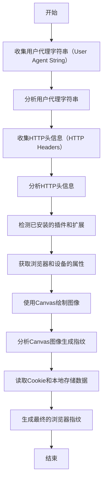

浏览器指纹是通过收集和分析浏览器的各种属性和行为来创建一个唯一的标识符，以便识别和追踪用户。以下是一些常用的浏览器指纹技术和实现方法：

1. 用户代理字符串（User Agent String）：每个浏览器在发送HTTP请求时都会包含一个用户代理字符串，其中包含了浏览器的类型、版本和操作系统等信息。通过分析这个字符串，可以初步识别用户使用的浏览器。
2. HTTP头信息（HTTP Headers）：浏览器在发送HTTP请求时会附带一些头信息，如Accept-Language、Referer、Accept-Encoding等。这些头信息的值可以用来识别浏览器和用户的偏好设置。
3. 插件和扩展（Plugins and Extensions）：浏览器插件和扩展是在浏览器中安装的第三方软件，它们可以提供额外的功能和特性。通过检测已安装的插件和扩展，可以对浏览器进行进一步的识别。
4. JavaScript API：浏览器中的JavaScript API可以提供一些关于浏览器和设备的信息，例如浏览器窗口的大小、屏幕分辨率、时区、是否支持某些功能等。通过使用这些API，可以获取更多与浏览器相关的属性。
5. Canvas指纹（Canvas Fingerprinting）：Canvas是HTML5中的一个功能，用于绘制图形和图像。通过使用Canvas API绘制一些隐含的图像，然后检查图像像素的特征，可以生成一个与浏览器相关的指纹。
6. Cookie和本地存储：浏览器中的Cookie和本地存储可以用来存储一些关于用户的信息。通过读取和分析这些存储数据，可以获取与浏览器和用户相关的特征。

需要注意的是，浏览器指纹并非完全可靠，因为一些属性和行为可能会受到用户的更改或者浏览器的更新而发生变化。此外，浏览器指纹技术也存在隐私问题，因为它可以被用于跟踪用户的在线活动。因此，在使用浏览器指纹技术时应遵守相关的隐私政策和法规，确保用户的隐私得到保护。

当涉及到浏览器指纹的实现时，下面是一个简单的执行流程图，展示了常见的浏览器指纹技术和实现方法的一般顺序。

